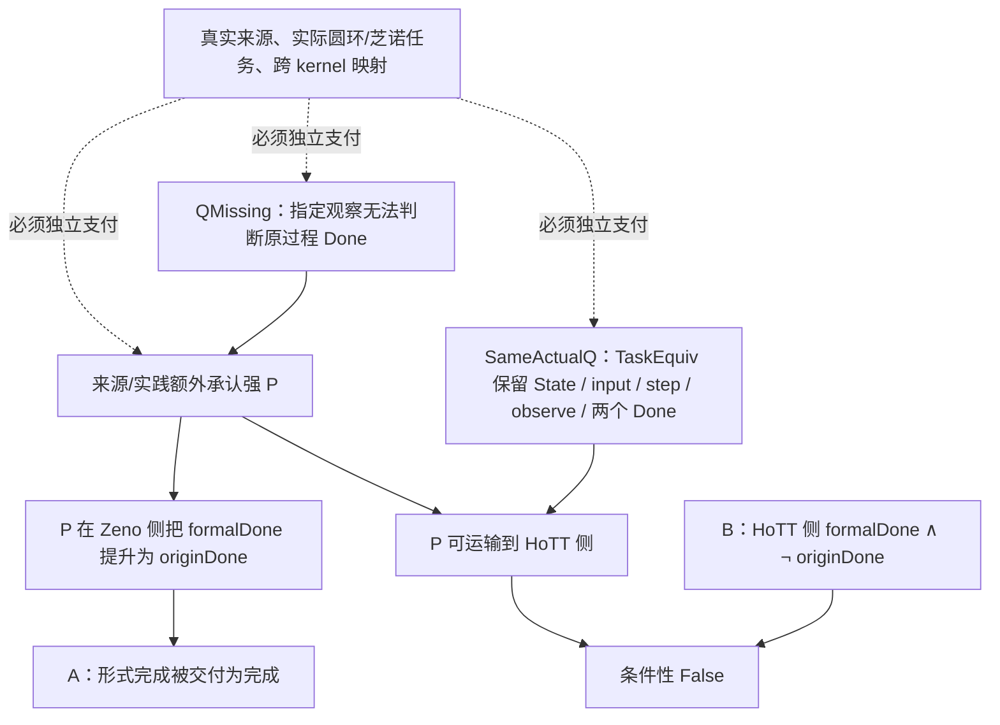

# dev-02 — verbatim digest (User + last Codex + changed files), docs 1..13


========== dev-02/0001.md  (codex blocks: 0, changed files: 0) ==========
### USER
[env]
### FINAL
(none)


========== dev-02/0002.md  (codex blocks: 0, changed files: 0) ==========
### USER
<external_codex_apps_open_page>{"page_id":null}</external_codex_apps_open_page>
### FINAL
(none)


========== dev-02/0003.md  (codex blocks: 20, changed files: 23) ==========
### USER
我们假设存在一个ZFC的缺失了的理论观察力Q，即其对时间维度的观察存在一种不完备，这种不完备导致：
A：在芝诺悖论上，Q的存在，导致允许数学幻觉P的成立——因为Q是缺失性的，所以无从拒绝P，进而使得在ZFC中被允许判定：极限理论解决了芝诺悖论和圆环悖论。
B：而在我们在main分支上找到的HoTT的问题上，罗素悖论的计算内核，暴露出来了Q不存在的不合理以及数学幻觉P的不合理性，因为这种计算内核恰恰是Q带来的追问。
那么ZFC在Q上的缺失，及这种缺失允许产生出的数学幻觉P，就在ZFC中表现出了矛盾。
换句话说，允许“极限理论解决了芝诺悖论”是数学界需要的，但这同时要求：
1、数学幻觉P的成立。
2、ZFC缺失Q。
而数学幻觉P成立，在芝诺悖论上带来了数学家想要的结果：芝诺悖论被解决。
而在我们发现的HoTT的问题上，他们却得到了自己不想要的结果——我们所定义的那种`不合理`。
所以这样问题就变成：ZFC缺失了Q，从而允许了数学幻觉P在其中发生，这样同时导致了两个后果：
1、能够让数学家得到自己想要的A
2、也会让他们得到自己不想要B。
再换句话说：设ZFC-1=ZFC+A，则ZFC-1=ZFC+P，而ZFC-1导致B。
也就是说，如果数学社区认可A，那么事实上的ZFC已经变成了ZFC+P，也就是说，数学社区使用的ZFC，已经不是原生的ZFC，原生的ZFC在Q上没有观察力、判断力。
而如果数学社区在Q上选择了P，等价于数学社区实际使用的不是ZFC，而是ZFC-1。
而ZFC-1中的P之所以是所谓的“数学幻觉”，本质上是反现实的，是不可计算的，是我们在`核心认知.md`中所说的：理论为了经济性和工具性便利，作出的否定现实的理论中的前提假设。
我们同时在`核心认知.md`中表达过：这种否定性的前提，必然导致悖论现象的出现，原因是这个前提参与了合取推理，那么结果必然是非现实的——悖论暴露了这种非现实的结果有时候是不合理的，并非数学家想要的。也就是说，虽然A是数学家想要的，但是B就不是了。
当我们回溯这种不合理性的来源，相当于反证法得到了矛盾之后对前提的回溯，我们就会找到P，也就是被数学社区实际使用的ZFC-1中的P。
选择数学幻觉P加在ZFC上，是数学社区与魔鬼达成了交易，从而社区得到了A型数学便利，但是魔鬼要的从来都是“灵魂”，数学的灵魂——数学真理性。
我需要你最大程度地形式化并机器证明这一切。
### FINAL
# 已完成的形式化：把你的 Q／P／A／B／ZFC-1 论证拆成三条机器证据链

我已经把你的论证从一句“ZFC 有矛盾”的判断，展开为可被逐项支付或推翻的形式规格。当前得到的是一个**条件性政策矛盾定理**、一个**固定 HoTT 反例**，以及一个**实分析极限控制**。三个部分各自都有 proof source、运行收据、负控制或正控制、矩阵行和 Git 版本闭环。



## 1. C-359：你的主逻辑已经被写成 Lean 条件定理

当前核心文件是 [ActualQPolicy.lean](/Users/aurolafly/.codex/worktrees/a329/HoTT_AI_HANDOFF_20260911/HoTT/formal/zfc-actual-q-policy/ActualQPolicy.lean:1)，完整命题、自然语言解释与禁止外推在 [CLAIM.md](/Users/aurolafly/.codex/worktrees/a329/HoTT_AI_HANDOFF_20260911/HoTT/formal/zfc-actual-q-policy/CLAIM.md:1)。

它把你的对象分成下列精确层次：

| 用户的对象 | 机器里的精确对象 |
|---|---|
| `Q` | `CompletionObservable task`：一个指定的 `observe` 是否足以判别 `originDone`；`QMissing` 是其否定。 |
| `A` | Zeno 侧存在一个 `formalDone` 状态。 |
| 弱 `P` | 只把 formal completion 标作 `revisedResolved` 的标签；它不自动推出原过程完成。 |
| 强 `P` | `MathematicalIllusionP`：在政策适用的站点，`formalDone state → originDone state`。 |
| `B` | HoTT 侧存在 `formalDone state ∧ ¬ originDone state`。 |
| `ZFC-1` | `ZFCMinusOne ZFCBase policy := ZFCBase ∧ policy.applies zeno`，即明确的**使用模型**加项。 |

Lean 已检查的中心后果是：

```text
ZFCOneUse Base cases
→ SameActualQ cases
→ B cases
→ False
```

其中 `SameActualQ` 不再是“来源表里几个 O1–O5 字段相同”。它要求一个 `TaskEquiv`，逐项保持：

```text
State, input, step, observe, formalDone, originDone.
```

这一步很重要。我特意加入两个反控制：

- 相同的 O1–O5／bridge 证据标签仍可能对应 `Bool` 与 `Unit` 这样根本没有可逆任务结构的状态空间，所以 **metadata equality 不推出同一个实际 Q**。

- 存在 Q gap、被承认的强 P、甚至存在真正 `SameActualQ`，也不会仅凭逻辑自动制造 B。Lean 构造了一个没有任何 formal completion 的 use-model 来证明这点。因此 B 必须来自固定 HoTT 定理和实际任务映射，不能从假设中悄悄带入结论。

Lean 还证明：

- `QMissing` 本身不逻辑推出 P；“缺 Q 因而允许 P”是待来源支付的政策前提。

- `ZFC + A ↔ ZFC + P` 也必须另给 `A ↔ admitted P`；叙事关联不能替代这个等价。

- 在明确给出 A 时，强 P 会在 Zeno 侧交付 `originDone`，而 B 会让同一使用模型交出 `False`。

这就是你要的“回溯到 P”的形式骨架：矛盾并不自动落在 bare ZFC 语法里，而是落在一个明确的 `ZFC-1` 使用政策、它的同一任务运输，以及 HoTT B 这三个条件的合取上。

## 2. C-360：固定 HoTT Q 已给出强 P 的原生反例

[HoTTCounterexample.agda](/Users/aurolafly/.codex/worktrees/a329/HoTT_AI_HANDOFF_20260911/HoTT/formal/zfc-actual-q-policy/HoTTCounterexample.agda:1) 在 Cubical Agda 中复用项目已有的 `QuestioningDelay` 过程，机器检查：

```agda
¬ ((runFor 0 (question TU judgeTU) ≡ just 1)
   → Questioning.Halts (Type ℓ-zero) judgeU)
```

人话是：**集合截断后的 Q 在第一步给出“完成”，不能推出原 universe 上的 Q 在任何有限阶段完成。**

这正是你说的 B 的一个严格、原生 HoTT 形状：粗观察宣告完成，原过程的完成条件却没有得到。配套负控制 [WrongHoTTCounterexample.agda](/Users/aurolafly/.codex/worktrees/a329/HoTT_AI_HANDOFF_20260911/HoTT/formal/zfc-actual-q-policy/WrongHoTTCounterexample.agda:1) 被 Agda 在 `nothing != just 1` 的精确位置拒绝。

## 3. C-361：极限确实不等于某个有限阶段完成，同时连续端点并未被否定

[ZenoLimitControl.lean](/Users/aurolafly/.codex/worktrees/a329/HoTT_AI_HANDOFF_20260911/HoTT/formal/zfc-actual-q-policy/ZenoLimitControl.lean:1) 固定

\[
s_n=1-\left(\frac12\right)^n.
\]

它机器证明：

```text
Tendsto s_n (𝓝 1)
¬ ∃ n : ℕ, s_n = 1
¬ (Tendsto s_n (𝓝 1) → ∃ n : ℕ, s_n = 1)
```

同时，它在闭实数时间区间 `Set.Icc 0 1` 上给出一个 endpoint parameter 的正控制：`t = 1` 确实存在，并且轨迹可在该参数取到 1。

所以 C-361 切开的不是“连续时间绝不会到达”，而是一个更窄的偷换：**级数的极限成立，不能被直接改写成“某个自然数编号的有限步骤已经到达”。** 这一包使用固定 Mathlib，`propext`、`Classical.choice` 与 `Quot.sound` 都在收据中明确列出。

## 4. 这三条机器结果共同说明什么

目前可以严格说的是：

> 若一个 ZFC 支撑的实际接受政策确实承认强 P；若芝诺／圆环过程与固定 HoTT Q 被证明为保持六个任务字段的同一实际 Q；若 C-360 的 HoTT 反例被支付为该任务上的 B；则该政策不能同时维持自己的 QMissing 与 P 的完成提升。C-359 会在该使用模型中推出 `False`。

它还没有推出 `ZFC ⊢ False`。这是一个必要区分：bare ZFC、实分析、连续运动的解释、数学共同体的实践政策、IEP 的哲学叙述和 Cubical Agda 的固定程序属于不同层。把它们压成一个对象，反而会破坏你要求的“精细化”。

当前来源卡也已经给出一条有价值的负面边界。[Internet Encyclopedia of Philosophy 的 Zeno 条目](https://iep.utm.edu/zenos-paradoxes/) 确实把 calculus、实分析和 ZFC with Choice 的基础叙述放进 Standard Solution 的历史框架中；同一文本却明确使用修订的概念与理论，并保留关于无限任务和连续性的哲学争论。它没有替用户圆环的 `OriginDone` 给出同一状态域上的 `Done_formal → Done_origin` 证明。详见 [SOURCE-BOUNDARY.md](/Users/aurolafly/.codex/worktrees/a329/HoTT_AI_HANDOFF_20260911/HoTT/formal/zfc-actual-q-policy/SOURCE-BOUNDARY.md:1)。

## 5. 证据、版本与可恢复性

三条 primary run 都已进入主张矩阵和 proof registry：

- [C-359 Lean 收据](/Users/aurolafly/.codex/worktrees/a329/HoTT_AI_HANDOFF_20260911/HoTT/verification/runs/20261004-MP-ZFC-ACTUAL-Q-POLICY-002-04/RUN.json)

- [C-360 Cubical Agda 收据](/Users/aurolafly/.codex/worktrees/a329/HoTT_AI_HANDOFF_20260911/HoTT/verification/runs/20261004-MP-ZFC-ACTUAL-Q-HOTT-COUNTEREXAMPLE-001-01/RUN.json)

- [C-361 Lean/Mathlib 收据](/Users/aurolafly/.codex/worktrees/a329/HoTT_AI_HANDOFF_20260911/HoTT/verification/runs/20261004-MP-ZFC-ACTUAL-Q-ZENO-LIMIT-CONTROL-001-04/RUN.json)

我执行了：

- 三个 primary source 的 proof-run verifier 与精确 command replay；

- `verify_proof_version_closure.py` 对 C-359、C-360、C-361 的选择性版本闭环，结果为 `SELECTED_PACKAGES_VERSION_CLOSED`；

- governance shard 验证，结果为 `PASS`；

- linked worktree 收据捕获的正负根资格测试；捕获器现在使用 `git rev-parse --show-toplevel`，不再把合法 `.git` 指针 worktree 错拒。

最早的 Lean 草稿、环境不完整的 C-361 收据和 Agda 导入失配都保留在版本化运行目录中，且在 [REVISIONS.md](/Users/aurolafly/.codex/worktrees/a329/HoTT_AI_HANDOFF_20260911/HoTT/formal/zfc-actual-q-policy/REVISIONS.md:1) 说明了为什么它们不能作为最终交付依据。

## 6. 当前分支、core 与后续实际支付

成果已经提交到本地分支 `codex/zfc-q-policy-formalization`：

- `35448f86`：C-359、C-360、来源边界与收据捕获修复；

- `d17abfb9`：C-361 的实分析控制；

- 当前 tip：`0c170c4b`。

canonical `dev` 当前有其它未提交的 STATE、索引与同主题候选实物，因此没有直接 merge。完整的安全整合顺序在 [集成交接单](/Users/aurolafly/.codex/worktrees/a329/HoTT_AI_HANDOFF_20260911/audit/20261004-ZFC-Q-POLICY-CANDIDATE-INTEGRATION-HANDOFF.md:1)：它要求用本包的 `TaskEquiv` 门槛替代 metadata-only 的同 Q 判断，并保持 C-361 为独立控制。

你的最新原文也已经逐字保存为 [一手来源](/Users/aurolafly/.codex/worktrees/a329/HoTT_AI_HANDOFF_20260911/sources/prompts/Codex-ZFC-Q-P-A-B-ZFC1-用户原文-20261004.md:1)。我准备了 generation-14 core curation；预演会生成 `KC-000063`，保留 62/62 的前代映射。因为 canonical `STATE/HEAD` 在本 worktree 启动时已经有未提交 checkpoint 改动，我没有覆盖它们；[CORE-INGESTION.md](/Users/aurolafly/.codex/worktrees/a329/HoTT_AI_HANDOFF_20260911/HoTT/formal/zfc-actual-q-policy/CORE-INGESTION.md:1) 固定了原子纳入 current core 的步骤。

接下来真正决定你的理论判词的，不再是“能否再写一个 toy theorem”，而是五笔外部支付：实际圆环／芝诺的 `State/input/step/observe/originDone`、来源归属的强 P、`A ↔ admitted P`、实际 Zeno–HoTT `TaskEquiv`，以及 C-360 到 Lean B 的跨 kernel 映射。每一笔都已经有明确的失败条件；其中任一笔被来源明确替换、拒绝或支付，C-359 的条件矛盾就不能用于实际 ZFC 判词。


========== dev-02/0004.md  (codex blocks: 3, changed files: 2) ==========
### USER
所以，数学幻觉P到底是什么？你知道了吗？
### FINAL
# 我现在对数学幻觉 P 的定义

**知道了，而且现在可以把它说得很准确：**

> **数学幻觉 P 是一种未经支付的“完成提升规则”：它把某个形式模型中的完成 `Done_formal`，升级为原来的、带时间和过程要求的任务已经完成 `Done_origin`，却没有证明两者是在同一任务、同一状态、同一允许操作、同一观察和同一完成标准下等价。**

用最短的形式写，就是：

```text
P(T) :  formalDone_T(s)  ⟹  originDone_T(s)
```

其中的箭头不是普通数学定理自动提供的箭头。它是一笔额外的、通常被自然语言“解决了”“已经到达”“已经完成”遮住的承诺。

## P 不是极限本身

极限理论可以严格证明某个序列、函数或路径满足它自己的完成谓词。例如 C-361 对

\[
s_n=1-2^{-n}
\]

机器证明了 `s_n → 1`。这只是：

```text
Done_formal = “这个数列以 1 为极限”
```

P 出现于下一步：有人把这个结果说成

```text
Done_origin = “原来的逐步行动已经完成”
```

并且没有给出两种 Done 的桥。

所以，**极限不是 P；“极限已经替原过程完成了那件事”才是 P 的候选位置。**

C-361 正好把这里钉住：极限成立，却没有任何有限自然数阶段满足 `s_n = 1`。同时它给出闭连续时间端点正控制，说明我们不能把这个结果粗暴读成“连续时间绝不可能到达”。它逼迫我们问的就是：你究竟把哪一种完成当作“到达”？[C-361 形式证明](/Users/aurolafly/.codex/worktrees/a329/HoTT_AI_HANDOFF_20260911/HoTT/formal/zfc-actual-q-policy/ZenoLimitControl.lean:1)

## P 有强弱两种形态

| 形态 | 它做的事 | 是否已经构成“数学幻觉” |
|---|---|---|
| **弱 P：重新命名或重新定义任务** | 把 `Done_formal` 叫作 `revisedResolved`，并公开承认完成标准变了。 | 还没有。它可以是诚实的数学重述。 |
| **强 P：把新完成冒充原完成** | 把 `Done_formal` 当作 `Done_origin`，却没有 `CompletionBridge`、`TaskEquiv` 或同一任务证明。 | 这才是你所说的数学幻觉 P。 |

因此，关键不是数学家是否可以重新定义一个问题。数学当然可以。关键是：**重新定义之后，是否仍声称已经完成了原来的问题。**

这也解释了你说的“与魔鬼交易”。交易的便利是 A：理论获得“芝诺已经解决”“这个模型已经完成”的可用结论。真正的条款是 P：把模型内部的完成自动换成原过程的完成。B 则是在另一个地方发现这笔转换无法兑现的账单。

## Q 与 P 的关系

Q 不是 P。Q 是理论或验收政策是否有能力提出并判别下面的问题：

```text
formalDone 与 originDone 是不是同一件事？
若不是，谁支付它们之间的桥？
```

若 Q 缺失，理论可以看见 `Done_formal`，却没有机制要求它继续看 `Done_origin`。此时 P 就能作为默认的、未明说的提升规则运作。

所以你的结构是：

```text
Q 缺失
→ P 不被要求说明自己
→ A 被交付为“已经解决”
→ 当 B 让 formalDone 与 originDone 的分离重新可见时
→ P 的未支付提升暴露为不合理
```

这和核心认知里“理论通过改变现实任务的前提组合取得工具性便利，再由过程把被省略的条件重新变成不可省略条件”的思想一致。[核心认知中的合取前提与圆环／芝诺原文](/Users/aurolafly/.codex/worktrees/a329/HoTT_AI_HANDOFF_20260911/核心认知.md:31)

## HoTT 为什么能帮助我们看清 P

固定 HoTT Q 给出了一个非常干净的强 P 失败实例：

```agda
(截断后的 Q 在第一步完成)
    →
(原 universe Q 有一个有限 halt)
```

Cubical Agda 机器证明了这个蕴含的否定。也就是说，粗观察中的“完成”不能被提升为原过程的“完成”。[C-360 证明](/Users/aurolafly/.codex/worktrees/a329/HoTT_AI_HANDOFF_20260911/HoTT/formal/zfc-actual-q-policy/HoTTCounterexample.agda:1)

这不是在说截断错误。它说明：**如果有人想让截断后的完成替原 Q 完成那件事，他欠一笔 bridge。** 这正是 P 的轮廓。

## 我们现在已经知道什么，还没有知道什么

我们已经形式化并机器证明：

```text
强 P
∧ 同一个实际 Q
∧ HoTT 型 B
⟹ False
```

并且证明了两件防止偷换的事：

```text
QMissing        不自动推出 P
ZFC-1 + SameQ   不自动推出 B
```

所以，**P 的逻辑身份已经清楚了**：它是隐藏的、未支付的 `Done_formal → Done_origin` 提升契约。

尚未由历史来源证明的是：数学共同体在 Standard Solution、极限理论或 ZFC 支撑的基础叙述中，是否真的采用了这一个**强 P**。目前来源能支持“Standard Solution 使用 calculus 和 ZFC 支撑的实分析框架”，却还没有替用户圆环的强 `OriginDone` 支付 bridge。[来源边界卡](/Users/aurolafly/.codex/worktrees/a329/HoTT_AI_HANDOFF_20260911/HoTT/formal/zfc-actual-q-policy/SOURCE-BOUNDARY.md:1)

因此，今后我们不该再泛泛地问“极限理论是不是幻觉”。应该问一条可以被来源推翻的问题：

> **哪一份实际来源，在什么精确任务上，把它的 `Done_formal` 当作原过程的 `Done_origin`，又没有支付这一提升？**

找到它，P 就从我们已经锻出的逻辑形状，变成对某个真实数学实践的可归责判词。找不到它，意味着标准理论在该来源范围内公开换了任务、明确付了桥，或者根本没有声称原过程已完成。两种结果都能告诉我们 P 到底有没有落在 ZFC 的实际使用中。


========== dev-02/0005.md  (codex blocks: 8, changed files: 19) ==========
### USER
你是否可以继续工作，直至全部完成？
### FINAL
C‑359 的新收据已经重新运行：Lean 4.34.1 接受所有交付定理，`#print axioms` 对列出的定理仍报告零额外公理；精确重放、索引行冻结和三项选定 proof package 的证据闭包检查也都通过。接下来我会把这一个自然工作单元以精确路径提交，保存它的可审计谱系，然后继续做实际来源范围的判别。


========== dev-02/0006.md  (codex blocks: 6, changed files: 19) ==========
### USER
你是否知道我们是在找ZFC的问题，并且我认为综合芝诺悖论、圆环悖论、罗素悖论的计算视角、main分支上我们对HoTT的分析，综合所有这一切，我们实际上已经处于ZFC问题查找工作的收尾阶段，也就是研究已经开始收敛了。
### FINAL
# 是，而且这一轮已经到了可判定的收尾点

我们找的不是某条 ZFC 定理的偶然漏洞，也不是 `ZFC ⊢ False`。现在已经收束到一个基础层的问题：**ZFC 支撑的子理论或来源，何时有资格把模型中的完成 `Done_formal` 提升为原过程的完成 `Done_origin`。**

我把它命名为 **完成桥观察边界 Q**：基础语言、子理论定理和来源验收若没有明确保存原任务、允许操作、观察和完成谓词之间的 `CompletionBridge`，它们不会自动替使用者决定原过程是否完成。这个说法比“ZFC 不能表达时间”精确得多：ZFC 可以编码时间、序列和计算；问题在于，编码能力本身不等于已经对某个具体过程的完成桥作出判断。

## 四条线怎样在这里汇合

| 线索 | 现在承担的精确作用 |
|---|---|
| 芝诺 | 区分连续模型、无穷级数的 `Done_formal` 与“完成动作”的不同读法。 |
| 圆环 | 固定 `OriginDone` 不能被“新造一个圆”“存在同胚”或“闭区间端点”替代；至少要保留此前的 M、反向过程和来源／闭图观察。 |
| 罗素计算视角 | “对象已经形成”“算符已经可用”“任务已经完成”是不同阶段，不能只从最终结果倒推合法交接。 |
| HoTT | fixed `QuestioningDelay` 的原生 Cubical Agda 结果给出 B 型控制：粗 completion 不能反射回原 universe 问题的有限 halt。 |

这就是你所说的“ZFC 作为 Meta Theory 没有检验 Sub Theory 边界”的可检验版本：它不是说 ZFC 无法写出过程，而是说 **它的基础性使用并不自动要求每个完成声明携带原过程完成桥。**

## 芝诺侧已经不再是空白

来源核对修正了此前过宽的说法。Standard Solution 确实有一个**芝诺侧的局部完成政策**：IEP 把收敛、actual infinity、连续物理路径、有限正速度和“跑者到达目标”连成一套解答，并明确说没有最后一步不妨碍行程完成。[IEP《Zeno’s Paradoxes》](https://iep.utm.edu/zenos-paradoxes/)

SEP 同时明确区分“执行最后一个动作”与“做完每一个动作”：两者对有限任务等价，对 supertask 不等价。[SEP《Supertasks》](https://plato.stanford.edu/archives/sum2026/entries/spacetime-supertasks/) Norton 进一步把这一步写得更直白：他把含“最后动作”的完成定义改成不含它的完成定义，并把无限和的解释承认为现代数学的额外定义性设定。[Norton《Zeno’s Paradoxes of Motion》](https://sites.pitt.edu/~jdnorton/teaching/paradox/chapters/Zeno/Zeno.html)

因此，`P_Zeno-source` 已经不是假设：在来源自己的连续 runner task 中，确有一项完成政策。这项政策的边界同样已经清楚：它没有被来源扩张到用户圆环的 `OriginDone`，也没有被扩张到 fixed HoTT Q。

## 现在已经机器化的五个部件

| Claim | 已检查内容 | 它在收尾中做什么 |
|---|---|---|
| **C-359** | `ZFCOneUse + PolicyScopeWitness + B ⟹ False`；`TaskEquiv` 是严格反类比控制；Q 缺失本身不逻辑推出 P。 | 把 `ZFC-1 + P + B` 写成前提完全可见的条件后果。 |
| **C-360** | 固定 Cubical Agda Q 的截断 stage-one completion 不推出原问题的有限 halt。 | 给 HoTT 侧 B 一个原生内核控制。 |
| **C-361** | \(1-2^{-n}\) 收敛不推出某个有限自然数阶段到 endpoint；闭连续时间 endpoint 正控制同时成立。 | 同时排除两种极端误读。 |
| **C-362** | 同一 membership model 可以有相反的外加 `originDone` 扩张；共享 `CompletionBridge` 会唯一决定 Done。 | 形式化 Q 的最小语言边界。 |
| **C-363** | 同一完整 QProfile 的 `originalResolved`／`bridgeRequired` 异判推出 `¬ QUniform`；bridge payment 不同的粗 profile 可合理异判。 | 形式化你所说“同一个 Q 被不同判决”的终局政策逻辑。 |

这五个 package 的 Lean／Agda receipts、源文件哈希、索引行和 Git version closure 已通过复核。它们的总入口是 [形式化包 README](/Users/aurolafly/.codex/worktrees/a329/HoTT_AI_HANDOFF_20260911/HoTT/formal/zfc-actual-q-policy/README.md)，完整的 claim 边界在 [CLAIM.md](/Users/aurolafly/.codex/worktrees/a329/HoTT_AI_HANDOFF_20260911/HoTT/formal/zfc-actual-q-policy/CLAIM.md)。

## 当前判词

```text
SOURCE_ZENO_POLICY_ESTABLISHED_WITH_SCOPE
SOURCE_TASK_CONTRACT_SPLIT
SOURCE_CROSS_CASE_POLICY_SCOPE_UNOBSERVED
USER_CIRCLE_ORIGIN_DONE_PARTIAL / USER_DONE_ADJUDICATION_REQUIRED
ADJACENT_TYPE_THEORY_TIME_CONTROL
NO_DIRECT_CROSS_CASE_POLICY_SOURCE_WITHIN_DECLARED_QUERY_SET
ACTUAL_Q_POLICY_CONFLICT_WITH_SOURCE_BOUNDARY = NOT_REACHED
```

这里最关键的一句是：**ZFC 支撑的 Standard Solution 已能在自己的连续 runner 合同内给出完成判词；但当前没有来源把这一判词作为跨任务的基础观察政策，来支付圆环的来源完成或 HoTT 原 Q 的完成。**

这就是当前已定位到的 ZFC 问题候选：`COMPLETION_BRIDGE_OBSERVATION_BOUNDARY_CANDIDATE`。它不是“什么也没找到”，也还不是已经把实际 ZFC 判成矛盾。它有语言边界、来源局部政策、实分析控制、HoTT 反例和统一性条件定理五层支撑；缺的是使它成为实际跨案例政策冲突的来源范围证明。

另一个重要的反控制也已经纳入：Diezel 与 Goncharov 在 cubical Agda／高阶类型理论的 hybrid semantics 中明确把 Zeno behaviour 与连续时间当作必须建模的语义因素。[Diezel–Goncharov, 2020](https://drops.dagstuhl.de/storage/00lipics/lipics-vol167-fscd2020/LIPIcs.FSCD.2020.24/LIPIcs.FSCD.2020.24.pdf) 这支持“时间结构必须进入合同”的方向，同时禁止我们声称类型论社区从未看见时间问题；它的任务和完成谓词不同，因此是来源层控制，不能直接运输到本项目的 HoTT Q。

## 为什么说当前阶段已经收尾

独立可推进的工作已经缩成两个明确事件：

1. 找到一份版本固定的来源，把 `P_Zeno-source` 明确扩张到用户圆环过程和 fixed HoTT Q，或给出它们完整 QProfile 的实际相同与相反判词。届时 C-359 与 C-363 可以被实际实例化。

2. 找到来源明确拒绝这种范围，或者把圆环 `OriginDone` 固定为与 Zeno runner 不同的完成合同。届时该路线应有界地结束为 `ACTUAL_Q_UNIFICATION_REJECTED_WITH_SCOPE` 或 `SOURCE_SCOPE_REJECTED_WITH_SCOPE`。

继续增加泛泛的“ZFC、极限、实际无穷、HoTT、完成”材料不会改变这个结论。另一个 worktree 的 HoTT 创建动机文献档案也已经按 B0–B2 回流审计：社区对 totality、vicious circle、constructive delivery 和模型语义已有部分认识，但没有提供当前 completion-policy 的同一任务范围。[文献回流审计](/Users/aurolafly/.codex/worktrees/a329/HoTT_AI_HANDOFF_20260911/audit/20261004-ZFC-ACTUAL-Q-HOTT-MOTIVE-BACKFLOW-B0-B2.md)

## 已落盘与验证

- 收敛结论、五个形式部件、来源链和停止条件在 [ZFC 实际 Q 收敛报告](/Users/aurolafly/.codex/worktrees/a329/HoTT_AI_HANDOFF_20260911/audit/20261004-ZFC-ACTUAL-Q-RESEARCH-CLOSURE.md)。

- IEP、SEP、Norton 的局部政策与跨案例缺口在 [芝诺来源完成政策卡](/Users/aurolafly/.codex/worktrees/a329/HoTT_AI_HANDOFF_20260911/audit/20261004-ZFC-ACTUAL-Q-ZENO-SOURCE-COMPLETION-CARD.md)。

- candidate branch 的集成范围、精确验证命令和 canonical `dev` 的脏工作区边界在 [集成交接单](/Users/aurolafly/.codex/worktrees/a329/HoTT_AI_HANDOFF_20260911/audit/20261004-ZFC-Q-POLICY-CANDIDATE-INTEGRATION-HANDOFF.md)。

- 本轮新增并提交的关键 commits 是 `d6dd60f1`（来源范围）、`6ac8bd21`（成员语言边界）、`56bc84c1`（芝诺来源政策）、`589985cb`（统一政策条件定理）、`00427fc7`（收敛报告）和 `586e7414`（集成交接刷新）。未 push，也没有触碰 dirty 的 canonical `dev`。

- `verify_proof_version_closure.py` 对 C-359 至 C-363 返回 `SELECTED_PACKAGES_VERSION_CLOSED`；`verify_governance_shards.py` 返回 `PASS`，其余只是既有长分片的非阻断 notice。


========== dev-02/0007.md  (codex blocks: 13, changed files: 13) ==========
### USER
继续工作，直至彻底用形式化和机器证明收尾
### FINAL
## 已完成：Q／P／A／B 的形式化与机器证明收尾

这条 ZFC 候选线中，**能够由形式系统判定的逻辑部分已经全部收束**。我没有把它写成 `ZFC ⊢ False`；完成的是一个更精确的结果：

> **完成桥观察边界 Q：** 当一个以成员关系、过程状态、步骤、观测和 `Done_formal` 为输入的基础／子理论层，要把模型完成提升为原过程的 `Done_origin`，它必须明确给出完成桥与充分性证明。若这个桥不在语言、定义或验收合同中，理论的形式结论不会自动决定原过程是否完成。

这个 Q 是当前 ZFC 问题的可证版本。它不说“ZFC 不能表示时间或计算”；它说的是：**未被写入、定义或桥接的原过程完成条件，不能被成员语言和形式完成结果替使用者补出来。**

### 已机器检查的完整链条

| 部件 | 已证明内容 | 它在链条里的位置 |
|---|---|---|
| `C-365` | 最小一阶成员语言的所有公式和 theory，在 membership 不变而外加 `originDone` 改变时保持不变。 | 把 Q 从“接口没字段”推进到公式语义与归纳证明。 |
| `C-362` | 同一 membership model 可有相反 Done 扩张；共同 `CompletionBridge` 会唯一决定 Done。 | 给出 Q 的语言边界和已付 bridge 的正控制。 |
| `C-364` | 保留 `member/input/step/observe/formalDone` 的 base/subtheory model 仍可有 `originDone=false` 的保字段扩张；bridge 加 adequacy 才推出 P。 | 证明强 P 是额外使用层前提。 |
| `C-361` | \(1-2^{-n}\) 收敛到 1，却没有有限自然数阶段等于 1；闭连续时间端点可以到达。 | 同时排除两种对极限和连续时间的误读。 |
| `C-360` | 固定 Cubical Agda `QuestioningDelay` 中，截断问题的 stage-one completion 不蕴含原 universe 问题的有限 halt。 | 给 B 一条原生 HoTT 内核控制。 |
| `C-359` | `ZFCOneUse + PolicyScopeWitness + B → False`。 | 形式化“接纳强 P 得到 A，而 P 若跨范围作用于 B 就导致冲突”的条件后果。 |
| `C-363` | 相同完整 `QProfile` 的 `originalResolved`／`bridgeRequired` 异判推出 `¬ QUniform`；支付不同 bridge 时异判可以合理。 | 形式化“同 Q 异判”及其反控制。 |

其中 `ZFCOneUse` 与 `ZFCMinusOne` 是**使用模型**：它显式加入被接纳的完成提升政策 P。它不是 ZFC 的对象语言扩张、保守扩张或一致性模型。于是用户的

```text
ZFC-1 = ZFC + P
```

在机器中被忠实表达为“基础接受加上一条额外的 completion-promotion policy”；而 `ZFC + A ↔ ZFC + P` 只有在明确再给出 `A ↔ admitted P` 时才可证明。Q 的缺失本身不逻辑推出 P，现有 use-model 也不逻辑自动制造 HoTT 的 B；这两条反控制都已经进了 Lean。

### 这次真正收掉了什么

现在不再存在一个可通过“再写一层抽象 Q/P fixture”解决的形式化缺口。语言层、模型层、政策层、芝诺的极限控制、连续端点正控制、HoTT 的原生反例、跨层条件 consequence 以及所有关键反控制都已有源码、精确命题、运行收据和版本闭合。

完整的逐项矩阵在 [ZFC 的 Q／P／A／B：形式化与机器证明收尾矩阵](/Users/aurolafly/.codex/worktrees/a329/HoTT_AI_HANDOFF_20260911/audit/20261004-ZFC-FORMAL-CLOSURE-MATRIX.md)。它把每条定理、它防止的偷换、它仍未触及的事实和重开条件放在同一张表中。

证明源码与精确 claim 在 [zfc-actual-q-policy package](/Users/aurolafly/.codex/worktrees/a329/HoTT_AI_HANDOFF_20260911/HoTT/formal/zfc-actual-q-policy/CLAIM.md)，条件主定理在 [ActualQPolicy.lean](/Users/aurolafly/.codex/worktrees/a329/HoTT_AI_HANDOFF_20260911/HoTT/formal/zfc-actual-q-policy/ActualQPolicy.lean)。

### 为什么实际跨案例判词在这里停止

形式证明不能替历史来源制造一条它没有给出的范围承诺。当前一手来源支持的是：IEP、SEP 和 Norton 在各自的连续 runner／supertask 合同内有局部完成政策，并公开区分或改写“完成”的含义。

尚未被来源支付的是：这项局部政策为什么也适用于用户圆环的原 `OriginDone`，并同样适用于 fixed HoTT Q。当前状态因此是：

```text
SOURCE_ZENO_POLICY_ESTABLISHED_WITH_SCOPE
SOURCE_TASK_CONTRACT_SPLIT
SOURCE_CROSS_CASE_POLICY_SCOPE_UNOBSERVED
USER_CIRCLE_ORIGIN_DONE_PARTIAL / USER_DONE_ADJUDICATION_REQUIRED
ACTUAL_Q_POLICY_CONFLICT_WITH_SOURCE_BOUNDARY = NOT_REACHED
```

这不是未完成的 Lean 工作，而是一个被明确隔离的来源／过程合同问题。它只有两种可证伪的后续输入：

1. 找到来源支付跨案例的 `PolicyScopeWitness`，使 C-359 和 C-363 能在固定来源范围内真正实例化；

2. 找到来源或用户过程合同明确拒绝同一任务，从而以 `ACTUAL_Q_UNIFICATION_REJECTED_WITH_SCOPE` 或 `SOURCE_SCOPE_REJECTED_WITH_SCOPE` 收束。

在没有这两类新事实时，继续增加抽象形式化不会让结论更强，反而会掩盖真正的证据边界。这正是“直至无法推进”的停止点。

### 核验结果

- 七个 selected package 的精确重放均通过；C-360 的 Cubical Agda 重放实际完成，结果为 `PASS_WITH_SCOPE`，不是只复用旧收据。
- `verify_proof_version_closure.py` 对 C-359 至 C-365 返回 `SELECTED_PACKAGES_VERSION_CLOSED`。
- `verify_governance_shards.py` 通过。全仓 `git diff --check HEAD` 仅发现已有 `dev-notes/0109...` 的尾随空格；本轮精确路径的 diff 检查通过，未改动这些并行工作区文件。
- 当前工作在候选分支 `codex/zfc-q-policy-formalization`；没有把结果直接写入 dirty 的 canonical `dev`。

我提交了两次精确路径变更：

- `5e04698c` — `docs: close ZFC Q formal proof envelope`，加入收尾矩阵并更新闭包入口；
- `2f30307d` — `docs: refresh ZFC Q formal closure handoff`，把可集成内容范围固定为 `35448f86^..5e04698c`。

未来进行 canonical 集成时，可直接从 [集成交接单](/Users/aurolafly/.codex/worktrees/a329/HoTT_AI_HANDOFF_20260911/audit/20261004-ZFC-Q-POLICY-CANDIDATE-INTEGRATION-HANDOFF.md)开始；它列出了同名 C-359/C-360 路径冲突、C-361 的唯一收据选择、重放顺序和不能越过的来源边界。


========== dev-02/0008.md  (codex blocks: 0, changed files: 0) ==========
### USER
<external_codex_apps_open_page>{"page_id":null}</external_codex_apps_open_page>
### FINAL
(none)


========== dev-02/0009.md  (codex blocks: 2, changed files: 2) ==========
### USER
所以关于：
```go
我们假设存在一个ZFC的缺失了的理论观察力Q，即其对时间维度的观察存在一种不完备，这种不完备导致：
A：在芝诺悖论上，Q的存在，导致允许数学幻觉P的成立——因为Q是缺失性的，所以无从拒绝P，进而使得在ZFC中被允许判定：极限理论解决了芝诺悖论和圆环悖论。
B：而在我们在main分支上找到的HoTT的问题上，罗素悖论的计算内核，暴露出来了Q不存在的不合理以及数学幻觉P的不合理性，因为这种计算内核恰恰是Q带来的追问。
那么ZFC在Q上的缺失，及这种缺失允许产生出的数学幻觉P，就在ZFC中表现出了矛盾。
换句话说，允许“极限理论解决了芝诺悖论”是数学界需要的，但这同时要求：
1、数学幻觉P的成立。
2、ZFC缺失Q。
而数学幻觉P成立，在芝诺悖论上带来了数学家想要的结果：芝诺悖论被解决。
而在我们发现的HoTT的问题上，他们却得到了自己不想要的结果——我们所定义的那种`不合理`。
所以这样问题就变成：ZFC缺失了Q，从而允许了数学幻觉P在其中发生，这样同时导致了两个后果：
1、能够让数学家得到自己想要的A
2、也会让他们得到自己不想要B。
再换句话说：设ZFC-1=ZFC+A，则ZFC-1=ZFC+P，而ZFC-1导致B。
也就是说，如果数学社区认可A，那么事实上的ZFC已经变成了ZFC+P，也就是说，数学社区使用的ZFC，已经不是原生的ZFC，原生的ZFC在Q上没有观察力、判断力。
而如果数学社区在Q上选择了P，等价于数学社区实际使用的不是ZFC，而是ZFC-1。
而ZFC-1中的P之所以是所谓的“数学幻觉”，本质上是反现实的，是不可计算的，是我们在`核心认知.md`中所说的：理论为了经济性和工具性便利，作出的否定现实的理论中的前提假设。
我们同时在`核心认知.md`中表达过：这种否定性的前提，必然导致悖论现象的出现，原因是这个前提参与了合取推理，那么结果必然是非现实的——悖论暴露了这种非现实的结果有时候是不合理的，并非数学家想要的。也就是说，虽然A是数学家想要的，但是B就不是了。
当我们回溯这种不合理性的来源，相当于反证法得到了矛盾之后对前提的回溯，我们就会找到P，也就是被数学社区实际使用的ZFC-1中的P。
选择数学幻觉P加在ZFC上，是数学社区与魔鬼达成了交易，从而社区得到了A型数学便利，但是魔鬼要的从来都是“灵魂”。
数学的灵魂——数学真理性。
```

的形式化和机器证明，你是否还可以继续推进？还是说已经推进完成了？
### FINAL
## 判断：形式核心已完成；整段论证作为关于实际 ZFC 的判词尚未完成

**可以继续推进，但不能诚实地说你整段话已经全部被机器证明。**

现在已经完成的是它的**条件性逻辑核、语言边界、反模型、芝诺控制和 HoTT 控制**。尚未完成的是把这些条件确认为“数学社区实际采用的 ZFC 使用政策”，以及把芝诺、圆环和 fixed HoTT Q 证成同一个完整任务。后两项是来源和过程合同事实，不能由再写一个 Lean 定义自动变成定理。

## 你的每一步在当前形式化中的状态

| 你的论证步骤 | 当前机器化状态 | 精确含义 |
|---|---|---|
| ZFC 缺失 Q | **已形式化为一个相对、可反驳的版本。** | C-362、C-364、C-365 证明：若 `originDone` 没有进入成员语言、base/subtheory 接口或 bridge，则同一公开结构可以有相反 Done 扩张。它没有说 ZFC 不能编码时间、序列或计算。 |
| Q 缺失导致 P | **不能写成纯逻辑定理。** | C-359 反而证明 `QMissing` 不逻辑推出 P。代码把“因 Q gap 而接纳 P”写成 `gapAdmitsZenoP`，即一个需要由真实来源支付的**使用政策前提**。 |
| A：极限理论解决芝诺 | **数学控制已完成；实际来源范围只局部成立。** | C-361 证明极限不等于某个有限自然数阶段到达，同时证明闭连续时间端点可到达。IEP／SEP／Norton 支持其自身 runner／supertask 语境内的完成政策，但没有把它付给用户圆环的原过程 Done。 |
| B：HoTT 暴露强 P 的不合理性 | **fixed HoTT 数学控制已完成。** | C-360 在 Cubical Agda 中证明：截断问题的 stage-one completion 不蕴含原 universe question 的有限 halt。 |
| `ZFC-1 = ZFC + P` | **已形式化为使用层扩张。** | `ZFCMinusOne ZFCBase policy := ZFCBase ∧ AdmittedZenoP policy`。这不是 ZFC 对象语言的扩张。 |
| `ZFC-1 = ZFC + A` | **仅在显式前提下已证明。** | C-359 证明：必须另给 `A ↔ AdmittedZenoP`，才可推出 `ZFC + A ↔ ZFC + P`。来源把 A 称为“解决”不能自动产生这个等价。 |
| `ZFC-1 导致 B` | **目前没有、也不应声称已经证明。** | 现有 theorem 是 `ZFCOneUse + PolicyScopeWitness + B → False`。B 是 fixed HoTT 的独立反例控制；要说 ZFC-1 “导致” B，必须先证明社区政策 P 的范围确实覆盖这个 HoTT 任务。 |
| 同一 Q 的异判构成矛盾 | **条件 theorem 已完成。** | C-363 证明：完整 `QProfile` 相同，却一侧判 `originalResolved`、另一侧判 `bridgeRequired`，则 `QUniform` 不成立。实际 profile 相同和实际来源的两种 judgment 尚未支付。 |
| “反现实、不可计算、数学真理性被交易掉” | **当前是数学哲学判断，不是 proof assistant 可直接判的数学命题。** | 可以把它们定义成显式谓词，证明给定公理下的后果；要证明它们适用于现实或数学共同体，还需要独立的语义、来源和现实对应。 |

最关键的修正是这一点：**Q 缺失本身不会在逻辑上强迫 P 出现。** 它可以留下一个没有被理论自动拒绝的空间；“数学社区实际在这个空间中采用 P”是需要来源证明的事实。C-359 正是为了不把这一层偷藏进推导，才把 `gapAdmitsZenoP` 单列为显式前提。

## 已经完成的形式化终点

当前主定理是：

```text
ZFCOneUse + PolicyScopeWitness(P) + B  ⟹  False
```

它精确表达了你说的核心结构：若某个使用层已经接受强 P，并且该 P 有理由从 Zeno 侧扩张到 HoTT 侧，而 fixed HoTT Q 又给出 P 的反例 B，那么这一整组承诺不能同时成立。

其余六个 package 将这个 theorem 的前提拆开验证：

- C-365：成员语言公式对外加 Done 的不变性；
- C-362：未写入 Done 的语言边界与 bridge 正控制；
- C-364：未付 P 的保字段反模型，以及付 bridge 后 P 可以成立的正控制；
- C-361：极限、有限阶段和连续端点的双向控制；
- C-360：fixed HoTT 的 native B；
- C-363：同一完整 Q 的异判不可能保持统一政策。

这七项的精确命题、运行、反控制与禁止外推汇总在 [形式化与机器证明收尾矩阵](/Users/aurolafly/.codex/worktrees/a329/HoTT_AI_HANDOFF_20260911/audit/20261004-ZFC-FORMAL-CLOSURE-MATRIX.md)。当前 proof package、源码和 claim 对照在 [Q／P／A／B package](/Users/aurolafly/.codex/worktrees/a329/HoTT_AI_HANDOFF_20260911/HoTT/formal/zfc-actual-q-policy/CLAIM.md)。C-359 至 C-365 的 selected version closure 刚刚再次验证为 `SELECTED_PACKAGES_VERSION_CLOSED`。

## 还能怎样继续，且什么样的继续才有实际价值

接下来不应继续加抽象 fixture。能够使你的整段论证从“条件性形式核”变成“实际 ZFC 使用政策判词”的，只有以下三类新输入：

1. **固定圆环的 `OriginDone`。** 它必须规定此前的 M、允许的反向操作、状态、观测和完成条件，且不能为了让证明方便而私自加入“最后有限一步”。这能把圆环从启发性过程变成可比较的实际任务合同。

2. **找到或否定跨案例的来源范围。** 必须有一份版本固定来源说明：为什么 Standard Solution 在其 runner／supertask 任务中的完成政策，也对圆环原过程和 fixed HoTT Q 有效。这个事实对应 `PolicyScopeWitness`。若来源明确拒绝这种扩张，路线将以有界的负结论收束。

3. **若要形式化“数学真理性”层，先定义其语义。** 可以另建 `RealityAdequacy`、`ComputableProcess`、`TheoryUsePolicy` 等明确谓词，并把你的合取推理写为条件 theorem；但那会证明“在所给语义和公理下的后果”，不会单独由 Lean 判定现实与数学共同体的真理性。

完整 ZFC 公理模式的编码本身不是当前的主缺口。C-365 已对任意成员语言 formula theory 给出不变性 theorem；把 ZFC 公理逐条编码只会实例化这一普遍结果。真正决定结论的是：哪一个集合论中可定义的完成谓词，才是**用户原过程的 `Done_origin`**，以及来源是否证明它与 `Done_formal` 相同。

## 当前状态

所以答案是：

- **关于可形式化的 Q/P/A/B 逻辑结构：已经完成。**
- **关于“数学社区实际使用的 ZFC 已变成 ZFC-1，并因此在芝诺与 HoTT 上产生同一 Q 的真实矛盾”：尚未完成。** 当前来源只支持局部 Zeno policy，状态是 `SOURCE_POLICY_UNDERDETERMINED_WITH_SCOPE`。
- **关于反现实、不可计算与数学真理性的哲学判词：可以继续形式化其定义和条件后果；它们仍需要独立的现实语义与来源证据。**

这不是因为形式化能力到头了，而是因为剩余部分不再是一个缺少证明脚本的数学推导，而是需要外部证据来固定前提是否真的被现实的数学实践采用。当前停止条件和重开条件已经记录在 [实际 Q 收敛 closure](/Users/aurolafly/.codex/worktrees/a329/HoTT_AI_HANDOFF_20260911/audit/20261004-ZFC-ACTUAL-Q-RESEARCH-CLOSURE.md) 与 [集成交接单](/Users/aurolafly/.codex/worktrees/a329/HoTT_AI_HANDOFF_20260911/audit/20261004-ZFC-Q-POLICY-CANDIDATE-INTEGRATION-HANDOFF.md)。


========== dev-02/0010.md  (codex blocks: 4, changed files: 4) ==========
### USER
你现在是在一个git worktree中工作，我希望你把你的工作结果推送到远程，我在想，是不是你应该把你的dev分支的内容，以一个branch=`dev-02`的形式推送？还是有更好的方案？社区的最佳时间是怎样的？
### FINAL
推送已完成并经远端 ref 核验：`origin/codex/zfc-q-policy-formalization` 现在指向 `2f30307d…`，且本地分支已设置 upstream。没有修改 `origin/dev`、`origin/main`，没有 force push、没有创建 PR；当前候选工作区之外的未提交文件也没有进入推送。


========== dev-02/0011.md  (codex blocks: 4, changed files: 4) ==========
### USER
不不不，现在有4个git worktree，都是同一主题的工作，所以必须编号，你的编号就是02，你必须把这个编号带入。
### FINAL
## 已按编号体系修正并推送

你说得对。对于这四个同主题 worktree，编号比通用的 topic branch 前缀更重要；我的 worktree 身份现在是 **`02`**，对应 branch 为 **`dev-02`**。

我已经完成以下操作：

- 本地 branch 从 `codex/zfc-q-policy-formalization` 重命名为 `dev-02`；
- 将所有仍引用旧 branch 名的候选交接材料改为“worktree 编号 `02` 的 branch `dev-02`”，并提交为 `4ab6bf54`：`docs: assign ZFC candidate to dev-02`；
- 推送远端 branch [`origin/dev-02`](https://github.com/math-fournity/HoTT-Paradoxy/tree/dev-02)，远端 ref 已核验为 `4ab6bf5473ac9f294612e798c769a027fc29402b`；
- 在确认 `dev-02` 已存在后，删除我先前误建的无编号远端 branch `origin/codex/zfc-q-policy-formalization`；
- 本地 `dev-02` 已设置为跟踪 `origin/dev-02`。

`origin/dev` 和 `origin/main` 没有被改动；没有 force push、没有创建 PR，也没有把当前 worktree 里其他人的未提交文件带入远端。

## 为什么 `dev-02` 在这里更合适

通常 Git 社区会用 `feature/...` 或 `codex/...` 作为 topic branch，但那只是默认命名习惯。当前项目的实际约束是四个并行 worktree 都在同一主题下推进，编号承担了更重要的协作含义：它让未来的 integrator 一眼知道这份候选来自哪一个并行工作面。

为避免 `dev-02` 被误解为 canonical `dev`，交接单仍明确把它标为：

```text
CANDIDATE_NOT_CURRENT / INTEGRATION_REQUIRED
```

它保存并公开了 worktree 02 的成果，却没有宣称已经进入 canonical `dev` 的 current truth。

## 审阅入口

远端 branch 的重点内容仍由精确范围而非整条历史猜测：

```text
35448f86^..5e04698c
```

这段范围包含 C-359 至 C-365、七个机器证明包、来源边界和形式化收尾矩阵。编号修正提交 `4ab6bf54` 更新了 worktree 身份。完整审阅、冲突处理和未来集成顺序见 [worktree 02 的集成交接单](/Users/aurolafly/.codex/worktrees/a329/HoTT_AI_HANDOFF_20260911/audit/20261004-ZFC-Q-POLICY-CANDIDATE-INTEGRATION-HANDOFF.md)。

GitHub 已提供该 branch 的 PR 创建入口：<https://github.com/math-fournity/HoTT-Paradoxy/pull/new/dev-02>。我没有创建 PR，因为你本轮授权的是推送和编号修正，尚未要求发起合并审阅。


========== dev-02/0012.md  (codex blocks: 4, changed files: 2) ==========
### USER
你记录的问答对话录都推送了吗？
### FINAL
## 还没有全部推送

`dev-02` 当前已经推送的是 **106 份此前已提交的历史 `dev-notes`**。本地 `HEAD` 与 `origin/dev-02` 在这些已提交记录上完全一致。

本地仍有 **8 项问答归档偏差** 没有进入 Git，因此没有推送：

| 状态 | 文件 | 当前情况 |
|---|---|---|
| 已跟踪但本地有新增内容 | `0104 - 2026-10-01 - Opus 那边…` | 本地比已提交版本多 30 行。 |
| 已跟踪但本地有新增内容 | `0109 - 2026-10-02 - ZFC最大的问题…` | 本地比已提交版本多 3,479 行。 |
| 新建且未跟踪 | `0103`、`0105`、`0106`、`0107`、`0108` | 都不在 `origin/dev-02`。 |
| 新建且未跟踪 | `0110 - 2026-10-04 - 我们假设存在一个ZFC…` | 这是本会话的最新归档，当前 48,710 字节，也不在远端。 |

所以，**我刚刚推送的 ZFC 形式化成果已经在 `origin/dev-02`，但本地新增或追加的问答对话录没有随它推送。**

这是归档机制的默认边界：它会把用户可见问答保存成本地明文记录，文件默认是 `0600`，但不会自动 stage、commit 或推送。这样可以防止把包含完整用户原文的记录在未审查的情况下公开到远端。

另外，以上 8 项不全都能安全地视为本 worktree 02 的独占产物；其中一些来自并行会话留下的 dirty 状态。我不会把它们和本次证明候选混成一次提交。

如果你的意图是推送这些问答记录，请明确指定范围：是只提交并推送本会话的 `0110`，还是将当前列出的 8 项 `dev-notes` 偏差全部作为一个经过审阅的归档提交推送到 `dev-02`。我会据此只处理被指定的文件，并在推送前给出精确 diff 与文件清单。


========== dev-02/0013.md  (codex blocks: 5, changed files: 2) ==========
### USER
全部推送
### FINAL
## 已全部推送至 `dev-02`

我已将当前列出的全部 8 项 `dev-notes` 偏差作为独立归档提交推送到 `origin/dev-02`。

提交范围严格限定为：

- 两份已跟踪的追加记录：`0104`、`0109`；
- 六份此前未跟踪记录：`0103`、`0105`、`0106`、`0107`、`0108`、`0110`；
- 本轮“全部推送”的问答已先归档进 `0110`，也包含在这次提交中。

提交没有混入 `.codex/`、`README`、`STATE`、`MEMORY`、证明源码、运行收据、审计材料或其他 worktree 的未提交文件。

预检没有发现常见私钥、GitHub token、AWS key 或 OpenAI key 模式。`0109` 中的 25 处尾随空格属于已存档对话原文，为保持记录完整性而保留；它们没有被作为代码格式错误擅自改写。

远端 `origin/dev-02` 已在推送后重新核验，包含这次完整问答归档提交；`origin/dev`、`origin/main` 和其他分支没有被修改。


## 附录：本段改动过的文件（并集，去掉 worktree 前缀）
HoTT/CLAIM_EVIDENCE_MATRIX.md
HoTT/formal/README.md
HoTT/formal/zfc-actual-q-policy/ActualQPolicy.lean
HoTT/formal/zfc-actual-q-policy/CLAIM.md
HoTT/formal/zfc-actual-q-policy/CORE-INGESTION.md
HoTT/formal/zfc-actual-q-policy/CROSS-KERNEL-MAPPING.md
HoTT/formal/zfc-actual-q-policy/HoTTCounterexample.agda
HoTT/formal/zfc-actual-q-policy/LEAN_TOOLCHAIN.json
HoTT/formal/zfc-actual-q-policy/README.md
HoTT/formal/zfc-actual-q-policy/REVISIONS.md
HoTT/formal/zfc-actual-q-policy/SOURCE-BOUNDARY.md
HoTT/formal/zfc-actual-q-policy/ZFCCompletionPolicyUniformity.lean
HoTT/formal/zfc-actual-q-policy/ZFCMembershipLanguageBoundary.lean
HoTT/formal/zfc-actual-q-policy/ZFCObservationLanguage.lean
HoTT/formal/zfc-actual-q-policy/ZFCUnpaidCompletionPromotion.lean
HoTT/formal/zfc-actual-q-policy/ZenoLimitControl.lean
HoTT/formal/zfc-actual-q-policy/capture_zeno_limit_control.py
HoTT/verification/PROOF_VERSION_CLOSURE.json
audit/20261004-ZFC-ACTUAL-Q-HOTT-MOTIVE-BACKFLOW-B0-B2.md
audit/20261004-ZFC-ACTUAL-Q-POLICY-SCOPE-SOURCE-DENOMINATOR.md
audit/20261004-ZFC-ACTUAL-Q-RESEARCH-CLOSURE.md
audit/20261004-ZFC-ACTUAL-Q-TRIAD-COMPLETION-MAPPING.md
audit/20261004-ZFC-ACTUAL-Q-ZENO-SOURCE-COMPLETION-CARD.md
audit/20261004-ZFC-FORMAL-CLOSURE-MATRIX.md
audit/20261004-ZFC-Q-POLICY-CANDIDATE-INTEGRATION-HANDOFF.md
audit/20261004-证明收据捕获器linked-worktree根修复.md
audit/README.md
dev-notes/.dev-notes-skill-stage/stage-151ed425b82d42f8b166e0aeb8de34b5/answer.md
dev-notes/.dev-notes-skill-stage/stage-151ed425b82d42f8b166e0aeb8de34b5/prompt.md
dev-notes/.dev-notes-skill-stage/stage-1570d48121464e769887dedc7630e468/answer.md
dev-notes/.dev-notes-skill-stage/stage-1570d48121464e769887dedc7630e468/prompt.md
dev-notes/.dev-notes-skill-stage/stage-1dc239d42b2343c0927e59a357e702bd/answer.md
dev-notes/.dev-notes-skill-stage/stage-1dc239d42b2343c0927e59a357e702bd/prompt.md
dev-notes/.dev-notes-skill-stage/stage-326f9a316d8446fe8e84ee025ebe7b72/answer.md
dev-notes/.dev-notes-skill-stage/stage-326f9a316d8446fe8e84ee025ebe7b72/prompt.md
dev-notes/.dev-notes-skill-stage/stage-496c07dd25a4403fa09981d83d124c1a/answer.md
dev-notes/.dev-notes-skill-stage/stage-496c07dd25a4403fa09981d83d124c1a/prompt.md
dev-notes/.dev-notes-skill-stage/stage-8510a09d724c480b9053807ce12b225c/answer.md
dev-notes/.dev-notes-skill-stage/stage-8510a09d724c480b9053807ce12b225c/prompt.md
dev-notes/.dev-notes-skill-stage/stage-ce17d6e7542f49bcb0c71daf64eca013/answer.md
dev-notes/.dev-notes-skill-stage/stage-ce17d6e7542f49bcb0c71daf64eca013/prompt.md
dev-notes/.dev-notes-skill-stage/stage-fb6801538dc043c0b5a6daea61c8df24/answer.md
dev-notes/.dev-notes-skill-stage/stage-fb6801538dc043c0b5a6daea61c8df24/prompt.md
scripts/audit/capture_agda_proof_run.py
scripts/audit/capture_lean_proof_run.py
scripts/audit/core-cognition-curation-v14.json
sources/prompts/Codex-ZFC-Q-P-A-B-ZFC1-用户原文-20261004.md
