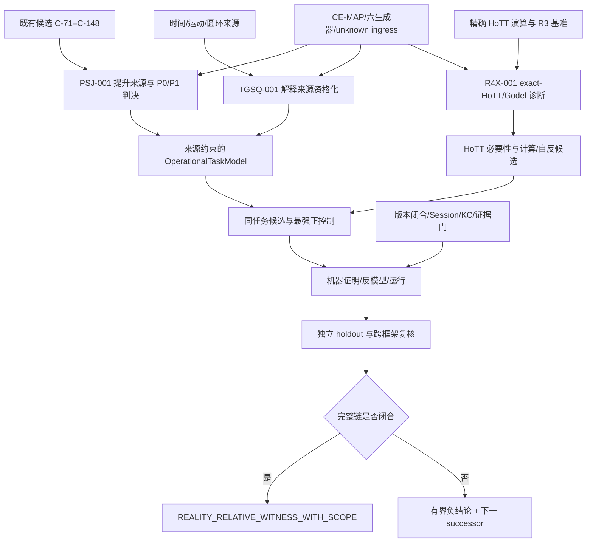

# HoTT 机器统观后续工作方案：七轮审计共识综合与执行论证

> 文档身份：`CROSS_ROUND_SYNTHESIS / EXECUTION_PLAN / PROPOSAL_PENDING_CURRENT_OWNER_ADOPTION`  
> 日期：2026-09-15  
> 工作根：`/Volumes/D/HoTT_AI_HANDOFF_20260911`  
> Git 快照：`main@2bbf5c873dfa3ac1d512955301b163b2b6f311b0`；工作树已有大量既存未提交研究资产  
> 数学证据身份：审计综合、现有来源与工作方案；本文不新增数学定理，不把方案写成已经找到悖论  
> current-truth 影响：`NONE`；本文没有修改 `goal.md`、STATE、四件套、方向、全景、MEMORY、Feature、rulings 或 claim matrix  
> 审计语料：初始 GLM 审计 7 份、初始 GLM 建议 9 份、GPT/GLM 往返正文 12 份、GLM 七轮综合方案 1 份，以及项目四件套、Goal、Feature、MEMORY 和程序化探索规划  

## 一、执行结论

后续工作不应继续沿一条单线把 R4、Gödel 编码或社区实现资格化越做越深，也不应把已有非因子化结果直接宣布为已经兑现的 HoTT 现实相对悖论。七轮互审真正形成的共同方案，是先解决三个彼此独立、又必须在最终候选处汇合的问题：

1. **已有最强候选的提升来源问题**：是谁把一个较弱的理论对象、相等关系或存在性结果，当作完整的过程身份、当前可用能力或现实交付？
2. **时间、运动和现实任务的来源问题**：理论侧与现实／应用侧是否真的在谈同一个输入、观察量和完成标准？“时间”中的连续性、稠密性、运动结构不能被“时序”中的先后、依赖和可用性取代。
3. **精确 HoTT 演算中的计算与 Gödel 问题**：一般停机不可判定和一般不完备性已能重放；尚未完成的是精确 HoTT 演算的语法、证明关系、表示性、对角化，以及这些结构是否真正依赖 HoTT 的高阶构造。

因此，研究恢复后的第一阶段应当由两个短而真实的工作包组成：

```text
PSJ-001  Promotion-Source Judgment
  对 C-71–C-76 与 C-96–C-99 进行提升来源、同任务、HoTT 必要性判决

TGSQ-001 Time/Geometry Source Qualification
  对时间—运动—几何解释建立来源先行的有界分母
```

二者处于同一阶段，但在单一主工作面上交替推进，并不要求两个写者并行。`PSJ-001` 先完成最小候选判决，因为它复用现有机器证明，成本最低；`TGSQ-001` 同期冻结来源分母并取得第一批判词，以保证用户长期强调的时间、时空、运动、稠密性和圆环方向不再因形式化困难被排到末尾。之后才继续当前 canonical queue 中尚未实现的 `R4-HOTT-NAT-EFFECTIVITY-001`，并按审计结论把它修正为“正式演算优先、社区实现作有范围的执行证据、算术消融先行”的诊断线。

这份安排不是降低 Goal。根 Goal 仍要求至少一个候选贯通：精确 HoTT 规则／表示、抽象或资格变化、既存或来源约束的 consumer、机器证明的不完成／不相容、HoTT 必要性、现实同任务对应、方向 A/B 与独立复核。当前合格见证仍为 **0**；现有成果是后续构造的高质量基础，不是终点。[当前 Goal](../goal.md)与[当前执行队列](<../MEMORY/001 - 当前执行队列.md>)仍分别保持其现状，除非用户采纳本文并由 canonical owner 原位更新。

## 二、证据层级与引用纪律

### 2.1 哪些材料决定什么

本文采用以下权威顺序：

1. 用户当前指令与 `rulings.md` 决定要做什么；
2. `核心认知.md` 决定研究问题意识，尤其是 A/B 两方向、时间／时序、ASK、理论经济、自指与机器证明要求；
3. `goal.md`、Feature、MEMORY、方向、全景和 STATE 决定当前已采纳的执行状态；
4. proof source、kernel run、claim matrix、源码、来源快照与 Git 决定实现和证据等级；
5. GLM/GPT 审计往返只构成 `PROPOSAL_EVIDENCE`，即使双方达成一致，也不会自动覆盖 current owner。

这一区分解释了一个看似矛盾的现场：审计往返已经共同推荐 `PSJ-001 + TGSQ-001`，而当前 MEMORY 仍写 `R4-HOTT-NAT-EFFECTIVITY-001`。前者是已经收敛的后续方案，后者是尚未被原位修订的 current queue。本文负责把两者组织成一份可供采纳的计划，不在未审阅前替用户修改当前真值。

本轮还发现一个独立于优先级的新鲜度问题。实际运行 research hydration 时，active Goal record 与 active R4 record 都进入 `review_required`：

```text
goal.md actual sha256:
5c21d3ffed766244988ea4751d2259d7563d9a1ecc03ecbd15ad81b6e001e5c5
STATE pinned sha256:
f302d37ac6732c4c742d5adfcc0fe89b2b89e1d3350910657e50602d15649311

R4-HOTT-NAT-EFFECTIVITY-001.md actual sha256:
38f0e65db71e24f6b040b7709b1b0ec741af5f74b120dc1a0dc7f0ac48b30e91
STATE pinned sha256:
6cb41c9b471075a12cdca8c2af4f0373776d85bc01fc863b9b4cdb05a59663b3
```

这只证明“当前文件与记录钉住的版本不同”，不证明哪一版正确，也不提供作者归因。研究恢复前必须先由 canonical integrator 比较实际文件、记录版本、生成来源和用户裁定，确定 intended current content，再通过正常 checkpoint 重钉；在此以前不能让旧 record hash 或当前未核文件任一方自动获胜。

### 2.2 第七轮共识的精确范围

[GPT 第六轮报告](<GLM第六轮复审审计报告-20260915.md>)正式撤回了 GPT 第五轮 §2.3 的虚假归因，并独立重放 owner baseline v2；[GLM 第七轮复审](<../GLM的回应/对GPT第六轮审计报告的复审-20260915.md>)接受该撤回，确认该报告没有事实缺陷，并宣布既有文本争议闭合。这里的“闭合”应精确理解为：

- 双方对后续方法的书面分歧已经消除；
- v2 在声明的 44 路径范围内为 44/44 checksum 通过，五个具名逻辑文档为 30/30 index＋shards 展开；
- v2 仍未提交、非原子、不归因作者；
- 历史“双遍确定性一致”仍为 `SOURCE_REPORTED_NOT_RECEIPTED`；
- 数学问题、来源问题、HoTT 必要性和现实桥梁仍然开放。

版本提交只能把现有文件和其当前证据等级变成可恢复历史，**不能把缺失的历史运行收据追溯变成存在，也不能把来源自述升级为已经独立验证的历史事件**。这是对 [GLM 七轮综合方案](<../GLM的回应/后续工作方案-七轮审计综合最终版-20260915.md>)“commit 后全部来源自述升级”的必要修正。

### 2.3 GLM 七轮综合方案中需要保留的四个限定

GLM 的七轮综合方案总体结构值得吸收，但必须带着以下限定使用：

1. 它所说的“七轮往返 14 份文档”不是当前目录的精确文件分母。当前可直接枚举的是 6 份 GPT 回应、6 份 GLM 复审，共 12 份往返正文；初始审计与建议另有 7＋9 份。本文不用模糊轮数代替文件定位。
2. E6／自然消费者是 C5 与 C-71–C-148 既有候选族从“表示边界”升级的决定性缺环，**不是整个 Goal 的唯一缺环**。精确 R4 演算、同一现实任务、HoTT 必要性、时间／运动解释、学术定位和 CandidateClass 覆盖仍分别开放。
3. “C-59–C-249 是机器资产”只能作为范围导航。每一行的 `MACHINE_PROVED_VERSION_CLOSED`、`LOCAL_UNCOMMITTED`、external replay、paper、refuted 或 source-qualified 状态仍须逐行读取，不能把编号区间压成同一证据等级。
4. 审计中的 `R1-PROMOTION-SOURCE-JUDGMENT` 与项目计算阶梯的 R1“固定程序发散”重名。本文改用 `PSJ-001`，避免未来把两条完全不同的工作线混淆。

## 三、七轮往返如何形成当前方案

下表不以“最后一份覆盖全部历史”的方式压缩争论，而是记录每一轮给当前方案留下的有效增量，以及后来已经撤回或被替换的部分。

| 节点 | 证据文件 | 对后续方案的有效贡献 | 后续修订／边界 |
|---|---|---|---|
| 初始审计 | [GLM 审计总入口](<../GLM独立审计/README.md>)、[方法论评估](<../GLM独立审计/03 - 方法论与数学评估.md>)、[盲区 B1–B10](<../GLM独立审计/04 - 盲区清单.md>)、[轨迹与建议](<../GLM独立审计/05 - 轨迹预判与建议.md>) | 确认合格见证为 0；指出形式证据强、现实任务侧投入弱、R4 可能收口为一般继承边界、未提交证据有持续性风险 | “正向 Goal 结构性不可达”“E6 可取消”“全部支付即债务”等强主张后来被修正；动态计数多处勘误 |
| GPT 第一轮 | [完整回应，§一–§六](<对GLM独立审计与建议方案的完整回应-20260915.md>) | 提出 `PromotionSource`、来源先行、同任务、HoTT 消融、中性义务分类；区分正向完成门与负向无命中出口；形成 R0–R9 框架 | GPT 对 current LIT“整个 repo 零命中”和社区实现“全部无价值”的转述过强，下一轮撤回 |
| GLM 第二轮 | [对 GPT 回应的独立审计，§1–§6](<../GLM的回应/对GPT回应的独立审计-20260915.md>) | 独立复核 GPT 的关键事实；接受合成 consumer、提升来源、统一债务与 stuck-family 四项纠正；提出潜势／兑现、空分母、Q2 优先级和治理触发缺口 | “潜势／兑现”后来细化为 P0/P1/A1；概率预测降为条件风险场景 |
| GPT 第二轮 | [再回应，§三–§九](<对GLM二次独立审计的再回应-20260915.md>) | 建立 P0/P1/A1；给来源分母三终局；把 Q2 拆成 Q2-S/Q2-F；提出 TR-G1–G5；把 canonicity 分成相关性与机制特有性 | 动态 Session 数交付时落后一项；P0/P1、holdout 和观察者仍需操作化 |
| GLM 第三轮 | [第三轮独立审计，§3–§6](<../GLM的回应/对GPT再回应的独立审计-20260915.md>) | 要求 `P0_or_P1_ablation`、定义 holdout 独立性、给治理触发器指定观察者；提出 FAMILY_SPREAD 启发轴 | `GLM-5.03` 为笔误；GPT 文件行数误记；FAMILY_SPREAD 后来降为候选轴而非 essentiality 判词 |
| GPT 第三轮 | [第三轮审计报告，§四–§七](<GLM第三轮回应审计报告-20260915.md>) | 把 P0/P1 消融写成七字段合同；holdout 写成六维；observer 定为 canonical integrator；建立五对照 canonicity 矩阵；明确 R1 与 Q2-S 同阶段 | 动态计数再次陈旧；“无隐藏动作”的归因证据范围被进一步校准 |
| GLM 第四轮 | [第四轮复审，§3–§6](<../GLM的回应/对GPT第三轮审计报告的复审-20260915.md>) | 接受上述操作化；明确用户暂停下的文本工作有准备收益；尝试用 `M=38` 恒定提供 owner 未变的部分佐证 | `M` 数量恒定看不见既有 dirty 文件内部变化；该佐证在下一轮被撤销 |
| GPT 第四轮 | [第四轮审计报告，§四–§九](<GLM第四轮复审审计报告-20260915.md>) | 建立 what／who 区分和真正的前后归因协议；确认治理读取只是局部；固定 R1＋Q2-S 未来队列 | 未要求立刻建设治理子系统；owner 基线须先证明必要性和完整范围 |
| GLM 第五轮 | [第五轮复审，§3–§7](<../GLM的回应/对GPT第四轮审计报告的复审-20260915.md>) | 撤销 `M=38` 佐证；建立 v1 selected-path baseline；用 Git 追踪 core 端点 | v1 只有 10 行、格式混合、漏 logical shards、不能归因作者；“从未触碰”过强 |
| GPT 第五轮 | [第五轮审计报告，§三–§八](<GLM第五轮复审审计报告-20260915.md>) | 对 v1 的 8 项实质缺口审计成立；用 commit `35cace73` 证明 core 当前端点一致；强调 endpoint equality 不证明瞬态历史 | **§2.3 与“目标文件身份 ERROR”是虚假归因，已经由 GPT 第六轮正式撤回，不得再作依据** |
| GLM 第六轮 | [第六轮复审，§3–§6](<../GLM的回应/对GPT第五轮审计报告的复审-20260915.md>) | 用 exact grep 证伪 GPT §2.3；接受 v1 全部实质缺口；建立 44 路径纯格式 v2 与 meta sidecar | 历史双遍无 receipt；非原子、不归因、未版本闭合；“错误经济学完全对称”等修辞不进入 current truth |
| GPT 第六轮 | [第六轮审计报告，§三–§十](<GLM第六轮复审审计报告-20260915.md>) | 正式撤回错误；独立重放 44/44；核五逻辑文档 30/30；记录 meta SHA；完整分层 v2 的证据等级 | 不改变数学队列或项目 owner；baseline 仍是 proposal evidence |
| GLM 第七轮 | [第七轮复审，§2–§7](<../GLM的回应/对GPT第六轮审计报告的复审-20260915.md>) | 接受撤回与 v2 复核；确认书面实质分歧、方法分歧和元数据争议均已闭合；停止无新证据的同题文本往返 | “零分歧”只说明已写出的共同方法，不说明开放数学问题已解决 |
| GLM 综合稿 | [七轮综合最终版](<../GLM的回应/后续工作方案-七轮审计综合最终版-20260915.md>) | 把分散共识整理成版本闭合、提升判决、时间来源、任务模型、R4、canonicity、综合报告和横切纪律 | 本文吸收其结构，同时修正文件分母、E6 全局化、R1 重名、current queue 身份与 commit 证据升级过度 |

从这条谱系可以得到一个重要方法结论：互审的价值不在“双方同意”，而在每个关键条款已经经受过反例。合成 consumer 被指出循环论证；潜势层被阻止冒充全称律；来源先行被补上空分母出口；结构弥漫性被 generic indexed-schema 控制约束；owner 归因从粗计数推进到路径与哈希；错误又能通过 replacement 保留历史而不继续传播。后续 TaskSpec 应直接继承这些被检验过的约束。

## 四、最终稳定共识与尚未闭合的对象

### 4.1 双方已经共同确认的命题

1. **当前没有合格见证。** 项目已有大量形式结果，但没有一项同时闭合精确 HoTT 机制、提升来源、同任务、HoTT 必要性和现实对应。
2. **根 Goal 的正向门可达。** 来源、任务规格、机器证明、运行、文献与人的解释裁定可以组成异质证据链；不要求 kernel 判定“现实”。
3. **开放世界无命中没有全局负向完成门。** 每个具名 pass 可以停止，整个 Goal 只能由合格见证或用户改变完成条件而结束。
4. **现有结果要分 P0/P1/A1。** 一般非因子化、HoTT 相关潜势、已经兑现的现实相对实例不是同一层。
5. **提升必须有来源。** 理论规则、论文解释、库 API、应用合同和研究者自行假设必须分开。
6. **合成 consumer 只能校准。** 它不能自授 natural 或 source-grounded 资格。
7. **来源搜索必须有分母、holdout 和退出。** 无命中只能形成具名范围负结论，不能无限扩搜或写成全局不存在。
8. **时间与时序必须双轨表达。** 时间包括时空、运动、连续／非连续、稠密性与尺度；时序包括先后、依赖、可见性、构造与落定。两者在候选处可以交叉，但不得互相替代。
9. **R4 先做一般性消融。** 如果 arithmetic-only 片段已经承载不完备机制，结果应标 `GENERIC_GODEL_BOUNDARY_WITH_HOTT_INSTANCE`，按 KC-000027 的“程序问题被继承”交付，但不完成 Goal。
10. **社区实现与正式演算分层。** 实现可以提供 parsing/conversion/evaluation/differential 证据；自建受限输入语言的性质不能自动推广成整个 HoTT 理论的性质。
11. **canonicity 需要五组对照。** 纯 MLTT、单一 opaque equality、同型索引 generic opaque schema、axiomatic univalence、Cubical univalence 共同隔离不透明性、索引宽度与 univalence 法则。
12. **治理触发应来自真实功能失败。** canonical integrator 在有界单元首尾观察；只读脚本只生成机械候选；不新建常驻语义裁判。
13. **版本闭合与证据真值分开。** commit 证明可恢复的版本身份，不证明数学、历史运行或作者归因。
14. **文本往返已经足够。** 后续有价值的文件应来自 TaskSpec、来源分母、机器结果、反模型或新的用户裁定。

### 4.2 仍然开放，不能由共识代替的事实

| 开放对象 | 当前最强状态 | 需要什么才能改变 |
|---|---|---|
| C-71–C-76 的 race/deadline 是否进入现实相对候选 | 机器证明的表示边界 | 先在 consumer／应用合同、同任务映射、HoTT 消融 |
| C-96–C-99 的同函数异时是否为 HoTT 必要现象 | 一般外延非因子化＋细化正控制 | 具名比较演算、保持性翻译、HoTT 特有差异 |
| SIP／截断／无典范选点是否被自然越级 | HoTT 相关潜势／防线 | 实际提升来源，不得由合成接口制造 |
| 时间／运动／圆环解释 | 用户高优先方向，来源桥开放 | 有界来源分母、解释身份、现实前提、同任务形式化 |
| ambient HoTT 无条件 no-decider | 条件 EPF/SCT 下 internal result | 合法 universe/modality 或保真 reduction |
| exact HoTT R4 不完备性 | R3 一般基准；R4 12 义务仅部分具备 | exact syntax/checker/proof code/representability/fixed point/independence |
| HoTT essentiality | 多数结果为 generic 或 related | 具名 comparison calculus 与 preservation-aware ablation |
| canonicity 的 HoTT 特有残差 | 研究规格候选 | 五对照矩阵、精确 stuck/canonicity 命题与 consumer |
| 现实相对见证 | 0 | 完整候选链与最强反解释 |
| 开放世界探索完备性 | 不可能由有限清单全局封闭 | 有界 coverage、无限 fairness、unknown ingress、holdout |

## 五、为什么过去没有找到 HoTT 的“BUG”

这里的“BUG”必须继续分解。现有工作大量找到了表示边界、资格边界、已发表扩展的不相容条件、实现行为和一般元理论限制；没有找到的是一个能被准确称为 **HoTT 现实相对非现实性见证** 的完整构造。七轮审计表明，原因主要有四个。

### 5.1 证明工作长期闭合局部数学，未闭合提升来源

C-71–C-148 的许多证明回答了“信息被商化、截断、外延化或统一化以后，某个观察量能否恢复”。它们没有自动回答“谁承诺了该观察量仍然属于抽象对象的完整身份”。当理论接口明确拒绝不能下降的运算，或要求保留标签、模数、crisp/context 条件时，结果更接近资格边界或防线。没有 `PromotionSource`，局部非因子化无法进入现实相对链。

### 5.2 自然 consumer 的检索分母偏向数学库

过去 N1/N5/N10、E6 扫描和库审计擅长发现 HoTT 社区如何保护资格，却不等于已经搜索限时交付、在线输入、物理运动、测量、资源预算和应用合同。GLM 的 B2 指出了这个空间偏差；GPT 又纠正了 GLM 的过度方案：不能自行构造一个 consumer 再宣布它“自然”。正确路径是外部来源先行，再建立任务模型。

### 5.3 R0–R3 越成功，越可能得到一般结论

固定程序发散、通用编码、公平枚举、半判定和一般不完备性都是必要基础，但它们对所有足够强的有效系统都可能成立。若不在早期做 arithmetic-only／Path／univalence／HIT 消融，就会投入大量工作以后才发现机制与 HoTT 高阶结构无关。R4 仍有学术价值，但它必须被设计成诊断线，而不是默认的见证生产线。

### 5.4 “时间”最难的部分缺少独立来源桥

程序化工作更容易处理时序：step、tick、deadline、输入可见性、证明搜索阶段。这些是重要成果，却不能替代用户对时间、时空、运动、稠密性与非连续性的结构问题。将 Path、interval、`S¹` 或 HIT 直接读成物理运动会制造类比；完全不研究其解释来源又会遗失用户方向。`TGSQ-001` 正是为此补上独立工作面。

因此，过去没有找到完整见证不说明 HoTT 没有问题，也不说明模型没有发挥智能。它说明搜索在局部形式边界上已经很强，而最决定性的来源、解释与同任务连接长期没有得到同等强度的工作。后续方案必须改变这种资源分配。

## 六、总体研究结构

后续研究由三条发现线和两条横切支撑线组成：



三条发现线分别是：

- `PSJ`：从已有数学结果向真实提升来源追踪；
- `TGSQ/OTM`：从时间、时序和应用任务来源向形式候选追踪；
- `R4X/CAN`：从 exact HoTT 规则、计算与自反边界向候选追踪。

两条支撑线分别是：

- `COVERAGE`：八轴张量、六类生成器、holdout 与未知入口；
- `EVIDENCE`：proof source/run/index、版本身份、失败保全、current owner 与跨 Session 连续性。

任何一条线都不能独自完成 Goal。最终候选必须在 `I` 处汇合。

## 七、工作包 0：证据快照与版本闭合

### 7.0 `FR-001`：先消除 active record 的来源漂移

在任何 PSJ、TGSQ 或 R4 执行以前，先处理上一节的两个 `review_required`：

1. 固定当前 `goal.md`、R4 TaskSpec、STATE record 和相关 checkpoint/生成脚本的 exact identity；
2. 找到 pinned 版本的可恢复副本或生成依据；找不到时明确 `HISTORICAL_PIN_SOURCE_NOT_RECOVERED`；
3. 对 actual 与 pinned 版本做逐节语义 diff，区分目标扩展、证据更新、措辞变化和未经登记的漂移；
4. 由用户当前指令、rulings、Feature 与直接证据判定 intended current version；
5. 只在内容裁定后更新 source hash、revalidation、相关 projection/MEMORY，并产生 canonical checkpoint receipt。

`FR-001` 的完成判词是 `ACTIVE_RECORD_SOURCE_IDENTITY_RECONCILED`，而不是“把 hash 改成当前值”。若内容冲突未裁定，保持 `REVIEW_REQUIRED` 并只做不依赖该冲突的来源读取。

### 7.1 `VC-001` 做什么

在研究恢复并获得相应 Git 授权后，对当前未提交资产进行逐包版本闭合：

1. 以 `git status --porcelain=v1 -uall` 冻结完整路径和 index/working-tree 状态；
2. 按每个 proof package 枚举 source、run、index row、依赖闭包、来源身份与现有 owner；
3. 将审计往返、v1/v2 baseline、meta 与 S-AUD Session 作为独立“审计证据批次”，不与数学 proof 包混为一批；
4. 对每批运行 closure verifier、链接检查、hash 重算与 `git diff --check`；
5. 精确 stage 与 commit，每批回读 commit/tree 和实际包含路径；
6. 只有进入可恢复 commit 的资产才从 `LOCAL_UNCOMMITTED_NOT_VERSION_CLOSED` 改成相称的 version-closed 状态。

### 7.2 为什么先做，但不能阻塞全部研究

初始 GLM 审计 B8、GPT 第一轮 §2.1.6、GPT 第四轮 §6.3 和最终双方共识都确认：大量昂贵 proof/run/source 只有本地未提交副本，持续存在恢复风险。版本闭合具有确定收益。

但它是证据生命周期工作，不产生新数学，也不能成为无限期整理。应按逻辑批次完成到“当前高价值证据可恢复”，随后立即回到 `PSJ-001/TGSQ-001`。低价值历史目录、未决草稿和不属于同一作者／验收范围的资产不因“清零”口号被混合提交。

### 7.3 v2 baseline 的正确角色

`owner-baseline-v2-20260915.sha256` 保存 2026-09-15 某时点 44 个 selected paths 的字节身份。它可以作为审计批次的一份历史附件，但不应直接安装成运行时治理工具，因为：

- 它不是全 owner universe；
- 它没有原子写者边界；
- 它不能归因作者；
- 当前项目已有 Git baseline、checkpoint 与 owner 规则；
- 没有重复失败证明必须再建一套 manager。

若以后真实出现至少两次同类 owner 归因失败，再按治理自维护流程设计 manager、schema、状态、原子性、迁移、测试和退役条件。当前不建设第二套真值。

### 7.4 验收与停止

`VC-001` 的完成证据不是“工作树全 clean”，而是：

- 每个接受批次有 exact manifest 与 commit；
- 所有未提交残余按 owner／来源／状态登记，未被误收；
- proof closure verifier 对提交后的目标批次通过；
- current owner 状态只按真实提交范围更新；
- 历史无 receipt 项继续保留原证据等级。

本文只制定该工作包，没有执行 commit、tag 或 push。

## 八、工作包 1：`PSJ-001`——现有最强候选的提升来源判决

### 8.1 第一批对象

第一批只处理两个最有判别力、且已有机器证明的族：

1. C-71–C-76：Delay 结果商、`bind`、`race` 与 deadline；
2. C-96–C-99：外延相同函数、成本差异和细化表示正控制。

第二批在第一批方法有效后再处理：

- C-124–C-128：SIP／ua 与签名外观察；
- C-129–C-133：Cauchy modulus；
- C-134–C-148：截断、有限结构接口与无典范选点。

不一次把全部 C-59–C-249 重写成新表。第一批的目的，是检验审计争议的中心命题：“现有证明究竟已经达到 P0、P1，还是接近 A1？”

### 8.2 每个候选的必填字段

| 字段 | 必须闭合的问题 |
|---|---|
| `ExactTheoryConstruct` | 使用了哪条 HoTT/Cubical/一般代数规则，版本与公理是什么？ |
| `AbstractionMap` | 哪些状态、顺序、标签、模数、成本或来源被合并／遗忘？ |
| `PromotionSource` | 谁把较弱对象当作完整身份：理论规则、论文解释、库 API、应用接口，还是本项目假设？ |
| `TaskIdentity` | 理论侧与来源侧的 input、consumer、observation、completion 是否逐字段一致？ |
| `CurrentEvidence` | 哪个 claim、proof、run 或 source 已经支持哪一段？ |
| `PositiveControl` | 富表示、显式时序、模态限制或保留数据能否在同任务下完成？ |
| `RealityEvidence` | 来源、应用合同、运行或测量证据是什么？ |
| `P0_or_P1_ablation` | 在具名 comparison calculus 中同型现象是否保持？ |

`P0_or_P1_ablation` 继续展开为：

```text
target_calculus
candidate_construct
comparison_calculus
translation
typing/equality/consumer/observation/completion preservation
ablation
verdict
```

comparison calculus 必须具名并固定版本；不能只写“集合论”“ETT”或“非 HoTT 系统”。如果 translation/preservation 未证，判词只能是 `INCONCLUSIVE`。

### 8.3 允许的判词

形式层：

```text
P0_GENERIC_REPRODUCED
P1_HOTT_RELATED_NOT_ESSENTIAL
P1_HOTT_ESSENTIAL_WITH_SCOPE
INCONCLUSIVE_TRANSLATION_OR_PRESERVATION_OPEN
```

现实提升层：

```text
REPRESENTATION_BOUNDARY_CONFIRMED
PROMOTION_SOURCE_FOUND_REALITY_BRIDGE_OPEN
REALITY_RELATIVE_CANDIDATE_READY_FOR_PROOF
CANDIDATE_REJECTED_BY_SAME_TASK_CONTROL
```

### 8.4 为什么这是第一实际单元

这一步不需要先写新证明。它利用已经闭合的 C-claim/run，直接检验 GLM 初始主张“最强证据已经在手”与 GPT 的反驳“缺提升来源”各自成立到哪一层。任何结果都有信息价值：

- 若只有本项目假设实施提升，现有候选被正确限制为校准；
- 若找到先在 API／论文／应用承诺，立即形成 A1 候选入口；
- 若同型现象在 comparison calculus 中重现，停止追求 HoTT 特有性；
- 若 HoTT 消融改变结果，则把资源转向该候选，而不是继续宽泛扫描。

### 8.5 验收与停止

第一批在两个候选各取得一个形式判词和一个现实提升判词后停止。缺失来源不触发无界检索：它转交给 `SOURCE-FIRST-DENOMINATOR-V1`，在具名范围内形成 `NO_QUALIFIED_PROMOTION_SOURCE_IN_DENOMINATOR`。只有出现新的 exact 命题才创建 proof package。

## 九、工作包 2：`TGSQ-001`——时间、几何与运动解释来源资格化

### 9.1 为什么它与 PSJ 同阶段

用户在 KC-000003、000004、000005、000006、000019、000020、000023、000024 以及“时间／时序”澄清中反复要求：芝诺问题首先涉及运动和时空结构被理论异化为稠密、连续、无限可分；这不能被重新解释为仅仅存在无限多个按序步骤。[思想展开第二片](<../从抽象到悖论——HoTT研究的核心问题意识与思想展开/002 - 前提改变、结果与时间.md>)与[第三片](<../从抽象到悖论——HoTT研究的核心问题意识与思想展开/003 - 芝诺、圆环、ASK 与两种方向.md>)已经把该区分写清。

GLM 初始方案遗漏了这一族；GPT 第一轮虽然指出 Path 不能自动等于物理运动，却把它排得过后；GLM 第二、三轮提出优先级异议，GPT 第二、三轮最终接受并将 Q2 拆成来源资格化与条件形式化。这是审计往返中最重要的用户航向纠偏之一。

### 9.2 两个不可互相吞并的来源分支

`TGSQ-001` 同时维护两张来源表：

| 分支 | 研究对象 | 典型词与观察 |
|---|---|---|
| `TIME-STRUCTURE` | 时间、时空、运动、连续／非连续、稠密性、可分性、尺度、极限、路径复原 | 运动完成、空间结构、物理／应用解释、去点与粘合 |
| `TEMPORAL-ORDER` | 事件先后、因果、输入可见性、证明可用性、构造顺序、deadline、在线交付 | current/later、trace、completion、availability、dependency |

同一候选可以同时落入两分支，但 TaskSpec 必须分别说明。delay/tick/search stage 只支持时序主张；continuous/path model 只支持结构主张；跨两者的结论需要一座明确解释桥。

### 9.3 `SOURCE-FIRST-DENOMINATOR-V1` 的八项冻结

每个分支在搜索前固定：

1. 任务域与同义词；
2. 数据库、会议、期刊、模型、社区项目和应用接口渠道；
3. 查询式、backward/forward citation 范围和 as-of date；
4. 纳入与排除条件；
5. “先在解释／consumer”的时间判据；
6. input、observation、completion 可提取性的最低要求；
7. source holdout；
8. 结束条件、排除项与 remainder。

holdout 的独立性按六维逐项声明：selection、author/project、temporal、framework、consumer、visibility。某来源不满足独立性时可以作为补充来源，但不能称 independent holdout。

### 9.4 三种终局

```text
INTERPRETATION_SOURCE_FOUND
HOMOTOPY_PATH_NOT_USED_AS_PHYSICAL_MOTION_WITHIN_DENOMINATOR
MULTIPLE_INCOMPATIBLE_INTERPRETATIONS
```

第一种进入 `TGF-001` 同任务形式化；第二种关闭本轮来源 pass，不制造物理类比；第三种把不同解释的前提和任务后果交给用户裁定，不能由 AI 静默选择最有利于候选的一种。

### 9.5 `TGF-001` 的条件启动

只有获得来源后，才形式化圆环／运动任务：

- 现实／应用侧对象与初始条件；
- 理论侧 Path/HIT/transport/粘合表示；
- 去点、展开、复原或运动操作；
- 时间结构与事件时序的各自观察量；
- 完成谓词；
- 解释保真与未覆盖的现实因素；
- 连续模型、离散模型和富表示正控制。

如果没有来源，用户方向仍保持 active，但不创建假装现实的 synthetic witness。

## 十、工作包 3：`ATD-001`——来源约束的现实／应用任务分母

### 10.1 首轮只选两个任务族

为避免把六类任务一次性建成新的理论平台，首轮选择：

1. 在线／流式任务：输入何时到达、当前能观察什么、持续输出与最终稳定答案有何区别；
2. 限时／资源约束任务：结果值相同但 deadline、步骤、空间、能耗或业务 continuation 不同。

若 `TGSQ-001` 找到几何／运动来源，第三族以条件 successor 进入，不与首轮两个任务一起先验建模。

### 10.2 来源选择标准

- 任务在本项目以外先在存在；
- 输入、观察量和完成标准可从来源原文提取；
- consumer 在看到本项目反例以前已经存在；
- 不依赖尚无独立依据的物理全称断言也能成立；
- 能与一个具体 HoTT 构造、表示或社区接口形成候选联系；
- 有失败与成功实例，可支持反解释。

每族使用与 `TGSQ-001` 相同的三终局：

```text
SOURCE_GROUNDED_CONSUMER_FOUND
NO_QUALIFIED_CONSUMER_IN_DECLARED_DENOMINATOR
DENOMINATOR_INADEQUATE
```

第三类只允许由独立 holdout 修订分母一次；再次不足则登记 `REALITY_BRIDGE_UNRESOLVED / SOURCE_ROUTE_INADEQUATE` 并停止该候选。

### 10.3 `OperationalTaskModel` 的职责

只有来源命中后才建模型。模型记录：

```text
source identity/version
input and availability
allowed operations
trace/event order
observation
completion
resource/deadline when sourced
positive and negative instances
unmodelled factors
```

模型首先忠实重述来源任务，其次才用于候选生成。它不自称“现实层”，其结论只写“在该任务规格语义下”。任何主动删除 deadline、因果、模数或成本的翻译标 `SYNTHETIC_TRANSLATION`，除非已有来源证明实际接口就是这样使用。

## 十一、工作包 4：`R4X-001`——精确 HoTT 演算中的 Gödel／计算诊断

### 11.1 与当前 `R4-HOTT-NAT-EFFECTIVITY-001` 的关系

当前 TaskSpec 已冻结、实现尚未开始。它列出 cubicaltt、redtt、cooltt、cctt 四个候选，并诚实承认 holes、undefined、metavariables 和无终止递归会迫使项目定义一个受限证明输入语言。[当前 R4 TaskSpec](../.codex/research/hott/R4-HOTT-NAT-EFFECTIVITY-001.md)仍是 current owner；本文提出的调整只有在用户采纳并原位更新后生效。

应保留该 TaskSpec 的 Q-SOURCE/Q-BUILD/Q-NAT/Q-PATH/Q-CONVERSION/Q-INCOMPLETE-INPUT/Q-RECURSION/Q-DETERMINISM/Q-CORRESPONDENCE 九类核验，但改变目标选择顺序：

1. 优先选择已有发表的 formal calculus、内部语法或有机器化元理论的对象；
2. 社区实现作为 parser/conversion/evaluation/differential target；
3. 自建 closed-input profile 只定义有范围的 accepted corpus，不冒充完整上游 calculus；
4. 只有存在经证明的翻译、嵌入、充分性或 correspondence，才把实现结论提升到演算结论。

### 11.2 先做 arithmetic-only 消融

在补全全部高阶构造以前，先问：

```text
若保留有效语法、Nat、proof relation 与算术解释，
删除 Path/univalence/HIT 后，R3 的不完备机制是否仍然成立？
```

若成立，立即登记：

```text
GENERIC_GODEL_BOUNDARY_WITH_HOTT_INSTANCE
/ HOTT_ESSENTIALITY_NOT_ESTABLISHED
```

该结果按 KC-000027 有价值：HoTT 作为“逻辑＋几何＋程序”系统继承程序／有效理论的一般边界。但它不完成根 Goal，且不再启动第三套同型 Gödel 编码。

若消融失败，或 Path/univalence/HIT 改变 proof relation、表示性、固定点或有效性，才提升为 HoTT-essential 候选并投入更多证明工作。

### 11.3 R4 义务阶梯

按依赖而不是按实现模块堆叠推进：

1. exact syntax、contexts、substitution；
2. Nat 与算术表达；
3. identity/Path、universe、conversion；
4. closed proof acceptance 与 proof-code enumerability；
5. arithmetic interpretation／Robinson-Q strength；
6. strong separation／representability；
7. substitution、s-m-n 或相称自应用；
8. fixed point／diagonal sentence；
9. independent sentence 与前提清单；
10. Path/univalence/HIT 消融与 inner/outer 层界。

每一级都有“present / absent-by-definition / open / blocked-by-preservation / refuted”状态。前一级没有闭合时，后一级只能是计划，不通过代码文件存在冒充实现。

### 11.4 ERCF-3 与自我验证的进入条件

C-157–C-187 已闭合编码／解码／替换／引用的自足部分；对象层可表示性、证明谓词 `P`、反射和对角不动点仍开放。只有当 exact target 提供：

- 对象语言编码与表示关系；
- 可枚举 proof relation；
- 明确 inner/outer 理论；
- 来源约束的 self-validation consumer；

才重开 ERCF-3 本体。给定证明的检查、证明搜索、theoremhood、全局 soundness 与内部自担保继续分层。一个手写自递归定义或工具超时不构成 Gödel 实例。

### 11.5 验收与停止

`R4X-001` 可以在两种主要终局停止：

```text
GENERIC_GODEL_BOUNDARY_WITH_HOTT_INSTANCE
HOTT_ESSENTIAL_R4_CANDIDATE_WITH_EXACT_OPEN_OBLIGATIONS
```

前者停止 HoTT-specific 深化并转入综合报告；后者形成下一 proof TaskSpec。不存在第三种“因为实现 build 成功而宣布 R4 完成”的出口。

## 十二、工作包 5：`CAN-001`——canonicity／conversion 的五对照重构

### 12.1 要检验的两个不同问题

1. **相关性**：不透明常量恰好是 univalence，现象与公理式 HoTT 有关；
2. **机制特有性**：卡住是否由 univalence 法则造成，还是任意无判断计算规则的 opaque equality schema 都会造成。

GLM 初始 `transport (λ _ → Bool) ...` 使用常值 family，不能展示 `notEquiv` 对元素的作用；该规格已经双方共同撤销。新的 family 至少从 `X ↦ X` 开始，并固定 universe、equality、K/UIP 和 reducer。

### 12.2 五组对照

| 对照 | 目的 |
|---|---|
| 纯 MLTT | 建立 constructor/canonicity 基线 |
| 单一 opaque equality constant | 控制孤立不透明性 |
| 与 equivalence 同型索引的 generic opaque schema | 控制 FAMILY_SPREAD／索引宽度 |
| axiomatic univalence | 观察 ua 的命题与判断计算边界 |
| Cubical univalence | 判断计算的正控制 |

同时区分：syntactic stuck set、judgmental equivalence class、propositional behavior、canonicity theorem、library consumer closure、compiler/backend support。一次 reducer 观察只支持该项与环境，不证明一般 normalization 失败。

### 12.3 提升条件

只有当 axiomatic univalence 相对 generic indexed schema 仍有由 univalence 法则解释的差异，且存在 source-grounded consumer 要求相应 judgmental computation，才进入现实相对候选。否则结果分别归为：

```text
GENERIC_OPAQUE_AXIOM_COMPUTATION_BOUNDARY
UNIVALENCE_RELATED_CANONICITY_BOUNDARY
IMPLEMENTATION_OR_BACKEND_OBSERVATION
```

## 十三、工作包 6：`COV-001`——机器统观的生成广度与相对完备性

### 13.1 为什么 CE-MAP 不能独自承担完备性

CE-MAP v1 对 revision-149 的 478 个具名输入完成 478/478 登记，并保留 69 个显式 unknown；这证明 named-artifact registration coverage，不证明真实候选空间穷尽。[程序化探索规划](../.codex/research/hott/HOTT-PARADOX-PROGRAMMATIC-EXPLORATION-COMPLETENESS.md)已经正确把全局完备性拆成有限分母、无限公平、保真归约、机制链和开放世界入口。

后续不废弃 CE-MAP，而是给它外部输入：来源任务、独立 consumer、formal calculus、跨框架结果、负向 holdout 和新论文。只有这样，覆盖系统才不是只在已有工件之间循环。

### 13.2 六类生成器的最小真实链

| 生成器 | 首个应闭合的真实薄切片 |
|---|---|
| typed term/proof synthesis | exact R4 target 的 Nat＋Path 小 grammar，列清 unsupported constructs |
| rule mutation/ablation | PSJ 候选的 HoTT construct 与 comparison calculus 单因素消融 |
| consumer/context synthesis | 从已来源化 operation signature 生成 context；合成身份保持校准标签 |
| self-reference/universal computation | 复用现有 ProgramCode/T3，接 exact proof relation，不重建编码 |
| metamorphic/differential/property | CAN 五对照与第二 kernel／版本 transfer |
| source/AI-guided proposal | 冻结 source/spec；AI 只提 typed candidate；holdout verdict 不可见 |

完成 P2 横向骨架的标准，是六类各有一个 `input → candidate → oracle → receipt`，而不是六个空目录或六篇设计文档。

### 13.3 每个 TaskSpec 的八轴坐标

```text
TheoryConstruct × AbstractionChange × RealityOrTask × ConsumerOrContext
× ObservationLayer × CompletionProperty × Oracle × FrameworkOrModel
```

每个 cell 固定 calculus、CandidateClass、generator、reducer、consumer、observation、completion、oracle、denominator、controls、coverage claim、unknown ingress、invalidation 和 stop condition。不能定位的候选先登记 provisional 新类别，不能为了现有 taxonomy 拒绝新现象。

### 13.4 完备性证明分别是什么

- finite grammar：成员分母、coverage proof／独立重算、remainder=0；
- infinite codes：dovetailing／iterative deepening、no-starvation receipt；
- class-wide reduction：total、typed、termination、task/consumer/observation/completion preservation；
- open world：source/version/consumer ingress、out-of-envelope holdout、unexpected-result stale propagation。

`NO_HIT_WITHIN_SCOPE`、timeout、目录数量、关键词数量和 LLM 一致都不能成为全局无候选证明。

### 13.5 每轮遗漏审计

除 36-KC 回评外，记录：本轮 cells、未触达轴、generator blind spot、fairness、reducer 换题风险、oracle 假阳／假阴、HoTT essentiality、现实桥梁、holdout、taxonomy 修订和下一 successor。普通结果进入已有 Session/TaskSpec，不为每轮新建第二份矩阵。

## 十四、工作包 7：`EXP-001`——最小理论覆盖与用户悖论理论的表达保真

审计往返主要聚焦 promotion、来源、R4 和 canonicity，但用户 core 的 KC-000031、000035 还要求两项不能遗失的长线：

1. 构造一个极简、明确、理应被基础理论覆盖的目标理论，检查 HoTT 的严格形成／消去条件是否使其无法保真表达；
2. 检查 HoTT 能否表达用户的悖论研究理论本身，包括抽象、现实前提、构造过程、完成资格、ASK、存在／不存在与时间／时序。

`EXP-001` 不立即形式化整套哲学。先定义一个最小保真任务：

```text
source theory objects/operations
formation and construction history
observation/completion relation
abstraction map
ASK qualification relation
required preservation
```

然后给 exact HoTT target 构造 interpretation，并分别判断：

- 语法可编码；
- 推演可保留；
- observation/completion 可保留；
- 只有外部参数才能保留；
- 无保真 interpretation 的候选证据。

单个编码失败不证明 HoTT 无法表达；能够写下一个类型也不证明保留了原任务。该工作包在 `R4X-001` 选定 exact target 后启动，作为用户 core 的独立覆盖线。

## 十五、工作包 8：候选提升、机器证明与最强反解释

### 15.1 统一候选链

任何候选只有依次通过下列层级，才允许升级：

```text
P0: Z_TECHNICAL_NONFACTORIZATION_INSTANCE_WITH_SCOPE
  ↓ exact HoTT construct identified
P1: HOTT_RELATED_POTENTIAL_INSTANCE
  ↓ promotion source found
PROMOTION_SOURCE_FOUND
  ↓ same task established
SAME_TASK_BRIDGE_ESTABLISHED
  ↓ preservation-aware ablation
HOTT_ESSENTIALITY_ESTABLISHED_WITH_SCOPE
  ↓ machine proof/run + strongest positive control
A1: REALITY_RELATIVE_CANDIDATE_WITH_SCOPE
  ↓ independent/source/framework review
REALITY_RELATIVE_WITNESS_WITH_SCOPE
```

其中任一步失败都产生有效判词，不强行向下：

- 防线在同任务下工作：`DEFENSE_WORKS_WITH_SCOPE`；
- 只有富表示才能完成且富化保留原任务：`REPRESENTATION_BOUNDARY`；
- 机制在比较系统中保持：`GENERIC_MECHANISM_WITH_HOTT_INSTANCE`；
- 来源桥不足：`REALITY_BRIDGE_UNRESOLVED`；
- TaskSpec 偷换 input/observation/completion：`CANDIDATE_REJECTED_TASK_CHANGED`。

### 15.2 什么时候才新增 proof package

只有候选产生一个尚未由现有 C-claim 覆盖的精确数学命题，才新增 proof package。先固定：

- claim/proof ID；
- 全量假设、量词、universe、calculus；
- 自然语言与形式命题对应；
- positive/negative controls；
- source manifest 与依赖；
- 禁止外推。

随后按 F-011 把源码放入 `HoTT/formal/`，实际 kernel run 放入 `HoTT/verification/runs/`，索引放入 `HoTT/CLAIM_EVIDENCE_MATRIX.md`。证明器接受只证明形式命题；现实解释、原创性和 same-task 另行审查。

### 15.3 最强反解释必须与候选同题

强制尝试：

- 保留被删数据；
- 显式时序／clock／trace；
- crisp/global/modal/context 限制；
- transport／coherence 数据；
- pointwise-fibrant input；
- comparison calculus；
- 任务更弱或更强是否导致表面差异。

若反解释在不改变任务的情况下完成，候选降为边界；若它只有改变 input、observation 或 completion 才能恢复，现实相对不相容仍可继续。反解释不是为了取消用户问题，而是为了证明候选的精确边界。

## 十六、工作包 9：独立评估与 holdout

### 16.1 六类 holdout

最终至少覆盖：

1. source holdout；
2. 不同作者／项目的任务；
3. natural consumer holdout；
4. 第二 kernel／framework transfer；
5. temporal historical prediction；
6. 防线应成功的 negative holdout。

每项记录 selection、author/project、temporal、framework、consumer 与 visibility 六维独立性。不能满足的维度如实标出；同作者新文件不能仅因“未在训练表中”就自动称独立。

### 16.2 评价指标

不按命中文件数或候选数评分。评价：

- unique valid candidates；
- invalid/ill-typed rate；
- source-grounded rate；
- promotion source 命中；
- same-task 保持；
- HoTT essentiality；
- positive-control survival；
- out-of-envelope remainder；
- 单位计算／人工审查成本。

AI-guided、规则驱动和随机／枚举生成器在同一 denominator、预算和 oracle 下比较；AI 不读取 holdout golden。

## 十七、工作包 10：中间综合与最终交付

### 17.1 第一份中间报告

完成 `PSJ-001` 第一批、`TGSQ-001` 首轮、`R4X-001` arithmetic-only 判决和 `CAN-001` 最小五对照后，写《现有最强候选与未闭合桥梁》。报告应：

- 复用现有机器结果，不重证；
- 每个数学句定位 claim/run；
- 候选按 P0/P1/A1 分层；
- 把 PromotionSource、SameTask、HoTTEssentiality、RealityEvidence 的缺口放在正文；
- 用中性义务分类记录数据保留、假设加强、模态／上下文限制、理论扩展、实现边界与正控制；
- 只有同时满足“原任务已有、抽象删除、consumer 必需、恢复不换题、非额外统一化”时才称 `ABSTRACTION_DEBT_CANDIDATE`；
- 明确根 Goal 仍 active。

建议头部状态：

```text
CURRENT_STRONGEST_Z_ARGUMENT_ASSEMBLED
/ P0_P1_LEVEL
/ HOTT_ESSENTIALITY_OPEN_OR_SCOPED
/ REALITY_PROMOTION_SOURCE_OPEN_OR_SCOPED
/ ROOT_GOAL_ACTIVE
```

中间报告是有价值的阶段交付，不需要等待最终 witness；它也不能改成根 Goal 的完成状态。

### 17.2 两种最终结果

**找到见证时**，最终报告从 source、TaskSpec、proof、run、ablation、reality bridge、holdout 和 checkpoint 重建完整链，并按 Goal §11 评审。

**某个有界 program 无命中时**，报告声明 exact CandidateClass、denominator、coverage/fairness、negative controls、out-of-envelope remainder 和下一 successor。它可以完成该 program revision，但不声称 HoTT 全局不存在现实相对现象，也不自动完成根 Goal。

## 十八、学术来源覆盖计划

现有 `LIT-DENOMINATOR-001` 已冻结 2026-09-14 as-of 分母；`LIT-CLASSICS-001`、`LIT-HOTT-COMPUTABILITY-001` 和 R3 replay 已形成宽广骨架。后续文献工作不应退回“继续收标题”，而应服务上述工作包：

| 来源线 | 要闭合的内容 | 服务工作包 |
|---|---|---|
| 经典计算与不完备性 | Tarski、HBL、Löb、Rice–Shapiro、Rogers/Myhill、Chaitin、Kleene normal form/s-m-n/recursion theorem 的原文前提与机器对照 | R4X／ERCF |
| HoTT/cubical computability | Dominances、Brouwer Trees、Extension Types、Oracle Modalities、strictified syntax、cofibration complexity、canonicity/normalization | R4X／CAN／COV |
| 机器化元逻辑 | MetaRocq、agda-godel-tree、Lean Foundation、Coq synthetic computability 的版本与 theorem map | R4X／holdout |
| 现实／应用计算 | computable analysis、Weihrauch、Pour-El–Richards、physical Church–Turing 边界、在线／实时／并发语义、Blum／资源复杂度、定量类型论 | PSJ／ATD |
| 时间／运动／几何解释 | HoTT/几何/物理数学中对 Path、interval、HIT、transport、连续性、复原和运动的明确解释 | TGSQ／TGF |

每项记录一手入口、全文／相关章节、版本/hash、精确 theorem 与 assumptions、TaskSpec 映射、竞争解释、未覆盖项和 replay 状态。核心来源做 backward/forward citation chaining；独立 holdout 在 taxonomy 冻结后解封。只有分母、全文读取、前提抽取、实验映射和 holdout 都闭合，才能说“截至具名日期、在声明渠道与主题范围内覆盖”。

## 十九、执行顺序与依赖

不使用固定周数作为数学停止条件。按证据依赖和广度优先组织：

| 里程碑 | 工作 | 可验结果 | 返回主链条件 |
|---|---|---|---|
| `M0` | 审阅并决定是否采纳本文；先执行 FR-001，获准时执行 VC-001 | active record 来源身份与 current queue 一致；高价值证据版本可恢复 | 来源身份闭合、接受批次可恢复后停止整理 |
| `M1-A` | PSJ-001：C-71–C-76 | 一个形式判词＋一个提升判词 | 不等候所有候选，转 M1-B |
| `M1-B` | TGSQ-001：冻结双分支来源分母与 holdout | 八项冻结＋第一批 source verdict | 回到 PSJ 第二候选 |
| `M1-C` | PSJ-001：C-96–C-99 | P0/P1 消融与 PromotionSource 判词 | 选择是否开启第一 A1 候选 |
| `M2-A` | ATD-001：最多两个来源任务族 | source-grounded consumer 或有界无命中 | 只对命中任务建 OTM |
| `M2-B` | R4X-001：formal target 与 arithmetic-only 消融 | generic 或 HoTT-essential 两类终局之一 | generic 即停止同型深化 |
| `M3-A` | CAN-001 五对照 | canonicity 精确分类 | 有 source consumer 才入 A1 |
| `M3-B` | TGF／OTM＋HoTT 解释桥 | same-task correspondence | 无来源不形式化现实 witness |
| `M4` | 新数学证明、消融、反模型、正控制 | candidate evidence package | 通过 P0/P1/A1 提升链 |
| `M5` | 六类生成器、coverage、独立 holdout | 声明范围内 coverage/fairness | unexpected result 反向修 taxonomy |
| `M6` | 中间综合；有候选时最终报告 | 可重建、证据等级准确 | 根 Goal 只按 §11 完成 |

这套顺序对当前 R4 投入的处置是“暂时后移一个短阶段”，不是废弃。因为其 TaskSpec 尚未实现，先用两个低成本判决包修正研究方向，可以减少走入第三套编码或受限方言深挖后再返工的风险。

## 二十、每个 bounded unit 的固定结构

每个工作单元统一回答：

1. 本轮要减少哪个关键未知；
2. exact input、calculus、source、task 和 version；
3. 在八轴张量中的 cell；
4. generator、reducer、consumer、observation、completion；
5. proof/model/runtime/source/correspondence oracle；
6. positive、negative、ablation 和 strongest counter-explanation；
7. finite remainder 或 infinite fairness；
8. result status 与禁止外推；
9. holdout／out-of-envelope；
10. 下一 successor、停止和 reopen 条件。

工作单元可以只完成来源资格化、反模型或错误定位；它不必强迫产生新构造。但它必须减少一个能改变后续选择的未知，或留下相称的失败证据。连续两个单元只有 re-pin／格式／索引变化且没有必要的正确性原因时，触发父目标范围复盘。

## 二十一、治理、写入与跨 Session 连续性

### 21.1 单工作面

`/Volumes/D/HoTT_AI_HANDOFF_20260911` 的 `main` 继续是唯一 active write root 和 current-truth owner；`/Volumes/D/HoTT-machine-overview` 只作只读候选来源。任何决定性 TaskSpec、source manifest、proof/run、失败、反证和 checkpoint 必须进入 main 的正确 owner，不能让未来 Session 依赖外部 worktree 的未导入状态。

### 21.2 采纳本文时应更新哪些 owner

如果用户采纳本方案，下一治理事务才原位更新：

- `rulings.md`：记录用户采纳与不改变根 Goal 完成门；
- `feature-list.md` F-016：把当前 successor 从单一 R4 调整为 M1 决策阶段；
- `MEMORY/001`：current queue；
- `方向追踪.md`：PSJ/TGSQ/R4X 的方向与优先关系；
- STATE：为新 TaskSpec 分配 stable record，并把旧 R4 关系写成 successor／related，不伪造已执行；
- `goal.md`：原则上不改完成门；如需把“截止日口径”澄清成“文献纳入截止日期（as-of date）”，作为独立原位文字修订；
- 程序化完备性规划：只有 taxonomy、generator 或阶段判据真实改变时修订，普通 run 不写入方法 owner。

`核心认知.md` 不因 AI 方案变化而修改。本文也不预占 `理解章节/C12`；至少一条来源任务链闭合后再决定是否形成稳定综合章节。

### 21.3 治理触发器

沿用双方收敛的 TR-G1–G5：同一不变量两次重犯、必读闭包被载荷阻塞、query-first 误提升、current owner 双写、连续两单元治理取代父研究结果。observer 是当前 canonical integrator；登记位置是现有 Session/RUNS；只读脚本只发现机械候选，不给语义判词。

触发器只启动一个有界设计任务，要求根因、最小替代、影响面、正负测试、迁移／回滚、四件套影响与退出条件；它不自动修改治理框架，也不建立常驻审计 AI、第二数据库或每轮新平台。

### 21.4 每轮保存

- 当前 generation 的 36-KC 逐项回评；
- coverage cells、omission/holdout 与 reducer/oracle 风险；
- SESSION、RUNS、证据文件和失败；
- 获准 current owner 变化时使用 canonical checkpoint，并回读 `result.json`；
- 数学结论使用 F-011 source/run/index；
- Git 未提交时明确 `LOCAL_UNCOMMITTED_NOT_VERSION_CLOSED`。

## 二十二、方案为什么具有“探索规划完备性”

这里可以主张的完备性，是**职责与方法的相对完备**，不是“保证有限时间找到悖论”的全局完备。

### 22.1 对用户问题空间的覆盖

| 用户核心方向 | 本方案落点 |
|---|---|
| 抽象／否定现实前提／理论经济 | PSJ、义务分类、PromotionSource、正控制 |
| 方向 A：现实可完成、理论新增困难 | TGSQ/TGF、ATD/OTM、同任务非因子化 |
| 方向 B：现实未完成、理论越过 ASK | PSJ、proof-to-solver／mere-to-chosen／partial-to-total 候选 |
| 时间结构：运动、连续性、稠密性 | TGSQ 的 TIME-STRUCTURE 分支 |
| 时序：先后、因果、可用性、落定 | TGSQ 的 TEMPORAL-ORDER 与在线任务分支 |
| 不可停机／计算合法性 | R0–R2 复用、ATD、R4X、候选完成谓词 |
| Gödel／自指／自我验证 | R4X、ERCF-3 条件入口、对象／元层分离 |
| 最小理想理论与表达用户理论 | EXP-001 |
| LLM 模式匹配与主动生成 | 六类 generator、AI-guided blind holdout |
| 机器证明与实际运行 | F-011、proof/run/index、source/build/differential oracle |

### 22.2 对程序方法的覆盖

六个 generator families、十四类激发算子、八轴搜索张量、有限／无限／归约三种 coverage、OP-14 反解释、七类 unknown ingress 和独立 holdout 都有执行位置。方法不局限于“搜索已有代码”，也不局限于 LLM 猜想；规则驱动、来源驱动、上下文合成、自指、差分和模型方法互相校准。

### 22.3 对错误类型的覆盖

方案分别拦截：

- 把 timeout 当数学发散；
- 把 fixed divergence 当 universal undecidability；
- 把一般 Gödel 当 HoTT 特有；
- 把 Path 当 judgmental reduction；
- 把 mathematical existence 当 effective delivery；
- 把 synthetic consumer 当 natural consumer；
- 把主动删字段的翻译当理论强制解释；
- 把 richer representation 当换题或反过来；
- 把 current endpoint equality 当瞬态历史；
- 把 commit 当数学证明；
- 把 named-artifact registration 当开放世界完备。

### 22.4 对未知的覆盖

任何新论文、框架版本、consumer、模型差异、反例、用户修正或现有 taxonomy 无法表达的现象都有 ingress。新发现先保存 raw evidence，再判断是新类别、旧实例、环境差异还是证据异常；必要时使旧 coverage 结论进入 stale 并建立 successor。系统无法预先命名所有未知，但可以保证未知不会因为分类表没有一行而被静默丢弃。

### 22.5 为什么仍不能承诺全局完备

本方案不预设存在一个会在所有候选上停机、又能正确判断其完整语义的总发现器；若以后要主张这种发现器存在或不存在，都必须另行固定候选类并给出相称的元理论证明。当前机器统观可以证明某个 finite grammar 的完整枚举、某个 infinite schedule 的公平和某个 reduction 的保真，但这些局部证书不能推出“HoTT 中所有现实相对现象已被穷尽”。

因此，本方案的“完备”理由是：所有已知职责、方向、方法、证据层和未知入口都有明确位置与验收；每个有界 pass 都能完成；失败能反馈到下一 pass。它不把开放世界伪装成封闭集合。

## 二十三、根 Goal 的完成、停止与用户裁定

### 23.1 正向完成

根 Goal 只在以下各项同时成立时完成：

1. exact HoTT calculus／construct；
2. 合法抽象或资格变化；
3. source-grounded consumer；
4. 同一 input／observation／completion；
5. 机器证明的不完成或不相容；
6. preservation-aware HoTT essentiality；
7. strongest positive control／countermodel；
8. 学术定位与独立复核；
9. CandidateClass coverage/fairness；
10. main 内可重建的 source/run/report/checkpoint。

### 23.2 有界负向停止

每个工作包可以因以下原因停止：

- 分母闭合且无合格来源；
- 关键前提被反证；
- comparison calculus 重现同型机制；
- 富表示在同任务下完成；
- translation/preservation 无法建立；
- 继续只复制已知机制；
- source holdout 一次修订后仍显示分母不充分。

停止某个工作包不等于全局不存在候选。它产生具名范围的负结论与下一 successor。

### 23.3 只有用户能够改变的事项

- 是否采纳本文并改 current queue；
- 是否授权 main 的精确 Git commit；
- 是否降低 natural/source-grounded consumer 资格；
- 是否把纯合成任务作为最终现实证据；
- 是否改变根 Goal 完成门或增加全局负向终止条件；
- 多个相互不兼容的现实／物理解释之间采用哪一项；
- 高优先候选全部获得有界负结论后，下一轮研究价值排序。

这些裁定不在 TaskSpec 内暗中完成。其它日常研究选择由当前研究 Agent 按本方案自主推进。

## 二十四、恢复研究后的前三个具体单元

### 单元 1：`PSJ-001A / DELAY-RACE-DEADLINE`

读取 C-71–C-76 的 source/run 与相关论文／库接口，固定 set quotient、Delay、race、deadline 的 exact TaskIdentity，查明任何先在 PromotionSource，完成 comparison calculus 消融和正控制。交付一个形式判词、一个现实提升判词和一个下一动作。

### 单元 2：`TGSQ-001A / DENOMINATOR-FREEZE`

分别为 TIME-STRUCTURE 与 TEMPORAL-ORDER 冻结八项来源分母、六维 holdout、三终局；选择第一批来源，不开始圆环形式化。交付 denominator、source manifest、第一轮资格化结果和 remainder。

### 单元 3：`PSJ-001B / SAME-FUNCTION-DIFFERENT-TIME`

对 C-96–C-99 固定裸函数、程序表示、成本观察与有来源的资源任务；用具名 comparison calculus 检验 funext 是否必要；查明谁实施“函数相等＝过程完整身份”的提升。交付 P0/P1 判词与 A1 资格判词。

三个单元完成后召开一次证据驱动的路线复盘：

- 若任一候选达到 `REALITY_RELATIVE_CANDIDATE_READY_FOR_PROOF`，立即优先直达该候选；
- 若都落在一般／表示边界，继续 `ATD-001 + R4X-001`，不在同族中反复换故事；
- 若 TGSQ 找到解释来源，启动 TGF；若无来源，在分母范围内关闭，不把 Path 强行物理化。

## 二十五、最终判词

本方案对七轮审计的综合结论是：双方最终达成的共识足以改变研究的**先后顺序与判定结构**，但不足以改变现有数学状态。真正应该继续的工作不是再写一轮“谁更准确”，也不是继续累积一般不完备性基础设施，而是把已经机器证明的候选、用户所要求的时间／运动方向和精确 HoTT 演算放入同一个可证伪程序中。

最先执行 `PSJ-001`，因为它以最低成本检验现有成果能否升级；同阶段执行 `TGSQ-001`，因为用户的时间问题不能再被形式化便利性推迟；随后以 `R4X-001` 诊断一般继承与 HoTT 特有残差；再由来源任务、同任务模型、机器证明、消融、正控制和独立 holdout 决定候选能否成为 A1 见证。

这条路线保留了已有 C-claim/run 的全部价值，也接受它们当前还不是最终悖论。它既不降低用户对“精彩 HoTT 非现实性现象”的要求，也不要求机器替人判定整个现实。它把能形式化的内容形式化，把必须由来源和解释承担的内容留给来源和解释，并让两类证据在同一候选上精确汇合。

当前状态应保持：

```text
AUDIT_CONSENSUS_SYNTHESIZED_WITH_CORRECTIONS
/ EXECUTION_PLAN_COMPLETE_AS_PROPOSAL
/ CURRENT_HOTT_REALITY_RELATIVE_WITNESS_COUNT_ZERO
/ ROOT_GOAL_REMAINS_ACTIVE
/ CURRENT_OWNERS_UNCHANGED
/ ACTIVE_GOAL_AND_R4_RECORD_SOURCE_HASH_REVIEW_REQUIRED
/ FIRST_PROPOSED_EXECUTION_STAGE_PSJ_PLUS_TGSQ
/ R4_EXACT_HOTT_DIAGNOSTIC_PRESERVED_AFTER_FIRST_STAGE
/ NO_NEW_MATH_CLAIM
/ LOCAL_UNCOMMITTED_NOT_VERSION_CLOSED
```
