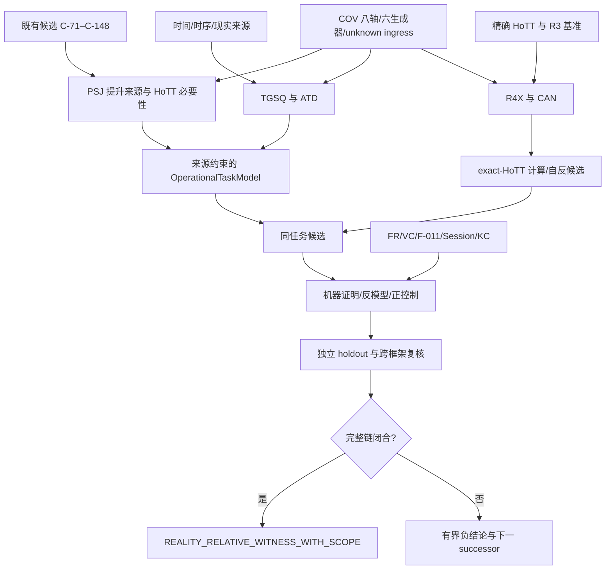

<!-- governance-shard:v2
logical_id: GPT-HOTT-MACHINE-OVERVIEW-PLAN
shard_id: 002
index: ../HoTT机器统观后续工作方案.md
-->

# 总体执行架构与统一判词

## 1. 三条发现线与两条支撑线



发现线：

- `PSJ` 从已有机器结果追踪谁实施了提升；
- `TGSQ/ATD` 从时间、运动、在线、限时等来源追踪同任务；
- `R4X/CAN` 从 exact HoTT 规则追踪计算、自反和 canonicity 的特有残差。

支撑线：

- `COV/EXP` 管搜索广度、相对完备性、未知入口和表达保真；
- `FR/VC/EVIDENCE` 管 active identity、proof/run、版本恢复和跨 Session 连续性。

任何单线都不能完成 Goal。候选只有在同任务节点汇合，才进入 A1。

## 2. P0/P1/A1

### P0：一般技术骨架

```text
Z_TECHNICAL_NONFACTORIZATION_INSTANCE_WITH_SCOPE
```

证明所选 abstraction 没有保存某 observation。它不说明 HoTT 特有、现实必要或存在实际提升。

### P1：HoTT 相关潜势

```text
HOTT_RELATED_POTENTIAL_INSTANCE
/ PROMOTION_SOURCE_OPEN_OR_SCOPED
/ REALITY_BRIDGE_OPEN_OR_SCOPED
```

要求 abstraction 来自 exact HoTT/Cubical construct，且局部边界有机器证据。相关性不等于必要性。

### A1：现实相对候选／见证

```text
POTENTIAL_INSTANCE
→ PROMOTION_SOURCE_FOUND
→ SAME_TASK_BRIDGE_ESTABLISHED
→ HOTT_ESSENTIALITY_ESTABLISHED_WITH_SCOPE
→ REALITY_RELATIVE_CANDIDATE_WITH_SCOPE
→ independent review
→ REALITY_RELATIVE_WITNESS_WITH_SCOPE
```

## 3. 统一失败判词

| 判词 | 含义 | 后续 |
|---|---|---|
| `DEFENSE_WORKS_WITH_SCOPE` | 规则或接口正确阻止越级，且来源任务可完成 | 记录防线，换候选 |
| `REPRESENTATION_BOUNDARY_CONFIRMED` | 较粗表示不含观察量，富表示保留同任务 | 保留 P0/P1，不升 A1 |
| `GENERIC_MECHANISM_WITH_HOTT_INSTANCE` | comparison calculus 同任务重现 | 停止特有性主张，按继承边界交付 |
| `PROMOTION_SOURCE_FOUND_REALITY_BRIDGE_OPEN` | 有先在提升，但现实/应用对应未闭合 | 进入来源任务与 OTM |
| `CANDIDATE_REJECTED_TASK_CHANGED` | input/consumer/observation/completion 被偷换 | 关闭当前规格 |
| `CANDIDATE_REJECTED_BY_SAME_TASK_CONTROL` | 正控制在同任务下消除困难 | 降为边界或防线 |
| `REALITY_BRIDGE_UNRESOLVED` | 来源分母闭合仍无足够桥 | 停止本 pass，保留 unknown |
| `INCONCLUSIVE_TRANSLATION_OR_PRESERVATION_OPEN` | comparison/translation 未证 | 不作 P0/P1 分派 |

## 4. 两类现实相对方向

方向 A：理论引入连续、稠密、无限细分、商化、同一化、时序坍缩或额外相干义务，使来源任务在理论中新增完成困难。

方向 B：理论或解释绕过 ASK，把 mere existence、Path、外部解释、部分分类、有限近似或可证明性提升为 chosen witness、当前归约、内部自知、总求解或实际交付。

两类都要求同一任务。不能先删掉任务必要信息，再把人为制造的缺口归因给 HoTT；也不能因 HoTT 正确拒绝越级就说理论失败。

## 5. 时间与时序

- 时间：时间、时空、运动、连续／非连续、稠密性、可分性、尺度和物理／应用结构；
- 时序：先后、依赖、因果、输入可见性、proof availability、构造与完成的落定顺序。

delay/tick/search stage 只直接支持时序主张；Path/interval/continuous carrier 只直接支持结构主张。跨两层结论必须说明解释来源。

## 6. 工作包总览

| ID | 目的 | 当前状态 |
|---|---|---|
| `FR-001` | 重建 active Goal/R4 source identity | `REQUIRED_FIRST / NOT_EXECUTED` |
| `VC-001` | 按批次版本闭合高价值未提交证据 | `PLANNED / REQUIRES_MATCHING_GIT_AUTHORIZATION` |
| `PSJ-001` | 判决既有候选的提升来源、same-task、P0/P1、essentiality | `PLANNED` |
| `TGSQ-001` | 时间/几何/运动解释来源资格化 | `PLANNED` |
| `ATD-001` | 在线/流式与限时/资源任务分母 | `PLANNED` |
| `TGF-001` | 有来源的时间/圆环同任务形式化 | `CONDITIONAL` |
| `R4X-001` | exact-HoTT/Gödel 诊断与算术消融 | `PRESERVED_AFTER_FIRST_STAGE` |
| `CAN-001` | canonicity/conversion 五对照 | `PLANNED` |
| `COV-001` | 六生成器与相对完备性 | `PLANNED` |
| `EXP-001` | 最小理论与用户悖论理论表达保真 | `PLANNED_AFTER_EXACT_TARGET` |

## 7. “规划完备”的边界

本方案可以主张职责和方法相对完备：用户核心方向、八轴、六生成器、有限/无限/归约 coverage、反解释、holdout、unknown ingress 和执行终局均有位置。

它不承诺在有限时间必然找到悖论，也不预设一个对所有候选都停机并正确判断其完整语义的总发现器。任何关于此类发现器的存在／不存在主张都需要另行固定 candidate class 与元理论证明。

