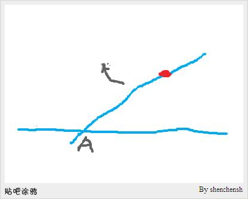
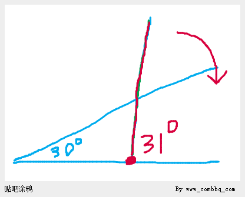

<!--
machine_managed: true
schema_version: matrix-book-paradox-extract/v1
manager_version: 1.0.0
extract_id: MP-05
source_external_path: /Users/aurolafly/MinerU/The Art of The Matrix 宇宙编程学 —— 世界与意识、悖论与时空（第三版）.doc-49840494-168f-45cd-997a-0b1e891c222f/MinerU_markdown_202609010456973_03d86f36.md
source_sha256: 24530b89725d4043a7a5292a403ab50d48feed5417351c348790150726ae9409
source_line_range: 3941-4001
verbatim_sha256: a01ef1128a31d2681865ecfe8f5ed6483c504ed8983fd381ef49c867f2943a5e
review_status: USER_SOURCE_UNREVIEWED_CLAIMS
-->

# shenchensh 平行线转动悖论：原始发难

- Extract ID: `MP-05`
- Source lines: `3941-4001`
- Source SHA-256: `24530b89725d4043a7a5292a403ab50d48feed5417351c348790150726ae9409`
- Role: `paradox_statement`
- Topics: `shenchensh, parallel_lines, rotation, infinity, zeno`
- Status: `USER_SOURCE_UNREVIEWED_CLAIMS`

下面是连续、逐字的 MinerU 源片段。它证明用户原作中这样讨论过，不自动证明其中的数学、物理或历史主张正确。

<!-- BEGIN VERBATIM -->
## **shenchensh发难：超级悖论**

原帖地址：[http://tieba\.baidu\.com/p/1834112597](http://tieba.baidu.com/p/1834112597)

百度贴吧吧友shenchensh ：

大家想象斜线绕定点（红色标记处）沿箭头顺时针方向旋转，那斜线与水平线的交点A点就会向左移动。现实情况是：斜线可以和水平线平行。理论逻辑却是：A点必须无间隙的持续移动。我们知道，直线是没有尽头的，所以两条直线只能无限的接近平行，不可能绝对平行。请大家给个说法！！！

www\_combbq\_com（本人）：

再一次展示了数学认知能力带来的矛盾。

【数学的问题只能在数学认知能力中解决】。

你可以想象它的确完不成相交的断开，也就是只可以无限接近于平行。

如果非要旋转起来，那只能是你的认知能力接受了这一矛盾，在无限接近平行的时候跳了过去。

其实楼主的问题可以进一步深化：

就是芝诺悖论了，也就是说，任何一个小的角度的【旋转】其实都不可能完成，因为在数学认知能力中这个小的角度中有【无限】个小的角度等待楼主去一一转过。

www\_combbq\_com（本人）:

比如，按照楼主的设计方法我来设计一个从【31度】角转不到【30度】角的【画面】。

图中，30度角的射线已经做好，指针正在31度角的位置，如果要让指针达到30度角，必须解决楼主提出的【无限长射线的平行问题】。

所以，别说转到平行，就是转过一度都是不可能的。

这就是数学认知能力自身产生的认知问题。

【数学的问题只能在数学认知能力中解决】。

www\_combbq\_com :

大家有没有想过，楼主的问题其实就引出了相对论中关于光速的问题。

也就是说，如果说我们的宇宙是无限大的（因为我们想不出来宇宙的边界要如何才能存在。）

那么对于这样一个宇宙空间来说，假设我们存在一个【无限快】的光速，

打开就直射宇宙的无限之处，

那么必将遇到楼主所说的问题的衍生问题，

也就是【半个角度都转不过去】的问题。

这样就证明了光速必定是有限了，

或者说不存在【无限快】的【空间中的】传播方式，即使光速不是极限，也总是会有一个极限速度存在。

速度不能是无限的。

<!-- END VERBATIM -->
