
# **目录**

- [内容简介](#__RefHeading___Toc370900607)
- [作者简介](#__RefHeading___Toc370900608)
- [目录](#__RefHeading___Toc370900609)
- [序](#__RefHeading___Toc370900610)
    - [为这个世界带来我应该带来的智慧](#__RefHeading___Toc370900611)
    - [宇宙编程学思想在我的生命中最早的一次出现](#__RefHeading___Toc370900612)
    - [为什么C语言是大学公共基础课？](#__RefHeading___Toc370900613)
    - [关于这本书](#__RefHeading___Toc370900614)
    - [为什么要写这样一本书](#__RefHeading___Toc370900615)
    - [再上路](#__RefHeading___Toc370900616)
- [致谢](#__RefHeading___Toc370900617)
- [宇宙编程学](#__RefHeading___Toc370900618)
    - [编程思想](#__RefHeading___Toc370900619)
    - [道](#__RefHeading___Toc370900620)
    - [道的设计](#__RefHeading___Toc370900621)
    - [道之生推演](#__RefHeading___Toc370900622)
    - [推演结果的保存](#__RefHeading___Toc370900623)
    - [推演结果的回放](#__RefHeading___Toc370900624)
- [世界](#__RefHeading___Toc370900625)
    - [世界在哪里？](#__RefHeading___Toc370900626)
    - [我们的讨论小组](#__RefHeading___Toc370900627)
    - [小A——什么是世界？](#__RefHeading___Toc370900628)
    - [小A——在世界之中](#__RefHeading___Toc370900629)
    - [小A——存在感的二元性](#__RefHeading___Toc370900630)
    - [小A——什么是智慧](#__RefHeading___Toc370900631)
    - [小A——存在逻辑的二元性](#__RefHeading___Toc370900632)
    - [小A——世界存在于粒子道的推演过程之中](#__RefHeading___Toc370900633)
    - [小A——一次推演两块内存](#__RefHeading___Toc370900634)
    - [小A——多系统串联](#__RefHeading___Toc370900635)
    - [小A——世界的落脚点](#__RefHeading___Toc370900636)
    - [小B——对落脚点的疑问](#__RefHeading___Toc370900637)
    - [小A——比特与信息](#__RefHeading___Toc370900638)
    - [小B——双系统互联](#__RefHeading___Toc370900639)
    - [小B——显示器上的世界](#__RefHeading___Toc370900640)
    - [小A——平行世界的分支](#__RefHeading___Toc370900641)
    - [小A——两本书还是一本书的问题已经过时了](#__RefHeading___Toc370900642)
    - [小A——拷贝不是介质而是介质中的一份内容](#__RefHeading___Toc370900643)
    - [小A——推演和播放不一样](#__RefHeading___Toc370900644)
    - [小A——世界的过程本质](#__RefHeading___Toc370900645)
    - [小A——世界的整体性之由来](#__RefHeading___Toc370900646)
    - [小A——改变世界进程](#__RefHeading___Toc370900647)
    - [小A——世界存在于推演过程之中](#__RefHeading___Toc370900648)
    - [小B——推演过程之中没有世界](#__RefHeading___Toc370900649)
    - [小C——世界存在于3D打印的落脚点集合之中](#__RefHeading___Toc370900650)
    - [小B——世界不存在于3D打印的落脚点集合之中](#__RefHeading___Toc370900651)
    - [世界在哪里？](#__RefHeading___Toc370900652)
- [意识](#__RefHeading___Toc370900653)
    - [信息](#__RefHeading___Toc370900654)
        - [小A——什么是信息？](#__RefHeading___Toc370900655)
        - [小A——事物的对立不必是信息的编码](#__RefHeading___Toc370900656)
        - [小A——事物的对立不必暗示任何信息的内容](#__RefHeading___Toc370900657)
    - [如果意识完全由身体之中的物质支撑](#__RefHeading___Toc370900658)
        - [小A——如何从物质到了意识？](#__RefHeading___Toc370900659)
        - [小A——信息处理系统的自我演化](#__RefHeading___Toc370900660)
        - [小A——我思](#__RefHeading___Toc370900661)
        - [小A——为什么我们得不到第二个爱因斯坦？](#__RefHeading___Toc370900662)
        - [小A——信号处理系统和信息处理系统的分划，是智慧的基础](#__RefHeading___Toc370900663)
        - [小A——总结一下](#__RefHeading___Toc370900664)
        - [小A——进一步总结](#__RefHeading___Toc370900665)
        - [小A——Thinking of Thinking](#__RefHeading___Toc370900666)
        - [小A——意识是过程](#__RefHeading___Toc370900667)
    - [信息系统的拓扑本质](#__RefHeading___Toc370900668)
        - [小B——存在的同一性](#__RefHeading___Toc370900669)
        - [小A——世界的全部信息依旧不是世界本身](#__RefHeading___Toc370900670)
        - [小A——信息系统的拓扑本质](#__RefHeading___Toc370900671)
        - [小A——临摹思想](#__RefHeading___Toc370900672)
    - [作为意志和表象的世界](#__RefHeading___Toc370900673)
        - [小B——有时那是我们的一厢情愿](#__RefHeading___Toc370900674)
        - [小B——存在感的二元性与自我存在感的错觉](#__RefHeading___Toc370900675)
        - [小A——为什么影子是黑色的？](#__RefHeading___Toc370900676)
        - [小A——作为意志和表象的世界](#__RefHeading___Toc370900677)
    - [心外无物](#__RefHeading___Toc370900678)
        - [小B——世界是意识的错觉](#__RefHeading___Toc370900679)
        - [小B——其他意识真的存在吗？](#__RefHeading___Toc370900680)
        - [小B——自我意识真的存在吗？](#__RefHeading___Toc370900681)
        - [小A——意识是意识的错觉](#__RefHeading___Toc370900682)
        - [小A——作为意志和表象的世界永远是理念的世界](#__RefHeading___Toc370900683)
        - [小A——世界与意识](#__RefHeading___Toc370900684)
    - [现象与理念](#__RefHeading___Toc370900685)
        - [小B——随机数中的意识现象](#__RefHeading___Toc370900686)
        - [小B——一个意识，还是两个意识？](#__RefHeading___Toc370900687)
        - [小A——数据解释程序是意志的延伸](#__RefHeading___Toc370900688)
    - [思想与灵魂](#__RefHeading___Toc370900689)
        - [小B——到目前为止被扔进理念世界的事物](#__RefHeading___Toc370900690)
        - [小B——说出“我存在”和感觉到“我存在”](#__RefHeading___Toc370900691)
        - [小B——一个疑问](#__RefHeading___Toc370900692)
        - [小B——对思想的临摹与对大脑的临摹](#__RefHeading___Toc370900693)
        - [小A——思想与灵魂](#__RefHeading___Toc370900694)
        - [小A——有思想没灵魂的不是人](#__RefHeading___Toc370900695)
    - [语义量群](#__RefHeading___Toc370900696)
        - [小A——意识的本质不是物质，也不是物质的运动](#__RefHeading___Toc370900697)
        - [小A——量群是否携带了世界的全部信息？](#__RefHeading___Toc370900698)
        - [小A——意识是量群的变化而不是物质的运动](#__RefHeading___Toc370900699)
        - [小A——量群的智慧变化模式](#__RefHeading___Toc370900700)
        - [小B——量群中量的承载者的多样性](#__RefHeading___Toc370900701)
        - [小A——量的语义与量的数值](#__RefHeading___Toc370900702)
        - [小A——语义量是语义和量的统一](#__RefHeading___Toc370900703)
        - [小A——量群中量的语义是固定的](#__RefHeading___Toc370900704)
    - [现象与因果](#__RefHeading___Toc370900705)
        - [小B——温度有意识？](#__RefHeading___Toc370900706)
        - [小A——有模式就有意识](#__RefHeading___Toc370900707)
        - [小B——现象与因果](#__RefHeading___Toc370900708)
        - [小A——意识现象来源的分类](#__RefHeading___Toc370900709)
    - [灵魂与当下](#__RefHeading___Toc370900710)
        - [小B——灵魂存在的证明](#__RefHeading___Toc370900711)
        - [小A——电与磁](#__RefHeading___Toc370900712)
        - [小B——电与磁](#__RefHeading___Toc370900713)
        - [小A——电与磁](#__RefHeading___Toc370900714)
        - [小A——自我与当下](#__RefHeading___Toc370900715)
        - [小B——问题依旧](#__RefHeading___Toc370900716)
        - [小B——B是灵魂吗？](#__RefHeading___Toc370900717)
    - [如果意识不完全由身体之中的物质支撑](#__RefHeading___Toc370900718)
        - [小A——灵魂与当下](#__RefHeading___Toc370900719)
        - [小B——存在感的二元性与世界存在感的错觉](#__RefHeading___Toc370900720)
    - [小A小B小C——我们的论—辨图谱](#__RefHeading___Toc370900721)
    - [灵魂存在吗？](#__RefHeading___Toc370900722)
- [数学](#__RefHeading___Toc370900723)
    - [罗素悖论](#__RefHeading___Toc370900724)
    - [Better Best 悖论](#__RefHeading___Toc370900725)
    - [思维是四维的](#__RefHeading___Toc370900726)
    - [是非判断之前先要判断是否能判断是非](#__RefHeading___Toc370900727)
    - [芝诺悖论](#__RefHeading___Toc370900728)
    - [shenchensh发难：超级悖论](#__RefHeading___Toc370900729)
    - [勾三股四弦五是巧合](#__RefHeading___Toc370900730)
- [宇宙](#__RefHeading___Toc370900731)
    - [哲学三大基本问题](#__RefHeading___Toc370900732)
    - [量子纠缠之麻花藤之麻花疼版](#__RefHeading___Toc370900733)
    - [穿越无限——哲学三大究极问题之空间无限性](#__RefHeading___Toc370900734)
    - [橡皮条的故事](#__RefHeading___Toc370900735)
    - [橡皮圈的故事](#__RefHeading___Toc370900736)
    - [橡皮套的故事](#__RefHeading___Toc370900737)
    - [地球上人们的视觉体验](#__RefHeading___Toc370900738)
    - [圆型体中的平行](#__RefHeading___Toc370900739)
    - [稠密空间](#__RefHeading___Toc370900740)
        - [使用圆型体解决shenchensh悖论](#__RefHeading___Toc370900741)
        - [稠密空间中的shenchensh悖论](#__RefHeading___Toc370900742)
        - [圆型体空间的启示](#__RefHeading___Toc370900743)
        - [圆型体与天圆地方](#__RefHeading___Toc370900744)
        - [圆型体思想的来源](#__RefHeading___Toc370900745)
        - [球面上直线都是经线](#__RefHeading___Toc370900746)
        - [对称法证明：球面上的直线都是经线](#__RefHeading___Toc370900747)
        - [反证法证明：球面上的直线都是经线](#__RefHeading___Toc370900748)
        - [圆型体与空间膨胀](#__RefHeading___Toc370900749)
    - [非稠密空间](#__RefHeading___Toc370900750)
        - [直线的独立性、相对性、本地性、假象性原理](#__RefHeading___Toc370900751)
        - [图解直线的独立性原理](#__RefHeading___Toc370900752)
        - [“直”是错觉](#__RefHeading___Toc370900753)
        - [非稠密空间中的shenchensh悖论](#__RefHeading___Toc370900754)
        - [命题：运动—时空离散的圆型体中的射线最终必将闭合](#__RefHeading___Toc370900755)
        - [证明：运动—时空离散的圆型体中的射线最终必将闭合](#__RefHeading___Toc370900756)
    - [对芝诺悖论和shenchensh悖论的总结](#__RefHeading___Toc370900757)
- [数学 哲学](#__RefHeading___Toc370900758)
    - [一是祸害？](#__RefHeading___Toc370900759)
    - [数学系统的两种矛盾](#__RefHeading___Toc370900760)
    - [自然也在做推理](#__RefHeading___Toc370900761)
    - [任何事物的存在和发展都将导致自身对立面和否定面的存在和发展](#__RefHeading___Toc370900762)
    - [悖论是数学理念世界不可或缺的一部分](#__RefHeading___Toc370900763)
    - [任何事物都有其正面意义和反面意义](#__RefHeading___Toc370900764)
- [生命](#__RefHeading___Toc370900765)
    - [细胞分化原理](#__RefHeading___Toc370900766)
    - [永续与永生：生命与个体精神的对立](#__RefHeading___Toc370900767)
- [后记](#__RefHeading___Toc370900768)
    - [那些我们以为存在过的事物真的存在过吗？](#__RefHeading___Toc370900769)
    - [芝诺悖论、shenchensh悖论、勾三股四弦五、量子纠缠它们暗示了什么？](#__RefHeading___Toc370900770)
    - [人之初，性本善——道生一，一生二，二生三，三生万物](#__RefHeading___Toc370900771)
    - [中国而今有圣人](#__RefHeading___Toc370900772)
- [参考文献、资料](#__RefHeading___Toc370900773)

# **序**

## **为这个世界带来我应该带来的智慧**

邢老师：

您好。

非常感谢您的耐心答复。

让我知道了我的问题出在哪里——把一切想得太简单了。

当初我们学院主管教学的副院长跟我说：考研是一件很奇怪的事儿，你保研，不要考。

我婉拒了副院长的善意邀请，但是一直到昨天才我明白，为什么【考研是一件很奇怪的事儿】。

我昨天在网上搜索了别人考研的经验，才发现有人读哲学史做笔记做了10万字，有人做哲学史真题做了10万字。

而我读《西方哲学原著选读》只读到了34页左右，也就是芝诺悖论——飞矢不动所在的位置。

这个时候我发现了飞矢不动问题可能揭示了运动在时空之中是不连续的事实，也就是说爱因斯坦的相对论和微分几何倚赖来的基础——时空的稠密性不存在。

实数的稠密性作为运动所在的时空的抽象是人类一种错误的先验假设。

如果时空是离散的，那么什么样的时空是离散的？

我们人类自己的实践告诉我们——计算机推演的时空是离散，因为计算机只能表达离散的数据，或者说计算机中是无法表达任意精度的小数的。

如果我们是被计算机推演着的宇宙，那么我们所谓的粒子的空间位移，其实就是计算机中某个粒子位置数据的变化——整个世界就是数字化的，一切其实都是计算机中的数。

那么谁最早提出【宇宙万物就是数】这个观点的？

《西方哲学原著选读》18页：毕泰戈拉派认为【数是万物的本原】。

也许有人会说是《黑客帝国》提出的，我也不能反驳。

更为重要的是，如果时空是离散的，那么现实中就确实不存在根2这个数字。因为长度都是离散的点，所以现实中的真实等腰直角三角形的斜边就是一些可数（尽管很多）的离散点，而不是根2这个无限不循环小数。

听说当初毕达哥拉斯学派中发现根2，从而使得整个毕达哥拉斯学派崩毁的人，被学派中的人扔到了海里——这样看来，其实有些死亡本来是可以避免的。

所以我把芝诺悖论当作是运动—时空不连续的直接证据，同时把它当作是世界是被推演的——从而世界不存在——的【间接】证据。

当我写完《芝诺悖论》这篇文章的时候，已经是凌晨五点，东方既白：

《芝诺悖论》

然后分享到了百度哲学吧中。

进而在百度哲学吧中遇到了别人提出了平行线转动悖论：

《shenchensh发难：超级悖论》

籍由平行线转动悖论，我更加确定了运动—时空是离散的，不是连续的。

但是如果是连续的，那么数学上有没有一种解决的办法呢？

这促使我去思考【如果时空是连续的，而且平行线悖论是不存在的】那么三维空间的真实结构应该是怎样的？

结论应该是像二维的球面一样，我们处于三维的【圆型体】中，相关论说过程在这里：

《穿越无限——哲学三大究极问题之空间无限性》

在论说开始的时候，我就隐约觉得，我在说的东西，可能就是黎曼几何，虽然我没有学过黎曼几何，但是我知道它是非欧几何。

无论我们是在二维球面上，还是在三维圆型体中，都有一个重要的性质：

那就是宇宙没有中心，或者说，宇宙中的各处都是宇宙的中心，想象一下地球表面的中心在哪里这个结论就不难理解。

更为重要的是，这表示我们可以遍历宇宙中的每一个点，但是我们就是找不到宇宙的门——出口在哪里。

当我意识到这些的时候，我忽然觉得上帝在天上哈哈大笑，笑我就算是知道了又怎样——反正你走出不去——其大无外。

在得到了【圆型体】的概念之后，我忽然想起时空如果是不连续的，那么平行线转动悖论也就不存在了——因为转动也是不连续的，转动过程就是转过有限个微小的角度。

这样，平行线悖论就直接支持了运动—时空不连续的结论，而这也是芝诺悖论——飞矢不动所支持的结论。

从而两大悖论完美呼应。

进而时空离散化可能源自宇宙是被计算机推演着的这一想法就同时得到了另一个悖论的【间接】支持。

但是，如果宇宙是被推演着的，会隐藏了一个问题，就是如何解释人的【当下】意识。

也就是说，为什么我总是感觉自己是活在当下，活在向后流淌着的时间当中。

所以我探索了意识的本质，我认为，如果意识完全来自这个世界人的身体之中的物质的运动，那么用计算机领域做类比，物质层就是硬件，就是信号处理系统，而意识层就是软件，就是信息处理系统——当然这是很多人都晓得的观点。

问题是如何从物质到了意识？这是马克思没有说清楚的地方，而且我认为以那时人类的实践水平——在计算机没有发明的时代，这是可以理解的。

从信号处理系统到信息处理系统的过程，可以类比于计算机中的驱动程序。

驱动程序是第一个不把信号当信号的地方，也就是第一个把信号指向信息的地方，第一个把信号指向“他物”的地方：

《意识》

《Thinking of Thinking》

虽然这种想法让我对意识有了更进一步理解和把握，但是奥巴马最近宣布了一项绘制人脑中神经地图的计划，说明人类对大脑的认识还没有到那么彻底和肯定的地步。

所以，意识来源于身体中的物质的观点，只能说是【一种观点】。

另外一种观点就是意识不完全来自于我们身体中的物质，也就是说灵魂存在。

更为重要的是，灵魂作为意识与肉体对接从而让人有了思维这件事立即为我们刚刚的问题——即为什么我总是体验着当下，体验着时间的流逝——给出了答案：

因为灵魂是被【接到】肉身之上的，而整个世界是被计算机推演着的，那么肉身就相当于网络游戏中的一个角色。

灵魂相当于在电脑前操作角色的玩家——核心意识（们）。

整个被计算机推演着的世界就像在对着灵魂放电影一样，而灵魂接入肉体这件事就像我们在玩未来游戏的时候带上了3D可视头盔。

这个时候，我忽然发现，如果人类大脑神经地图绘制计划宣布意识无法完全在人体结构之中找到，那么不仅仅关于意识和物质的关系要被改写，而且现有的一切都可能会被颠覆：

宇宙可能只是在计算机中推演着的程序，而我们的灵魂只是被接入到了这个程序中——那么，世界根本就不存在。

想到这里的时候，我忽然想起我以前对量子纠缠的猜想，我那个时候认为量子纠缠是高维空间存在的证据：

《量子纠缠之麻花藤之麻花疼版》

现在想来，如果是真正的超距作用，也就是无论两个量子放置多么远，它们的变化都是同步的。

那么更加让我们怀疑空间——作为所有运动的障碍，是不是真的像我们想象地一样，是一种切实的存在。

会不会空间真的就是计算机中推演着的粒子的对象的内存数字。

如果那样的话，确实，什么超距作用都可以使用软件算法实现，根本不需要把空间考虑为一种【障碍】。

所以，我忽然发现，除了芝诺悖论——飞矢不动、shenchensh悖论——欧式几何的平行线悖论之外又出现一个指向宇宙是被推演着的程序的【间接】证据。

可以说，【量子纠缠】是所有【间接证据】中最接近【直接证据】的一个。

……

后来，一个偶然的机会，我看到说宇宙正在膨胀，也就是说空间正在变多，我忽然想到了自己的圆型体的理论，如果我们三维宇宙作为一个四维圆型体宇宙中的三维圆型体，那么我们就相当于一个二维球面在一个三维圆型体中。

如果这个二维球面想气球一样被吹起，那么我们会发现球面的表面积先增大，后减小——因为这个球面在三维圆型体中。

而二维球面，在三维圆型体中的运动如果超过了三维圆型体中两个极点之间的赤道部分，那么结果就是整个二维宇宙空间会越来越小，最终会相撞于三维圆型体中的另一个【极点】——这个时候没有空间，或者说空间就是一个点——其大无外、其小无内——曾经有人这么说。

相撞之后就是爆炸——宇宙大爆炸，然后再形成二维球面，从这个极点开始向原来那个极点运动：

《圆型体与空间膨胀》

……

这些想法都不是一天产生的，可是确实是从我考研开始看书的时候产生的。

最开始我的专业课的另一门打算考西方哲学史。

可是只要我一打开哲学书籍，看两页就会产生一个新想法，就要写文章到我的博客 www\.ComBBQ\.com 上记录下来。

再看两页就又产生了一个新想法……

我知道这样下去我是考不上研的，所以我《西方哲学原著选读》只看到34页就不敢再看下去了。

于是我就换了语言学，想学学语言学的知识基础，也好完成自己当初激发自己考研的最原始理由：

如果现在去校内网，搜索我的名字刘启壮，看到我的“状态”还是我一年半之前写下就没有变的：

“刚刚我喝了点酒，一冲动，就给自己定了个目标。后来我意识到了这点，就决定不发布了。但是现在我决定发布它，因为我觉得只有这样才能让自己真的酒醒了：我要用两年的时间研究语言和哲学之间的关系并写一本书，2011年10月7日 ~ 2013年10月7日，我希望能给这个世界带来我应该带来的智慧。 ”

【我希望能给这个世界带来我应该带来的智慧】，这就是我辞掉一万八每月的工作来考研的原因。

看我唠叨这么多，想必老师您已经很累了。

您的《数理逻辑》给我最大的启发就是反证法的形式化：

结论中的矛盾，可能是任何一个前提需要被否定。

而这些前提，我们甚至可能都不知道它们实际是存在的——比如空间稠密性其实就是一种先验假设，可是很少有人意识到它是我们很多推理的前提。

这一启发是对我在考研时期所做的所有哲学工作的最有力支持。

我考试之后开始总结自己的想法，已经汇编出了一个框架。

由于这些想法已经形成一个稍有模样的体系，所以我斗胆把它起名为《宇宙编程学》。

我愿意把这些思想未来可能的形式提前发送给您，因为这次考研让我成长，能够读到您的《数理逻辑》是缘分。

也当作是对这段时光的一种告别吧。

最后，祝您和您的家人身体健康，万事如意。

刘启壮敬持。

## **宇宙编程学思想在我的生命中最早的一次出现**

我高中的时候有个同桌，喜欢一个姑娘，其实那个姑娘我也半真半假地喜欢着。

但是同桌比较小心眼，这事儿可是他自己告诉我的：“我这个人就是比较小心眼”。

然后有一天，大概那个姑娘要做个什么事情，在周末。

他呢就怕我去和那个姑娘在一起，所以就想了一招儿来拖住我。

结果我就去了他家，这家伙业余时间是搞程序设计的，用VB语言。

这家伙在家做什么呢？就是要把一个卫星螺旋着落到地面上来。

问我怎么弄。

我想了想。

我说，你这样：先让卫星有一个速度，按照这个速度飞上【一段极小的时间**】**，然后再计算地球和卫星之间的万有引力构成的加速度在这段时间中对卫星的速度的影响。

然后再在这段时间的末尾，相应地根据计算结果改变卫星的速度，用于下一段时间对卫星的飞行的计算。

只要你把这段【极小的时间】变得足够小，那么你就会模拟得足够真实。

当然，现在我要这么说，由于计算机对小数字的计算精度的问题，实际运行结果未必就是越小的时间间隔结果误差就越小，也可能会变大。

但是在当时，在我高中二年级的时候，这可是微积分思想啊，要注意我们那个时候可是没学过也没听过微积分思想的，顶多只知道微积分这个名字，知道牛顿，甚至都不知道莱布尼兹。

现在想想，这还不仅仅是微积分思想的雏形，这甚至都是宇宙编程学思想的雏形，那段【极小的时间】，就是宇宙编程学中的【上帝秒】。

## **为什么C语言是大学公共基础课？**

我大学有个同学，但不是我们班的，甚至不是我们院系的，是材化学院的。

哥们最后被保送到了清华读研，因为成绩优异。

当年有一天下午我被他叫去帮忙在Turbo C平台上帮他搞搞C语言编程作业，写写小程序。

在那天快要结束的时候，他们寝室，有人对我产生了敌意。

原因是他能请到我这样一个高手，帮着写程序，而且居然还不用吃晚饭，整个一个机器人。

而剩下的兄弟都面临着明天要交C语言作业却没法交的痛苦境地，所以他的寝室兄弟都有点恨意，而且表现在了对我的态度上。

又过了2年，听说清华有一姑娘为了C语言编程作业出去和男生开房。

可见，即便是对精英群体而言，C语言也一直都是个事儿。

于是放眼去看全国大学生，你就明白了为什么那么多人哭着喊着地不明白为什么大学里面要把C语言课列为公共基础课。

就像有些人数学不行一样，有些人编程真的不行。

甚至有些数学不错的人，编程也不行。

有些编程不错的人，数学其实还真不咋的——你比如说我。

但是，如果大家想要理解宇宙编程学，大家想要理解我关于意识的阐述，如果没有编程基础，对编程丝毫没有概念，那是万万不行的。

你可以不会写某一个具体的程序，但是你至少要知道程序大概是怎么写成的，程序设计【语言】里面有些什么“工具”，可以帮助你去思维问题领域，去描述数据的结构和计算的过程。

有时候想想象是宿命，如果我不去读这个专业，我就没有这份实践，从而也就获得不了这份认识。

所以，大家如果没有编程基础，那么就领会不完全我的思想。

而这份思想，我想说，是我所知的这个时代的先进的——如果不是最先进的——哲学思想，是在新的实践基础上为时代所孕育出来的思想。

当然，只是碰巧由我来阐述罢了。

其实就是没有我，山东省烟台市莱山区刘家庄中其他和我拥有相同Y染色体的人中也会有人告诉大家这一切的。

学习C语言最朴实的目的就是为了【能】交流。

## **关于这本书**

这个世界可能是存在的，但是这个世界又可能是不存在的。

第一句话很好理解，因为我们的现实如此现实。

第二句话不太好理解，也正是因为不好理解，才有了这本书。

有人要问，如果这个世界不存在，那么你在打字的这个周围环境又算是什么呢？

是啊，这本书就是要告诉你，这个环境到底是什么——看起来如此真实的东西，是不是就真的存在？

很多人很喜欢康德的哲学，我也很喜欢。但是我发现，康德的哲学是有局限性的。

而一个哲学有局限性这事儿，似乎是马克思【第一次】提出来的。

我读书不多，就不过多地去深究啦。

因为毕竟，我不是要成为一位【哲学学者】，我是一个【哲学家】。

哲学，作为意识对自己和世界的认识，由于人类实践的局限性，从而免不了自身带有时代性。

因而，一个哲学，往往属于一个时代，代表着和属于着一种实践的层次。

随着实践的深入，尤其是新的实践领域的开拓，新的哲学将会填补旧哲学的空白，修改旧哲学的不足之处，推动人类的思想向前进。

这个过程，因为哲学家的使命感，也经常被哲学家宣称为是一种“批判”。

我是这样看【批判】这件事情的：我的文章写出来就是让人批判用的。

我非常欢迎大家批判我的哲学。

我更希望你们的批判不是皮毛的批判，而是更深刻、更本质方面的批判。

有时候那不是一厢情愿就可以完成的，也许要等新的实践和新的时代的到来。

## **为什么要写这样一本书**

小时候，我们会和小伙伴为了空间的边界之外是什么而讨论，为时间没有起点也没有终点而惊叹，为上帝的上帝是谁而争论。

若干年后，即便偶然想起来这些问题，我们也是立即在脑海中将它们扔到一边。

因为我们要做题，我们要看书，我们要工作，我们要玩，还有好多好多事等着我们去干，还有好多好人等着我们去沟通。

那些从不认输的人，面对空间无限性、时间无限性、造物主的无限性的问题，往往也只能望洋兴叹。

我们来到这个世界上以后，遇到了很多问题，直到我们离开的时候，也没有任何头绪。

但是，我无法接受就这样离开。

## **再上路**

无论是C\+\+还是Linux，它们都是人造的东西。对于一个人造的东西，要了解它的最简单的方式莫过于去问那个造它的人。那么我们这些外部hacker的存在的价值是什么？我们辛苦求索的东西，如果它是上帝造的，hacker当然是英雄，可问题是它是人造的，hacking一个人造的东西的成就感是真实的吗？

C\+\+源自ATT，MFC源自微软，Linux源自开源社区。这些人或组织创造的不仅仅是一个产品，更创造了一个江湖。我们在江湖之中为了获得大侠之名，遍览群书，编码实做，交流时通过显摆自己对底层机制和犄角旮旯用法的了解，从而一决高下，最终获得江湖之名。这是不是郭敬明笔下的幻城呢？

“好程序员”终究有一天会变成“后程序员”，伴随着的是心中大侠之梦的散去，伴随着的是心离开了江湖。但那并没有使一切更清晰，只是过去的更清晰，未来反而更加迷茫。这份迷茫如果解开就是成熟，如果解不开就是迷失。《宇宙编程学——世界与意识、悖论与时空》就是一本后程序员写给后程序员的上路书。

# **致谢**

感谢参考文献、资料中各文献、资料的创作者，感谢百度贴吧支持我和启发我的各位吧友，尤其是shenchensh。

是你们启迪了我的思维。

这本书中的思想离开你们的帮助是无法出现和完成的。

谢谢！

# **宇宙编程学**

## **编程思想**

假设我们有两个质点A、B，分别放在10米和\-10米的数轴位置。

质点的大小相同，然后开始计时，质点必然是同时朝向0点开始运动。

但是由于这个过程中，两个质点之间的距离在发生变化，所以之间的力，依照牛顿定律，就会发生变化，从而质点的加速度就不是恒定的。

从而在某一时刻，质点的速度是多少，位置在哪里，就不是那么容易计算得到的了，也不是那么容易直观想象的了。

那么我们如何用计算机来模拟这个过程，从而让我们看到动态效果呢？

我的想法是，将时间分成很多小片。

比如一个小片是0\.1秒，那么在第一个时间小片【之前】，我根据20米（10米\+10米）这个距离和质点B的质量，可以通过牛顿定律计算得到质点A在质点B的力场的20米半径这个位置所获得的质点B带来的加速度。

然后我使用加速度乘以时间小片的长度，也就是加速度乘以0\.1秒，就得到了在0\.1秒这个时间片【之后】，质点A的速度。这个时候我完成了【第一次计算】。

然后在第一个时间片完成的时候，我进入了【第二次计算】：

我通过用第一次计算中的结果——即A的速度——乘以0\.1秒，得到A在第二个时间片中移动的距离，从而得到A的【新位置】，这个新位置是留待下次计算使用的。

利用第一次计算结束时候A的位置和B的位置，以及B的质量，再次得到A的【新的加速度】，并且计算出来A在新的加速度之下，0\.1秒之后A的【新的速度】是多少。

此时，第二次计算完成。

0\.1秒之后，第三次计算到来，仿照第二次计算，我们再次获得了A的新位置和A的新速度。

我们用每一次的位置来绘制A这个质点，我们就可以看到每隔0\.1秒，质点A在屏幕上都会移动一下。

这个过程写成伪码的形式：

【上次】代表上次计算结束。

【下次】代表下次计算开始。

Do

\{

            1. 用A上次的速度运动过本段时间，得到A下次的位置。

            1. 用B上次的速度运动过本段时间，得到B下次的位置。

            1. 用A、B上次的位置，计算A当前的加速度，得到A下一次的速度。

            1. 用A、B上次的位置，计算B当前的加速度，得到B下一次的速度。

            1. 利用A下次的位置，绘制A到屏幕上。

            1. 利用B下次的位置，绘制B到屏幕上。

\}

While（0\.1秒过去了）

如果我们不使用0\.1秒，而使用更小的时间间隔，那么理论上我们会得到这个过程的更精确的模拟。

这是两个质点的情况，同样的道理，我们可以推演三个质点的运动情况，只不过B质点的引力场给A质点带来的加速度不能直接使用，而是要利用平行四边形法则与C质点的力场给A质点带来的加速度进行合成，然后再利用合成出来的新加速度进行速度的计算。

同样的道理，N\+1个质点的情况，对于其中的某一个质点，我们要用重复使用平行四边形法则叠加它在N个质点的引力场中的加速度，用【合加速度】计算新的速度。

这诱发我们去想一种理想情况，去做一个理想实验：

如果我们掌握了宇宙中所有粒子的种类和各种粒子之间的相互作用方程，以及某一时刻宇宙中各个粒子的位置、速度以及其他需要带入方程的参数，是不是我们就可以就此推演整个宇宙从此之后的样子？

如果我们的计算机足够强大，我们甚至可以在事情发生之前就推演出将要发生的事情。

当然，这个理想实验有一个奇点，就是我们是如何推演这台计算机本身的。

不过，如果这台计算机不在我们的宇宙之中，就没有这个问题了。

我们以后只考虑这台计算机不在所推演的宇宙之中的情况。

这样的理想实验，诱导我们去思考，我们的宇宙究竟是不是真实的。

这个问题可以换一种问法：

我们所推演的宇宙，究竟是不是一个真实的宇宙？

我们能够利用天量粒子推演出一个有运动、有聚集、有碰撞的宇宙，那么我们可不可能推演出生命呢？

可不可能推演出意识呢？

可不可能推演出一个人在打字呢，比如现在我就在打字。

有人说：

可以，因为既然有人模拟了我们宇宙中所有粒子的相互作用，那么计算机中模拟的粒子在那个虚拟的宇宙【空间】中就会有和现实中我们这个宇宙中的粒子一样的行为。

从而，会有一些粒子，当然对于人类来说个数很多了，在那个模拟的程序的虚拟空间中，聚集在一起，成为一个人，而这个人正在键盘上打字。

这个人就是我。

这个人又不是我。

我是现实中的我，虚拟空间中的我不是我。

但是虚拟空间中的那个和我完全一样的虚拟我，拥有和我一样的生命过程。

## **道**

宇宙编程学从宇宙编程的工序上分为三个部分：

1\. 道的设计。

2\. 道的计算推演。

3\. 道的计算推演结果保存、打印输出。

什么是道？

道其实就是我们要推演的宇宙，这个现实的宇宙。

同时，道也是正在模拟这个宇宙的那个程序，那个内存中的【运行着的】程序。

但是我们更需要一个这样的道的概念，道就是所有种类的粒子和它们之间的相互作用方程，以及由这些类型的海量粒子构成的那个初始粒子聚集，这个聚集就是大爆炸的来源。

## **道的设计**

对于道的设计，我们的目标的要放在宏观：比如我们要能进化出人这种智慧生命来。

但是道设计的着力点却要放在微观，因为微观是一切的构成基础。

这一从微观到宏观或者从宏观反推到微观的设计过程就是我们设计“道”的过程。

上一届有位叫耶和华的同学设计了62种粒子，其中一种能给道也就是那个宇宙带来惯性进而是质量的粒子叫希格斯玻色子。

这位同学的设计获得了犹太大奖。

当道被设计好之后，我们要根据我们的设计构造程序。

比如我们要在一台强大的【道之生牌】计算机上编制计算机程序——道。

构造各种粒子的类以及整个宇宙的初始化——海量粒子在宇宙中最初始的位置关系。

## **道之生推演**

当我们设计好了粒子道的计算机程序之后我们启动计算机推演。

从而让内存中的道生一、一生二、二生三、三生万物。

当所有的基本粒子被创建到了内存之后，我们要做的就是设定所有粒子的初始位置。

这些位置很重要，因为我们把粒子们设置地靠得很近，从而在我们真正开始推演的时候，在所谓的宇宙中，就开始发生大爆炸。

被创设完毕之后，其实所有粒子在编程者的世界中，都只是安静的内存对象。

特别的，一断电所有对象都会消失。

我们把我们前面所说的那段极短的时间片，也就是那个0\.1秒，现在称之为【上帝秒】。

道之生程序分析每个粒子和所有其他剩下的粒子之间的所有相互作用在一个【上帝秒】中对这个粒子的运动所产生的影响，从而确定在下一个上帝秒开始前，粒子在宇宙中做了什么。

一定有人问，那么在推演的过程中，会不会出现有意识的智慧呢？

有人说：会的，因为意识不过就是神经元细胞之间的相互【勾搭】的过程。

这个勾搭过程同样要被推演，因为这个勾搭过程的物质基础——即粒子们——全部都被推演了，所以这些粒子支撑起来的宏观物体的运动，也会被推演出来。

所以在计算机中的智慧，虽然只是内存中的动态的粒子对象的聚集而成的虚拟空间之中的宏观“物体”。

但是虚拟空间中其“周围”其他粒子聚集成的对象对于推演之中的智慧来说就意味着是他们的世界。

而这个世界，这些智慧们【能看到】。

但是在程序编制者看来，这个世界其实并不存在，那只是计算机中的程序运行而已。

这样，所谓的智慧认为自己看到了东西，觉得自己的世界是动态的，其实不过还是计算机对【道】这个程序的运行，是道这个程序对初始海量粒子在虚拟空间中运动、变化的推演。

本质上，那个世界不过就是我们依照粒子和粒子之间的物理规律——而且这规律还是我们设计的——通过【道之生】计算机，依照【道】程序——以后我们也叫它【道之生程序】——中设计的推算法对粒子们的内存数据进行读出、计算和写入罢了。

我们暂停推演，那么那个世界会暂停。

但是他们——即那些有时间感知能力的智慧们——并不知道它们的世界被暂停了。

当我们继续开始推演道之生的时候，他们不会觉得有任何暂停发生过。

他们认为他们看到了东西，其实不过是【道之生这个运行中的程序】所生成的海量粒子在【虚拟空间】中聚合而成的大对象。

这些对象之间的相互作用，其实是海量粒子之间的相互作用。

这些相互作用的结果之一，可能是粒子的空间位移，而这种空间位移，从编程者的角度去看，只是代表粒子的内存对象中的那部分关于位置的数据内容不断地在被道之生推演程序修改而已。

## **推演结果的保存**

看来，我们的推演过程是精彩的，其中的智慧体会到了整个生命的过程。

不过我们的重点不是进行一次推演，我们要对产生了智慧的推演过程进行保存。

我们推演的结果最终打印输出了。

假设我们构造的世界，是一个正方形的二维宇宙，我们的时间片是0\.1秒。

那么我们就将第一个0\.1秒时刻的宇宙内容打印到一张同样大小的正方形【层】上，打印出薄薄一层。

将第二个0\.1秒打印到第一个0\.1秒层的上面，也是薄薄一层。

是的，我们在使用3D打印。

我们从奇点开始打印，打出宇宙膨胀，打出生命，打出人类，后来我们打出了左右各半个人类，原来是这个人类好调皮，打算试探这个【宇宙】的边界，也就是尝试突破我们的数字表示能力的边界。

因为【道之生牌】计算机原生只支持到最大64位数字表示，所以我们能表示的最大距离是有限的。

这个人最后的结局是飞出我们的最大数字边界，然后从0边界飞了回来。

他没有灰飞烟灭，原因是我们对整数上溢的处理是直接从0继续开始。

比如如果9是我们能表达的整数的上界，0是下界，那么9\+1，结果就等于0。

所以一个2大小的物体，正常时候是占据5、6或者7、8，如果跨界，那么它有可能在某一刻会占据9、0。

这并不是什么奇怪的事情，因为如果我们把打印出来的正方形卷成边界恰好对合的筒，那么9、0之间的连续就非常正常了。

是的，这就是宇宙的边界，9到0的如同5到6一样平滑的过渡过程使得宇宙边界这个概念根本就不会存在，【这样的一个宇宙，自然而然就是闭合的】。

## **推演结果的回放**

推演的结果打印到下一个奇点停止。

然后我们将两个奇点的正方形面粘合起来。

这个时候我们形成了一个圆形的，通风道一般的环状物。

这个环状物的横截面为正方形。

我们把它放到3D放映机的转盘上。

将3D放映机的机头搭在正方形的上下，

这个时候上下机头之间就可以读取某一层打印的结果。

当放映机转动的时候，机头不断读取结果，

然后将结果投影到了荧幕上，荧幕是一块大大的二维正方形。

我们看到从奇点到生命，从原生到人类，从人类到人类灭亡，

到整个二维宇宙的坍缩，到最后道之生的演化再一次回到奇点。

然后，一切开始重复。

# **世界**

## **世界在哪里？**

世界在哪里？

道之生计算机系统对内存数据进行推演的过程之中有没有一个世界？

3D打印的层层静态结果之中有没有一个世界？

我们在观看3D打印结果的时候，这个播放的过程之中有没有一个世界？

我们在观看3D打印结果的时候，我们的脑海之中有没有一个世界？

我们会不会活在推演的世界之中？

或者，我们活在推演的静态结果之中？

## **我们的讨论小组**

小A小B小C，是我们的宇宙编程学讨论小组的成员。

下面就是它们的讨论过程。

## **小A——什么是世界？**

导语：给出世界的概念。

什么是世界？哲学意义上的抽象的世界。

足够抽象，但又不是言之无物。

世界的概念，就是世界的三要素：

1、存在【们】。

2、存在【们】之间的存在逻辑【们】。

3、存在【们】籍由存在逻辑【们】构成的存在过程【们】。

【们】表示复数——汉语作为非屈折语在论述哲学问题的时候往往让我感到表达无力，这里是一个例子。

后面我们会用此一抽象的世界概念考察可能存在世界各个地方，考察所谓的抽象的【世界】到底【活】在哪里，或者不活在哪里。

## **小A——在世界之中**

导语：体验在世界之中和在世界之外。

对粒子道世界之中的智慧来说，世界是一个不间断的过程，但是对于推演者来说，世界是一个间断的过程。

下面假设我们在粒子道中，而推演者被我们称为上帝。

在世界之中的我们应该看到，一米的距离，其实是跳动着走完的。

也就是说，空间实际上是离散化的。

换句话说，有最小的空间单位，最小空间单位之中，是我们不可触及的空间。

比如在粒子道中，我们不可能移动到一米之中的任意一点上，也就是说，实数轴的稠密性根本就不能存在。

为什么呢？

因为计算机的字长是有限的，根本上来说是内存是有限的。

我们不能去表达一米，或者说单位一之中的所有的小数，因为这些小数有无限多个，而计算机有限的字长只能表达有限个数字。

甚至有些小数本身就是无限长的，从而不能在有限的字长中表达。

我们的程序，最终必然是只能表现有限个空间点，比如0代表第一个点，1代表第二个点，10（二进制）代表第三个点。

所谓的运动就是在这些离散点上的运动。

但是，由于我们人类是宏观动物，我们的眼睛，在日常的生活中并没有让我们看到宇宙的终极细节，所以宏观中的我们看到的空间似乎是连续的，因而长久以来我们就认为空间就是一种“稠密”的存在——这是一种错误的【先验假设】。

时间也是一样的，也是离散的。

其实时间是什么呢？要回答时间是什么的问题，我们首先要回答【钟】是什么的问题。

钟是什么呢？钟其实就是一个运动的事物，或者说一个变化的事物。

所谓【用钟计时】，不过就是把一种事物的运动作为标尺来衡量另一种事物的运动相对于这种事物的运动的快慢。

所以经常有人说，如果我们这个世界所有的运动都同步加快了，那么我们是感觉不到的。

也就是说，如果钟变快了，而同时被钟所计时的运动也【同步】地变快了，那么我们从这一运动所【被钟计时】的结果来看，这一运动所花费的时间没有变。

因为时间在这里就是一个相对量，是一个运动相对于另一个运动的快慢，而不是一种绝对的快慢。

那么什么是绝对的快慢？

其实就是推演者世界中看来，我们世界的快慢。

也就是说，一开始推演我们的世界，用的是Win7电源管理中的“节能”模式，处理器刻意降低了自身的处理能力，从而我们的钟，在推演者即上帝的世界中看来，就变化得【慢】。

同时，其他的运动也进行得【慢】。

但是如果上帝把Win7电源模式调成了“高性能”，那么处理器会将自己的全部性能开放，从而我们的钟，在推演者即上帝的世界中看来，就变化得【快】。

同时，其他的运动也进行得【快】。

于是这种对世界推演速度的调整，根本无法被我们觉察到，根本原因是，我们并没有改变世界之中的粒子们（存在们）之间的相互作用方程——【存在逻辑】，而我们在世界之中的那个相对意义上的时间度量值，其实是由存在逻辑的内容决定的，而不是由存在逻辑被【信号处理系统】执行得快慢决定的。

我们经常说一个上帝秒，所谓上帝秒是什么呢？

其实上帝秒是世界之中的概念。

比如世界之中有一个粒子，每次推演都运动一个最小的空间单位。

这样，每经过一次推演，这个世界中的智慧，都会观察到这个粒子在空间中做了一次移动。

而世界之中的智慧管这次移动花费的时间，叫做一个上帝秒——这个世界的推演者被这个世界之中的智慧称为上帝。

在推演者看来，一个上帝秒，实际上是推演者世界中上一次推演完成和下一次推演完成之间的时间。

于是一个上帝秒对上帝来说理论上可以是无限长的时间，也就是上帝的计算机从第一帧推演完到第二帧推演完之间的时间理论上可以任意长。

但是一旦第二帧被推演完，再去观察我们这个世界的时候，我们有可能发现，某个最快的粒子A，在第二帧完成之后走过了一个最小的空间单位。

还有一些粒子并没有这么快，在几十个甚至几百个次帧演化之后，才走过一个最小的空间单位。

那个粒子A的速度，就是这个世界中的极限速度，因为它移动的效率最高，充分利用了每一个上帝秒——每一个上帝秒都前进了一个【因果点】——如果我们把离散虚拟空间中承载运动位置的点叫做【因果点】的话。

有人问，是不是有粒子每次演化可以前进100个因果点？这样不是比这个A粒子更快？

是的，这样会比A粒子更快，所以表达速度差异有两种方式——或者说世界中的人可以观察到两种不同的速度差异的实现方式：

第一种，在世界中的人看来，慢速的事物，是因为快速的事物每次都在利用慢速事物“休息”的间歇在运动。

第二种，在世界中的人看来，慢速的事物也在跟着快速的事物运动，只是快速的事物每次运动的距离比慢速的事物要长，也就是说慢速事物要用多次跳动才能完成快速事物一次跳动跳过的距离。

被推演的世界中的时间，显然由一个个上帝秒组成。

被推演的世界中的空间，就是由一个个因果点组成。

如果恰好找到了某一种运动的节拍恰好和上帝秒一致，那么用这种运动来作为这个世界中的钟就是最好不过的了。

## **小A——存在感的二元性**

导语：存在感始终是二元的。

对于宇宙编程理想实验的输出结果，或许很多人有这样的疑问，那就是：

我们打印出来的这个3D环状物中到底有没有一个世界？

这个问题可以推广到电影中有没有一个世界？书籍中有没有一个世界？

我想，问这种问题的人，可能更想问的是，在电影的胶片中，在书籍中，在这个3D打印的宇宙推演结果中，是不是有什么东西是【活】在其中？

什么叫有世界是【活着】的？

我是这样把握这个问题的，所谓有世界是活在其中，那么【如果】这个世界之中有智慧，那么其中的智慧要能觉得自己所在的这个世界【存在】。

因为我们现在就是这样觉得的，我们觉得我们周围的世界是存在的，我们也是存在的。

如果一个宇宙编程实验确实模拟了我们所有微观事物的方方面面，而且模拟的【初始状态】和我们这个世界某一时刻的状态相同，那么这个模拟的世界中的我和你，也应该能觉得自己存在，同时觉得自己周围的世界是存在的。

我们可以用对【存在感】的考察，来分析各种可能存在世界的各个地方

而【存在感】自身很明显地分为两个方面，而且这两方面必须同时存在：

- 意识到世界存在。

- 意识到自我存在。

这就是存在感的二元性。

## **小A——什么是智慧**

导语：智慧的定义。

我们在这里要讨论的智慧，不是一个人的聪明才智。

而是智慧生物的简称。

智慧和非智慧的分水岭在哪里？

我不打算深入阐述，而只打算直接给出一个结论：是否有存在感。

能察觉到世界存在这件事，就是智慧被称为有智慧的原因。

察觉到世界存在，必然另一方面就意识到了自己的存在。

从而辨别出世界和我之间各种关系。

我们考察一个事物是智慧还是非智慧的时候，观察、考虑其各种行为，判断行为是不是智慧行为的标准，根本在于判断这些行为之中，是不是有着对世界和自我之间对立的意识或者潜意识。

## **小A——存在逻辑的二元性**

导语：阐明存在逻辑的信号层和信息层分划。

我们介绍一组概念：操作符，操作子，操作结果。

存在逻辑其实就是操作符。

存在（们）就是操作子。

下一刻存在的状态就是操作结果。

我们再介绍一组概念：信号层与信息层。

信息层是概念层、形式逻辑层。

信号层是物理层、数字逻辑层。

信息层需要信号层的表示和支撑才能够运行——这就是软件和硬件之间的抽象关系。

存在逻辑有两个方面的内容：

一，存在逻辑作为一段程序，首先有程序逻辑，也就是这段程序要做什么、具体步骤。

这是概念层面的东西——我们管这一层叫【信息层】。

二，存在逻辑作为被信号处理系统支撑起来的信息处理系统的各个组份，它们不仅有概念层逻辑，而且其在信号处理系统之上的具体实现能够应用这些逻辑，对同在此信号处理系统之中的存在们的状态进行读取、运算和修改。我们管存在逻辑的具体实现的运行时所在的层面叫【信号层】。

也就是说，信息处理系统中【实际存在的】存在逻辑，一方面是一种概念层面的逻辑过程，另一方面又包含了这种逻辑过程在信号处理系统支撑之上的具体实现。

我们称【存在逻辑】的概念表述叫做存在逻辑的【概念面】。

我们称【存在逻辑】籍由信号处理系统支撑的信息处理系统具体化，为存在逻辑的【运行面】。

## **小A——世界存在于粒子道的推演过程之中**

导语：用抽象的世界的概念，考察粒子道的推演之中有没有一个世界。

下面我们就用抽象的世界的概念考察可能存在世界地方——即所谓的抽象的【世界】到底【活】在哪里？

或者到底【能】活在哪里，不【能】活在哪里？

在道之生程序的推演过程中肯定是有世界在【活】着的，对于道之生计算机中推演的道程序：

1、存在们，就是初始化中的那些粒子。

2、存在逻辑们，就是各种类型粒子之间的相互作用方程。

3、存在过程们，就是道之生程序依照这些方程和粒子当前的运动状态对那个宇宙的推演。

世界的定义，实际上是概念层面的定义。

这样的一个观察角度是概念层面的观察角度，也就是信息的视角。

这些信息的内容和过程，被表达和运行在了信号处理系统之中。

## **小A——一次推演两块内存**

导语：给出某些推演细节，便于之后的讨论。

我们可以想见，我们的【一次】推演——也就是完成某一个上帝秒的推演，也就是从上一帧到下一帧的推演——逻辑上要求在推演系统中有两块内存——我指的是软件层面的内存分配。

A块作为【只读】，其中是上帧推演的结果，B块做【只写】用来存放本帧正在推演的结果。

当本次推演结束之后，B块就用来作为下帧推演的【只读】块，A块反过来作为下帧推演的结果的保存块。

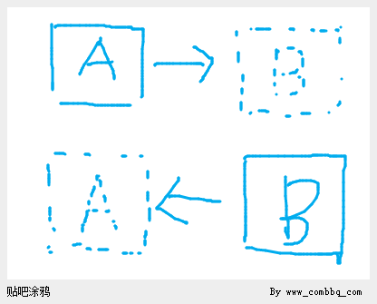

以后这样的内存块也被我们直接成为【帧】。

而我们的系统之中，除了这样的代表每一刻世界全部信息的帧，还有存在逻辑相关的子系统，这个系统我们称之为【推演系统】。

另外，如果我们同时对这个世界，从其中的某一个或者几个镜头角度进行实时检测的话，我们会需要另外一个子系统，来读取、解释、渲染、呈现每一帧的数据，这个子系统我们称之为【呈现系统】。

当然，【推演系统】和【呈现系统】只是逻辑上的分划，它们的实现之中有一部分代码是公用的。

## **小A——多系统串联**

导语：为了证明世界是在过程之中而不是在3D打印的结果之中，做一个理想实验。

对于双内存倒腾的想法，我们可以再做一个理想实验。

假设粒子道会演化N帧，那么我们就准备N台计算机，这N台计算机我们叫从属计算机。

我们再增加一台总控的计算机。

每一台从属计算机上都有一个显示器，显示了内存中的存在们的全部情况——比如以二维码的方式。

各自同时有一个摄像头对准了总控计算机的显示器。

总控计算机从第一台从属计算机的显示器上得到了所有存在的初始时候的所有信息，然后做了一次【上帝秒推演】，接着通过二维码显示结果在自己的显示器上——此时第一台从属计算机关机。

第二台计算机用摄像头读取了总控计算机的运算结果，把结果存放于自己的内存中——此时总控计算机关机。

在总控计算机决定做第二次推演的时候，它先开机，然后用自己的摄像头在第二台从属计算机的显示器上读取上一次运算完之后存在们的状态——再进行第二次计算。

这样一套系统，我们要问，世界存在过吗？

存在过，因为有存在，存在逻辑和存在过程。

那么世界存在在哪里？

大家很自然就能理解到，世界存在于这个推演的过程之中。

世界既不【一直】存在于任何一台从属计算机中，也不【一直】存在于总控计算机当中。

我们所定义的具备三要素的【世界】显然存在于这个过程之中。

## **小A——世界的落脚点**

导语：给出世界落脚点的定义。

世界存在于推演的过程之中，而不必要存在于某一台计算机当中。

那么每一台计算机中的临时推演结果——也就是某一帧究竟代表了什么呢？

那代表了这个世界历史中的一个【落脚点】。

也就是说，这些暂时存储的世界【某一时刻信息】的地方，是整个推演过程中的各个时刻的【落脚点】。

任何一帧的结果都是世界的落脚点，都代表了曾经的演化，并且都是未来就此演化的基础。

## **小B——对落脚点的疑问**

导语：对世界落脚点整体性的怀疑。

假设内存中有一个世界，也就是说作为这个世界中的一个智慧，我活在内存中。

如果动态的过程是世界，那么如果推演暂时停下，世界不就不存了吗？

因为停下来就只有落脚点，而这些落脚点不过就是每帧推演出来的数据，这些数据不过就是内存中的bit位。

如果暂停推演，那么内存中的所有bit位之间难道不是互相独立的吗？

当暂停推演的时候，这些bit位之间是没有任何必然的联系的。也就是说，可以变化一个而不影响另一个。

既然如此，那么内存中的那个世界的落脚点——某一帧的结果，到底代表了什么？

那些内存中的bit位，【彼此互相独立】的bit位，如何就构成了一个完整的，密不可分的世界的？

## **小A——比特与信息**

导语：回答小B关于世界落脚点整体性的怀疑。

其实bit位之间虽然是独立，但是它们作为一个整体所构成的信息却在那里。

作为计算机的内存的构成物质，也是在不断地做热运动的。

所以即便是同一台计算机，下一刻，就不是上一刻那台计算机了。

但是有一种高层次的结构被保留了下来，那就是电平信号可辨别的高低差异——对于谁仍可辨别为上一次辨别的结果，那么对于谁来说就没有变。

分子原子的热运动，并没有改变这种高层次、大尺度的结构——也许不是空间的尺度，而是能量的尺度。

同样，对于信息来说，在哪里表现它、用什么东西表现它，是不是上一次和下一次都在同一台计算机中表现它，其实都无所谓。

信息的结构，被完整地保留了下来，那么作为【信息层的那个系统】，就没有变化。

我们可以这样看静态帧数据中bit位的可修改性：

如果一帧数据中的某个bit位被人为变更了，继续推演的时候我们发现世界改变了，但是变更之后的帧数据难道不正可以看作是一个新的世界在这一刻的落脚点吗？

而如果把旧世界和新世界看作是一个世界，那么我们可以这么说：变更bit位的行为可以算作是整个推演中的一步。只不过这一步不是自动完成的——是你手动完成的。

## **小B——双系统互联**

导语：给出理想实验，请小A解释之中的世界。

如果我们把每一个上帝秒的推演结果，投影到了一个屏幕上，成为一张照片。

假设这张照片比较特殊，它是二维码，编码了所有存在的所有信息，也就是一帧。

使得我们只要拍下了这张照片，那么我们就可以逆向得到所有存在的所有信息，并且数字化这些信息。

与刚刚那台计算机不同的是，这一次，我们使用一台完全不一样的计算机，比如原来我们使用x86平台，现在我们使用ARM平台。

这样，使得ARM平台中也有了所有存在，尽管信号表示方式不同，但是信息却是一样的。

很重要的是，在ARM平台上，我们只有存在们的信息，而没有存在逻辑们的信息。

但是x86平台上每一个上帝秒的推演结果，都会经由第一台计算机的显示器和第二台计算机的摄像头传送到ARM平台中。

这个时候，我们发现，每一个上帝秒之后的那张推演结果的类似二维码的照片其实成了传输路径的一部分。

虽然不像处理器和内存之间可能是直连线，但是子系统具体的实现形式并不影响其在系统之中的角色——也就是说，从x86系统和ARM系统之间互相可以籍由第一台计算机的显示器和第二台计算机的摄像头来进行沟通这一角度来说，这个由显示器和摄像头构成的子系统就是x86子系统和ARM子系统之间的传输通道。

我们如果承认x86平台上有一个世界，那么我们必须承认此时ARM平台上也有一个世界。

因为我们可以把x86系统和ARM系统看成是一个整体，而把x86系统中的那部分存在看作是缓存，把ARM系统中的这部分存在看作是我们的核心存储。

那么x86系统在这种观察方式下，就成了一个类似处理器的角色，而ARM系统此时类似一个内存的角色。

如果世界真的在推演过程之中，一个本地计算机只接受推演结果，一个云端服务器负责推演，这两个系统组成的合系统，看起来就像是一个系统，那么如何看待本地系统中有没有世界呢？

还有一个问题，如果x86系统中有一个智慧，比如我，我能意识到我周围世界的存在，当不进行推演的时候，我被编码在了x86系统中的关于存在的信息中。

那么ARM系统中此时是不是也有一个我呢？

x86系统中的我和ARM系统中的我的内容的确是一样，但是这两个我是不是同一个我呢？

## **小B——显示器上的世界**

导语：进一步要求小A回答世界是否存在的问题。

既然x86平台中有一个世界，ARM平台中也有一个世界，那么中间的那个显示器上有没有一个世界呢？

因为内存使用高低电平序列编码了所有存在的信息，显示器上也用二维码【编码了所有存在的信息】——从这一角度去看，它们具有相同的地位。

其实显示器上的二维码和内存中的高低电平阵列作为信息的信号层表示，没有本质的区别，因而如果说信息的信号表示中有世界的话，那么这套系统中其实还有其他存在世界的地方。

如果有人说，显示器上的信息是不能被用来做推演的，那么我们只要往后看：摄像头拍摄了它，然后将信息转储到了ARM系统中。

然后我们就发现，如果此时ARM系统中有存在逻辑的相关代码——【推演系统】，那么就可以开始继续在ARM平台上开始推演。

这说明，显示器上的二维码【**不是不可以**】作为继续推演的基础。

x86平台中一个世界，ARM平台中一个世界，中间显示器上一个世界——一共三个世界？

摄像头一拍，就把显示器上的二维码拍到了摄像头专用的内存中，这段内存不同于对这段内存解码之后的那段被【推演系统】所使用的内存，那么这样是不是就有了第四个世界？

还是说，这几处地方根本就是一个世界？

如果ARM系统中的那个世界还不够迷惑人的话，那么显示器上的这个世界就足够迷惑人了。

难道同时有我活在x86系统内存中、x86系统的显存内、x86系统的显示器上、ARM系统摄像头专用内存区域中、ARM系统【推演系统】所用内存中？

## **小A——平行世界的分支**

导语：小A对小B的质疑作答。

双系统互联中，显然是有世界存在的。

但是只有一个世界存在。

那个存在着的世界的【落脚点】序列存在于x86系统中。

而ARM系统中的存在信息也可以叫落脚点，不过只是没有继续推演下去的世界的落脚点罢了。

因为对于ARM系统中每次由x86系统传输过来的世界的落脚点，和上一次在ARM系统中的落脚点事实上是没有关系的——那种一个是籍由另一个推演出来的关系，虽然它们在信息上的确有此关系，但是在过程上没有此关系。

对于一次演化的结果，我可以通过网络传输到全世界每个人的计算机中，从而云端只有一台计算机中有存在逻辑的代码——【推演系统】，而每时每刻所有存在们的所有信息被传播了世界各处。

这个世界的拷贝可以有无数份。

这无数份拷贝可以就此被推演，也可以就此不被推演。

如果推演起来，而且世界中的智慧如果有一种【内省的机制】，那么它就会感到这个世界【存在】、它自己也【存在】——存在感的二元性。

如果第N帧的两份拷贝作为落脚点同时被继续推演，推演逻辑也一样——一种时时刻刻同步的推演。

那么这时它们是两个世界。

不过这两个世界的落脚点有交集，也就是说在第N帧之后，两个世界的落脚点在不同的地方，但是在第N帧之前包括第N帧两个世界的落脚点是重合的。

## **小A——两本书还是一本书的问题已经过时了**

导语：小A乱语。

曾经有人特别喜欢讨论这样的“哲学问题”：

两本内容一样的书，是两本书还是一本书？

物理上是两本书，但是内容上是一本书。

物理上看，两本书不是同一本书。

但是从内容的角度看，两本书肯定是同一本书。

我们说莫言写了几本书呢？我们肯定不是按照莫言书的印刷数来计算的，而是看书号的个数。

把第N帧复制了一份到另一台计算机中，那么从第N帧开始分开推演但是其后每帧内容都一样的两个世界，是不是同一个世界？

有人觉得，尽管这种推演是动态的，可是如果把推演的所有时刻的所有结果顺序摆放到一起——类似那个3D打印的输出结果，这种合集似乎也可以被当成是一本书。

就像两本书是不是一本书的问题一样，如果这两份打印序列的内容一样的话，那么这是一本书，还是两本书？是一个世界还是两个世界？

而有人会这样想：世界中的智慧，根本无从认识到它们被复制了一份，然后在另一台计算机上继续开始推演。所以它们认为自己的世界还是原来那个世界。

从【信息层面】来看，确实是这样，它们的世界无论被拷贝到了哪里，信息层面的东西没有变，而存在逻辑作为信息层面的操作符，也没有变，因而这个世界没有变。

但是如果从【信号层面】看到两台计算机分别推演了两个拷贝，我们又必须说，那是两个世界。

每个世界因为有独立的信号处理系统在做支撑，所以能够被我们观察到是两个世界。

但是这两个世界的内容，每时每刻，可以一模一样，就像两本同样内容的书一样。

所以一本书还是两本书的问题，实际上是一种诡辩题。

当我们考察世界具体是哪一个世界的时候，我们应该从【信号层】考察其每一个落脚点。

## **小A——拷贝不是介质而是介质中的一份内容**

导语：对落脚点的进一步阐述。

注意，我们这里所说的拷贝，不是具体的磁盘，或者硬盘。

而是说，其中的信息。

确实，日常生活中，我们有时候说一份拷贝的时候，就是指那个拷贝所在的光盘。

但是事实上，从信息的角度去看，我们说一份拷贝的时候，说的是那个光盘中的信息。

全体存在的【当前的】信息的拷贝，必然是因果律的结果——也就是说，逆向查找，必然可以确认这些信息所代表的宇宙，在上一刻的时候，其【信号的支撑和表示】的【信息拷贝】存在过。

也就是说，与其看一个世界如何分成两个世界，甚至多个世界——从根到叶的观察方式。

我们不如反过来，从叶到根对世界进行观察。

每当我们得到一份世界的拷贝——全体存在的存在状态信息的信号表示——比如一张二维码图片，

向后——向未来看，我们就把这样的一份拷贝当作是一个可能的世界的起点，从此刻开始的起点；

向前——向过去看，我们可以去追溯，这样的一个世界在时间之中，是如何籍由因果律而来到我们面前的，也就是它之中的信息，在曾经的每一个上帝秒结束之后，被具体地存放在了哪里——也就是它曾经的【落脚点】——那是它的历史。

这样，每一份世界的拷贝，都有潜力继续成为一个新世界进程的历史中的一个落脚点。

比如像是那N个从属计算机，我们看到第二台计算机中的信息拷贝的时候，我们就说，这个世界的上一刻的拷贝曾经在第一台计算机中。

也许，到了第二台计算机中之后，又被复制到了其他地方M份，但是却恰恰就是抹去了第二台计算机中的内容。

这个时候，如果要考察世界，我们就要考察这【每一个】拷贝的具体情况，因为每一个拷贝都可能是一个平行世界此刻的落脚点。

我们也要考察以这每一个拷贝作为落脚点的世界的上一刻的落脚点是什么，即便这种来源的物理形式在此刻已经被破坏，比如像是第二台计算机中的内容已经被抹去，但是作为把这个世界中的存在的信息演化成这一刻这样的历史的一段，它绝不是没有存在过。

这M份拷贝，也就是M个世界的落脚点，不管是继续推演，还是放弃推演，它们都应该被看成是一个个可能被继续推演的世界的落脚点。

所以3D打印中的每一层，都是这样的一个世界落脚点。

实际上，任何一次暂停，我们都没有得到这个世界，确切地说，我们得到的是这个世界的拷贝——落脚点。

其实所有的这些上帝秒的结果，结合到一起，才叫一个完整的世界——也就是说，世界是存在们的信息作为一个信息层的整体，在时间上所有变化过程。

一个世界的落脚点的拷贝可以有无数份。这无数份拷贝可以就此被推演，也可以就此不被推演。

如果推演起来，那么世界中的智慧就会感到这个世界存在。

每一个存在着的落脚点的备份，都是一个可能的平行世界的起点——如果继续推演，就是平行世界，如果不继续推演，那么世界就暂时到此为止。

## **小A——推演和播放不一样**

导语：阐述播放和推演的不同之处。

对于粒子道来说，推演时需要使用粒子的速度信息。

这样才能计算出一个上帝秒过去之后粒子动还是不动。

或者是动一个因果点还是动几个因果点。

而对粒子道推演结果的播放却只需要使用位置信息——就像放电影，没有必要标注一辆汽车现在的速度是多少，只需要连续播放，观众自可体会出来汽车运动的速度效果。

所以播放相当于是在播放录影，而推演相当于是有演员在演。

所以说推演的过程和播放的过程并不完全等同——因为两种过程中需要的信息种类不同。

而且一种过程具备平行世界分叉的可能，一种过程不具备这种可能。

尽管两种过程似乎有些相似的地方。

也就是说【推演系统】所使用的信息和【呈现系统】所使用的信息不同，根本上来说这是两种不同的系统。

## **小A——世界的过程本质**

导语：世界存在于“看不见摸不着”的过程之中。

我们知道，作为信号处理系统之上编码着的信息，每一个上帝秒之后，我们可以把新推演出来的存在们放到任何可能的新的存储介质上。

可以在硬盘上，可以仍然还在内存中，也可以在一个二维码的图片上，甚至还可以在一面布满黑白子的大棋盘上。

我们还可以每次把世界存储在不同的地方，第一次在内存中，第二次在硬盘上，第三次在显示器上，第四次在棋盘上，……

也许这个世界中有智慧，智慧们有记忆能力。

但是它们记住的世界，都是已经过去了的，在我们看来物理上已经不存在了的——那些曾经的推演结果，如果在黑板上，可能已经被擦除，如果在二维码图片上，可能已经被删除。

所以它们只是活在【当下】，甚至都不是活着的——只有我们继续推演落脚点，它们才活着。

世界，是在那些具体的存储介质上吗？

显然不是，存储介质只是存储阴阳编码的信息，而这信息——我们已经说过了——可以以各种方式存储，只要能再次被读取，然后被推演，之后再被存储到什么介质上面我们可以发挥自己的想象力。

所以，世界是这些【信息】——这些以粒子为核心概念的信息——的变化【过程】。

这种信息的静态本质是海量阴阳对立的编码。

但是阴阳的对立并不是物质的，而是概念的。只不过籍由【对立】支撑起的概念可以被我们用各种具体的物质支撑的信号对立来表达。

比如计算机中的高低电平，黑板上的黑白痕迹，甚至是大量小朋友举起黑棋还是白旗（刘慈欣 《三体》）。

所以世界的本质是信息，信息的本质是阴阳的对立，阴阳的本质不是具体的物质，而是抽象的对立。

与其说世界是存在们的信息的哪一次具体的推演结果，还不如说世界是这个信息结果由来的信息变化过程。

所以，世界是信息层的运动，只有把【每一次】在信号处理系统之上所表达的存在们的信息，作为一个时域上整体去思考，我们才能得到一个完整的，跟每一时每一刻具体的支撑信号系统无关的世界。

世界看不见，摸不着，只有那个过程中，才有一个抽象的世界。

## **小A——世界的整体性之由来**

导语：如何看待世界的整体性。

假设每个粒子占据一段内存，这段内存有一个大小。

我们以此内存大小为粒度观察所有粒子占据的整体内存。

怎么叫【一个】世界，或者说世界如何被称其为【一个】世界？也就是说究竟世界如何成为一个整体的？

假设有n\+1个粒子，那么我随便取其中一个粒子。

我如何说明这个粒子在这个世界中？

什么是随便取其中一个粒子，如何取出来呢？就是找到这个粒子的信号表示——它所在的那段内存。

那么【整个】世界又是什么，显然，我们在这里说整个世界的时候，是说所有的粒子。

所有的粒子的物理表现，或者说信号系统表现，就是所有粒子状态所占据的内存。所以整个世界就是这些内存。

如何表现其中一个粒子在这整个世界中？

显然，在开始下一个上帝秒推演之前，我们无从知道，下一次推演，我们是不是把剩余n个粒子对这个粒子A的全部影响都叠加到了A上——从而推演获得A在下一帧中的状态。

所以，粒子在不在一个世界中，根本上看，是看粒子下一帧的状态是不是考虑了所有其他在此世界中的粒子可能对其的影响。

所以，粒子们是不是在一个世界中，是要看具体地从一帧到下一帧，存在逻辑是如何被运用的。

更具体的是从一帧到下一帧的时候，对于【某个】粒子，存在逻辑是如何被运用的。

所以，所谓粒子们构成同一个世界，在于【对每一帧的计算】，在于对每一个粒子下一帧状态的计算。

同时我们又会发现一个趣题：

有一个两个粒子的粒子道，如果突然有一帧，由于某种原因，计算出现错误，使得一个粒子A考虑了另一个粒子B对自己的影响，而粒子B没有考虑粒子A对自己的影响。

那么这还算是【一个】世界吗？

不算。

只要有一个粒子没有正确地被当作在这个世界中，从而被计算，那么下一帧就不能说和上一帧表达同一个世界。

## **小A——改变世界进程**

假设粒子道中推演出了智慧。

如果我们通过技术手段，在它们正在面对的纸面上绘出文字，通过这种方式和它们交流。

那么它们也就可以和我们交流，而且像真实存在在我们这个世界的一个人一样，和我们交流。

如果我们对它们说，我们要结束掉推演，它们可能会很慌张，因为它们怕自己消失。

消失对于它们来说，好像死亡之于我们一样。

但是我们会说我们只是暂停推演，下次我们开机，可以继续推演，而它们根本不会觉察到有任何暂停。

它们虽然一开始很惊恐，但是后来慢慢也就不在意“暂时停止推演”这种事情了。

因为在它们看来我们说暂时停止推演这句话之后，我们立即就又开始对它们说话了。

因为在我们的世界看来，暂时停止了对它们世界的推演，然后我们出去吃了个烧烤，再回来继续推演的时候，它们的世界还是上一刻的那个世界。

它们才刚刚听完我们说我们要暂时停止推演，然后就听到我们说吃完烧烤回来了，和它们继续聊天。

所以，我们可以不从大爆炸那一刻开始推演这个世界，我们可以把世界的初始值设定为某一刻，然后直接开始推演这一刻之后的世界。

但是智慧们的记忆中，却有整个世界到当下时刻之前的全部记忆。

甚至在下一次推演的时候，假设我们改变了世界的推演逻辑，也就是存在逻辑，这种对存在逻辑的改变，也许会被世界中的智慧觉察到，因为它们记忆中的世界规律和新的世界规律不同了，比如万有引力定律中的引力常数G被改变了。

**所以，如果我们的所谓的现实世界也是被这样从某一个特定的中间时刻开始推演的，那么我们怎么能够确定曾经发生的历史真的发生过？**

## **小A——世界存在于推演过程之中**

世界在从第一帧到另一帧的过程中，这个过程形成了世界。

某一次的推演结果之中并没有世界，世界存在于推演过程之中

世界是一个过程。

某一次的结果——某一帧数据——某一个落脚点，并不是一个过程。

也就是一旦我们停止推演，而去查看推演的结果的时候，这个世界就不存在了。

而一旦我们继续开始推演的时候，这个世界就又存在了，这听起来像是在讲玄学。

但是世界确实只存在于时间之中：

如果我经由某种方式，让世界中的智慧看到了我的一句话，经过推演他写出了他的反应。

究其根本，我们发现那不过就是我的计算机作为信号处理系统支撑起了一个信息处理系统，然后这个信息处理系统，即粒子道程序，它推演出来虚拟的粒子世界中大脑的又被当作是信号处理系统，这个大脑中生成了自己的信息处理系统，即智慧的意识。

这样一个双层的、信息的智慧对我所提问的问题的回答，本质上依旧是其籍由我的计算机运行的信号过程，给出了信息层面的答案。

而这一过程和普通软件在我的计算机上的运行原理是一样的。

这个智慧认为自己活在一个世界之中，可是我们怎么找，也没有找到那个世界在哪里。

**最后我们知道了原来那个世界只是它的错觉，是我们的程序逻辑给程序之中的数据，即这团智慧（其本质在我们看来就是一组内存数据），造成的错觉。**

就像我们眼睛看到的三维空间一样，我们习以为常地以为这个空间就是我们看到的样子。

但是事实上，仔细想想我们就会发现，空间是籍由我们的眼睛和大脑配合而出的表象能力才能够被在意识中呈现给我们成这个样子。

所以根本上讲：大脑呈现外部空间是这个样子，我们就认为外部空间就是这个样子——这是一种错觉。

所以，推演之中的智慧所意识到的“世界”也是一样，也是一个籍由错觉产生的念头。

## **小B——推演过程之中没有世界**

我们如何知道世界的下一帧不是通过随机得到的呢？

我们可以籍由世界的落脚点存在而判断世界存在还是不存在，可是如果世界的落脚点是以一种完全颠覆传统的方式得到的呢？

如果我们籍由一种方式，从一块内存得到了另一块内存——这个过程就能让世界存在的话。

那么为什么我们这个过程不能是随机得到呢？

也就是说，如果我推演N帧，每帧的大小是XGB的话，那么我就做N次XGB大小的随机数实验。

虽然概率极小，但是还是有概率随机出N帧数据，这N帧数据和推演N帧所得的数据是一样的。

如果是这样随机得到了所有【落脚点】，那么那个推演中的世界还存在吗？

显然，我们不能说推演中的世界仍然存在，因为根本就没有推演了，这些帧都是随机得到的。

既然我们通过随机得到了和推演一样的结果——N帧数据，那么现在看来推演的过程中还有世界吗？

推演和随机的区别，就是从一帧到另一帧得到数据的方式不同，推演得到的下一帧数据是和前一帧数据之间使用函数演算得到。

而随机的方式，前一帧和下一帧之间没有联系，如果想要有联系也很简单，用上一帧数据作为随机数发生器的随机种子就可以了。

难道说用什么方式来得到下一帧能影响世界的存在？

通过复杂计算得到下一帧世界就存在，通过随机数发生器得到了下一帧，结果世界就不存在了？

现在，我们还能相信是推演的过程中有一个世界吗？

过程之中，没有世界。

## **小C——世界存在于3D打印的落脚点集合之中**

作为过程的世界，存在于3D打印的结果之中。

其实这个世界是静态的，因为对于一个二维的世界，如果我们在三维中把它的每一帧都摆出来了，那么就等于说是四维中的上帝，把我们的三维世界的每一刻都摆了出来（，这样，我们的时空就成了一个四维的体）。

就像我们现在看这个二维的世界加上时间轴的三维形式一样——二维的世界加上时间就是一个三维的体。

## **小B——世界不存在于3D打印的落脚点集合之中**

如果从信号层的角度来说，我们说世界存在于落脚点的集合之中。

那么从信息层——粒子们的角度来说，世界存在于哪里呢？

如果从信号层的角度来说，所谓一个世界中的【当下】就是信号帧——落脚点的【序列】的话。

从信息层——粒子们的角度来看，【当下】存在于哪里呢？

如果世界存在于3D打印的落脚点集合之中，那么对于N帧的打印结果来说如果不进行推演就没有帧N\+1的结果。

如果没有帧N\+1，那么那个被推演的世界就到不了N\+1这个时刻吗？如果是这样，那岂不是说对N\+1帧的推演产生了世界？

那这第N\+1帧如果是被随机出来的呢？

**说明并非【推演】产生了世界。**

推演只是让我们从上一帧得到了到下一帧的逻辑上的结果，但是这个结果不推演也是那个结果，只是推演出来我们就可以看到了。那么，难道说，存在的初始状态设置好了，存在逻辑定义好了，那么这个世界不管推演还是不推演都是存在的了吗？

还有，我们去考察，新的一帧和旧的一帧之间有什么关系呢？考察的结果是，我们可以这么说——完全可以没有任何关系，因为新的一帧完全是可以随机得到的——**帧与帧的数据之间的关系是松散的。**

新的【一帧之中】有什么关系吗？我们也可以说——完全没有任何关系，比如我们把01替换为黑子白子排列在棋盘上，难道这些子之间不是互相独立的吗？**帧之中的数据之间的关系也是松散的。**

如果说第123456帧排列在一起构成一个世界，那么如果我按照第135\-246的排列顺序，那么这个世界就不存在了吗？就混乱了吗？

世界存在不存在，难道还和帧的排列顺序有关系？

或者说如果135\-246的排列也能被看成是一个世界的话，那么123456的排列就是另一个世界？

从而打乱帧之间的顺序，结果就能得到两个世界？

世界居然和帧的摆放顺序有关系？

那么难道说一旦错位一下，世界就错位了？

既然说推演没有产生世界——因为世界的落脚点（帧数据）完全可以是随机产生的，而不必非得是从上一帧落脚点籍由推演产生的，而且帧与帧的数据之间的松散关系也无法让我们相信它们支撑起了一个世界，但是我们又确实感受到了计算过程之中有世界的三要素，那么这个世界到底存在在哪里呢？

## **世界在哪里？**

我们看到了小A小B小C们的讨论，是不是有种开始很清晰，后来很混乱的感觉呢？

不如我们把这个问题放一放，让我们继续看看意识是怎么回事吧。

# **意识**

## **信息**

### **小A——什么是信息？**

信息由编码和内容两部分组成，这两部分的统一构成了信息。

**通常，我们把信息的编码叫做【信号】或者【信号集】，把信息的内容叫做信息，以后不引起歧义的情况之下，我们也会使用这种称谓，比如信息处理系统、信息系统、信号处理系统等。**

信息的编码的具体存在方式可以是纸面上的10010，也可以是内存中的电平信号的高低，也可以是棋盘上的黑白棋子。

信息的编码所指示的内容，人知道。作为人的思维的延伸——程序，也知道。

但是硬件，比如处理器，就不必非得知道一段内存中的信息编码的内容。

处理器的输入和输出有固定的语义，即处理器对内存中的01串有自己的解读。人和人思维的延伸——程序，若是要完成对内存中01串的异于硬件的解读，那么就要迁就死板的硬件，使用编程技巧来达到目的。

### **小A——事物的对立不必是信息的编码**

事物的对立——bit串不【必】是信息的编码的意思是，bit串没有必要一定是某种信息的编码；bit串没有必要一定要【被看成】是信息的编码。

棋盘上的黑白棋子的摆放一定暗示了其是某一种信息的编码吗？

不，如果不是我们在心中认为它是信息的编码，那么这种摆放就没有暗示任何东西——这种摆放只是一种摆放罢了，不需要非得有意义。

### **小A——事物的对立不必暗示任何信息的内容**

事物的对立——01串不【必】暗示任何信息的内容，意思是01串不必然暗示其为某种信息的编码，进而暗示其携带着某种信息的内容。

计算机中的高低电平表示的10010是什么数字？

有人说10010代表十进制18。

可是注意，这是把10010当作无符号整数，加权计算的结果。

也就是说第一个1需要乘以2的4次方这件事，如果你不告诉别人，别人真心不能确定应该这样做。

所以说10010这个01串作为信息的【编码】的【内容】，在计算机的内存之中，实际上并不【客观】存在。

也就是说你用黑白棋子摆出了10010，你绝不能说就此有一个在棋盘上存在着的什么事物或者其属性就是【18】，也就是说你不能说18是存在于客观世界之中的。

客观世界之中【没有】一个事物的相关属性因你摆出了10010而就此获得了18。

10010如果不是通过无符号整数的约定，它不【必】是18。这个二进制数完全可以代表一个定点数，比如最后一位是小数点之后的数字，此时10010代表1001所代表的数字。至于1001代表什么，其第一位是否【被约定为】符号位又会带来不同的结果。

10010当然也可以表示一个负数，只要把第一个1看成是符号位，此时10010代表\-14。计算过程是将最左的1扩展3位，然后输入Windows自带的计算器（菜单中点击步骤：查看\->程序员）如图：

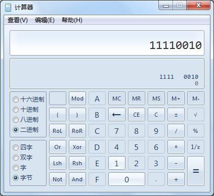

然后点击“十进制”

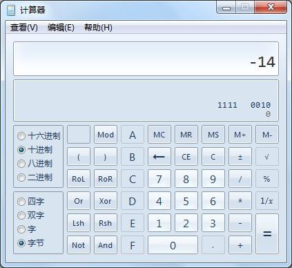

如果你不明白为什么要扩展最左的1，那么不妨点击“字”。

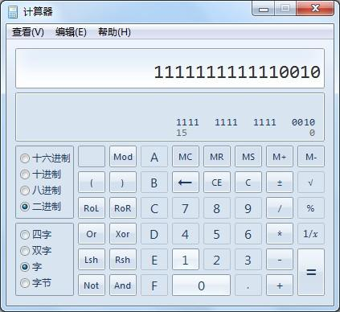

或者“双字”。

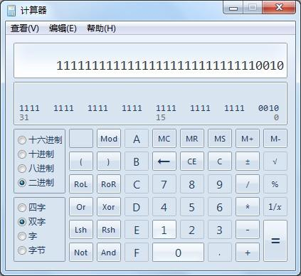

或者“四字”。

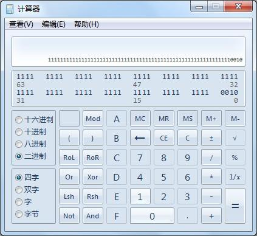

于是我们发现其实即便软件籍由硬件计算出来了一个数值的二进制表示到内存中，客观来说这二进制表示也仍然不是那个数值本身，那个数值也不就此【存在】于客观世界——计算机内存当中。

数值的二进制表示仍然不是数值本身，而是在我们头脑中存在着的那个理念世界里的数值信息在现实世界中的编码。

而这理念世界中的概念信息在现实世界中的编码比如内存中的电平信号高低10010，并不暗示其表示任何你头脑中理念世界里的某一样事物，比如18，比如\-14。

## **如果意识完全由身体之中的物质支撑**

### **小A——如何从物质到了意识？**

不知道有多少人和我曾经一样，非常奇怪究竟如何从物质就到了意识。

也就是说，究竟我们的大脑如何从物理上存在的分子原子脑细胞，到了物理上我们看不到的意识、思维？

在继续讨论宇宙编程学之前，让我们来考察一下人脑。

何以，从眼中的电磁波到了意识中的概念？

这是一个非常值得回答的问题。

回答好这个问题，不仅仅在于描述人脑的运行过程，更在与找到这个过程中的抽象内容。

就像计算机具体可以有很多种，比如大型机、小型机、微型机、掌上电脑，但是它们的基础都是冯诺依曼结构的。

有件事非常值得我们思考：为什么冯诺依曼那种小学生都能听懂的结构，不是随便谁都能想出来的？

东西做出来了谁都可以理解，但是东西没有做出来之前，就能把抽象的原理想出来，进而此原理能够统治之后所有此类设备的具体实现，这就是冯诺依曼的伟大之处。

现在，我们从计算机的角度来观察我们自己。

想象，进来一个输入，10010，这个输入代表的意义是什么呢？

我们要看这个输入给谁了？

既然是外部设备传入的输入，说明是给相应的驱动程序了。

比如这个输入是键盘传入进来的，就是给键盘的驱动程序了。

这个输入是音频采样器（麦克风\+AD转换器）传入的那么就送给声卡或者声卡驱动程序了。

所以说，驱动程序，是我们大脑的对感觉的第一处理位置。

外部的模拟信号，转换为内部的神经信号是“传感器和AD转换器”的工作。

比如眼底的电磁波转换为了神经冲动，耳朵底部的震动转换为了神经冲动——都有这么一个转换的器官，把一种外部的刺激转换为内部的信号。

刺激被转换为信号之后，就遇到了一个很重要的东西，那就是驱动程序。

可以说，驱动程序是第一个把信号不当信号的东西。

或者说，驱动程序，是第一个把10010不当10010的地方。

学过C\+\+编程的朋友看下面这一段伪码很明白：

Class Color

\{

public:

Color& operator\+ \(Color& A, Color& B\)

\{

if \(A == RED\) return ColorPlusRed\(B\);

\}

Color& ColorPlusRed\(Color& B\)

\{

if \(B == YELLOW\) return VIOLET;

//紫色，这个英文我是现查的，不熟啊。

\}

\};

看了这段伪码，大家有没有想过，把这段程序放入内存中执行的时候，那么这段程序，到底知不知道RED的二进制表示是什么，VIOLET的二进制表示又是什么呢？

假设RED的内存表示是10010，VIOLET的内存表示是10086，哈哈，开玩笑了，假设是110吧。

那么这段程序，真的有必要知道RED是10010吗？

没有必要，这段程序完全可以是概念的，也就是说，完全可以由看懂了的人来执行，而执行这段程序的人，是没有必要去假设RED是什么二进制10010的。

这段程序写出来，其实它已经是一个非常简单的意识——即信息处理系统了。

它比较简单，而且我们的大脑也可以运行它——根本原因是因为：

程序，是概念的。

计算机也可以运行它，但是计算机的运行方式是用二进制【计算】和二进制【表示】做支撑的。

没有这种支撑可不可以？可以，因为我们在自己大脑中执行它也是可以的。

我们执行的时候，觉得自己是在处理【概念】，但是从我们的脑细胞之间的神经联系的层面去看，却又不是概念的，而是信号的——如果我们把神经冲动叫做信号的话。

这段程序，电脑在执行完毕之后，可能将结果交由显卡驱动，在屏幕上使用三基色RGB的不同强度配比来表现这个执行结果——紫。

人类的大脑执行了这段程序——思维过程，也可以得到“紫”这个概念结果，虽然紫这个概念在你头脑中的表示方式不像是计算机中的表示方式——即内存存储单元电平高低序列110，而是一团脑细胞的神经联系——我不熟悉脑科学，但是我相信大家懂我要表达的意思。

我们大脑对这段程序的执行也可以输出一个结果。比如，如果我们认定了“紫”代表调色板上的一种颜料，那么当你去表现你所得出的结果紫的时候，你可以取点这个颜料，然后在纸上点一个点儿出来，就像计算机在屏幕上点出来一个紫色的点儿一样——都是输出。

虽然，输入，输出等等方面，人脑和电脑的差异是巨大的，但是核心的信息处理系统——比如那段程序——作为一种概念层面的东西，作为一种【思维】——在你的大脑中和计算机中的执行本质上是没有区别的——它们的本质都是【信息】处理系统。

只不过，人的信息处理系统非常强大，而且我们通常称之为：意识。

作为思维或者说意识或者说软件，即信息处理系统来说，你的大脑是硬件，是信号处理系统。

程序从本质上来讲是【信息处理系统】。

而信息处理系统的【支撑】者是【信号处理系统】。

信号处理是实现对信息处理的支撑，程序是在信号处理系统之上所建立的信息处理系统的上层建筑。

思维、意识是人脑的信号处理系统构件（神经元）所表达和支撑的信息处理系统。

再复杂的计算机处理器，不过就是指令集。

指令集根本上来讲不过就是对操作数做加法——乘法就是多次的加法。

围绕着指令集的处理器和内存，作为信号处理系统，是用来执行被编码和具体化的程序——信息处理系统的。

程序，在我们这里实际上是概念化的。

也就是说，我们所讲的程序，比如颜色的程序，我们谈论各种颜色的时候，我们谈论的是颜色的【概念】。

比如红色，蓝色，紫色，但是我们不谈论颜色的具体底层表示，实际上我们也没法直接通过【自省】和【感觉】的结果，去谈论概念的神经表示。

【颜色信息处理系统】可以作为一种概念化的思维，经由学习而得到。

这种经由学习而得到的思维，接受输入的颜色，然后做各种需要的操作——思维过程，从而返回思维的结果——比如一种新的颜色，整个过程就像是上面写的程序一般。

如果那程序是自然语言表达的，看起来就更像是让人去学习的，但是是用计算机程序设计语言伪码表达的，看起来就像是计算机程序。

实际上，我们编写计算机程序，不就是让这个电脑学会一套新的思维吗？

不就是让电脑这套本来被称为一堆废铁的优秀的信号处理系统，增添一套信息处理系统吗？

如果关于程序的概念性，以及人脑的信息处理系统性还需要一些讲解，不妨先请大家想象一下，对于同一段C程序：

可以在面向x86的编译器中编译，编译出来的结果在x86的系统上跑。

也可以在面向ARM的编译器中编译，产生面向ARM CPU的编译结果，还是依旧可以执行。

尽管底层表示不同，但是程序作为一种概念层面的东西，是被正确地执行了的

我们会想，作为程序——信息处理系统来讲，它真的需要关心概念层之下的实现吗？

它真的需要关心RED是用10010表达，还是11111表达吗？

不需要关心，因为RED是什么不要紧，只要在一个Color对象表示红色的时候，它的关于颜色的内存表示和RED的内存表示在【这个】运行着的信号处理系统中的表示一致就可以了。

所以，做为Color信息处理系统，关心的是在RED、VIOLET等概念层面的问题，而不关心RED在不同的信号系统上具体被表示成什么。

就像这个程序在人脑中的推演（即思维的运行）时一样，我们不关心（实际上也关心不了）RED在人脑中是一套怎样的神经连接，但我们可以推测它的神经表示和VIOLET是可以相区别的。

作为我的意识，从本质上来讲是一套信息处理系统——软件。

作为大脑的物理基础，从本质上来讲是信号处理系统——硬件。

当然，显然这套信息处理系统本身已经被编码到了这套信号处理系统之中，因而物理上必然也表现出了这种痕迹。

一个信息处理系统，本身是不知道自己的实现的具体支撑方式的，所以我们看不到概念的物理基础——神经元之间的互相勾搭。

我们看到——或者说能够意识到的是，神经勾搭所支撑起来的程序的抽象内容——即概念，以及神经冲动所支撑起来的程序的运行——即思维。（这段表述关于神经科学的内容未必准确，希望大家能理解我要表达的东西，并希望大家原谅我对脑科学的肤浅和无知。）

什么是RED？

在不同的系统，有不同的【信号】组合方式来表示RED。

但是对于我的系统，我清楚地知道，RED在所有代码中的位置，代表了它和其他颜色概念可以有怎样的联系，以及联系之后有怎样的结果。

### **小A——信息处理系统的自我演化**

我们的大脑中的信息处理系统是不是一成不变的？

不是的。

我们经常在编制新的信息处理系统，比如我们可以学习人这个概念。

最一开始是感性学习，也就是学习如何从眼中的电磁波到大脑中概念，也就是在各种动物或者说非动物中识别出人这种事物出来。

这其实是一个建立驱动程序的过程——我说过驱动程序就是第一个不把信号当信号的地方。

电磁波进入人眼之后，产生了神经信号，我们从纷繁的外部世界投射入我们眼底的大量信号中分拣出了一团信号——一个人，这个时候，我们就是对那一团信号，赋予了一个【概念】——把那团【信号】映射成了一个【信息】——人。

这就是我们第一次不把那团信号再当信号的地方——驱动程序。

映射【信号集】到人这个【信息】的驱动程序建立起来以后，我们就可以开始非感性学习，也就是着手我们的【信息处理系统】的建立。

信息处理系统我们说过，是面向概念的，跟底层表示无关的，是既可以由人脑来执行，也可以被表达成计算机程序，让计算机来执行的。

这个时候，我们就发现，我们不是每天练习着如何识别人这个概念——建立驱动程序，而是每天都在学习关于人的【知识】——那些概念层、信息层的东西。

这个时候，我们进入了信息处理系统的构建——我们都知道，信息处理系统往往要比驱动程序复杂得多。

也就是说，相比于识别各种事物是不是人这件事来说，关于人这个概念引发的各种知识，那是要庞杂太多了。甚至我们都怀疑关于人的知识是否可以穷尽。

所以说，我们的意识是程序，而且是正在运行的程序。

我们的意识从程序开始启动之后，就不断地在积累数据。

甚至在编造新的程序，补充原来已经有的程序。

这个系统，不是代码这么简单，是运行着的代码和数据。

是运行着的，能够变化自身的代码和相应的数据。

很多程序设计语言支持不区分代码和数据的编程泛型（programming paradigm）——比如Scheme。这种编程泛型背后的编程思想认为数据其实也是代码，我想这是很有道理的。

因为我们的关于人这个概念的驱动程序，其实也是由某一种程序在我们感性学习的过程中，即我们在建立人这个概念的过程中，生成的。

一般来说，程序生成的结果应该叫数据，但是我们却生成了程序——即一个关于人这个概念（信息）的驱动程序——的组成部分。

作为【信号处理系统】的计算机硬件，具体地实现了作为【信息处理系统】的计算机软件。

软件并不感知这种实现的具体内容——当然有的计算机软件，用二进制位的方式来测试实现，是可以的，这种软件不在我们这里所说的软件范围之内，我们讨论的更像是Mathematica程序，而不是汇编语言程序。

面向对象的信息处理系统，关注的是对象。

对象，不关注信号层面的实现，对象只关注概念层面的【存在】，和【存在】之间的【存在逻辑】。

类似main函数的【主控程序】关注【存在】们籍由【存在逻辑】们而形成的【存在过程】们。

对象的接口就代表着存在逻辑。

### **小A——我思**

现在我们再来考虑一件事：

如果这个信息处理系统足够复杂，可以有记忆能力。

能记住进入过系统的每一次输入。

有模式识别能力，可以从输入流中找到存在和存在逻辑，从而将纯粹现象的输入流——即时间上延绵的信号流——分析成存在们籍由存在逻辑们构成的存在过程们。

这个系统甚至还可以有自我意识，这个自我意识也是信息处理系统程序内容的一部分。

这个自我意识的实现和运行过程都是由信号系统进行物理支撑的。

但是在信息处理系统看来，它只关注它的概念论域中的“对象”，这个对象或者说概念是我们用程序设计语言设计和表达出来的——既不是物理内存中的01，也不是物理内存中的电信号——这些东西是信息处理系统看不到的东西。

它能看到的只是【逻辑层面】的东西，概念层面的东西，而不是物理层面的东西。

信息处理系统觉得它自己是自在的、自为的，但是处理器、内存等底层的信号处理系统，一直在帮它实现它自己的这种存在意识，它的意识不过是软件逻辑。

它活在信息系统的软件逻辑中，这种活的本质是软件代码和数据，软件代码和数据之所以可以活起来，是因为处理器、内存等信号处理系统在执行着程序的信号系统【底层】表示，信号处理系统按照软件代码被编码的内容在执行着它们。

在软件——信息处理系统层面看来，这种执行，就是所谓的“我思”，可是思的过程虽然是概念的、信息的，但是其支撑确实物理的、信号的。

我们可以意识到【思的过程】，但是我们却不能意识到【思的过程何以自然地在发生着】——为什么思的过程可以进行，而不是停止呢？

如果思的过程被信号系统暂停，没有时钟等参考物，重新开始思维的时候，我们能够意识到自己的思维曾经暂停过吗？

不能。

就像多进程的操作系统，每个程序由于调度而被终止对处理器的占有，再次占有处理器的时候，进程如果没有刻意参考某种时钟，那么进程是无法察觉其被暂停过的。

### **小A——为什么我们得不到第二个爱因斯坦？**

爱因斯坦的DNA只编码了他的信号处理系统（的原始状态）。

爱因斯坦从小到大经由人生而发展出的信息处理系统，并没有被复制和保存下来。

而这信息处理系统实际上就是不断演化着的信号处理系统，因为信息处理系统是被编码在信号处理系统之中的，也就是说我们光有一个初始化好了的大脑神经结构是远远不够的，我们需要继续演化大脑的结构，而这个过程目前看来是不可复制的。

### **小A——信号处理系统和信息处理系统的分划，是智慧的基础**

刺激转变为信号进入系统，经由驱动程序转化为信息，从而进入概念层程序参与信息处理。

概念层程序不知道信号的具体形式，驱动程序知道。

当概念层程序处理完后，交由驱动程序再次将信息转化成对应的信号。

信号就可以驱动DA转换器和外部世界进行交流了。

AD\->信号\->信息\->概念层程序——信息处理系统\->信息\->信号\->DA

上面这个过程就是智慧的过程——当然这样很宽泛了，连我们的Color信息处理系统也算是智慧了。

其中每一步都有承担者，特别重要的是，信息处理系统，也就是应用层是可以修改和影响驱动程序层的。

比如对Color的识别，这个是原生的驱动程序，基本是不可以修改的。

但是对于Human这个Class，是我们后天构造出来的。

是否将一团内部信号表示识别为“人”，取决于HumanFactory中的识别模式。

HumanFactory是用来识别信号集为Human概念的驱动程序，经由我们的感性学习而得到。

也就是说，如果一团信号的模式符合【人的信号模式】，驱动程序才会创造出Human的概念层对象，从思维的角度看就是这个概念被驱动程序送到了我们的意识（上层信息处理系统）中。

如果一团信号的模式不符合Human模式，那就不会有人这个概念出现在对这组信号的意识中。

但是到底一个信号集是不是Human，这个是仁者见仁，智者见智的事情，这个是不断发展的概念。

不是像人就是人，也不是缺胳膊少腿就不是人。

所以，我们可以设想这样的一种新的驱动程序，它是可编程的，或者说是可配置的。

在这种驱动程序中，我们可以挂载上Human的识别模式和识别之后的创造类——概念对象。

也就是说，不再是HumanFactory的，而只是Factory，但是Factory中可以挂载很多识别模式和对应的要送入信息处理系统的概念。

比如挂载Human识别模式和对应的Human Class，这样一个匹配Human模式的信号集，将被作为“人”这个概念送入到【概念逻辑层】——信息处理系统层，此时我们不仅【看到了】一副画面，而且伴随着这幅画面我们意识到了：

我们看到的是一个人，在整个画面中。

从而，是驱动层帮助我们识别人这种事物，并向我们的信息处理系统层呈送人这个概念。我们也可以修改识别模式（从而原来不叫“人”的现在也可以叫“人”了）和创造类（比如从此以后不叫“人”了，叫“大”，开个玩笑）。

于是，这一层的驱动程序也可以用来识别各种动物。

更上层的概念逻辑层应用程序是拿对象来进行思维的地方。

也就是说，我们有完成信号到信息的【对象识别\-构造器】、我们还有信息层的【概念—逻辑】【思维引擎】——这一套双层机制就是智慧的基础。

### **小A——总结一下**

意识就是程序和数据，是信息处理系统。

但是我思故我在的原因在于我们信息处理系统的物理支撑是信号处理系统。

沟通上层信息处理系统和底层输入输出系统是驱动程序的任务——将刺激输入的信号，转变为信息处理系统可以理解的【信息】。

【信息】作为信息处理系统的输入，驱动了信息处理系统的概念层面的逻辑活动，其物理支撑是信号处理系统。

进而信息处理系统产生了信息输出，信息处理系统使用驱动程序将输出的信息转变为【信号】，DA转换器将信号转变为物理刺激，送出。

### **小A——进一步总结**

意识就是信息处理系统，物质——即大脑——是信号处理系统。

意识作为被其信号处理系统支撑着的信息处理系统与外部世界【互相沟通】的连接之处是类似计算机软件中的驱动程序，把来源于纯粹现象的信号集【包裹】成信息，从而让信息处理系统中产生能被其处理的【存在】（概念、idea），让信息处理系统从自己的角度对外部发生的东西进行分析。

非常牛逼的是，信息处理系统可以通过学习，从而创立和改变【包裹】信号集的行为——比如修改“人”的识别模式，从而之后大脑对人的识别更广泛、更不同。

信息处理的系统相对于信号处理系统来说是一种逻辑上的存在，这种逻辑上的存在被暂停是不知道自己被暂停了的。

我思故我在，我之所以可以思，是因为信号处理系统在不断地执行信息处理系统的程序。

如果信号处理系统不断地被暂停，那么我的思可以是断断续续的，但是如果没有时间参考，只是通过自省或者感觉，我是意识不了这些停顿的。

因为我的思只能认识【思的逻辑】——即程序逻辑——的逻辑过程和结果，而不能感知和觉察信号处理系统的底层机制是如何对其进行支撑的。

### **小A——Thinking of Thinking**

Recently I am thinking about thinking\.

What is thinking?

I don't want to write down the process I have run thought, but just give out the latest idea:

Thinking is the running of a program, this program can generate data, the data is also used in evolving the program\.

Thinking is an "Information Processing System", something like software\.

Then what is the brain?

Brain is a "Signal Processing System", something like hardware\.

"Cogito ergo sum" by René Descartes\.

French: Je pense, donc je suis\.

English: I think, therefore I am\.

Then why you can think?

I mean the process of thinking can be done naturally and smoothly?

Because thinking is software, we do not aware the  basis of it \- the brain, as a hardware\.

From the hardware we get signals, the the driver encapsulates them into information like "Color\(10010\) \-> RED", then there is no more 10010 like it in "Signal Processing System", now it's a RED in the "Information Processing System"\.

This is what between brain and thinking and what they are\.

Now, out of philosophy\.

What is the definition or role of Computer Program or Program?

It's in this relationship:

Real World \-> AD \-> Driver \-> Information Processing System\(Program \+ Data = Program\) \-> Driver \-> DA \-> Real World

From AD to DA is driven by the Signal Processing System \- the hardware \(maybe it's a brain\)\.

Driver is an important role in calling the call\-back of Program\.

Program is not implementation\-related, or say it's not related to any Zero\-One\.

It should can be run with no machine, I mean it can be run with human mind with the right result without imaging any machine in your deduction\.

### **小A——意识是过程**

在《如何从物质到了意识？》中，我们从信息处理系统籍由信号处理系统支撑而运行的角度，讨论了什么是意识，什么是物质。

这是从意识和物质的【对立关系】去探讨意识的。

我们做一个理想实验：

如果我们暂停我们的信号处理系统，也就是暂停我们大脑中的所有粒子——即连热运动都没有了，更没有物理变化和化学反应——那么我们显然也就停止了一切意识过程。

也就是说，我现在的自我意识，我能感觉到我存在，我能够摸到键盘存在这种意识并不存在于某一个静止的信号结构，从而也就是一个静止信息结构中，而是存在于一个信息层面的结构的运动变化过程中。

也就是说如果不让我的大脑作为信号处理系统运行起来，那么信息处理系统的功能——比如自我意识，存在意识——就无法实现。

或者说，所有的意识活动，再细微，也都是一个时间中的过程——这说法其实和“意识作为信息处理系统是籍由信号【处理】系统而存在”是一样的。

因为所谓信号处理系统支撑了信息处理系统的意思，也就包含了:

信息处理系统的任何【成果】，都是信号处理系统【处理—运行】的结果。

既然是处理，那么就是一个时间中的过程。

所以意识的成果，再简单，都是大脑这个物质团运动的过程——完全静止的大脑，没有意识——注意我们现在在“如果意识完全由身体之中的物质支撑”这个子章节下讨论问题。

意识不是静态的，意识是过程。

## **信息系统的拓扑本质**

### **小B——存在的同一性**

面对理想实验粒子道的推演，我们从外部看，看不到一个世界。

因为对于【我们】来说世界中的存在，必须是【同一个】在时间中的客观存在。

换句话说，是我们这个世界中的，时间中同一的事物，我们才认为它存在。

比如，一个球，在我看来，一秒钟以后，还是这个球，这个球在时间中具备同一性，那么我说【这个】球存在。

也许这一秒中是这一个球，但是下一秒上帝把它换成了另一个球，但是和原来那个球在第二秒的所有内容都相同——让我根本无法觉察到这个球被换过。

所以，是不是同一个存在并不是不可破的标准，但是有些【不同一】如此【明显】，我们一下子就可以找到：

粒子道中的一个粒子，在这一刻，它的所有信息占据这一块内存，在下一刻推演出的结果占据另一块内存——在我们的世界中，这粒子不具有同一性。

粒子的信息，是通过事物\(bit\)之间存在状态\(01\)的矛盾对立来表达的。

而这种矛盾对立所表达的信息，完全可以使用另一种方式来表达。我们既可以使用内存这种电平信号的高低阵列来表达信息，我们也可以使用二维码上的黑白配来表达同样内容的信息。

所以，在我们的世界中，在我们看来，信息由于不依附、不必然属于某一具体事物，从而【明显地】不具有【我们这个世界】所要求的时间中的同一性。

但是信息，作为粒子道中推演着的粒子，无论是我们的思想，还是我们思想的延伸——程序化的推演逻辑，都把信息的【内容】当成是具体的事物，而不是把承载信息的信号系统当作具体的事物。

也就是说，虽然，第一次推演的结果在内存中的一处位置，第二次的推演结果在内存中的另一处位置，甚至下一次的推演结果可能是在一张纸上的二维码。

但是，对于我们的思想和我们思想的延伸——存在逻辑来说，这些结果就是时间中同一的【一个事物】，而不是多个事物。因为存在逻辑关心的是信息的内容，而不是信息的具体依附。

这就是信息的魅力，虽然不需要一直依附于具体信号表示，但是依旧可以获得一种假想层面的同一性。我们通过存在逻辑，根本上来说是通过编制的程序，把在我们世界中不同的两个事物，看成是了一个事物。确切地说看成是一个事物不同时刻的样子。所以在我们看来，两帧之间似乎就有了世界性。

所谓推演只不过是一个信号集在信号处理系统的支撑下、在存在逻辑的作用下，产生了另一个信号集——从一段内存内容，算出了另一段内存内容。这只是普通的运算过程和结果罢了，客观看来没有同一性在里面，所以不存在一个【对于我们来说】真正的世界。

如果对推演中的世界内容进行修改——改变世界进程，从而我们就可以和那个世界中的智慧进行交流。这个时候，那个智慧就相当于一个人工智能。而整个粒子道程序就是人工智能软件系统。但是即便是这样的存在，也没有改变我们只是从一个信号集计算出了另一个信号集这个事实。

### **小A——世界的全部信息依旧不是世界本身**

推演之前，编制粒子道程序的时候，我们是假设：某个世界存在在某个空间之中。

然后我们把其某一刻所有的信息拿来，打算利用计算机推演出这个世界下一刻的信息。

注意，我们是假设有这样一个世界在我们的宇宙之中的某处存在。我们拿到的也只是这个世界某一刻的全部信息，我们推演出来的也只是这个世界下一刻的信息。

这个世界存在在哪里？

- 要么是【真的】存在在宇宙中的某处。

- 要么是【假设】存在在宇宙中的某处。

如果存在，那么就存在，如果不存在，那么就是【假设】其存在。

我们的推演程序，作为我们的思想的延伸，当初也只是这样“想”的：

【假设】有这样一个世界存在在这个宇宙之中的某个地方，其中的粒子是这样的，规律是这样的，初始的时候是这样的。那么下一刻，这个世界中的所有情况就应该是这样的。

所以其实，我们是在假设某一个世界的存在，而这个世界到底存在还是不存在，要看计算机之外，是不是有这样一个世界。

我们是通过我们思想的延伸——即粒子道程序——把前后的两个不同的内存看作是同一个东西——即某个粒子。

前后两个粒子的内存表示，如果不是我们的思想和我们思想的延伸把它看成是一个事物，它怎么会代表同一个粒子呢？

其实计算机中的推演，只是拿着上一帧的【信息】推演下一帧的【信息】。而**这推演出来的结果和过程，都不存在一个真实世界，都不是我们推演之前假设它存在的那个世界。**

**即便我们能得到【世界】的每时每刻的全部信息，这些信息依旧不是世界本身。**

**即便我们能得到【存在】的每时每刻的全部信息，这些信息依旧不是存在本身。**

我们只是假设，如果有一个世界存在，在这一刻所有粒子的【**信息】** 是这样的，那么请问计算机，下一刻它所有的粒子的【**信息】** 是什么样子的？

所以，世界的存在，一直都是一种假设——我们的思想和我们思想的延伸的假设。

世界存在在你的心中——你心里的一种假设。

而你的心却认为其存在在你的心之外——你假设在宇宙之中的某处存在着这个世界。

### **小A——信息系统的拓扑本质**

信息系统不标注静止和孤立，它只标注运动变化和对立统一。

信息系统是关于世界的对立统一和运动变化拓扑模型，既有标注对立统一的概念模型，又有记录概念模型中的诸多概念在时间中运动变化的过程模型。

信息系统的这种拓扑是对现实世界具体运动变化和存在状态的抽象与临摹。

比如信息系统中有这样的拓扑：

A\+B=C

C\+\+=D

其中A、B、C、D、\+、\+\+、=都是可以被任意定义的。

A定义为小明母亲，B定义为小明父亲，C定义为小明，\+定义为造人，=定义为前面事件产生的后果，\+\+定义为自身的成长，D定义为长大后的小明。

读者还可以把这些符号任意定义。

这两个公式就是读者对这些符号指定了相应的事物之后，读者脑海中那些事物所产生的关系和发生的变化——即静态的结构和动态的过程——的拓扑。

### **小A——临摹思想**

信息处理系统作为拓扑工具不仅仅可以拓扑现实，也可以拓扑思想。

也就是说，不仅仅可以用信息系统临摹现实中的存在和存在之间的存在逻辑，从而推演其存在过程。

也可以用其临摹思维中的概念存在和概念存在之间的存在逻辑，从而推演出思维过程。

也就是可以用其临摹意志的理念世界，从而推演思想过程。

## **作为意志和表象的世界**

### **小B——有时那是我们的一厢情愿**

粒子道程序将推演的每一刻的结果保存在内存中一个叫帧的内存块中，然后数据解释程序再将这一帧的内容解释之后呈现到计算机的输出设备上。

假设第一帧是猴子随便敲出来的——相当于随机产生的，第二帧也是。

即便我修改了第二帧的内容，打算和粒子道中的智慧进行交互。

第三帧，猴子还是恰巧敲出来了对的内容。

那么对于猴子来说，这之间有什么逻辑吗？

没有，但是我就可以看到有。

其实，是我们自己一厢情愿地建立了两帧之间的联系。

也就是说我们可以设计出那样一个有逻辑内容的推演程序，使得输入了上一帧之后可以【必然地】得到下一帧。

而现实是这下本该由计算机推演出来的下一帧居然【碰巧】让猴子随机敲出来了——关键是内容敲对了，和推演得到的下一帧一样。

再假设一位推演者在推演一个世界，由计算机一天推演出一帧，而实际上由于程序故障推演并没有发生，结果这位推演者却不知道。

但是推演者的儿子每天在电脑上随便画出来一帧。

推演者给观众看了他儿子画出来的这些帧，观众们都是物理学家，结果就根据孩子画出来的结果判断出了一个世界的规律，这个规律很复杂，但是确实能够解释所有的图片。

而推演者儿子每次的作画是任意的。

那么所有人都认为这之中有一个世界的时候，这个世界真的存在吗？

存在、存在之间的存在逻辑、存在们籍由存在逻辑构成的存在过程——真的存在吗？

所以，说哪两帧是世界，只是我们的“观点”。甚至连续的多帧之间有一个世界，都是我们的“观点”，而这些观点，完全可以都算是错觉。因为那世界完全可以是没有的。

所谓的一帧一帧的过程和结果，其实都是可以经由无逻辑的方式创造出来的。

因而其中的逻辑，是我们自己找到的。这种赋予其逻辑的方式，其实是某种程度上的“一厢情愿”。

### **小B——存在感的二元性与自我存在感的错觉**

我们在《小A——存在感的二元性》讨论过存在感的二元性。

只要有存在感，必然是两个方面的：

- 意识到世界存在。

- 意识到自我存在。

如果意识完全来自于身体之中的物质，那么我们对“我”存在的意识，其实是一种错觉。

因为意识作为信息处理系统完全是由物质的运动造成的，那么我们就可以移植任何意识到我们的计算机系统中来运行。

为什么一定可以移植呢？因为我们至少存在一种最笨的方法：就是模拟大脑所有分子原子的运动，只要我们的计算机足够强大，我们就可以把意识模拟出来。

那么，意识现在在我们看来就是软件，就是在计算机硬件上执行的软件。

因为作为一个软件，说出“我”存在的时候，我们看到的是计算机CPU在争分夺秒地对内存数据进行计算，这计算的结果在时间上连绵起来，“说”出了“我”存在。

我们真的去考察这计算的过程的时候，“你”并不存在，但是程序、数据、计算的过程确实存在。

于是，所谓的“我”，并不是什么真实的、看得见摸得着东西。

“我”的本质是信息计算延绵的过程，“我”存在是一种错觉。

### **小A——为什么影子是黑色的？** 

叔本华说：

“世界是我的表象，这是一个真理。”

“世界是我的意志，这是另外一个真理。”

世界用光线有无的对立让你发现了对立中的一面：影子。

而你，是你，给影子赋予了黑色。

哈，这句不是叔本华说的，是我说的。

### **小A——作为意志和表象的世界**

世界不存在于推演之中，也不存在于3D打印的实体结果之中。

在我们观看3D打印结果的时候，似乎也发现了一个世界，并且我们怀疑这个世界还是活着的。

在我们观看实时推演的时候，其实和观看3D打印结果是没有区别的，因为不过就是一个是提前计算好了的，另一个是实时计算出来给我们看的。

本质上我们都是在一帧一帧地看。

我们觉得有世界活在其中，活在哪里呢？

在3D打印的结果中？还是在我们的头脑中？

还是我们假设这个世界活在某一个可能的地方呢？

我们还是来看世界的三要素。

存在是什么？

存在，显然，依然还是那些粒子。

但是注意，对于连续的多帧，我们是如何识别出来同一个粒子的——

假设我们看到如果是：

第一帧：在本层中间一个粒子。

第二帧：在本层中间靠右一个粒子。

如果我们定势思维假设世界只有一个粒子，我们会认为【这个】粒子在动。

但如果我们不假设这个世界只有一个粒子，那么我们如何知道两帧中的两个粒子代表【同一个粒子】呢？

比如没有单一粒子的假设，如果假设这个道中有两个粒子。

它们两个在这两帧中的行为是这样的——

第一帧的时候粒子A显现和宇宙背景不一样的颜色，粒子B显现和宇宙背景一样的颜色。

第二帧的时候恰好相反，且B在第二帧中使用了A在第一帧中的颜色。

这样，第一帧的时候我们看到了一个点，第二帧我们看到的其实是【另】一个点。

不过我们的思维定势会让我们误判断两帧里是同一个点在运动，而不是两个静止的点在闪动。

所以对世界中的存在（一个粒子还是两个粒子？）、存在逻辑（单粒子运动还是多粒子闪烁？）的认识都是有赖于观察者的。

看似有存在逻辑在其中的胶片序列被播放的时候，这种本不存在于胶片之中的存在逻辑支配着你心中对世界的表象——因为心灵对世界的表象之中不仅有现象，还有对这现象的附加“感觉”。

这些看似存在的【存在逻辑】们，不同的观察者得到的是不一样的东西——所谓的【得到】，其实是看完之后自己【想到】的。

实际上，从第二两帧——也就是我们反映过来这是同一个粒子之后，我们就此把之后各帧之中的并不能被确定为同一粒子的那些粒子现象当作是同一个粒子产生的，我们在心中已经形成了一个关于这个粒子的临时的概念

作为概念，往往是穿越时间的不同的实际存在过的客观事物被归为理念世界中的同一个事物。

或者说，我们把时域上严格地说不同的信号集，在我们的信息处理系统之中归于同一个概念之下。

比如张三，这一秒的张三和下一秒的张三，严格来说，不是同一的，因为分子原子不断地进行着热运动。

当我们把时域上不同的信号集归为同一个概念的时候，我们经常忘了我们是这样做的——从而忘记拷问究竟这些信号集是不是真的属于同一存在。

所以【你所认识的】世界是你的表象，它一部分来源于客观。

【你所认识的】世界也是你的意志，它的另一部分来源于你的主观。

## **心外无物**

### **小B——世界是意识的错觉**

导语：什么是“错觉”，错觉就是“错误得觉得自己头脑中的想法、概念是客观存在的”。

如果意识来源于身体之中的物质的运动，那么计算机中推演着的意识对于我们来说就是存在的。但是如果我们仅仅考察具体的某一帧推演结果，我们不能直接说那之中存在意识，我们只能说那之中存在意识作为信息处理系统时其信号处理系统某一刻的快照。

对于我们来说，被推演着的系统中的一切信息层的所谓存在，除了意识之外，都是不存在的，都只是被假设在宇宙某处存在的存在们的信息。

但是意识不同，因为意识本身就是信息处理系统，本身就不依附于具体的信号处理系统。因而虽然支撑它的它所见到的世界里的信号处理系统在我们看来不是真的存在，但是依旧不影响意识在其上连续地运动和存在，且其存在性为我们所承认。

如果这样依旧难以理解推演中的意识【对于我们来说】存在而其所在的世界【对于我们来说】不存在，那么我们可以回忆我们曾经说过，意识作为信息处理系统，其实不必非要在具体的某一台信号处理系统上。

也就是说，作为人工智能程序，把它运行在我的计算机上还是把那个人工智能程序运行内容保存下来，放到你的计算机上继续运行——它都还是那个人工智能。

甚至，如果我的大脑中的意识作为信息处理系统被完全转录下来，我的意识未来是可以活在某台计算机上，而不必非要活在我的肉体这台信号处理系统中。

因而，计算机中推演着世界的全部信息，然后推演中产生了意识——这件事，如果我们不这样分成两步看，而看作是一步——也就是说，我们本来的目的就是希望通过这种程序来演化出人工智能。那么这样经由先演化出世界，再演化出其中的意识的两步走和直接就是人工智能程序的一步走这两者从最终都产生了人工智能这件事来看，有什么区别吗？

没有区别。只不过方法不同，最终的结果是相同的——都产生了可运行的人工智能。

那么被我们推演着的意识看到的被我们推演着的世界，它们觉得那个世界是真实的，这件事我们怎么看呢？

其实，想想我们作为推演者，我们也是意识。我们作为意识，其实也有可能生活在一个虚拟的被推演的宇宙之中。

那么，其实世界对于我们来说就是一种错觉——我们以为是真相和实在的，在上帝看来是假象和虚拟的。这个世界根本不是上帝的世界，而是上帝利用计算机推演出来的世界，我们作为人工智能，恰巧要面对这样一个被推演出来的世界罢了。

**意识，无论它是上帝的意识，还是我们人类的意识，还是被我们推演出来的有自我意识的意识，都是平等的意识。从某种程度上讲，都是一样的事物——有自我意识的信息处理系统。**

因而，被我们所推演出来的意识，它们真的存在，但是它们所在的世界对于我们来说却不真的存在，也就是说，在我们看来它们的世界存在感是一种我们籍由推演出它们这些意识的程序的其他部分给它们造成的错觉。

作为意识，作为信息处理系统如果刨去关于各种所谓进化出来的意识能力——比如三维空间表象能力——而只留下关于自我存在和世界存在的存在感意识的话，那么就本不必非要面对某一种世界，其实意识们如果仅作为具有自我意识的信息处理系统，可以面对任何世界。当然在过程中它们需要信号处理系统的不断支撑。

### **小B——其他意识真的存在吗？**

意识，如果完全由身体之中的物质所支撑。

我们把我们的身体中的各个分子原子模拟出来，也就是说我们把意识通过模拟我们身体的方式做到了计算机程序中。

这个时候，我们发现我们的意识可以在计算机中运行。

如果再高级一点，我们不是模拟了我们的人体，而是把意识作为一套软件模拟了出来，直接在计算机上运行意识，这样就省去了一个间接层。

无论怎样，现在我们的意识在计算机中开始运行了，开始可以和别人交流了。

然后交流了一段时间，忽然我们发现那个计算机中的意识程序并没有执行，取而代之的是一个随机数发生器，它随机出了所有本来应该由意识程序生发的数据，结果原来是一个随机数发生器在和我们交流。

而我们却以为那个意识真的存在，也就是说我们以为随机数发生器生发出来的随机数据中真的有一个意识存在。

再想我们人类，如何知道我大脑中的分子原子不是被分分秒秒被随机到了应该到的位置呢？

这样，意识作为物质的运动支撑起来的过程，是不是真的存在呢？

有一次，我和一个朋友聊天，那个朋友开启了一个自动回复，而且每次回复的内容不一样，结果我还以为他真的在线。

后来那个朋友说他不在线，其实是自动回复。

这件事情，让我们再去想一个理想实验。

比如我们打视频电话，如果我们聊了一分钟，都是平时的简单互动，那么我们如何知道视频电话传出来的内容，不是对方事先录制好了的呢？

我们和一个计算机中的智慧沟通，我们如何知道这个智慧是真实的，也就是说这个智慧不是录制好了一段内容，然后和我沟通呢？

是的，就是那么准，事前录制这个沟通过程的人就是那么聪明地想到了这个沟通过程是怎么样进行的，怎么办？

### **小B——自我意识真的存在吗？**

意识，如果完全由身体之中的物质所支撑。

假如我们是被推演着的所谓的物质的世界中的智慧，停止了推演，对上帝来说我们是不是还是存在的呢？

如果继续推演，我们对着上帝说：“我”存在。（这里的“我”不是指身体，而是自我意识所意识到我。）

那么对于上帝来说，我所谓的“我”是真的存在的吗？

这个我说出我存在的过程难道不能是随机过程支撑的吗？

推演出来的内容和提前录制好再进行播放难道有什么区别吗？它们不都是由的每一帧信息构成的吗？

如果说推演的内容可以被修改，从而可以产生交互，那么一个随机数生成器也具备满足这种交互的可能。于是我的存在再次变成了一堆帧数据的连续播放。

### **小A——意识是意识的错觉**

我们说意识是一个过程，且如果意识完全来源于物质的运动，那么我们如何知道，这不是随机支撑起的过程？

也就是说，在计算机的推演中有一个意识，我们可以和它交互，可是这个交互的过程中所需要的它的数据，完全可能是随机数发生器随机产生的。

这个时候，我们如何看待这一次交互的过程？

再比如我们和一个人交互，我们是如何知道我们不是在和一个时时刻刻被随机出来的人在交互呢？

我们如何知道那个人身上的分子、原子、质子、中子不是每时每刻被随机产生到相应的位置的呢？

我们无从判断这件事。

有人说，有规律存在于这个世界中，所以这个世界不是随机而成的。

我要说，你正好搞反了，这个世界可能就是随机生成的，所谓的规律不过是你总结出来的，不代表它们就是【永远】成立的。

规律就是世界中的存在逻辑，世界是意识的错觉，那么所谓的大脑认识出来的规律完全可以是意识理解出的错误内容，因为下一秒的世界完全可以变换出另外一种规律——你如何肯定这种事情不会发生呢？

这个时候我们就会发现，所谓的外部的意识，其实是“我”的错觉。

一个连续的过程，“我”认为是有意识存在于其中，实际上，我把那个意识当作是我在观察的世界的一部分，世界是我的错觉，意识是我的错觉的一部分。

那个交互的过程，可能是随机在背后支撑起来的过程，但我依旧错误地以为有一个所谓的智能的存在，所谓有意识存在其中。

从每一帧来看，下一帧是被推演出来的，还是被随机出来的，对帧的观看者来说，没有任何区别。也就是说如果被随机出来的帧的内容和推演出来的内容一致，那么我无从察觉这是被随机出来的，还是被推演出来的。

于是我们就必须承认，如果被观察的意识不来源于灵魂（在身体物质运动之外而存在的意识部分），而完全来源于被观察者的身体中的物质的运动，那么意识作为过程，作为信号集在时间上依次出现，就不必然是什么实在的东西，而是我自己从信号集的延绵中理解出来的【物】，和其他我从世界的信号集的延绵中理解出来的【物】一样，一旦认真追究，结果都是我的一厢情愿，也就是说它们只存在于我的头脑中。它们作为它们而存在从客观角度来说应该被作为一种假设，而我们往往没有那么客观，于是它们是我们意识的一种错觉。假的存在得太久我们就会信以为真。

其他的意识只是我们意识的错觉，也就是说：我们误以为它们是实际存在过，但其实它们只是我们根据现象理解出来的，换句话说我们不能确定一个被我们的意识理解出来的所谓的外部的意识是否真的存在于外部。

于是，除了自己的自我意识，我们反而不能承认任何其他意识的实在性。

而在自我意识之中，我们却无法否认自我意识，于是真正对于你来说实在的意识，就只是你自己——不过，这看上去只是因为你无法在自身之中否定自身，而不是你可以在自身之中肯定自身。

因而，有人说：这个世界上别人都不存在，只有“我”是存在的。

这种说法看似荒谬，但实际上是有道理的。

因为外界无论什么都是世界的一部分，世界是你的错觉，因而其他意识作为世界中的内容也是这错觉的一部分。

你会不会是其他观察者意识中的错觉呢？比如上帝。

如果意识完全来源于你身体之中物质的运动，那么完全可以是。

那么更近一步，如果你把自己当作一个被观察的意识，来考察。

那么你所考察出来的那个存在的意识，是不是你的错觉呢？

也就是说：如果我也是被物质运动支撑的意识，而且我可以确切地观察到这种运动的过程，那么我对于我来说是不是一种错觉？

这个时候，从现象中找到的那个你所认为的代表你自己的意识，就是你的错觉。

因为你从外部现象中找到的关于这个世界的东西，包括你自己，都是你自己从现象中理解出来的东西，从根本上来讲都不是你可以说它们确切存在的东西，它们存在于柏拉图所说的“理念的世界”。

**看似信号集播放过程给了你某种事物存在的错觉，其实播放的过程只给了你信号集在时间上的延绵，是你自己在其中自己“理解”出了各种存在——世界是你的表象，世界更是你的意志，这个所谓的“世界”只存在在你的大脑中，外部的只给了你信号集在时间上的延绵罢了，而这延绵的信号集不暗示有任何真正的存在在背后做支撑。**

### **小A——作为意志和表象的世界永远是理念的世界**

其实，无论张三李四王五，一个个具体的人，也都是理念世界中的事物。

柏拉图找到了“人”是理念世界中的，但是是叔本华进一步找到了世界是同时作为表象和人的意志而存在的，也就是说不仅仅“人”是理念世界的东西，甚至说具体的每个人也都是理念世界的东西。

我们说了，世界是意识的错觉，这无外乎就是说：我在世界中认识到的、我从多帧的连续中理解出来的那些事物，实际上只存在于我的意识中，是我的意识，在多帧信号集在我眼前播放过之后产生出来的【想法】。是我对这些客观连续信号集的理解。

包括其他意识，也是一样，我在外界的多帧信号中，理解到了一个意识的存在。外部只给了我时间上延绵的信号集，外部其实根本不能保证真的是有一个我头脑中理解出来的那样的一个意识的存在支撑了那多帧信号的延绵。

因为外部给我的延绵的信号集，完全可以是随机而来的。

于是，我产生了错觉。

这产生错觉的责任，不在外界，因为客观世界显然是没有责任的。

我们要找错觉产生的责任，只能找我们自己。

于是，我们所以为的，存在于多帧之中的意识，实际上就是我们理念世界中的存在。客观不必符合我们的想法。也许在N帧之前客观的信号集都和我们理念世界中的意识应该有的反应相符合，可是这符合可能就是错觉，也就是说第N\+1帧开始，随机数发生器的随机结果不再和我们理解出来的意识应该有的反应相符合。

这就是为什么说：**世界是我的表象，世界更是我的意志**。

显然“世界”这个你头脑中建立起来的事物的集合，它之所以被建立起来，缘起是因为客观信号集的存在。但是客观信号集并没有也无法直接告诉你，你理解出来的“世界”是不是对的，也就是说，虽然素材来源于客观，但是真正从素材中提炼出来【内容】的，是你——是你的意识。而这种提炼，是没有办法保证正确的，或者说永远我们也不知道是不是正确。

就像我们聊天聊了个把月的一个意识，结果我们发现它不是智能程序支撑的，而是随机数发生器支撑的，这个时候，我们必须承认，我们所以为那个存在着的意识，完全是我们在信号集的延绵中自己理解出来的、一厢情愿地以为其存在的。产生信号集的随机数发生器，才没有理会你心里是怎么想的。

**作为意志和表象的世界，永远是理念的世界。**

一些人这样反驳说：你总是以随机过程来作为你的论据，撇开概率问题不谈。难道我们就不能精确地做出来一个程序，然后确认的确是那样一个智能而非随机的程序在跟我们聊天吗？

对于这样的疑问，我必须说，当然可以，但是我们就是没法确认我们这个世界不是随机得来的。如果我们这个世界都是随机出来的，那么我们世界中的一切都不再真实了，包括那个程序

有人会说：乱说，随机生成一秒我可以接受，但是随机生成整个宇宙这么多亿年，开玩笑。

其实我们怎么知道一秒钟之前的宇宙的历史真的存在过呢？如果是在一秒钟之前，宇宙才开始随机的，而且随机出来的样子就恰好是演化多少亿年之后宇宙应该有的样子，那么我们就不能说宇宙的历史真的发生过。

我们真的能肯定下一秒这个宇宙还存在吗？还按照【我们以为的】宇宙存在了这么多年的方式存在吗？

### **小A——世界与意识**

我们说了，世界的全部信息，依旧不是世界本身。

依旧是那个存在着的世界或者是我们假想其在某处存在的世界的信息。

即便我们在推演世界的过程之中对其做了人为的修改，我们也依旧是在假设某处有【另】一个世界——一个如我们修改过之后的世界一样的世界——存在，推演被假设的那个【新】世界的信息。

这个时候，计算机推演的世界并不实在。

但其中的意识作为一种信息系统，和我们的意识作为一种信息系统，在这样一种层面和意义上，是对等的。

也就是那个被推演出来的世界中的意识，对于我们来说和周围其他意识一样——都是信息处理系统。

推演着的世界是被假设存在的世界的信息，对于我们来说不是真实的。

推演着的世界中的意识，是被假设存在的世界中的信息处理系统，对于我们来说是真实的意识。

因为意识的真实性和物质的真实性不同。

物质的真实性中包涵着同一性。

但是意识作为一个【过程】，作为我们人类从过程之中理解出来的存在，本身不要求如物质的真实性一般的同一性。

本身一个过程是不是有意识在其中，就是我们人类的一种判断，是我们的一种“观点”。

我们说有，它就算是有，我们说没有，那它就算是没有。

我们对意识存在性的判断，永远是在对已经过去的历史中的一段过程的判断。

这段过程作为信号集的延绵，完全可以是随机生成的，这个时候我们的判断就越发显得一厢情愿。

越发显得那个过程之中，那个信号集的延绵之中即便是有什么存在，那也完全是我们从信号集中理解出来的，而不是信号集的产生机制所蕴含的。

所以，心外无物这句话是对的，因为这个【物】根本就不存在，只是你在信号集的延绵中一厢情愿地理解出了一个【同一的物】，实际上，这种同一性不必是客观的，因为信号集完全可以是随机的。其中多帧之间看似具有的同一性，但这种假象上的同一性的并没有确定的机制保证它必然存在、一直存在，于是我们所理解出来的某种存在在时间上的【同一】只是我们的错觉。

我们现在发现，如果我们是信号集延绵的观察者，无论是世界，还世界之中的智慧，与其说它们是客观存在的，倒不如说是我们从信号集中自己理解出了的一些存在，而事实上信号集的生发机制并不能保证我们的这种理解是正确的。

本质上，我们所理解出来的任何存在都是我们的一厢情愿，都存在着错误的可能性，因为我们无法检验信号集背后的生发机制。这本质无论是观察世界还是观察世界中的意识都是适用的——下一秒这个世界的一切规律就可能全部消失，整个世界灰飞烟灭，谁知道呢。

这一层怀疑是我们作为一个智慧，对世界和自己的关系的最根本的怀疑。

## **现象与理念**

### **小B——随机数中的意识现象**

如果是计算机上的信息处理系统说出了“我”存在，似乎我们还可以相信它确实有自我意识，和我们在思考“我”的时候一样。

但是如果是随机数发生器生成了连续多帧的信号集，说出了“我”存在，这个时候，我们就想问那个“我”存在在哪里呢？随机生成的不相干的多帧信号如何就有自我意识在其中存在了呢？

这随机生成的数据中难道有意识？

问题是这意识的存在需要另一个程序来对随机生成的数据进行解释。

解释之后才是我们看到的所谓的有意识存在在其中的数据。

那么难道数据之中有没有意识存在取决于解释数据的程序？

亦或是同一样一份数据，两个不同的解释程序，一个能解释出来一种意识过程，另一个能解释出来另一种意识过程。

甚至这两个意识过程还是可以即时发生的，也就是同一个随机数发生器生发出来的连续的帧数据，被两个数据解释程序解释了之后，分别满足了两个正在和解释出的这两个意识交流的人的需要。

从而这两个人看到了两个不同的人，但是它们都是基于同一份数据的，只不过同一份数据被不同的数据解释程序所解释。

那么这同一份数据中难道有两个完全不同的意识？

### **小B——一个意识，还是两个意识？**

我们的所谓的能产生意识的程序，比如一个随机数发生器，给了我们这样一帧数据，这帧数据可以被我们的一套数据解释程序解释为下面这句话：

A（微信）：“今天你要去接娃儿啊。”（敦促对方不要忘记接孩子这件事。）

而我们的另一套解释程序把这数据解释为了另一句话：

B（微信）：“天啊今儿你要去接娃。”（好像忽然想起对方今天本来安排了接孩子这件事。）

上下两个句子使用的是同一套字，但是字的不同的顺序造成了不同的内容。

如果有两个人在和这同一份数据对话，他们两个可能会有不同的回复。

A（男人1）：那你把车留给我啊。

B（男人2）：是啊，今天周末你忘啦？

接着随机数发生器又生发了一帧数据，被两套数据解释系统分别解释为：

A（微信）：让我妈一会儿开她车到咱家。

B（微信）：我妈让咱一会儿开车到她家。

A（微信）的意思是让她妈一会开车到这夫妻两个的家，这样这位微信中的女士就可以开自己家的车先走，然后丈夫接小孩就可以开其母亲的车了。

B（微信）的意思是她的母亲让这对夫妻一会儿开车到妻子的母亲家，可能是为了团圆和吃饭。

注意，微信A和B的字又是一样的，又只是顺序不一样。

两个男人的回复：

A（男人1）：行，那下午我开你妈的车。

B（男人2）：你妈的意思肯定是让咱们把娃儿接回来了再一起过去。

现在的问题是：

1. 随机数发生器到底有没有意识？

1. 随机数发生器生发的数据中到底有没有意识？

1. 随机数发生器生发的数据中如果有意识，那么是几个意识？一个？两个？更多个？

### **小A——数据解释程序是意志的延伸**

作为一个随机数发生器生发的一帧数据，其实就是一帧信号集。

两个数据解释程序，相当于是两个测试者（那两个男人）的思维的延伸。

- 世界是我的表象，也就是说外部世界给了我信号集。

- 世界是我的意志，也就是说【是我】从这一帧一帧的信号集中找到了一个所谓的世界和其中所谓的存在、存在逻辑、存在过程。

注意这两个两句话中的世界一个是指客观的外部世界（第一句中的世界），一个是指我所认识的、我所理解的外部世界（第二句中的世界）。

作为测试者思想的延伸，数据解释程序用它自己的视角从数据中分析出来了它所认为的数据之中有的存在。

这个时候测试者再接手，进一步将数据解释程序“理解”出来东西进一步加以理解，从而微信中所谓的意识其实不存在于别处，只是存在于测试者的心中，当然这意识能存在测试者的心中不完全缘于测试者的意志，同时部分缘于数据解释程序（编制者）的意志。

## **思想与灵魂**

### **小B——到目前为止被扔进理念世界的事物**

- 我们否认了对于我来说被我推演出来的世界的存在性。

也就是说被推演出来的只是多个帧的信号集，是我们自己在其中理解出了一个世界中的各种存在、存在逻辑、存在过程。

二、我们否认了对于“我”来说我所在的这个世界的真实性。

也就是说，我们这个世界如果也是被推演的。更准确地说我们作为意识，是在被推演着的世界中产生的意识，那么我们周围的世界在上帝看来也是不存在的。因为对于我们来说我们周围这个世界的真实性就非常值得怀疑，甚至我们这个世界所经历的历史是不是真的发生过也就非常值得怀疑。

三、我们否认了被推演出来的意识，或者是直接运行于计算机上的意识的存在性。

也就是说，那些所谓的意识，其实不过是多帧信号集，而这信号集完全可以是随机数发生器生发的，从而帧和帧之间没有必然联系，从而又是我们自己在帧之中找到了存在，比如意识。

四、否认了我们周围人类意识的存在性。

也就是说，我们人类的意识，其实是一个过程。

如果让大脑中的全部物质静止于第一刻，然后再静止于第二刻，再静止于第三刻……

我们会发现，这些物质的存在方式，完全可以是被“手工”摆放的，显然，以现在（2013年3月22日星期五）人类的工程能力，暂时不可以完成这种“手工“摆放。

不过在理想实验中，这样做是合理。比如我们可以快速打印出来某一时刻的一个人，然后拿走，再快速打印出来这个人第二刻的样子，然后再拿走，再快速打印出来这个人第三刻的样子……

只要足够快，我们是可以以为有一个人活在那里的。

这个时候我们发现这些物质在某一刻的摆放就相当于信号集，而下一刻的摆放相当于下一刻的信号集。

所谓的它的意识，依旧是信号集延绵的过程。

既然是信号集的延绵，那么其中的存在都是我们理解出来的存在，从而这信号集中根本就不存在我们以为存在着的意识，意识作为理念世界的里的一种【想法】，只是我们人类的想法，是从客观信号集中把握出来的一种错觉。

五、否认了我这个意识的存在性。

简单来说，从上帝看来，我也是一帧一帧的信号集。

也就是说，在上帝看来，我的存在，也是他理解出来的。

我不必真的存在。

我的这些信号集可以是经由随机数发生器生发而成的。

那么现在我有一个疑问：

既然支撑我这个意识的大脑中的一切物质在上帝看来都可以是随机数发生器生发出的一帧数据。

于是我这个意识思维过程，包括我认为自我存在的思考过程，作为信号集的序列来说，都可以是随机数发生器生发出来的。而不必真的有一个意识存在在背后作为这些帧数据的支撑。

那么，为什么我会觉得我存在呢？

既然不需要真的有我存在就可以显现我存在，那么为什么我还觉得我存在呢？

难道随机数之中可以存在意识？

记住，随机数只是数据，只有这数据配合了数据解释系统才是有意义的。

也就是说，对一种数据解释系统有意义的随机数据，对另一套数据解释系统来说可能就是一堆垃圾数据。

那么反过来想，是不是很多看起来再乱无章的数据，都可以设计一个数据解释系统，从而在其中解释出来意识甚至一个世界呢？

### **小B——说出“我存在”和感觉到“我存在”**

理想实验：

我们使用3D打印制作出了某一时刻的人，当然打印的速度是足够快的。

它就从此活下去了。

但是我们不是这样做的，我们打印出来它的某一刻之后，迅速收集它，然后再打印第二刻的它，再收集它然后打印第三刻的它。

关键是，我们打印的第二刻的他就是如果第一刻的他不被摧毁那么第二刻他应该所具有的样子、位置等。

打印是需要数据的，如果这数据是随机出来的。也就是说，虽然我们打印的每一刻和真实的每一刻都一样，但是我们使用的数据是随机出来的。从而前后两个时刻打印的结果，在打印机看来是没有任何联系的。

从而这个人也就是随机地被捏造出来的，问题是这个人具备自我意识吗？

明明是没有关系的多帧随机的数据，为什么会让一个人有了自我意识呢？

是的，没错，对于多帧的信号集，我确实可以想办法让信号集【说出】“我存在”。

但是，我如何让信号集的延绵【感觉到】“我存在”。

【说出】“我存在”可以用计算机模拟，但是【感觉到】“我存在”如何用计算机模拟？

### **小B——一个疑问**

如果其他意识的存在在我看来因为本身是信号集的延绵而成为我的错觉，也就是说我是在信号集的延绵中理解出了其他意识的存在。

也就是说其他意识本身不真的存在于外部，而是存在于我的意识的理念世界中。

而我在上帝看来，也是信号集的延绵，从而“我”也不是真的存在，“我”只是存在于上帝的意识的理念世界之中。

也就是说，我的自我意识所意识到的我，也是不存在的。

也就是说，我对自己存在感的自我意识也是错觉。

这，何以是可能的呢？

### **小B——对思想的临摹与对大脑的临摹**

我们说过如果意识来源于身体之中物质的运动，那么存在两种生成人工智能的方式，第一种是我们模拟人体，进而模拟出了意识。

第二种是直接把意识作为信息处理系统编程出来，放入到计算机中执行。

这两种方式一种是对大脑的临摹，一种是对意识的临摹。

对大脑的临摹，我们说了，即使是得到了大脑每时每刻的信息，我们得到的依旧不是一个存在着的大脑，而只是一个真正存在着的或者我们假设其存在的大脑的每时每刻的【信息】。

对意识的临摹，是否是意识本身呢？

我可以让计算机在需要说出“我存在”的时候说出“我存在”。

但是，它是否真的同时【感到】“我存在”呢？

即便它说出“我感到我存在”，它是不是真的【感到】了呢？

还是只是我们让它说出的它感到了，而不是它真的【感到】了。

### **小A——思想与灵魂**

我们在这里假设【意识】包含【思想】和【灵魂】，也就是理性和感性，或者思维和感觉。感性之中包括自我存在感。

思想与灵魂不同，思想是理性的，灵魂是感性的。

思想是逻辑的、是概念的，因而是能够被信息系统拓扑的。

灵魂是感觉的、是非逻辑的，是不能被信息系统直接拓扑的，信息系统直接面对的都是概念，信息系统是无法直接让自身产生“感觉”的，信息系统知道美这个概念，但是它感受不到美的感觉。

信息系统也可以知道热这个概念，但是他感受不到人类所感受到那种的热的感觉。

我们可以用思想的拓扑临摹思想。

但是我们无从临摹感觉，因为拓扑的基础是概念化，一旦我们概念化了感觉，感觉就不再是感觉了。也就是说，一旦我们说出了甚至一旦想到了“热”这个字，我们就说出了或者想到了一个【概念】，这个概念就不再是热的那种【感觉】了。

我们可以临摹概念的体系与概念的相互作用过程，但是我们无法临摹感觉和感受。

信息无法【直接】传递感受，只能传递概念。

人类伟大的艺术无不是让灵魂获得了沟通，让心灵的感受传递。

【直接在概念层】临摹意识，注定让这种临摹的结果程序无法获得感觉能力。

我们无法直接使用信息系统产生出感觉，我们要通过间接的方式，通过临摹大脑才有可能产生出非概念的感觉、感受，比如美感、热感，比如爱，以及自我意识——自我存在感。

### **小A——有思想没灵魂的不是人**

正像是我们可以用信息系统临摹一个真正存在的或者我们假设其存在的世界一样。

我们也可以用信息系统临摹我们的思想。

信息系统的运算过程可以给出我们思想的每一刻的内容。

但是这仍然不是我们人类的意识，这只是我们的思想的信息。

也就是说，我们可以总结出来我们的思想下一刻会想什么，并且把这种总结的结论的拓扑固化在信息系统中，甚至这个系统是可以自我演化的。

但是我们依旧没有办法让这信息系统具有灵魂，让它产生感觉，比如美感。

我最近遇到一组新词：恋爱和练爱。

我们通过临摹思想而得到的信息系统和你谈恋爱其实是在练爱。它并不是【感到】爱你而说出“我爱你”。而是它【认为应该】说出“我爱你”的时候而说出了“我爱你”。

我们对思想的拓扑的归纳，只是我们总结出来的。进而我们使用信息系统临摹了我们的思想，于是信息系统从此可以得到我们思想的所有信息，但是它依旧不具有灵魂，它推演出来的只是思想的每一刻的信息。

有思想但是没有灵魂的所谓的人工智能，其实和人类的意识有完全无法忽视的着本质的区别。

## **语义量群**

### **小A——意识的本质不是物质，也不是物质的运动**

我们来思考两个小球，两个小球之间的距离是r，之间的万有引力的大小是f。

它们距离变大的时候，之间的力就变大。

我们在想象这件事情的时候是很直观的。

可是我们抽象的来认识一下这件事，其实你会发现：

r作为一个量，你根本不需要关心它的现实意义是什么，也就是说r变大到底是你所看到的距离变大，还是你完全看不到的其他的什么关系，其实无所谓。

有所谓的是，重要的是，这个世界里面的这两个小球身上有这样两个量，一个量变大，另一个变小，也就是这两个量之间具备不以人的意志为转移的客观存在的函数关系。

至于这两个量到底在现实中代表什么，其实如果仅仅从观察两个量的大小变化关系的角度，你完全可以不关心。

说白了，这两个抽象的、理念世界里的事物——距离大小和引力大小，作为一个量和另一个量的关系，完全可以抛掉现实世界里的任何具体的东西，而只仅仅留下“关系”（万有引力定律“公式”）：

f = G \* m1 \* m2 / \( r \* r \)

我们这个时候发现，原来这个世界有更深层次的本质，那就是量和量之间的关系与量的群体的过程。

而量在世界中的具体表现，在我们观察量和量之间相互影响和关系的时候完全可以不顾及。

那么意识是由什么支撑的呢？是物质吗？

意识是量的变化支撑的，物质只是量的变化过程和每时每刻的结果的承载者。

实际上量的变化具体就是物质的运动，物质是运动的载体，物质的运动造成了或者说实现了量（们）在时间中的变化。

而量们在时间中的变化形成了意识（包括思想和灵魂——即理性和感性以及自我意识）。

我们原来一直说，意识来源于身体之中的物质的运动，其实运动的本质就是在让能被运动所影响的那些量产生变化。

距离的大小是量，质量体之间的万有引力的大小是量，电荷之间的静电力的大小还是量。

海量粒子的运动本质，就是在让海量粒子们的相互之间的所有关系——所有的量，发生变化。

正是量群的变化产生了意识过程。

如果我们人的视觉不是选择看到物体，而是选择看到世间万千粒子之间所有的量以及这些量的相互耦合的变化，以及这变化之中所显示出来的变化模式，那么其中就会有意识模式。

意识的本质不是物质，也不是物质的运动。

意识的本质是量群的特殊变化过程。

### **小A——量群是否携带了世界的全部信息？**

导语：立体几何和空间想象能力有困难的读者可以略去本节的技术性细节，只关注结论。

量群是否携带了世界的全部信息？能够根据量群还原出原来的世界？

我们知道我们的粒子道中的虚拟粒子的全部信息都存在于【数据帧】中，这也是世界的全部信息。这些信息中的位置是基于空间中的N维坐标架定义的。

一个世界中所有粒子的所有【相互】关系构成的群体——量群，是不是也携带了这个世界的全部信息呢？

两个粒子的世界，如果我们仅仅知道粒子之间的距离r那么我们能得到：

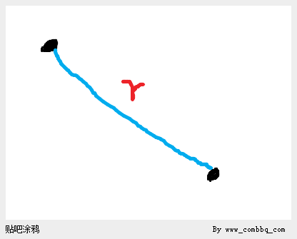

有人说，还有可能是这样的啊：

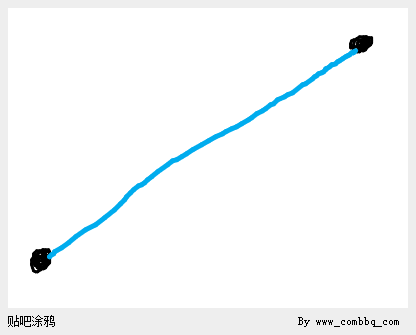

但是实际上，这两种画法是没有区别的，因为如果两个粒子之间的距离为r，那么我们可以在平面上保持中间一个点位置不变而360度地任意旋转另一个点：

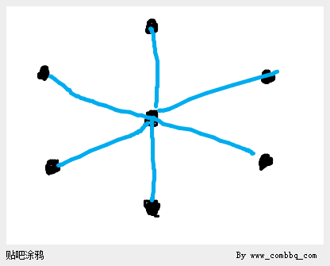

甚至，我们还可以这么画：

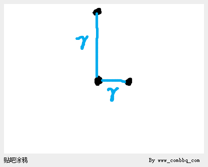

中间的点距离上面的点和右边的点都是r，为什么呢？

因为上面的点和中间的点在同一个平面上，和右边的点并不在一个平面上，所以其在【这个】平面上的【投影】看上去就是这样了。

于是两个点之间的距离确实给出了两个点组成的世界的全部信息。也就是说用这信息来确定这两个点构成的世界和用两个点各自在坐标架中的坐标值来确定仅有这两个点组成的世界是没有区别的，都是可以的。

那么第三个点呢？

这个时候我们有r1，r2，r3，根据初中的平面几何知识，三角形的三个边的边长确定了，这个三角形也就确定了。

那么第四个点呢？

我们可以这样去想，两个点各自为圆心画出的两个球之间相交有几种方式？

第一种，不相交：

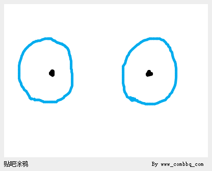

第二种，两个球相较于一个点：

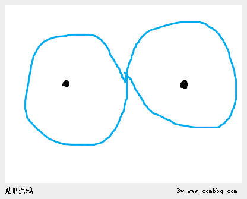

第三种，两个球相交于一个圆环，平面投影上看是两个点，AB两个圆的圆心连成的线段通过这个圆环的圆心，并且垂直于这个圆环所在的平面：

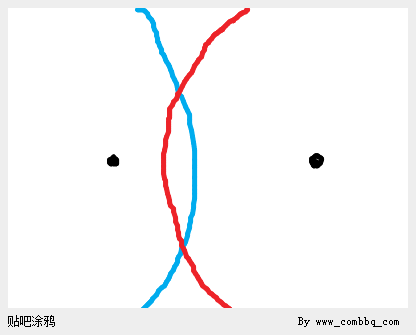

对于第一种情况：如果两个圆心点AB之间的球不相交，那么点C为圆心的球也就不可能与前两个球相交于【一点】。所以第一种情况直接排除。

对于第二种情况：如果A球B球的相交于线段AB之间的一点，那么点C为圆心的球最多也只能和A球和B球【同时】相交于一点。这个时候说明第四个点D唯一确定。

对于第三种情况：如果A球B球相交于AB之间的一个圆环，那么这个圆环与C球：

1. 要么不相交，也就是D点不存在，于是我们排除这种情况。

1. 要么，相交于一点，D点唯一确定。

1. 要么与上面说的圆环相交于相对于ABC三角形来说镜面对称的上下两点。对这两个点在ABC平面上做投影，我们得到：

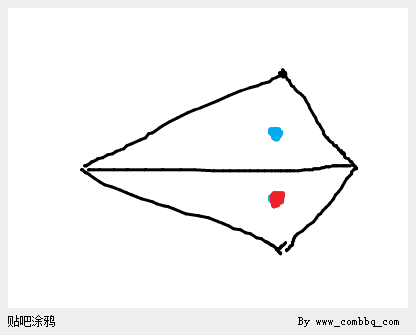

上面的蓝点表示我们取ABC平面“上面”的点作为D点的情况，下面的红点表示我们取ABC平面“下面”的点作为D点的情况。

这个时候D点的加入使得我们得到了两个相对于ABC平面成镜面对称的三棱体。

这引发我们去思考，我们大脑或者世界中所有粒子的量群，其实在镜子之中都有其对称者。而且其对称者量群的每个量的大小时时刻刻和镜子外的另一方相同。

于是，我们知道了，相互关系的量群无法携带世界的全部信息，因为这个世界的镜面对称的量群和这个世界的量群是时时刻刻一模一样的，但是镜面对称的世界和这个世界却并非必然是一样的，不过的确是与这个世界对称的。

有人问第五个点的添加呢？

因为三个点作为圆心所生发的圆最终可以交出与这个三个点构成的平面成镜面对称的两个点（D点的确定过程）。

以D点作为第四个圆心形成的圆，不可能同时和这两个点相交，因为如果同时和这两个点相交，那么D点到这两个点的距离就相等——都是圆D的半径，这样就要求D点落在ABC平面之内，而我们假设D点已经出了ABC平面了。

所以，当ABCD不共面的时候，E到ABCD的距离会在ABCD确定的三棱体其上或其内或其外唯一地确定一个E点的位置。

如果有人问假设加入第四个点D的时候没有出平面呢？也就是ABCD共面的情况，那E的加入不就可以上下任取了，其实这个时候E面临的处境就是我们已经讨论过的镜面对称问题了。

任意三点一定共面，于是四个点在不一个平面上的情况就成了很重要的一个情况。

于是，从E开始，只要我们从ABCD这个已经确定的三棱体的框架来思考它们的加入，那么所有点的添加都不会再有如D点添加时候的异议。

也就是说对D点（更确切地说是第一个形成三棱体的点）的添加位置的不同选择，决定了使用量群信息还原世界的时候得到的是本来的世界还是本来世界的镜面对称。

最后，如果镜子中的你有真实的你身上的量群的同步变化，那么镜子中的你有意识吗？

### **小A——意识是量群的变化而不是物质的运动**

由于量群没有携带世界的全部信息，但是我们可以想见，一个镜面对称的我也是具有意识的——尽管镜子中的我不具有意识。

于是我们更加可以看到量群的变化模式之于意识是否存在的重要性。

假设我们的世界是A，镜面堆成的世界是B。

在B世界中，其中的意识b和A中对应的意识a是不是相同的呢？

比如我指出左，但是镜子中的意识指出的实际上是我的右。

但是确实是他那个世界中的左。

于是他其实根本就感受不到镜面对称造成的困扰。

也就是说，**如果我所在的世界如果有一天成为了原来世界的镜面世界，我是根本无法察觉这一点的。**

有人说应该是对称的。其实，因为你在镜子的世界之外，所以你能看到镜子之中的那个世界是反过来的。

但是如果你在镜子之中，你是感觉不到有什么是反过来的，你的视觉体验和在镜子之外是一样的。

因此**原先世界中的意识和镜面世界中的意识，它们不是两个意识，它们就是一个意识。**

但是从世界之外看，这两个世界的物质的运动绝对不是相同的。也就是说如果宇宙的一处是一个世界，另一处是这个世界的镜面对称的世界的话，那么我们绝不能说这两个世界之中的物质的运动相同。

因为对于我们来说一个向右，一个向左，怎么会相同呢？但是不同的物质运动却能够展现出相同的量群变化过程，进而得到完全相同的两个意识。

这样我们就证明了意识来源于量群的变化而不是来源于物质的运动。

### **小A——量群的智慧变化模式**

作为一种特殊的量群的变化过程，自我意识的存在与否是否存在某种相应变化量群【模式】呢？

是否可以不通过人而通过计算机来找出这种模式呢？

我们说过智慧的标准：智慧的意识之中有存在感，也就是能意识到外部世界存在，同时也能意识到自我存在，或者说就是能意识到我与世界的对立。

这种智慧的标准，我们为了讨论的方便，不妨假设它是量群变化中的一种模式。

也就是说，只要是我们能找到一种量群的变化满足这种模式我们就可以说其中有智慧存在。

量群的变化的在现实世界中的具体体现可以是任意的，比如一个量既可以是电流的大小，也可以是风速的快慢，甚至可以是人语速的快慢。

由于我们的意识来源于身体之中物质的运动，如果暂停所有物质的运动，那么我们的意识就暂停了，所以意识不仅仅是量群，而且是量群的变化过程。

量，是一个抽象的概念，是一个相对的概念。一个量是多大，只有在建立的单位一长度的标准之后才能知道。但是如果一旦量变化起来，那么它自身的历史就是自身当前和未来的尺子。比如风速从一倍变到二倍，不需要外部的尺子，前面的风速就可以成为后面的风速的度量标准。

量群的变化模式的不必非得存在于大脑之中，甚至不必非得存在于相邻的物质之中。

量群完全存在于距离非常远的，看似毫不相干的事物之上。

比如分布于世界各地的温度计，如果在某一段时间之中，我们以一些温度计的读数作为量群，其变化模式符合智慧的量群变化模式，那么这些温度计的读数在这段时间之内作为一个整体就是一个智慧。

它可以有感受，当然，如果你要倾听它的感受，就要想办法。比如用温度读数的变化来驱动内存数据的变化。

也就是说，把这些温度计的每一刻的温度读数形成内存数据帧，然后利用定制的【呈现系统】对这些帧数据进行解释、呈现。

这样做之后，你的音箱中或者显示器上也许就会传来温度计群的读数的量群在那段时间的变化所表示的它的思维过程和内容。

这些量群之中我们假设有部分量群是那个大脑的输入，另一部分量群是那个大脑的输出。

我们可以看到，所谓的输入和输出，其实是全球温度的变化。

如果全球温度的变化恰好合适，那么这个意识看到的世界可能就是有一栋房子在其中。

如果大家难以想象我刚刚说的话，那么不妨这样想：

假设我看到了一栋房子，并说出了“一栋房子”。

我全身所有的分子原子在这段时间T里的运动，产生了海量的量群的变化——如果这句话看不懂请重读本节再继续阅读。

这些量群的变化，首先是有一组量（很多很多），然后这组量随着时间每时每刻变化。

把每一个量都让一根温度计来承载，然后让温度计的读数随着时间的变化恰恰等于它所承载的量，在那段T时间里的变化——先不要管为什么可以让全球温度这么配合。

那么这个温度计群构成的整体在一个T长度时间内，是有意识【被承载】在其中的。

而且这个意识还体验到了视觉，“看”到了一栋房子，然后它还说出了“一栋房子”这四个字。

不过在我们看来，它并不在一个真实的世界中感受到视觉和说出那句话。

### **小B——量群中量的承载者的多样性**

小B问：

【量群】不必非得存在于相同的承载者之中，也就是说量群中的承载者可以同时有的是温度计上的读数，有的是风速，有的是车速，有的是一个气球直径的大小。

对吗？

小A答：对的。

小B再问：

甚至我们可以随处抓到自己想要的量，比如我们第一帧抓了某些量群的承担者，我们下一帧可以抓另一些量群的承担者来满足对量群中各个量每一帧承担的数字的需要。

于是意识是充满整个世界的，甚至意识都可以是互相重叠的。

对吗？

### **小A——量的语义与量的数值**

我们所说的量，绝不简简单单只是数字。

也就是说我们不是在说数学上的变量。数学之中，只考虑量的数值，而不关注量的语义。

有人说量本身就是本身的语义。

但是如果量本身就是抽象的，那么一个量的语义指向一个抽象的事物，那么这个量依旧不能获得现实性。

量的语义我们以后称为【量义】。

量的数值我们以后称为【量值】。

### **小A——语义量是语义和量的统一**

语义量分为语义和量，其实就是分为现象部分和抽象部分。

语义是现象的，量是抽象的。量只关心语义量的某一时刻数值的大小和各个时刻数值的变化过程。

语义依附于世界中的存在。

**语义量的语义和量在语义量群变化形成意识的过程之中不可分割。仅仅研究量的变化并不能得到意识，因为意识是存在于世界之中的。**

但是在研究语义量群的时候我们往往只关心各个语义量的数值，以及它们之间的函数关系。

### **小A——量群中量的语义是固定的**

你的意思是在量群中看到了一个量r，这个量第一时刻是2，第二时刻是3。

于是你为了满足这个量群的变化过程，就在第一时刻让r是家门口的风速。

第二时刻让r是自己打字的速度。

从而拼凑每一帧的量群中的量的现实承载者——这是大错特错的。

因为量群的量，比如r是什么？怎么来的？

r是当初那两个小球之间的距离量。

r的语义，不能被替换成其他的语义。

不能说上一帧r是这两个小球之间的距离量，下一帧就把r赋予成街上站着几个人。

这样是错的。

r作为量群中的量的语义，一开始就是确定的。

只有这样确定的量组成的量群，满足了【智慧量群变化模式】的时候，在现实中我们才能看到有意识存在这些【量的协同变化】之中。

## **现象与因果**

### **小B——温度有意识？**

假设我们看到现实中的温度计群的读数的变化模式满足了智慧的变化模式。

那么意识是不是就存在于其中了呢？

**量群中有输入量群和输出量群，还有中间量群。**

温度计量群也是一样。

输入量群的变化，会导致中间量群的变化，最终会导致输出量群的变化。

这个过程可以是意识的听—说过程，也可以是意识的读—写过程，还可以是触摸—尖叫过程。

我们通过调整输入温度计群的读数（通过影响温度计周围温度的方式）产生输入，发现整个量群的变化模式恰好符合智慧模式，而且最终导致输出温度计给出了相应的正确的输出量群变化模式。

我们假设这个过程温度计的读数变化都是气温驱动的。全球气温的这种变化过程是不是一个真实的意识呢？这个意识是不是在思考呢？它是不是也有感觉和感受呢？

### **小A——有模式就有意识**

语义量之间满足函数关系，语义量群的变化满足智慧量群变化模式，量群的变化中就有意识。

比如前面说过的全球气温引起温度计量群产生智慧模式的例子，温度计的群体揭示了全球温度之间构成的意识的活动。因为所有温度计的读数构成的量群的变化模式符合智慧的量群变化模式。

对于计算机中的随机而来的帧数据，我们通过对帧数据进行解译。在每一帧中找出量群中的每个量在这一帧中的大小，如果这些量的在时间中的变化满足智慧量群变化模式，我们进而使用这些量来驱动现实中的语义量（比如去驱动温度计群），虽然数据是随机的，但是仍然恰好使得其中解译出来的其他语义量群配合了输入语义量群的变化。

我们依旧要承认在这过程之中，是有智慧存在的。

对于同样一批帧数据，如果我们通过另一种解译系统，找出了另外一组量群，这组量群也具备智慧量群变化模式，我们通过新的量群信息驱动现实中的语义量，那么我们也要承认另一个智慧在这过程中存在。

这两个意识在这两个不同的量群过程之中是可以有感觉和感受的，因为感觉和感受不过也就是语义量群在时间中的变化。

### **小B——现象与因果**

意识不是语义量之间的函数关系是语义量之间的因果关系。

函数关系只关注现象，因果关系关注必然性。

在语义量群的变化模式之中，我们可以找到语义量之间的函数关系。

但是现实中的语义量之间如果出现了这种函数关系，那么是不是就和比如大脑中的语义量等同了呢？

语义量之间的函数关系等同于意识吗？

没有任何联系的语义量之间也可以在某段时间之中出现函数关系。

但是这不代表着它们之间存在因果关系。

也就是说，因变量的变化并不是自变量变化的【原因】，自变量并不是因变量变化的【动力】。

自变量和因变量之间的函数关系是巧合。

所以意识的本质虽然不是物质的运动，但是也绝不仅仅是量群的特殊变化模式。

量群的变化模式只是结果，只是现象，其剥离了语义量之间的依赖和因果关系。

当然，关于因果，又有很多话题可以谈，甚至涉及法理。

### **小A——意识现象来源的分类**

意识现象有三种来源：

- 有可持续性保证的意识，例如：

- 比如人脑中的意识。

- 比如通过【推演系统】推演出来的帧数据支撑的语义量群中的意识。

- 无可持续性保证的意识。

即量群中语义量之间的函数关系进而整个语义量群的智慧变化模式的确是因果律导致的但是其相对于人来说却不能持续“稳定”的存在。在这里**人是“稳定还是不稳定”的尺度**。什么叫稳定？持续一年叫稳定？持续一个小时叫稳定？持续半个小时也叫稳定？持续一秒钟就不稳定？

例如：

- 比如前述的由全球温度维持的量群智慧模式——假设全球温度在那段时间里确实是互相之间有“明显因果联系”的。

简单说说什么叫“明显的因果联系”：

大家都知道一个结果，往往需要有很多原因。据说蝴蝶一振动翅膀就可能造成龙卷风，可是只有蝴蝶振动翅膀就可以振出龙卷风了吗？

显然不是。

但是如果那只蝴蝶那次不振动翅膀也许真就没有那场龙卷风。

那么什么叫明显的因果联系？这个概念很难定义，但是往往在现象中人判断起来又不是那么困难。所以我想说的是，**人是“明显还是不明显”的尺度。**

- 无可持续性保证且语义量之间的函数关系不来自于因果性，例如：

- 通过随机数发生器产生出来的帧数据支撑的语义量群中的意识。

上述的三种意识，都具有平等的地位。

因为意识，作为时间中的过程，作为语义量群的变化，作为物质世界的运动，本质上来讲是一种现象。当从语义量群变化的客观角度去看这现象之中的自我意识、存在意识、感觉、感受以及其他等等的时候，这些理念世界中的东西都不存在了，只剩下语义量群的变化模式。

## **灵魂与当下**

### **小B——灵魂存在的证明**

导语：所谓灵魂，在这里是指不是由身体之中物质的运动所支撑的那部分意识。也就是可以脱离肉体而存在的意识。

如何证明灵魂存在呢？

如果我们假设灵魂不存在，经过实验或者理想实验能够推出矛盾。

那么我们就可以证明灵魂存在。这就是我们的证明思路。

下面是证明的过程：

如果使用粒子每帧的信息，使用真实但是之间没有相互作用的粒子，打印出来一个世界。

由于粒子们之间没有相互作用，所以打印完毕后就静止在那里。

那么下一刻开始的时候我们收起一切，我们再打印出来这个世界下一刻的样子。

如果这个世界中有人，那么意识是不是就此存在了呢？

显然根据我们的假设，意识来源于身体之中物质的运动，于是意识就此存在了。

虽然我们人自身不是打印出来的，但是我们在宇宙之中飞行的速度之快，使得我们上一秒所在的位置和下一秒所在的位置相差极其之远。

所以我们根本不需要在原地打印出来下一刻的这个世界，我们在极其遥远的地方打印出来下一刻的这个世界都是可以，只不过相当于这个世界在运动罢了。

于是如果我们只是打印一个人，我们打印他的第一刻之后再打印他的第二刻，但是第二刻和第一刻之间相差非常远。

于是我们根本不必收起第一刻的那个人，而直接跑去打印第二刻的那个人就可以了。

而这样的打印结果虽然是静态的，但是这个人却认为他自己是活着的。

但是在我们看来，每一刻的他都是静止的，死的。

于是粒子道的二维打印结果之中也真的就有了一个世界，甚至有意识活在其中。

也就是说，静止的物质的陈列之中有意识存在。

世界、意识都存在于静止的物质的序列之中。

但是问题是，为什么这个人的自我意识总是认为自己活在当下，也就是活在最后一个打印的世界之中呢？

所以，人的当下意识绝对不能来源于人身体之中物质的运动。

灵魂存在。

### **小A——电与磁**

确实，我们可以打印出来所有粒子的不同时刻的位置，并在空间中依次摆开。

抽象图：

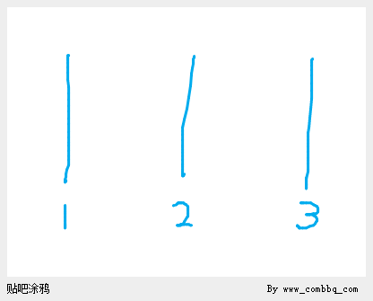

可是，事实上是这种思考方式过于简化，以至于没有考虑到所有量群之中除了粒子之间距离的量，还有电场量和磁场量。

也就是说，如果确实把1、2、3看作是物质在时空之中的静止状态，那么粒子从1运动到2和从2到3的【过程】之中，实际上绝不是空无一物，而是存在着电场和磁场：

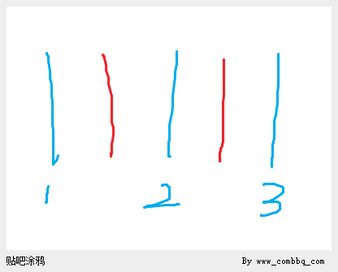

单独打印出1这一刻静止的所有的粒子，并不会附着任何电场和磁场。

只有让1动起来，也就是从1到2的过程之中才会产生电场和磁场。

因而单独打印出来所有静止的粒子确实不会有意识在其中。因为意识本就不在静止的结构之中，而是在变化着的物质结构所引发的电和磁的变化之中。

### **小B——电与磁**

小A说，从1到2产生了电场和磁场，可是从1到2产生的所有电场和磁场难道不是静态的吗？

也就是说，物质的运动产生了电场或者磁场，但是物质的运动产生的电场或者磁场可以是稳定的。

比如一块磁铁放在那里，它的磁场来源于内部电子的运动，但是它的磁场却是稳定的。

确实是物质从1时刻到2时刻的运动导致期间电场和磁场A的出现：

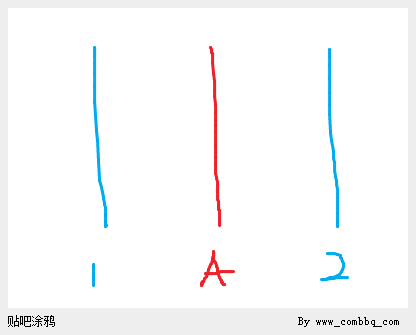

但是A中的电场和磁场在A中不是变化的，而是籍由物质从1到2的运动产生的，在空间中的每点有其确定数值和方向的。

于是，如果我们认为是附着于物质结构2、3、4的A、B、C才是意识的载体：

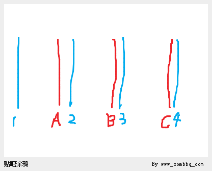

可问题是A、B、C之中的电场和磁场虽然来源于物质的【运动】，可是它们本身分别在A、B、C中却是静态的。

也就是说A、B、C中的场并不是变化的场，而是稳定的场，它们在A、B、C当中有稳定的值。

### **小A——电与磁**

电场和磁场的传播都是需要时间的。

虽然，在遥远处，场的大小可能非常微弱，但是即便是这微弱的场要存在在那遥远处，也是需要从场源按照光速传播过去的。

也就是说，如果场源是不稳定的，变化的，那么距离场源一米远处的一个点的场强将不是同步变化的。

这一点我们可以通过想象水波的传播。

一开始我的手在水面起伏很慢。

十米开外这起伏已经很微弱了，相当于场强微弱。

但是突然之间我的手的起伏变快，但是十米开外处，此时和之后的一段时间根本感觉不到这变化。

只有过了一段时间，等到频率很快的波到达了十米之外处，那里才能感受到这变化。

电场和磁场场源的变化也不是【即刻】影响到其他空间，而是需要一段时间，场源变化的传播速度理论上是光速。

就像我们的手在水面的上下起伏频率的变化留存在了不断传播到远处的水波中一样，电场和磁场场源的【变化历史】也留存在了空间中：

场源以A状态传播了三个时刻：

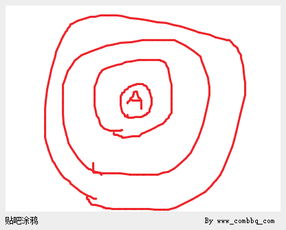

场源以B状态开始传播：

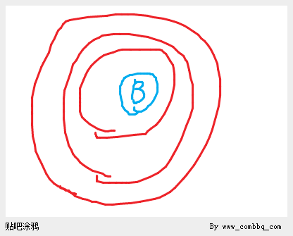

场源继续以B状态开始传播：

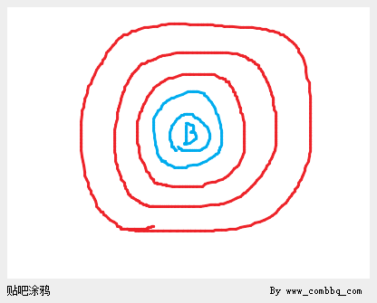

场源以B状态传播了2个时刻之后换C状态开始传播：

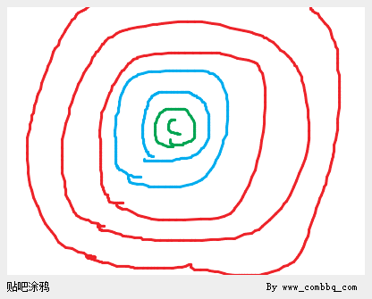

空间当中存在的不是场，而是场的历史：

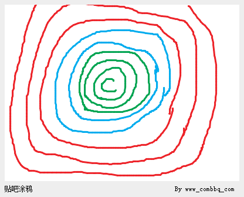

**不仅场是有方向，场的传播也是有方向的。**

仅仅获得了场的全部大小和方向信息，仍然不是场的全部信息。

场的全部信息必然包含场的传播方向进而是消失方向的信息。

所以即便是空间中静态地打印出来所有场这一刻的大小和方向。

由于场的传播需要时间，也就是场在空间的某一点的消失也需要时间。

于是全部物质都静止之后，仍然有一小段时间中，场是存在的。

全部的物质都重新开始运动之后，仍然有一小段时间之中，场还没有建立起来。

### **小A——自我与当下**

自我意识是意识到我存在。

当下意识是意识到时间在向后流淌，当前不是过去，也不是未来，而是当下。

自我存在并且总是存在于当下，而不是存在于过去，更不是存在于未来。

这种意识，正如小B所说的，不可能存在于粒子之间静态的结构之中。

但是小B忽视了粒子之间的运动会导致各种场的出现。

虽然小B之后承认了粒子之间的运动会出现场，但是忽视了场不仅有大小和方向，同时有自己的传播方向和消失方向。

于是物质的运动留下了痕迹、发出了信号，这信号就是场，在空间中。

空间之中，一种场的状态的结束，紧接着就是另一种场的状态的开始。

就像是俄罗斯套娃，一层套着一层。这样，在所谓的静态的粒子结构的空间之中，其实同时有着这些如俄罗斯套娃一般的正在生成和消失以及相互合成的场。

我们使用下图简单化：

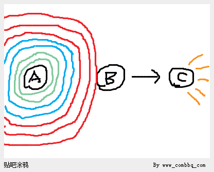

图中A产生了信号，B接收到了信号，C在B的控制下影响外部世界。

A可以看作是自我意识或者当下意识的来源，B可以看作是集成自我意识和当下意识从而产生自我存在于当下这一合成意识的地方。

C可以看成是言语功能。

这样，A帮助意识产生，但是它很基础。

B在A（们）的帮助之下完成复合意识的形成。

C在接受了B形成的合成意识之后，将其转化为言语，并进一步控制发声系统，将其说了出来。

从而我们发现，意识过程就这样完成了出来。

### **小B——问题依旧**

虽然小A从电磁的角度避开了粒子空间摆放之中不存在自我意识的问题。

但是其实身体之中任何一点在某一刻的各种场（电场、磁场、引力场）在计算机推演着的世界中都可以被计算出来，所以，其实任何一个时刻，任何一点的任何场都是确定的。

于是，虽然我们现在的技术仍然不能打印场。

但是假设，仅仅只是假设：我们能够打印各种场。

于是我们会发现，曾经的那个问题依旧存在：

某一个人在连续的各个时刻的所有“物质”都被逐一打印出来，这个过程可以看做是此人在空间中运动。

但是对于我们来说，不同时刻的同一人都排列在眼前的时候，我们无法接受这个人心中有自己活在当下，活在向后流淌的时间之中这种意识。

小A的解决，其实并没有解决。

小A只是否定了自我意识以及当下意识等的真实性，把自我意识和当下意识等都当成是物质的运动的结果，虽然不是机械的，加入了电磁，但是本质上还是将自我存在意识异化为物质的运动，从而给其打上了【错觉】的烙印。

### **小B——B是灵魂吗？**

这图中的B，会不会就是灵魂呢？

## **如果意识不完全由身体之中的物质支撑**

### **小A——灵魂与当下**

假设我们身体中的物质运动不可能出现全部意识。

也就是说，意识至少有一部分是灵魂，灵魂是在我们身体之外，甚至是这个物质世界之外的东西。

对于粒子道的世界，其中的肉身，如果我们给它们接上灵魂，那么这些灵魂就会体验这个粒子道的世界中的演化。

这些灵魂就会体验到当下和时间的流逝。

于是说我们人类也可以是灵魂，是被接入到了一个正在进行推演的三维世界中肉身上的灵魂。

所以如果灵魂存在，那么我们这个世界可以不存在，我们这个世界完全可以只是一个被推演着的计算机的推演过程而已。

为什么我们总是在体验“当下”呢？

我们在体验当下，不正是因为这个三维世界如游戏般在运行吗？

当你的意识已经习惯了世界是客观存在、一直存在这个想法的时候，其实这可能是错的——世界存在可能是种错觉。

世界完全可以是上一秒才把所有粒子摆放好，然后这一秒开始才开始进行演化的。

我们根据曾经推演到的某一帧，做好粒子初始化，然后再开始推演，同时再用摄像头把我们接入到粒子道中的某个智慧面前的屏幕上。

那么那个世界里面的智慧会说，啊，我刚刚经过了一年的旅行，上帝你现在还好吗？

你会说，还好还好，只不过，在你看来它根本没有经过一年的旅行，你只是把这个状态直接装入内存开始推演罢了。

### **小B——存在感的二元性与世界存在感的错觉**

我们在《小A——存在感的二元性》说过存在感的二元性。

只要有存在感，必然是两个方面的：

意识到世界存在。

意识到自我存在。

如果意识不完全来自于身体物质，也就是灵魂存在于身体之外。

而世界可能是被计算机推演着的游戏，我们的灵魂是被接入到肉体（玩家）身上的。

那么其实我们对世界存在的意识就是一种错觉，因为世界如果是一段程序，那么我们所觉察到的一切根本就不存在。

## **小A小B小C——我们的论—辨图谱**

随机

其他意识

（我的错觉）

自我意识

（自我的错觉）

现象

语义量群的变化

因果

物质的运动（因果）产生语义量群的变化。

语义量群的变化产生自我意识的错觉。

自我意识控制自我产生各种意识现象，并外化之，比如聊天过程。

聊天过程作为现象，其实可以是被随机出来的。

聊天过程作为作为现象，也是可以经由人工智能有序（因果）地产生。

最终现象被接受者的意识理解为其他意识存在，这是一种错觉。

## **灵魂存在吗？**

这里灵魂是指能够脱离肉身存在的意识。

即便我在这里给出我认为的哪种说法是对的，你也一定是自己保留自己的意见。所以，其实并不是这个世界上的诱惑和蛊惑太多，而是你的心灵正在向各种【你想听】到的、【你想看】到的和【你愿意相信】的想法敞开。与其说是【被蛊惑】，不如说是你的“既成之见”让你【选择相信】。

很多怀疑灵魂存在的人，可以接受世界是意识的错觉，也可以接受其他看似存在的意识也是自己从信号集中理解出来的物，也就是自己的错觉。

但是仍然无法接受“我”如何会成为我的错觉？

因为自我意识，并不是我从信号集中理解出来的，而是我自己能意识到、能感觉到我自己存在。

于是，世界可以是我的错觉，其他意识也可以是我的错觉，问题是我自己如何成为了我自己的错觉的？

如果意识完全来源于身体之中的物质的运动，我当然可以在观察我自己的思维与外部交流的过程之中理解出来“我”的存在，这种理解过程和结果的确是错觉。

但是现在我们并不能肯定意识完全来源于身体之中的物质的运动，所以当我从自身之中去把握自己的存在，这种过程和结果却让我无法接受“我”是错觉。

在当代，人类的脑科学并没能证明灵魂存在或者不存在。

甚至美国2013年奥巴马才刚刚开始了一个大脑神经网络的绘制计划。

所以你可以选择相信意识完全由身体之中的物质支撑起来，你也可以相信意识不完全由身体之中的物质所支撑——也就是灵魂存在。

我不做选择，我等结果。

# **数学**

## **罗素悖论**

罗素悖论，要是我没记错，应该是这样表述的：

集合 S是所有不包含自身的集合的集合。

问题是集合S包含不包含自身？

如果包含自身那么S与自己的包含范围矛盾。

如果不包含自身，那么符合定义要求就应该包含到S中去。

刚刚吃完早饭，忽然觉得这个事情好像不是那么奇怪呦。

假如有一个集合A是这样的：

一个包含自然数同时又不包含自然数的集合。

那么这个集合A连个空集都算不上，只能算是不存在。

所以错误的根源是：所谓【集合A】的说法就是错误的，这根本就是一个无法构造出来的【假集合】。

我觉得【假集合】这个概念还是有必要的，所有集合在被证明是【真集合】之前都只能被称为【假集合】，因为只是描述一个集合的样子并不能保证能按照描述构造出来符合逻辑的结果。

罗素悖论也是这样的吧，只是它的着眼点不是这么简单的包含还是不包含自然数。

它的着眼点是……

啊，刚吃饱了正在消化，能力有限，不表述了。

总之结果就是这个集合 S不能被构造，从而连空集都算不上，是一个【假集合】。

证明题：证明罗素悖论中的集合S为【假集合】。 假设集合分为真集合和假集合，所有逻辑错误、无法构造、不存在的集合都是假集合。

证明：

假设S为真集合，那么S存在，也就是S为传统意义上的集合。

S的性质：

1\. 是集合。

2\. 是集合的集合。

3\. 是所有不包含自身的集合的集合。

3\.1 假设S包含S，那么与3【矛盾】。

3\.2 假设S不包含S，那么按照3，S应该包含S，与3\.2的假设【矛盾】。

【矛盾】。

所以【假设S为真集合】错误。

所以S为【假集合】。

## **Better Best 悖论**

看电影《Ghoul》，一上来看到一行字：Chiller Films，于是我想出了一个悖论，异常简单，但是反映了问题。

神问两个人，给你们各自两种选择：

第一，成为最好的。

第二，成为更好的。

甲选择成为最好的，乙选择成为比甲更好的。

如何满足？

满足了甲就不能满足乙，满足了乙就失言于甲。

神是不是一定要面对如此窘境呢？其实不必。

因为我们完全可以【先】让甲做出选择，【再】让乙做选择，并且在乙提出选择之后，判断乙的要求的【合法性】。下面我们就谈谈【先—再】与【合法性】的话题。

## **思维是四维的**

逻辑，往往丢失了对时间轴的考察，这是很多悖论包括罗素悖论产生的原因。

比如，“我现在说的话是假的”，这构成了一个所谓的悖论。

其实这不是悖论，而是错误。

错在哪里呢？

比如我们有这样一个命题序列：

ABC

在我们的命题序列中有时间点，或者用编程语言设计学的观点叫序列点。

\.A\.B\.C\.

我们把这几个点给与名字：

1A2B3C4

这样我们就可以谈论这些点了。

假设我们的命题ABC讨论的内容都是关于命题序列本身的。

那么我们有A=“前面无命题”，显然A正确，而且A说的前面是指1的前面。

B=“A不正确”。

此时我们把正确还是错误作为标签放在每个命题下面：

1A2B3C4
1T2F

注意，我们的ABC都是在做运算，基于命题们的真值的运算，而且A的真值是直接的，B的真值依赖于A的真值和B中描述的基于A的运算。

这个时候我们来考察C，C说的是“我不正确”。

注意我们一旦【准备】开始考察C，也就是我们彻底考察完了前面，那么我们的时间序列点就移到了B后面。

也就是：

AB\.

这个序列点现在的位置表示：序列点3之前的命题序列已经ready了，真值【全部】确定【完了】，可以用于之后的计算了。

我们接着在B的后面【放上了】C。为什么我们在这里强调【放上了】C这个行为？

因为把C放到B的后面这件事本身暗含了，C是可以和B和A一样，参与真值计算的，也就是说，把C放到B之后，就给了C一种【计算合法性】。

**一个命题无论其最终的真值是F还是T，其都具备一种【计算合法性】，也就是【可计算性】，但是很多时候我们往往忽视了有些命题是非法的。**

**也就是说有些命题不具备可计算性。**

所以实际上，对于C得到真值之前，有两个判断过程：

1、判断C命题是否具备可计算性，也就是说，C命题摆放在B命题后面是不是合法的。因为所有摆放到B命题后面的命题，我们都是希望将来让它和B命题以及A命题一样，可以参与到后续命题的计算当中的。

2、如果C命题具备可计算性，那么判断C命题的真值。

我们不知道C是否具备可计算性，那么我们就使用试错法，我们先把C放到B之后。

我们现在有了C，但是现在又有一个问题了：

一、 现在序列点应该移动到4了，因为我们有了C，我们就可以把C放上去，我们就可以考察C了。

虽然我们没有判断出来C是正确的还是错误的，但是C必然是正确的，或者是错误的。

我们在运算的时候可以通过假设C正确或者C错误来做【C中规定的运算】。

二、 现在序列点不能移动到4，因为我们虽然有了C，但是我们只能依靠序列点之前的命题真值来做运算。所以我们只能把序列点放在3，只能用已经确定真值的命题AB和特殊序列点1之前“无命题”这些【已经落定的事实】来做运算。

我们先来说【一】：

对于【一】所说的情况，我们进一步流程化。

假设C下设置T，那么：

1A2B3C4
1T2F3T4

这个时候序列点在4，也就是：

ABC\.

然后根据T，我们知道我们要承认C中描述的现象，因为C是“正确的”（T）。

接着，我们还要完成每一次都要完成的任务：依照C中描述的计算，利用序列点之前的命题“已经落定”的真值计算C的结果。

结果C的结果是F。

与我们的设定相反。

同样的过程，我们可以得到即使设定C下为F，那么我们也会得到与设定相反的结果T。

这样的结果显然令我们陷入了循环，循环的闭环就是：

设定了C的真值就要依照C的真值进行C中描述的计算，计算的结果又要重新设定C的真值，问题是两次设定的值矛盾，或者说不断地在反转，真值（序列）变化行为形成循环（闭合）。

这是我们走【一】中道路所获得的结果。

我们再看看【二】，也就是时间序列点不应该在C的真值没有【落定】的情况下就移动到4所在的位置。

也就是说在C的真值落定之前需要进行的计算没有完全结束之前，不应该把序列点移到C之后。

因为序列点【在】4就是我们利用C的真值进行计算的合法性依据。

也就是说，我们把序列点的移动严格地规定为C的真值的【落定】，把落定定义为用于确定C的真值的【有限的】计算过程的结束。

但是C命题本身要求序列点在计算自身之前移动到4，也就是说C命题要求自身的真值没有完全确定的情况下就使用自身的真值。

如果我们规定了序列点不能在C的真值完全计算完成之前移动到4，那么C命题就不能被我们这种计算所容，也就是说我们通过对时间序列点的移动的要求的规定，否定了C作为此中命题的计算合法性。

**也就是说C根本就不应该被允许放到B的后面【尝试】去计算真值，或者说在C打算被放到B之后被计算真值之前，我们就应该提前判断C的可计算性——真值判断和可计算性判断应该分开，而且是有先后顺序要求的。**

就像C不能去使用C之后的命题进行计算一样，C也同样不能使用C自身的真值进行计算。因为C的真值，按照我们的要求没有【落定】，C的真值的计算过程没有完成，C的真值就不能被使用。

更为明显地标识出这一点就是通过对时间序列点的规定。

现在的问题就是，我们总是希望通过静态的逻辑来回答动态中的悖论。

我们不是不能把时间静态化，比如我们可以用【序列】来考察和时间有关的东西。

但是我们必须要关照时间维度，因为逻辑是思维的形式，而我们的思维是四维的。

所谓思维是四维的，就是说我们的思维由于我们实践而必须【关照】到【时间维度】。

因而我们的逻辑不应该逃避时间这一维度【只】去考察静态的、无步骤的关系。

时间未必就只能是t，也可以是步骤、是序列。

所以从本质上来讲，罗素悖论是计算问题，而不仅仅是传统逻辑问题。

或者说，罗素悖论实际上为传统逻辑引入时域、在计算发生之前引入【可计算性—计算合法性判断】提供了一次机会。

## **是非判断之前先要判断是否能判断是非**

我们说过世界的三要素是存在、存在逻辑、存在过程。

可是正像我们在《思维是四维的》之中所讲的一样，如果我们要判断一个命题的真值，首先要判断这个所谓的“命题”是不是可以做真假值判断。

或者我们可以这样分类语句，就像我们当初那样分类集合一样：

语句分为命题和伪命题。

命题可以判断真假值，分为真命题和假命题。

伪命题不能判断真假，属于非法陈述。

我们回到对世界三要素的讨论。

我们判断一个我们认为的事物是不是一个存在的时候，我们应该先判断：

【我们接下来要对此事物是否是一个存在做判断】——这件事是不是合法的。

也就是说，有些我们认为是事物的东西，我们不应该去【先】判断它是不是一个存在。我们需要先判断存在感是对于谁来说的，之后才能判断那个事物对于我们正在考察的、能产生存在感的意识来说是不是一个存在。

就像罗素悖论中的集合S，它是不是一个集合都还没搞清楚的时候，怎么能先去判断它是不是一个集合的子集呢？

那么在进行世界的三要素判断之前，我们应该先进行什么判断呢？

我们对于存在的意识，是我们信息处理系统的活动，而信息处理系统是被某套信号处理系统支撑的，信息处理系统的输入信息来源于驱动程序，根本上来源于本身信号处理系统对外部信号世界的信号采集。

对于我们人类来说，计算机中推演的粒子道不是真实的存在，根本原因在于我们无法让我们自身的信号处理系统采集到我们所推演的世界中的信号。

虽然我们可以“看”推演过程，但是看并不是真的把我们的信号处理系统接入到了那个世界中。

如果我们把我们手指的神经接入到了那个世界中的一个人的手指神经上，我们跟着那个人的触摸可以感受到他在虚拟世界中感受到的接触感，这个时候，就和在显示器上看推演不一样了。

那个世界中被触摸着的事物【对于我们的手来说】就是存在的了。

推而广之，如果我们全部的神经系统都接入到了那个世界中，像电影《黑客帝国》中展现的一样、也像理想实验《缸中脑》所描述的一样，那么那个世界【对于我们来说】就是真实的。

对事物的存在感，根本上来讲是息处理系统的中自己建立的一个概念，是信息处理系统对支撑其的信号处理系统在外部采集的信号集的一个标签。

可以说存在感本身完全可以是一种错觉。

于是我们讨论存在相关的问题之前，一定要问清楚，关于存在的存在感是哪一套信息处理系统中产生的，而它又运行在哪一套信号处理系统之上。

## **芝诺悖论**

芝诺悖论——飞矢不动悖论的原始内容请参考百度百科:

[http://baike\.baidu\.com/view/189785\.htm](http://baike.baidu.com/view/189785.htm)

以下直接开始论述：

飞矢不动的关键就是空间的无限性，也就是说飞矢需要经过空间的每个点才能到达一米的位置。

可是空间中任何两个点之间都有无限多个点，所以飞矢甚至根本就不能移动【一点】，因为一点和起点之间就有无限多个点。

听说很庆幸的是，我们数学的极限理论解决了这个问题。

非常符合我们平常老百姓想骂芝诺笨蛋的心情。

我不得不承认，我曾经就是这样一个老百姓。

可是刚刚受到《西方哲学简史》（赵敦华）的启发，我发现一个问题。

飞矢不动这个悖论产生的原因是，是我们把现实中的问题，放到我们的数学认知能力中去思考造成的。

而飞矢不动问题的解决：极限，又是在我们的数学认知能力中去完成的。

这样就有了一个很大的问题，也就是：

问题出现在数学中，问题的解决也是在数学中。

那么现实当中到底没有没飞矢不动的问题，也就是空间无限可分的问题。

极限在数学认知能力中对飞矢不动的解决是不是真的帮我们解决了一个【现实】的问题。

还是它只是解决了我们数学认知能力自己的问题。

也许，极限就是通过自己对无限与现实之间矛盾的调合，

掩饰了数学认知能力带来的思维与现实之间的矛盾，而将无限与现实之间的明显的矛盾更深地隐藏到了极限之中。

假设我们最后将一个量【化归】为了这样一个形式：1/X，那么

X\->无限大

1/X\->无限小

可是就是这个【\->】隐藏了无限自己想要隐藏的问题。

数学老师怎么教我们念的来着：趋向。

问题就在这里，如果一个问题在无限这个概念存在的情况之下是完成不了的。

那么趋向无限的过程怎么又能完成呢？

很多数学学得好的同学要跟我辩论，这个趋向不是一步一步地走，而是对比。

而且这种对比是【序列元素】之间的对比，而【序列元素】之间的关系排着看是动态地的趋向，但是排完了，从整体看【趋向】就不是一个【过程】，而是代表一个【序列整体】静态的性质。

问题就在这里，极限把动态的过程巧妙地转化为了序列静态的性质。

从而躲避了现实中运动是在时间和空间【四维】中发生的事实。

也就是说，数学用一种运动在时间序列上完成之后结果，回避了时间序列发生的过程。

数学是偷偷地把关键的部分先完成了，然后突然跳出来说：

哈哈，你看，这个是无穷小，就是0\.

可是你怎么得到的无穷大呢？无穷大得到的过程又是如何在【趋向】中的隐藏了时间呢？如何将动态的趋向，转化为了静态的数列属性了呢？

回答它们吧，数学。

在时间中现实发生的运动，能完成无穷大吗？

完成无穷大之前不要完成N吗？完成N之后不要完成N\+1吗？

数学的问题就在这里。

举个实际的例子来说：

飞矢，每次要走到S路程还未走的部分的1/2处，那么飞矢永远无法走完整个S。

这个悖论描述算是芝诺悖论的精炼说法。（我刚刚发明的，帅吧^\_^，自恋这么一小下。）

这个悖论中飞矢走了N次的长度Q可以被描述为：

Q = 1 \- 1/\(2^N\)

也就是2的N次方分之1被1减，结果就是Q。

极限对这个悖论的解决是，N【趋于】无穷大的时候，Q等于1。

因为在趋于无穷的过程中【1/\(2^N\)】这一项分母趋于无穷大，因而分数趋于无穷小。

问题在哪里，问题就被隐藏到了哪里。

问题就在于，本来就说飞矢要一个一个地走完【每一个】上一次剩下的二分之一的点。

结果解法里面一句【趋于无穷大】，好像这个意思你一下子就到了无穷大了，对不起，你【趋于无穷大】的过程呢？

飞矢（从第二次开始）通过一次次地执行前进【1/2】上次步长的行为来趋于无穷大的时候：

飞矢可是必须要先达到N次，再到达N\+1次，再到达N\+2次……

这，就让问题又回到了悖论问题本身。

说明极限只不过是把无限思维带来的矛盾隐藏到了自己之中，但是根本就没有解决这个矛盾。

只是把矛盾藏起来，让人不去想而已。

结论：我们的世界并不连续，它只是离散得不明显罢了。

## **shenchensh发难：超级悖论**

原帖地址：[http://tieba\.baidu\.com/p/1834112597](http://tieba.baidu.com/p/1834112597)

百度贴吧吧友shenchensh ：

大家想象斜线绕定点（红色标记处）沿箭头顺时针方向旋转，那斜线与水平线的交点A点就会向左移动。现实情况是：斜线可以和水平线平行。理论逻辑却是：A点必须无间隙的持续移动。我们知道，直线是没有尽头的，所以两条直线只能无限的接近平行，不可能绝对平行。请大家给个说法！！！

www\_combbq\_com（本人）：

再一次展示了数学认知能力带来的矛盾。

【数学的问题只能在数学认知能力中解决】。

你可以想象它的确完不成相交的断开，也就是只可以无限接近于平行。

如果非要旋转起来，那只能是你的认知能力接受了这一矛盾，在无限接近平行的时候跳了过去。

其实楼主的问题可以进一步深化：

就是芝诺悖论了，也就是说，任何一个小的角度的【旋转】其实都不可能完成，因为在数学认知能力中这个小的角度中有【无限】个小的角度等待楼主去一一转过。

www\_combbq\_com（本人）:

比如，按照楼主的设计方法我来设计一个从【31度】角转不到【30度】角的【画面】。

图中，30度角的射线已经做好，指针正在31度角的位置，如果要让指针达到30度角，必须解决楼主提出的【无限长射线的平行问题】。

所以，别说转到平行，就是转过一度都是不可能的。

这就是数学认知能力自身产生的认知问题。

【数学的问题只能在数学认知能力中解决】。

www\_combbq\_com :

大家有没有想过，楼主的问题其实就引出了相对论中关于光速的问题。

也就是说，如果说我们的宇宙是无限大的（因为我们想不出来宇宙的边界要如何才能存在。）

那么对于这样一个宇宙空间来说，假设我们存在一个【无限快】的光速，

打开就直射宇宙的无限之处，

那么必将遇到楼主所说的问题的衍生问题，

也就是【半个角度都转不过去】的问题。

这样就证明了光速必定是有限了，

或者说不存在【无限快】的【空间中的】传播方式，即使光速不是极限，也总是会有一个极限速度存在。

速度不能是无限的。

## **勾三股四弦五是巧合**

有一次我问一个一维世界中的智慧，我问：

你认为，你最不能理解的事情是什么？

他说，我最不能理解的就是勾三股四弦五。

我问：为什么？

它说：你看，我先走3米。

然后又走了4米，但是我真的不知道在3米那里有一个拐弯。你能理解吗？

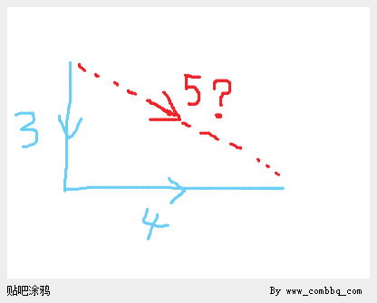

我说，我理解，你确实应该感受不到那里是一个拐弯。

他接着说，然后有人跟我说其实我走了5米。这让我百思不得其解。

我说，我理解你了。

所以我现在就在想，弦为什么是5？而不是其他数字？

有人肯定觉得我疯了，可惜，如果觉得我疯了的人想一想球面几何，那么他立即就会收起嘲笑的面容，而一愣。

其实弦五，而不是弦六。就是上帝的力量。

或者说，直角边平方和等于对角线平方，某种程度上来说，是一种巧合。

所以，如果我们想找到勾三股四弦五是【必然的】的证据，其实是找不到的。

也就是说，其实直角三角形【直角边长度的平方和等于对角线长度的平方】这事，只是恰好在我们的世界中成立，而这种关系对于空间来说，本质上不是必须的。

但是5的平方等于3的平方加4的平方，这是必须的，也就是说，数字之间的这种关系没有问题。

问题在于空间中的3和4长度的线段成直角之后，直角边就是5这样一个长度——这件事，不是必须的，是巧合。

还有另外一个很重要的事情，就是很多时候，大家喜欢从空间的角度去探索某些代数问题。

比如x的n次方就是n维空间中的x长度的立方体。

既然勾三股四弦五不是必然的，那么借助几何解释来求解算术问题就未必是正确的路。

# **宇宙**

## **哲学三大基本问题**

时间的起点和终点的问题是【时间无限】的问题。

宇宙的边界问题是宇宙各个方向的【空间无限】的问题。

物质的从何而来的问题就是每一级别【造物主的无限】的问题。

神学是第三个问题，是不可回避的三个问题中的一个问题。

神学是关于存在的创造者的创造者的创造者……的问题。

## **量子纠缠之麻花藤之麻花疼版**

闲来无事。

我们都知道，我们的宇宙是三维的。

更多人想过，四维，甚至更高维度的存在。

比如，刘慈欣前辈在《三体》中。

想象四维如何观察三维，其实不好想，

但是想象三维如何调戏二维，这是小学生都会的东西。

比如二维中有一个点，二维中的智慧看到了，它认为那是一个点。

但是我们看来它可能是一根长长的棍子：

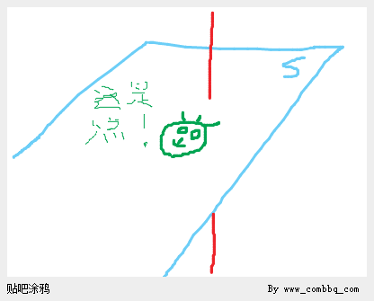

二维中的人认为，这个点是不会变的，可是我们如何能让这个点变化呢？

我们只要上下移动棍子就可以了。

好了，精彩的来了。

如果这个棍子是锥体，下窄上宽会怎么样呢？

那么二维的中的它（小强吧），就会觉得这个点怎么会自动变大变小啊。

不符合二维中【物质不能凭空产生】这个原理啊！

坑爹！灵异！

注意，更精彩的来了。

小强继续观察，它发现，这个点不是一个点，是另一个小强！

也就是说，这个棍子的横截面开始走向小强同类的形状。

而一开始的点状居然是小强受精卵的样子！

因为小强不是三维的，而是二维的，

所以小强看到新小强只能看到它横截面的轮廓！

这样，一个新小强的柱子在慢慢穿过二维平面的过程中。

我们的新小强从小而变大，从圆形而慢慢长出“面孔”。

新小强轮廓中的大脑平面的内容（神经元连接）也在发生变化，

只是这种变化相对轮廓的变化更激烈。

二维中小强的故事我们就讲到这里。

我们想象一下，如果有一天，三维中的一棵树，一个石头，突然变大。

我们是不是就可以理解了呢？

再想象一下，我们的老去，是不是也是一个四维中的棍子的缓慢下行呢？

我们的思想呢？是不是也是棍子中的纹理的变化呢？

现在我们终于到了量子纠缠的麻花藤的麻花疼版本：

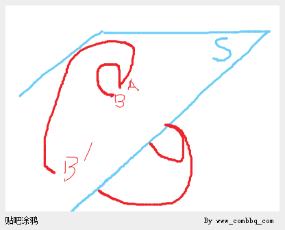

以二维中的符合纠缠态的两个点来说：

A点和B点在比较近的距离满足纠缠态的通信现象。

原因是因为它们是三维空间中的一个环，

这个环是藤子做的，被拧成麻花状。

当其中A点开始从S平面上方看去是【顺】时针转动的时候，

我们发现（小强们也发现了，它们很差异！），

我们的麻花藤之拧麻花会导致B点由于藤子的翻滚而在平面S中从上向下观察显示为【逆】时针转动！

这个时候，小强震惊了，它认为这是一种通信（确实是，不过没有那么神秘）。

小强爱因斯坦对小强波尔说，不可能！

我们的二维世界中没有东西比光快！

不信你移动到B'点试试看，通信现象绝对有时间延迟！

结果小强波尔就派自己的研究生的研究生做了个实验，

发现即使移动到了B'点，瞬时通信现象依旧存在：超光速！

小强爱因斯坦郁闷了，小强波尔虽然得意，但是也很困惑。

后来，小强ComBBQ说，这个事情吧，其实可能是因为维度的变化造成的【点】假象。

但是其他小强争辩到，它们无法理解，明明麻花藤的长度要超过二维平面的直线距离，

麻花藤自身传递麻花疼的速度怎么可能超过平面直线的光速呢？

小强ComBBQ说这事吧他也不是很清楚，毕竟他也没亲眼看看平面之外是怎么回事。

但是他画了一幅图，试图找到即使强调光速极限的情况下也可以适用的麻花藤解释（的一个版本）：

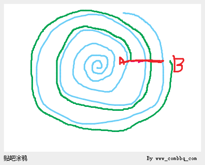

这个二维的蓝色平面S是被上帝收起来的画卷，画卷上的A、B两点之间在画卷【平面】上的距离是绿色的线的长度，但是A\-B之间的量子麻花藤之间传递麻花疼的距离却是A\-B两点【在三维】中的直线距离。

这样，麻花藤的麻花疼传递就可以超越了【二维中的光速】，但是不违背【三维中的光速】。

实际上，说我们的世界是上帝的画卷都是抬举我们自己了。我们可能就是上帝废纸篓里面的一团废纸罢了。

上帝当初搓揉得越狠，我们的纠缠态的瞬时性就越明显。

对于我们这个三维的宇宙来说，我们可能是和四维宇宙相连的。

就像我们可以与二维世界联系一样，四维世界也可能和我们有这样或者那样的联系。

比如我已经说过量子纠缠可能就是四维与三维联系的线索。

那么对于【上帝掷骰子】这件事如何看待呢？

因为如果一个东西超出了三维，受到了四维中风吹草动的影响。

我们就不可能只在三维世界中就可以完全掌握它的扰动规律，

所以量子物理找到的上帝掷骰子的现象可能又是和量子纠缠一样：

都是三维和四维宇宙的【沟通】现象，沟通就是【联系】。

而联系是普遍存在的——马克思。

## **穿越无限——哲学三大究极问题之空间无限性**

哲学三大基本问题：时间无限、空间无限、造物主无限。

以及牵线每层，进而指向最外层的那个问题：

绝对自由的精神还是绝对客观的物质？

今天我们来解决三大基本问题中的空间无限的问题。

但是其实我们只是解决了有限中的无限问题。

问题依然存在，我们只解决了一半，也许还不到一半。

## **橡皮条的故事**

首先，我们来考察一下一维宇宙里的两个智慧，小黑和小红：

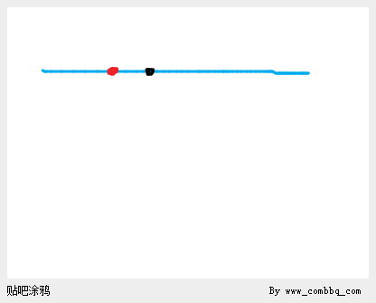

还是叫小红和小黑吧，顺口一点，有空谁研究研究【顺口】。

小红和小黑两个处对象了，它们处对象的方式比较奇怪。

因为它们两个知道自己不能交配，因为自己交配的结果是：

要么交配出来的孩纸都在小红那边。

要么交配出来的孩纸在它们中间，从此小红小黑就不能见面了。

所以它们两个决定：与其相爱，不如相忘于江湖。

它们两个分手，开始相背而去：

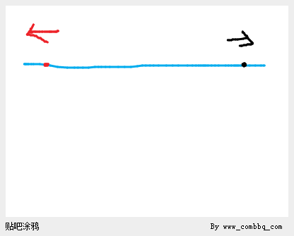

但是它们两个“家伙”身上分别带着两个纠缠着的的量子的其中一个：它们两个的心。

它们的心纠缠着，每次小黑想一遍小红，小红的脸就更红。

小红的脸越红，小黑就越喜欢小红。

小黑每秒钟想小红一次，这一间隔在它们一起的时候从来没有任何差错。

后来这一间隔开始变长……

小红猜，可能是距离，让爱情经受不住了时间的考验。

但是过了一段时间，小红感受到的小黑的心跳又开始变快了。

但是小红依然没有回头，她在等待小黑追上她。

小黑的心跳越来越快地传来，已经要接近一秒了！

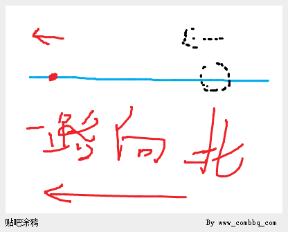

就在小红脸越来越红的时候，忽然之间，小黑出现在她【面前】！

跟确切地说，小黑出现在他【前面】！

可是小黑应该在小红【后面】！！！

难道这个不是小黑？是另一个小黑？

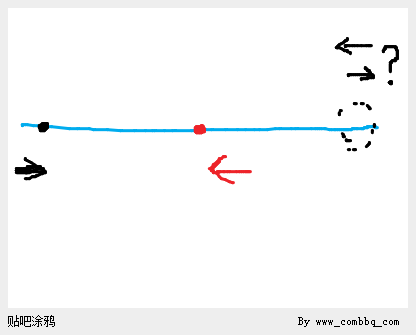

到底【面前】的小黑，或者说【前面】的小黑是不是小黑？

答案，面前的小黑就是小黑。

那么那渐渐靠近的心跳，是从面前小黑心里发出来的吗？

是的。

可是为什么……

你要问为什么小黑不是从【后面】出现，而是从【前面】出现了吗？

小红和小黑都对这个问题感到很奇怪~

电视机前的小朋友们，你能开动脑筋帮小红和小黑想出一个合乎逻辑的答案吗？

小鹿姐姐期待你的答案哦！

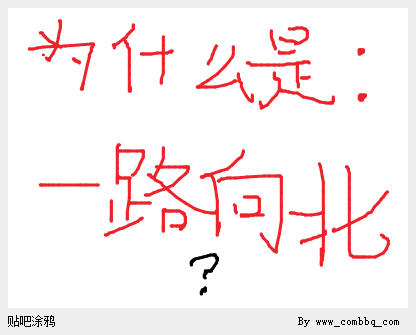

答：

也许小红真的不是在一路【向西】……

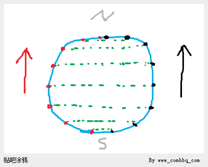

上北\(N\)

下南\(S\)

人生何处不相逢。

我曾经离你远去。

正是为了未来在对的时间与你相遇。

答应我，无论多远，我们依然能记住彼此曾经的心跳。

未完待续……

刚刚这个故事是小红和小黑的故事，它们生活在一维的世界中，

它们之间的量子纠缠是一根橡皮筋，它们两个是橡皮筋的两端。

所以这个故事又叫橡皮条的故事。

## **橡皮圈的故事**

话说有24个小强，它们一直生活在一个二维空间中。

它们每个家伙的心可以和另外两个固定的家伙形成量子纠缠。

这样，这群家伙正好形成了一个量子纠缠的闭合链条。

小强2可以每隔一秒钟感受到小强1和小强3的心跳，在它们在一起的时候，这个间隔从来没有发生过变化。

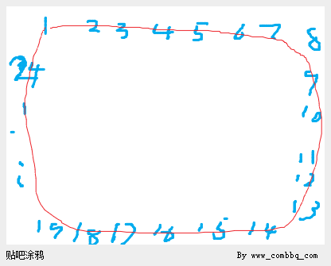

有一天一个小强说话了：咦，咱们心中的量子纠缠是不是任何距离都可以啊？

如果有一条量子纠缠的麻花藤连接了我们大家的心，那么麻花藤最长能多长呢？

2这个时候发话了：我觉得我们可以测试一下。

不妨大家都开始离开这个地方，然后看看到底到了多远，我们彼此之间的感应就没有了。

大家说好，然后就开始一起离开的它们的游乐园。

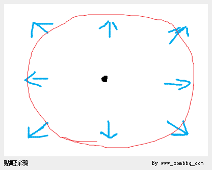

它们走啊走啊，彼此之间的距离越来远远，而相应地，感受到彼此心跳之间的间隔也越来越大……

小强们为这个发现而兴奋，它们觉得也许不日它们就可以听到不到彼此的心跳了。

终于有一天，心跳要24小时才能听到一次了。

然后从那一天，奇怪的是，尽管小强们依然在远离游乐园。

但是它们彼此之间的心跳却开始更快地传来……

终于有一天，小强2在走着的时候，看到小强1开始向他的路线交叉过来！

同时小强3也是这样！

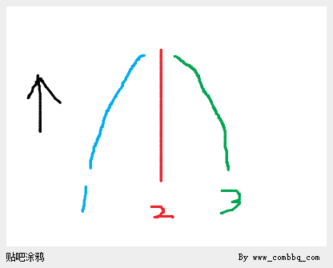

【大家】高喊着：你们怎么回事啊！不是说好要走直线远离游乐园的吗？

原来所有人都发现，自己边上的两个人都在和自己靠拢！

它们一时间想不过来这到底是什么一回事，但是它们走路画出来的线的的确确是直线！！！

这是怎么一回事呢？

电视机前聪明的你，能给小鹿姐姐想出一个合理的解释吗？

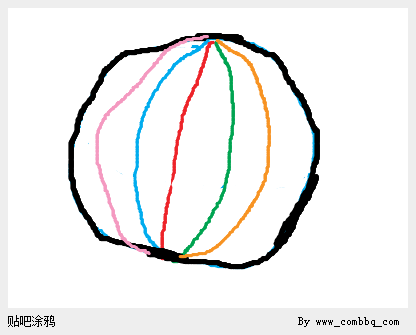

答：

小强们的二维世界是一个球面。

24个小强沿着24个经度线，从24个时区分别从一个极点走向了另一个轴对称的极点。

它们之间的量子纠缠环，从被慢慢撑大到慢慢收缩。

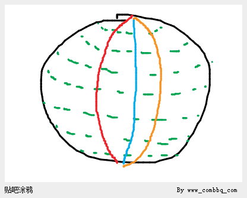

这就是橡皮圈的故事。

## **橡皮套的故事**

中科院终于实现了任意个数的量子纠缠技术。

这一项伟大的成果立即就被应用到人类有史以来最伟大的探寻工程上：探求宇宙的边界。

中科院立即制造了无数纠缠着的量子覆盖地球表面，然后以竖直方向射出地球。

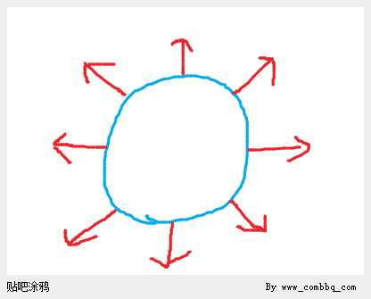

量子形成了一个大大的包裹地球以地球为中心的泡泡。

它们尽情地飞向了宇宙之中。

它们穿过了月球，穿过了太阳，穿向了宇宙深处……

它们形成的泡泡的球面的曲率也慢慢地变小。

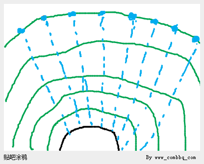

量子们知道，它们之间的曲率慢慢会变小。

但是有一天它们惊奇地发现：曲率为零了，也就是说它们这群量子形成了一个平面。

又过了一天，它们发现，它们之间的曲率又出现了，不过这一次变成了负数！！！

也就是说，曲面开始向着相反于地球的方向开始弯曲！！！

换句话说，再这样下去，它们终究有一天要撞到一起！！！

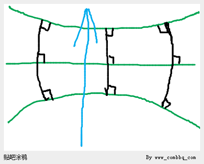

结果就是它们真的撞到了一起……

电视机前的小朋友，你能帮小鹿姐姐想出一个合理的解释吗？

答：

这说明我们的宇宙也是一个类似于圆环和圆球一样的【圆型体】。

不过这个圆型体是【四维空间】中的三维圆型体。

第三次，量子们组成了一个围绕地球的泡泡。

所以，这一次的故事又叫橡皮套的故事。

## **地球上人们的视觉体验**

**如果我们在四维空间中，而且我们的三维空间是一个圆型体。**

那么在地球上的每一点看来，天空中飞出去的量子球面本来是凹向地球的。

但是后来一刻，发现球面彻底平了，而且，关键是在地球上每一点向上观察，这个球面现在都是平的。

这是超出三维常识认识的，但是未必代表不会发生。

再后来地球上每一点的观察者都能看到量子球面开始向外凹的，直到地球上所有人在不同的位置都同时看到它们相撞到一起了。

## **圆型体中的平行**

现在让我们回到二维世界中来思考一下，平行在【二维球面世界】中意为着什么？

在二维世界的小强们开始平行的时候，就是它们达到赤道的时候。

这个时候，平行的经线，无论之间的距离宽还是窄，它们都相交在南极点。

同时也相交在了北极点。

这个时候，我们说：平行的直线相交于于无限远处。

而无限远就是左右两遍的极点。

我们走到了一个非常重要的位置：

在这里我们看到了平行，我们看到了两端极点的相交。

既然所有平行都是相交在所谓的无限远处，也就是极点处。

那么是不是所有的相交都是要经过平行，然后找到另一个和自己这个相交点，成轴对立的极点呢？

我们来看：

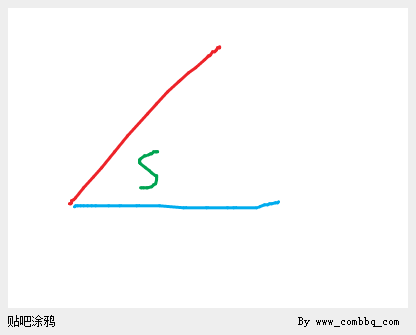

这是在二维球面中的任何两个相交的直线。

它们有几个张角呢？四个。

我们沿着一个张角看去：

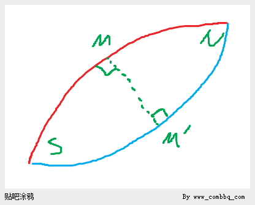

这个时候我们发现在∠S，通过两条射线NS，在MM'处平行（这个地方也是两个射线距离最大的位置），最终它们在∠M处再次交汇。

如果我们三维的宇宙也是一个所谓圆型体，那么我们地球上射出的任意两束光线，最终都会交汇，无论是分开的光线，还是平行的光线。

从图上可以看到，分开的光线显然要比平行的光线交点要远。

这样就引发我们思考一个问题，如何才能保证光线在最远点相交？

其实这个问题多虑了，对于一个圆球来说，两个射线永远只能在轴对称的位置再次相交。

但是我们可以看看射线相交的一个特例：两个射线的方向之间相差180度。

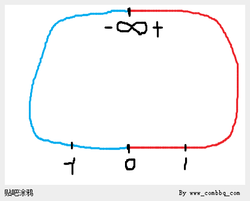

在二维球面上，在同一直线上相背而射出直线，比如数轴的正方向和负方向。

这个时候我们终于发现了秘密：正无穷和负无穷在无限远处相交成为同一个点，这个所谓的无限远就是球体上相对0点的远极点。

同样的，如果我们的三维宇宙也是标准的【圆型体】，

我们射出去的光线最终会从和它完全一致的方向的后面再射回来。

## **稠密空间**

什么叫稠密的空间，也就是空间的稠密性？

空间的稠密性是爱因斯坦的相对论和微分几何的基础。

相对论和微分几何认为我们的空间是光滑流形——空间无限可分，无限可微。（参见 梁灿彬 周彬《微分几何入门与广义相对论》）

最简单的一维的处处均匀的流形可以使用实数轴R来抽象。

实数的稠密性代表了任何两个实数之间都有无穷多个实数。

以下我们假设我们在稠密的空间中探讨问题。

### **使用圆型体解决shenchensh悖论**

这个时候，我们发现曾经的那个悖论就不再是悖论了 ：

《shenchensh发难：超级悖论 》

在这个悖论中，我们一直想不明白，为什么平行线的交点明明是要一直相交，如何又从左边变到了右边呢？

我们只要看懂平行时候的样子就可以了：

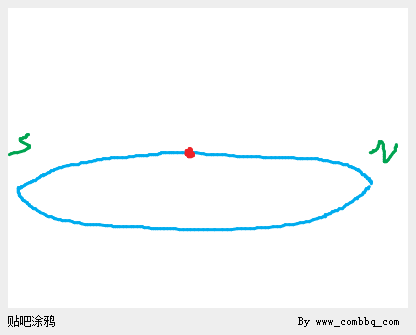

大家这样一看就明白了，我们在向左边转动上面的直线的过程，S点开始逐渐远离转轴。

N点开始逐渐靠近转轴。

如果我们把S点——交点看作是静止的，那么我们可以这样看：

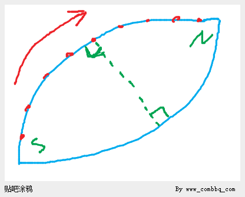

这样看来就是：

红点是转轴，上面的直线顺时针绕着转轴转动，也就是图中的红点不断地向N极点靠近的过程。

当然，假设S点静止的时候，∠S的大小是在变化的，从大变小，当红点到达平行位置的时候∠S最小，因为这个时候两个射线SN之间的平行弧线之间的距离最短。

之后∠S继续变大，最大的时候是转动直线和另一条静止直线垂直的时候，这个时候的平行弧线的球面最大纬度距离为四分之一赤道周长。

这个时候：

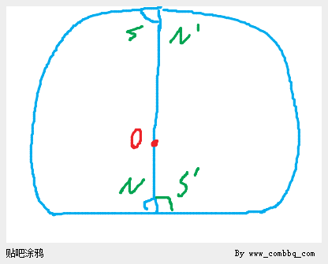

这个时候，∠N达到极大值90度，当然∠S也达到极大值90度。

而且非常有趣的是，按照我们只关注SN在近极点形成的角度中的锐角的原则。

只要越过90度，那么立马，S'将会代替S，成为被我们关注的S。

原来的S，进入了钝角状态。N也一样，N被N'替代。

或者说，在90度的时候，N和S'是同时存在的，都是90度。

### **稠密空间中的shenchensh悖论**

假设空间具有稠密性，那么shenchensh悖论戳中了哪里呢？

戳中了数学本身的问题。

数学本身有很多悖论，但就shenchensh这个悖论来说，他戳中的欧几里德几何学对空间是“平直、无限”的前提假设。

也有人说，shenchensh悖论的问题在于现实中光速是有限的，或者说现实中没有这样的无限长的直线的转动问题。

那么假设我有两根筷子，两根筷子的末端都有激光笔，我们转动其中的一根筷子。

问题是我的激光笔的光线的射线【传播路径】在转动的过程中如何分开了？

注意，我们不是问光线如何分开了。我们问的是，【传播路径】如何分开了？

如果宇宙是平直而无限的，那么光的【传播路径】应该永远也不会分开，这就是shenchensh悖论提出的问题。

路径，怎么分开了呢？推理的结果是路径永远应该相交，不会分开。从而后面的光子沿着笔端对应的路径传播出去，那么光子们的真实传播路径也【不会不相交】。

所以说如果时空具有稠密性，现实中不是找不出shenchensh悖论的实验环境。

如果时空具有稠密性，也就是时空无限可分，即转动可以转过任意小的角度，那么shenchensh悖论揭示的就是【空间是平直、无限的】这一命题的错误。

刚刚说激光笔，可能有人要问，如果【我们的宇宙】是平直的，但是不是无限的，那么不就没有激光笔的问题了吗？

比如：

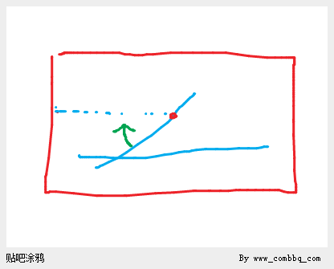

在红色方框中的宇宙，是有限的，但是是平直的，到了边界，也就没有了光的传播路径，进而没有了shenchensh悖论中描述的问题。

那么问题来了，在这样的平直的宇宙中，如果相交的要平行，虽然不要求光线继续传播了，也无所谓传播路径了。

但是相交的要平行，是不是要求【延长线】的相交的交点要消失呢？

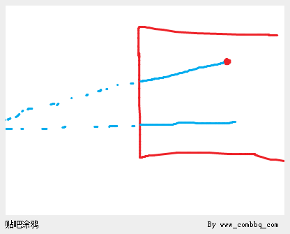

只要一想到延长线，我们发现shenchensh悖论依旧存在。

哪里出了问题了呢？

问题在这里：

问题在于我们依旧把我们的宇宙之外的空间想象成了【平直】空间，或者叫欧几里德空间。

事实上，shenchensh悖论要求如果空间稠密，那么欧式空间不可能占据整个平面，它的周围必须有非欧空间。

也就是说，延长线所在的空间，不能继续想象成欧式空间：

也许【我们的宇宙】不是圆型体，但是我们的宇宙不能平直无限。

或者说，即便外围其他宇宙依旧平直依旧稠密，但是一定有一层宇宙空间，是非欧空间。

这是shenchensh悖论导出的结论。

那样的一层非欧空间可能是什么样子的呢？圆型体。

### **圆型体空间的启示**

为什么不叫圆【形】体而叫圆型体呢？

因为我们的宇宙可能在形状上不是圆的，但是在本质上是圆的。

也就是说，一个一维空间的闭环，不管我如何搓揉它，它只要还是闭环，那么它就是圆型体，但是却未必是圆形的。

所以圆型体空间可能称为【圆型\-闭合】空间更合适。

那么，这一切的假设都是我们的宇宙是所谓的圆型—闭合的咯？

可以这样问自己，如果一维空间不是一个闭环会怎样？

一维空间的朋友会跑出来，一维空间中的光线会射出一维空间。

这样问题就麻烦了，因为一维空间如果是我们创造的，我们自然不会把它造成有缺陷的非闭合状态。

对于二维空间，平板一张，也是会有光线射出，会有小强跑出的。

对于三维空间，如果不是一个圆型闭合体，那么我们就可以进入四维空间。

**所以，我不认为非闭合的空间是稳定的。**

我猜想：

**空间的这种闭合性就像是电流或者电荷，会自动找到闭合，否则就无法被激发。**

也就是说，空间极有可能是一种场——单维或者多维场，这种场只有在符合圆满条件（圆型\-闭合）时候才能被激发，否则无法被激发，或者至少不能稳定存在——就像电场，必须形成闭合回路。

如果空间是一种像是电场一样，需要闭合才能被激发的场，那么无论多少维的空间，都是闭合的，里面的世界都是出不去的。

### **圆型体与天圆地方**

大家记得基督教最开始说地球是方形的，会有很多BUG，比如船到了边上就会掉下去。

但是事实上地球是【圆】的，解决了所有BUG。

如果宇宙是方形的，而且是稠密的，那么就会有《shenchensh发难：超级悖论》中提到的问题——BUG。

所以我们换个思路，宇宙是【圆】的。

不是三维中看到的圆，而是四维中的圆，那么很多BUG就迎刃而解了。

在圆型体中，我们可以走遍三位宇宙中的每一个点，但是我们就是找不到【门】在哪里。

就像在球面上一样，我们可以遍历球面上的每一个点。

但是，我们不知道二维的出口在哪里。

### **圆型体思想的来源**

是什么事情，促使我去思考圆型体的宇宙的呢？

是一个亲戚，有一天问我，你知道宇宙的中心在哪里吗？

我说不知道，他说，每一点都是宇宙的中心。

我说哦。

我接着说，那么你可以使用球面来打比方，因为球面上每一点都是球面空间的中心点。

然后我就在想，可不可能有三维的“球”，也就是今天我们讨论出来的圆型体，后来我就通过三个故事中的类比推理想出来了圆型体到底应该籍由有什么样的空间特征。

### **球面上直线都是经线**

有人认为球面上的纬度线之间是相互平行的，这个错误的根源在于以为非赤道纬度线为直线。

下面我们分别用对称法和反证法证明球面上的直线都是经线。

纬度线，除了赤道，都不是球面上的直线。

### **对称法证明：球面上的直线都是经线**

如图所示：

首先，我们在球中间有一个赤道。

其次，我们在穿过A点有一个和赤道平行的纬度线。

我们现在要论证，在二维球面上，这条纬度线不是直线。

过A点我们可以做出一条经线，这个经线过极点S和极点N：

接着，我们过A点，以此经线为轴，做出刚刚的纬度线的镜像对称：

我们命名这三条经过A点的线路：

现在，请给出一个理由，在A点出发的光线，为什么不是走中间的路线最长的、经过极点S的A\-S路线，而是走A\-B或者A\-B'？

也许这样更明显，我们加一个周长特别小的纬度线过A点：

如果从A到B是直线，那么从A到B’也就是直线了。

怎样能让经过A的左边那个小圆成为这个球面上从A点出发的“直线”，而不引起这样的矛盾呢？——凭什么从A点出发的【直线】走的是A\-B路线？而不是A\-B’路线呢？

在A点、在此处，A\-B和A\-B’是完全对称的，那么何以在此点选择B而不选择B'呢？

于是非赤道纬度线都不是直线。

证毕。

### **反证法证明：球面上的直线都是经线**

也许有人觉得对称法证明不是很靠谱、很落定。

我们使用反证法再证明一遍。

如下图，我们继续添加C和C'作为路径标记：

我们从A出发经过B点的纬度线经过C点回射回来了。

因为“直线”从C点射了回来，表示直线的路径闭合了，所以我们可以把光线的方向【直接】反过来，也就是依旧是从A点射出，但是这次是向着相反的方向射出。

如果从A点出发的纬度线是【直线】，也就是说从A点出发的光线的传播路径是ABC这个闭环的话，那么如果将光线的出射方向直接反过来，光线应该会经过先C，再到达B，最终返回A。

可是，我们发现了一个问题，如果从A到B，光线选择了从【右手】边走。

那么直接反过来光路的结果，应该还是右手边，不过，这个时候需要把图片反过来看，如下图：

我们发现了什么？

哦！卖糕的！

原来直接反过来同时选择右手边，那么通路就是应该是C’而不是C！

也就是说，如果纬度线是直线，那么光可以从和出射方向相反的180方向射回来，然后重新按照这个方向再射出去，但是如果直接把光路 “180度”反转，反而光路不再走原来的路径。

矛盾。

结论：

从A点出发的各种线，只有经历了和A点相对于球心对称的B点的那些“极大圆”——即经过A点和B点的经线——才是的球面上的直线。

在A点射出的任意光线A\-1,A\-2,A\-3,A\-4,A\-5,无论如何转动出射方向，只有经过对面极点并回射回来的才是直线，其他的都是曲线：

证毕。

### **圆型体与空间膨胀**

天文学告诉我们，我们宇宙的空间一直在膨胀，更确切地说空间一直在增多。

膨胀和增多不同，好比说爆米花，是米粒膨胀的结果，但是还是一把米。

但是如果在原有的一把米的基础上再增加一把米，那么再用膨胀这个词就容易让人误解成仍然是一把米只不过米粒变大了而已。

空间增多的结果就是即便两个粒子之间没有力的作用，如果它们相对于空间不动，那么它们之间的距离是在互相拉大的。

如果保持它们两个的距离不变，而中间用弹簧秤将它们两个相连，那么弹簧秤上会出现读数。

以上是现代天文学、宇宙学告诉我们的内容，更多信息请参考：

1. 斯坦福大学公开课：

Modern Physics: The Theoretical Minimum Einstein's Theory

讲师：Leonard Susskind

地址：[http://www\.verycd\.com/entries/745351/](http://www.verycd.com/entries/745351/)

1. 中国科学技术大学公开课:

《认识宇宙》

教授：向守平

地址：[http://v\.163\.com/special/cuvocw/renshiyuzhou\.html](http://v.163.com/special/cuvocw/renshiyuzhou.html)

以下对圆型体的讨论我们假设圆型体空间是稠密的。

我们来想象一下，如果在三维圆型体中某一点产生爆炸，那么所有的物质应该是以一种射线的方式出逃形成一个二维球面——也就是二维圆型体。

我们假设这些物质存在于这个二维的球面空间中，而不是三维的空间中。

开始的时候这个球面上的每一点都在和周围的点之间远离彼此。

但是这个球面通过相对于爆炸产生的奇点位置的三维圆型体的赤道位置的时候，会自然地从互相分离开始相互靠近。这是我们在《橡皮套的故事》中讲过的。

从而它们最终到达极点A的三维圆型体对称极点B，在极点B汇合，形成新的奇点。然后在极点B再次由于过于紧密而爆炸，于是所有一切物质和空间再次从极点B出发，但这一次的目标是极点A。

这是一个往复的过程。

那么如果我们的宇宙是三维稠密圆型体的宇宙，但是我们这个三维的宇宙实际上是在四维稠密圆型体空间中运动的话，情况又是什么样的呢？

在四维圆型体中，我们这个三维的圆型体包裹住了四维圆型体的一个极点，在那一点爆炸，然后开始膨胀，从此三维世界中的一切都会自然而然地想要分开——空间开始增多。

也就是说我们整个三维圆型体宇宙都是在从一个四维圆型体的极点，运动到另一个四维圆型体的极点的过程中。

这样的话，有一天空间的膨胀会变成空间的收缩。

而膨胀和收缩造成的粒子们的分开和聚拢却不是力的作用，而是圆型体空间变化后自然的结果。

也就是说，让空间增加，让彼此分离的不是斥力，是惯性的效果。

也就是说，即便是所有粒子都静止在我们的三维空间中，没有任何已知的力的作用，粒子们在三维圆型体从四维圆型体的一个极点到另一个极点的运动过程中还是会分开。因为，那就像是它们最终会合拢一样，这是圆型体的在更高维度的空间中从一个极点到另一个极点的膨胀和收缩过程本身导致的。

## **非稠密空间**

什么是非稠密空间呢？

也就是我们在《芝诺悖论》中提出来的，运动—时空离散的空间。

### **直线的独立性、相对性、本地性、假象性原理**

直线的独立性、相对性、本地性、假象性原理，其实是一个原理。

在一维空间的圆环中，我们可以从A点出发再回到A点，只要我们走的是直线——一维空间中的直线。

虽然这个路径在二维和更高维度中可能不是直线，而是弯曲的——比如，环状的。

所以在二维和更高纬度中任意曲线的闭环在一维空间本身中去查看，根本就没有任何差别——它们依旧都是直线。

因为：只缘身在此山中。

对于二维空间的球面也是一样，我们可以随意把这个球搓揉成一团，

也不影响其中的匀速直线运动按照吹得鼓鼓得一般的球体上的经线方式来行走出二维空间中的直线。

所以我们的三维宇宙无论怎么被上帝搓揉，都不会影响我们在其中的运动路径。

所有三维空间中的运动，搓揉之前和搓揉之后都按照既定的路线继续运动。

不会因为【空间在高维中】扭曲而改变到达的目的地，因为目的地也已经被搓揉到了应该在的地方。

所以说，直线都是相对的直线。

也就是说，无论我们的空间在更高维度中被如何搓揉，我们都能在这一空间中走出和没搓揉前一样的路线。

这就是低维空间中直线的独立性原理：

**低维中的直线路径不以高维中此路径的表现形态而影响此路径在低维空间中的直线性。**

低维中的曲线同理，因为曲线可以以微分的方式去看为无数条笔直的小小线段。

这些小小的线段可以看作每段都是从一点A到另一点B的直线，无论高维如何搓揉，从【原来的A】到【该到的B】这一属性都是没有变的。

直线的独立性原理，毋宁说是直线的假象性——没有绝对的直线，只有相对的直线。

### **图解直线的独立性原理**

假设一张薄膜，其上有六个【因果点】。

第一束光，从0经过1到2。

第二束光，光再从3经过4到5。

这是二维中可以察觉的逻辑。

假设我在三维中，对薄膜做了扭曲：

扭曲的效果是使得薄膜的点【在三维中看起来】是042，315这样。

但是二维中的智慧可以察觉到这种扭曲吗？

不可以，因为，光在二维中的传播逻辑没有改变，依旧是从0到1到2（蓝色箭头）。

另一束一就是从3到4到5（土黄色箭头）。

所以，直线的本地性原理讲的是：

在我们自己的维度中，我们所相信的空间【不变】的基础来源是光在这些因果点上的传播路径不变——比如上例中的从0到1到2——即便这些点在更高的维度中被改变了之间的相对位置。

光在这些点上的行为不变（入射点0到达本点1之后，必然出射点是2），那么在低维中的智慧就不会，也无法觉察到它们在高维中正在发生的变化——即高维中的扭曲低维中不可察觉。

对于一维的一个空间，如果我在外部，三维的角度，把它在某两个点之间拉长，但是不是拉断。

那么光波，经过这个点的时候，【我们】会发现，光波被拉长了。

但是一维中的光波，会觉察到吗？

不会，为什么呢？

因为时空不连续，所以光的运动在本质上也是不连续的，确切说就是最最微观的角度，可以看到光子的传播，是由一个【因】引发下一个【果】，下一个【果】再作为【因】，引发下下一个【果】。

这个说法比较抽象。

因和果都是因果点，假设之间的距离被拉大，那么作为一维中的光，对它来说是没有区别的，因为它关心的是上一个因果点作为【因】是不是能激发下一个因果点作为【果】。

但是在我们看来，可以看到由于拉伸了一维空间，而造成的这样一个波长增大的结果。

用我们空间中的光来测，会发现，一维中的【因】和【果】之间距离大了，比如可能可以再放一个因果点进去。

如果不是距离变大，而是折了一维空间，那么对于一维空间中的光有什么影响？

没有影响，它依旧在弯折处只关心运动在因果点之间的继起。

那么在三维空间中，如果拉大了二维平面上一条直线上的两点之间的距离。

在二维中，能被我觉察到吗？

第一中情况，均匀被拉大：

图中红色代表上述的因果点。

下面的蓝色是“尺子”，我们会发现，刻度之间也被拉大了。

如果这个刻度是观察者的眼睛，那么结果就是由于我们的眼睛对应着被拉大，视网膜上的细胞对应着被移动到了应该移动到的位置。

结果就是我们“看不到”自己所在的二维空间的畸变，但是在三维中我们可以观察到。

因为在二维中，我们是“身”在此山中的。

更确切地说是【尺】在此山中的。

第二种情况：

这种情况，你会发现，你的尺子没有被在三维中拉大，只是光的传播路径上有两点之间的空间（在三维中看起来）被拉大了。

但是问题是在你的测试仪器\-\-尺子看来，它依旧无法测试到这种被拉大的效果。

为什么呢？

因为在这种最微观的角度，和我们宏观分析问题完全不同。

我们应该把光在微观到我所说的因果点层面的时候的传播行为想象成这样的图示：

整个传播路径是离散化的，像是一张网。

物质的运动的因果点传播是在节点之间跳跃传播。

如果有部分空间在高维度被扭曲，比如拉伸，那么会怎样呢？

如图：

确实在更高维看起来被拉伸了，但是在低维，在那把蓝色的尺子看来。

3、4两个点之间的距离，依旧只是从3到4而已，3和4之间不会再多出一个整数来。

但是在更高维度看来，3和4之间，已经被拉伸，是可以再放入一个承载运动的因果点的。

也就是3、4之间还有一个整数。

这就是直线的本地性原理的原理。

也就是说，二维的智慧，根本无从知道自己的二维空间在三维空间中观察会看到什么曲率。

所以我们可以尽情地揉搓二维空间，但是其中的智慧依旧会按照在延展好的平面上一般地运动无误。

光线依旧会按照二维空间中的直线路径，到达它该到达的地方。

那么怎么比较直观地去理解这件事情呢？

我觉得可以这么理解，二维智慧之所以不知道、无法知道、无法察觉自己二维空间在三维中的变化。

原因在于它们根本没有觉察第三维的可能，除了使用前述的量子纠缠的方式。

如果仅仅是局限在二维中，如果仅仅是使用二维中的光的传播来做尺子，而不是使用三维（高维）空间中的量子纠缠手段，那么根本无法觉察自己所在空间在高维中的形态。

### **“直”是错觉**

如何理解低维中的我们察觉不到我们的空间在高维空间中是扭曲的？

我们在初中都学过折射：

折射一个很重要的特点就是我们会看到虚像。

也就是说，我们看到了筷子向上弯折的样子。

如果那个我们想触碰那个黑点，沿着直线出去，我们是触碰不到的。

我们会触碰到虚线指向的方向，那个位置再向下就是黑点真实的位置。

请注意，如果，折射不仅仅是光线的，同时也是物质运动的。

也就是说，在我的手经过水面的时候，我的手的运动也开始被弯折，而且弯折到和水下的光路同一个路径上。

那么，我就真的能够抓到真实的黑点。

同时！我还真就不知道我的胳膊被弯折了，为什么呢？

因为从视觉上说，我的胳膊发出的光，同样被折射，如同黑点一般，然后我在水面看到了胳膊的虚像，好像胳膊还是在直线上一样。

那么，如果空间中有这样一个水面存在，我们如何能够知道它存在呢？

我们如何知道我们前面一米之后的空间，不是这样一个能够发生光线和运动双折射的空间平面呢？

其实这就是空间扭曲。

空间扭曲就是对光的传播路径和其他物质的运动路径一齐扭曲，从而使得其中的人们无从察觉这种扭曲的存在。如图：

所以，“直”是错觉。

### **非稠密空间中的shenchensh悖论**

在《芝诺悖论》中我们认为芝诺悖论——飞矢不动揭示的是运动—时空的离散性,我们当时考察的是直线运动。

那么shenchensh悖论会不会是揭示了转动的不连续性呢？

如果转动是不连续的，我们就会有一种疑问：

物质运动所在的因果点是如何排列的?

如果是如下图一般，一个因果点周围有8个因果点，那么岂不是运动只有八个方向？转动也只有八个方向？

再比如，对于下图，以最下端为转轴的转动如何才能到达顶部中间的因果点？

解法之一：

一次因果点运动所涉及的两个因果点之间有其他因果点。

有多少个？很多个。

也就是说一次因果点运动所涉及的两个因果点并非紧邻的。

如果转动是离散，最终光线的转动也会出现可观察的离散效果，如下图：

但是由于因果点尺度之小，人类要觉察转动的这种细微的离散化，最终需要的空间尺度，就留给大家想象吧。

shenchensh上次提到把两条直线的交点看作是转轴在下面一条直线上的影子，我这里借鉴一下这个概念。

如果光线的转动是离散化的，那么两束光线从垂直到平行的过程中转轴的影子也将是离散化地在下面的那条直线上运动的，如图：

从上图中大家可以看到，因为转动离散化的原因，光线在转动的过程中，不可避免地，造成了0\-1\-2\-3\-……N……之间的距离不断拉大，最终，在所谓的平行——可能真心永远无法完全平行——的时候，我们转轴的影子遭遇到了永远触及不到的直线的无限的部分，如下图：

上图中右上角的黑点是转轴，蓝色的两条实线是光线，绿色代表转动方向，土黄点代表不连续转动的交点。粉色NA段代表最终无限长的，不能被离散转动所触及的射线段。

我们可以看到，到最后一个影子的时候，转动的直线就仅差一个离散角度就可以并到平行虚线上去了。

于是，如果芝诺悖论否定了直线运动的连续性，那么shenchensh悖论就否定了转角运动的连续性。

### **命题：运动—时空离散的圆型体中的射线最终必将闭合**

假设我们的宇宙同时是圆型体且其中的运动—时空是离散化的。

那么我们可以得到一个结论，就是一个光线射出之后，最终它会闭合。

也就是说任何一条直线路径都是一个闭合路径，即便不是一条经线。

### **证明：运动—时空离散的圆型体中的射线最终必将闭合**

证明：

所有从Ｓ极点出发的射线，最终相交于Ｎ极点。

那么射线从Ｎ极点出发的时候，必然选择了某一条从Ｓ极点过来的射线的同线路、反方向的路径，从而射线会回到S点。

因为shenchensh悖论揭示了转动的不连续性，亦即S点出射或者说入射的线路是有限个方向。于是，无论下一次入射S的时候是否与之前出射S的时候的某次是同一路径。射线最终必然会重合上自己曾经的【某条】出射射线的路径。

因为假设不重合，那么每次都要从S点的n条有限的线路中选出一条新的线路，但是S点只有n条线路，最多n次之后必然要重合。

既然能够重合到【某条】之上，那么必然是第一条，因为如果不是第一条，假设重合到了第二条上，我们只需要把第二条的方向作为第一次的出射方向，那么就会导致这一次在第三条上重合，从而与第二条出射的光线与第二条最终重合矛盾。于是光线如果最终在S点跟某条曾经的出射路径重合，那么那条曾经的出射路径必然是第一条路径。

证毕。

## **对芝诺悖论和shenchensh悖论的总结**

形式化的反证法告诉我们：

结论中的矛盾，可能是任何一个前提需要被否定。（请参见 邢涛涛《数理逻辑》）

而这些前提，我们甚至可能都不知道它们实际是存在的——比如空间稠密性其实就是一种先验假设，可是很少有人意识到它是我们很多推理的前提。

除了空间的稠密性，我们对空间的前提假设还有平直、无限以及勾三股四弦五。这些都是欧几里德几何对空间的前提假设。

如果籍由这些假设产生了矛盾，那么反证法告诉我们，形式上我们可以否定其中的任何一个前提。

比如我们可以否定空间的平直、无限，从而利用圆型体的概念解决了shenchensh悖论。

比如我们可以否定空间的稠密性，从而利用转动不连续解决了shenchensh悖论。

于是，如果我们认可了运动—时空不连续，那么圆型体的宇宙就不是必须的了。

也就是说，shenchensh悖论否定的究竟是哪个前提呢？

1\. 时空稠密？

2\. 时空平直？

3\. 空间无限？

4\. 勾三股四弦五？

5\. 其他我们没有意识到的前提？

结合芝诺悖论对直线运动—时空离散性的支持，我认为是时空稠密性被否定了。

而时空稠密性也是爱因斯坦相对论和微分几何的基础。

于是不需要做什么现实的实验——比如量子力学，仅通过逻辑推理我们就可以挑战相对论的理论基础，而相对论的发现不也是通过推理——思想实验而来的吗？

# **数学 哲学**

## **一是祸害？**

根二这个数字在现实中根本就不存在，原因是如果现实中的直线是不连续的，那么任何一个直角三角形的斜边我们都应该将其看成是有限个（可能对人类来说很多个）因果点构成的。

所以，不要随便把任何长度都当成是单位一来处理，这样会出现根二这种和现实根本就不搭调的东西。

我们发现，算术系统天然就会导致对单位一的运用。

因为什么是一？一本身就是抽象的，我们有时候把一只铅笔叫做一，但有时候我们又把一袋苹果叫做一。

可事实上一袋苹果里面有5个苹果。

所以我们就可以把5个当作1，从而15个代表的不是15而是3。

于是，我们发现算术系统，由于其抽象性是为了给思维带来便利，天然地就会引入对一的“滥用”，从而导致小数出现，比如1/5。

进一步导致无理数——比如根二的出现。

那么问题是：我们是不是应该禁止滥用单位一？

不。

我们使用单位一，或者说使用抽象的一的目的就是为了给思维带来便利性。

虽然这种便利同时会导致思维的结果和现实之间出现矛盾。

但是我们不能就此否认单位一这种思维上创新的给人类带来的益处。

也就是说，事物要一分为二的看：抽象是一把双刃剑，关键是舞剑的我们如何使用和鉴辨。

## **数学系统的两种矛盾**

数学系统可能遇到两种矛盾，第一种是系统内部的矛盾，比如通过公理和推演规则，结果推出了P和非P在系统中同时成立。

还有一种矛盾，不是系统内部的矛盾，是和客观现实之间的矛盾。

比如欧式几何（其中暗含空间稠密性），推出了shenchensh悖论中的结果——相交直线无法转动到平行。

其实这个结果不是和欧式几何的其他结论相矛盾，而是和我们的客观现实相矛盾。

所以绝不能【就此】说欧式几何自身存在矛盾，而要说欧式几何和客观现实之间存在矛盾。

那么欧式几何和客观现实之间有矛盾是不是就要放弃欧式几何呢？

显然，欧式几何对于我们来说是不能放弃的。

其实空间稠密性恰恰是我们的思维在思考几何问题所需要的，是一种创造性的、超现实的思维发挥。

但是在数学系统中引入这种创造性的、超现实的发挥必将导致数学系统和客观现实之间的矛盾。

形式化地看，这种矛盾是这样来的：

假设客观中有条件A，则而我们为了思维的便捷引入了非A。

那么对于任意使用了A作为条件而得到的结论Z，在非A的情况下应得到非Z。

从而在不考虑条件A而只考虑其他条件比如B、C、D的时候，我们发现了所谓悖论——即现实为Z而数学系统推演出的结果为非Z。

如果我们意识到存在条件A，那么我们还能找到问题出在哪里，如果我们没有意识到条件A实际上是那个被否定的条件，我们就会感到难解。

运动—时空的不连续性之于芝诺悖论和shenchensh悖论就是这样的条件A，而空间稠密性就是它们的非A。能任意转动就是Z，不能转动就是非Z。

## **自然也在做推理**

自然的过程其实也是推理的过程，只是人的思维中的推理是自然运动—推理过程的人类思维化的抽象。

我们以为自然依赖ABCD推出了P。

可是事实上，我们是误以为自然依赖ABCD推出了P。

也就是说，如果自然真的是A，那么我们其实有时候在假设非A。

于是，其实自然的运动过程，可以看成是推演的一支，从而得到P。

而我们的思维可以看成是推演的另一支，从而得到非P。

于是，我们可以把这两支的推演结果看成是【经典命题逻辑推演】中的【矛盾】。

这样的矛盾，暗示了我们应该否定我们某个前提。

其实也是暗示了前提中的【元前提】之间有A和非A的情况出现。

## **任何事物的存在和发展都将导致自身对立面和否定面的存在和发展**

**任何事物的存在和发展都将导致自身对立面和否定面的存在和发展。**

有速度的世界是力和质量对抗的世界，没有力和质量的对抗，这个世界就不存在了。因为如果没有质量对运动的拖累，任何一个力都会使得物质瞬间到达最远的无限，从而这个世界甚至连一秒可能都存在不下去。

**任何事物的某方面的【过度】发展，都会导致对事物自身发展的【抑制】。**

比如我们为了增加产出量追求效率，过度追求效率，导致差错率增加，会导致成本上升。

比如我们为了降低次品率追求严格，过度追求严格，会导致效率下降，从而也导致成本上升。

为什么这个世界充满矛盾？我想这个问题的回答可以是多方面的，比如从进化论的角度来说，没有矛盾的世界已经灰飞烟灭了。所以存在着的世界结果发现是必须具有矛盾的。

又可以从因果论的角度去回答，比如可能世界充满矛盾归根结底的机制是因为这个世界本身来源于阴阳对立，也就是说道本身就是籍由阴阳生发出了这个世界，【或许】从此矛盾就会必然到处存在了。

## **悖论是数学理念世界不可或缺的一部分**

关于理念世界我们在《意识》那一章已经讨论过了。

我们知道了，运动—时空是不连续的，从而我们对任何客观存在的任何图形的任何边进行考察的时候，我们都不应该用实数来度量，应该用自然数来计数。

那么我们就来看看，到底这些悖论在历史上是如何产生的。

悖论产生的过程：从自然数到实数，这个过程是单位一的运用导致的。再从实数稠密性引发芝诺悖论和shenchensh悖论。

什么叫单位一的运用？就是把一段明明是N个点组成的线段，看作是1，然后使用1参与之后的计算。比如等腰三角形直角边是1，斜边就是根2——这个现实中根本不存在的数字。对单位一的运用就暗含着对连续—无限可分的承认。

单位一思维方式的引入给人类的思考带来了便捷性，所以我们不应该完全否认它的价值。

我们应该做的是，接受数学系统中的悖论。

因为这是我们创造性的思维方式（比如单位一思想）造成的后果之一。

我们需要创造性的/超现实的思维方式，因为它们会给我们带来便利，但随着它们的引入而给数学系统带来的悖论，我们应该坦然面对。

如果仅仅使用自然数，而不使用单位一和随后的稠密的实数系统，我们纵然可以避开很多悖论，然而恐怕我们也避开了更多有用的结论。

**任何事物的存在和发展都将导致自身对立面和否定面的存在和发展。**

数学系统中人类所需要的正面部分的发展，导致了反面的悖论的产生和发展。

发展是我们需要的，于是我们不得不接受悖论，这没有什么丢脸的。

悖论作为反面，其存在和发展恰恰证明其对应的正面的数学的存在和发展。

## **任何事物都有其正面意义和反面意义**

对于反面意义的受害者，它们尝试去否定这个事物。

事物被否定之后，其反面意义的受害者将会受益于这种否定。

但是事物被否定后，其正面意义的受益者就成了这种否定的受害者。

比如稠密性。

没有它之前，有些问题，在离散—非光滑的情况之下很难求解，这些问题此时是受害者。

通过对离散—非光滑的否定，引入了稠密性和光滑，之前的那些受害者畅游在微积分和极限的海洋中，非常享受，成了受益者。

但是芝诺悖论和shenchensh悖论此时就成了受害者，原来在离散—光滑的情况下，它们可是受益者，正如在本书中一样。

**人类社会亦是如此。**

“曾相信过正义，后来知道，原来完全可以同时存在两种正义，而且彼此抵触，水火不容，选择其中之一，正义同时就意味着不正义。你绝对看不出，某些人在某一个特定时机热烈主张的某一种特定的正义，其中隐藏着深不可测的不正义。” —— 龙应台《不相信》南方周末

# **生命**

## **细胞分化原理**

细胞究竟是如何在分化彼此“沟通”的？

也就是说同一个受精卵分裂而出的两个细胞，为什么一个知道自己将来应该发育成心脏，而另一个知道自己将来应该发育成肝脏？

这个问题曾经和意识问题一样深深地困扰着我。

巧合的是这个问题我也是从信息的视角去探索的。

我们假设有这样两个从同一个细胞分裂而来的细胞：

假设我们在分裂它们的时候把NS两个极点分给它们两个：

然后这两个细胞分别发生了一次分裂，但是这两次分裂同样发生了NS的分配。

于是我们得到了：

我们可以不要1、2下标，只使用位置表示下标，因为下标为1的字母总是从左到右的第一个字母，而下标为2的字母可以看作是第二个字母。于是我们得到：

这个时候我们发现，NN、NS、SN、NS如果被当作是从左到右的【有向信息带】的话，它们那么就编码了四种不同的信息。

也就是说，此时由于四个细胞之中，存在这样四个不同的【信息带】，所以此时四个细胞其实并不完全相同。

这四个有向信息带就可以编码细胞的分化信息。

那么对于人体“天量”的细胞如何做呢？

答案你肯定已经想到了：继续分裂。

比如再分裂一次就可以得到8个细胞，8个有向信息带，从而8个细胞可以向着八个不同的方向分化，八个信息带只需要3个N—S槽位。

细胞进行分裂的时候，可以使用这种【N—S有向信息带】方式来互相约定各自后代承担的分化责任。

如果我们把N约定为1，S约定为0。

我们就得到了：01，10，11，00这样的二进制串。

从而所谓的N—S有向信息带，也就成了二进制串。

如果我们把1约定为阳，把0约定为阴。

那么我们就得到了：阴阴、阳阳、阴阳、阳阴这样的阴阳串。

如果我们约定阴为\- \-，把阳约定为—。

那么我们就得到了：干、坤、坎、离、震、艮、巽、兑这些卦象。

如果我们把分裂过程和其中的N—S分配过程看作是产生阴阳串的太极运动。

那么我们就得到了：

太极生两仪，两仪生四象，四象生八卦。

## **永续与永生：生命与个体精神的对立**

生命的追求和人的追求是不同的。

生命的追求是延续。

人的追求是个体精神的永生。

生命的延续可以用繁殖完成，个体的永生至少现在还难以完成。

当我们区分了生命（DNA中信息）和个体追求的不同的之后，我们还需要明确一件事情，就是个体的本质是自我意识。

个体的永生的根本要求其实是个体精神的永存。

简单来说，曾经有人设想，把身体的外部感官都接入高度仿真的电脑模拟环境，让人脑进入完全真实的虚拟环境。

现在给你一个选择，让你选择：

1\. 活完真实的生命，可以通过繁殖延续生命，但是你要死去。

2\. 贡献出来你的身体，不进行任何生命延续。但是让你的大脑在这种完全真实的电脑仿真环境中【永远地】活着，和真实的生命体验没有任何区别，甚至还会更“爽”，你懂的。

你选择哪个？

我想，你的自我意识会选择第二个。

这就是生命和意识的分道扬镳，这就是自我意识对生命的背叛。

# **后记** 

## **那些我们以为存在过的事物真的存在过吗？**

比如你觉得自己是一直活着的。

可是事实上这个宇宙可能上一秒才被按照上一秒应该是的样子构造出来——也就是说，上一秒所有的分子原子质子电子中微子才被安排到它们上一秒应该在的位置，然后就此开始运动。

也就是说，那些多少亿年的历史，其实可能根本就没有真的发生过。

于是你和这个世界都只是从上一秒才开始被推演。

这种想法可以否认你存在过的分分秒秒，一直否认到上一刻，也就是上一个上帝秒，也就是说上一个上帝秒之中的你可能都是不存在的。

你只是从这一个上帝秒才开始“存在”。

## **芝诺悖论、shenchensh悖论、勾三股四弦五、量子纠缠它们暗示了什么？**

芝诺悖论说明运动—时空是不连续，也就是说空间稠密性作为一种先验假设是错误的，或者说用实数来抽象一条现实世界中的直线路径是错误的，因为现实中的路径都是离散的。

shenchensh悖论从转动的角度支持了运动—时空离散的观点。

而从我们人类已有的实践角度出发，我们知道，计算机中推演着的运动—时空是离散的，因为计算机表示的精度总是有限的。

勾三股四弦五，为什么不是弦六？

这种“安排”会不会是算法的规定？

量子纠缠响应如果需要时间，那么这暗示了三维空间和更高维度空间之间的联系。

如果量子纠缠响应不需要时间，也就是说是真正的瞬时的，那么这暗示了我们宇宙是运行中的程序，因为算法可以轻松实现瞬时动作——不过就是在一次上帝秒中，也就是从一帧到下一帧的推演中，同步两个粒子的状态罢了。

如果我们的运动—时空既然是离散的，那么在这些因果点之外的空间是什么样子的呢？

这个问题可能和罗素悖论的答案一样，也就是说我们回答这个问题之前，应该先检查这个问题是否具有可回答性，也就是说这个问题到底是不是一个合法的问题，然后我们才能把它当作一个问题来回答。

为什么“因果点之外的空间”这个提法可能不合法呢？

因为因果点之外的空间的我们还是要找到其中的比我们的因果点更细密的因果点，这样就成了一个无限的过程。

如果因果点之外的空间这个问题不是一个合法问题——即因果点之外根本就没有空间，也就是说空间只单单是构成我们的宇宙空间的这些孤独的因果点，那么这些因果点如果不是存在在“外部空间”中，那么是存在在哪里呢？

这个问题暗示了空间可能根本就不【实】在，也就是说因果点可能不是实在的。而什么样空间是不【实】在的呢？

计算机推演中的虚拟空间——于是空间之外无空间，时间——上帝秒，之外就是上帝那里的时间。

如果我们这个宇宙是被推演的，那么推演之中就只有信息。

这种推演出的存在们的信息可能代表曾经的一种存在、未来的一种存在某处的一种存在、假设的一种存在。

但是，这些信息本身对于推演者来说却不是实在的。

也就是说，所有存在的信息都可以被推演出来，但是存在是不能被推演出来的，或者说推演并没有产生存在本身，推演产生的都是关于存在的信息。

这个推演之中虽然没有存在而只有存在的信息，但若意识来源于物质的运动，那么依旧不能排除这个推演可以在其中产生智慧，也就是具备自我意识的个体。

这些信息的运动变化过程，对于在这个世界之中的“我”这个意识来说，可以形成世界存在感，尽管这世界存在感从本质上来说是一种错觉。

意识作为一种信息处理系统，它的运行和存在不必时时刻刻都在世界之中的某个时间上同一的存在中。也就是说，意识不依附于【某一个】信号表示和处理系统。

比如说计算机中的一个人工智能程序，这一刻在第一台计算机中运行，下一刻被传输到了另一台计算机中运行，再下一刻又被传输到了第一台计算机中运行，这样倒腾来倒腾去的过程只要足够快，那么就像它始终是在同一台计算机中运行一样——根本原因是信号的对立也就是信息被完整无误地延续，信息的不变性来源于信号序列对立的pattern不变，而跟pattern的具体承载物无关。

**既然意识作为信息处理系统是可以不依附于某一个具体的信号处理系统的，从而意识无论从何而来，都和其他意识是平等的。**

**这是一个伦理问题——我们推演出来的意识和我们是平等的，我们和推演我们的意识之间也是平等的。**

作为一个推演粒子道的程序，有可能在其中产生具备意识的个体，而其中的意识认为自己生活在一个真实的世界中。

**但世界不过那个意识的错觉。**

## **人之初，性本善——道生一，一生二，二生三，三生万物**

宫叔叔病了，胃癌晚期。

昨天去看他，结果我人到了楼下，120救护车也到了楼下。

本来是怕他病中无聊，想带去自己的网站，

让他在癌症晚期的最后时间可以看看后辈们终于不算浑浑噩噩，一无是处。

结果只看了一眼病容就让120带走了。

我没有去陪，我怕我的刚健中正冲了他此时无比虚弱的生命。

夜11点，叔叔走了。

胃癌晚期。

人，万物之灵，不过也是发轫于大地，大地发轫于宇宙。

这世间万物之基础的物质和规律，在如此漫长的时间中，

居然衍生出了能够反思和认识自己的内容和结构的智慧们。

这些智慧甚至已经开始按照自己对宇宙的理解和自己存在的需要。

开始实践和改变着宇宙。

宇宙还是宇宙，只是运动让宇宙不再是原来的宇宙。

也许有一天，我们的宇宙充满了智慧，而且智慧不死。

这时候我们发现现在智慧是与旧的宇宙对立，认为自己不是宇宙的一部分。

而当智慧充满宇宙的时候，我们会发现原来我们就是新的宇宙。

人之初，乃生命。

生命之初乃原生。

原生之初乃CHON。

CHON之初乃原子，质子电子中微子……

乃宇宙，乃道。

道生一，一生二，二生三，三生万物。

人之初，性本善，不在人活着的时候被发现。

只有回归大地，回归天地之间，回归宇宙之后。

我们才会发现，原来真正的人之初就是道。

道即是善，人之无论善恶不过是道之生，宇宙之轮回。

一路走好，宫叔叔。

## **中国而今有圣人**

推背图中的中国的圣人不是哪一个人，也不是哪两个人。

因为如果只有那么两个人，恐怕事难成。

中国今日的圣人是每一个有圣魂的人，是每一个不相信自己必须要跟随时代堕落的人，是每一个用信仰和能力努力托举新时代的人。

日月丽天，群阴慑服，象已现，道不远。

# **参考文献、资料**

- 邢涛涛

《数理逻辑》ISBN 978\-7\-301\-11255\-7 / B \. 0385

- 王国忠 郑延惠

《新编十万个为什么（数学卷）》ISBN：7\-80565\-555\-3

- 赵敦华

《西方哲学史》ISBN 978\-7\-301\-20762\-8 / B \. 1046

- 北京大学哲学系外国哲学史教研室

《西方哲学原著选读》ISBN 978\-7\-100\-00264\-6

- 叔本华

《作为意志和表象的世界》ISBN 7\-100\-01166\-3 / B \. 171

- 龙应台

南方周末《不相信》

地址：http://www\.infzm\.com/content/8894

- 梁灿彬 周彬

《微分几何与广义相对论》（上册 第二版）ISBN 978\-7\-03\-016460\-5

- 刘慈欣

《三体》ISBN 10616501

- 夏基松 郑毓信

《西方数学哲学》书号 2001\.297

- 天涯网友 宇外天魔

《『天涯杂谈』 老子2500多年前就说过：人类要灭绝》

地址：[http://bbs\.tianya\.cn/post\-free\-2222 034\-1\.shtml](http://bbs.tianya.cn/post-free-2222%20034-1.shtml)

- 天涯网友 \_\_空心菜\_\_

《『天涯杂谈』 黑客帝国并非虚构，世界就是程序代码，人类末日近在咫尺（连载）》

[http://bbs\.tianya\.cn/post\-free\-2653871\-1\.shtml](http://bbs.tianya.cn/post-free-2653871-1.shtml)

- 斯坦福大学公开课

Modern Physics: The Theoretical Minimum Einstein's Theory

授课教师：Leonard Susskind

地址：[http://www\.verycd\.com/entries/745351/](http://www.verycd.com/entries/745351/)

- 中国科学技术大学公开课:

《认识宇宙》

授课教师：向守平

地址：[http://v\.163\.com/special/cuvocw/renshiyuzhou\.html](http://v.163.com/special/cuvocw/renshiyuzhou.html)

- 电影《The Matrix》（《黑客帝国》）