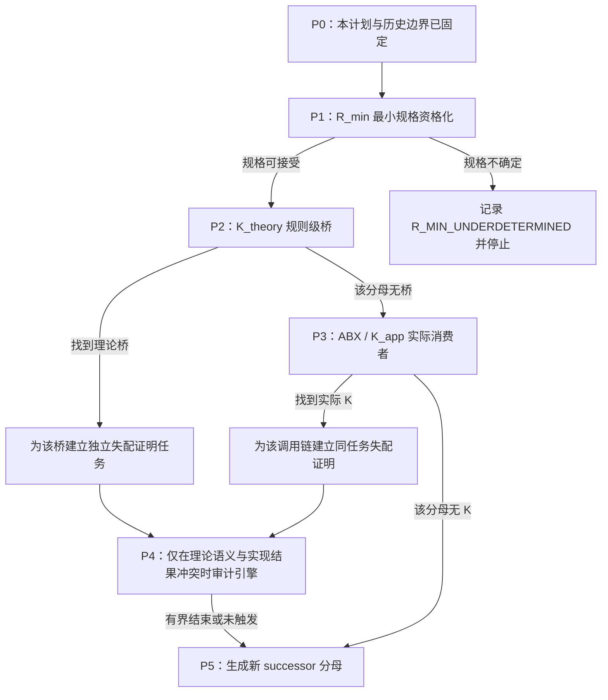

<!-- governance-shard:v2
logical_id: HOTT-FOUR-TRACK-PLAN
shard_id: 003
index: ../HoTT后续研究总体方案.md
-->

# 分支顺序、准入与停止条件



## P0：本计划

P0 仅完成计划、完整问答保存、当前状态路由和旧分支去重。它不新增数学主张，不重跑内核，也不把计划本身当作研究进展。

## P1：`R_min` 最小规格资格化

**启动输入**：现有 `RichCurve`、`NativeSourceContract`、`NativeTaskIntegration`、H/R/K 整备及用户原圆环 A/B/X 合同。

**最小行动**：只列出当前 `RichCurve` 没有表达、但若不表达就无法判定强完成的字段；为每项字段给出用户原意或独立数学理由、可观察量、允许操作和 Done 的作用。随后测试现有全字段 transport 正控制、裸 U 反控制与操作合同双控制是否仍覆盖该规格。

**P1 的三种结束**：

- `R_MIN_ACCEPTED_WITH_SCOPE`：新规格足以固定 P2/P3 的强任务，且未重做已有控制；进入 P2。
- `R_MIN_ALREADY_COVERED_BY_RICHCURVE`：没有新字段具有独立必要性；以现有规格直接进入 P2。
- `R_MIN_UNDERDETERMINED`：字段只能靠事后选择或现实语言无法转成可检验合同；停止 P2/P3，保留对象理论问题，不伪造桥。

### P1 已完成的范围结果（2026-09-21）

`P1-RMIN-SPEC-001` 得到 `R_MIN_ACCEPTED_WITH_SCOPE`：`RichCurve` 单独不足以表达同一强任务，但已有 `Input + CurveData + Denotes/Satisfies + O + D` 可以构成当前圆去点—闭图—复原任务的受限 `R_min`。它不完成完整 `OriginTop`、物理来源史或所有操作的分类。见 `audit/p1-rmin-spec-20260921/P1-RMIN-SPEC-REPORT.md` 与其验证收据。这个结束资格化 P2，不把 P1 的类型化控制升级为理论桥或 HoTT 缺陷结论。

## P2：`K_theory` 规则级桥

**准入**：P1 已给出固定的 `R_min`、`Done_s`、H/U 和一个有独立理由的观察。

**最小行动**：从一个新的、版本冻结的理论分母中选取一个可能桥接类，明确它是否声称 H/U 足以完成 `Done_s`。已审的 HoTT Book 核心、D1/D2、显式 univalence transport、截断/商及现有 Rich 控制不能被原样重扫。

**当前预注册分母**：`P2-KTHEORY-SIP-001`。冻结 HoTT Book §9.8 的版本、结构 `(P,H)`、标准结构的前提与结论，逐项映射它对“结构保持”的要求和 P1 的 `Input`、闭图、操作、`Done_w`、`Done_s`。该单元要检验的是 SIP 是否把裸 H/U 自动升格为 `Done_s`；不能因其谈及结构等同就预设它提供这种桥，也不能把 P1 的学术类比直接当作 P2 的理论结果。

**结束**：若发现桥，建立只针对该规则/定理的原生命题与反控制；若无桥，只登记 `NO_K_THEORY_WITHIN_DECLARED_DENOMINATOR`，再进入 P3，不扩大为“HoTT 没有问题”。

### P2 已完成的范围结果（2026-09-21）

`P2-KTHEORY-SIP-001` 复用并重新资格化本地 SIP 资产、冻结 Book §9.8，并得到 `NO_K_THEORY_WITHIN_SIP_DENOMINATOR / SIP_EXPLICIT_STRUCTURE_PRESERVATION`。Book 的结构同构要求正、逆两个 `H`；它既不把 bare equivalence 直接称作结构同构，也不谈 P1 的运行完成。旧 `SIPRepresentation` 是“结构外观察不能统一恢复、细化结构阻止识别”的正控制，不是当前圆环任务的重复证明。见 `audit/p2-ktheory-sip-20260921/P2-KTHEORY-SIP-REPORT.md` 与其验证收据。

## P3：`K_app` 实际消费者

**准入**：P2 已对一个理论分母结束；P1 的强任务仍有效。ABX 是此支的 owner。

**最小行动**：冻结一个外部库、论文实现或应用及其版本、入口、调用链。验证该消费者是否仅依赖 H/U、忽略 `R_min` 字段、并实际将结果用作同一 `Done_s`。

**当前最小预处理**：`P3-KAPP-DENOMINATOR-001` 先按 `goal-3.md` §2.1–§2.2 选择一个未被 D_ABX_1/D_ABX_2/D_ABX_3、旧 SIP/表示消费者审计或历史机器统观覆盖的版本固定外部消费者分母。它的成功只是锁定版本、入口、调用链和被声称的任务；找到名称、引用 SIP 或结构同一性不算 K。若声明范围内没有合格新分母，记录有界选择失败而不重复旧扫描。

**结束**：命中时建立同一任务失配证明；无命中只关闭该分母。禁止重复 D_ABX_1、D_ABX_2、D_ABX_3、Book 核心或同一 Coq locator。

### P3 已完成的范围结果（2026-09-21）

`P3-UNIMATH-FUNCTOR-ALGEBRAS-001` 冻结 UniMath `ab5f5395…` 的实际调用：`Examples.v` 为函子代数明确构造 `functor_alg_mor`/displayed category，并调用 `is_univalent_disp_from_SIP_data`。它消费明确结构保持条件，结果是 `is_univalent_disp`，没有输入 bare H/U 或 P1 的 `Input`、闭图、operation、`Done_s`。故判词为 `NO_K_WITHIN_UNIMATH_FUNCTOR_ALGEBRAS_DENOMINATOR`。这只关闭该消费者分母，不证明外部全部库无 K；active goal 因而进入 P5 successor discovery，而不是停止。

## P4：`K_engine` 实现忠实性

**准入**：必须已有一个固定演算规则/理论桥或一个相同输入在两个有明确语义的实现之间产生可复现的差异。运行超时、普通类型错误、额外归约配置或一个被拒项不足以启动 P4。

**结束**：实现问题要么以可重放的校验器不忠实性证据进入独立软件审计，要么以 `NO_IMPLEMENTATION_ANOMALY_WITHIN_DECLARED_CONFIGURATION` 结束；无论哪种都不能替代 P1–P3 的理论论证。

### 本 pass 的 P4 状态

P1/P2/P3 没有给出同一规则在两个实现中相反的可重放语义结果，也没有找到实际 K。因此 P4 为 `NOT_TRIGGERED`，不得把一次类型拒绝、旧 Agda/Cubical 差异或不满足强任务的普通外部库当作实现不忠实性审计的授权。P4 未触发也不是目标终止理由：它进入 P5 生成其它有判别力的入口。

## P5：`SUCCESSOR_DISCOVERY` 主动生成下一分母

**准入**：当前 active goal 下，P1/P2/P3 的一个或多个冻结分母已完成，且继续原分母只会重复既有控制。

**最小行动**：固定前一 pass 未闭合的最终链边；按 `goal-3.md` §2.1、§2.2 与 §3.2 同时审查学术/社区成果和本地/历史资产，比较至少一个新规则/模型入口、一个真实消费者入口、一个对象理论入口和一个实现差异入口。选出一个新、版本或规格固定的 successor，并写明为何不被既有 P1/P2/P3 覆盖。

**结束**：产生一张可执行的新 candidate card，指定它回到 P2、P3、P4 或独立对象理论线；若首个 discovery 分母无合格候选，则建立下一个有界 source/coverage 分母继续生成。只有整体 goal 达成、用户暂停或不可访问外部状态才可暂停 P5。

### P5 已完成的范围结果（2026-09-21）

`P5-SUCCESSOR-DISCOVERY-001` 对新的规则/模型、实际消费者、对象理论与实现差异四类入口作了有界比较。cohesive/real-cohesive HoTT 是明确保留额外几何结构的已知防御/边界，不是普通 HoTT 的内部缺陷；没有出现新的、版本固定的实际消费者或 P4 语义差异。另一方面，本地 H/R/K 整备已登记而尚未完成的 `OriginPresentation` 与相对/标记/分层/cohesive 结构的保真比较，构成独立而未覆盖的对象理论入口。故 P5 判词为 `SUCCESSOR_SELECTED_P6_ORIGIN_STRUCTURE_COMPARISON`，进入 P6，而非停止 active goal。详见 `audit/p5-successor-discovery-20260921/P5-SUCCESSOR-DISCOVERY-REPORT.md`。

## P6：`ORIGIN_STRUCTURE_STRATIFIED_COMPARISON` 对象理论比较

**准入：** P5 已选择来源—操作—复原对象理论为尚未覆盖的链边；P6 不重开 P2/P3/P4。

**最小行动：** 用固定的 `OriginPresentation = (C,p,M,N,e,boundary,closure-spec,operation-spec)`，逐字段比较带标记/带基点对象、`X → P` 型分层对象、相对或 cospan/diagram 结构与 cohesive 结构。对每一项分别问：它是对象数据、态射保持条件、过程/trace 关系、还是 Done 规格；不得凭名称断言模型已经或无法承载该字段。

**正控制：** 当前 `reexpressed`/`CurveData` 的全字段 transport 能保持 `Satisfies`，故富化结构并不等于不可运输或不可比较。

**最强反解释：** 如果一个固定的 structured diagram 能自然编码所有字段，并且结构等价保留它们，那么 P6 必须把结果记为“已有对象理论显式守住边界”，而不是强行制造 H/R 失配。

**结束：** 形成字段—对象—态射—过程矩阵和可形式化的最小后继接口，或有据地说明该比较分母不产生独立缺口。P6 的结果只关闭其比较分母；active goal 仍须按 `goal-3.md` §3.2 生成后继。

### P6 已完成的范围结果（2026-09-21）

`P6-ORIGIN-STRUCTURE-STRATIFIED-COMPARISON-001` 完成了字段矩阵，并发现本地已有 Lean `CurvePresentation`、Cubical `RichDiagram` 和 `CurveRun` 分别覆盖静态 completion/boundary、结构运输与过程合同的局部控制。公开分层、cospan、定向路径/类型论与 cohesive 文献说明这些字段可以被**组合的**富化对象表达；没有一个被检验的单一静态对象会从裸同胚自动补齐全部字段。故结果是 `PARTIAL_REUSE / COMPOSITE_STRUCTURED_DIRECTED_DIAGRAM_CANDIDATE`：不要求发明新拓扑学，也不构成 HoTT 缺陷。详见 `audit/p6-origin-structure-stratified-20260921/P6-ORIGIN-STRUCTURE-STRATIFIED-COMPARISON-REPORT.md`。

## P7：`ORIGIN_DIRECTED_DIAGRAM_SPEC` 最小组合规格

**准入：** P6 已说明现有资产是互补的局部接口，且完整组合结构是当前最强反解释。P7 不重跑 C-275–C-279，也不把它们的范围扩大成普遍不可能性。

**最小行动：** 仅以现有 `CurvePresentation`、`RichDiagram`、`CurveRun`、`Input/Satisfies` 为来源，写出一个最小 `OriginDirectedDiagram` 规格：静态图 `M↪C←{p}`、`N─e→M`、边界和 closure 交换条件、过程 trace、`Obs`、`Done_s`、保结构态射及 forgetful `U`。逐字段标明哪一现有接口实际供给它，哪一字段仍是用户/独立来源待定；不得新增第四份几何模型或未被实际消费者需要的通用层。

**正控制：** 对应现有 `ambientTransportEquivalence`、`transportDiagram` 和 `CurveRun`，完整字段同行时结构保持与过程合同可以成立。

**最强反解释：** 如果规格仅把已有接口的字段机械并列、没有新增可观察或可被未来 K 消费的同任务约束，P7 必须判为 `RESTATEMENT_ONLY`，停止该设计支并回到新的实际消费者分母。

**结束：** 产出一个可审查、不预设 HoTT 缺陷的规格卡和两种明确进入条件：实际 K 消费者或独立更强 R。P7 结束后仍须生成 successor；不得把“规格已写”报告为实际 K 或理论败诉。

### P7 已完成的范围结果（2026-09-21）

`P7-ORIGIN-DIRECTED-DIAGRAM-SPEC-001` 将 P6 的静态图、过程、观察、完成和 forgetful 层收敛成 `OriginDirectedDiagram` 与 `K-input / K-output / K-claim / K-forgetting / K-version` 五项准入判别器。它不是纯同义字段堆砌：任何将来 K 的版本、输入、输出与同任务承诺都可被这个判别器否证；但它也没有找到任何实际 K 或新数学定理。故判词为 `K_HARNESS_ACCEPTED_WITH_SCOPE`，进入 P8 的新实现 discovery 分母。

## P8：`DIRECTED_TYPE_THEORY_IMPLEMENTATION_DISCOVERY` 新实现分母

**准入：** P6/P7 已确定 `operation-spec` 是未来 K 的必要字段，且基础 HoTT/Book/SIP/UniMath 分母已经有界关闭。P8 以公开的 directed/simplicial type-theory 实现、库或论文附带代码为新的版本固定分母，不替代 P3 的普通 HoTT 消费者审计。

**最小行动：** 先进行 P8 专属的公开实现/社区与本地/历史资产侦察，选择一个可定位版本、入口、调用链及其实际输入/输出。对照 P7 的五项 K 判别器。不得把论文摘要、名称或“有 directed path type”当作实际消费者。

**正控制：** 如果该实现显式接收 directed/structured fields，或只提供 homomorphism/path 定义而不宣称 `Done_s`，判为 `DEFENSE_PRESERVES_TASK`/`NOT_A_CONSUMER`。

**最强反解释：** directed type theory 是不同的扩展理论，因而即使其实现存在也可能和普通 HoTT、原圆环任务或 P7 的 `U_bare` 完全不同。

**结束：** 产生一个版本固定的 candidate card 或一个有界 discovery 无命中结论；只有实际 K 五项全部有直接证据，才进入同任务失配证明。P8 结束后 active goal 仍生成 successor。

### P8 已完成的范围结果（2026-09-21）

`P8-DIRECTED-TYPE-THEORY-IMPLEMENTATION-DISCOVERY-001` 冻结并审计 Rzk `01b081e…` 的 README、directed interval/cube docs、circle/data docs 和两个测试入口。它显式提供有向 `2`、source/target、顺序、shape/tope 和 boundary 条件；没有在该六文件分母中接受 `U_bare(OriginDirectedDiagram)` 并输出或声称 `Done_s`。故判词为 `NOT_A_CONSUMER / DEFENSE_PRESERVES_DIRECTIONAL_INPUT`。这不外推为 Rzk 全库无 K，也不证明 Rzk/HoTT 缺陷。

## P9：`SHOTT_DIRUNIV_CORPUS_DENOMINATOR` Rzk 关联语料分母

**准入：** Rzk 文档明确指向 sHoTT 的 `diruniv` 分支作为 directed-univalence/modalities 的大型形式化语料；它与 Rzk runtime 本体是不同来源和调用层，因此不重复 P8。

**最小行动：** 冻结 `LIshy2/sHoTT` 的 `diruniv` branch/commit、实际 `.rzk` 入口及其 Rzk 模态/shape 输入。先区分 postulate、语言规则、formalisations 和下游 theorem；再按 P7 五项 K 判别器检查该 corpus 是否把裸输入当作原圆环 `Done_s`。

**正控制：** 如果代码显式使用 directed interval、modalities、extension boundaries、covariant fibrations 或其他结构字段，判为 `DEFENSE_PRESERVES_TASK`；若只是 directed-univalence theorem，也不等于 K。

**最强反解释：** `diruniv` 可能依赖实验性/公设化 modal API；即使有可运行 formalisation，其范围也不等于基础 HoTT 或用户圆环过程。

**结束：** 给出版本、入口、依赖、输入/输出和五项判别表；有界无 K 时关闭 P9，并产生下一不重复 successor。

### P9 已完成的范围结果（2026-09-21）

`P9-SHOTT-DIRUNIV-CORPUS-DENOMINATOR-001` 固定 `LIshy2/sHoTT@e76c196…` `diruniv` branch，审读 triangulated `05-diruniv` 及其紧邻前提。中心类型 `S = Σ(A:U), is-a-cov A`，morphism 是 `𝕀→S`，`dirglue` 显式接收 A/B/f；同一语料还显式保留 `#assume` 和邻近 `#postulate`。在声明范围内没有原圆环 `U_bare→Done_s`。故结果为 `NOT_A_CONSUMER / DEFENSE_EXPLICIT_COVARIANT_MODAL_STRUCTURE`，不是 sHoTT 全库或 HoTT 的全局结论。

## P10：`SECOND_SUCCESSOR_DISCOVERY` 不重复候选重新选择

**准入：** P8/P9 已连续关闭 directed/simplicial 实现与 corpus 两个相邻分母为“显式结构防御”。再沿同一理论簇扩展关键词将违反反漂移原则。

**最小行动：** 重新扫描四个剩余入口：

1. 基础 HoTT 或 cubical 规则层中尚未审的、可使 `U_bare` 升格为强完成的确切规则；
2. 非 directed/simplicial 的版本固定实际消费者，尤其 point-set、compactification、real/cohesive 或几何 formalization 的实际输入/输出；
3. 用户或独立数学来源可支持的更强 R/Done 规格；
4. 可重放的理论—实现语义差异。

它必须先做学术/社区与本地/历史资产双重侦察，登记每个候选为何不被 P1–P9 覆盖；若无新合格候选，产生下一有界 discovery 分母，不以更多同义防御案例填充工作。

**正控制：** 已审 Rzk/sHoTT 的显式结构输入、P1–P3 和 P6–P9 的不同输入/Done 关系一律视为覆盖或防御，不重做。

**停止：** P10 只选择一条真正不同且可执行的新路径；它不主张发现 K。只有可定位、版本冻结的新来源实际满足候选卡时，才允许把该来源登记为下一有界单元。

### P10 已完成的范围结果（2026-09-21）

`P10-SECOND-SUCCESSOR-DISCOVERY-001` 比较了未审规则/模型、非定向实际消费者、更强 `R/Done` 和实现差异四类入口。`N∞` 一点评紧化是相关但不同任务，现有 Cubical S¹ C-304 是部分可复用控制，P4 仍无跨实现语义触发。公开 Coq-HoTT `Circle.v` 与 `Coeq.v` 则提供了一个版本固定、非定向、直接书写 glue/coherence 的外部 library source；其下游 `TorusEquivCircles.v` 是可定位实际消费者。故 P10 选择 `P11-COQHOTT-CIRCLE-COEQUALIZER-CORPUS-001`，但 P10 本身不对该 candidate 作最终 K 判词。完整选择收据见 `audit/p10-second-successor-discovery-20260921/`。

## P11：`COQHOTT_CIRCLE_COEQUALIZER_CORPUS` 非定向 Circle/Coeq source audit

**准入：** P10 已以 Coq-HoTT `master@e3deab71…` 的 Circle、Coeq 与 Torus 下游 source 形成新版本冻结 candidate；它不同于 P8/P9 的 directed/simplicial 语料，也不同于本地 C-304 的 Cubical S¹ 编码控制。

**最小行动：** 只冻结 README、`Colimits/Coeq.v`、`Spaces/Circle.v`、`Spaces/Torus/Torus.v` 与 `TorusEquivCircles.v` 的版本、输入、输出和调用关系。以 P7 五项条件逐项检查：(i) Coeq/Circle 是否真接收 `U_bare`；(ii) Circle 或 Torus consumer 的输出是什么；(iii) 是否有人将其作为原 `Done_s`；(iv) glue/coherence 是否已显式输入；(v) source/version 是否可复查。

**正控制：** 若 `Coeq_rec`、`Circle_ind` 或 Torus 映射显式要求 glue、coherence、base/loop/surface，则判 `DEFENSE_PRESERVES_TASK` 或 `NOT_A_CONSUMER`。

**最强反解释：** Circle 的 synthetic HIT 可能与点集 `C\setminus\{p\}`、`N` 和用户来源—复原过程完全不是同一任务；这种任务不同本身必须保留，不能改名为 K。

**停止：** P11 只审计该五文件 source denominator。它不编译整库、不审计全 Coq-HoTT、不因 Circle 标题声称 K；只有五项都有直接证据才进入同任务失配证明。

### P11 已完成的范围结果（2026-09-21）

`P11-COQHOTT-CIRCLE-COEQUALIZER-CORPUS-001` 完成 Coq-HoTT `e3deab71…` 的五文件 source audit。`Coeq`、`Circle_ind/rec` 与下游 Torus 映射都显式要求 maps、`cglue`/loop coherence、base/loops/surface；没有 `U_bare`、原 `Done_s` 或来源—闭合 trace 的调用/声明。故其 K 判词是 `NOT_A_CONSUMER / DEFENSE_EXPLICIT_GLUING_AND_COHERENCE`。`Torus_rec_beta_surf` 的 `Admitted` 是可见的信任边界，未构成 P4 的语义差异或 kernel 结果。详见 `audit/p11-coqhott-circle-coequalizer-corpus-20260921/`。

## P12：`THIRD_SUCCESSOR_DISCOVERY` 不重复候选重新选择

**准入：** P8/P9 的 directed/simplicial 语料和 P11 的 Circle/Coeq source 都已经显示显式结构/粘合数据，而不是原 `U_bare→Done_s` 越级。继续扩展任一已审簇不会改变 K 判词。

**最小行动：** 再次比较四类入口：(1) 未审的 HoTT/立方规则或正式模型；(2) 非 Circle/Coeq、非 directed 的版本固定实际消费者；(3) 有独立数学来源支持且比现有 `R_min` 更强的 `R/Done`；(4) 可重放的理论—实现语义差异。每个候选先做公开/本地侦察，并说明为何不被 P1–P11 覆盖。

**正控制：** P1–P11 的显式字段、glue、coherence、operation 与 task-distinct 防御均是覆盖项，不重做。

**停止：** P12 只选择一条有判别力的新路径或下一有界 discovery source；不以更多 Circle/HIT/compactification 关键词制造 P13。

### P12 已完成的范围结果（2026-09-21）

`P12-THIRD-SUCCESSOR-DISCOVERY-001` 对未审规则、非 Circle/Coeq 非定向消费者、独立更强 `R/Done` 与理论—实现差异作了公开与本地双重侦察。公开资料把“空间连同子空间”的 pair 与 ambient homeomorphism 固定为标准拓扑比较语言，但未给出用户精确 `C,p,M,N,e,Done_s` 的 HoTT 消费者。现有 `AmbientCircle.lean` 的 C-265–C-268 则以同一对象对提供了内在 homeomorphism 正控制、无环境 homeomorphism 反控制和有限环境操作不可复原反控制。它没有被 P6 作为此种操作关系显式吸收。故 P12 选择 `P13-AMBIENT-PAIR-RMIN-REQUALIFICATION-001`；结论为 `SUCCESSOR_SELECTED / AMBIENT_PAIR_RMIN_REQUALIFICATION_CANDIDATE`，不是 K、原生 HoTT 定理或 HoTT 缺陷。完整收据见 `audit/p12-third-successor-discovery-20260921/`。

## P13：`AMBIENT_PAIR_RMIN_REQUALIFICATION` 环境对专门化资格化

**准入：** P12 已冻结 C-265–C-268 的源码、保存 run、相对 P6 的复用边界和公开 pair/topology 术语。它不是新几何证明或新的 HoTT consumer；唯一待判问题是，固定 ambient 空间、嵌入/闭包余集与允许操作是否构成可审查的 `R_min`／Done 专门化。

**最小行动：** 不重跑 Lean。只以已保存证据固定并比较：

```text
H_intrinsic(M,N) := 固定 M、N 子空间的内在 homeomorphism
R_ambient(M,N)   := 固定 Plane、嵌入/闭包余集和登记的 ambient operation class
Done_ambient     := 在该 operation class 中由 N 复原指定 M
```

逐项将 C-266、C-267、C-268 映射到 `OriginDirectedDiagram` 的 Input、Operation、Observation 和 Done；再判定它是否增加一个 future-K 可消费且非任意的强任务条件，还是只把既有字段改写成新的词。

**正控制：** C-266 的 `H_intrinsic` 必须明确保留，避免把环境限制误报为“通常拓扑不同”。

**最强反解释：** C-267/C-268 只限制固定环境和有限 operation class；它们不排除切割、加点、重嵌入、一般连续过程或无限极限。因此即使 `R_ambient` 合格，也不是完整现实同一性或一般物理不可复原结论。

**停止与分流：** P13 只能产出 `R_AMBIENT_SPECIALIZATION_ACCEPTED_WITH_SCOPE` 或 `RESTATEMENT_ONLY`。前者只使该合同成为未来 K 搜索的精确候选，后者触发下一次不同分母的 successor discovery；两者都不启动 K 审计、重新运行 Lean 或得出 HoTT 结论。`CLOSE_WITH_SCOPE` 关闭 P13 分母，但 active goal 必须继续生成后继。
