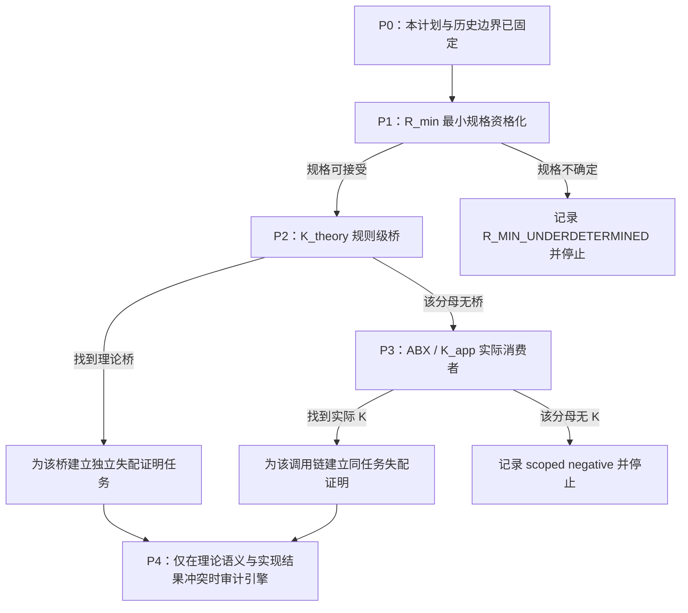

<!-- governance-shard:v2
logical_id: HOTT-FOUR-TRACK-PLAN
shard_id: 003
index: ../HoTT后续研究总体方案.md
-->

# 分支顺序、准入与停止条件

## P0：本计划

P0 仅完成计划、完整问答保存、当前状态路由和旧分支去重。它不新增数学主张，不重跑内核，也不把计划本身当作研究进展。

## P1：`R_min` 最小规格资格化

**启动输入**：现有 `RichCurve`、`NativeSourceContract`、`NativeTaskIntegration`、H/R/K 整备及用户原圆环 A/B/X 合同。

**最小行动**：只列出当前 `RichCurve` 没有表达、但若不表达就无法判定强完成的字段；为每项字段给出用户原意或独立数学理由、可观察量、允许操作和 Done 的作用。随后测试现有全字段 transport 正控制、裸 U 反控制与操作合同双控制是否仍覆盖该规格。

**P1 的三种结束**：

- `R_MIN_ACCEPTED_WITH_SCOPE`：新规格足以固定 P2/P3 的强任务，且未重做已有控制；进入 P2。
- `R_MIN_ALREADY_COVERED_BY_RICHCURVE`：没有新字段具有独立必要性；以现有规格直接进入 P2。
- `R_MIN_UNDERDETERMINED`：字段只能靠事后选择或现实语言无法转成可检验合同；停止 P2/P3，保留对象理论问题，不伪造桥。

### P1 已完成的范围结果（2026-09-21）

`P1-RMIN-SPEC-001` 得到 `R_MIN_ACCEPTED_WITH_SCOPE`：`RichCurve` 单独不足以表达同一强任务，但已有 `Input + CurveData + Denotes/Satisfies + O + D` 可以构成当前圆去点—闭图—复原任务的受限 `R_min`。它不完成完整 `OriginTop`、物理来源史或所有操作的分类。见 `audit/p1-rmin-spec-20260921/P1-RMIN-SPEC-REPORT.md` 与其验证收据。这个结束资格化 P2，不把 P1 的类型化控制升级为理论桥或 HoTT 缺陷结论。

## P2：`K_theory` 规则级桥

**准入**：P1 已给出固定的 `R_min`、`Done_s`、H/U 和一个有独立理由的观察。

**最小行动**：从一个新的、版本冻结的理论分母中选取一个可能桥接类，明确它是否声称 H/U 足以完成 `Done_s`。已审的 HoTT Book 核心、D1/D2、显式 univalence transport、截断/商及现有 Rich 控制不能被原样重扫。

**当前预注册分母**：`P2-KTHEORY-SIP-001`。冻结 HoTT Book §9.8 的版本、结构 `(P,H)`、标准结构的前提与结论，逐项映射它对“结构保持”的要求和 P1 的 `Input`、闭图、操作、`Done_w`、`Done_s`。该单元要检验的是 SIP 是否把裸 H/U 自动升格为 `Done_s`；不能因其谈及结构等同就预设它提供这种桥，也不能把 P1 的学术类比直接当作 P2 的理论结果。

**结束**：若发现桥，建立只针对该规则/定理的原生命题与反控制；若无桥，只登记 `NO_K_THEORY_WITHIN_DECLARED_DENOMINATOR`，再进入 P3，不扩大为“HoTT 没有问题”。

### P2 已完成的范围结果（2026-09-21）

`P2-KTHEORY-SIP-001` 复用并重新资格化本地 SIP 资产、冻结 Book §9.8，并得到 `NO_K_THEORY_WITHIN_SIP_DENOMINATOR / SIP_EXPLICIT_STRUCTURE_PRESERVATION`。Book 的结构同构要求正、逆两个 `H`；它既不把 bare equivalence 直接称作结构同构，也不谈 P1 的运行完成。旧 `SIPRepresentation` 是“结构外观察不能统一恢复、细化结构阻止识别”的正控制，不是当前圆环任务的重复证明。见 `audit/p2-ktheory-sip-20260921/P2-KTHEORY-SIP-REPORT.md` 与其验证收据。

## P3：`K_app` 实际消费者

**准入**：P2 已对一个理论分母结束；P1 的强任务仍有效。ABX 是此支的 owner。

**最小行动**：冻结一个外部库、论文实现或应用及其版本、入口、调用链。验证该消费者是否仅依赖 H/U、忽略 `R_min` 字段、并实际将结果用作同一 `Done_s`。

**当前最小预处理**：`P3-KAPP-DENOMINATOR-001` 先按 `goal-3.md` §2.1–§2.2 选择一个未被 D_ABX_1/D_ABX_2/D_ABX_3、旧 SIP/表示消费者审计或历史机器统观覆盖的版本固定外部消费者分母。它的成功只是锁定版本、入口、调用链和被声称的任务；找到名称、引用 SIP 或结构同一性不算 K。若声明范围内没有合格新分母，记录有界选择失败而不重复旧扫描。

**结束**：命中时建立同一任务失配证明；无命中只关闭该分母。禁止重复 D_ABX_1、D_ABX_2、D_ABX_3、Book 核心或同一 Coq locator。

## P4：`K_engine` 实现忠实性

**准入**：必须已有一个固定演算规则/理论桥或一个相同输入在两个有明确语义的实现之间产生可复现的差异。运行超时、普通类型错误、额外归约配置或一个被拒项不足以启动 P4。

**结束**：实现问题要么以可重放的校验器不忠实性证据进入独立软件审计，要么以 `NO_IMPLEMENTATION_ANOMALY_WITHIN_DECLARED_CONFIGURATION` 结束；无论哪种都不能替代 P1–P3 的理论论证。
