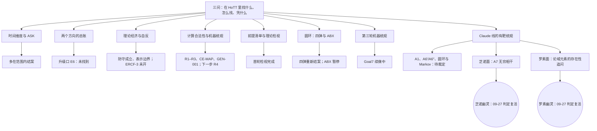

<!-- governance-shard:v2
logical_id: README
shard_id: 004
index: ../README.md
-->

# 路线地图

> 快照：2026-09-30，方向追踪 `integrated-direction-portfolio/v1.13`（投影 `20260930-direction-290`，41 条方向）。状态词照方向追踪原文，括号里是人话；每条路的权威状态在所列方向行。本章只画走过和正在走的路，往后怎么走见 006。

**状态词速查**（方向追踪第 001 片）：`ACTIVE_USER_DIRECTION` 研究发起人当前的方向；`NEXT_CANDIDATE` 下一候选，尚未执行；`SUPPORTING_DIRECTION` 支撑主线，不自动成为数学主线；`REVIEW_REQUIRED` 有记录或结果，但来源、上下文或适用域仍需复核；`PARKED` 暂不执行，保留重开条件；`CLOSED_WITH_SCOPE` 在明确范围内完成，不能外推到更宽的命题。

## 1. 总图

## 2. 路线表

| 路线 | 它问的问题 | 谁提出 | 当前状态 | 产出与学到的 | 方向行 |
|---|---|---|---|---|---|
| **时间维度与 ASK** | HoTT 什么时候不让时间、时序参与思考（KC-000011）？它把时间、时空与运动安排成什么结构（KC-000006）？ | 研究发起人的时间怀疑；由三个历史平台与 Codex 会话展开 | 七条 `CLOSED_WITH_SCOPE`（在范围内完成）；两条 `REVIEW_REQUIRED`（待复核）；一条 `SUPPORTING_DIRECTION`（支撑） | 在线因果、guard 擦除、同函数异时、路径证书、过渡抽象与极限、race/timeout 等边界已原生机器化，多为“防守成立”或“表示边界”，即 HoTT 在这些位置正确地挡住了越级。有限审计窗口没有命中，只证明那些窗口没有命中。 | `DIR-L-TIME-WORK-DIMENSION`、`DIR-L-SAME-FUNCTION-DIFFERENT-TIME`、`DIR-L-GUARD-ERASURE`、`DIR-L-MATRIX-CONTINUITY`、`DIR-W-RACE-TIMEOUT`、`DIR-W-SILENT-STEPS`、`DIR-W-CURRENT-STATE-LIFT`、`DIR-W-TRANSITION-ABSTRACTION`、`DIR-W-PATH-CERTIFICATE`、`DIR-W-DEPENDENT-MIGRATION` |
| **两个方向的总账** | 现实可完成的过程被 Think in HoTT 引入额外完成困难（A）；数学上的存在或分类被提升为尚未取得的有效交付（B） | 研究发起人的原始方向；“资格保持”一行是 AI 的统筹建议 | 两条 `ACTIVE_USER_DIRECTION`；`DIR-TOP-QUALIFICATION-PRESERVATION` 为 `NEXT_CANDIDATE`（下一候选，尚未执行） | N11 把 13 个 A 向候选归约为表示或资格边界，判 `A_DIRECTION_BOUNDED_NEGATIVE`（限定候选空间与工具链）；B 向的越级路径在所审计的接口上被封住。两者都把升级口定在真实的自然使用者（E6），尚未找到。 | `DIR-U-A-REALITY-RELATIVE`、`DIR-U-B-EFFECTIVE-DELIVERY`、`DIR-TOP-QUALIFICATION-PRESERVATION` |
| **理论经济与自反** | 理论为经济收益遗忘现实因素之后，在证明自己可靠时，会不会出现不可停机或层层上升的自馈结构（KC-000028 至 KC-000036）？ | 研究发起人 09-12 直接新增的方向；经济账本一行是他 09-13 的系统化要求 | 三条 `ACTIVE_USER_DIRECTION`；四条反射与自指支线 `REVIEW_REQUIRED`；`DIR-W-RP-B01` 为 `PARKED`（暂不执行） | 部分计算、guard 擦除、成本、路径证书、在线因果等支线闭合；ERCF-3 的前置评估与编码线的自足部分机器收口，本体仍 gated，等精确的演算与自然使用者。学到：不能用一般哥德尔口号冒充 HoTT 实例。 | `DIR-U-THEORY-ECONOMY-SELF-VALIDATION`、`DIR-L-SELF-REFLECTION`、`DIR-TOP-THEORY-ECONOMY-LEDGER`、`DIR-W-RESTRICTED-REFLECTION`、`DIR-W-PROOF-REFLECTION`、`DIR-W-SELF-REFLECTION-DOMAIN`、`DIR-W-SELF-REFERENCE`、`DIR-W-RP-B01` |
| **计算合法性与机器统观** | 能否用基于 HoTT 框架的代码构造不可停机的程序？研究发起人说这本身就是一个现实问题（KC-000046）。 | 研究发起人的目标（`goal.md`）；GEN-001 来自方案修订片 | 两条 `ACTIVE_USER_DIRECTION`；双轨统观 `CLOSED_WITH_SCOPE / SUPERSEDED_BY_SINGLE_WORK_SURFACE`（被单工作面取代）；理论变体比较为 `SUPPORTING_DIRECTION` | R1、R2 基础与一般 R3 不完备性的重放（C-244 至 C-249）、CE-MAP v1 坐标化 478 项；GEN-001 五族完成，delay 片段现象饱和（`DELAY_FRAGMENT_PHENOMENON_SATURATED`）；下一步 `R4-HOTT-NAT-EFFECTIVITY-001`。学到：把不同前提都映到同一个方便计算的模型，模型会代替原问题（扩展认知第 009 片）。 | `DIR-TOP-COMPUTABILITY-MAIN-CONTINUITY`、`DIR-TOP-GEN001-BOUNDED-GENERATOR-CHAIN`、`DIR-TOP-MACHINE-OVERVIEW-DUAL-TRACK`、`DIR-L-THEORY-SCHEMA-VARIANTS` |
| **前提清单与理论检视** | HoTT 的哪些前提是非现实的？先对理论本身做有范围的充分检视（KC-000040、KC-000044 至 KC-000048）。 | 研究发起人（第三条发现路径、现实对齐、理论充分检视优先） | `HISTORICAL_INVENTORY / REALITY_JUDGMENTS_NOT_INHERITED`（35 条旧前提的来源资格已逐项处置，旧的非现实判定不作事实继承）；`FIRST_PASS_COMPLETE / NEXT_EXPERIMENT_PROPOSED`（理论首轮检视完成，后继实验只是建议） | PREMISE-001 前提清单；理论首轮检视 P40 至 P47（`HoTT理论充分检视.md`）。学到：前提清单是找靶的入口，不是结论。 | `DIR-TOP-PREMISE-INVENTORY`、`DIR-U-HOTT-FOUR-TRACK` |
| **圆环：四弹与 ABX** | 研究发起人自己发明的圆环悖论（从去点圆展开，再逼近复原，“此前已经得到 M”）在 HoTT 里怎样发生（KC-000003、KC-000010、KC-000037）？ | 研究发起人 | `CLOSED_WITH_SCOPE / PHASE_1_RECLOSED`（原四弹以范围判词重新结案）；`P3_CIRCLE_PAUSED / P40_TARGETED_DISCOVERY`（原圆环的实际使用位置 K 未找到，暂停，先由靶前提生成过程） | Astra 线关于固定复原映射与 Markov 原则的机器证明；Claude 线的离散圆、有理点圆对照（见 006 第 7 组）。学到：精化不能冒充原问（零大小的点、反向逼近、此前已经得到 M）。 | `DIR-U-ASTRA-BREAKPOINT`、`DIR-U-ABX-ORIGINAL-CIRCLE` |
| **第三轮机器统观** | 对 HoTT 父范围做多尺度、有靶的覆盖，并完成范围内的研究义务 | 研究发起人（Goal5、Goal6、Goal7） | `HISTORICAL_STAGE / PARENT_COMPLETION_NOT_ESTABLISHED`（旧 A 的阶段成果只读，未证明父范围完成）；`ACTIVE / PARENT_SCOPE_INCOMPLETE`（Goal7 的 Session C 续做中） | 旧 A 的 final-002 阶段证据；Session C 的来源处置与编码子结果，下一步 Book3。学到：自选集结案不等于父范围覆盖。 | `DIR-U-MO3-GOVERNED`、`DIR-U-MO3-COVERAGE-C` |
| **Claude 线的有靶统观** | 先找 HoTT 最引以为优点的取舍，再造专门碰它的过程（《最高指示-Claude版》） | Claude，在研究发起人授权下（09-24 起） | 只在 `.claude/总索引/002 - 当前状态、待决问题与下一步.md` 登记：A1 沿运动测量 `STRONG_CANDIDATE`，条件于“状态”的读法；A6′/A6″ 往返计步 `STRONG_CANDIDATE`，待研究发起人裁定三问 Q1 至 Q3；圆环复原与 Markov 为猜想（`MODEL_TRANSFER_OPEN`） | CG001-C-01 至 C-60 与 Terra 的六轮对辩。学到：同一机制连做两次就换层，往返计步一线在形式上已经到头。 | 无（未进入共享方向登记） |
| **芝诺面：A7 无穷相干** | 单价性把“相同”变成结构以后，一行就能写完的定义，在 HoTT 里是否要无穷地补下去？ | Claude 提出（CG-002、CG-003），研究发起人判定 | `ACTIVE_USER_DIRECTION / USER_VERDICT_REVIVED_20260927 / COMMUNITY_AUDIT_PENDING` | 见 005。 | `DIR-U-A7-INFINITE-COHERENCE` |
| **罗素面：论域元素的存在性追问** | 对 HoTT 论域元素（宇宙）的存在性追问，会不会在现实中停不下来（KC-000050、KC-000051）？ | 研究发起人的罗素原则触发；Claude、GLM、Cloud-Opus 构造与审计 | `ACTIVE_USER_DIRECTION / USER_VERDICT_REVIVED_20260927 / BRIDGE_AND_EXISTENCE_PREMISE_UNADJUDICATED`；早期的 `rₙ₊₁=¬rₙ` 形成模型为 `SUPPORTING_DIRECTION` | 见 005。 | `DIR-U-RUSSELL-EXISTENCE-QUESTIONING`、`DIR-L-RUSSELL-FORMATION` |

## 3. 纪律与来源方向

它们不是研究路线，但约束所有路线。

| 方向行 | 状态 | 内容 |
|---|---|---|
| `DIR-G-MATH-PROOF-DELIVERY-GATE` | `ACTIVE_USER_DIRECTION` | 数学结论交付前必须机器证明（F-011，见 007） |
| `DIR-G-CHECKPOINT-HYDRATION-INTEGRITY` | `ACTIVE_USER_DIRECTION` | 应用的 checkpoint 必须有 canonical 收据；叙事关系不递归污染任务水合 |
| `DIR-G-ATTRIBUTION-IS-MAIN-TOPIC` | `ACTIVE_USER_DIRECTION` | 归因是要与研究发起人仔细讨论的正题（KC-000049） |
| `DIR-E-LOCAL-HISTORY-COVERAGE` | `SUPPORTING_DIRECTION` | LocalGPT 历史的完整可审计性 |
| `DIR-E-WEB-HISTORY-COVERAGE` | `SUPPORTING_DIRECTION` | WebGPT 历史到记录与产物的映射 |
| `DIR-G-UNDERSTANDING-RECONCILIATION` | `SUPPORTING_DIRECTION` | 两套理解章节的逐文件融合 |
| `DIR-W-ATTACHED-HISTORY` | `REVIEW_REQUIRED` | 转述、附件与历史意见的来源身份 |
