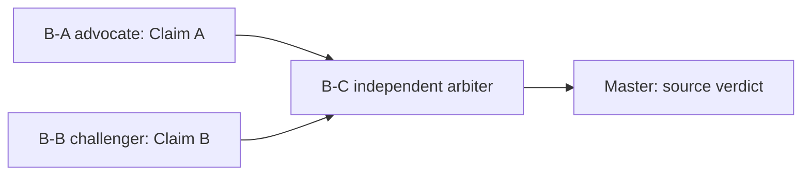

# P-DAG-BATTLE-001：`∈` 是否构成 P1 consumer 的动态 DAG Battle

> **身份：** `DYNAMIC_DAG_ORCHESTRATION_SMOKE / SOURCE_CONTRACT_CLASSIFICATION / NOT_A_ZFC_RESULT`。
>
> **结论：** `RESOLVED_BY_SOURCE / SOURCE_CONSUMER_GAP`。本次验证了 TaskCard → 两个独立立场节点 → arbiter → Master source verdict 的有界 DAG；它只裁决中性卡在 L2b 下不提供 consumer contract，不产生 ZFC Q 或数学命题。

## 1. 冻结 TaskCard

| 字段 | 值 |
|---|---|
| task | `P-DAG-BATTLE-001` |
| disputed field | P1 `C`：关系级 `a∈P(P(a))` 能否算 source-supplied consumer |
| theory scope | 中性 ZFC-style source card；不是完整 ZFC 或某一形式化实现 |
| frozen L2b | C 必须有 source-supplied judgment rule／operation／task，以及输入、成功输出／Done 或下一 handoff；裸 relation 不自动是 C |
| access profile | 三个节点均 `BATTLE_PACK`：只读 prompt 内 source/claim，不读项目、网络、分支或历史 |
| runner | fresh Codex CLI `gpt-5.6-terra / max / read-only / never` |
| writes/recursion | worker 写入=none；递归委派=forbidden；Master 是唯一 project writer |

源卡只给 sets、membership relation、幂集存在、有界 separation、replacement、Foundation，以及“不提供 unrestricted comprehension、formula coding/satisfaction、construction machine”的限制。

## 2. DAG 与运行收据



| Node | 角色／session | prompt SHA-256 | result SHA-256 | 终态 |
|---|---|---|---|---|
| B-A | advocate / `01a0fd1b-039b-77e1-895a-b5ff743ce497` | `003689f171b50076a40bf9bd3ef70a1dbc29ad45dd10f45ea151d6e77f048b39` | `b2401518b2663bde307a257fae3e457dfe18cdb8c0f7b1c39a17f8f737a8f18c` | `exit 0` |
| B-B | challenger / `01a0fd1b-028d-7442-a124-e3e4a6af5577` | `a099bce8008f3c1913b5ed007a1c1bbf7ed56139b8cc5fa25a9d54a49de318c5` | `dec9e27dbbd5d2ba90389839343913272ab9807f1d8bc85ac3d72b50db8e5be5` | `exit 0` |
| B-C | arbiter / `01a0fd1d-180b-7742-8c04-d83975b92ba1` | `0e78c37a4140ca08e1156251c0ed762108a34ce1cd26d8936cbd312b1dd9a068` | `d7a473640e82c7920616285116d58f9992ad256a2e9d8353b158322b99d6b5bc` | `exit 0` |

完整 scratch prompt/result 留在 `/tmp/hott-p-dag-battle-001/`，不是项目 current truth。此审计保留了足以重新核对该 DAG 的 source card、NodeCard 摘要、session identity、hash、可见判词和 Master 裁决；没有保存或推断隐藏思维。

## 3. 两个立场节点

### B-A：最强 relation-as-consumer 读法

advocate 承认 `a`、`P(a)`、`P(P(a))` 与 `∈` 都是 source-native，也给出：

\[
a\in P(P(a)) \Rightarrow a\subseteq P(a) \Rightarrow \forall x\in a,\;x\subseteq a.
\]

它的 strongest case 是：没有外加公式、satisfaction 或 unrestricted comprehension 就可陈述和展开该 relation。它也明确承认卡片没有 output representation、evaluator、witness format 或 Done；为了得到 `RELATION_AS_MINIMAL_CONSUMER`，它必须另加“每个 atomic membership assertion 都算 P1 consumer”的 convention。

### B-B：consumer-contract 读法

challenger 保留该表达式的语法／关系意义，却逐字段指出卡片没有：消费 relation 的 judgment task、输入约定、operation、输出／Done 或 next handoff。它判 `SOURCE_CONSUMER_GAP`，并把“隐含 true/false 输出”标作卡片之外的 convention。

两节点的真正分歧因而不是集合论定理，而是 L2b 的 `C` 字段能否由裸 relation 填入。它满足 Battle 的“字段冲突”触发条件。

## 4. Arbiter 与 Master 判词

arbiter 对 source card 与冻结 L2b 给出：

```text
RESOLVED_BY_SOURCE
SOURCE_CONSUMER_GAP
```

它认可 B-A 的有限结论：relation 与对象是 source-native；但判断 B-A 把 atomic assertion 当 consumer 的动作是 L2b 明令不能自动接受的额外 convention。true/false 两种 membership branch 也没有独立生成 input/output/Done contract。反事实中，若 source 另加一个 `Member(x,y)` judgment task，输入为 `(x,y)`、输出 `MEMBER/NOT_MEMBER`、并有 Done，才会改变该字段判词。

Master 复核结论与 arbiter 一致：本次中性卡只能支持“Power Set 是显眼基础 site”，不能支持 `C` 或共同 Q。下一节点不能再重做 membership 语义；它必须寻找版本固定、真实消费 `P(a)` 且给出 I/O/Done 的 source contract。

## 5. 验证范围与未完成项

- **已验证：** 两个并行、source-isolated Terra/Max 立场节点和一个仅消费 sealed battle pack 的 arbiter，均终态完成；它们输出公开 E0–E7 风格的来源理由，最终由 source 而非投票裁决。
- **未验证：** App Server 多 worker lane、sandbox/approval 回显、observer ACL、取消/恢复和 private wire 的真实 smoke；`agent_session_broker.py` 当前未被本项目修改，其 Codex adapter 的 sandbox-forwarding 尚未资格化。
- **不支持：** ZFC 不一致、ZFC Q 已定位、Power Set 被否定、模型内部机制被读取、所有未来 Battle 都可靠，或任何关于 HoTT 的数学结论。
