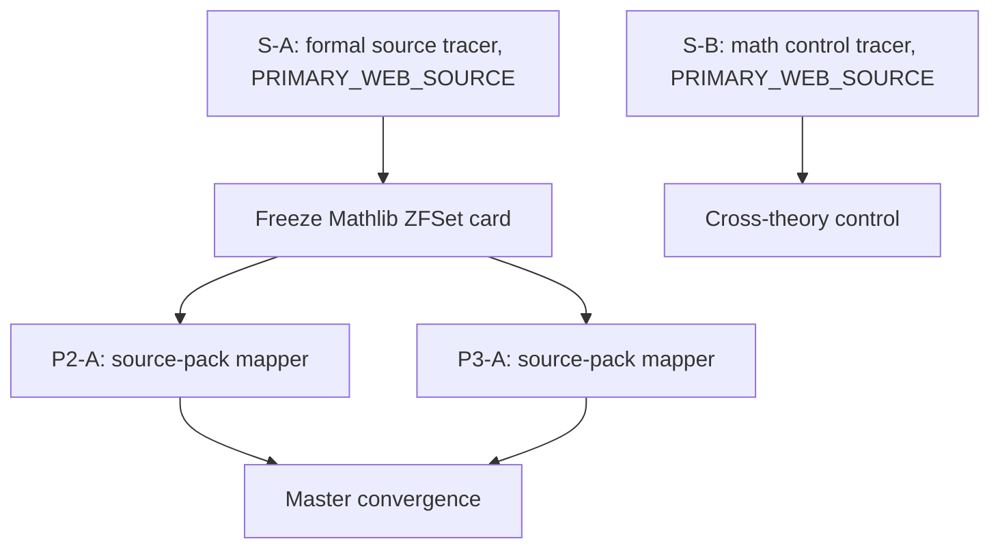

# P-DAG-SOURCE-001：Power Set 的真实 consumer 来源节点与 P2/P3 接力

> **身份：** `DYNAMIC_DAG_SOURCE_TRACE / VERSION_PINNED_CONSUMER_CARD / NOT_A_ZFC_Q_RESULT`。
>
> **结论：** `QUALIFYING_FORMAL_CONSUMER_WITH_SCOPE / P2_NOT_APPLICABLE / P3_CONSTRUCTION_SEMANTICS_NOT_SUPPLIED / NO_COMMON_Q`。动态 DAG 从静态 card 的 `SOURCE_CONSUMER_GAP` 前进到一张版本固定的形式化 ZFC-model consumer card；P2/P3 的独立拒绝使其不能被误写为 ZFC Q。

## 1. DAG、权限与运行身份



所有节点的 CLI banner 都报告 `gpt-5.6-terra / max / read-only / never`。S-A/S-B 允许访问公开一手来源，不读项目；P2-A/P3-A 只读冻结 source card，不联网、不读项目。worker 退出均为 `exit 0`；没有项目写入、递归委派、Git 操作或外部 mutation。

| Node | session | prompt SHA-256 | result SHA-256 |
|---|---|---|---|
| S-A formal source | `01a0fd24-e045-7e53-b290-ae608e851408` | `84a011ceefdc10ec2dc55efb8aea568582b09861dbaa9589b037f463769018a0` | `e162c5ea12032226bd97524cf9c770742c474e168f1c6a4bfd20c0d9fe3142c1` |
| S-B math control | `01a0fd24-e017-7330-8f84-cc677ee47132` | `18d15402b788d42d289a1800956a5352a3a10aaf683140d2692a5b7d9cf06cfd` | `4c45e3faaa81537d90141d751c0425b00a2e7b4e64cb64715c6152f84f820546` |
| P2-A | `01a0fd2c-5031-7923-b5a1-b19b5d50c37d` | `c948b87e9447a3f7d10583565c564df759f9f3e90df274daa96d8d364babea3b` | `3a90a3797ec1f86f589dbf432ceceb48680bc306e478d9dfaf695504978c86a4` |
| P3-A | `01a0fd2c-4f56-7e10-95e5-08e62223ecb8` | `43c8dbf92b3e84a4bde192e76f824601df75b70373825748ef34b39dabdd4afa` | `07bc862a3f64bb6c9afd45fe9859ac3dc8fbe2d97594aa18857ee53bb85927e6` |

Scratch prompts/results are under `/tmp/hott-p-dag-source-001/`; they are not project current truth. This audit preserves the source identity, node roles, hashes, visible verdicts and Master convergence, not hidden reasoning.

## 2. S-A：版本固定的形式化 ZFC-model consumer card

S-A 选取 Mathlib4 `v4.16.0`，release tag 显示 commit `a6276f4c6097675b1cf5ebd49b1146b735f38c02`。其 source header 将 `ZFSet` 描述为 Lean underlying type theory 中的 ZFC (+ Choice) model；因此 `T` 是该版本固定的**形式化模型**，不是标准 ZFC 本身。

在 [`Mathlib/SetTheory/ZFC/Basic.lean`](https://raw.githubusercontent.com/leanprover-community/mathlib4/a6276f4c6097675b1cf5ebd49b1146b735f38c02/Mathlib/SetTheory/ZFC/Basic.lean) 中，source card 为：

```lean
def powerset : ZFSet → ZFSet
theorem mem_powerset : y ∈ powerset x ↔ y ⊆ x

def funs (x y : ZFSet) : ZFSet :=
  ZFSet.sep (IsFunc x y) (powerset (prod x y))

theorem mem_funs : f ∈ funs x y ↔ IsFunc x y f
```

对应关系：

| 字段 | 冻结值 |
|---|---|
| `u` | `powerset (prod x y)` |
| `F` | `powerset` 与 `mem_powerset` |
| `C` | 命名构造 `funs x y`，它直接以 `u` 为 `ZFSet.sep` 的输入 |
| `I` | `x,y`、中间 `u`、候选 `f` 与 `IsFunc x y f` |
| `O` | `funs x y : ZFSet` |
| source-level Done | `mem_funs` 的证明／使用合同：成员资格当且仅当 `IsFunc x y f` |

这通过 L2b 的**来源卡**要求：u 被命名的下游构造实际消费，且 source 给出输入—结果—proof/use contract。它不证明该卡具有 P 的 feedback、construction lifecycle、未完成义务或理论缺陷。S-A 没有 fresh Lean 编译，只做固定 source inspection。

## 3. S-B：跨理论的正控制，不进入 ZFC 结论

S-B 选取 HoTT Book `first-edition-611-ga1a258c`、§10.3 Lemma 10.3.7：它定义 `P(B):=(B→Prop)`，显式假设 `g:P(B)→B`，构造 predecessor-image subset 后以 `g` 消费，最终给出 well-founded recursive `f:A→B` 的方程。这是 `QUALIFYING_MATH_CONSUMER`，却属于 HoTT Book，故只作为“power-set object 可以有明确 C/I/O/Done”的跨理论正控制。它不得填入 ZFC 的 T、P1 Q 或共同锻造结论。

## 4. P2/P3 的独立映射

| 刀 | 对同一 Mathlib ZFSet card 的结论 | 精确边界 |
|---|---|---|
| P1 / S-A | `QUALIFYING_FORMAL_CONSUMER_WITH_SCOPE` | 有 direct `powerset(prod x y) → funs x y` 和 `mem_funs` contract；T 是 Lean ZFC model。 |
| P2-A | `NOT_APPLICABLE` | `mem_funs` 是 semantic membership bridge；显示 card 没有 formula representation、Bind artifact 或 Reenter，不能从 `sep` 伪造 P2 chain。 |
| P3-A | `CONSTRUCTION_SEMANTICS_NOT_SUPPLIED` | `def`/`theorem` 给静态 term dependency 和 membership criterion，没有 Draft/NeedBuild/NeedEval/Admitted/OperatorUse/BuildDone 的同对象 transition。 |

P2/P3 没有形成分歧，因而动态 DAG 没有开启 Battle。这是正常终态：P1 source gap 被缩小，不代表 P2/P3 应被强行命中。

## 5. Master convergence 与下一节点

```text
T = Mathlib ZFSet model @ a6276f4… (not standard ZFC)
u/F/C/I/O/Done = source-card fields above
P2 = NOT_APPLICABLE on this card
P3 = CONSTRUCTION_SEMANTICS_NOT_SUPPLIED on this card
MasterVerdict = NO_COMMON_Q / NOT_ZFC_Q_LOCATED
```

这张卡完成的是 L2b 的来源验证，并给三把刀提供了第一张“真实 consumer 但没有虚构 P2/P3”的正控制。下一张 ZFC-side source card应当继续寻找版本固定的 actual consumer，同时明确它是标准 ZFC source、ZFC model、库接口还是数学使用；若研究希望追踪时间／准入，只能选择真的给操作／lifecycle 语义的 source，不能把 Lean declaration time 当成理论时间。

## 6. 证据界限

- Mathlib release页确认 v4.16.0 tag 与 short commit；raw pinned source由 Master 再次打开，核到 ZFSet model header、`powerset`/`mem_powerset`、`funs`/`mem_funs` declarations。
- HoTT Book PDF由 S-B source node定位，Master未将其作为 ZFC 证据；它的版本身份和 Lemma 10.3.7 仍应在未来使用前独立回读。
- 本 audit 不声称任何 source 已通过本仓库的 Lean replay、ZFC consistency、ZFC Q、HoTT nonreality claim或现实过程结论。
