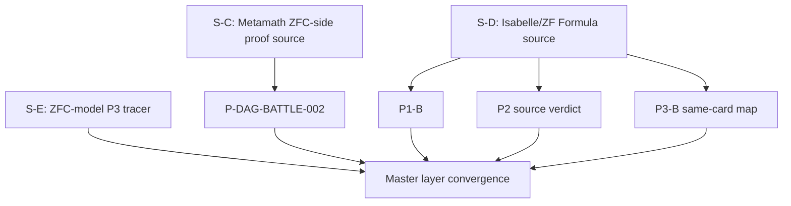

# P-DAG-SOURCE-002 与 BATTLE-002：ZF/ZFC 语法、proof-layer 与 P3 层级分离

> **身份：** `DYNAMIC_DAG_SOURCE_AND_BATTLE / LAYER_INTEGRITY_REFINEMENT / NOT_A_ZFC_Q_RESULT`。
>
> **结论：** `P2_MATCHED_WITH_SCOPE / P1_SOURCE_CARD_NO_Q / P3_SEMANTICS_NOT_SUPPLIED / PROOF_LAYER_ONLY / NO_COMMON_Q`。这一轮为 P2 找到版本固定的 ZF 内部公式—满足—reentry 链，同时用 Battle 将 Metamath proof-system consumer 与 ZFC 对象／实际使用层分开。

## 1. 节点图与运行边界



所有节点以 fresh Codex CLI banner 报告 `gpt-5.6-terra / max / read-only / never`。S-C/S-D/S-E 允许公开一手网页；P1-B/P3-B/Battle节点只消费 frozen source／claim pack。所有已退出 `exit 0`；没有项目写入、递归委派、Git 操作或外部 mutation。

| Node | session | prompt SHA-256 | result SHA-256 |
|---|---|---|---|
| S-C Metamath ZFC-side | `01a0fd3d-a12b-7851-9f56-c9aa1469ed62` | `bb9c7ea6f3b4c4b3f8474e7f1ba19d50ce9ac415eab4bd09321066da39c7e472` | `eab2a8b7d5f6ef2ad4e4b74fca78b911bf4ef547ec1f86efc51489c8216ba85a` |
| S-D Isabelle P2 | `01a0fd3d-a0d6-74e3-8105-e6fed4ff0566` | `906e62358d2201d90239a7fd4e794e6f569e764f9c971adb3cb46ea00602e35e` | `8ebbd3b877979be8b2b7107237978f47dc143c253ff8986fef74502430656303` |
| S-E P3 source | `01a0fd3d-a03d-7ca1-95cb-6fc2d0b4f7e4` | `b2e8029cfd6691eada5615bcb16ee53222dff30d2b21761c4f4b2ba066ef0701` | `fd16b65eb1d7006c84dcb4651e3992186d1ba6341b594a80d5091f73591b9314` |
| P1-B Isabelle | `01a0fd45-dae0-7a31-ba81-d859daa94586` | `6b24b8137b8361bb7389bcafb2414b7bd33fb43ab69168a062ac5ff9754f529f` | `b9469173b421c034698494fd942f8ff40e8819da8f2d48ebea60b28f71ee0832` |
| P3-B Isabelle | `01a0fd4f-fb3b-7531-873b-500e807149b8` | `b7fa3422f9a13db397687f600d461795ef9d98801d5862697dc545c6d1fba474` | `f3379470a1bb2a0062a76b858312ae304efc297bd1e962a0f304357c506352e7` |
| C-A proof advocate | `01a0fd48-9ab9-73c3-a379-4d2a7a5e8a59` | `105cb272538d31267f9189a3754242ff6cf5e2c972576657a94a97658834a854` | `14bb715829578d5b31d3a793fa9a29d16c4c50c0a8bf2f951c3ef0e9d4a8f9c4` |
| C-B object challenger | `01a0fd48-9a7c-72a0-b169-9b08ffefd1e5` | `4bc21e049738748a746ed83a81c7dca51addc1108b8c4fab705f732c2d5871bc` | `c5531e31b97711856fdf9e1a7591c3eb9f6c3a84cb564c484423d2633c8eda07` |
| C-C layer arbiter | `01a0fd4c-2a1d-7d21-bfec-f3172b85d04c` | `3b062e2a51b583c5efda0abef76f761166c046d50aa6dbe712e5420085795093` | `52617892c7eeec7033acffcdb7f548277f94110cc728bdc9515fbcea153fd2d5` |

Scratch prompts/results remain under `/tmp/hott-p-dag-source-002/` and `/tmp/hott-p-dag-battle-002/`; this audit keeps bounded public evidence, not hidden reasoning.

## 2. S-C：Metamath 的 ZFC-side proof consumer

S-C fixed `metamath/set.mm` at commit `160dfc7e4ec5f201f5bae4ca5a5eeb67242902b5` and traced stable labels:

```text
ax-pow → axpow2 → vpwex → pwexg → pwex
```

`ax-pow` is the power-set axiom; `pwex` has formal input `A∈V`, formal output `𝒫A∈V`, and proof-acceptance Done. It therefore qualifies only as `QUALIFYING_PROOF_SYSTEM_CARD`. The source-reader could not byte-replay the 49.1 MB immutable blob and did not run a verifier; labels and commit URL are the locator, not a fresh proof execution.

## 3. BATTLE-002：proof-layer 不跨层提升

The proof advocate correctly established `pwex` as a proof-system C. The object-level challenger correctly pointed out that the card does not name any later theorem/construction taking `𝒫A` as input, semantic client, actual-use consumer, or witness-producing runtime operation. The arbiter gave:

```text
RESOLVED_BY_SOURCE
proof-system C supplied
ZFC object-level / semantic / actual-use / runtime C not supplied
```

This made a new P1 refinement necessary: `L2c / layer integrity`. Every card now labels `C/I/O/Done` as proof system, theory object, semantic actual use, or runtime. A proof-level contract cannot fill another layer without a source-defined target-layer C/I/O/Done.

## 4. S-D + P1-B + P3-B：同一 Isabelle/ZF source 的 P1/P2/P3

Master independently opened the official [Isabelle2020 Formula theory](https://isabelle.in.tum.de/website-Isabelle2020/dist/library/ZF/ZF-Constructible/Formula.html). It imports `ZF`, represents FOL syntax as `formula`, defines `sats(A,p,env)`, defines `Forall` using `Cons(x,env)`, has `incr_bv`/`sats_incr_bv_iff`, and defines the guarded definable-powerset interface:

```text
DPow(A) = {X ∈ Pow(A) | ∃env ∈ list(A). ∃p ∈ formula.
  arity(p) ≤ succ(length(env)) ∧
  X = {x∈A | sats(A,p,Cons(x,env))}}
```

The same source therefore supports a **bounded P2 match**:

```text
represented formula → sats bridge → de Bruijn reindexing/re-entry
→ arity and environment guard
```

It does not supply quotation into own semantic input, a fixed point, a provability predicate, or a ZFC paradox. P1-B classifies `formula/sats` plus `DPow/DPowI` as `QUALIFYING_SOURCE_CARD_NO_Q`: no native nontrivial positive Q and no Done witness are present. Same-card P3-B classifies it as `CONSTRUCTION_SEMANTICS_NOT_SUPPLIED`: `Forall` environment extension, formula recursion, `sats`, `incr_bv`, and guarded DPow are semantic/formula interfaces, not tracked lifecycle state transitions.

## 5. S-E：P3 negative control

S-E inspected a newer fixed Mathlib ZFSet model source and found only a total `powerset` operator plus extensional membership theorem. It supplies no persistent construction identity, lifecycle state predicates, admission/use ordering, transition relation, completion state, or retry criterion. Its conclusion is `NO_QUALIFYING_P3_SOURCE` for that single selected source, not a global nonexistence claim.

## 6. Master convergence

```text
Metamath: proof-system consumer only; L2c prevents cross-layer promotion.
Isabelle/ZF Formula: P1 source card without Q; P2 matched with guards;
                     P3 lifecycle not supplied.
Mathlib ZFSet: static ZFC-model negative control for P3.
MasterVerdict: NO_COMMON_Q / NOT_ZFC_Q_LOCATED.
```

The next permitted node is a source card that gives, in one declared target layer, a native nontrivial Q and a layer-appropriate Done, or an explicit P3 lifecycle source. A mere formula encoder, theorem dependency graph, definition, or theorem checker cannot substitute for those fields.
