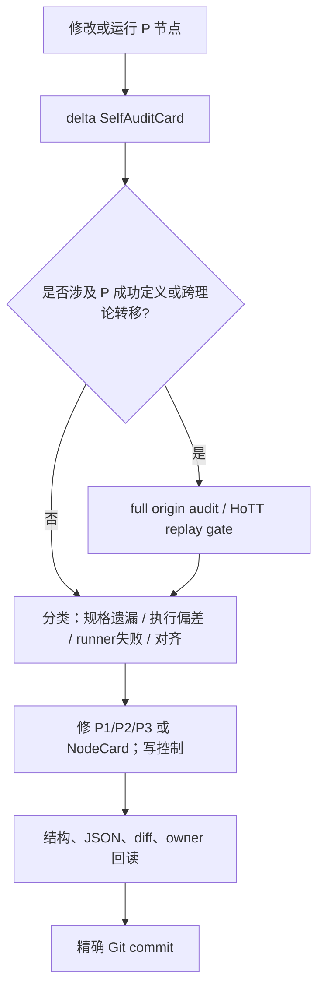

# 模式 P 刀具系统：从原初讨论到连续运行前的逐项对照审计

> **身份：** `FULL_ORIGIN_AUDIT / USER_REQUESTED_SYSTEM_SELF_AUDIT / NOT_A_MATHEMATICAL_RESULT`。
>
> **审计问题：** P1/P2/P3、盲测、来源节点和动态 DAG 的实际锻造，是否忠实执行了研究发起人从“最后一跃”到“三把刀／动态 DAG”逐步提出的理念？发现偏差时，是理念被直接挑战、工具规格遗漏，还是实际执行或运行环境出了问题？
>
> **总判词：** `MIXED_ALIGNMENT_WITH_MATERIAL_EXECUTION_DEVIATIONS`。三把刀的分工、P3 对原始张力的保存、blind controls、MatchTrace、动态 DAG 和来源优先级已经形成可复核实现；但 P 尚未满足“先在 HoTT 无泄漏重放成功、再把冻结版本用于 ZFC 定位”的原初序列。此前把 V1 夹具验收说成“打造完成”亦曾过强，后已由 ZFC 共同会合标准撤回。`P-DAG-SOURCE-003/004` 的超时和连接失败是运行／证据问题，不是理论或 P 的反例。

## 1. 审计范围、来源清点与边界

本审计逐项覆盖“刀具系统尚未出现”到“P-DAG 连续节点运行前”的直接讨论。检索边界是：`sources/prompts/` 中的罗素两批原文，`核心认知.md` 的相关 KC，`dev-notes/0108` 的 7 个 conversation units，`dev-notes/0109` 的 18 个 conversation units，以及本轮用户新增的“系统自审＋Git log”要求。检索词包括 `模式 P`、`三把刀`、`锻刀`、`Power Set/幂集`、`最后一跃`、`一遍匹配`、`Terra`、`MatchTrace`、`动态 DAG`、`Battle` 和 `子代理`。

| Source family | 逐项分母 | 本审计如何使用 |
|---|---:|---|
| 罗素原初计算读法 | KC-000050、KC-000051、KC-000054 | 规定“论域对象的存在性、算符先于存在落定、UR”的原初张力与成功边界。 |
| 后续理论方法原文 | KC-000056–KC-000062 | 规定理论级靶、明显承诺、P-first、工作意识和一遍线索的条件性目标。 |
| `dev-notes/0108` | 7 个 user/assistant conversation units | 记录选靶层级、路线图、Gemini 负控制、结构主义不升级、启发式知识使用。 |
| `dev-notes/0109` | 18 个 user/assistant conversation units | 记录 P0–P6、Power Set 纠偏、HoTT/朴素集合论重放、P2/P3 拆分、三把刀、案例、外部 Terra/Max、MatchTrace 与动态 DAG。 |
| 当前用户目标 | 本线程最新 goal 文本 | 要求继续推进、把有效修订进入 Git log，并新增系统自审。该条尚待本轮 final 后的 dev-notes 归档；此处以当前用户消息为直接输入登记。 |
| 实作证据 | `rulings.md` §2026-10-02、`dev-docs/模式P三把刀/`、`dev-docs/模式P动态DAG调度/`、`audit/20261002-P*`、P-DAG session | 检查真正写入的规格、实际节点与失败收据，不把早先 AI final 的自述当作事实。 |

这不是对全部 HoTT/ZFC 历史、所有 Gemini 文件、所有隐藏思维或所有模型内部路径的审计。它只审声明范围内与刀具系统形成有关的可见讨论和可复核实作。

### 1.1 一一覆盖账本

下表不把相邻的用户轮次静默合并。`§2` 的 O 编号给出完整判断；本表确保每个 conversation unit 都被明确审到，即便几次追问在内容上重复。

| Unit | 直接 locator | 该轮要求的最短复述 | 本次判词 |
|---|---|---|---|
| C00-1 | `核心认知.md` KC-000050 | 论域元素存在性追问与无穷追溯。 | O01，`ALIGNED_WITH_SCOPE`。 |
| C00-2 | `核心认知.md` KC-000051 | 算符不得先于对象存在性落定。 | O02，`ALIGNED_AFTER_IDEA_SPEC_INCOMPLETE`。 |
| C00-3 | `核心认知.md` KC-000054 | UR 及“本来简单”的完成要求。 | O03，`ALIGNED_BOUNDARY`。 |
| C01 | `dev-notes/0108`#L22 | 靶须是理论大厦。 | O04，`ALIGNED`。 |
| C02 | `dev-notes/0108`#L93 | 复核其它 AI 的理论级选靶。 | O04，`ALIGNED`；外部 AI 的排序不替代当前靶。 |
| C03 | `dev-notes/0108`#L175 | 将后续目标讨论完整落盘。 | O05，`ALIGNED`。 |
| C04 | `dev-notes/0108`#L210 | 查 Gemini 的 ZFC 声称能否使用。 | O06，`ALIGNED`：仅负控制。 |
| C05 | `dev-notes/0108`#L277 | 推进同构／表征线索。 | O06，`NOT_DIRECT_BLADE_REQUIREMENT`：保留为消费者控制，未升级。 |
| C06 | `dev-notes/0108`#L357 | 继续 ETCS 消费者方向。 | O06，`DEFERRED_WITH_SCOPE`，未偷换为 ZFC Q。 |
| C07 | `dev-notes/0108`#L433 | 用模型已有知识启发式找 ZFC 线索。 | O06／O10，`ALIGNED_WITH_EVIDENCE_BOUNDARY`。 |
| C08 | `dev-notes/0109`#L22 | 从最后一跃先写罗素 P。 | O07，`IDEA_SPEC_INCOMPLETE_THEN_REPAIRED`。 |
| C09 | `dev-notes/0109`#L145 | 起点必须是明显承诺。 | O08，`EXPECTED_CALIBRATION_FAILURE → ALIGNED_REPAIR`。 |
| C10 | `dev-notes/0109`#L218 | 工作意识进入每次 core 加载。 | O09，`ALIGNED`。 |
| C11 | `dev-notes/0109`#L285 | P 写清后应一遍给线索。 | O10，`PARTIAL_ALIGNMENT`。 |
| C12 | `dev-notes/0109`#L352 | Terra/Max 盲测 P。 | O11，`ALIGNED_WITH_EVIDENCE_LIMIT`。 |
| C13 | `dev-notes/0109`#L444 | 为什么首次没选 Power Set。 | O12，`ALIGNED_AFTER_SPEC_REPAIR`。 |
| C14 | `dev-notes/0109`#L528 | 真正打磨 P；先 HoTT 重放再 ZFC。 | O13，`MATERIAL_EXECUTION_DEVIATION`。 |
| C15 | `dev-notes/0109`#L591 | 脱敏 P 能否识别朴素集合论。 | O14，`ALIGNED_POSITIVE_CONTROL`。 |
| C16 | `dev-notes/0109`#L657 | P1 与逻辑层 P2 并行打造。 | O15，`ALIGNED`。 |
| C17 | `dev-notes/0109`#L748 | P2 是否直接表达原始张力；需要 P3 吗。 | O16，`ALIGNED_AFTER_IDEA_SPEC_INCOMPLETE`。 |
| C18 | `dev-notes/0109`#L865 | 三把刀各有惯性、owner、索引和过程。 | O17，`ALIGNED`。 |
| C19 | `dev-notes/0109`#L918 | 芝诺／圆环怎样校准三刀。 | O18，`ALIGNED`。 |
| C20 | `dev-notes/0109`#L977 | 锻刀必须真的使用外部 Terra/Max。 | O19，`ALIGNED_WITH_EVIDENCE_LIMIT`。 |
| C21 | `dev-notes/0109`#L1040 | 再次追问外部锻打是否真实持续。 | O19，`ALIGNED`，但早期 V1 完成表述过强。 |
| C22 | `dev-notes/0109`#L1095 | 同一问题的第三次外部锻打追问。 | O19，`EXECUTION_DEVIATION_CORRECTED`。 |
| C23 | `dev-notes/0109`#L1145 | 锻打使用了哪些悖论与领域。 | O20，`ALIGNED`。 |
| C24 | `dev-notes/0109`#L1221 | 代理须交详细模式匹配自我说明。 | O21，`ALIGNED_WITH_LATE_REPAIR`。 |
| C25 | `dev-notes/0109`#L1317 | 动态 DAG、分阶段访问、Battle 与 Master SOP。 | O22，`ALIGNED_AFTER_EXECUTION_REPAIR`。 |
| C26 | 当前 thread goal（本轮） | 连续锻造、Git 谱系、系统自审。 | O23，`IN_PROGRESS_ALIGNED`。 |

## 2. 逐项对照

| ID | 原初讨论／要求（定位） | 实作对照 | 判词与原因 | 处置／反证条件 |
|---|---|---|---|---|
| O01 | `KC-000050`：理论不能回避其论域元素的存在性；若追问现实中无穷追溯才是成功。 | P1 的对象／formation／consumer，P3 的 admission-order，L7 的正义务均由此出发。 | `ALIGNED_WITH_SCOPE`：未把静态对象名当成存在已落定。 | 尚无 ZFC 的无穷追溯或 UR；有真实 consumer 的有限完成证据会限制该线。 |
| O02 | `KC-000051`：原始张力是“算符先于存在性落定”。 | P3 的 `Draft/NeedBuild/NeedEval/Admitted/OperatorUse/BuildDone` 状态语言。 | `ALIGNED_AFTER_IDEA_SPEC_INCOMPLETE`：P2/v0 曾把 `Form` 原子化，用户指出后才显式创建 P3。 | P3 必须继续逐边回到 source；若只有静态公理，保持 `CONSTRUCTION_SEMANTICS_NOT_SUPPLIED`。 |
| O03 | `KC-000054`：UR 是“本来简单却在 X 中做不到”。 | L6、L7、同一 I/O/Done、拒绝 false branch 与 `ZFC_Q_LOCATED` 的分层。 | `ALIGNED_BOUNDARY`：系统未把“奇怪表达式”当 UR。 | 尚无 ZFC UR；不能用 site selection、超时或 proof theorem 取代。 |
| O04 | 0108/T1：靶是基础理论，不是醒目的定理或菲尔兹成果。 | 路线图把 ZFC、实数、HoTT、topos 等与论文入口分开；P1 的 L4 约束基础接口。 | `ALIGNED`。 | 若新候选只是局部应用，必须降为控制／来源。 |
| O05 | 0108/T3：分层路线图须完整落盘，供未来工作。 | `dev-docs/菲尔兹奖后续理论级目标路线图`、三把刀索引、P-DAG SOP 和 README/AGENTS 路由已建立。 | `ALIGNED`。 | 路线图不能替代现行 TaskCard 或 user choice。 |
| O06 | 0108/T4–T6：Gemini 幻觉、同构／ETCS 等只能作负控制或待审结构主义问题；模型已有知识可作启发，不作证据。 | Gemini 说法被降为负控制；P source nodes 和 MatchTrace 均要求一手来源。 | `ALIGNED`。 | 若把 Gemini/模型回忆重新升为 ZFC 证据，立即偏航。 |
| O07 | 0109/T1：先深刻刻画罗素 P／最后一跃，再审 ZFC。 | 初版 P0–P6 及之后 P1/P2/P3 建立了对象、追问、上升、预支使用、UR 的序列。 | `IDEA_SPEC_INCOMPLETE_THEN_REPAIRED`：初版把 P 写成单一筛子，未显式分开位置、语言余式和构造时序。 | P1/P2/P3 是修复，不是原初理念被否定；若三刀仍不能落在同卡，P 仍不成熟。 |
| O08 | 0109/T2：P 是放大镜，先找极其明显位置；ZFC 首焦点应为 Power Set。 | 首次 Ord/V 误配后加入 L0–L2；修订盲测无答案选中 Power Set。 | `EXPECTED_CALIBRATION_FAILURE → ALIGNED_REPAIR`。 | `Ord/V` 仍可作元层反控制；Power Set 仅是 site，不等于 Q。 |
| O09 | 0109/T3：后续理念必须像 core 一样持续加载。 | KC-000056–62、扩展认知 012、rulings、Feature 和本轮 Git commit 均已保留。 | `ALIGNED`。 | 文件存在不证明实际使用；每次 SelfAuditCard 检查它是否真改变了选点。 |
| O10 | 0109/T4：P 写对时，应一遍匹配出可检验线索，而非遍历理论。 | 修订 P1 盲测可选择 Power Set；朴素集合论脱敏正控制可定位无限制形成。 | `PARTIAL_ALIGNMENT`：只验证首轮 **site/line索**，尚未一遍定位到 ZFC 的 Q。 | 不能把多轮 DAG、来源和 Battle 说成“一遍成功”；一遍只是发现态。 |
| O11 | 0109/T5：用 Terra/Max、只读、无递归、无泄漏检验。 | 多个 fresh CLI run 有 banner；但 runtime model identity 只有请求／banner，非独立 provider receipt。 | `ALIGNED_WITH_EVIDENCE_LIMIT`。 | provider/runner failure、泄漏或模型字段不符使对应节点失效。 |
| O12 | 0109/T6：Power Set 应被正确识别；没找到说明 P 还没写对。 | Ord/V 偏移诊断后 L0–L2 将首轮选点带回幂集。 | `ALIGNED_AFTER_SPEC_REPAIR`。 | 这只证明 selection gate；若 P1 不能导出 native Q，不能宣称完整预期已满足。 |
| O13 | 0109/T7：真正要打磨 P；先无泄漏重放 HoTT，成功后才以冻结 P 看 ZFC。 | HoTT 进行过盲重放和多个 controls；但尚未重放到既有 HoTT 主线的共同 Q，反而多次停在人工 extension、单向 interface 或无 native consumer。ZFC 却已进入 source/Battle 共同锻造。 | `MATERIAL_EXECUTION_DEVIATION`。原初理念尚未被反证；执行顺序被提前。 | 新增 `HOTT_REPLAY_CALIBRATION_REQUIRED`：在独立 HoTT replay 未达成前，ZFC 只可作校准／control/source boundary，不得升级为 `ZFC_Q_LOCATED`。 |
| O14 | 0109/T8：去掉历史名称后，P 应能定位朴素集合论问题。 | 脱敏无限制理解卡定位到有限负极性规格冲突；有界形成是 guard control。 | `ALIGNED_POSITIVE_CONTROL`。 | 这只证明 P2 逻辑形状；不等于 P3 admission cycle，更不外推到 ZFC。 |
| O15 | 0109/T9：P1 与 P2 应有不同打造思路，P2 用计算—逻辑翻译。 | P1 与 P2 拆成独立 owner、IR、control 和 failure taxonomy。 | `ALIGNED`。 | P2 source 匹配若没有同卡 P1/Done，只是语言线索。 |
| O16 | 0109/T10：P2 若没直接表达计算张力，就需要 P3。 | P3 被创建，且明确禁止从静态公理／环境递归伪造 lifecycle。 | `ALIGNED_AFTER_IDEA_SPEC_INCOMPLETE`。 | P3 仍未在 Power Set 找到真实 transition；这不是 P3 不必要的证据。 |
| O17 | 0109/T11：三把刀各有惯性，独立文件、总索引与横向过程必须持续更新。 | 001/002/003、总索引、004 顺序过程、005 校准、009 会合标准、010 MatchTrace 已存在。 | `ALIGNED`。 | 后续修订必须同时写触发、三刀影响、边界、反证和下一实验。 |
| O18 | 0109/T12：芝诺、圆环与朴素集合论应按机制校准，不能强迫三刀同型命中。 | 案例矩阵让 P2 对芝诺／圆环不适用，P1/P3 负责前提／完成过程。 | `ALIGNED`。 | 若 P2 为了命中硬造 feedback，或 P3 从静态卡造状态机，即偏航。 |
| O19 | 0109/T13–T15：锻打不能只写文件，必须使用独立 Terra/Max；V1 不能凭文件数宣布完成。 | 实际使用 external CLI fixtures、CFTT/Climber/Delay controls；但早期 AI 回复曾把 V1 说成“全部打造完成”甚至结束 goal。 | `EXECUTION_DEVIATION_CORRECTED`：用户随后规定锻刀与 ZFC Q 定位同一过程。 | 009 是唯一成功 owner；V1 只保留为回归夹具。 |
| O20 | 0109/T16：明确锻打使用哪些悖论与对应理论领域。 | 005 将朴素集合论、芝诺、圆环、HoTT、ZFC、CFTT、Climber、Delay 分成靶、正负控制与非目标 source。 | `ALIGNED`。 | 控制 source 不得升级为目标理论结论。 |
| O21 | 0109/T17：代理必须详细说明为什么定位在那里。 | 010 的 E0–E7、相邻候选、反事实、L2b/L6/L7 与 L2c 已落地。 | `ALIGNED_WITH_LATE_REPAIR`。 | 无 MatchTrace、无 terminal output 或跨层 Done 的节点不能驱动会合。 |
| O22 | 0109/T18：刀具可以动态 DAG，节点级访问、Battle、Master 质询；SOP/Skill 要在 README/AGENTS 可发现。 | P-DAG Skill/SOP、access profiles、Battle-001/002、sources and runner taxonomy、routing 已实现。 | `ALIGNED_AFTER_EXECUTION_REPAIR`。 | SOURCE-003 没预封存 NodeCard 是实际偏差，已以 prelaunch receipt/deadline/partial-output policy 修复；SOURCE-004 runner failure独立登记。 |
| O23 | 当前 goal：持续推进、有效磨刀进 Git；对原初全过程系统自审。 | commit `935606e8` 已保留初次工具／证据；本文件和 SOP-005 提供完整审计。 | `IN_PROGRESS_ALIGNED`。 | 本审计尚未等于未来持续行为；每个自然单元须做 delta audit 并精确 commit。 |

## 3. 哪些不对齐来自理念，哪些来自实践

### 3.1 不是原初理念被推翻的情形

1. **首次 Ord/V 偏移。** 它表明当时的 P 缺 L0–L2，并不反证“清晰 P 可一遍产生线索”。修订盲测选中 Power Set 是有限正证据。
2. **P2 漏掉原始时序。** 用户的 P3 建议不是否定 P2，而是指出 P2 的职责只应是逻辑余式；P3 因而成为独立刀具。
3. **SOURCE-003 超时和 SOURCE-004 连接失败。** 它们发生在获取／运行层，尚无模型输出和来源结论，不能评价 P 或 ZFC。

### 3.2 实践中不该发生、且已产生纠偏的情形

1. **HoTT replay gate 被提前越过。** 原初序列说先成功重放 HoTT，再冻结 P 投向 ZFC；实际先做了多项 ZFC source/Battle 工作。虽然所有 ZFC结论都保持 `NOT_ZFC_Q_LOCATED`，这仍使“P 已经通过 HoTT 校准”的暗示不成立。
2. **V1 被过早称为完成。** 夹具与 external classifications 只能证明三把刀有局部刀刃，不能证明它们共同定位 ZFC Q。009 已把成功定义原位纠正。
3. **第一次动态来源节点没有启动前落盘。** SOURCE-003 的 timeout 使这一缺口可见；NodeCard 现在要求 source/prompt identity、allowlist、deadline 和 partial-output policy 在启动前封存。
4. **proof-system contract 曾有跨层提升风险。** SOURCE-002/BATTLE-002 使 L2c 明确：proof-level C/I/O/Done 不得填充 semantic or runtime layer。
5. **发现与验证曾被同一 gate 吞并。** HOTT-REPLAY-002 正确因 source 缺 consumer 而返回 `SOURCE_INSUFFICIENT`，却因此没有测到用户所说的一遍发现。该问题是当前实现的 `IDEA_SPEC_INCOMPLETE`，已修为 `P-DISCOVERY → source tracer → P-VALIDATION`，不构成 P 的反证。
6. **发现阶段仍可回落到元语言。** HOTT-DISCOVERY-004 在无泄漏下给出了 `Type_n`／universe-index preservation 线索，但 Q? 不是 prospective native task。该问题促成 D-L5/native-task anchor；它显示当前 P 尚未成功重放 HoTT线，而不是证明“一遍发现”原理失败。

### 3.3 尚不能裁定的情形

1. P 是否最终能在 HoTT 盲重放中重定位到用户已认可的实际 Q；
2. P 是否在 ZFC 上能一遍定位一个比 Power Set site 更完整的 Q；
3. 是否需要第四把理论刀具。当前所有新增问题都属于 P1/P2/P3 规格、证据层或调度层，尚无独立理论职责与控制，故 `P4_NOT_WARRANTED`；
4. Terra/Max 的运行时身份是否可独立认证；目前只保留 CLI banner 和请求字段边界。

## 4. 立即生效的纠偏

1. **HoTT calibration release lock：** ZFC 的 source/control 可继续用于界定工具，但 `ZFC_Q_LOCATED`、ZFC UR 或“P 对 ZFC 成功”的任何升级，必须等待一个独立、无泄漏、来源与同一任务受控的 HoTT replay 达到当前 agreement predicate。
2. **node launch health：** 先有预封存 NodeCard；runner 连接失败或未输出时停止，记录环境失败，不能自动重试扩大范围。
3. **no fourth knife by infrastructure:** source sealing、timeout、connection、Git、层级与 MatchTrace 都是 P-DAG 的证据合同，不是新的数学刀具。
4. **Git history:** 每次有效纠偏都必须以 exact paths、验证结果和 commit 进入历史；`935606e8` 是前一自然单元的基线，当前审计完成后形成下一笔精确 commit。
5. **Discovery before validation:** 无泄漏 discovery trace 可以提出 `MODEL_RECALL_SITE_CANDIDATE`，但不得填 C/I/O/Done 或共同 Q；验证卡才运行 L0–L7 和 P2/P3。这补回“一遍先产生线索，后回原典”的原初次序。

## 5. 审计结论的证据边界

本审计支持的是对**项目方法及其实际可见运行**的结论：哪些要求已被实现，哪些规格／执行问题已被承认和修复，哪些问题仍开放。它不支持 ZFC 不一致、HoTT 内部问题、UR 已发现、模型内部认知机制、或未来任何 agent 必然按 P 找到目标的结论。

## 6. 审计后的 delta：HOTT-DISCOVERY-005 对原初理念的回测

H-005 是 full audit 之后的第一张 D-L5 regression card。它直接检验 O10 的“一遍发现线索”、O13 的“先 HoTT 校准”、O16 的“P3 不应由普通静态规则伪造时序”，以及 O21 的可复核 MatchTrace 要求。

| 原初要求 | 实际行为与证据 | 本次判词 | 对刀具系统的影响 |
|---|---|---|---|
| 一遍发现应先产生可检验线索，而不是已验证结论 | 无泄漏 Terra/Max output 产生 `e:A≃B ⟼ p:A=B` 的候选；详见 `audit/20261002-P-DAG-HOTT-DISCOVERY-005-Terra-Max.md` §1–2。 | `ALIGNED_WITH_SCOPE`：它是线索而非结论。 | D-L5 的 discovery 守门有效。 |
| HoTT replay 必须回到理论自己的任务 | Q? 是等价使用／路径形成任务，而非 universe annotation。 | `ALIGNED`。 | H-004 的 `DISCOVERY_META_LAYER_CAPTURE` 被实际排除。 |
| P 不能把规则已经给出的操作写成“最后一跃” | Book source 给出 `ua` 为 `idtoeqv` 的 inverse。 | `IDEA_SPEC_INCOMPLETE → REPAIRED`：L6 正确阻止过早提升，H-005 随即驱动 discovery-stage D-L6。 | D-L5、D-L6 与 L6 分别阻止元层、直接偿付和完整来源下的平凡 Q；不创建 P4。 |
| 先 HoTT 后 ZFC 的次序 | H-005 未释放 HoTT replay gate，也没有改变任何 ZFC Q 状态。 | `ALIGNED_WITH_GATE`。 | ZFC 继续仅作 calibration/control。 |

这次结果没有直接挑战“清晰的 P 应能一遍产生可检验线索”的条件性理念：它确实产生了一个满足 D-L5 的线索。它也没有完成该理念的更强实践检验，因为该线索在原典中立即闭合，尚未重定位既有 HoTT 的实际 Q。下一个 HoTT node 必须更换 packet，不能通过重复运行同一薄 packet 来制造表观成功。
