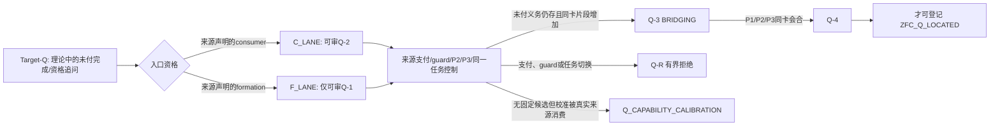

<!-- governance-shard:v2
logical_id: P_FORGE_PQ_WARGAME_AUDIT
shard_id: 016
index: ../20261003-P-FORGE-PQ-WARGAME.md
-->

# R14 全过程综合与未来锻造地图

> **状态：** `COARSE_NATURAL_UNIT_AUDIT_COMPLETE / ATOMIC_NODE_AUDIT_REQUIRED / P_Q_CO_FORGING_METHOD_SUBSTANTIATED_WITH_SCOPE / ZFC_Q_NOT_LOCATED`。

## 1. 综合范围与禁止外推

本片只综合已经逐轮封存的 R00--R13；它不重做其中任何一轮，也不从综合文字创建新的 ZFC、HoTT 或集合论
数学结论。每一轮的直接来源、精确卡和反事实仍由各自 shard 拥有。

### 1.1 计数口径

本 campaign 的 **审计卡** 是 15 张：`R00` 至 `R14`。其中只有 `R01` 至 `R13` 是按当前证据地图切分的
**13 个粗粒度自然锻造单元**；`R00`是锻刀前的原初目标／历史分母基线，`R14`是所有单元封存后的综合，二者
都不应被算进“实际锻打了多少轮”。

用户随后追问实际锻打轮次，暴露了本片原先的范围错误：13 个宏观单元不能替代原子 P-DAG 执行单元。当前可核的
下界是 69 个编号节点 `H007`--`H075`，另有至少 10 个早期、非 H 编号的独立外部 session（4 个初始 fixture
session、3 个 Delay session、2 个 CFTT session、1 个 Climber session），故已知至少有 79 个命名执行单元。
这还不是精确原子分母：Battle、source、health、preflight与一个报告内可能包含的多个terminal run必须逐一去重。
R15负责冻结精确 ledger；在它完成前，本片只是一份**13 单元的粗粒度综合**，不得宣称“已审计全部实际锻打轮次”。

本次审计真正回答的是一个方法问题：**“锻刀”是否已经在实际工作中服务于候选 Q 的生成、收紧、桥接、淘汰或
防误报，而不是单独积累工具？** 它不回答“ZFC 是否有矛盾”“Power Set 是否正确”“模式 P 是否必然会发现Q”。

## 2. 总判词：道路在哪些意义上正确，哪些意义上尚未兑现

```text
P/Q共同锻造的方法要求       = 已在 13 个粗粒度自然单元 R01–R13 中被逐轮消费并留下可审计收据
发现能力的受控校准           = 已有正／负 fixture、真实 source control 与 HoTT replay 的支持范围
对 Power Set 的理论 Candidate-Q = 尚未生成；状态仍为 Q-0 UNFORMED
ZFC_Q_LOCATED                = NO
新刀具 P4                    = NO
Power Set station            = STATION_EXIT_REVIEW_PENDING
```

所以有两层结论，不能合并：

1. **方法层已前进。** R01--R05 使夹具、Target/Candidate/Control-Q和双激活通道具有明确职责；R06--R12
   把外部证明搜索、裸全子对象、provenance、rank、语法自指、有限桥和已支付反射定理排除为不同的控制类型；
   R13又证明CAL、来源层、station和Q link确实改变了这些材料的可接受判词。
2. **理论发现尚未发生。** 这不是“未发现所以ZFC安全”，也不是“已经在逼近所以Q必然存在”。在已审来源分母中，
   没有同一Power Set卡同时给出未付义务、同层任务、P2/P3来源片段和相称控制。



R00--R13 的主要产出是在图中的入口、支付、guard、任务切换和校准节点上建立了可重复的判断；没有跳过中间
节点把它们写成 `Q-4`。

## 3. 审计留下的资产：已采纳的工具合同

| 来源财富 | 当前身份 | 已被什么轮次消费 | 仍不说明什么 |
|---|---|---|---|
| `WQ-0001`：Target-Q／Candidate-Q／Control-Q分离 | `ACCEPTED_METHOD_REPAIR` | R03 HoTT chain、R04--R12各种control卡 | 任何Control-Q本身是ZFC Q。 |
| `WQ-0002`：有严格字段的`Q_CAPABILITY_CALIBRATION` | `ACCEPTED_METHOD_REPAIR` | R02真实source、R07 RK-0、R10 syntax self-reference | fixture成功已发现理论Q。 |
| `WQ-0004`：`C_LANE/F_LANE` | `ACCEPTED_METHOD_REPAIR` | R06外部proof-search、R07 bare all-subsets | 明示formation自动产生Q-1。 |
| `WQ-0010`：`ConstructionBridgeCard` | `ACCEPTED_METHOD_REPAIR_WITH_FINITE_CONTROL` | R11 finite `Finset.powerset`正负控制 | 有限程序构成任意ZF Power Set的完成证据。 |
| `WQ-0003`：三刀角色向量 | `HYPOTHESIS_RESTRICTED` | R03的HoTT A向范围判词、R04的activation gate | ZFC B向可降低P2/P3的正向要求。 |

这些合同是本次“锻刀＝发现Q”最具体的成果：它们不是另造的治理装饰，而是把先前会互相污染的输出分开。

## 4. 未来财富地图：可检验方向，不是已启动任务

下表把所有仍开放的 `Wealth` 按未来卡必须先满足的证据责任重新编组。所有条目目前均是
`HYPOTHESIS`；没有一项因进入表格而获得 node、网络、worker 或 `/goal`启动权。

| 候选方向 | 来自 | 首个必须冻结的事实 | 最小反控制／停止条件 |
|---|---|---|---|
| **F-lane 未付 formation**：`P(a)`形成之后仍有同一对象的completion／qualification／self-ascent追问 | `WQ-0005`, `WQ-0007` | 版本固定的`u/F`、非存在重述的追问、negative/ascending bridge或未付Done、后继P2/P3／consumer来源 | definition/guard直接支付，或来源显示该追问已换任务。 |
| **理论内部的计算／时间张力**：pending、operator、admission、completion或结果回流 | `WQ-0006` | 目标理论**自身**声明的状态／操作，不是外部proof search | 外部枚举、编码、halt或墙钟时间一律留作层次反控制。 |
| **provenance-sensitive consumer**：snapshot压缩后仍必须回答continuation versus reconstruction | `WQ-0008` | 明确projection、consumer、输入／观察／Done，以及不同lineage必须给不同答案 | history-preserving representation若可在同一任务完成，或消费者本不需要历史，立即拒绝。 |
| **受界对象层 formation 的实际消费者**：Replacement／class abstraction等 | `WQ-0009` | 保留domain/rank边界后，真实consumer仍显出未付completion | `V`总体、静态rank或无consumer的规则叙述不能重开。 |
| **非有限同一任务 ConstructionBridge** | `WQ-0011` | TheorySide→BridgeSource→ProcessSide在representation、input、operation、observation、Done五项同一 | 任一字段变化即为`INTERPRETATION_BRIDGE_TASK_SWITCH`。 |
| **独立基础接口的来源存活** | `WQ-0012` | 盲态site经来源检验后仍有active positive obligation，且越过仅proof package层 | theorem Done、仅L-B来源或任务改变时止于CAL-2 control。 |
| **新合同的行为检验** | `WQ-0013` | 一张fresh、答案未预置、输入合同合格的ForgeIntent | 若只能填字段，既无Q状态变化也无固定卡防护，重开方法修订。 |

它们不是七个同义的“再搜ZFC”命令。它们分别要求 formation、consumer、逻辑再入、构造桥、来源层和方法行为的
不同证据。多把刀的价值正是使这些不同方向不能互相代填。

## 5. 已关闭或暂时封存的伪入口

以下不是“永远不许研究”的主题；它们是在这次版本固定分母中已经得到明确停止条件的回归控制：

| 伪入口 | 为什么在当前范围内关闭 | 重新开启需要什么 |
|---|---|---|
| 历史AI的外部proof search、编码与halt | 不是目标理论的consumer或formation，P2/P3缺同对象再入／准入语义。 | 目标理论内同一任务的state、consumer或formation来源。 |
| bare all-subsets、rank、Foundation、bounded fixedpoint | 当前来源分别给正向bridge、lower-rank或domain guard，没有未支付剩余。 | guard保留后的active Q、negative reentry或P3 transition。 |
| `V`总体／无最终层叙述 | proper class/semantic totality不等于对象语言set或task。 | 同层对象、consumer与Done的来源。 |
| 历史身份／忒修斯类比 | 没有source-defined的history-sensitive consumer；NFA显示某些endpoint abstraction正确。 | 同一任务下provenance仍不可替代的Done。 |
| 静态 diagonal／已完成reflection theorem | 有语法层自指或proof Done，不等于active unfinished task。 | 同层未支付任务、P2反馈或P3 lifecycle。 |
| finite `Finset.powerset` | 有限bridge完整，但任意／无限ZF set改变任务。 | 非有限五字段同一的ConstructionBridge。 |

## 6. 最终自审与恢复条件

这轮全过程审计把“锻刀与发现Q是一件事”落实为一个可审计、但非自动化保证的结论：

```text
已做到：每个历史自然轮次都被判为校准、Q生成/收紧/淘汰、Q安全修复，或工具漂移风险；
        每次方法修订都被要求说明保护或改变哪张卡。
尚未做到：在ZFC Power Set上产生Q-1、Q-2、Q-3或Q-4；
不能声称：P已写完、ZFC无问题、Power Set无问题、或未来worker必然命中。
```

如果研究发起人随后恢复 `P-FORGE-SOP`，第一动作不应是从这张路线图任选一个词，而应先冻结一张
`ForgeIntent`：Target-Q、Candidate-Q、Control-Q、C/F lane、来源层、CAL、station影响、同一任务反证与停止条件
必须齐备。它只有在进入本片第4节某条方向的精确证据条件后才可启动。当前 `P-FORGE-SOP` goal保持暂停。
