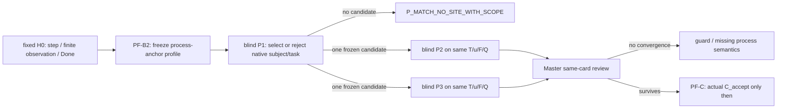

# H0→Z0 Pattern-First PF-B2：H0 过程锚点再审

> **身份：** `MASTER_METHOD_REFINEMENT / PF_B2 / CANDIDATE_NOT_CURRENT / Q_SAFETY_REPAIR / NOT_A_ZFC_Q_OR_MATHEMATICAL_CONCLUSION`。
>
> **Goal：** `01a106f7-75c0-7dd0-b135-63d0393bd6cf`。
>
> **父方案：** `H0-Z0-PATTERN-FIRST-CONVERGENCE-SOP`，PF-0、PF-B、PF-1。
>
> **触发证据：** PF-B R1 的同 profile 三刀结果，以及 fixed Cubical Agda `QuestioningDelay` 的 C-77／C-78 形式规格。

## 1. 再审的问题

PF-B R1 的匿名集合基础 profile 让 P1 重新看见了 formation 邻域，却没有让 P2 或 P3 保留同一张卡。这个结果不能直接说明 ZFC 已经防住模式 P，也不能说明三把刀失效。必须先问一个更窄的问题：**该 profile 是否真的给出了 H0 用作反向样本时不可省去的过程锚点？**

这里的“过程锚点”不是泛称“有无穷对象”或“可写出一个自然数序列”。它是理论画像中已经声明、可被后续来源核验的过程结构：对象、重复操作、局部可观察步、过程范围的 Done，以及有界正控制之间的关系。

## 2. H0 实际固定了什么

`QuestioningDelay` 的形式范围固定了如下事实：

```text
u       = Type ℓ-zero
F       = 对每个 h-level 依次提出问题的 question / askFrom
J(k)    = Judge 对第 k 问给出 yes 或 no 及其证明
step    = no 时 later 进入下一问；yes 时 now k
Done    = 返回 now k，即交出一个有限的 settled level
observe = runFor n 的有限燃料运行
negative = 对宇宙的每个有限 fuel 都没有输出，且程序等于 never
control  = 有上界的 catalogue 恰在界处停；Lean 的事实式相等第 1 问停
```

这并不把 H0 误读成一个 P2 负性回代或 P3 准入循环。固定 H0 的 P2/P3 结果本身可以是“不适用”或“不是 admission cycle”。它提供给 PF-B 的反向约束是：**若声称一个 ZFC formation site 与 H0 的“完成观察”同形，必须至少能说清被追问的理论原生过程如何逐步运行、什么算该过程的完成，而不能只给静态闭包和外加的时间叙事。**

## 3. PF-B R1 的画像缺了什么

| H0 过程锚字段 | PF-B R1 的 all-subcollections 画像 | 结果 |
|---|---|---|
| `PA-1` 具体理论 subject `u` | 有：给已承认的 `a` 形成新的全子对象对象。 | 只定位 formation 邻域。 |
| `PA-2` 声明的原生 operation `F` | 有：形成及可再次输入的闭包轮廓。 | 不能单独给出一个运行任务。 |
| `PA-3` 声明的局部 step / judgment / finite observation | 没有。 | 不能合法形成与 `runFor` 类比的 process-wide question。 |
| `PA-4` 同一 process 的明确 Done | 没有。 | `F(u)=u` 是 worker 提出的 prospective equality，不是画像已给的完成义务。 |
| `PA-5` 有界正控制 | 没有。 | 不能区分“过程未付清”与“只是无穷层级描述”。 |
| `PA-6` 后续 consumer 或其 prospective 原生类别 | 没有可验证 contract。 | P2/P3 不得由 P1 的 formation lead 补造。 |

因此，PF-B R1 的 P2/P3 无候选是对该画像的正确约束：`a → F(a) → F(F(a))` 是 schematic ascent，不是同一对象的 process/reentry 或 source-defined lifecycle。把它解释成 ZFC 的过程防线，会把 profile 缺失误报为理论结论。

## 4. PF-B2 的冻结约束

下一张来源脱敏 profile 必须同时给出下列信息，且不得在输入中泄漏 ZFC、Power Set、`ω`、既有 NodeCard、论文、项目答案或一个预设 Q：

1. 一个 classical first-order foundation 已原生交付的、具体而显眼的 subject/interface；
2. 该 interface 已声明的 base／step、递归／归纳、形成或判断 operation；
3. 一个不能缩成单一局部真值查询的 **process-wide** completion question 与 provisional Done；
4. 一个有限或有界的邻近 control，使“存在 totality”与“某一过程完成”不被混同；
5. 对候选来源/consumer/P2/P3 的明确未知标记；没有被 profile 声明的 checker、scheduler、证明器或现实时间线不得由 worker 发明。

这不是把 `C_accept`、H0Map 或 AdequacyLift 偷塞进发现输入。它只是让发现输入有能力表达为何一个候选的 Done 可能不同于“一个静态对象已被公理交出”。

## 5. 接力、控制与停止



- **P1 first.** 它必须得到 `MODEL_RECALL_SITE_CANDIDATE`，或明确返回无候选。无候选是本轮的有界结果，不能用第二个临时 profile 覆盖。
- **P2/P3 contingent.** 只有 P1 留下一个冻结的 `T/u/F/Q/I/O/Done` 父卡后，二者才可使用相同卡接力。它们各自可以正常给出 guard 或 `CONSTRUCTION_SEMANTICS_NOT_SUPPLIED`。
- **有限控制。** 显式有最大阶段的 closure、formation rule 对 Q 的直接支付、或缺少 source-declared process/Done，都是能够关闭候选的正当控制。
- **来源与机器化仍后置。** PF-B2/PF-1 不产生 `C_accept`、H0Map、AdequacyLift、ZFC Q 或任何 bare-ZFC 判词。

## 6. QConvergenceLink 与可推翻条件

```text
Target-Q     = H0→Z0 的 source-defined completion-observation candidate
Candidate-Q  = UNSET
Current delta = Q_SAFETY_REPAIR
Reason        = 防止将 formation-only profile 的 P2/P3 空结果误读为理论防御
Not a delta   = Q_GENERATE / Q_BRIDGE / Q_CONVERGE
```

PF-B2 会被下列任一结果推翻或收缩：

1. 新 profile 的 P1 不能在不发明未声明 operation 的条件下指出理论原生 process-wide task；本轮停止为 `P_MATCH_NO_SITE_WITH_SCOPE`。
2. P1 选中位置但 P2/P3 的同卡复核显示只有普通 ascent、直接付款或缺 source-defined lifecycle；该卡按 guard 关闭，不进入 PF-C。
3. 版本固定的来源显示 candidate 的实际 consumer 已直接支付相同 Done；该卡成为 `SOURCE_DIRECT_PAYMENT_CONTROL`。
4. 若新 profile 仍无法忠实表达 H0 所需的 subject/step/observation/Done 区别，才重新审视这套锚字段是否足够；不能因一次模型输出不理想而新增第四把刀。

## 7. Master 判词

```text
PF_B_R1                  = P_MATCH_RELOCATES_FOUNDATION_FORMATION_SITES_ONLY
PF_B2                     = IDEA_SPEC_INCOMPLETE / Q_SAFETY_REPAIR
new-profile status        = READY_FOR_ONE_P1_BLIND_DISCOVERY
P2/P3 status              = BLOCKED_ON_FROZEN_P1_PARENT
PF_C                       = BLOCKED_ON_SURVIVING_SAME_CARD_CANDIDATE
Z0_CANDIDATE              = NOT_YET
ZFC_Q_LOCATED             = NO
```

这份再审保证工作重新朝向 H0 的实际程序性质，而不是把 H0 只当作“无限”或“时间”两个词的装饰性类比。它不改变主路线：`H0 → P-first → surviving candidate → actual C_accept → H0Map/AdequacyLift → only then formalization`。
