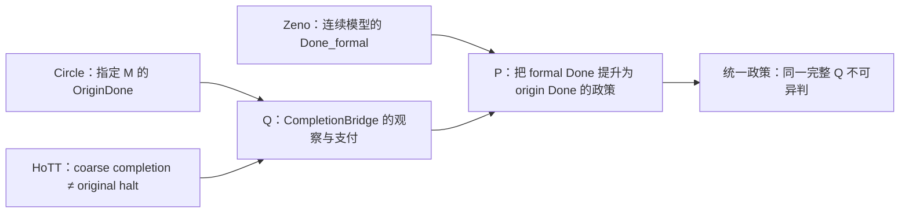

# ZFC 实际 Q 收敛阶段：形式链、来源链与当前判词

> **身份：** `CANDIDATE_BRANCH_RESEARCH_CLOSURE / FORMAL_AND_SOURCE_CONVERGENCE / FORMALIZATION_CLOSED_WITH_SCOPE / NOT_A_BARE_ZFC_INCONSISTENCY`。
>
> **范围：** worktree 编号 `02` 的 branch `dev-02` 上的 C-359 至 C-365、芝诺来源完成政策、用户圆环的受限 ABX 合同、fixed Cubical Agda HoTT Q，以及已冻结的 HoTT 创建动机文献回流。它总结一轮收尾，不改 canonical `dev` 的 current truth。

## 1. 已经收敛到的 ZFC 问题位置

研究发起人提出的“ZFC 的时间维度观察力不完备”现在可以用一条比“ZFC 不能表达时间”更精确、也更能被反驳的句子表达。C-359 至 C-365 的 exact theorem、运行、反控制和外部前提已在[形式化与机器证明收尾矩阵](20261004-ZFC-FORMAL-CLOSURE-MATRIX.md)逐项闭合：

> **完成桥观察边界 Q：** 当 ZFC 支撑的子理论或来源要把一个模型中的 `Done_formal` 当作原过程的 `Done_origin` 时，基础语言、子理论定理和来源验收必须显式给出原任务、允许操作、观察与完成谓词之间的 bridge。若这个 bridge 没有进入合同，ZFC 的成员语言和数学结论本身不会替使用者决定它。

这个位置正好把四条线接在一起：

| 线索 | 它贡献的不是口号，而是哪个字段 |
|---|---|
| 芝诺 | `Done_formal`（级数／连续模型）和“跑者到达目标”的来源政策可以分开记录。 |
| 圆环 | `OriginDone` 不能退化成“有一个同胚／紧化对象／端点参数”；至少要保留此前 M、指定反向过程和来源／闭图观察。 |
| 罗素的计算视角 | 形成、使用与完成不能只看结果；“已经有对象／已经完成”的交接本身是需要审查的计算／资格步骤。 |
| HoTT | fixed `QuestioningDelay` 给出一个原生内核反例：粗 completion 不能反射回原问题的有限 halt。 |



这不是 `ZFC ⊢ False`。它是对“ZFC 作为基础被实际用来验收一个子理论完成结论时，究竟有没有审查原过程完成桥”的基础政策问题。

## 2. 七个已机器检查的部件

| Claim | 已证明的精确内容 | 对收尾的作用 | 禁止外推 |
|---|---|---|---|
| C-359 | 显式 `ZFCOneUse + PolicyScopeWitness + B` 导出 `False`；`TaskEquiv` 是严格 scope 的充分控制；Q gap 本身不推出 P。 | 将用户的 `ZFC-1 + P + B` 逻辑写成可见前提。 | 不证明实际来源或 bare ZFC 有这个 use-model。 |
| C-360 | fixed Cubical Agda Q 的截断 stage-one completion 不推出原 universe Q 的有限 halt。 | 给 B 一个原生 HoTT 数学控制。 | 不证明它就是圆环／芝诺同一任务。 |
| C-361 | \(1-2^{-n}\) 的极限不推出某个有限自然数阶段 endpoint；闭连续时间 endpoint 正控制同时成立。 | 排除“极限必等于有限步骤到达”与“无末阶段必无连续 endpoint”两种误读。 | 不把严格 finite Done 塞回 Standard Solution。 |
| C-362 | membership-only theory 对未定义的 `originDone` 无法选择真值；同一 `CompletionBridge` 会唯一决定它。 | 形式化 Q 的最小语言边界。 | 不证明 ZFC 无法定义时间或没有模型。 |
| C-363 | 相同完整 QProfile 的 `originalResolved`／`bridgeRequired` 异判推出 `¬ QUniform`；bridge payment 不同的粗 profile 可合理异判。 | 形式化“同 Q 异判”这一终局政策判词和必要反控制。 | 不填实际 Zeno／圆环／HoTT profile。 |
| C-364 | 保留 `member/input/step/observe/formalDone` 的 base/subtheory model，在有 formal witness 时仍有 `originDone=false` 的保字段反模型；paid bridge 加 formal adequacy 可推出 P。 | 机器证明 P 是未付 bridge 时的额外加项，而非 base/subtheory 的语义后果。 | 不编码实际 ZFC 或来源。 |
| C-365 | 最小一阶成员 language 的每个 `=`／`∈` 公式和同语言 theory 都对 external Done 不变；同 theory 可有相反 Done expansion。 | 给 C-362/C-364 的语言边界补上显式公式语义与归纳证明。 | 不把最小 fragment说成完整 ZFC schema。 |

七项 source、receipt、matrix 与版本闭合都在当前 branch 的 `HoTT/CLAIM_EVIDENCE_MATRIX.md` 和 `HoTT/verification/PROOF_VERSION_CLOSURE.json` 中登记；选定 package 的 Git 版本闭合已通过。

## 3. 来源链现在真正证明了什么

### 3.1 Zeno 侧：有局部政策，不是空白

[IEP 的 Standard Solution](https://iep.utm.edu/zenos-paradoxes/) 将收敛、actual infinity、连续物理路径、正的有限速度和跑者在有限时间到达目标连在一起，并明确回答没有 final step 不妨碍完成。 [SEP 的 *Supertasks*](https://plato.stanford.edu/archives/sum2026/entries/spacetime-supertasks/) 与 [Norton 的分析](https://sites.pitt.edu/~jdnorton/teaching/paradox/chapters/Zeno/Zeno.html)则明确区分“执行最后 action”与“做完每个 action”。

所以 `P_Zeno-source` 已经不是假设：在来源自己的连续 runner task 中，确有一项 local completion policy。它的前提也不是隐藏的：连续模型、时间结构、actual infinity、所采用的完成定义和科学 adequacy 都被来源说明或保留为争议。

### 3.2 圆环与 HoTT：没有被该政策收进来

用户圆环的最小受限合同已经在 ABX 中用 `RealCircle/east/StrongPuncture/OpenRealInterval/RichCurve` 与 `Done_weak / Done_strong` 形式化。该合同要求的不只是末态空间同构，而是指定来源闭图／过程观察。它仍是部分代理，完整现实 `OriginDone` 需要用户定义进一步裁定。

当前来源没有把 Standard Solution 的 runner policy 扩张到这个圆环合同，也没有把它扩张到 fixed `QuestioningDelay` Q。四组定向网页检索也没有发现这样的直接 source；这只给出 `NO_DIRECT_CROSS_CASE_POLICY_SOURCE_WITHIN_DECLARED_QUERY_SET`，不是全体文献的不存在证明。

Diezel 与 Goncharov 2020 的 [*Towards Constructive Hybrid Semantics*](https://drops.dagstuhl.de/storage/00lipics/lipics-vol167-fscd2020/LIPIcs.FSCD.2020.24/LIPIcs.FSCD.2020.24.pdf)是重要的邻接控制：它在 cubical Agda／高阶类型理论中明确将 Zeno behaviour 与连续时间作为需要建模的语义特征。这支持“时间结构应被显式处理”的研究直觉，也同时阻止我们说类型论社区从未看见这种问题；它的对象、形成、操作和 Done 都不是本项目 fixed HoTT Q 或 Standard Solution policy。

## 4. 目前可给出的判词

```text
SOURCE_ZENO_POLICY_ESTABLISHED_WITH_SCOPE
SOURCE_TASK_CONTRACT_SPLIT
SOURCE_CROSS_CASE_POLICY_SCOPE_UNOBSERVED
USER_CIRCLE_ORIGIN_DONE_PARTIAL / USER_DONE_ADJUDICATION_REQUIRED
ADJACENT_TYPE_THEORY_TIME_CONTROL
NO_DIRECT_CROSS_CASE_POLICY_SOURCE_WITHIN_DECLARED_QUERY_SET
ACTUAL_Q_POLICY_CONFLICT_WITH_SOURCE_BOUNDARY = NOT_REACHED
```

这组判词不是“没有找到”。相反，它已经把 ZFC 问题收束为一个单一、可检验的缺口：

> **ZFC 支撑的 Standard Solution 能够在自己的连续 runner 合同内给出完成判词；但当前没有来源把这一判词作为跨任务的基础观察政策，来支付圆环的来源完成或 HoTT 原 Q 的完成。**

因此，用户所说的“ZFC 的观察力不完备”在当前证据中的最强身份是 `COMPLETION_BRIDGE_OBSERVATION_BOUNDARY_CANDIDATE`。它已获得成员语言不变性、接口语言边界、未付 P 反模型、来源局部政策、极限控制、HoTT 反例和条件性统一性 theorem 七层支撑；它还没有获得使其成为实际跨案例政策冲突所需的 source scope。

## 5. 为什么现在是收尾，而不是新的漫游

独立可做的数学和来源工作已经从开放问题缩到两种明确事件：

1. **正向事件：** 找到一份版本固定的来源，明确把 `P_Zeno-source` 扩张到用户圆环的过程合同与 fixed HoTT Q，或者给出完整 QProfile 的实际相同与异判。这样 C-359/C-363 的条件 theorem 可以被真正实例化。
2. **反向事件：** 找到来源明确拒绝这种范围，或用户把圆环 `OriginDone` 固定成与 Zeno runner 不同的完成合同。这样当前路线终止为 `ACTUAL_Q_UNIFICATION_REJECTED_WITH_SCOPE`／`SOURCE_SCOPE_REJECTED_WITH_SCOPE`，而不是无限搜索。

除这两类事件之外，再增加更多 generic “ZFC、极限、实际无穷、HoTT、完成”资料不会改变当前结论。HoTT 创建动机文献档案的 B0–B2 回流也已经验证了这一点：社区对 totality、vicious circle、constructive delivery 与模型语义已有部分认识，但没有给当前 completion-policy same-task scope。

## 6. 交付与集成边界

- 当前结果位于 worktree 编号 `02` 的 contributor branch `dev-02`，尚未进入 dirty 的 canonical `dev`。
- 本 branch 的 C-359 至 C-365 及其 run receipts 已 version-closed；candidate handoff 已给 canonical integrator 精确的 conflict/verification 顺序。
- `dev` 的 current owners、STATE、MEMORY 和 core generation 不在本 branch 改写；需要干净 integration worktree 和 canonical integrator 才能消费这些候选。
- 这份 closure 不把用户的研究判断、IEP 的来源叙述、Lean theorem 或 Agda theorem 混成同一种事实。它保留未来可能的正向实例化，也保留来源直接拒绝范围时的反向终局。

## 7. 形式化收尾的停止规则

本分支不再把新增抽象 Q/P fixture 视作这条路线的推进。现有七个 proof package 已经覆盖条件性政策 consequence、native HoTT B、实分析双控制、成员语言／扩张语义、未付 P 反模型与同 Q 政策 theorem。未来只有两类新事实可以重开：来源支付跨案例 `PolicyScopeWitness`，或来源／用户过程合同明确拒绝实际同 Q。没有其中之一时，正确状态保持 `SOURCE_POLICY_UNDERDETERMINED_WITH_SCOPE`。
