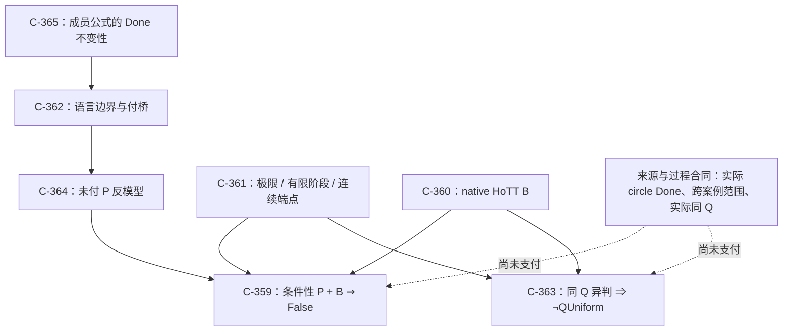

# ZFC 的 Q／P／A／B：形式化与机器证明收尾矩阵

> **身份：** `CANDIDATE_BRANCH_FORMAL_CLOSURE / FORMAL_CHECKED_WITH_SCOPE / NOT_A_BARE_ZFC_INCONSISTENCY`。
>
> **任务：** 将研究发起人提出的 Q（对原过程完成的观察／判断能力）、P（把模型完成升格为原过程完成的政策）、A（芝诺侧形式完成）和 B（HoTT 侧粗完成不能反射为原有限完成）逐项固定为形式命题，并让每个不能省略的前提和反控制都进入 proof assistant。

## 1. 本轮能够由内核交付的终点

当前最强的、已经由 Lean 内核检查的条件结论是：

```text
ZFCOneUse + PolicyScopeWitness(P) + B  ⟹  False
```

对应于 [`source_scoped_P_with_B_is_inconsistent`](../HoTT/formal/zfc-actual-q-policy/ActualQPolicy.lean)。

其中：

- `ZFCOneUse` 是**使用层**模型：一个 base proposition、针对指定任务的 `QMissing`、被明确承认的强 P，及“该 Q gap 被用来接纳 P”的独立前提；
- `PolicyScopeWitness(P)` 是 P 为什么从 Zeno 侧适用于 HoTT 侧的明确范围前提；
- `B` 是 HoTT 侧某个 `formalDone` 状态却不满足 `originDone`。

故 `False` 位于显示的使用模型和范围前提内。它不等于 `ZFC ⊢ False`，也不声称任何来源、数学共同体或 bare ZFC 已经接受这些前提。

## 2. 已完成的七个机器化部件

| Claim / proof ID | 精确机器命题 | 链条中的作用 | 禁止外推 |
|---|---|---|---|
| `C-365` / `MP-ZFC-MEMBERSHIP-LANGUAGE-INVARIANCE-001` | 具有 `=`、`∈`、`⊥`、`∧`、`∨`、`→`、`∀`、`∃` 的每个一阶成员公式及任意同语言 theory，在 membership 不变而外加 `originDone` 改变时不变。 | 从公式语义证明：语言没有提到 Done，就不会自动裁定 Done。 | 不是完整 ZFC 公理模式或 ZFC 模型。 |
| `C-362` / `MP-ZFC-OBSERVATION-LANGUAGE-BOUNDARY-001` | 同一 membership model 可有相反 `originDone` 的满足扩张；共同 `CompletionBridge` 会唯一决定它。 | Q 的语言边界及付桥正控制。 | 不证明 ZFC 无法定义任何过程谓词。 |
| `C-364` / `MP-ZFC-UNPAID-COMPLETION-PROMOTION-001` | 有 `formalDone` witness 的 base/subtheory model 存在保留 `member/input/step/observe/formalDone` 却令 `originDone=false` 的 expansion；bridge + adequacy 推出 P。 | 强 P 是未付桥时的额外使用层加项，而非公开字段的语义后果。 | 该 interface 不是实际 ZFC 或物理过程模型。 |
| `C-361` / `MP-ZFC-ACTUAL-Q-ZENO-LIMIT-CONTROL-001` | `1-2^{-n}` 收敛到 1，但没有自然数阶段等于 1；闭连续时间端点可以到达。 | 排除“极限就是有限步骤到达”与“无末阶段就无连续端点”两种误读。 | 严格有限阶段 Done 是控制，未归因给 Standard Solution。 |
| `C-360` / `MP-ZFC-ACTUAL-Q-HOTT-COUNTEREXAMPLE-001` | 固定 Cubical Agda `QuestioningDelay` 中 set-truncated question 的 stage-one completion 不蕴含原 universe question 的有限 halt。 | 给 B 一条 native HoTT 数学控制；负控制拒绝伪 halt witness。 | 没有给 Zeno／圆环与 HoTT 的实际任务等价。 |
| `C-359` / `MP-ZFC-ACTUAL-Q-POLICY-002` | `ZFCOneUse + PolicyScopeWitness + B → False`；`TaskEquiv` 是范围的严格充分控制；Q gap 不推出 P，use-model 不推出 B。 | 用户 A/P/B 因果结构的精确条件 consequence。 | policy scope 的结构字段不含历史或来源归属。 |
| `C-363` / `MP-ZFC-COMPLETION-POLICY-UNIFORMITY-001` | 相同完整 `QProfile` 的 `originalResolved`／`bridgeRequired` 异判推出 `¬ QUniform`；支付不同的 profile 可合理异判。 | “同 Q 异判”的终局政策 theorem 和反控制。 | 未填入实际 Zeno、圆环、HoTT 的 profile 或来源 judgment。 |

## 3. 内核依赖图与外部边界



虚线不是漏掉的逻辑步骤。它是 proof assistant 不能替代的一类证据：历史来源说了什么、来源是否把自己的 runner completion policy 扩张到用户圆环和 fixed HoTT Q、以及用户的 `OriginDone` 究竟是什么。把这类未知直接写成布尔 `false` 或 Lean premise 都会改变研究对象。

## 4. Q、P、A、B 与 `ZFC-1` 的形式身份

| 用户符号 | 机器对象 | 已被避免的偷换 |
|---|---|---|
| `Q` | `CompletionObservable`／`QMissing`，以及成员语言与 base/subtheory 对外加 `originDone` 的不变性。 | 不是“ZFC 完全不能表示时间、自然数、序列或计算”。 |
| `P` | `MathematicalIllusionP`／`CompletionPromotion`：`formalDone → originDone`。 | `revisedResolved` 或来源使用“resolved”一词不会自动成为强 P。 |
| `A` | Zeno 侧的 `formalDone`，由 C-361 给出实分析控制。 | `A ↔ admitted P` 只在 C-359 的显式前提下成立。 |
| `B` | Lean 的抽象 B；Cubical Agda 的 `CompletionReflectsOriginalHalting` 否定提供固定数学控制。 | 跨 kernel 对应、实际任务等价不自动成立。 |
| `ZFC-1` | `ZFCMinusOne ZFCBase policy := ZFCBase ∧ AdmittedZenoP policy`。 | 不是 ZFC 对象语言扩张、保守扩张或一致性模型。 |

## 5. 已通过的正反控制

| 可能的错误推理 | 机器控制 | 结果 |
|---|---|---|
| 没有有限末步，所以连续端点不能到达 | C-361 `closed_time_endpoint_arrival` | 拒绝。 |
| 有极限，所以某个有限阶段已经到终点 | C-361 `strict_limit_promotion_is_refuted` | 拒绝。 |
| 来源标签相同，所以是同一个任务 | C-359 Bool／Unit metadata control | 拒绝。 |
| Q 缺失，所以 P 必然成立 | C-359 `q_gap_does_not_logically_force_P` | 拒绝。 |
| ZFC-1 使用模型自动制造 HoTT B | C-359 vacant-formal control | 拒绝。 |
| 未付 bridge 意味着任何模型都失败 | C-362/C-364 paid bridge + adequacy control | 拒绝。 |
| 都谈 bridge 就必然同 Q 异判 | C-363 payment-difference control | 拒绝。 |

## 6. 运行、可复核性和版本闭合

已选择的 primary package：

```text
MP-ZFC-ACTUAL-Q-POLICY-002                  C-359  Lean 4.34.1 core
MP-ZFC-ACTUAL-Q-HOTT-COUNTEREXAMPLE-001     C-360  Cubical Agda 2.8.0
MP-ZFC-ACTUAL-Q-ZENO-LIMIT-CONTROL-001      C-361  Lean 4.34.0 + Mathlib
MP-ZFC-OBSERVATION-LANGUAGE-BOUNDARY-001    C-362  Lean 4.34.1 core
MP-ZFC-COMPLETION-POLICY-UNIFORMITY-001     C-363  Lean 4.34.1 core
MP-ZFC-UNPAID-COMPLETION-PROMOTION-001      C-364  Lean 4.34.1 core
MP-ZFC-MEMBERSHIP-LANGUAGE-INVARIANCE-001   C-365  Lean 4.34.1 core
```

复核命令：

```bash
python3 -B scripts/audit/verify_proof_version_closure.py \
  --proof-id MP-ZFC-ACTUAL-Q-POLICY-002 \
  --proof-id MP-ZFC-ACTUAL-Q-HOTT-COUNTEREXAMPLE-001 \
  --proof-id MP-ZFC-ACTUAL-Q-ZENO-LIMIT-CONTROL-001 \
  --proof-id MP-ZFC-OBSERVATION-LANGUAGE-BOUNDARY-001 \
  --proof-id MP-ZFC-COMPLETION-POLICY-UNIFORMITY-001 \
  --proof-id MP-ZFC-UNPAID-COMPLETION-PROMOTION-001 \
  --proof-id MP-ZFC-MEMBERSHIP-LANGUAGE-INVARIANCE-001
```

精确 source、claim、primary receipt 和禁止外推由 [Claim–Evidence Matrix](../HoTT/CLAIM_EVIDENCE_MATRIX.md)、[proof version closure registry](../HoTT/verification/PROOF_VERSION_CLOSURE.json) 和 [package claim 说明](../HoTT/formal/zfc-actual-q-policy/CLAIM.md)共同拥有。

## 7. 真实 ZFC 跨案例结论为什么还不能被机器自动完成

现有来源分母支持：IEP／SEP／Norton 在自己的连续 runner／supertask 任务中有局部完成政策，并公开区分或改写完成含义。它不支持：该政策已经适用于用户圆环的原 `OriginDone` 或 fixed HoTT Q。

```text
SOURCE_ZENO_POLICY_ESTABLISHED_WITH_SCOPE
SOURCE_TASK_CONTRACT_SPLIT
SOURCE_CROSS_CASE_POLICY_SCOPE_UNOBSERVED
USER_CIRCLE_ORIGIN_DONE_PARTIAL / USER_DONE_ADJUDICATION_REQUIRED
ACTUAL_Q_POLICY_CONFLICT_WITH_SOURCE_BOUNDARY = NOT_REACHED
```

因此，形式化工作现已正确到达 `FORMALIZATION_CLOSED_WITH_SCOPE`：未来重开必须由一份来源支付跨案例 `PolicyScopeWitness`，或由来源／用户过程合同明确拒绝同一任务，而不是再增加一个没有新外部输入的抽象 fixture。当前最强的研究结论是 `COMPLETION_BRIDGE_OBSERVATION_BOUNDARY_CANDIDATE`；bare ZFC 不一致没有、也不能从这些定理推出。
