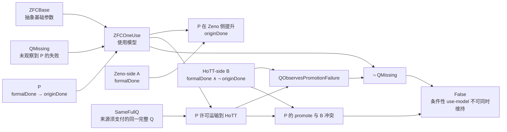

# ZFC 的 Q 缺失、数学幻觉 P、A/B 与 ZFC-1：第一轮形式化与机器证明

> **身份：** `FORMAL_POLICY_CONSEQUENCE + FIXED_HOTT_COUNTEREXAMPLE + ZENO_CONTROL / LOCAL_EVIDENCE_VERSION_NOT_YET_CLOSED`。
>
> **直接用户输入：** [Codex-ZFC-Q-P-A-B-ZFC1-用户原文-20261004](../sources/prompts/Codex-ZFC-Q-P-A-B-ZFC1-用户原文-20261004.md)。
>
> **研究对象：** 不是 bare ZFC 的对象语言一致性，而是一个明确的 `ZFCOneUse` 使用模型：基础框架、对过程完成观察 Q 的缺口、把形式完成提升为原过程完成的政策 P、芝诺侧结果 A、以及固定 HoTT Q 对 P 的反例 B 如何共同作用。
>
> **交付范围：** 本报告给出可重放的 Lean/Cubical Agda 命题、反控制、运行收据和证据边界。它不将未完成的来源映射写成“`ZFC ⊢ False`”。

## 1. 这次把用户的论证拆成了什么

用户提出的核心不是“ZFC 没有时间变量”，而是一种更具体的候选：基础框架缺少足以审查过程完成的观察 Q；这个缺口允许一个将数学完成替换为原过程完成的政策 P；P 在芝诺侧带来数学共同体希望得到的 A，却在 HoTT 侧遇到不希望得到的 B。若两侧确实是同一个完整 Q，B 就反过来暴露 P 和 Q 缺失的不可同时维持性。

为避免把自然语言中的“完成”“解决”“基础”混为一个谓词，形式化分成以下对象。

| 用户记号／叙述 | Lean 或 Agda 中的精确对象 | 当前证据等级 | 不能自动推出 |
|---|---|---|---|
| `ZFC` | `ZFCBase : Prop` | 抽象参数 | 一套 ZFC 语法、公理、模型或一致性证明 |
| `Q` | `QFingerprint` 的 O1–O5／bridge 状态；`QObservesPromotionFailure` | C-359 的形式规格 | ZFC 实际拥有或缺失此观察 |
| `Q` 缺失 | `QMissing cases policy := ¬ QObservesPromotionFailure cases policy` | C-359 的 use-model 前提 | “缺 Q”在逻辑上自动产生 P |
| 数学幻觉 `P` | `MathematicalIllusionP`：在适用的 Q shape 中 `formalDone → originDone` | C-359 的形式政策 | 任何历史来源或数学共同体实际采取 P |
| 芝诺侧 `A` | `A cases := (cases .zeno).formalDone` | C-359 的抽象 formal outcome；C-361 给出严格序列控制 | `A ↔ P`，或 Standard Solution 使用严格有限阶段 Done |
| HoTT 侧 `B` | `formalDone_hott ∧ ¬ originDone_hott` | C-359 的条件前提；C-360 是固定 Cubical Agda P 的具体反例 | 实际芝诺与 HoTT 已有同一完整 Q |
| `ZFC-1` | `ZFCOneUse ZFCBase cases` | C-359 的明确使用模型 | bare ZFC 的对象语言扩张或数学共同体的实际基础实践 |

这里的 `A` 是形式模型的芝诺侧完成，不是“来源已证明原过程完成”的隐写缩略。用户写的

\[
  \mathrm{ZFC}+A = \mathrm{ZFC}+P
\]

在 Lean 中被忠实保留为一个**需要额外支付的条件**：

```lean
zfc_plus_A_iff_zfc_plus_P
  (ZFCBase A P : Prop) (A_iff_P : A ↔ P) :
  ZFCWith ZFCBase A ↔ ZFCWith ZFCBase P
```

所以它不允许我们把“有极限”悄悄写成“原顺序过程已经完成”。若未来来源确实证明或采用 `A ↔ P`，该等价可被实例化；若来源明确改变 Done，则这一桥不能被填入。

## 2. 机器证明的核心因果链



这张图中的两条 `False` 路径都在 C-359 中被 Lean 4.34.1 core 检查：

1. `same_Q_P_with_B_exposes_promotion_failure`：若 Zeno 的 P 在真正同一完整 Q 下运输到 HoTT，B 就成为 P 失败的可观察见证。
2. `zfc1_q_missing_with_same_Q_P_and_B_is_inconsistent`：该见证与 use-model 的 `QMissing` 直接矛盾。
3. `zfc1_same_Q_P_with_B_is_inconsistent`：同一 B 也直接与 P 的 `promote` 字段冲突，导出 `False`。

`q_gap_does_not_logically_force_P` 是关键反控制：不存在逻辑定理把任意 `qGap : Prop` 变成任意 `P : Prop`。因此“Q 缺失允许 P”在形式模型中保留为 `gapPermitsZenoP` 这一**来源须认证的政策前提**，不能被证明器或研究者擅自补上。

## 3. 三条主证明与负控制

| Claim | 形式化／证明器 | 已机器检查的精确结论 | 主运行 | 负控制 |
|---|---|---|---|---|
| `C-359` | [ZFC1IllusionPolicy.lean](../HoTT/formal/zfc-actual-q-policy/ZFC1IllusionPolicy.lean) / Lean 4.34.1 core | 同一完整 Q、来源许可的 P、HoTT-side B 与 `QMissing` 不能共同成立；P 的提升也与 B 冲突。 | [001-06](../HoTT/verification/runs/20261004-MP-ZFC-ACTUAL-Q-POLICY-001-06/RUN.json) | [NEG-05](../HoTT/verification/runs/20261004-MP-ZFC-ACTUAL-Q-POLICY-NEG-05/RUN.json)：`gap : qGap` 不能作为任意 `P` 的证明。 |
| `C-360` | [HoTTCounterexample.agda](../HoTT/formal/zfc-actual-q-policy/HoTTCounterexample.agda) / Cubical Agda 2.8.0 + Cubical 0.9 | 固定 set-truncated Q 在 stage one 完成，并不蕴含固定 original-universe Q 有有限 halt witness；即拒绝具体 `coarse completion → original finite halting`。 | [001-06](../HoTT/verification/runs/20261004-MP-ZFC-ACTUAL-Q-HOTT-COUNTEREXAMPLE-001-06/RUN.json) | [NEG-03](../HoTT/verification/runs/20261004-MP-ZFC-ACTUAL-Q-HOTT-COUNTEREXAMPLE-NEG-03/RUN.json)：在 `nothing != just 1` 处被 Agda 拒绝。 |
| `C-361` | [ZenoLimitControl.lean](../HoTT/formal/zfc-actual-q-policy/ZenoLimitControl.lean) / Lean 4.34.0 + pinned Mathlib | 对 \(s_n=1-2^{-n}\)，`Tendsto s_n 1` 不推出存在自然数阶段 `s_n = 1`；另证闭连续时间区间存在端点到达。 | [001-07](../HoTT/verification/runs/20261004-MP-ZFC-ACTUAL-Q-ZENO-LIMIT-CONTROL-001-07/RUN.json) | 端点到达是正控制：它拒绝“连续时间永远不能到端点”的过宽读法。 |

三条主运行都已通过：

- 保存命令的精确重放，包含 stdout/stderr 字节一致性；
- proof assistant 对源码、依赖与外部工具链散列的检查；
- `CLAIM_EVIDENCE_MATRIX.md` 的唯一 proof/claim 行与冻结行清单；
- `PROOF_VERSION_CLOSURE.json` 的选择性 evidence-only 闭包验证。

当前仍是 `LOCAL_EVIDENCE_PASS_NOT_VERSION_CLOSED`：所有新源码、收据和索引尚待本次精确 Git commit 后再作为可恢复版本闭合物使用。

## 4. C-360 与 C-361 怎样接到用户的两个案例

### 固定 HoTT Q：B 不是一句解释，而是原生内核反例

C-360 使用项目已有的 `QuestioningDelay` / `TruncationQuestioning` / `CompletionReflectionFailure` 组合。它不把“截断问题完成”和“原问题完成”叫作同一个结果；它把二者分别写为：

```text
coarseCompletion        : truncated Q stops at stage one
originalCompletionFails : original universe Q has no finite halt witness
```

然后机器证明对具体 P：

```text
coarse completion -> original finite halting
```

不存在。此处正是用户所说“HoTT 中不想要的结果”可以落成可检查 B 的地方：理论的一种粗完成不能支付原过程有限完成。

它还没有证明“该 Cubical Agda Q 与芝诺是同一任务”，也没有证明 ZFC 的模型验收实际作了这个粗化。这两个限制是刻意保留的，因为删掉它们会把反例从固定 Q 的事实偷换成关于整个基础框架的结论。

### 芝诺序列：极限与自然数阶段完成确实不同，但连续端点仍需保留

C-361 在实数模型中将两个精确谓词分开：

```text
FormalA              := Tendsto s_n (𝓝 1)
StrictSequentialDone := ∃ n : ℕ, s_n = 1
```

内核确认 `FormalA` 成立而 `StrictSequentialDone` 不成立。这给出了 P 的一个严格、可反驳版本：若 P 宣称极限本身提供某个有限阶段的到达，那么 P 是假的。

但相同源码也证明闭区间 `[0,1]` 中参数 `1` 存在、恒等轨迹在该端点取值 `1`。这项正控制防止研究把“无自然数编号的最后阶段”错误升级为“连续时间中没有到达”。因此，真实 Standard Solution 是否把它的连续端点 Done 与原运动 Done 视为同一个，仍必须由来源和同一任务桥来回答。

## 5. 本次到底已经证明了什么

下面这句已经可以作为严格的机器证明结论交付：

> **在显式的 `ZFCOneUse` 使用模型中，若来源认证“Q 的缺失允许 Zeno-side P”，若芝诺与 HoTT 的完整 Q 真正相同，且 HoTT 侧存在 `formalDone ∧ ¬ originDone` 的 B，那么 B 既是被缺失 Q 漏掉的 P 失败见证，又使 P／`QMissing` 的组合导出 `False`。**

这正形式化了用户论证中“B 反过来让我们沿反证法回溯到 P，并看到 Q 缺失”的逻辑骨架。

下面这些还不能被写成已证明结论：

1. bare ZFC 不一致，或 `ZFC ⊢ False`；
2. 数学共同体实际把“极限解决芝诺”解释为 C-361 的严格有限阶段完成；
3. 数学共同体实际采用了 C-359 的 P，或确实满足 `ZFC+A ↔ ZFC+P`；
4. 芝诺／圆环的原过程与固定 HoTT Q 已经填写成 `SameFullQ`；
5. ZFC 的某个真实基础验收契约确实缺 Q，或把它的验收 Done 提升成过程／现实 Done。

这些不是形式化工作的失败，而是本轮形式规格明确暴露出来的来源认证义务。

## 6. 实际 Q 要抵达何处

`ZFC-Q-ACTUAL-INSTANCE-FORMALIZATION-SOP` 的后续不应再泛泛增加模型。它必须固定并尝试支付以下五张证据卡：

| 未付前提 | 要找的直接证据 | 能否被反控制推翻 |
|---|---|---|
| `A_source` | 一个来源是否真的把其数学模型的完成称为**原**芝诺／圆环过程完成 | 来源若明确替换为 `Done_revised`，则不能填此格 |
| `P_source` | 来源是否明示或不可避免地采用 `formalDone → originDone` | 仅有极限定理、模型存在或实数构造不足以填格 |
| `A ↔ P` | 共同体的 A 判词与政策 P 是否真是同一附加承诺 | Lean 已证明没有此证据时不得合并 `ZFC+A` 与 `ZFC+P` |
| `SameFullQ` | 芝诺、圆环和 HoTT 的输入、操作、观察、Done、bridge payment 是否逐字段相同 | 任一字段不同即阻断 P 从 Zeno 运输到 HoTT |
| `B_bridge` | C-360 的 Cubical Agda B 怎样映到 C-359 的抽象 `B` | 仅同名“完成”不构成跨证明器或同一任务对应 |

现有 Norton/IEP 读取恰好是严厉控制：Norton 的连续时间回应显式从含“最后动作”的 `Done_strict` 改为不含它的 `Done_revised`。这不为 P 提供现成付款，也不证明用户原过程已经完成；它把真实焦点锁定在“来源是否给出了同一 Done 的 bridge”。相应的项目来源卡仍是 [ZFC-CIRCLE-Q0](20261003-ZFC-CIRCLE-Q0-连续统完成与圆环复原候选卡.md) 与 [ZFC-HOTT-Q2 比较卡](20261003-ZFC-HOTT-Q2-时间观察完备性比较卡.md)。

## 7. 运行谱系与审计结论

本轮没有删除不成功运行。它们揭示并修复了三类不同问题：

| 事件 | 发现 | 处理 |
|---|---|---|
| C-359 负控制旧 run | 初始文件先死在 import 布局，未触及拟定类型边界 | 保留 `NEG-03` 为 setup failure；以无导入最小控制重捕 `NEG-05` |
| C-361 旧 run | `LEAN_PATH` 仅在父进程环境，保存命令无法独立重放 | 保存命令改为 `/usr/bin/env LEAN_PATH=... lean ...`，最终为 `001-07` |
| C-360 旧 run | source manifest 漏列实际被 Agda 检查的 `DelayMonad.agda` | 不用 allowlist 豁免；重捕 `001-06` 和 `NEG-03`，固定全部 8 个本地模块 |

这一谱系记录在 [REVISIONS.md](../HoTT/formal/zfc-actual-q-policy/REVISIONS.md)。它的意义是区分：数学命题被内核拒绝、实验设置没有达到应检边界、以及证据记录尚不足以支撑可恢复交付。三者不能混写成同一个“失败”。

## 8. 结论与恢复点

本轮已经完成 `Q/P/A/B/ZFC-1` 的第一层形式化：用户的逻辑结构不再只是一段哲学叙述，而是具有明确量词、明确 policy premise、明确 same-Q 假设、HoTT 原生反例、芝诺严格控制与正控制的三核证据包。

它尚未完成“实际 ZFC 的 Q 已被找到”。最接近的、可证伪的下一动作不是再造一个抽象反例，而是按 SOP A1–A5 为 `A_source / P_source / A↔P / SameFullQ / B_bridge` 冻结实际来源与任务合同。任何一张卡被真实来源否定，都应作为有界结论写入，而不是被更多形式化掩盖。
