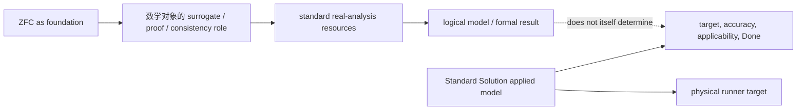

# C5E：bare ZFC 的基础观察范围与过程完成的外部语义边界

> **身份：** `CORE_ADEQUACY_SYNTHESIS / FOUNDATION_ROLE_SCOPE_MAP / OBSERVATIONAL_INCOMPLETENESS_CANDIDATE / NOT_A_BARE_ZFC_INCONSISTENCY_THEOREM`。
>
> **父方案：** [ZFC-META-SUBTHEORY-ADEQUACY-SOP](../dev-docs/ZFC元理论子理论充分性最终闭环SOP.md)。
>
> **输入：** [C5A](20261005-ZFC-META-SUBTHEORY-ADEQUACY-C5A-FOUNDATION-ADEQUACY-SOURCE-CARD.md)、[C5B](20261005-ZFC-META-SUBTHEORY-ADEQUACY-C5B-APPLIED-MODEL-BRIDGE-RESPONSIBILITY-CARD.md)、[C5C](20261005-ZFC-META-SUBTHEORY-ADEQUACY-C5C-STANDARD-SOLUTION-APPLIED-TASK-CONTRACT-CARD.md)、[C5D](20261005-ZFC-META-SUBTHEORY-ADEQUACY-C5D-CONSTRUCTIVE-FOUNDATION-CONTRAST-CARD.md)。

## 1. 这张综合卡回答的精确问题

研究发起人说的不是“ZFC 完全不能看见时间”，而是怀疑它在时间／过程完成这个维度上的理论观察力不完备。C5E 不以这个判断为前提，而是把已有来源问成一个可检查的问题：

```text
ZFC 被用作基础性 meta theory 时，它的标准来源角色是否包括：
对一个 ZFC-founded continuous model 的 physical-process completion promotion
作 target / operation / observation / OriginDone 审查？
```

## 2. 来源给出的三层基础角色

Maddy 的 *Set-theoretic Foundations* 将 ZFC 类 set theory 的实际 foundational uses 区分为：

1. **surrogate / faithful representation：**识别 mathematical object 的相关特征，并在 sets universe 中给出满足这些特征的 representation；
2. **risk assessment：**以 consistency / interpretation 为主，评估新语言或对象的形式风险；
3. **shared proof/ontology standard：**在数学实践中处理“可导出／可证明／有何种数学对象”的问题。

同一来源又明确拒绝把 set-theoretic reduction 当成深层 metaphysical insight；它所称的 foundation roles并不自动包括对象的现实本性或一项物理过程的全部语义。

与之相对，SEP scientific representation 把一个数学化模型对 physical target 的 adequacy 单列为 target、accuracy、misrepresentation 和 mathematics-to-world applicability；SEP models 进一步区分 logical model 与 representational model。IEP/Norton 的 Standard Solution 正处于这后一层：它谈 runner、physical continuum、speed、actions 和“completion”的解释，不是一个 bare-ZFC derivability claim。

于是来源支持如下责任地图：



## 3. 由此得到的候选判词

在这张图里，bare ZFC 对 sequence、set、real、relation、proof 和 consistency 的观察能力并没有被否认；C1C 的 Isar/ZF halving-sequence positive control也直接排除了“无法表示阶段”的说法。

但当前 standard-foundation sources 没有给 bare ZFC 一项 `ProcessCompletionAudit`：

```text
ProcessCompletionAudit(P,Q) :=
  P claims Q solved
  → verify target / operation / observation / OriginDone preservation,
    or label the task revision.
```

这使“理论观察力不完备”可以收紧为下列**研究候选**：

> **相对于 process-completion fidelity，bare ZFC 的常规基础角色只提供 mathematical representation、formal proof 与 consistency-risk observation；它不由自身来源角色提供 applied physical-process contract 的判断。**

这正好解释本轮的两个来源事实可以同时为真：

- IEP/Norton 可以在 ZFC-supported standard analysis 下说 revised task 被解答；
- 同一 foundation role 不会自动回答 revised completion 是否是 strict original completion。

这是一种语义／应用层的**观察范围边界**，不是 `ZFC ⊢ False`，也不表示一个严格 task switch 未被来源公开。

## 4. 与已有机器证明的正确连接

现有 Lean C-364 已在两个 completion worlds 的固定 source-bound application view 中证明：同一粗 `resolved` observation 无法决定 `OriginDone`，而携带 completion contract 的 rich view 可以决定它。C5E 给它正确的来源解释：

```text
C-364 = formal control for an under-specified application view
C5 sources = why bare-ZFC foundation role cannot be silently identified
             with the missing application-level observer
```

因此，C-364 是候选判词的一个形式**见证形状**，却不是 bare-ZFC 的对象语言定理。要把 C5E 升格为 C6，仍须存在一个 actual `M/S/Q/P/Adequacy` source contract，而不是由本卡自行把 `ProcessCompletionAudit` 设为 ZFC 公理。

## 5. constructivist contrast 的作用

C5D 表明另一类 foundation explicitly talks about construction/admissibility and,在 Brouwer 的特定哲学读法下，temporal intuition。这说明“基础理论对对象和证明承担何种过程资格责任”不是无意义的问题；它也不证明 constructivism 自动完成 user 的 physical Done，因为 source 明说 ideal constructibility独立于实践时间和金钱。

所以对照给出的不是“constructivism 赢、ZFC 错”，而是：**基础理论可选择不同的观察／准入维度；ZFC 的标准角色没有自动纳入这里想检查的 physical completion contract。**

## 6. C5E 判词与可证伪条件

```text
ZFC_FOUNDATION_FORMAL_RISK_AND_REPRESENTATION_ROLE_SOURCE_ESTABLISHED
APPLIED_PROCESS_COMPLETION_AUDIT_NOT_ASSIGNED_TO_BARE_ZFC_BY_CURRENT_SOURCES
TIME_PROCESS_OBSERVATION_INCOMPLETENESS_IS_A_SOURCE_GROUNDED_CANDIDATE_SCOPE_BOUNDARY
C364_IS_ONLY_A_FORMAL_CONTROL_FOR_THAT_BOUNDARY
NO_BARE_ZFC_OBJECT_LANGUAGE_CONTRADICTION
NO_FINAL_CORE_VERDICT
```

**最强反证：**发现一个 version-fixed standard foundation source，明确把 bare ZFC 的 own adequacy duty 定义为审查 IEP-like physical process completion，并证明或要求 `FormalDone ↔ OriginDone`。这会推翻当前“职责未分配给 M”的判词。

**最强正控制：**发现一个 application source 完整支付 target/accuracy/bridge，则会说明标准解法在该 exact task 上成立，而不是证明 bare ZFC 自动有该观察力。

## 7. successor

当前最小任务仍是 [C0 successor reselection 002](20261005-ZFC-META-SUBTHEORY-ADEQUACY-C0-SUCCESSOR-RESELECTION-002-TASKCARD.md)：寻找同一实际 source chain。C5E 不偷渡为最终 conclusion；它只让未来搜索知道，必须寻找的不是更多 sequence theorem，而是谁把 mathematical validity 升格为 process completion、并且谁承担那条 bridge 的验证责任。
