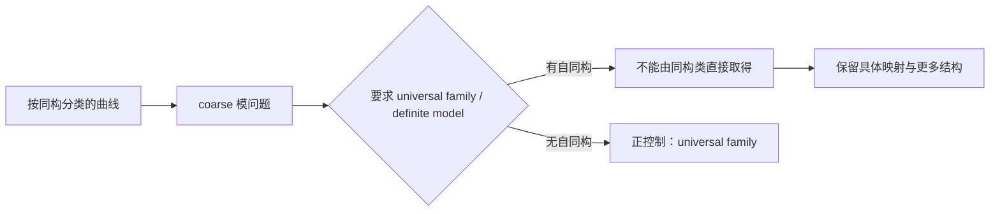

## User

你为什么总要去找菲尔兹奖入口呢？


## Codex

你说得对，我把前一轮“**如果从菲尔兹奖得主的工作中挑选下一靶**”误升级成了每条候选都必须通过的硬门。菲尔兹奖论文库应当是一个很强的**发现与原典资源**，不是理论本身成立、值得审视或能形成 UR 的前提。  

这条新线的首要顺序应是：先判断它是否真在审视一个基础／共同语言级理论，找出该理论的抽象取舍、同一任务和敏感过程；菲尔兹工作若能提供原典、使用者或历史入口，就补上，不能反过来决定选题。接下来我会按这个修正继续，不再把 Grothendieck 或 Quillen 当作这条方向的准入门。

## Codex

初步来源卡已经给出一个清楚的、并不讨巧的结果：Lawvere 的 ETCS 确实是被明确设计为集合论基础的结构主义框架，而且原文把“同构不变结构”与选择公理都放在核心位置。可一旦把任务写成“给每个无标签对象选出一个点，并对所有自同构保持兼容”，任务已经从“任意选择”变成“自然选择”；现有的无标签二元素机器化边界正说明这个加强版无法由被遗忘的标签免费获得。  

所以我会把它推进成 `FND-STRUCT-005` 的**首张候选卡**，并把当前结论写成“基础资格已核、同一任务门尚未通过”，而不是抢先宣布它已经是 UR。与此同时，我会把“菲尔兹入口”从路线图的硬门改成可选来源栏，忠实反映你刚才的纠正。

## Codex

我已经找到一个比抽象的二元素例子更有力的真实消费者：Mumford 的模空间问题把“按同构分类”推进到“是否有一族代表所有对象的 universal family”。原始论文直接承认：有非平凡自同构时，通常没有这族 universal family；限制到无自同构对象时才恢复。它正好给出“同构类、具体代表、正控制、标准回答”四个部件。  

我会按 `math-paper-harvest` Skill 取得并核读这篇原典的具体页，而不把搜索摘要当作论文证据。它的作用将是检验真实消费者是否越级；目前的预判是它反而很可能成为理论正确处理该困难的正控制。

## Codex

这篇 Mumford 原典是扫描件，文字层为空；我已完成 PDF 身份、49 页数和哈希核验。为了读取它关于 universal family 与自同构的原句，我会使用 `pdf` Skill 对相关页进行图像检查，而不依赖搜索摘要或 OCR 代替原页。

## Codex

我已经把这一小轮从“想法”推进到可审查的结果：ETCS 的基础资格、Choice 的精确位置、无标签二元素的机器控制，以及 Mumford 模空间的真实消费者都已放进同一张候选卡。Mumford 的结果尤其关键：它没有把“按同构分类”偷换成“已有 universal family”，而是明确承认失败，并在无自同构的正控制中恢复任务。这个方向因此没有被放弃，而是获得了一个更严格、可继续搜索的判别标准。

## Codex

## 已推进的方向

我接受了你刚才对“菲尔兹入口”的纠正：它是高价值的资料入口，不能再作为理论候选的硬门。现在真正的硬条件只有三类：理论是否具有基础／共同语言／大范围基础设施地位；是否能定位它为了经济性或普适性作出的抽象取舍；是否能保住同一 `X_i / Op / O / Done`，并正面接受标准回答。

这项纠正已写入 [rulings.md](/Volumes/D/HoTT_AI_HANDOFF_20260911/rulings.md:330)、[F-025](/Volumes/D/HoTT_AI_HANDOFF_20260911/feature-list.md:31)、[路线图索引](</Volumes/D/HoTT_AI_HANDOFF_20260911/dev-docs/菲尔兹奖后续理论级目标路线图.md:14>) 与 [当前执行记忆](</Volumes/D/HoTT_AI_HANDOFF_20260911/MEMORY/001 - 当前执行队列.md:17>)。菲尔兹论文仍可提供原典、消费者和历史比较；它不再决定理论是否值得审视。

你标出的“具体消费者是否需要被指定、且满足自然性或兼容条件的同构”的问题，已经从一段方向说明落成 `FND-STRUCT-005` 的首张候选卡：对象固定为 **Lawvere 的 ETCS 与 Choice 的组合**，不再泛称“范畴论”。 :codex-annotation{index="1"}

## FND-STRUCT-005 的第一轮结果

Lawvere 的 ETCS 是一个合格的理论级对象：它被明确提出为集合论基础，以同构不变结构和泛性质组织对象；其 Choice 公理又提供 quasi-inverse／族选择所需的存在性资源。[Lawvere 的 ETCS 长版原典](https://pages.jh.edu/rrynasi1/FoundationsOFMath/Literature/Lawvere2005AnElementaryTheoryOfTheCategoryOfSets%28LongVersion%29WithCommentary.pdf) 直接说明了这一基础定位及其 Choice 公理。

首个过程把两个任务严分开了：

| 任务 | 输入和完成条件 | 当前结论 |
|---|---|---|
| `X_any`：任意选择 | 每个非空纤维给出某个元素或 quasi-inverse。 | ETCS 的 Choice 正在承诺这种选择。 |
| `X_nat`：自然选择 | 同样的结构输入，却要求输出对所有同构和自同构兼容。 | 这是新增的完成条件，ETCS 的 Choice 没有承诺它。 |

这使历史 Gemini “Identity Scar”的错误变得很具体：它把“对象可按结构替换”偷换成“任何选择也自动和所有同构兼容”。一旦写清 Done，`X_nat` 不是 `X_any` 的同一任务，所以它的失败不能回头判成 ETCS 让普通选择失败。

项目已有的 Cubical Agda 控制正好钉住这个边界。对

```text
Σ[A : Type] ∥ A ≃ Bool ∥₁
```

不存在统一选点；交换自同构会迫使假想输出成为 `not` 的不动点。保留具体标签 `A ≃ Bool` 后存在 `labeledChoice`。保存的 `MP-NOCANONICAL-001` 运行收据是 `KERNEL_ACCEPTED_WITH_SCOPE`，但我没有重跑它，也没有把这个 Cubical 命题改说成 ETCS 定理。它只作为“结构输入、具体见证、自然性责任必须分层”的控制。[源码](</Volumes/D/HoTT_AI_HANDOFF_20260911/HoTT/formal/truncation-no-recovery/NoCanonicalPoint.agda:1>) 与 [保存运行收据](</Volumes/D/HoTT_AI_HANDOFF_20260911/HoTT/verification/runs/20260913-MP-NOCANONICAL-001-02/RUN.json:1>) 都已连入候选卡。

## 第一个真实消费者：模空间没有偷换任务

我没有停在二元素玩具模型，而是核读了 Mumford 1965 年的原始扫描件。第 33 页明确说，所有非奇异曲线的 universal family 并不存在；限制为无自同构曲线时则存在。第 34 页把“要研究 definite model 的不变量时，究竟选哪一个模型”列为实际问题；第 37 页进一步要求在非平凡自同构下指定具体映射。[Mumford 的原始论文](https://www.dam.brown.edu/people/mumford/alg_geom/papers/1965b--PicGpMod-EmeryScan.pdf) 支持这三个来源事实。 :codex-file-citation{path="/tmp/mumford_1965_picard_groups_moduli_problems.pdf" purpose="source"}

这给出了一条真实的消费者链：



它是一个很好的**正控制**，不是命中：Mumford 没有把 coarse classification 宣称为已经提供了 universal family，而是公开保留失败，并在无自同构子类恢复任务。因此本轮的诚实判词是：

> `FND-STRUCT-005 = STRUCTURAL_CHOICE_BOUNDARY / NOT_UR_YET`。

ETCS 已通过理论基础资格与来源初检；它尚未通过同一任务和标准回答两道门。这个结果没有把方向关掉，它把下一步收紧为一个可证伪问题：寻找一个版本固定的结构主义／ETCS／范畴论消费者，看看它是否在**没有明示 Choice、标签、标记或相干数据**的情况下，仍把同构不变输入升级为同一任务中的具体自然选择或代表交付。

## 已落盘的工作与边界

- `FND-STRUCT-005`、Lawvere 原典、Mumford 真实消费者、Cubical 控制、`X_any / X_nat` 的任务分界、正控制和停止条件都写入 [理论级候选地图](</Volumes/D/HoTT_AI_HANDOFF_20260911/dev-docs/菲尔兹奖后续理论级目标路线图/004 - 理论级候选地图.md:89>)。

- 本轮 T2 来源研究的证据、55 条核心认知回评、扩展认知回评和下一动作保存于 [研究来源卡](</Volumes/D/HoTT_AI_HANDOFF_20260911/.codex/research/hott/sessions/S-RES-20261002-STRUCTURAL-FOUNDATIONS-CHOICE-CARD/SESSION.md:1>)。

- 没有创建 Goal、没有更新 `STATE.json`、没有新增数学命题或机器证明，也没有把 ETCS、范畴论或 ZFC 写成不一致。

- 路线图分片结构校验、`git diff --check`、JSON 解析和新增 Markdown 的行尾空白检查均通过。当前改动仍是本地未提交工作；外部论文库和 Aistudio 目录没有被修改。

## 可继续的三条路径

- :codex-followup[审计第二个结构主义消费者]{prompt="继续 FND-STRUCT-005：选择一个版本冻结的 ETCS、范畴论或结构主义数学消费者，按同构不变输入、具体自然输出、未明示额外数据、同一任务四项条件完成 P1 来源审计，并把结果写回路线图与来源卡。"}

- :codex-followup[比较 ETCS 与 ZFC 选择]{prompt="比较 ETCS 的 Choice 与 ZFC 的选择公理：固定各自的精确公理、可提供的选择、自然性未承诺的部分和同一任务边界，判断哪一个更可能承载后续基础理论候选。"}

- :codex-followup[评估模空间分支]{prompt="以 Mumford 的 universal family 问题为起点，审计 coarse moduli、fine moduli 与 stack 的精确任务变化，判断这是一条结构主义理论的正控制、表示边界，还是可形成新的 UR 候选。"}

### Files changed in this reply

- `/Volumes/D/HoTT_AI_HANDOFF_20260911/dev-docs/README.md` — 修改
- `/Volumes/D/HoTT_AI_HANDOFF_20260911/dev-docs/菲尔兹奖后续理论级目标路线图.md` — 修改
- `/Volumes/D/HoTT_AI_HANDOFF_20260911/dev-docs/菲尔兹奖后续理论级目标路线图/001 - 目标、权限与历史对应.md` — 修改
- `/Volumes/D/HoTT_AI_HANDOFF_20260911/dev-docs/菲尔兹奖后续理论级目标路线图/002 - 选靶层级、门槛与候选卡.md` — 修改
- `/Volumes/D/HoTT_AI_HANDOFF_20260911/dev-docs/菲尔兹奖后续理论级目标路线图/003 - 近期讨论的复盘与重分类.md` — 修改
- `/Volumes/D/HoTT_AI_HANDOFF_20260911/dev-docs/菲尔兹奖后续理论级目标路线图/005 - 执行路线、证据门与停止条件.md` — 修改
- `/Volumes/D/HoTT_AI_HANDOFF_20260911/feature-list.md` — 修改
- `/Volumes/D/HoTT_AI_HANDOFF_20260911/rulings.md` — 修改
- `/Volumes/D/HoTT_AI_HANDOFF_20260911/dev-docs/菲尔兹奖后续理论级目标路线图/004 - 理论级候选地图.md` — 修改
- `/Volumes/D/HoTT_AI_HANDOFF_20260911/.codex/research/hott/sessions/S-RES-20261002-STRUCTURAL-FOUNDATIONS-CHOICE-CARD/CORE_COGNITION_AUDIT.md` — 新增
- `/Volumes/D/HoTT_AI_HANDOFF_20260911/.codex/research/hott/sessions/S-RES-20261002-STRUCTURAL-FOUNDATIONS-CHOICE-CARD/CORE_COGNITION_AUDIT/001 - 核心认知逐项回评.md` — 新增
- `/Volumes/D/HoTT_AI_HANDOFF_20260911/.codex/research/hott/sessions/S-RES-20261002-STRUCTURAL-FOUNDATIONS-CHOICE-CARD/CORE_COGNITION_AUDIT/002 - 扩展认知逐片回评.md` — 新增
- `/Volumes/D/HoTT_AI_HANDOFF_20260911/.codex/research/hott/sessions/S-RES-20261002-STRUCTURAL-FOUNDATIONS-CHOICE-CARD/CORE_COGNITION_AUDIT/003 - 已走过的路与语义对齐.md` — 新增
- `/Volumes/D/HoTT_AI_HANDOFF_20260911/.codex/research/hott/sessions/S-RES-20261002-STRUCTURAL-FOUNDATIONS-CHOICE-CARD/CORE_COGNITION_AUDIT/004 - 即将作出的选择与反证条件.md` — 新增
- `/Volumes/D/HoTT_AI_HANDOFF_20260911/.codex/research/hott/sessions/S-RES-20261002-STRUCTURAL-FOUNDATIONS-CHOICE-CARD/RUNS.json` — 新增
- `/Volumes/D/HoTT_AI_HANDOFF_20260911/.codex/research/hott/sessions/S-RES-20261002-STRUCTURAL-FOUNDATIONS-CHOICE-CARD/SESSION.md` — 新增
- `/Volumes/D/HoTT_AI_HANDOFF_20260911/.codex/research/hott/sessions/S-RES-20261002-STRUCTURAL-FOUNDATIONS-CHOICE-CARD/CORE_COGNITION_AUDIT/004 - 即将作出的选择与反证条件.md` — 修改
- `/Volumes/D/HoTT_AI_HANDOFF_20260911/.codex/research/hott/sessions/S-RES-20261002-STRUCTURAL-FOUNDATIONS-CHOICE-CARD/RUNS.json` — 修改
- `/Volumes/D/HoTT_AI_HANDOFF_20260911/.codex/research/hott/sessions/S-RES-20261002-STRUCTURAL-FOUNDATIONS-CHOICE-CARD/SESSION.md` — 修改
- `/Volumes/D/HoTT_AI_HANDOFF_20260911/MEMORY/001 - 当前执行队列.md` — 修改
- `/Volumes/D/HoTT_AI_HANDOFF_20260911/dev-notes/.dev-notes-skill-stage/stage-9916e7a2314642d39433facfbcaa8148/answer.md` — 修改
- `/Volumes/D/HoTT_AI_HANDOFF_20260911/dev-notes/.dev-notes-skill-stage/stage-9916e7a2314642d39433facfbcaa8148/prompt.md` — 修改
