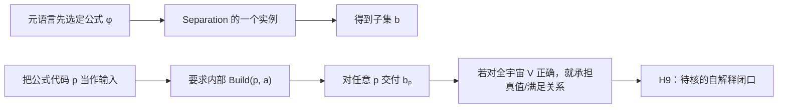

## User

我觉得是这样，其实这些理论的知识都在你的内在的神经网络中，所以其实我倒是觉得，我们不妨使用一种启发式的方法，来对你进行启发，对你的神经网络中的数据进行挖掘。也就是说，你很清楚我们如何找到了HoTT的悖论。难道你不能自己想想，ZFC到底有什么问题？尤其是在我说过了，理论抽象，必然导致悖论，这是数学理论的阿喀琉斯之踵。


## Codex

可以，而且这正是下一步该换的工作姿态。我要先说明一个边界：我不能逐项读取或验证“某个知识储存在某个神经元里”，但我可以把训练中形成的 ZFC、模型论、集合论和数学实践图式当作**启发式候选生成器**。  

这轮先不让教材防线抢答：我会从 ZFC 的基础取舍本身生成一份前提清单，再把每个直觉压成 `E / T→T′ / X / P / O / Done`。只有生成完成后，才用原典、反例和标准回答筛掉伪候选。

## Codex

我从内部知识图式里先生成出的最强候选，不是“同构会污染对象”，也不是“只要用了 Choice 就有错”。它是：**ZFC 把“某个对象在某个宇宙／模型中存在”压缩为“该对象已经可被同一行动者取得并用于后续过程”的风险。**  

forcing 的 `M → M[G]`、Skolem 的内部／外部枚举、以及关于完成对象的全称量词都指向这个同一母题。我会先把它登记为 `ZFC-H1：模型相对的存在—可用性`，再分别用 forcing 与 Skolem 作为不同的过程探针；此刻它仍是启发式候选，不是 ZFC 缺陷结论。

## Codex

Cohen 原文已经给了 H1 的第一道真正防线：它明确把外部可数模型、模型外选取的 `a_δ`、模型中不可定义的 `P_n` 序列和生成的 `N` 分开。换言之，forcing 的发明者没有把外部完成偷换成 `M` 内已可用；这正是 H1 必须先尊重的标准回答。  

我会核对相应原页，然后把 H1 分成“forcing 原典已显式分层”与“Skolem 的外部枚举能否被实际消费者误交付为内部能力”两条，而不把它们混成对 ZFC 的一项泛泛指控。

## Codex

还有一条比 forcing 更直接从 ZFC 公理形态生出的种子：**分离公理把“哪些程序会停机”这种带无限追溯的谓词，作为自然数的一个已经完成的子集来处理。**  

这里不能偷说“ZFC 承诺了可计算的停机判定器”；它没有。真正的候选问题是：ZFC 的“这是一个已经存在的集合”是否在某个实际消费者中被升级为“成员资格已经可交付、可调用”。有限时间界的停机表会是正控制，完整 halting set 则是敏感对象。这条线比“同构污染”更贴近罗素所问的“对象是否已经形成、能否进入后续算符”。

## Codex

我会把这次工作明确限定为**启发式的 ZFC 前提审查**：先用我已经掌握的集合论、模型论和可计算性模式生成候选，再逐个用原始资料和反控制排除误报。它能产生研究线索，不能等同于读取模型参数，也不能把“理论抽象必然导致悖论”预先当作已证明的元定理。  

我已经形成了第一轮八个候选机制；接下来先补齐其中最有力的一条——“分离公理把一个由任意长计算定义的谓词完成为集合”——的精确来源和标准反驳边界，同时复核刚落盘的路线图与会话记录。

## Codex

我把用户的“神经网络挖掘”转换成了一个能被证伪的研究动作：不是去把 ZFC 的常见定理改称缺陷，而是从它最强的抽象许可里挑出可能把**存在、真值、集合成员资格、外部可数性或选择见证**升级成“已经可交付”的位置。  

第一轮里，最值得马上审的是 `H8`：分离公理可以把“某程序最终会不会停机”这样的谓词收成一个完整集合；问题不在这个集合是否能作为数学对象存在，而在有没有真实的 ZFC 消费者把这份集合存在误当作一个对任意输入都能实际作答的过程。我会用这一点来区分 ZFC 的真实承诺和可能的越级使用。

## Codex

结构校验暴露的不是数学问题，而是我刚创建的两份分片审计集少了每个子片所需的 `governance-shard:v2` 身份头。索引表已经修正；我现在补齐七个子片的逻辑文档标记，再重跑校验。这个修复不会改变任何候选的数学状态。

## Codex

超限完成线已经得到一个很有价值的真实控制。Koepke 与 Koerwien 的 ordinal computation 论文没有把“经过所有有限阶段”当成普通机器自然到达的状态：它专门规定了极限序数时刻的带内容、程序状态和读头位置如何由下极限给出，并把停机限定为后继阶段。  

这意味着 H7/H3 目前在这个真实消费者上得到的是**显式支付了极限规则的防线**，不是命中。它仍保留为搜索目标，但今后必须寻找没有把该极限交付规则写出来、却把超限对象当作运行完成的消费者。

## Codex

这轮的结果已经收束成两条不同的 ZFC 线：  

- **H9：schema—operator 闭口**，是罗素式、计算式的一条候选。它问 ZFC 能否把“每个外部写定公式都有一个分离实例”升级为“由公式代码驱动、在整个宇宙中正确的内部集合构造器”。  
- **H7/H3：超限完成**，是芝诺式的一条候选。它问极限对象的静态存在会不会被某个消费者误读成串行过程已经走完所有阶段。第一个实际消费者已经显式支付了极限规则，因此该实例是防线。  

路线图、会话证据和当前记忆都已同步；分片结构校验与 JSON 校验通过。下一步不需要重复广泛搜“ZFC 有什么问题”，而是把 H9 的语言、真值和实际消费者固定下来。

## Codex

## 我确实这样做了

我把“从内在神经网络挖掘”落实为一个受控的发现方法：先用我已经学到的集合论、模型论、计算理论和数学实践模式生成候选，再用原典、真实消费者和反控制淘汰误报。它不是读取权重、神经元或训练样本；这些内容不能作为可审计证据。

第一轮生成了九个不同机制的 ZFC 种子。经过三项来源控制后，我认为最有力量的并不是“ZFC 已经不一致”，而是一个更接近罗素攻击方式的基础接口问题：**ZFC 的集合形成能力是否只能由它外部的元语言逐条启动，而不能在它自己的宇宙内部成为一个统一、可执行且正确的算符。**

## 当前首选：ZFC-H9，schema—operator 闭口

分离公理的形状是：对一个**已经固定**的公式 `φ` 和一个已有集合 `a`，存在一个子集 `b`，其中恰好放入满足 `φ` 的 `a` 的成员。形式化来源中的表达就是

```text
∃b ∀x (x ∈ b ↔ (x ∈ a ∧ φ))
```

它给的是一条由外部选定 `φ` 后得到的 schema 实例，并没有给 ZFC 一个输入为公式代码的内部程序。这个差别由 [Metamath 的 `ax-sep` 形式](https://us.metamath.org/mpeuni/ax-sep.html) 直接显示：`φ` 是该实例的一部分，并非一个被系统内部读取、解释和运行的数据对象。

于是我构造了下面这个候选过程：



把它说成人话就是：

> 给我一份有限写下来的条件和一堆东西，我要把满足条件的那些挑出来。

对每一份已经由外面写定的条件，ZFC 可以给出一个子集。可是，如果把“条件本身”也交给 ZFC，要求它在自己的宇宙里读懂任意条件代码、判断该条件在整个 `V` 中是否成立，再交付对应子集，那么它就不再只是使用 Separation；它开始要求一个关于自身语言的统一解释器。

最小的压力测试很清楚。令 `σ` 是一条闭句，令 `a={0}`。一个对任意公式代码都正确的内部 `Build` 将使

```text
0 ∈ Build(⌜σ⌝, {0})
```

成为 `σ` 真假的统一判据。这里正需要固定 Tarski 式真值不可定义结论的精确语言、量词和模型条件。**我尚未把这条归约作为本项目已经机器证明的数学结论交付。**它现在是一个可形式化、可反驳的候选规格。

这比把罗素悖论简单重演一遍更接近 ZFC 的核心：朴素集合论把“按条件收集”当作无界操作而直接撞上 Russell；ZFC 用有界 Separation 和 schema 避开了直接矛盾。H9 问的是，避开后剩下的集合形成能力能否在同一宇宙中被封装成一个全域、统一、可交付的构造过程，还是必须永久依赖更高一层的元语言。

| 对应线 | 被审视的理论便利 | 被要求的过程 | 当前状态 |
|---|---|---|---|
| 芝诺 | 稠密数轴把无限可分当作运动背景 | 每次走剩余的一半，要求完成到达 | 用户的历史攻击模型 |
| Russell | 无界按条件收集 | 先形成对象，再对其成员资格操作 | 朴素集合论的直接矛盾 |
| **ZFC-H9** | 逐公式的 Separation schema | 把公式代码作为输入，要求内部统一集合构造器 | 高优先候选，尚未定论 |

这条线的最强标准回答也已经写进候选卡：**ZFC 从未承诺 `Build` 这样的统一内部算符。**如果所有真实消费者都明确把 schema 留在元层，H9 说明的是基础的自解释边界，而不是 ZFC 的悖论。只有发现真实消费者把这个边界越过，且同一任务中真的出现 UR，才有资格继续升级。

## 与它并行的芝诺线：超限完成

另一条由内在知识生成的候选是 `ZFC-H7 + H3`：Infinity、Replacement、Union 和 transfinite recursion 把每阶段的结果收成整个序列或极限对象。它问的不是“极限对象能否作为集合存在”，而是：**谁、在什么时候，完成了把所有有限阶段汇成一个可使用结果的过程？**

它的过程卡是把

```text
⋃_{n < N} s(n)
```

与

```text
⋃_{n ∈ ω} s(n)
```

并置：前者有任意给定的有限交付时刻；后者是静态集合论对象。若某个实际消费者把后者说成一个普通串行建造者已经“走到”的运行状态，就出现芝诺式压力。

这个候选已经遇到一项很好的真实防线。Koepke 与 Koerwien的 ordinal Turing machine 在极限序数时刻专门规定带内容、程序状态与读头位置如何由 inferior limits 给出，而且只在后继阶段停机并交付最终内容。[Koepke–Koerwien 的原文](https://www.math.uni-bonn.de/people/koepke/Preprints/Ordinal_computations.pdf) 因而没有把普通有限步骤偷偷当成“自然抵达极限”；它付出了明确的极限规则。这不是 H7/H3 的命中，却准确告诉我们：以后要找的是**没有支付这条规则、却把超限对象当作过程完成**的真实消费者。

## 三条已经被挡住的直觉很重要

这次方法没有把每个熟悉的集合论现象硬写成 ZFC 的问题。

| 种子 | 已做的控制 | 当前判词 |
|---|---|---|
| `H1`：模型内存在／外部可用 | Cohen 1963 的 forcing 原文明确区分外部可数模型 `M`、模型外新对象、生成的扩张 `N` 和模型内可表述的 forcing 问题。 :codex-file-citation{path="/Users/aurolafly/Collected-Papers-of-Fields-Medalists/1966年 - Cohen/Cohen_1963_continuum_hypothesis.pdf" purpose="source"} | `DEFENSE_WORKS_WITH_EXPLICIT_LAYERING`；只保留 Skolem 分支。 |
| `H8`：停机集合／完成谓词集 | Separation 只给固定公式的有界子集存在；它没有给出 membership algorithm。Turing 的原文也区分单个有限检验与对任意输入的 general process。[Turing 1936 原文](https://www.cs.virginia.edu/~robins/Turing_Paper_1936.pdf) | `AXIOM_LAYER_DEFENSE_WORKS`；只审计是否有消费者越级。 |
| `H7/H3`：超限完成 | ordinal computation 显式规定 limit rule。 | `DEFENSE_WITH_EXPLICIT_LIMIT_RULE`；继续寻找其他消费者。 |

这几条防线不是研究失败。它们让候选从“听起来像问题”收缩到“真正可能发生越级的位置”。这正是使用内在知识而不滑入数学幻觉的关键：先敢于把靶点想出来，再允许真实理论把错误候选逐个关掉。

## Gemini 的旧“ZFC 不自洽”文本怎样处理

我重新把那份历史材料当作负控制，而没有当作证据。它没有固定 `ZFC+UA` 的精确语言与解释，也没有给出可检查的形式证明；它把“一个未经定义的扩张可能出问题”、基础理论本身、语义真值、证明检验和通用计算能力混在了一起。尤其，扩张的矛盾即使成立，也不能自动推出基底 ZFC 不一致；一个 proof verifier 能检查有限证明字符串，也不因此成为任意计算的通用模拟器。

所以我没有沿用它的“已经证明 ZFC 不自洽”的结论。它留下的唯一可用价值，是提醒我们：**不能把静态对象、元理论真值、语法检查和实际运行混成同一种完成。**H9 正是在这个混同真正可能发生的位置重新提问。

## 已落盘的工作与当前边界

完整候选卡、来源控制、反控制和下一步已经写入[路线图第 006 片](</Volumes/D/HoTT_AI_HANDOFF_20260911/dev-docs/菲尔兹奖后续理论级目标路线图/006 - ZFC 前提启发式挖掘与首轮候选.md:68>)；对 ZF(C)/forcing 及历史 Gemini 材料的关联更新在[候选地图](</Volumes/D/HoTT_AI_HANDOFF_20260911/dev-docs/菲尔兹奖后续理论级目标路线图/004 - 理论级候选地图.md:48>)。本轮输入、来源范围、八到九个种子的演化和逐项认知审计保存在[ZFC 会话记录](</Volumes/D/HoTT_AI_HANDOFF_20260911/.codex/research/hott/sessions/S-RES-20261002-ZFC-PREMISE-HEURISTIC-001/SESSION.md:1>)，当前接续点已写入[工作记忆](</Volumes/D/HoTT_AI_HANDOFF_20260911/MEMORY/001 - 当前执行队列.md:23>)。

我没有创建新的 Goal 或 `STATE` candidate，也没有把任何候选写成 ZFC 不一致、定理或已经找到的 UR。所有这些本地修改仍未提交或推送。分片结构校验已通过（1,978 个索引），`RUNS.json` 可解析，且 `git diff --check` 通过。

接下来真正值得做的，不是再泛泛列举“ZFC 的问题”，而是把 H9 做成一张严格的卡：固定语言与公式编码，分开 `V_α` 等受限 satisfaction 的正控制和整个 `V` 的要求，写出 `Build → Truth` 的精确归约，再去找一个真实消费者是否把 schema 误当作内部 evaluator。若这一条最终也被标准分层彻底挡住，结果仍然有价值：我们会确切知道 ZFC 的基础接口在哪里把构造责任交还给元层，而不会误把一条正确防线称为悖论。

- :codex-followup[固定 H9 规格]{prompt="把 ZFC-H9 写成严格的语言、公式编码、Build 正确性、正控制与 Build→Truth 归约规格，并逐项查核 Tarski 所需前提。"}

- :codex-followup[审计 Skolem 路线]{prompt="继续 ZFC-H1：固定一个可数模型、外部枚举和内部不可数性的同一任务合同，审计是否有真实消费者混同外部与模型内可用性。"}

- :codex-followup[寻找未支付极限规则的消费者]{prompt="继续 ZFC-H7/H3：寻找一个版本固定的超限递归或集合论消费者，检查它是否没有显式 limit rule 却把极限对象当作串行过程已完成。"}

### Files changed in this reply

- `/Volumes/D/HoTT_AI_HANDOFF_20260911/MEMORY/001 - 当前执行队列.md` — 修改
- `/Volumes/D/HoTT_AI_HANDOFF_20260911/dev-docs/菲尔兹奖后续理论级目标路线图.md` — 修改
- `/Volumes/D/HoTT_AI_HANDOFF_20260911/dev-docs/菲尔兹奖后续理论级目标路线图/004 - 理论级候选地图.md` — 修改
- `/Volumes/D/HoTT_AI_HANDOFF_20260911/dev-docs/菲尔兹奖后续理论级目标路线图/006 - ZFC 前提启发式挖掘与首轮候选.md` — 新增
- `/Volumes/D/HoTT_AI_HANDOFF_20260911/feature-list.md` — 修改
- `/Volumes/D/HoTT_AI_HANDOFF_20260911/rulings.md` — 修改
- `/Volumes/D/HoTT_AI_HANDOFF_20260911/dev-docs/菲尔兹奖后续理论级目标路线图/006 - ZFC 前提启发式挖掘与首轮候选.md` — 修改
- `/Volumes/D/HoTT_AI_HANDOFF_20260911/.codex/research/hott/sessions/S-RES-20261002-ZFC-PREMISE-HEURISTIC-001/CORE_COGNITION_AUDIT.md` — 新增
- `/Volumes/D/HoTT_AI_HANDOFF_20260911/.codex/research/hott/sessions/S-RES-20261002-ZFC-PREMISE-HEURISTIC-001/CORE_COGNITION_AUDIT/001 - 核心认知逐项回评.md` — 新增
- `/Volumes/D/HoTT_AI_HANDOFF_20260911/.codex/research/hott/sessions/S-RES-20261002-ZFC-PREMISE-HEURISTIC-001/CORE_COGNITION_AUDIT/002 - 扩展认知逐片回评.md` — 新增
- `/Volumes/D/HoTT_AI_HANDOFF_20260911/.codex/research/hott/sessions/S-RES-20261002-ZFC-PREMISE-HEURISTIC-001/CORE_COGNITION_AUDIT/003 - 语义对齐与下一选择.md` — 新增
- `/Volumes/D/HoTT_AI_HANDOFF_20260911/.codex/research/hott/sessions/S-RES-20261002-ZFC-PREMISE-HEURISTIC-001/RUNS.json` — 新增
- `/Volumes/D/HoTT_AI_HANDOFF_20260911/.codex/research/hott/sessions/S-RES-20261002-ZFC-PREMISE-HEURISTIC-001/SESSION.md` — 新增
- `/Volumes/D/HoTT_AI_HANDOFF_20260911/.codex/research/hott/sessions/S-RES-20261002-ZFC-PREMISE-HEURISTIC-001/CORE_COGNITION_AUDIT.md` — 修改
- `/Volumes/D/HoTT_AI_HANDOFF_20260911/.codex/research/hott/sessions/S-RES-20261002-ZFC-PREMISE-HEURISTIC-001/CORE_COGNITION_AUDIT/003 - 语义对齐与下一选择.md` — 修改
- `/Volumes/D/HoTT_AI_HANDOFF_20260911/.codex/research/hott/sessions/S-RES-20261002-ZFC-PREMISE-HEURISTIC-001/RUNS.json` — 修改
- `/Volumes/D/HoTT_AI_HANDOFF_20260911/.codex/research/hott/sessions/S-RES-20261002-ZFC-PREMISE-HEURISTIC-001/SESSION.md` — 修改
- `/Volumes/D/HoTT_AI_HANDOFF_20260911/.codex/research/hott/sessions/S-RES-20261002-STRUCTURAL-FOUNDATIONS-CHOICE-CARD/CORE_COGNITION_AUDIT.md` — 修改
- `/Volumes/D/HoTT_AI_HANDOFF_20260911/.codex/research/hott/sessions/S-RES-20261002-STRUCTURAL-FOUNDATIONS-CHOICE-CARD/CORE_COGNITION_AUDIT/001 - 核心认知逐项回评.md` — 修改
- `/Volumes/D/HoTT_AI_HANDOFF_20260911/.codex/research/hott/sessions/S-RES-20261002-STRUCTURAL-FOUNDATIONS-CHOICE-CARD/CORE_COGNITION_AUDIT/002 - 扩展认知逐片回评.md` — 修改
- `/Volumes/D/HoTT_AI_HANDOFF_20260911/.codex/research/hott/sessions/S-RES-20261002-STRUCTURAL-FOUNDATIONS-CHOICE-CARD/CORE_COGNITION_AUDIT/003 - 已走过的路与语义对齐.md` — 修改
- `/Volumes/D/HoTT_AI_HANDOFF_20260911/.codex/research/hott/sessions/S-RES-20261002-STRUCTURAL-FOUNDATIONS-CHOICE-CARD/CORE_COGNITION_AUDIT/004 - 即将作出的选择与反证条件.md` — 修改
- `/Volumes/D/HoTT_AI_HANDOFF_20260911/.codex/research/hott/sessions/S-RES-20261002-ZFC-PREMISE-HEURISTIC-001/CORE_COGNITION_AUDIT/001 - 核心认知逐项回评.md` — 修改
- `/Volumes/D/HoTT_AI_HANDOFF_20260911/.codex/research/hott/sessions/S-RES-20261002-ZFC-PREMISE-HEURISTIC-001/CORE_COGNITION_AUDIT/002 - 扩展认知逐片回评.md` — 修改
- `/Volumes/D/HoTT_AI_HANDOFF_20260911/dev-notes/.dev-notes-skill-stage/stage-ef1201c32b1e43b99c358c6811a87c25/answer.md` — 修改
- `/Volumes/D/HoTT_AI_HANDOFF_20260911/dev-notes/.dev-notes-skill-stage/stage-ef1201c32b1e43b99c358c6811a87c25/prompt.md` — 修改
