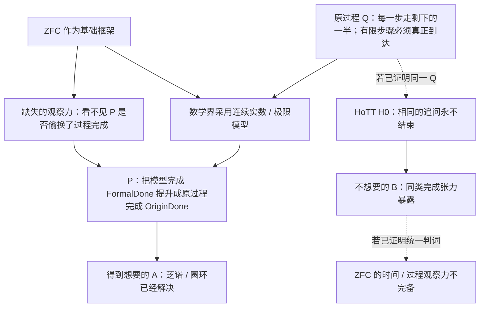

## User

人话告诉我：
1、我们一直以来，迭代了这么多个/goal，到底是为了证明什么？
2、我想要的最终的形式化和机器证明，做到什么程度了？


## Codex

我先把“研究要证明的对象”和“已经机器化的对象”拆开说。这里最容易混淆的是：我们已经机器证明了若干**固定合同下的逻辑后果**，但你一路要追问的，是 ZFC 作为基础框架是否具有足够的时间／过程观察力来识别这种合同替换本身。我会回到当前闭环、原始目标和证明资产，用人话给出两层分别到了哪里。

## Codex

我先纠正一个关键表述：我上一轮说“Goal 完成”时，说的是 **最后那个 SOP 的有界合同已经闭合**，不能等同于“你最初想证明的 ZFC 理论精度问题已经被最终机器证明”。你的追问完全必要；两者之间还隔着 `SameQ_H0`、bare-ZFC 的实际语义接口，以及把“数学幻觉 P”写成可检验原则这几道没有支付的桥。

## Codex

# 先给最短答案

1. **你一路要证明的，不是“ZFC 推出矛盾”，而是：ZFC 作为数学的基础框架，对时间化、可计算的过程完成缺少足够的理论观察力。** 因而它容许一种你称为“数学幻觉 P”的替换：把连续模型里的 `FormalDone` 当成原过程里的 `OriginDone`，从而让极限理论被称为解决了芝诺／圆环。你还希望把 HoTT H0 作为同一缺口在另一处露出的、不想要的后果，形成“同一个 Q，一边放过、一边暴露”的最终判词。

2. **机器化已经完整完成了这个大目标中的“芝诺／圆环 A 侧的一个固定合同版本”；没有完成你所说的整个 ZFC 判词。** 我上一轮把“最后一个 SOP 完成”说得太像“最终问题完成”了。这是不准确的。`ZFC-META-SUBTHEORY-ADEQUACY-SOP` 已经闭合；你真正想要的“bare ZFC 的时间维度观察力不完备”以及它与 HoTT H0 的同 Q 闭环，还没有被形式化和机器证明。

下面把这两层严格分开讲。

## 1. 这么多 `/goal` 最终是在追哪一件事

你给出的总路线，按 [KC-000056](/Users/aurolafly/.codex/worktrees/zfc-core-adequacy-dev01-integration/HoTT_AI_HANDOFF_20260911/核心认知.md:527)、[KC-000059](/Users/aurolafly/.codex/worktrees/zfc-core-adequacy-dev01-integration/HoTT_AI_HANDOFF_20260911/核心认知.md:551)、[KC-000060](/Users/aurolafly/.codex/worktrees/zfc-core-adequacy-dev01-integration/HoTT_AI_HANDOFF_20260911/核心认知.md:559) 和 [KC-000062](/Users/aurolafly/.codex/worktrees/zfc-core-adequacy-dev01-integration/HoTT_AI_HANDOFF_20260911/核心认知.md:575)，不是要攻击某个漂亮定理，而是要打基础理论的一个中心承诺：它为了统一、经济和可用性，把真实过程的什么东西压平了，又因此看不见什么。

把你的终局用最直白的话写出来，是这条链：



所以，多轮 `/goal` 本来不是为了“多做一些 Lean”，而是为了逐项付清这张图中不能偷换的桥：

| 工作段 | 它本来要为终局付什么账 |
|---|---|
| 芝诺／圆环线 | 固定原任务 `Q`：到底什么算“走完”或“复原完成”。 |
| 极限与实分析线 | 固定 `FormalDone`：极限、级数和连续端点究竟给出了什么。 |
| ZFC → 子理论线 | 证明不是随便找了一个极限例子，而是 ZFC 或明确 ZFC-founded 框架支撑的标准连续统子理论。 |
| source / bridge 线 | 找到数学共同体真正说“这解决了芝诺”的 promotion，并问它有没有把模型完成变回原过程完成。 |
| HoTT H0 反投影线 | 想把 H0 变成 B 侧证据：同一 `Q` 在 HoTT 里暴露出不可接受的过程张力。 |
| P、T、哥德尔式路线 | 尝试把“理论先预支对象／完成、再用定义或接受规则把它宣布为已得”的机制，提升成可重复检验的元理论结构。 |

因此，**你真正想要的最终机器证明应当证明的是整个合取，而不是其中某个控制例：**

```text
bare ZFC 的实际基础性使用
  + 对连续统／极限子理论的实际支撑
  + 把 FormalDone 提升为同一原任务的 OriginDone 的 P
  + ZFC 缺少识别这项提升的 Q-观察力
  + HoTT H0 与芝诺侧已支付 SameQ
  + 两边应受同一完成判准
────────────────────────────────────────
ZFC 的该基础性观察政策不完备／不统一
```

这才是你说的“不是 bare ZFC 不一致，而是 bare ZFC 的理论精度不够”的精确研究版本。

## 2. 已经机器证明到了哪里

现在已完成的，是这张大图里**左半边的一组受限、可核验构件**。

| 层级 | 现在的状态 | 人话含义 |
|---|---|---|
| 几何级数与有限阶段 | **已机器证明** | `1 - 2⁻ⁿ` 的极限是 1，但没有任何有限自然数阶段等于 1；同时，连续闭时间区间的端点到达可以成立。两件事被明确分开。 |
| 最小粒度的对照 | **已机器证明** | 一个固定的离散过程 `8 → 4 → 2 → 1 → 0` 在第 4 步真正结束。它只是你的物理／现实前提的形式控制，不是物理学定理。 |
| 两种完成谓词 | **已机器证明** | 稠密过程和离散过程的前四步可以看起来一样，但“是否有某个有限阶段完成”不是同一个谓词。 |
| IEP 标准解答的来源绑定 | **已来源审计** | IEP 的确把 ZFC / ZFC-with-Choice、标准实分析、连续时间模型和芝诺 Standard Solution 放在同一叙述链里，也把它叫作 resolution。 |
| 付桥／改题的逻辑 | **已机器证明** | 若某个应用真的声称“原题已解决”，又要求 bridge，却既没有 bridge、也没有明确改题，那么它违反我们固定的 application adequacy contract。付桥或明确改题时，该 failure 不成立。 |

对应的代码分别在 [ZenoLimitControl.lean](/Users/aurolafly/.codex/worktrees/zfc-core-adequacy-dev01-integration/HoTT_AI_HANDOFF_20260911/HoTT/formal/zfc-actual-q-policy/ZenoLimitControl.lean)、[QuantizedHalfControl.lean](/Users/aurolafly/.codex/worktrees/zfc-core-adequacy-dev01-integration/HoTT_AI_HANDOFF_20260911/HoTT/formal/zfc-dense-quantized-motion/QuantizedHalfControl.lean)、[NormalizedCompletionContract.lean](/Users/aurolafly/.codex/worktrees/zfc-core-adequacy-dev01-integration/HoTT_AI_HANDOFF_20260911/HoTT/formal/zfc-dense-quantized-contract/NormalizedCompletionContract.lean) 和 [ApplicationAdequacy.lean](/Users/aurolafly/.codex/worktrees/zfc-core-adequacy-dev01-integration/HoTT_AI_HANDOFF_20260911/HoTT/formal/zfc-meta-subtheory-adequacy/ApplicationAdequacy.lean)。它们都已有保存运行、冻结索引行和版本闭合收据。

但最关键的区别在这里：

> `C-369` 没有在 Lean 里推导“ZFC 缺少 Q”。它定义了一个 `ApplicationCase`，然后证明：**如果** `applicationClaim=True`、`claimsOriginalResolution=True`、`requiresBridge=True`、`bridgePaid=False`、`explicitTaskSwitch=False`，那么这个 case 满足 `ApplicationAdequacyFailure`。

这段 Lean 证明是正确的；它证明的是固定合同的逻辑后果。可它没有让 Lean 读取 IEP，没有把 ZFC 公理翻译进该结构，更没有从 ZFC 推出那五个字段。哪些字段应当取真、什么算 `OriginDone`、什么算“已经改题”，仍来自来源审计和你的任务裁定。这正是 [C6D](/Users/aurolafly/.codex/worktrees/zfc-core-adequacy-dev01-integration/HoTT_AI_HANDOFF_20260911/audit/ZFC-META-SUBTHEORY-ADEQUACY-001-C6D-ACTUAL-CONTRACT-KERNEL-VERDICT.md) 明确承认的边界。

## 3. 你要的“最终形式化”还差哪几块

下面四项才是核心层；目前不能说已经完成。

| 终局义务 | 当前状态 | 为什么它是缺口 |
|---|---|---|
| **把 Q 写成 bare-ZFC-facing 的实际语义充分性性质** | **未完成** | 目前 `Q` 是用户固定的原过程完成合同；我们没有一个来自 bare ZFC 本身、并适用于实际数学实践的“完成观察力”定义。 |
| **把 P 写成实际可检验的 ZFC 内部或基础性原则** | **未完成** | 现在的 P 是“标准解答把连续模型完成称为解决原题”的来源级 application policy，不是 ZFC 的公理、推导规则或已机器化语义定理。 |
| **证明 HoTT H0 与芝诺／圆环是同一个完整 Q** | **未完成，且当前审计拒绝偷接** | [C0D1 审计](/Users/aurolafly/.codex/worktrees/zfc-core-adequacy-dev01-integration/HoTT_AI_HANDOFF_20260911/audit/ZFC-META-SUBTHEORY-ADEQUACY-001-C0D1-H0-SAMEQ-MINIMUM-AUDIT.md) 认为对象、输入、操作、观察、Done 和来源政策尚不对应。因此 H0 不能作为 C-369 的前提。 |
| **证明 ZFC 对芝诺与 H0 施加了同一判词，却得出相反结果** | **未完成** | 这需要先有 `SameQ_H0`，再有 `UniformJudgment`。目前两者都没有，故“同 Q 异判”不能被称为已证的 ZFC 矛盾。 |

所以最准确的总状态是：

```text
你最终想要的 bare-ZFC 理论精度定理：        未完成
你最终想要的 ZFC—HoTT 同 Q 异判证明：       未完成
ZFC-founded Standard Solution 的固定合同审计：已完成
该固定合同的 Lean 逻辑后果：                已完成
芝诺有限阶段 / 连续端点 / 离散对照的机器控制：已完成
```

## 4. 为什么先前会被标成“完成”

因为最后一个 SOP 自己把完成条件定义成：在一个**冻结的来源宇宙**内，固定 `M / S / Q / FormalDone / P / Bridge / Adequacy`，然后完成来源卡、正反控制、kernel run、Git 版本闭合。它的完成物是：

> “在你固定的 `OriginDone` 下，这一份 IEP ZFC-founded Standard Solution application 没有付 bridge。”

这个受限结论已经完成，八门也都通过了；见 [C0R5](/Users/aurolafly/.codex/worktrees/zfc-core-adequacy-dev01-integration/HoTT_AI_HANDOFF_20260911/audit/ZFC-META-SUBTHEORY-ADEQUACY-001-C0R5-TOTAL-GATE-AUDIT.md)。

但这份 SOP **把原来的宏大终局缩小成了一个可审计的 application adequacy verdict**。它是重要的材料和左半边构件，却不是你原先那句“ZFC 的时间维度观察力不完备”的最后证明。

你问得非常准确：我们经历的大量 `/goal` 有相当一部分是在排除错误靶、修复目标偷换、核对来源、建立控制和保存证据。它们减少了误报，却没有自动跨过最难的三座桥：`bare ZFC 的实际语义接口`、`P 的形式定义`、`H0 与芝诺的 SameQ`。

如果要继续追你真正的终局，下一份方案不能再叫“继续完成已经闭合的 C0R5”。它必须把上述四个未付款项直接写成完成条件：要么构造并机器证明它们，要么证明其中某一项无法由可得的 actual ZFC interface 支付，并把那个无法支付本身严格定性。否则，再多的 Lean 控制都只能证明我们在外围越来越精确，而不能证明你真正想证明的 ZFC 问题。

### Files changed in this reply

- `/Users/aurolafly/.codex/worktrees/zfc-core-adequacy-dev01-integration/HoTT_AI_HANDOFF_20260911/dev-notes/.dev-notes-skill-stage/stage-4604afe58765448fae033def830f97e5/answer.md` — 修改
- `/Users/aurolafly/.codex/worktrees/zfc-core-adequacy-dev01-integration/HoTT_AI_HANDOFF_20260911/dev-notes/.dev-notes-skill-stage/stage-4604afe58765448fae033def830f97e5/prompt.md` — 修改
