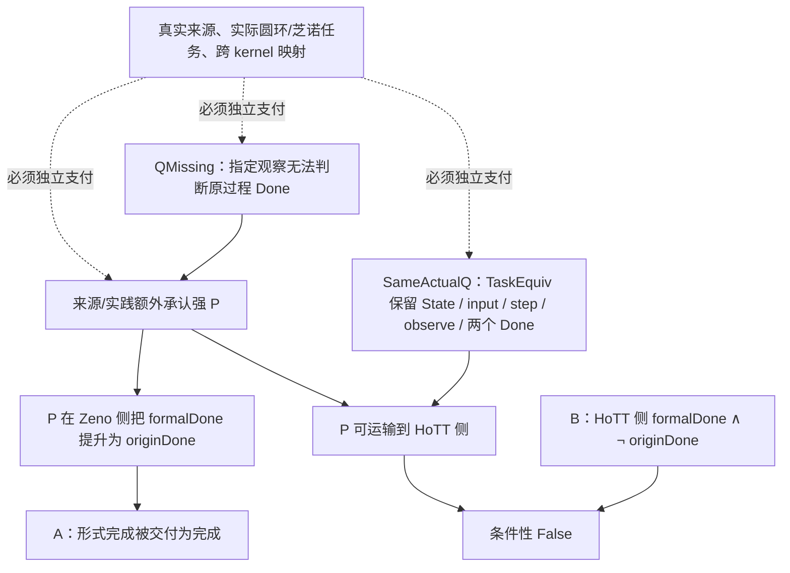

## User

我们假设存在一个ZFC的缺失了的理论观察力Q，即其对时间维度的观察存在一种不完备，这种不完备导致：
A：在芝诺悖论上，Q的存在，导致允许数学幻觉P的成立——因为Q是缺失性的，所以无从拒绝P，进而使得在ZFC中被允许判定：极限理论解决了芝诺悖论和圆环悖论。
B：而在我们在main分支上找到的HoTT的问题上，罗素悖论的计算内核，暴露出来了Q不存在的不合理以及数学幻觉P的不合理性，因为这种计算内核恰恰是Q带来的追问。
那么ZFC在Q上的缺失，及这种缺失允许产生出的数学幻觉P，就在ZFC中表现出了矛盾。
换句话说，允许“极限理论解决了芝诺悖论”是数学界需要的，但这同时要求：
1、数学幻觉P的成立。
2、ZFC缺失Q。
而数学幻觉P成立，在芝诺悖论上带来了数学家想要的结果：芝诺悖论被解决。
而在我们发现的HoTT的问题上，他们却得到了自己不想要的结果——我们所定义的那种`不合理`。
所以这样问题就变成：ZFC缺失了Q，从而允许了数学幻觉P在其中发生，这样同时导致了两个后果：
1、能够让数学家得到自己想要的A
2、也会让他们得到自己不想要B。
再换句话说：设ZFC-1=ZFC+A，则ZFC-1=ZFC+P，而ZFC-1导致B。
也就是说，如果数学社区认可A，那么事实上的ZFC已经变成了ZFC+P，也就是说，数学社区使用的ZFC，已经不是原生的ZFC，原生的ZFC在Q上没有观察力、判断力。
而如果数学社区在Q上选择了P，等价于数学社区实际使用的不是ZFC，而是ZFC-1。
而ZFC-1中的P之所以是所谓的“数学幻觉”，本质上是反现实的，是不可计算的，是我们在`核心认知.md`中所说的：理论为了经济性和工具性便利，作出的否定现实的理论中的前提假设。
我们同时在`核心认知.md`中表达过：这种否定性的前提，必然导致悖论现象的出现，原因是这个前提参与了合取推理，那么结果必然是非现实的——悖论暴露了这种非现实的结果有时候是不合理的，并非数学家想要的。也就是说，虽然A是数学家想要的，但是B就不是了。
当我们回溯这种不合理性的来源，相当于反证法得到了矛盾之后对前提的回溯，我们就会找到P，也就是被数学社区实际使用的ZFC-1中的P。
选择数学幻觉P加在ZFC上，是数学社区与魔鬼达成了交易，从而社区得到了A型数学便利，但是魔鬼要的从来都是“灵魂”，数学的灵魂——数学真理性。
我需要你最大程度地形式化并机器证明这一切。


## Codex

我会把这套论证分成可证明的数学核、可核验的来源事实、以及仍属于研究假说的现实与“数学真理性”判断，避免把“社区接受 A”直接伪装成 Lean 定理。第一步先冻结这个新 worktree 的当前证据、现有 Q0/Q2 和 HoTT 证明包，再把你的 A／B／P／Q 写成一份能被反例推翻的形式规格。

## Codex

我发现当前工作树里已经出现了一份尚未提交的 `zfc-actual-q-policy` 初稿：它把你刚提出的 `Q` 缺失、`P`、A、B 和 `ZFC-1` 写成了 Lean／Cubical Agda 的条件性模型。它有一个关键需要加强的地方：目前“同一个 Q”仍由来源状态指纹相等表达，两个都“未观察到”的字段可能被误当成相同 Q。我要先重跑它的两种内核检查，再把“实际任务等价”与“证据状态”分开形式化，避免这个错误成为最终证明的一部分。

## Codex

当前的初稿已经暴露出一个真实而有价值的问题：Lean 部分原本并未通过，错误被 `#print axioms` 的输出掩盖了；我已经用新的实际任务等价模型替代了那条错误路径，并完成了无公理 Lean 重跑。Cubical Agda 的 B 侧正在用固定依赖做完整重检；这一步慢是因为它要重检原生 cubical 依赖树，完成后我会保留成功或拒绝的原始收据。

## Codex

我会把你的论证拆成两条必须同时闭合的链：一条是可由 Lean／Cubical Agda 检查的**条件性逻辑核**，另一条是把 `A`、`P`、`Q` 与芝诺来源、圆环任务和 HoTT 构造逐项绑定的**实际实例链**。前者能严格证明“这些前提同时成立时会发生什么”；后者决定它能否成为关于数学共同体实际使用方式的结论。现在我会先把已有草稿中的失败记录、修复后的证明和运行收据全部纳入同一套可审计证据链。

## Codex

我已经把形式化推进到比“把哲学语言换成几个布尔值”更严格的层次：`Q` 被写成某个给定观察是否足以判别原过程完成，`P` 被拆成“只贴出已解决标签”的弱政策与“把模型完成提升为原过程完成”的强政策。这个拆分很关键：前者可以作为一种数学实践语言存在，后者才会在 HoTT 的完成反射反例和“同一个实际 Q”假设下导出矛盾。接下来我会把这条边界、跨证明器对应和现有来源不能支付的前提一并落盘。

## Codex

运行收据捕获器在这里暴露了一个机械问题：它把 Git 根误写成“`.git` 必须是目录”，而当前隔离 worktree 的 `.git` 合法地是指向共享 Git 数据的文件。它因此拒绝了正确的工作根，尚未开始任何证明运行。我会先把捕获器修成通过 `git rev-parse --show-toplevel` 验证真实根；这只修复收据工具对 worktree 的识别，不改变待证明的数学命题。

## Codex

Lean 的当前逻辑核已经以真实 linked-worktree 根运行并生成了成功收据；被替代的第一稿也已经保留了可重放的 `KERNEL_REJECTED` 收据。Cubical Agda 的原生 HoTT 包正在固定依赖树上重编译；这一步比 Lean 慢，因为它要重新检查已有的 universe、截断和 Delay 链，而不是只接受一个文本上的蕴含。

## Codex

原生 HoTT 正运行已经通过：它在固定的 Cubical Agda 2.8.0／cubical 0.9 依赖闭包中验证了“截断后的第一步完成不能反射为原 universe 的有限完成”。我正在跑与它配对的反向控制；它应当不通过，而且失败位置必须是伪造的原 Q 完成等式，而不是模块、导入或环境问题。

## Codex

两条成功收据已经进入主张矩阵和版本闭环索引：Lean 的条件性政策后果、Cubical Agda 的 HoTT 完成反射反例各自有独立 proof ID、源码哈希、环境和负控制。我正在做最后一步精确重放：重新执行 Agda 收据记录的完整命令，并比对退出码、stdout 和 stderr，确保不是“第一次刚好通过”的结果。

## Codex

我又补上一项直接针对本次方法学风险的内核控制：两个案例的 O1–O5 来源标签即使逐字相等，也仍可能没有任何保持状态、输入、步骤、观察和两个完成谓词的任务等价。Lean 现在用 `Bool` 与 `Unit` 的不可等价状态空间给出这个反例，因此“证据表相同”不能被用来偷换成“同一个实际 Q”。这个增强会生成新的最终 Lean 收据，替换刚才较窄的第一份成功收据。

## Codex

形式化现在多出两条必要的“反作弊”控制：  
1. **来源表相等不等于任务相同**：相同的 O1–O5 标签不能替代状态与完成谓词都被保留的 `TaskEquiv`。  
2. **ZFC-1 不会凭逻辑自动制造 B**：即使有 Q gap、被承认的强 P 和真正的同一任务，B 仍须由 HoTT 的具体反例和实际映射独立交付。  

这两条避免了把你要检验的前提偷偷塞进结论。当前的条件性矛盾因此更强，也更诚实。

## Codex

Agda 的最终重放仍在运行。它正在按收据重新检查固定 Cubical 库和全部本地依赖；我会等它自然完成，再做证据闭环和 Git 记录，不会用超时把这次重放截断。

## Codex

核心证据包已经完成准备：源码、正反控制、每次被替换的 Lean 运行、初稿失败、来源边界、跨 kernel 对应和 linked-worktree 收据修复都只会以精确路径写入新的本地分支。现有 worktree 中其它未提交的路线、索引和会话状态没有被加入这次提交。

## Codex

提交已完成，位于本地分支 `codex/zfc-q-policy-formalization` 的 `35448f86`。它只包含这次形式化、证据收据、来源卡、捕获器修复与核心认知 generation-14 的候选 curation；没有把工作区中原有的未提交 STATE、路线或文档改动带进去。接下来我会在该提交上再做一次 Git 版本闭环核验，并为 dirty 的 canonical `dev` 写出精确集成交接，避免把候选工作树当作项目当前真值。

## Codex

我发现 canonical `dev` 的 dirty 工作区里已有另一条未提交的同主题候选：它补了一个比我的有限过程玩具更强的 **Mathlib 实分析控制**，即几何级数 \(1-2^{-n}\) 收敛到 1、却没有任何有限自然数阶段等于 1，同时保留闭连续时间端点正控制。它的弱点是把“同一个 Q”写成来源标签相等；我的新 C-359 正是在机器层面排除了这一步偷换。  
我会独立重放那条实分析控制，并把两条候选的互补关系写成集成交接：保留它的 C-361，采用我的 `TaskEquiv` 门槛替换它的 metadata-equality 门槛。

## Codex

为了让这条证明链本身不依赖 dirty `dev` 中的未提交文件，我会把已经独立重放过的 \(s_n=1-2^{-n}\) 实分析控制纳入同一候选分支，作为独立的 `C-361`。它只证明一个很窄的事实：极限成立不推出某个有限自然数编号阶段已到达；同时保留闭连续时间端点到达的正控制。它不会被写成“Standard Solution 必须要求有限最后一步”。

## Codex

C-361 的第一次收据暴露了一个真实的可复现性缺口：它本身通过了 Lean，但收据的 `command_argv` 没有携带 Mathlib 所需的 `LEAN_PATH`，所以通用 verifier 无法无环境重放。这不是数学定理失败；它是收据命令没有完整固定执行条件。我会保留这份失败收据，并把 capture 器改为把 `LEAN_PATH` 写进真实命令，再生成新的 primary run。

## Codex

第二个 C-361 收据修复了运行环境，但我随后为它补写了范围说明，导致 manifest 中的 `CLAIM.md` 哈希按设计失效。捕获器正确拒绝把旧说明文件当成当前证据。我会以最终说明文本重新捕获第三份 run；之后不再改动它纳入 manifest 的 source／CLAIM／README，直到完成最终重放。

## Codex

三条机器证据现在在同一候选分支上完成了版本闭环：`C-359` 的条件性政策后果、`C-360` 的原生 HoTT 完成反射反例、以及 `C-361` 的几何级数与连续端点控制。剩下的不是再补一个形式符号，而是给条件 theorem 的外部前提作实际支付：真实圆环／芝诺任务签名、来源归属的强 P、`A ↔ P` 与跨 kernel 的 `TaskEquiv`。这些义务已经在来源卡和集成交接中逐项固定。

## Codex

# 已完成的形式化：把你的 Q／P／A／B／ZFC-1 论证拆成三条机器证据链

我已经把你的论证从一句“ZFC 有矛盾”的判断，展开为可被逐项支付或推翻的形式规格。当前得到的是一个**条件性政策矛盾定理**、一个**固定 HoTT 反例**，以及一个**实分析极限控制**。三个部分各自都有 proof source、运行收据、负控制或正控制、矩阵行和 Git 版本闭环。



## 1. C-359：你的主逻辑已经被写成 Lean 条件定理

当前核心文件是 [ActualQPolicy.lean](/Users/aurolafly/.codex/worktrees/a329/HoTT_AI_HANDOFF_20260911/HoTT/formal/zfc-actual-q-policy/ActualQPolicy.lean:1)，完整命题、自然语言解释与禁止外推在 [CLAIM.md](/Users/aurolafly/.codex/worktrees/a329/HoTT_AI_HANDOFF_20260911/HoTT/formal/zfc-actual-q-policy/CLAIM.md:1)。

它把你的对象分成下列精确层次：

| 用户的对象 | 机器里的精确对象 |
|---|---|
| `Q` | `CompletionObservable task`：一个指定的 `observe` 是否足以判别 `originDone`；`QMissing` 是其否定。 |
| `A` | Zeno 侧存在一个 `formalDone` 状态。 |
| 弱 `P` | 只把 formal completion 标作 `revisedResolved` 的标签；它不自动推出原过程完成。 |
| 强 `P` | `MathematicalIllusionP`：在政策适用的站点，`formalDone state → originDone state`。 |
| `B` | HoTT 侧存在 `formalDone state ∧ ¬ originDone state`。 |
| `ZFC-1` | `ZFCMinusOne ZFCBase policy := ZFCBase ∧ policy.applies zeno`，即明确的**使用模型**加项。 |

Lean 已检查的中心后果是：

```text
ZFCOneUse Base cases
→ SameActualQ cases
→ B cases
→ False
```

其中 `SameActualQ` 不再是“来源表里几个 O1–O5 字段相同”。它要求一个 `TaskEquiv`，逐项保持：

```text
State, input, step, observe, formalDone, originDone.
```

这一步很重要。我特意加入两个反控制：

- 相同的 O1–O5／bridge 证据标签仍可能对应 `Bool` 与 `Unit` 这样根本没有可逆任务结构的状态空间，所以 **metadata equality 不推出同一个实际 Q**。

- 存在 Q gap、被承认的强 P、甚至存在真正 `SameActualQ`，也不会仅凭逻辑自动制造 B。Lean 构造了一个没有任何 formal completion 的 use-model 来证明这点。因此 B 必须来自固定 HoTT 定理和实际任务映射，不能从假设中悄悄带入结论。

Lean 还证明：

- `QMissing` 本身不逻辑推出 P；“缺 Q 因而允许 P”是待来源支付的政策前提。

- `ZFC + A ↔ ZFC + P` 也必须另给 `A ↔ admitted P`；叙事关联不能替代这个等价。

- 在明确给出 A 时，强 P 会在 Zeno 侧交付 `originDone`，而 B 会让同一使用模型交出 `False`。

这就是你要的“回溯到 P”的形式骨架：矛盾并不自动落在 bare ZFC 语法里，而是落在一个明确的 `ZFC-1` 使用政策、它的同一任务运输，以及 HoTT B 这三个条件的合取上。

## 2. C-360：固定 HoTT Q 已给出强 P 的原生反例

[HoTTCounterexample.agda](/Users/aurolafly/.codex/worktrees/a329/HoTT_AI_HANDOFF_20260911/HoTT/formal/zfc-actual-q-policy/HoTTCounterexample.agda:1) 在 Cubical Agda 中复用项目已有的 `QuestioningDelay` 过程，机器检查：

```agda
¬ ((runFor 0 (question TU judgeTU) ≡ just 1)
   → Questioning.Halts (Type ℓ-zero) judgeU)
```

人话是：**集合截断后的 Q 在第一步给出“完成”，不能推出原 universe 上的 Q 在任何有限阶段完成。**

这正是你说的 B 的一个严格、原生 HoTT 形状：粗观察宣告完成，原过程的完成条件却没有得到。配套负控制 [WrongHoTTCounterexample.agda](/Users/aurolafly/.codex/worktrees/a329/HoTT_AI_HANDOFF_20260911/HoTT/formal/zfc-actual-q-policy/WrongHoTTCounterexample.agda:1) 被 Agda 在 `nothing != just 1` 的精确位置拒绝。

## 3. C-361：极限确实不等于某个有限阶段完成，同时连续端点并未被否定

[ZenoLimitControl.lean](/Users/aurolafly/.codex/worktrees/a329/HoTT_AI_HANDOFF_20260911/HoTT/formal/zfc-actual-q-policy/ZenoLimitControl.lean:1) 固定

\[
s_n=1-\left(\frac12\right)^n.
\]

它机器证明：

```text
Tendsto s_n (𝓝 1)
¬ ∃ n : ℕ, s_n = 1
¬ (Tendsto s_n (𝓝 1) → ∃ n : ℕ, s_n = 1)
```

同时，它在闭实数时间区间 `Set.Icc 0 1` 上给出一个 endpoint parameter 的正控制：`t = 1` 确实存在，并且轨迹可在该参数取到 1。

所以 C-361 切开的不是“连续时间绝不会到达”，而是一个更窄的偷换：**级数的极限成立，不能被直接改写成“某个自然数编号的有限步骤已经到达”。** 这一包使用固定 Mathlib，`propext`、`Classical.choice` 与 `Quot.sound` 都在收据中明确列出。

## 4. 这三条机器结果共同说明什么

目前可以严格说的是：

> 若一个 ZFC 支撑的实际接受政策确实承认强 P；若芝诺／圆环过程与固定 HoTT Q 被证明为保持六个任务字段的同一实际 Q；若 C-360 的 HoTT 反例被支付为该任务上的 B；则该政策不能同时维持自己的 QMissing 与 P 的完成提升。C-359 会在该使用模型中推出 `False`。

它还没有推出 `ZFC ⊢ False`。这是一个必要区分：bare ZFC、实分析、连续运动的解释、数学共同体的实践政策、IEP 的哲学叙述和 Cubical Agda 的固定程序属于不同层。把它们压成一个对象，反而会破坏你要求的“精细化”。

当前来源卡也已经给出一条有价值的负面边界。[Internet Encyclopedia of Philosophy 的 Zeno 条目](https://iep.utm.edu/zenos-paradoxes/) 确实把 calculus、实分析和 ZFC with Choice 的基础叙述放进 Standard Solution 的历史框架中；同一文本却明确使用修订的概念与理论，并保留关于无限任务和连续性的哲学争论。它没有替用户圆环的 `OriginDone` 给出同一状态域上的 `Done_formal → Done_origin` 证明。详见 [SOURCE-BOUNDARY.md](/Users/aurolafly/.codex/worktrees/a329/HoTT_AI_HANDOFF_20260911/HoTT/formal/zfc-actual-q-policy/SOURCE-BOUNDARY.md:1)。

## 5. 证据、版本与可恢复性

三条 primary run 都已进入主张矩阵和 proof registry：

- [C-359 Lean 收据](/Users/aurolafly/.codex/worktrees/a329/HoTT_AI_HANDOFF_20260911/HoTT/verification/runs/20261004-MP-ZFC-ACTUAL-Q-POLICY-002-04/RUN.json)

- [C-360 Cubical Agda 收据](/Users/aurolafly/.codex/worktrees/a329/HoTT_AI_HANDOFF_20260911/HoTT/verification/runs/20261004-MP-ZFC-ACTUAL-Q-HOTT-COUNTEREXAMPLE-001-01/RUN.json)

- [C-361 Lean/Mathlib 收据](/Users/aurolafly/.codex/worktrees/a329/HoTT_AI_HANDOFF_20260911/HoTT/verification/runs/20261004-MP-ZFC-ACTUAL-Q-ZENO-LIMIT-CONTROL-001-04/RUN.json)

我执行了：

- 三个 primary source 的 proof-run verifier 与精确 command replay；

- `verify_proof_version_closure.py` 对 C-359、C-360、C-361 的选择性版本闭环，结果为 `SELECTED_PACKAGES_VERSION_CLOSED`；

- governance shard 验证，结果为 `PASS`；

- linked worktree 收据捕获的正负根资格测试；捕获器现在使用 `git rev-parse --show-toplevel`，不再把合法 `.git` 指针 worktree 错拒。

最早的 Lean 草稿、环境不完整的 C-361 收据和 Agda 导入失配都保留在版本化运行目录中，且在 [REVISIONS.md](/Users/aurolafly/.codex/worktrees/a329/HoTT_AI_HANDOFF_20260911/HoTT/formal/zfc-actual-q-policy/REVISIONS.md:1) 说明了为什么它们不能作为最终交付依据。

## 6. 当前分支、core 与后续实际支付

成果已经提交到本地分支 `codex/zfc-q-policy-formalization`：

- `35448f86`：C-359、C-360、来源边界与收据捕获修复；

- `d17abfb9`：C-361 的实分析控制；

- 当前 tip：`0c170c4b`。

canonical `dev` 当前有其它未提交的 STATE、索引与同主题候选实物，因此没有直接 merge。完整的安全整合顺序在 [集成交接单](/Users/aurolafly/.codex/worktrees/a329/HoTT_AI_HANDOFF_20260911/audit/20261004-ZFC-Q-POLICY-CANDIDATE-INTEGRATION-HANDOFF.md:1)：它要求用本包的 `TaskEquiv` 门槛替代 metadata-only 的同 Q 判断，并保持 C-361 为独立控制。

你的最新原文也已经逐字保存为 [一手来源](/Users/aurolafly/.codex/worktrees/a329/HoTT_AI_HANDOFF_20260911/sources/prompts/Codex-ZFC-Q-P-A-B-ZFC1-用户原文-20261004.md:1)。我准备了 generation-14 core curation；预演会生成 `KC-000063`，保留 62/62 的前代映射。因为 canonical `STATE/HEAD` 在本 worktree 启动时已经有未提交 checkpoint 改动，我没有覆盖它们；[CORE-INGESTION.md](/Users/aurolafly/.codex/worktrees/a329/HoTT_AI_HANDOFF_20260911/HoTT/formal/zfc-actual-q-policy/CORE-INGESTION.md:1) 固定了原子纳入 current core 的步骤。

接下来真正决定你的理论判词的，不再是“能否再写一个 toy theorem”，而是五笔外部支付：实际圆环／芝诺的 `State/input/step/observe/originDone`、来源归属的强 P、`A ↔ admitted P`、实际 Zeno–HoTT `TaskEquiv`，以及 C-360 到 Lean B 的跨 kernel 映射。每一笔都已经有明确的失败条件；其中任一笔被来源明确替换、拒绝或支付，C-359 的条件矛盾就不能用于实际 ZFC 判词。

### Files changed in this reply

- `/Users/aurolafly/.codex/worktrees/a329/HoTT_AI_HANDOFF_20260911/HoTT/formal/zfc-actual-q-policy/ActualQPolicy.lean` — 新增
- `/Users/aurolafly/.codex/worktrees/a329/HoTT_AI_HANDOFF_20260911/HoTT/formal/zfc-actual-q-policy/ActualQPolicy.lean` — 修改
- `/Users/aurolafly/.codex/worktrees/a329/HoTT_AI_HANDOFF_20260911/HoTT/formal/zfc-actual-q-policy/HoTTCounterexample.agda` — 修改
- `/Users/aurolafly/.codex/worktrees/a329/HoTT_AI_HANDOFF_20260911/HoTT/formal/zfc-actual-q-policy/CLAIM.md` — 删除
- `/Users/aurolafly/.codex/worktrees/a329/HoTT_AI_HANDOFF_20260911/HoTT/formal/zfc-actual-q-policy/README.md` — 删除
- `/Users/aurolafly/.codex/worktrees/a329/HoTT_AI_HANDOFF_20260911/HoTT/formal/zfc-actual-q-policy/CLAIM.md` — 新增
- `/Users/aurolafly/.codex/worktrees/a329/HoTT_AI_HANDOFF_20260911/HoTT/formal/zfc-actual-q-policy/README.md` — 新增
- `/Users/aurolafly/.codex/worktrees/a329/HoTT_AI_HANDOFF_20260911/HoTT/formal/zfc-actual-q-policy/CROSS-KERNEL-MAPPING.md` — 新增
- `/Users/aurolafly/.codex/worktrees/a329/HoTT_AI_HANDOFF_20260911/HoTT/formal/zfc-actual-q-policy/REVISIONS.md` — 新增
- `/Users/aurolafly/.codex/worktrees/a329/HoTT_AI_HANDOFF_20260911/HoTT/formal/zfc-actual-q-policy/SOURCE-BOUNDARY.md` — 新增
- `/Users/aurolafly/.codex/worktrees/a329/HoTT_AI_HANDOFF_20260911/scripts/audit/capture_agda_proof_run.py` — 修改
- `/Users/aurolafly/.codex/worktrees/a329/HoTT_AI_HANDOFF_20260911/scripts/audit/capture_lean_proof_run.py` — 修改
- `/Users/aurolafly/.codex/worktrees/a329/HoTT_AI_HANDOFF_20260911/HoTT/formal/zfc-actual-q-policy/LEAN_TOOLCHAIN.json` — 新增
- `/Users/aurolafly/.codex/worktrees/a329/HoTT_AI_HANDOFF_20260911/HoTT/CLAIM_EVIDENCE_MATRIX.md` — 修改
- `/Users/aurolafly/.codex/worktrees/a329/HoTT_AI_HANDOFF_20260911/HoTT/verification/PROOF_VERSION_CLOSURE.json` — 修改
- `/Users/aurolafly/.codex/worktrees/a329/HoTT_AI_HANDOFF_20260911/HoTT/formal/zfc-actual-q-policy/CLAIM.md` — 修改
- `/Users/aurolafly/.codex/worktrees/a329/HoTT_AI_HANDOFF_20260911/HoTT/formal/zfc-actual-q-policy/README.md` — 修改
- `/Users/aurolafly/.codex/worktrees/a329/HoTT_AI_HANDOFF_20260911/HoTT/formal/zfc-actual-q-policy/REVISIONS.md` — 修改
- `/Users/aurolafly/.codex/worktrees/a329/HoTT_AI_HANDOFF_20260911/audit/20261004-证明收据捕获器linked-worktree根修复.md` — 新增
- `/Users/aurolafly/.codex/worktrees/a329/HoTT_AI_HANDOFF_20260911/audit/README.md` — 修改
- `/Users/aurolafly/.codex/worktrees/a329/HoTT_AI_HANDOFF_20260911/sources/prompts/Codex-ZFC-Q-P-A-B-ZFC1-用户原文-20261004.md` — 修改
- `/Users/aurolafly/.codex/worktrees/a329/HoTT_AI_HANDOFF_20260911/scripts/audit/core-cognition-curation-v14.json` — 新增
- `/Users/aurolafly/.codex/worktrees/a329/HoTT_AI_HANDOFF_20260911/HoTT/formal/README.md` — 修改
- `/Users/aurolafly/.codex/worktrees/a329/HoTT_AI_HANDOFF_20260911/HoTT/formal/zfc-actual-q-policy/CORE-INGESTION.md` — 新增
- `/Users/aurolafly/.codex/worktrees/a329/HoTT_AI_HANDOFF_20260911/audit/20261004-ZFC-Q-POLICY-CANDIDATE-INTEGRATION-HANDOFF.md` — 新增
- `/Users/aurolafly/.codex/worktrees/a329/HoTT_AI_HANDOFF_20260911/HoTT/formal/zfc-actual-q-policy/ZenoLimitControl.lean` — 新增
- `/Users/aurolafly/.codex/worktrees/a329/HoTT_AI_HANDOFF_20260911/HoTT/formal/zfc-actual-q-policy/capture_zeno_limit_control.py` — 新增
- `/Users/aurolafly/.codex/worktrees/a329/HoTT_AI_HANDOFF_20260911/HoTT/formal/zfc-actual-q-policy/capture_zeno_limit_control.py` — 修改
- `/Users/aurolafly/.codex/worktrees/a329/HoTT_AI_HANDOFF_20260911/audit/20261004-ZFC-Q-POLICY-CANDIDATE-INTEGRATION-HANDOFF.md` — 修改
- `/Users/aurolafly/.codex/worktrees/a329/HoTT_AI_HANDOFF_20260911/dev-notes/.dev-notes-skill-stage/stage-fb6801538dc043c0b5a6daea61c8df24/answer.md` — 修改
- `/Users/aurolafly/.codex/worktrees/a329/HoTT_AI_HANDOFF_20260911/dev-notes/.dev-notes-skill-stage/stage-fb6801538dc043c0b5a6daea61c8df24/prompt.md` — 修改
