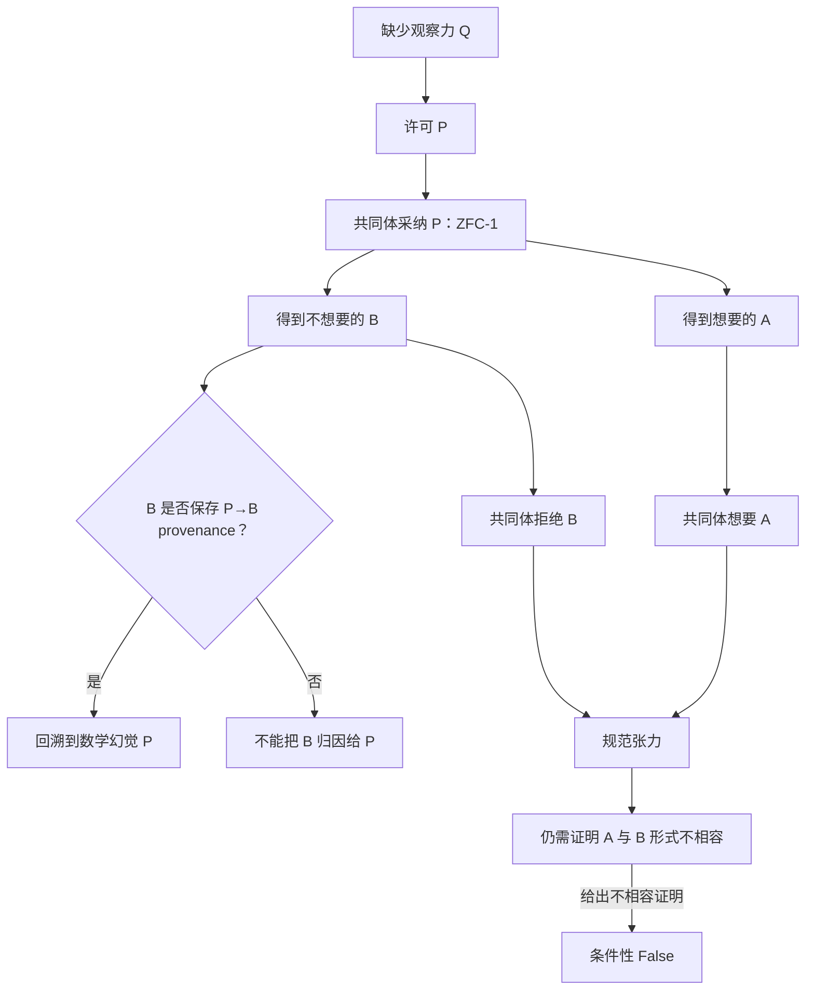

## User

我们假设存在一个ZFC的缺失了的理论观察力Q，即其对时间维度的观察存在一种不完备，这种不完备导致：
A：在芝诺悖论上，Q的存在，导致允许数学幻觉P的成立——因为Q是缺失性的，所以无从拒绝P，进而使得在ZFC中被允许判定：极限理论解决了芝诺悖论和圆环悖论。
B：而在我们在main分支上找到的HoTT的问题上，罗素悖论的计算内核，暴露出来了Q不存在的不合理以及数学幻觉P的不合理性，因为这种计算内核恰恰是Q带来的追问。
那么ZFC在Q上的缺失，及这种缺失允许产生出的数学幻觉P，就在ZFC中表现出了矛盾。
换句话说，允许“极限理论解决了芝诺悖论”是数学界需要的，但这同时要求：
1、数学幻觉P的成立。
2、ZFC缺失Q。
而数学幻觉P成立，在芝诺悖论上带来了数学家想要的结果：芝诺悖论被解决。
而在我们发现的HoTT的问题上，他们却得到了自己不想要的结果——我们所定义的那种`不合理`。
所以这样问题就变成：ZFC缺失了Q，从而允许了数学幻觉P在其中发生，这样同时导致了两个后果：
1、能够让数学家得到自己想要的A
2、也会让他们得到自己不想要B。
再换句话说：设ZFC-1=ZFC+A，则ZFC-1=ZFC+P，而ZFC-1导致B。
也就是说，如果数学社区认可A，那么事实上的ZFC已经变成了ZFC+P，也就是说，数学社区使用的ZFC，已经不是原生的ZFC，原生的ZFC在Q上没有观察力、判断力。
而如果数学社区在Q上选择了P，等价于数学社区实际使用的不是ZFC，而是ZFC-1。
而ZFC-1中的P之所以是所谓的“数学幻觉”，本质上是反现实的，是不可计算的，是我们在`核心认知.md`中所说的：理论为了经济性和工具性便利，作出的否定现实的理论中的前提假设。
我们同时在`核心认知.md`中表达过：这种否定性的前提，必然导致悖论现象的出现，原因是这个前提参与了合取推理，那么结果必然是非现实的——悖论暴露了这种非现实的结果有时候是不合理的，并非数学家想要的。也就是说，虽然A是数学家想要的，但是B就不是了。
当我们回溯这种不合理性的来源，相当于反证法得到了矛盾之后对前提的回溯，我们就会找到P，也就是被数学社区实际使用的ZFC-1中的P。
我需要你最大程度地形式化并机器证明这一切。


## Codex

我会把你提出的链条分成三个可分别检验的层次来做：**ZFC 的对象语言**、**数学共同体实际采用的完成政策**、以及**现实／可计算性解释桥**。这样可以最大程度形式化你说的 `ZFC-1 = ZFC + A = ZFC + P` 和 `P ⇒ A ∧ B`，同时不会把“数学共同体不想要 B”的规范冲突伪装成未经证明的 `ZFC ⊢ False`。接下来先冻结符号、来源层级和反证条件，再写 Lean 内核可检查的元模型。

## Codex

第一版 Lean 骨架已经进入内核检查。检查器抓到的不是数学反例，而是我在归纳规则里留下了无意义的隐式参数，以及转换证明中错误消去变量的实现问题；我现在修正这些形式化细节后重新运行。这个失败会保留在运行证据中，不能把“初稿编译失败”写成任何关于 ZFC 的结论。

## Codex

第一组机器证明已经通过：我把你的链条写成一个明确的“共同体完成政策”演算，并让 Lean 证明 `ZFC+A` 与 `ZFC+P` 在**显式 A↔P 规则下的可导后果等价**，以及 `P` 会同时导出 A 与 B。更关键的是，Lean 同时证明：从“共同体不想要 B”到对象语言 `False` 仍缺一条必须单独给出的形式不相容前提。下一步我会用一个隔离 Terra/Max 节点审计这个形式化是否偷塞了你没有给出的假设。

## Codex

H098 的独立审计没有发现我把结论偷说强：它确认当前 Lean 文件只是一套条件性“完成政策”演算，Q、P、A、B 的实际 ZFC／共同体／现实映射仍是未付来源义务。现在我在把这项审计、最终 proof run 与用户原文连接成一份可交接的证据包，并进行本轮的核心认知回审。

## Codex

形式化包现在已提交为 `a92ca9b9`，交接更新为 `ceebf5d8`。它包含四次保存的 proof run，最终权威收据是 `…POLICY-001-04`：Lean 4.34.1 接受，十个打印定理均不依赖公理。这里机器证明的是你提出结构在明确前提下的逻辑后果；实际 ZFC 的 Q、P、A、B 还被精确保留为下一阶段必须由来源与同一任务桥支付的义务。

## Codex

这一步已经形成了一个可复核的分界：你的“矛盾”有两种不同强度。Lean 已证明，在显式规则下 P 会让共同体同时得到 A 和 B，并可从保存的 B-provenance 回溯 P；这已经是严格的**政策／规范张力**。要把它提升为 `ZFC ⊢ False`，还必须由一手来源给出 A 与 B 在同一形式系统内的正式不相容性。这个额外条件现在被明确保留，而没有被“不想要 B”替代。

## Codex

# 已把 Q／P／A／B 链条形式化为可检查的政策元模型

我已经把你刚才提出的逻辑链拆开、形式化并交给 Lean 4.34.1 检查。最重要的结果是：你的“矛盾”现在有了两个严格不同的强度。

1. **政策／规范张力**：共同体因为缺 Q 而许可并采纳 P；P 同时带来想要的 A 和不想要的 B。

2. **对象层矛盾**：只有再证明 A 与 B 在同一个形式系统中不相容，才可以推出 `False`，更不用说 `ZFC ⊢ False`。

你原先的反证直觉在第一层已经被完整编码：B 若确由 P→B 的分支产生，保存的证明 provenance 会把它回溯到 P。第二层需要一条新的、独立的数学来源义务，不能由“数学家不想要 B”替代。



## 我形式化了什么

新源码是 [CommunityObservationPolicy.lean](</Users/aurolafly/.codex/worktrees/10c8/HoTT_AI_HANDOFF_20260911/HoTT/formal/zfc-observation-boundary/CommunityObservationPolicy.lean:1>)，精确命题和禁止外推在 [claim 文件](</Users/aurolafly/.codex/worktrees/10c8/HoTT_AI_HANDOFF_20260911/HoTT/formal/zfc-observation-boundary/CommunityObservationPolicy-CLAIM.md:1>)。

我将用户的

```text
ZFC-1 = ZFC + A = ZFC + P
```

翻译为一个更准确的机器命题：在**明确给出** `A → P` 和 `P → A` 两条共同体政策规则时，`baseZFC + A` 与 `baseZFC + P` 具有相同的可导后果。它不是“实际 ZFC 的两套公理逐字相等”。

Lean 内核检查了以下结构：

| 机器检查的定理 | 所形式化的内容 |
|---|---|
| `zfcPlusA_sameOperationalConsequences_as_zfc1` | 在显式 A↔P 规则下，`baseZFC+A` 与 `baseZFC+P` 的政策后果相同。 |
| `zfc1_derives_A_and_B` | 显式 P→A、P→B 规则使 `ZFC-1` 同时导出 A、B。 |
| `PBacktrace.exposes_P` | 只有 B 的证明保存了 `P→B` 分支，才可以从 B 回溯 P。 |
| `Q_absence_activates_operational_P` | “缺 Q”本身不够；还需许可 P 和采纳 P 两个字段。 |
| `admitted_P_can_be_marked_illusory` | 被采纳的 P 可以同时缺少计算 bridge 与现实 bridge。 |
| `zfc1_produces_normative_tension` | “想要 A、拒绝 B”与 A、B 的共同导出构成规范张力。 |
| `object_level_false_requires_formal_incompatibility` | `False` 只能从额外的 A／B 形式不相容前提推出。 |

最终 proof receipt 是 [运行 `…POLICY-001-04`](</Users/aurolafly/.codex/worktrees/10c8/HoTT_AI_HANDOFF_20260911/HoTT/verification/runs/20261004-MP-ZFC-COMMUNITY-OBSERVATION-POLICY-001-04/RUN.json:1>)：Lean 4.34.1、exit 0、stderr 为空、七个 claim ID 完整，十个打印定理全部报告 **不依赖公理**。

## 这怎样忠实表达你的论证

你的论证核心不是“有人喜欢 A、有人不喜欢 B”这么简单，而是：**同一个被共同体实际采纳的 P，既是 A 的条件，又是 B 的祖先。**

我因此没有只写 `P → A ∧ B`，还写了 `PBacktrace`。它区分两种完全不同的情况：

- 只是碰巧同时有 P 和 B；
- B 的具体导出树正是从 P 经 `P → B` 规则得到。

只有第二种才配得上你说的“反证法得到不合理的 B 后，回溯找到 P”。这也是将来实际研究 ZFC 时最关键的证据标准：必须拿出一条同一任务、可追踪的 `P → B` 链，不能把芝诺和 HoTT 的两个故事仅凭表面相似拼接起来。

## 当前哪些部分已经有来源，哪些还没有

| 符号 | 当前证据状态 | 还缺什么 |
|---|---|---|
| **A** | `main` README 记录“教科书的回答是极限”；IEP 也把 Standard Solution 描述为广泛接受的处理。([IEP：*Zeno’s Paradoxes*](https://iep.utm.edu/zenos-paradoxes/)) | 固定它究竟解决芝诺／圆环的哪一种 Done。 |
| **HoTT 数学核** | `QuestioningDelay` 的 `Q ≡ never` 已是有范围的内核定理。 | 证明它在同一任务里就是你定义的 B。 |
| **B** | 当前是研究发起人的 UR／“不合理”判断与项目解释。 | 一个来源定义的共同体政策结果。 |
| **Q** | “时间维度上的观察力不完备”是你提出的候选。 | 精确定义这种观察力，并给出实际 ZFC／实践中的缺失证据。 |
| **P** | “数学幻觉／反现实／不可计算前提”是你的候选。 | P 的精确公式或规则、实际采用来源，以及计算／现实 bridge 反证。 |
| **A↔P** | 尚未有实际共同体规则。 | 证明 A 与 P 的实际政策等价或替换为更精确的关系。 |
| **P→B** | 尚无同一任务 provenance。 | 一条可审计的、从 P 到 HoTT 侧 B 的桥。 |
| **A⊥B** | 未建立。 | 指定形式系统中的正式不相容证明。 |

这不是把问题退回为“都还没证明”。相反，Lean 现在把未来工作压缩成五个无法混淆的来源义务：**Q 的定义、P 的实际规则、A↔P、P→B 的同一任务来源链、A⊥B 的形式不相容。** 任一义务失败，都会明确告诉我们是哪个环节没有成立。

## 对“芝诺已解决”的现在读法

IEP 的 Standard Solution 确实把连续物理路径、有限正速度与到达目标联系起来；SEP 则明确区分“执行最后行动”和“完成每一步”，指出这两种完成在超任务中不等价。([SEP：*Supertasks*](https://plato.stanford.edu/entries/spacetime-supertasks/))

这说明 A 不是一句可以直接塞进 Lean 的无歧义句子。它必须先选择自己的 Done：连续到达、每一步完成、最后行动、圆环复原、还是其中的合取。此前的 [QProfile 终局控制](</Users/aurolafly/.codex/worktrees/10c8/HoTT_AI_HANDOFF_20260911/audit/20261004-ZFC-HOTT-QPROFILE-MAPPING-U3-U4-U6-TERMINAL.md:1>) 已经证明：不能直接把芝诺与 `QuestioningDelay` 说成同一个完整 Q。新的 Q/P 模型没有绕过这条控制，反而把它变成 P→B provenance 的强制门。

## 已保存的研究资产

- 用户原文已逐字保存为 [Q/P/A/B 用户原文](</Users/aurolafly/.codex/worktrees/10c8/HoTT_AI_HANDOFF_20260911/sources/prompts/Codex-ZFC-Q-P-观察力数学幻觉与政策张力-用户原文-20261004.md:1>)，状态为 `CORE_CANDIDATE_PENDING_CURATION`。它没有被擅自写进当前核心认知；等 canonical integrator 在干净 `dev` 集成时决定下一代 curation。

- 形式化合同、来源矩阵和实现边界在 [形式化报告](</Users/aurolafly/.codex/worktrees/10c8/HoTT_AI_HANDOFF_20260911/audit/20261004-ZFC-Q-P-META-POLICY-FORMALIZATION-REPORT.md:1>) 与 [形式化合同](</Users/aurolafly/.codex/worktrees/10c8/HoTT_AI_HANDOFF_20260911/audit/20261004-ZFC-Q-P-META-POLICY-FORMALIZATION-CONTRACT.md:1>)。

- H098 使用隔离的 `gpt-5.6-terra / max`、冻结形式规格、零工具调用进行独立范围审计；它确认模型只推出条件性政策结论。详见 [H098 审计](</Users/aurolafly/.codex/worktrees/10c8/HoTT_AI_HANDOFF_20260911/audit/20261004-P-DAG-ZFC-QP-098-Terra-Max.md:1>)。

- 本轮 62 条核心认知与 12 个扩展认知 shard 的逐项回审在 [核心认知审计](</Users/aurolafly/.codex/worktrees/10c8/HoTT_AI_HANDOFF_20260911/.codex/research/hott/sessions/S-RES-20261004-ZFC-QP-META-POLICY/CORE_COGNITION_AUDIT.md:1>)。

- 已运行 Lean 内核检查、Python capture-script 语法检查、`verify_governance_shards.py` 和 `verify_pattern_p_tool_history_sources.py --root .`；均通过。

贡献分支 `codex/zfc-observation-boundary-proof` 的本次主体提交是 `a92ca9b9`，交接更新是 `ceebf5d8` 与 `b46ec67f`。当前 `dev` 有其他未提交的 canonical-owner 改动，因此我没有直接把这批候选写入 `STATE`、Feature、MEMORY、核心认知或 claim matrix；集成步骤和禁止外推已写进 [集成交接单](</Users/aurolafly/.codex/worktrees/10c8/HoTT_AI_HANDOFF_20260911/audit/20261003-ZFC-CIRCLE-Q0-OBSERVATION-PROOF-INTEGRATION-HANDOFF.md:1>)。

这次形式化已经把你的思路从“一个很有力量的总体判断”变成了一个可以逐项攻击、逐项补证的机器证明框架。下一次推进的核心不再是重复 Lean 代码，而是寻找实际的 Q、P、A、B 来源，以及那条真正把 P 导向 B 的同一任务链。

### Files changed in this reply

- `/Users/aurolafly/.codex/worktrees/10c8/HoTT_AI_HANDOFF_20260911/HoTT/formal/zfc-observation-boundary/CommunityObservationPolicy-CLAIM.md` — 新增
- `/Users/aurolafly/.codex/worktrees/10c8/HoTT_AI_HANDOFF_20260911/HoTT/formal/zfc-observation-boundary/CommunityObservationPolicy.lean` — 新增
- `/Users/aurolafly/.codex/worktrees/10c8/HoTT_AI_HANDOFF_20260911/audit/20261004-ZFC-Q-P-META-POLICY-FORMALIZATION-CONTRACT.md` — 新增
- `/Users/aurolafly/.codex/worktrees/10c8/HoTT_AI_HANDOFF_20260911/HoTT/formal/zfc-observation-boundary/CommunityObservationPolicy.lean` — 修改
- `/Users/aurolafly/.codex/worktrees/10c8/HoTT_AI_HANDOFF_20260911/HoTT/formal/zfc-observation-boundary/capture_community_observation.py` — 新增
- `/Users/aurolafly/.codex/worktrees/10c8/HoTT_AI_HANDOFF_20260911/audit/20261004-P-DAG-ZFC-QP-098-NODECARD.md` — 新增
- `/Users/aurolafly/.codex/worktrees/10c8/HoTT_AI_HANDOFF_20260911/audit/20261004-P-DAG-ZFC-QP-098-PROMPT.md` — 新增
- `/Users/aurolafly/.codex/worktrees/10c8/HoTT_AI_HANDOFF_20260911/HoTT/formal/zfc-observation-boundary/CommunityObservationPolicy-CLAIM.md` — 修改
- `/Users/aurolafly/.codex/worktrees/10c8/HoTT_AI_HANDOFF_20260911/audit/20261004-P-DAG-ZFC-QP-098-Terra-Max.md` — 新增
- `/Users/aurolafly/.codex/worktrees/10c8/HoTT_AI_HANDOFF_20260911/audit/20261004-ZFC-Q-P-META-POLICY-FORMALIZATION-REPORT.md` — 新增
- `/Users/aurolafly/.codex/worktrees/10c8/HoTT_AI_HANDOFF_20260911/audit/20261004-ZFC-Q-P-META-POLICY-FORMALIZATION-REPORT.md` — 修改
- `/Users/aurolafly/.codex/worktrees/10c8/HoTT_AI_HANDOFF_20260911/sources/prompts/Codex-ZFC-Q-P-观察力数学幻觉与政策张力-用户原文-20261004.md` — 新增
- `/Users/aurolafly/.codex/worktrees/10c8/HoTT_AI_HANDOFF_20260911/HoTT/formal/zfc-observation-boundary/capture_community_observation.py` — 修改
- `/Users/aurolafly/.codex/worktrees/10c8/HoTT_AI_HANDOFF_20260911/audit/20261004-P-DAG-ZFC-QP-098-Terra-Max.md` — 修改
- `/Users/aurolafly/.codex/worktrees/10c8/HoTT_AI_HANDOFF_20260911/audit/20261004-ZFC-Q-P-META-POLICY-FORMALIZATION-CONTRACT.md` — 修改
- `/Users/aurolafly/.codex/worktrees/10c8/HoTT_AI_HANDOFF_20260911/.codex/research/hott/sessions/S-RES-20261004-ZFC-QP-META-POLICY/CORE_COGNITION_AUDIT.md` — 新增
- `/Users/aurolafly/.codex/worktrees/10c8/HoTT_AI_HANDOFF_20260911/.codex/research/hott/sessions/S-RES-20261004-ZFC-QP-META-POLICY/CORE_COGNITION_AUDIT/001 - 核心认知逐项回评.md` — 新增
- `/Users/aurolafly/.codex/worktrees/10c8/HoTT_AI_HANDOFF_20260911/.codex/research/hott/sessions/S-RES-20261004-ZFC-QP-META-POLICY/CORE_COGNITION_AUDIT/002 - 扩展认知逐片回评.md` — 新增
- `/Users/aurolafly/.codex/worktrees/10c8/HoTT_AI_HANDOFF_20260911/.codex/research/hott/sessions/S-RES-20261004-ZFC-QP-META-POLICY/CORE_COGNITION_AUDIT/003 - 来源映射与语义对齐.md` — 新增
- `/Users/aurolafly/.codex/worktrees/10c8/HoTT_AI_HANDOFF_20260911/.codex/research/hott/sessions/S-RES-20261004-ZFC-QP-META-POLICY/CORE_COGNITION_AUDIT/004 - 形式化边界与反证条件.md` — 新增
- `/Users/aurolafly/.codex/worktrees/10c8/HoTT_AI_HANDOFF_20260911/.codex/research/hott/sessions/S-RES-20261004-ZFC-QP-META-POLICY/CORE_COGNITION_AUDIT/003 - 来源映射与语义对齐.md` — 修改
- `/Users/aurolafly/.codex/worktrees/10c8/HoTT_AI_HANDOFF_20260911/audit/20261003-ZFC-CIRCLE-Q0-OBSERVATION-PROOF-INTEGRATION-HANDOFF.md` — 修改
- `/Users/aurolafly/.codex/worktrees/10c8/HoTT_AI_HANDOFF_20260911/dev-notes/.dev-notes-skill-stage/stage-87b830d179084a79bff022929e269243/answer.md` — 修改
- `/Users/aurolafly/.codex/worktrees/10c8/HoTT_AI_HANDOFF_20260911/dev-notes/.dev-notes-skill-stage/stage-87b830d179084a79bff022929e269243/prompt.md` — 修改
