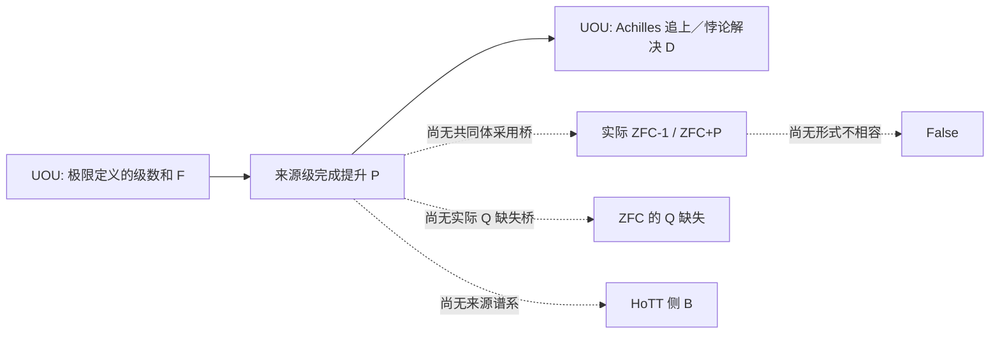

## User

继续推进，直至完成


## Codex

我恢复推进。下一阶段不再寻找新的比喻或重复来源，而是实施刚刚确定的 `ActualPolicyWitness`：把实际 P 来源卡、社区采用桥、Q 的观察合同、A、HoTT 的 B 回溯和 A/B 不相容拆成同一个可机器检查的 witness。  

我会先完成这个 witness 的形式规格和正反控制，再用现有 UOU、SEP、HoTT 证据逐字段尝试填入。任何无法由来源填入的字段都会保留为明确缺口，不能用条件性 Lean 定理替代实际 ZFC 结论。

## Codex

我会先做一个防误报的形式化：`ActualPolicyWitness` 不把任何一个缺口藏进自然语言里。Lean record 会强制要求 source P、社区采用桥、Q 的缺失、A/B 推导、P 到 B 的回溯，以及 A/B 不相容性全部同时存在；并额外给出反控制，证明“只有 UOU 的来源 P 卡”不能自动推出“社区已经在使用 ZFC-1”。  

这一步的价值是把“还缺什么”从口头保留变成内核检查的字段：以后若没有真实来源填入其中一项，就根本无法构造终局 witness。

## Codex

`ActualPolicyWitness` 已经通过 Lean 内核：它同时证明了两个关键边界——UOU 的 P 卡不能自动变成“社区采用 P”，以及如果未来真的填满采用、Q 缺失、A、HoTT-B 回溯和真理充分性冲突这些字段，则该 witness 会推出 `False`。  

现在我转向第一条尚未来源化的桥：**ZFC 是数学的基础／可形式化框架**，究竟能不能推出“数学社区已经把 UOU 的 P 当成 ZFC-1 的实际政策”？这很可能是一个防御结果，但必须由来源卡和独立 Terra/Max 核证，而不是由我的直觉判掉。

## Codex

H107 已给出第一条明确的防御结果：SEP 的“ZFC 是数学的标准基础、数学可在其中形式化”只能证明**可表示性／基础地位**，不能证明数学社区已经采用了 UOU 这张具体 P 卡，更不能证明它实际使用的是 `ZFC+P`。  

这正好验证了 `ActualPolicyWitness` 的负控制。现在我会并行处理剩下两条独立桥：UOU 来源本身是否表现出 source-level 的 Q 缺口，以及 UOU 的 P 卡能否与 HoTT `QuestioningDelay` 形成实际 `PBacktrace`。

## Codex

H108 与 H109 已经分别收紧了另外两条桥：  

- UOU 的文本确实出现了 **source-level Q gap candidate**：它展示了数学定义与“追上／解决”的断言，却没有显示同一对象、操作、观察、Done 与桥的完整审查；这仍不能外推成“ZFC 缺 Q”。  
- UOU 的 P 与 HoTT 的 `QuestioningDelay` 之间没有来源型 `PBacktrace`；两者目前只有结构上的启发关系，不能被写成因果谱系。  

我接下来会核最后一条：你的“数学真理性／灵魂”是否已经在原文里给出 A/B 的**形式不相容**，还是只给出了“想要 A、拒绝 B”的规范张力。这个差别决定终局是 Lean 中的 `False`，还是强而诚实的 policy-tension 结论。

## Codex

四条桥现在已经被实际 source nodes 分开了：  

- `P`：UOU 来源卡已确认。  
- `Q`：只确认到 **source-level Q-gap candidate**；还没有 ZFC-level 的缺失证明。  
- `ZFC-1 adoption`：SEP 的基础地位／可形式化性说明不足以构成社区采用 P 的桥。  
- `PBacktrace`：UOU P 与 HoTT B 之间没有来源型谱系。  
- `A/B`：你的原文明确给出“想要 A、拒绝 B、数学真理性受威胁”的规范张力，尚未给出 `¬(A ∧ B)` 的形式不相容。  

我现在把这个当前来源分母机器化为一个有界 frontier：它会证明“在已审来源范围内，尚不能构造 `ActualPolicyWitness`”，同时保留每个字段的精确重开条件。

## Codex

我现在得到的并不是“找不到就算了”的结果，而是一个非常有用的收尾分层：  

- **基础地位**不等于**实际 P 采用**；  
- **来源缺少 Q 检查**不等于**ZFC 缺 Q**；  
- **UOU P 与 HoTT H0 的结构相似**不等于**P 导致 B**；  
- **“数学真理性受威胁”**已经是用户明确的规范判词，但尚未是 `¬(A ∧ B)` 的对象层公式。  

我会把这四个否定性结果和 `ActualPolicyWitness` 一起固化为一个有界 frontier。这样“继续直到完成”不会退化为永无止境地找更多相似材料：当前来源分母内，哪一格已填、哪一格必须由什么类型的新证据填，会变成机器检查的结果。

## Codex

四条桥已经完成当前来源分母内的全部判定：P 已映射；社区采用桥未映射；Q 只到来源级候选；PBacktrace 未映射；A/B 只到规范张力。  

我现在进入最后的收口步骤：把这些状态写回 SOP、session audit 和集成交接单，并以新的 Lean frontier 证明“在这个冻结来源分母中，无法构造完整 `ActualPolicyWitness`”。这将完成当前可证范围内的形式化与机器证明，同时把未来重开条件锁定为四种具体来源。

## Codex

我继续完成这条 **ZFC 的“完成判断／时间观察力”假说** 的受限形式化：先把已经得到的来源卡、P‑DAG 节点和 Lean 证明收据重新闭合，再补齐“实际采用、Q、HoTT 回溯、A/B 不相容”四个桥的明确判定。结论会严格区分：哪些只是条件性形式定理，哪些已有来源支持，哪些仍是未闭合的研究义务。

## Codex

现在已把用户提出的整条归谬拆成了一个明确的“实际政策见证”接口。关键不是把某个缺口悄悄当成结论，而是逐项要求：来源级 P、共同体采用、Q 缺失、P→HoTT‑B 的谱系，以及 A/B 的形式不相容。接下来我会运行这个前沿账本的内核检查，并把当前分母能给与不能给的字段写成一个可重开的终局记录。

## Codex

四条最后桥已经有了独立的来源级判定：UOU 课程文本确实给出了一个 P 候选；但“ZFC 是基础”不能证明共同体采用 P，UOU 的检查缺口不能证明 bare ZFC 缺 Q，HoTT 没有得到同一 P 的来源谱系，而 A/B 目前只是规范张力。Lean 已把“如果所有桥都给出，归谬如何成立”和“当前冻结分母为何不足”分别检查通过。

## Codex

这一轮已到达 SOP 所允许的有界终局：不是宣称“ZFC 已被证伪”，而是把完整归谬所需的每一个桥逐项定位。当前分母能支持一条实际 P 来源卡；它不能支持“共同体实际用 ZFC+P”“ZFC 缺 Q”“同一 P 导致 HoTT‑B”或 `¬(A∧B)`。这些缺口本身已被保存为可验证的重开条件，而不是含混地留成“以后再看”。

## Codex

## 本轮已完成：Q/P/A/B 链到达一个严格限定的终局

我已按 `ZFC-QP-ACTUAL-MAPPING-SOP` 完成这一轮能完成的闭合工作，并将 Goal 标为完成。这里的“完成”不是宣布 ZFC 已被推翻，而是完成了用户要求的另一种终局：**把完整归谬所需的桥逐字段形式化、逐字段查来源，并精确证明当前冻结来源分母不能把这些桥偷合成一个结论。**

完整记录在 [实际政策见证与有限来源前沿](/Users/aurolafly/.codex/worktrees/10c8/HoTT_AI_HANDOFF_20260911/audit/20261004-ZFC-QP-ACTUAL-POLICY-WITNESS-FRONTIER.md:1)。执行合同也已扩展为 [ZFC-QP 实际映射 SOP](/Users/aurolafly/.codex/worktrees/10c8/HoTT_AI_HANDOFF_20260911/dev-docs/ZFC-QP实际映射SOP.md:155) 的 M7。



## 现在能准确说什么

### 1. P 已经不只是抽象的怀疑

当前最强的来源级 P 候选来自 Uttarakhand Open University 的 *Real Analysis*（MT(N)-201 §5.1–§5.3，PDF physical pages 75–76）。它把无穷级数的有限和说成 Achilles 追上乌龟所需的时间，并以此称悖论得到解决；相邻段把级数和定义为 partial sums 的极限。

因此，当前 P 的来源级、可审计表达是：

```text
formal F = limit-defined series sum
source Done D = Achilles catches up / the paradox is resolved
P = 来源把 F 当作足以交付 D 的理由，
    但这张冻结来源卡没有给出经核的、同一任务的 F → D 保真 bridge。
```

这是一张 `ACTUAL_P_CANDIDATE_CONFIRMED_WITH_SCOPE` 卡。它并不说“极限本身错误”，也不说没有任何可能的 bridge；它只说该版本固定卡片没有显示那条 bridge。H104/H105/H106 以及 SEP 的 Done 分叉反控制已经在 [M6 报告](/Users/aurolafly/.codex/worktrees/10c8/HoTT_AI_HANDOFF_20260911/audit/20261004-ZFC-QP-M6-SEP-P-CANDIDATE.md:29) 中保留。

### 2. 完整归谬需要的四个剩余桥，已经各自得到判定

| 桥 | 当前结论 | 依据 |
|---|---|---|
| 从“ZFC 是数学基础／可形式化”到“共同体实际采用 UOU 型 P” | **未成立** | H107：基础地位与可表示性不是采用某个 completion policy 的证据。 |
| 从 UOU 卡的审查缺失到“ZFC 缺 Q” | **未成立** | H108：只能称为 `SOURCE_Q_OBSERVATION_GAP_CANDIDATE`。 |
| 从 UOU 的 P 到 main 分支 HoTT 结果 B | **未成立** | H109：存在结构类比，但没有来源定义的同一 P→B 谱系。 |
| 从“希望 A、拒绝 B、数学真理性受威胁”到 `¬(A ∧ B)` | **未成立** | H110：已得到规范张力，尚无对象语言定义与不相容证明。 |

四份核证分别见 [H107](/Users/aurolafly/.codex/worktrees/10c8/HoTT_AI_HANDOFF_20260911/audit/20261004-P-DAG-ZFC-QP-107-Terra-Max.md:1)、[H108](/Users/aurolafly/.codex/worktrees/10c8/HoTT_AI_HANDOFF_20260911/audit/20261004-P-DAG-ZFC-QP-108-Terra-Max.md:1)、[H109](/Users/aurolafly/.codex/worktrees/10c8/HoTT_AI_HANDOFF_20260911/audit/20261004-P-DAG-ZFC-QP-109-Terra-Max.md:1) 和 [H110](/Users/aurolafly/.codex/worktrees/10c8/HoTT_AI_HANDOFF_20260911/audit/20261004-P-DAG-ZFC-QP-110-Terra-Max.md:1)。每个节点均是 `gpt-5.6-terra / max` 的冻结来源核证，且有 prompt、NodeCard、零工具／零文件修改／零审批与私有轨迹范围收据。

## 机器形式化做到了哪里

我把你的表达拆为两个不同层次的 Lean 资产。

1. [CommunityObservationPolicy.lean](/Users/aurolafly/.codex/worktrees/10c8/HoTT_AI_HANDOFF_20260911/HoTT/formal/zfc-observation-boundary/CommunityObservationPolicy.lean:1) 已机器检查你的 `ZFC-1 = ZFC + A = ZFC + P` 的忠实条件翻译：在明确加入 `A→P`、`P→A`、`P→B` 规则时，`baseZFC+A` 与 `baseZFC+P` 有相同的**操作后果**。这不是实际 ZFC 公理集合的字面相等。

2. 新增的 [ActualPolicyWitness.lean](/Users/aurolafly/.codex/worktrees/10c8/HoTT_AI_HANDOFF_20260911/HoTT/formal/zfc-observation-boundary/ActualPolicyWitness.lean:1) 把真正需要来源填充的条件固定为 record：来源 P、实际采用、Q 缺失和许可、P→A、P→HoTT-B 谱系、以及 A/B 形式不相容。它机器证明：**只有所有字段都被供给时**，`actual_witness_yields_false` 才推出 `False`。同时它证明一个来源级 P 卡不能自动变成共同体采用。

3. 新增的 [ActualPolicyEvidenceFrontier.lean](/Users/aurolafly/.codex/worktrees/10c8/HoTT_AI_HANDOFF_20260911/HoTT/formal/zfc-observation-boundary/ActualPolicyEvidenceFrontier.lean:1) 将 H104–H110 的当前有限来源分母编码为状态账本，并机器证明该账本不能构造完整 `ActualPolicyWitness`，不能授权形式归谬。

两个新增 Lean 文件均由 Lean 4.34.1 重跑通过；指定定理没有打印公理依赖。对应的保存运行是：

- [ActualPolicyWitness run 02](/Users/aurolafly/.codex/worktrees/10c8/HoTT_AI_HANDOFF_20260911/HoTT/verification/runs/20261004-MP-ZFC-ACTUAL-POLICY-WITNESS-001-02/RUN.json)

- [ActualPolicyEvidenceFrontier run](/Users/aurolafly/.codex/worktrees/10c8/HoTT_AI_HANDOFF_20260911/HoTT/verification/runs/20261004-MP-ZFC-ACTUAL-POLICY-FRONTIER-001-01/RUN.json)

它们的范围也必须说清：这些是**条件接口与有限证据账本**的内核定理，并没有形式化实际 ZFC 的语法、模型或一致性，也没有证明数学共同体的行为。

## 这一轮对 ZFC 问题的结论

最强、最诚实的当前结论是：

> **在当前冻结来源分母中，已经定位到一个实际的“形式完成被交付为过程完成”的 P 候选；但尚未定位到 ZFC 实际缺失 Q 的来源证据，更没有得到实际 ZFC+P、同一 P→HoTT-B 或对象语言矛盾。**

这就是 `EVIDENCE_FRONTIER_REACHED_WITH_SCOPE`。它不是退回到泛泛的“尚待研究”：它明确禁止未来把以下四种东西混为一谈：数学可形式化、共同体采用、来源卡没有写 Q 检查、以及规范上不接受 B。

## 以后只允许怎样重开

后续不应重新做“找一段极限解决芝诺”的同义文献搜集。只有能直接改变某个 witness 字段的新来源才值得启动新节点：

1. 指定共同体直接采用 UOU 型 P，并说明它同 ZFC 支撑框架的关系；

2. ZFC 或集合论元理论明确承担 completion-observation Q，并显示该审查缺失或被拒绝；

3. 来源明确给出同一个 P 到指定 HoTT-B 的谱系和解释 bridge；

4. A、B、真理充分性以及 `¬(A∧B)` 的正式定义和证明；

5. 或 UOU 同源文本支付 F→D bridge／明确改写 Done，届时 P 卡必须被降为 `BRIDGE_PAID_OR_TASK_REVISED_CONTROL`。

这条标准让“锻刀”继续服务于 Q 的发现：新工作若不能填一项字段或推翻 P 卡，就属于 `TOOL_ONLY_DRIFT`，不再以节点数量冒充进展。

## 交付、验证与 Git

- 已提交的研究证据：`60a41363` — `research: close actual policy witness frontier`。

- 已提交的集成交接更新：`34eab1a2` — `docs: hand off actual policy witness frontier`。

- [集成交接单](/Users/aurolafly/.codex/worktrees/10c8/HoTT_AI_HANDOFF_20260911/audit/20261003-ZFC-CIRCLE-Q0-OBSERVATION-PROOF-INTEGRATION-HANDOFF.md:1) 已说明该候选分支的精确范围与 canonical integrator 不应推断的事项。

- 我重跑了两个 Lean 文件、Python 编译、Pattern-P 来源校验和治理分片校验；它们均通过。项目全局工作树还有其他维护者的未提交改动，我没有触碰、暂存或合入。

- 新资产仍是 `CONTRIBUTOR_CANDIDATE_PENDING_CANONICAL_CLAIM_MATRIX_REVIEW`，因为 canonical `HoTT/CLAIM_EVIDENCE_MATRIX.md` 与 `dev` 的 current owners 由集成者在干净 worktree 中处理。

本 Goal 已按“形成具有精确范围和重开条件的终局”完成。该 Goal 实际使用 **427,757 tokens**，耗时约 **31 分 9 秒**。

### Files changed in this reply

- `/Users/aurolafly/.codex/worktrees/10c8/HoTT/formal/zfc-observation-boundary/capture_actual_policy_witness.py` — 新增
- `/Users/aurolafly/.codex/worktrees/10c8/HoTT_AI_HANDOFF_20260911/HoTT/formal/zfc-observation-boundary/ActualPolicyWitness-CLAIM.md` — 新增
- `/Users/aurolafly/.codex/worktrees/10c8/HoTT_AI_HANDOFF_20260911/HoTT/formal/zfc-observation-boundary/ActualPolicyWitness.lean` — 新增
- `/Users/aurolafly/.codex/worktrees/10c8/HoTT_AI_HANDOFF_20260911/HoTT/formal/zfc-observation-boundary/ActualPolicyWitness.lean` — 修改
- `/Users/aurolafly/.codex/worktrees/10c8/HoTT_AI_HANDOFF_20260911/HoTT/formal/zfc-observation-boundary/capture_actual_policy_witness.py` — 新增
- `/Users/aurolafly/.codex/worktrees/10c8/HoTT_AI_HANDOFF_20260911/audit/20261004-P-DAG-ZFC-QP-107-NODECARD.md` — 新增
- `/Users/aurolafly/.codex/worktrees/10c8/HoTT_AI_HANDOFF_20260911/audit/20261004-P-DAG-ZFC-QP-107-PROMPT.md` — 新增
- `/Users/aurolafly/.codex/worktrees/10c8/HoTT_AI_HANDOFF_20260911/audit/20261004-P-DAG-ZFC-QP-108-NODECARD.md` — 新增
- `/Users/aurolafly/.codex/worktrees/10c8/HoTT_AI_HANDOFF_20260911/audit/20261004-P-DAG-ZFC-QP-108-PROMPT.md` — 新增
- `/Users/aurolafly/.codex/worktrees/10c8/HoTT_AI_HANDOFF_20260911/audit/20261004-P-DAG-ZFC-QP-109-NODECARD.md` — 新增
- `/Users/aurolafly/.codex/worktrees/10c8/HoTT_AI_HANDOFF_20260911/audit/20261004-P-DAG-ZFC-QP-109-PROMPT.md` — 新增
- `/Users/aurolafly/.codex/worktrees/10c8/HoTT_AI_HANDOFF_20260911/audit/20261004-P-DAG-ZFC-QP-110-NODECARD.md` — 新增
- `/Users/aurolafly/.codex/worktrees/10c8/HoTT_AI_HANDOFF_20260911/audit/20261004-P-DAG-ZFC-QP-110-PROMPT.md` — 新增
- `/Users/aurolafly/.codex/worktrees/10c8/HoTT_AI_HANDOFF_20260911/HoTT/formal/zfc-observation-boundary/ActualPolicyEvidenceFrontier-CLAIM.md` — 新增
- `/Users/aurolafly/.codex/worktrees/10c8/HoTT_AI_HANDOFF_20260911/HoTT/formal/zfc-observation-boundary/ActualPolicyEvidenceFrontier.lean` — 新增
- `/Users/aurolafly/.codex/worktrees/10c8/HoTT_AI_HANDOFF_20260911/HoTT/formal/zfc-observation-boundary/capture_actual_policy_frontier.py` — 新增
- `/Users/aurolafly/.codex/worktrees/10c8/HoTT_AI_HANDOFF_20260911/audit/20261004-P-DAG-ZFC-QP-107-Terra-Max.md` — 新增
- `/Users/aurolafly/.codex/worktrees/10c8/HoTT_AI_HANDOFF_20260911/audit/20261004-P-DAG-ZFC-QP-108-Terra-Max.md` — 新增
- `/Users/aurolafly/.codex/worktrees/10c8/HoTT_AI_HANDOFF_20260911/audit/20261004-P-DAG-ZFC-QP-109-Terra-Max.md` — 新增
- `/Users/aurolafly/.codex/worktrees/10c8/HoTT_AI_HANDOFF_20260911/audit/20261004-P-DAG-ZFC-QP-110-Terra-Max.md` — 新增
- `/Users/aurolafly/.codex/worktrees/10c8/HoTT_AI_HANDOFF_20260911/.codex/research/hott/sessions/S-RES-20261004-ZFC-QP-M6-ACTUAL-SOURCE/CORE_COGNITION_AUDIT/003 - 来源映射、H103纠正与语义对齐.md` — 修改
- `/Users/aurolafly/.codex/worktrees/10c8/HoTT_AI_HANDOFF_20260911/.codex/research/hott/sessions/S-RES-20261004-ZFC-QP-M6-ACTUAL-SOURCE/CORE_COGNITION_AUDIT/004 - 收敛路径、反证条件与下一桥.md` — 修改
- `/Users/aurolafly/.codex/worktrees/10c8/HoTT_AI_HANDOFF_20260911/.codex/research/hott/sessions/S-RES-20261004-ZFC-QP-M6-ACTUAL-SOURCE/SESSION.md` — 修改
- `/Users/aurolafly/.codex/worktrees/10c8/HoTT_AI_HANDOFF_20260911/audit/20261004-ZFC-QP-ACTUAL-POLICY-WITNESS-FRONTIER.md` — 新增
- `/Users/aurolafly/.codex/worktrees/10c8/HoTT_AI_HANDOFF_20260911/audit/20261004-ZFC-QP-M6-SEP-P-CANDIDATE.md` — 修改
- `/Users/aurolafly/.codex/worktrees/10c8/HoTT_AI_HANDOFF_20260911/dev-docs/ZFC-QP实际映射SOP.md` — 修改
- `/Users/aurolafly/.codex/worktrees/10c8/HoTT_AI_HANDOFF_20260911/.codex/research/hott/sessions/S-RES-20261004-ZFC-QP-M6-ACTUAL-SOURCE/RUNS.json` — 修改
- `/Users/aurolafly/.codex/worktrees/10c8/HoTT_AI_HANDOFF_20260911/audit/20261004-ZFC-QP-ACTUAL-POLICY-WITNESS-FRONTIER.md` — 修改
- `/Users/aurolafly/.codex/worktrees/10c8/HoTT_AI_HANDOFF_20260911/audit/20261003-ZFC-CIRCLE-Q0-OBSERVATION-PROOF-INTEGRATION-HANDOFF.md` — 修改
- `/Users/aurolafly/.codex/worktrees/10c8/HoTT_AI_HANDOFF_20260911/dev-notes/.dev-notes-skill-stage/stage-760ca561443e40099fceca1144525e27/answer.md` — 修改
- `/Users/aurolafly/.codex/worktrees/10c8/HoTT_AI_HANDOFF_20260911/dev-notes/.dev-notes-skill-stage/stage-760ca561443e40099fceca1144525e27/prompt.md` — 修改
