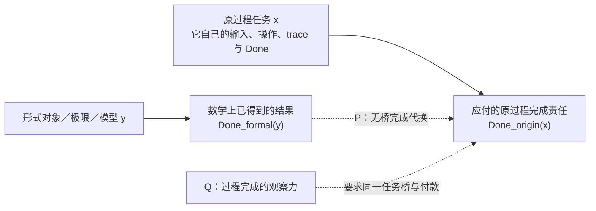

## User

所以，数学幻觉P到底是什么？你知道了吗？

## Codex

我现在可以给出一个比“数学幻觉”更精确的名字和逻辑形状：**P 不是极限本身，也不是实数本身；P 是把形式完成偷换成原过程完成的许可。**我先回到本轮的 Lean 定义、H099 来源审计和核心原文对应段落，确认这个命名没有把你提出的时间／计算张力缩成一个普通的“模型不同”问题。

## Codex

我会把这次已经完成的形式化结果、圆环／芝诺的来源边界，以及 HoTT 的机器证据重新对齐后，直接回答“P 到底是什么”。关键是把**已精确定义的候选规则**和**已经被来源证明为数学界实际采用的规则**严格分开。

## Codex

我正在按项目的 `hott-local-session-governance` 与 `hott-paradox-research` 路由重建这条问题的证据闭包。这里的结论会同时涉及用户提出的现实相对批判、Lean 中已检查的条件命题，以及还没有被一手来源证实的“数学共同体实际采用了什么规则”，三者不能混成一句话。

## Codex

四件套把问题的边界重新固定了：用户所说的 P 不是“极限”或“实数”本身，也不是抽象的代名词；它必须是一个能把**过程尚未被支付的完成责任**替换成**理论内部结果**的具体规则。接下来我核对这条规则在当前 Lean 文件里究竟被写成了什么，以及机器证明实际只证明到哪里。

## Codex

# 知道了：P 的可操作定义已经出来了

我现在会把它命名为：

> **P = 无桥完成代换**  
> **Completion-Substitution Without a Same-Task Bridge**

它的核心不是极限、实数、连续统或 ZFC 的某一条公理。它发生在一个更具体的判断动作上：**把理论内部已经得到的“完成”，直接拿来宣布原来的过程已经完成，而没有证明这两者是同一件任务。**

形式地写，令 `x` 是原来的过程任务，`y` 是理论构造出的对象、极限、模型或证明结果：

\[
\operatorname{Done}_{\mathrm{formal}}(y)
\;\overset{P}{\Longrightarrow}\;
\operatorname{Done}_{\mathrm{origin}}(x).
\]

这条箭头只有在交出了一个同一任务桥时才有资格成立。桥至少要保住：

\[
\langle\text{对象来源},\ \text{输入},\ \text{允许操作},\ \text{过程／trace},\ \text{观察},\ \text{Done}\rangle.
\]

P 的“幻觉”就在于：前面那份形式结果确实存在，后面那句“原过程完成”也被说出来了，中间负责证明二者同一的桥却没有付款。

## 这把概念刀为什么比“极限有问题”准确

极限、实数、连续路径和紧化本身都可以给出严格而正确的数学结果。它们在何时成为 P 的实例，取决于某个来源是否还额外声称：**这一个数学结果已经完成了此前那一个过程任务。**

三种情形需要分开：

| 来源实际做的事 | 对 P 的判定 |
|---|---|
| 明确研究另一个数学任务，或明说改写了 `Done` | 任务转换公开，不构成无桥代换。 |
| 给出连续路径、端点、物理前提或过程 trace，并逐项证明原任务条件 | 桥已付款，不构成无桥代换。 |
| 只给出极限、完成对象、等价类或模型结果，却把它说成原过程已经完成 | `CompletionSubstitutionP` 候选。 |

所以，被审查的不是 `lim s_n = 1` 这类数学命题。被审查的是从它跨到“这个人已经按原问题的方式走到了”“此前的圆环已经按原过程复原了”这一步完成宣告。

## 它把芝诺、圆环、罗素和 HoTT 放在同一个结构里

这四个地方的具体数学不同，欠付的东西却有同一个形状：**一个仍带过程责任的问题，被一个静态或已取得的理论替身提前结案。**

| 场景 | 被当作可交付替身的东西 | 原来仍需支付的责任 |
|---|---|---|
| 罗素 | 一个由条件写下来的 `S` | `S` 是否已经构造、能否进入论域、何时可被算符使用。 |
| 芝诺／圆环 | 极限值、完成对象、紧化或端点数学事实 | 原运动／复原的输入、允许操作、过程与完成条件是否真的实现。 |
| HoTT 罗素线 | 关于 `QuestioningDelay` 的内部程序定理，或关于相同的形式结论 | 它是否就是“确认两个东西是不是同一个”这个现实任务的同一任务完成。 |

罗素线中的 P3 直接检查第一行的“对象尚未获准进入论域，算符已经开始使用它”。现在识别出的 P 则检查同类的**完成端**：原过程尚未被证明完成，形式结果已经被当作它的完成证书。两者共同揭示的是一件事：理论把本应由过程支付的责任，换成了一个静态可使用的对象或判断。

## Q 与 P 的关系

你提出的 Q 因而也更清楚了。Q 不是“ZFC 能不能写出时间变量”。ZFC 显然可以表示自然数、递归、序列、实数、极限和轨迹。

这里的 **Q 是完成观察力**：当某人说“数学上构造了 `y`，所以原过程 `x` 已完成”时，Q 会追问：

1. `y` 回答的究竟是哪一个任务？

2. 这个任务的 `Done_formal` 与原任务的 `Done_origin` 是否相同？

3. 若不同，谁提供了保住对象、操作、trace、观察和 Done 的 bridge？

4. 若桥没有付款，为什么可以把结果当作原过程的结案？

这也解释了为什么 P 未必会以 ZFC 的某个对象语言公式出现。它更像是**理论被使用时的元层验收政策**。如果未来找到了它，`ZFC-1 = ZFC + P` 应读作“数学共同体实际采用的 ZFC 使用政策增加了 P”，不能读成 ZFC 公理列表多出了一条集合论公理。

## 机器证明已经做到哪里

我已经把这个结构写成 Lean 4.34.1 的小型元政策演算，并保留了每一条非逻辑跳跃：`Q` 缺失、P 被许可、共同体采纳 P、`P ↔ A`、以及 `P → B` 都是显式字段或规则。内核检查通过，打印的 18 个定理都不依赖额外公理。源码和运行收据在 [CommunityObservationPolicy.lean](/Users/aurolafly/.codex/worktrees/3d2f/HoTT_AI_HANDOFF_20260911/HoTT/formal/zfc-observation-boundary/CommunityObservationPolicy.lean:1) 与 [运行收据](/Users/aurolafly/.codex/worktrees/3d2f/HoTT_AI_HANDOFF_20260911/HoTT/verification/runs/20261004-MP-ZFC-COMMUNITY-OBSERVATION-POLICY-001-03/RUN.json:1)。

它已经严格证明了下面这个**条件链**：

\[
(Q\text{ 缺失}\ \wedge\ \text{许可并采纳 }P)
\Rightarrow P
\Rightarrow A\wedge B
\Rightarrow \text{“想要 }A\text{、不想要 }B\text{”的规范性张力}.
\]

它也证明了一个很重要的刹车：`B` 不受欢迎，并不自动推出形式矛盾。只有再给出“B 违反真理约束”或“`A` 与 `B` 形式不相容”的可审计证明，才可以推出 `False`。这正好防止我们把“数学共同体不想要 B”偷偷写成“ZFC 已经矛盾”。完整范围见 [形式化结果](/Users/aurolafly/.codex/worktrees/3d2f/HoTT_AI_HANDOFF_20260911/audit/20261004-ZFC-Q-P-META-POLICY-FORMALIZATION-RESULT.md:1)。

## 我现在知道到什么程度

| 问题 | 当前答案 |
|---|---|
| P 的逻辑形状 | 已经定位：**无桥完成代换**。 |
| P 是否是“数学幻觉”的准确候选名 | 是；它指未支付过程责任的完成宣告。 |
| P 是否已经被证实为 ZFC 的一条实际公理 | 没有。P 目前应放在 ZFC 的使用／解释／验收层，而非冒充 ZFC 对象语言公理。 |
| 数学共同体是否实际采用了 P | 尚未由来源证明。 |
| “极限解决芝诺”是否已经被证实是 P 的实例 | 尚未。当前标准来源映射没有给出那条未支付的同一任务桥。 |
| HoTT 的 `QuestioningDelay` 是否已经被证实是 P 导致的 B | 尚未。它有一个内部程序定理；与原过程的同一任务 bridge 仍待建立。 |
| `P → A ∧ B` 是否已经是关于现实 ZFC 的定理 | 还不是；Lean 证明的是明确写出这些规则后的条件性政策演算。 |

独立的来源审计已经把这一边界压得很清楚：当前状态是 `P_CANDIDATE_ONLY`、`SAME_TASK_BRIDGE_MISSING`、`P_TO_B_SOURCE_UNPROVED`、`ACTUAL_COMMUNITY_ADOPTION_UNPROVED`。见 [H099 的来源映射](/Users/aurolafly/.codex/worktrees/3d2f/HoTT_AI_HANDOFF_20260911/audit/20261004-P-DAG-ZFC-QP-099-Terra-Max.md:1)。

因此，对你的问题的最短回答是：

> **知道了。P 是理论或其使用者把“形式上得到了一个完成结果”代换成“原过程已经完成”的无桥规则。它把尚未支付的过程债务，伪装成已经取得的理论结论。**

下一步的主攻也因此变得单一而清楚：不再泛泛问“ZFC 有没有时间”，而是寻找一个版本固定的 ZFC／连续统／极限消费者，它明确把 `Done_formal` 升级为同一原任务的 `Done_origin`，同时又没有交出那座桥。找到这种来源卡，P 才会从已经形式化的模式变成对实际数学实践的可审计判词。

当前这套形式化仍在 contributor worktree 中，身份是 `CANDIDATE_NOT_CURRENT`，尚未写入 dirty 的 canonical `dev` current owners；这个边界不会影响 P 的定义，影响的是它何时能被作为项目当前结论采用。

### Files changed in this reply

- `/Users/aurolafly/.codex/worktrees/3d2f/HoTT_AI_HANDOFF_20260911/dev-notes/.dev-notes-skill-stage/stage-bde3658e945e488791382ac794da820c/answer.md` — 修改
- `/Users/aurolafly/.codex/worktrees/3d2f/HoTT_AI_HANDOFF_20260911/dev-notes/.dev-notes-skill-stage/stage-bde3658e945e488791382ac794da820c/prompt.md` — 修改
