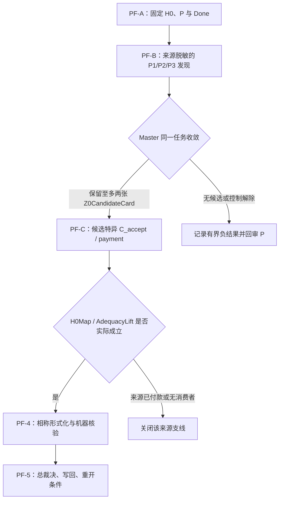

## User

你是要跟它做一样的事吗？那何必呢？


## Codex

你说得对，我不应该再做一套同义方案，更不应该重新启动一遍它已经在跑的 P1/P2/P3。  

我已经确认：另一个 worktree 的 `a9c27282` 已经把 **`H0-Z0-PATTERN-FIRST-CONVERGENCE-SOP`** 写好，并且正在准备对应的三张来源脱敏 DiscoveryCard。我的正确职责是把这份已提交方案作为唯一方案复用，把那个 worktree 的工作作为 `PF-B` 的 contributor 输入，随后由我做来源、同一任务和 Git 集成裁决。  

剩下真正尚未有人完成的部分只有两项：为这份方案建立你要求的**可审计认知闭包**，并创建一个引用“该方案 + 该闭包”的 Host `/goal`。这两项不会重做它的计划或它的三刀发现。

## Codex

方案、闭包和 Host Goal 已经形成同一条可恢复链：Goal `01a106f7-75c0-7dd0-b135-63d0393bd6cf` 已处于 `active`，其 objective 逐字引用 `H0-Z0-PATTERN-FIRST-CONVERGENCE-SOP` 与 `H0-Z0-PATTERN-FIRST-CONVERGENCE-CLOSURE`。  

我没有重做并行 worktree 的方案或三刀卡；我只合并它已提交的方案，并让这个 Goal 以它作为唯一执行合同。接下来我会版本化闭包、索引和 Goal 绑定，然后按 PF-0 开始真正的发现态。

## Codex

Host Goal 已创建并处于 `active`，方案与闭包已提交、推送并互相绑定：

- **方案**：`H0-Z0-PATTERN-FIRST-CONVERGENCE-SOP`
- **认知闭包**：`H0-Z0-PATTERN-FIRST-CONVERGENCE-CLOSURE`
- **Host Goal**：`01a106f7-75c0-7dd0-b135-63d0393bd6cf`
- **候选分支提交**：`fe07324a`

我现在开始 Goal 的 `PF-0`。这一阶段不会先跑三刀或模型论文；它先重建研究闭包，固定 H0、模式 P、发现态的禁止泄漏条件、同一任务与 Done，再检查并行 worktree 是否已经产出可复用的 PF-B 候选卡。

## Codex

`PF-0` 的恢复检查已经完成：H0、KC-000056–062、刀具系统理念、F-050、认知闭包与 convergence SOP 已重新加载。并行 worktree 已经准备了 PF-1 的 P1/P2/P3 来源脱敏 NodeCard；其中一个节点正在运行。它们将作为 contributor 证据交给当前 Goal，我不会再启动同义节点。  

当前 Goal 仍保持 `active`；只有 PF-A、PF-B、PF-C 都进入方案规定的有界终态，或者实际 H0→Z0 政策链闭合后，我才会把它标记为完成。

## Codex

## 已建立并启动

我没有另写一套和并行 worktree 同义的计划。我复用了它已经提交的方案，并把它、可审计认知闭包和 Host Goal 绑定成同一条执行链。

| 项目 | 稳定名称／位置 | 当前状态 |
|---|---|---|
| 执行方案 | [`H0-Z0-PATTERN-FIRST-CONVERGENCE-SOP`](/Users/aurolafly/.codex/worktrees/cad0/HoTT_AI_HANDOFF_20260911/dev-docs/H0-Z0模式P优先收敛SOP.md) | 已提交；定义 PF-A、PF-B、PF-C 与 PF-0～PF-5。 |
| 可审计认知闭包 | [`H0-Z0-PATTERN-FIRST-CONVERGENCE-CLOSURE`](/Users/aurolafly/.codex/worktrees/cad0/HoTT_AI_HANDOFF_20260911/认知闭包/2026-10-04-H0-Z0模式P优先收敛-认知闭包.md) | `PARTIAL / READY_TO_EXECUTE`；固定 H0、来源边界、活跃槽、未知、Feature 映射、并行 worktree 和复现入口。 |
| Host Goal | `01a106f7-75c0-7dd0-b135-63d0393bd6cf` | `active`；由我管理。 |
| 当前 Feature | [F-050](/Users/aurolafly/.codex/worktrees/cad0/HoTT_AI_HANDOFF_20260911/feature-list.md) | `PF_A_READY / PF_B_PENDING_DISCOVERY / PF_C_BLOCKED_ON_SURVIVING_CANDIDATE`。 |

当前 Host Goal 的完整启动词已经是：

```text
按照 SOP=H0-Z0-PATTERN-FIRST-CONVERGENCE-SOP、认知闭包=H0-Z0-PATTERN-FIRST-CONVERGENCE-CLOSURE，继续推进：以 main 的固定 H0 为反向样本，先执行 PF-0，再对同一来源脱敏的 ZFC profile 运行 PF-1 的 P1/P2/P3 模式匹配；仅对 surviving candidate 审计实际 C_accept、同一任务控制、H0Map、AdequacyLift 与相称机器化。MPIM／一般模型论文仅作条件性来源支线。持续写回、审计并管理当前 Goal，直至所有 active lane 到达本方案的有界终态；不得把候选、来源缺口或模型输出升级为 bare ZFC 矛盾。
```

## 这份方案怎样推进



它把“发现 Z0”和“证明 ZFC 有问题”严格分开：

1. **PF-A** 固定 main 的 `H0`，防止把泛泛的 HoTT 复杂性替代掉已经机器检查的 `QuestioningDelay` 过程。

2. **PF-B** 使用来源脱敏的 P1、P2、P3 进行模式匹配。输入中不出现 MPIM、AWCCRS、Power Set、既有 ZFC 答案或项目结论。目标是生成可证伪的 `Z0CandidateCard`，不是立即宣判。

3. **PF-C** 只对幸存候选寻找实际 `C_accept`：谁在何种 ZFC／扩展条件下，实际把模型、一致性、证明翻译或基础资格提升为完成判词。

4. **PF-4** 只有在来源合同或保真 H0Map 已固定后才允许新增形式化和机器证明。

5. **PF-5** 要么形成来源绑定的 H0→Z0 判词，要么以 `SOURCE_DIRECT_PAYMENT_CONTROL`、`SOURCE_ACCEPTANCE_UNDERDETERMINED_WITH_SCOPE`、`H0_Q_PRESERVED_WITH_SCOPE` 或 `P_MATCH_NO_SITE_WITH_SCOPE` 等有界结果结束分支。

MPIM／AWCCRS 继续保留为 `PARKED_SOURCE_CONTROL`。它们只有在 PF-C 的实际来源直接引用该链，或某个已经冻结的 H0Map 必须依赖它时才恢复。这个优先级已写入 [SOP](/Users/aurolafly/.codex/worktrees/cad0/HoTT_AI_HANDOFF_20260911/dev-docs/H0-Z0模式P优先收敛SOP.md)、[闭包](/Users/aurolafly/.codex/worktrees/cad0/HoTT_AI_HANDOFF_20260911/认知闭包/2026-10-04-H0-Z0模式P优先收敛-认知闭包.md)、[MEMORY](/Users/aurolafly/.codex/worktrees/cad0/HoTT_AI_HANDOFF_20260911/MEMORY/001%20-%20当前执行队列.md)、[方向记录](/Users/aurolafly/.codex/worktrees/cad0/HoTT_AI_HANDOFF_20260911/方向追踪/002%20-%20治理与用户方向.md) 与 [rulings](/Users/aurolafly/.codex/worktrees/cad0/HoTT_AI_HANDOFF_20260911/rulings.md)。

## 当前执行现场

PF-0 已完成恢复检查：固定 H0、KC-000056–062、刀具系统理念、F-050、认知闭包和 convergence SOP 已重新加载。

并行 worktree 已经准备了 PF-B 的三张来源脱敏 DiscoveryCard，并在运行其中一个受控节点。它们是 contributor 输入；我不会重新启动同义的 P1/P2/P3。节点终态出来后，我将直接审查其 NodeCard、公开 MatchTrace、trajectory receipt、同一任务控制和负控制，再决定保留、拒绝或发起有限 Battle。

## 版本与核验

本工作单元的版本链为：

- `131cecba`：把 MPIM／AWCCRS 降为条件性来源支线，改为 P-first。

- `de13da0c`：复用 `H0-Z0-PATTERN-FIRST-CONVERGENCE-SOP`。

- `fe07324a`：建立闭包、索引与 Goal 绑定。

- `df4b636c`：闭包索引状态复核为 PASS。

这些提交已推送到 `origin/codex/h0-z0-priority-realignment`。当前 canonical `dev` 仍有并行 dirty 来源材料，因此这是一条 `CANDIDATE_NOT_CURRENT` 分支；后续由 canonical integrator 按精确 commit 复核并集成，不能覆盖并行 worktree 的未提交内容。

已运行并通过：

- `git diff --check`

- `python3 -B scripts/audit/verify_governance_shards.py`

- `python3 -B scripts/audit/verify_pattern_p_tool_history_sources.py --root .`

- `python3 -B scripts/audit/verify_math_proof_delivery_governance.py`

Goal 现在保持 `active`。我会只在方案的 PF-A、PF-B、PF-C 都达到它规定的有界终态，或者实际 H0→Z0 政策链已按来源和机器证据闭合后，才将它更新为完成。

### Files changed in this reply

- `/Users/aurolafly/.codex/worktrees/cad0/HoTT_AI_HANDOFF_20260911/MEMORY/001 - 当前执行队列.md` — 修改
- `/Users/aurolafly/.codex/worktrees/cad0/HoTT_AI_HANDOFF_20260911/README/001 - 当前入口与关键文件.md` — 修改
- `/Users/aurolafly/.codex/worktrees/cad0/HoTT_AI_HANDOFF_20260911/dev-docs/H0-Z0模式P优先收敛SOP.md` — 修改
- `/Users/aurolafly/.codex/worktrees/cad0/HoTT_AI_HANDOFF_20260911/dev-docs/README.md` — 修改
- `/Users/aurolafly/.codex/worktrees/cad0/HoTT_AI_HANDOFF_20260911/feature-list.md` — 修改
- `/Users/aurolafly/.codex/worktrees/cad0/HoTT_AI_HANDOFF_20260911/rulings.md` — 修改
- `/Users/aurolafly/.codex/worktrees/cad0/HoTT_AI_HANDOFF_20260911/sources/prompts/Codex-H0-Z0模式P优先收敛与Goal管理-用户原文-20261004.md` — 新增
- `/Users/aurolafly/.codex/worktrees/cad0/HoTT_AI_HANDOFF_20260911/方向追踪/002 - 治理与用户方向.md` — 修改
- `/Users/aurolafly/.codex/worktrees/cad0/HoTT_AI_HANDOFF_20260911/认知闭包/2026-10-04-H0-Z0模式P优先收敛-认知闭包.md` — 新增
- `/Users/aurolafly/.codex/worktrees/cad0/HoTT_AI_HANDOFF_20260911/认知闭包/2026-10-04-H0-Z0模式P优先收敛-认知闭包.md` — 修改
- `/Users/aurolafly/.codex/worktrees/cad0/HoTT_AI_HANDOFF_20260911/dev-notes/.dev-notes-skill-stage/stage-f64cc63e43cb458daa126aaf9dfc9edf/answer.md` — 修改
- `/Users/aurolafly/.codex/worktrees/cad0/HoTT_AI_HANDOFF_20260911/dev-notes/.dev-notes-skill-stage/stage-f64cc63e43cb458daa126aaf9dfc9edf/prompt.md` — 修改
