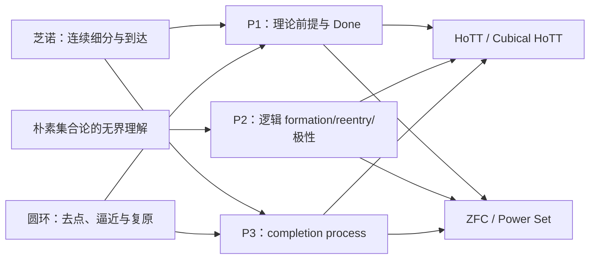

## User

你的锻打过程使用了哪些悖论和其对应的目标理论领域？

## Codex

我会按“历史悖论／过程 → 被锻打的目标理论领域 → 三把刀在其中承担的角色”来列，而不把所有外部 source 都误说成目标理论。尤其 CFTT、Climber 和合成状态机是刀具的控制材料，不是我们正在指控的理论。

## Codex

锻打中确实有两类材料：一类是“悖论及其真正攻击的理论领域”，另一类只是检验刀刃会不会误伤的控制 source。它们不能混在一起。我会在最终表中把目标理论、校准角色和明确不作为目标的 CFTT／Climber／合成夹具分栏列出。

## Codex

# 锻打中使用的悖论与目标理论领域

锻打不是把所有案例都当成“目标理论已经有问题”的证据。我们使用了三种不同身份的材料：

1. **历史悖论／用户原案**：用来给刀具提供真正的攻击形状；
2. **目标理论领域**：三把刀将来要实际定位和审视的对象；
3. **控制 source／合成夹具**：专门训练刀具命中、停手和拒绝误配，不能被误说成目标理论。

完整矩阵在 [案例校准矩阵](/Volumes/D/HoTT_AI_HANDOFF_20260911/dev-docs/模式P三把刀/005%20-%20案例校准矩阵.md:1)。

## 一、历史悖论与它们攻击的理论领域

| 悖论／过程 | 它攻击的核心理论领域 | P1 的作用 | P2 的作用 | P3 的作用 |
|---|---|---|---|---|
| **罗素型朴素集合论悖论** | **朴素集合论的无限制理解／无界按条件形成集合** | 找到“条件可直接形成全集”的基础 formation 位置 | 主正控制：`Bind → Form → Bridge → Reenter → negative feedback`，得到有限规格余式 `q↔¬q` | 原始的计算视角：考察“对象尚未构成却已被成员算符使用”的 admission-order 读法；但静态理解公理本身不自动提供运行语义。 |
| **芝诺二分过程** | **数轴稠密性、连续统、极限理论对运动与到达的处理** | 定位连续可分、无限细分与“到达”的 Done 条件 | 当前 `NOT_APPLICABLE`：它不是 predicate formation 后的自代反馈 | completion-process 正控制：`Remaining(r) → Step → Remaining(r/2)`；离散终步／最小尺度是 control。 |
| **圆环悖论** | **连续点、去点与展开、端点逼近、极限／闭包、复原完成条件**；不能简单缩成普通拓扑 | 定位 `Cut / Unroll / Endpoint / Approach / Reconnect / Done`，并区分弱紧化与来源保持的强复原 | 当前默认不强配；若要建立极限／闭包型 P2 语法，必须另起 family，不能挪用 reentry 语法 | completion-process 校准：`Cut → Unroll → Approach → Reconnect? → Done`。目前真实 repair transition 尚未由来源合同给出，因此 P3 正确停在 `CONSTRUCTION_SEMANTICS_NOT_SUPPLIED`。 |

这里有一个关键区别：**芝诺与圆环不是 P2/v0 的失败案例，而是 P2 应当诚实说“不适用”的案例。** 它们主要用来锻 P1 的前提定位与 P3 的完成过程语义。

## 二、我们实际审视的基础理论领域

| 目标理论领域 | 被锻打时的定位 | 当前三刀结果 |
|---|---|---|
| **HoTT／Cubical HoTT** | universe、identity、univalence、higher identity、HIT、半单纯 coherence、内部 questioning process | P1 能定位 universe identity 和实际 coherence/questioning consumer；P2 不能从中性 HoTT 卡或 Delay process伪造 formula reentry；P3 只能在实际 `Delay/askFrom/now/later/never` source 中定位 completion process，不能把静态类型规则伪读为 pending lifecycle。 |
| **ZFC** | Power Set 是 P1 的首个对象级基线；bounded Separation 是关键防线 | P1 在无泄漏修订测试中选到 Power Set；P2 拒绝将 Power Set／bounded Separation 误写成无限制 Bind/Form/Bridge/Reenter；P3 拒绝将静态存在公理误写成对象构造程序。 |

所以 HoTT 是三把刀的主要理论 holdout，ZFC 是跨理论外推 holdout。两者都没有因为刀具打造完成而被宣布“已经击中”。

## 三、不是目标理论的控制材料

以下材料被用来检验刀具会不会误伤，**不属于我们正在指控的目标理论领域**：

| 控制材料 | 为什么使用 | 正确结论 |
|---|---|---|
| **有界集合形成／分层规则** | 防止 P2 把任何集合形成都误配为无限制理解 | guard 阻断合法 reentry。 |
| **合成 P3 admission-order 状态机** | 验证 P3 能识别依赖环及其边界 | 只证明合成合同里的 cycle candidate，不证明任何历史理论。 |
| **CFTT staged quote/splice/HOAS source** | 检验 P2 会不会把 code generation 当作 formula self-reference；检验 P3 会不会把 staging 当作 lifecycle | 实际 staged operation 存在，但 generativity／opacity guard 阻断 P2；P3 生命周期未提供。 |
| **Climber object `prov` / Lean soundness source** | 给 P2 一份真实 object syntax、reflection、分层 soundness 的正控制 | `T₀→T₁` 是受 guard 的 reflection rung，不能压成同层自验证、悖论或 HoTT 结论。 |
| **QuestioningDelay / PedometerSemantics** | 同一真实 source 上检验三把刀会不会混写 | P1 识别固定 process；P2 不适用；P3 识别真实 completion-process，不是 admission cycle。 |

## 一句话总图

最简洁地说：

- **罗素型朴素集合论**锻出了 P2 的逻辑刀刃，也提出了 P3 的“算符先于存在性落定”问题；
- **芝诺**锻出了 P1 的前提定位和 P3 的完成过程刀刃；
- **圆环**锻出了 P1／P3 对“逼近、闭合与真正复原”之间差别的要求；
- **HoTT 与 ZFC**是三把刀完成后真正要审视的基础理论领域；
- **CFTT、Climber、合成 fixture**是防止三把刀误伤的控制材料。

### Files changed in this reply

- `/Volumes/D/HoTT_AI_HANDOFF_20260911/dev-notes/.dev-notes-skill-stage/stage-efdfee1bd878492990eaa28b59b8083d/answer.md` — 修改
- `/Volumes/D/HoTT_AI_HANDOFF_20260911/dev-notes/.dev-notes-skill-stage/stage-efdfee1bd878492990eaa28b59b8083d/prompt.md` — 修改
