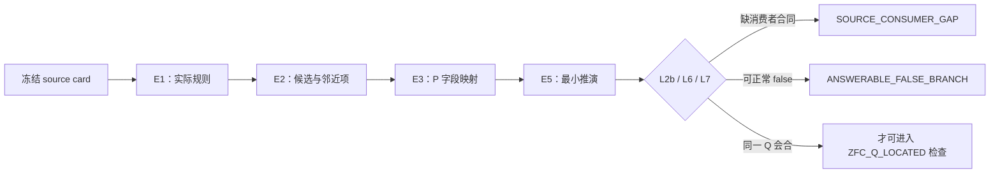

## User

我觉得有个问题，你要让子代理，把推断过程说出来，或者说，这是一种模式匹配的自我说明，换句话说，为什么它使用完刀具之后，定位到的问题点是那个位置？是要详细地说明的。


## Codex

你指出了决定性的缺口。到目前为止，我要求代理填卡、给判词和 controls，但没有强制它交出“为什么这把刀把注意力带到这个位置”的逐步匹配说明。这会让结果像黑箱选择，不能真正用来打磨 P。现在起，每一把刀的输出都必须含一份 **MatchTrace／模式匹配自我说明**：从刀具的每个字段到理论 source card 的哪条规则，为什么排除邻近位置，哪一步只是推断、哪一步有直接证据，以及换掉哪项条件就不再选这个点。

## Codex

刚完成的 P1 独立选择反而给了一个很好的示范：它清楚说明了为什么选 `u=P(a)`——一等集合、原生形成、内部成员消费、无外加结构；但它给出的 `Q(a,u): a∈u` 立即化成 `a⊆a`，是平凡成立的。这个自我说明直接暴露了 P1 还缺一把门：**Q 不能只是原生接口自动回答的例行判断，必须留下实际的、未被同一规则立即清偿的张力。** 我会把“MatchTrace + Q-friction”写成三刀的硬输出合同；没有这种可见推断链，代理的选点不计入锻刀证据。

## Codex

下一锤不是强迫 Power Set 产生一个它没有的 Q，而是让修订后的 P1 诚实检查：在这张中性 ZFC card 中，是否存在任何同时满足 L0–L6 的非平凡 Q；如果没有，它必须输出“Power Set 是 site，但不是当前 card 上的 Q”，并说明哪条 source/consumer 缺失。这正是 MatchTrace 要把黑箱选择变成可修订证据的意义。

## Codex

你指出的是这轮检验真正缺的一环。定位结果本身不足以说明刀具有效；每一次定位都必须同时交付一条**可复核的模式匹配轨迹**：它从理论的哪条原生规则开始，怎样选出对象、形成规则和真实消费者，为什么这个消费者提出的是该问题，怎样排除相邻位置，以及三把刀各自在哪一步参与或拒绝参与。

我会把这项要求固定进锻刀合同，并让正在运行的 ZFC 探针按这一格式重新报告。这里要求的是可审计的依据链，不是要求模型披露不可验证的隐藏思维。

## Codex

我已经把现有的 `MatchTrace` 检查了一遍。它目前要求了“source → 字段 → 最小归约 → 反控制”，但还没有充分规定**选择竞争者时的淘汰过程**：例如为什么是幂集而不是其邻近位置、为什么候选 Q 是这个 Q、为什么某个看似更尖锐的追问被拒绝。

我正在补一份统一的“代理自我说明合同”。以后每个 Terra / Max 探针都要给出可逐项复核的选择、映射、归约、淘汰、反事实和停手理由；如果它做不到，就只能得到 `UNEXPLAINED_*`，不能被当作刀具命中。

## Codex

正在运行的 P1 探针已经交出了一份很有用的完整理由链：它从 `a∈𝒫(𝒫(a))` 归约出“`a` 的每个成员也属于 `a`”的条件，并把 `a∈𝒫(a)` 的反身性情形作为邻近对照。

这恰好暴露了一个新的刀口缺失：**“不是恒真”不等于“理论被迫支付的张力”。** 在普通成员关系中，这个命题可以直接为假；它没有迫使幂集形成或某个消费者继续等待一个正的完成条件。因此它是很好的可审计选择尝试，却还不是 ZFC 的 Q。我会把这个差别固化为下一道门，防止模型把任何非平凡的真假判断误报成“最后一跃”的义务。

## Codex

新合同已经落盘，并且我没有把“解释得很长”误当成“解释得对”。第一份完整理由链让我们精确看到：它能证明该命题**不平凡**，却没有证明该命题是任何既定任务的**正完成前提**。

我已经把这张卡交给另一名独立的 Terra / Max 代理做 L7 复核，要求它逐段判定成员关系的 true/false/blocked 三种完成后果，并明确写出：要让这张卡真正过 L7，源材料还缺哪一条消费者规则。

## Codex

现在的第三次盲测已经在执行强化后的 L0–L7。它不再只被要求“找一个不平凡命题”，而必须把 `true / false / blocked` 各自对当前任务的完成意义说清楚；如果卡片没有真实消费者，它必须明确返回 `SOURCE_CONSUMER_GAP` 或无卡，而不能用语言上的巧妙性补上缺失的义务。

## Codex

前两份报告已经带来了一个可验证的结果：原来的 P1 能在幂集附近提出越来越复杂的 membership 条件，但每一次都要经过“这个条件若为假，任务是否仍已完成？”的审计。这个问题把“看起来有自指/不平凡”与“理论的存在性承诺被未完成的追问卡住”明确分开了。

这正是让代理说明过程的价值：它没有替我们制造 ZFC 结论，却使 P 的下一处缺口变得可定位、可反驳、可迭代。

## Codex

强化后的盲测已经完成并且作出了更严格的停手：在这张只含静态 ZFC 公理的卡上，代理不再把“`∈` 是一个关系”当作真实消费者。它返回 `SOURCE_CONSUMER_GAP`。

这让下一步非常具体：不该继续从幂集公理的孤立文字中雕出 Q，而要找一个**版本固定的、真实使用 `𝒫(a)` 的 ZFC 消费者**，并冻结它的输入、输出和 Done。只有有了这张来源卡，P1 的匹配理由、P2 的语言映射和 P3 的构造时序才可能真正会合。

## Codex

这一轮的可复核链已经闭合：第一次说明“非反身”的候选如何出现，第二次说明它为何仍可正常走 false 分支，第三次进一步指出静态 card 连真实 consumer 的 I/O/Done 合同都没有。

我已把这三层结论、三份 Terra / Max 运行收据，以及未来所有提示必须包含的解释格式，一并写入路线图。下一轮只会在拿到版本固定的真实 ZFC consumer source 后继续；不会再用裸 `∈` 或抽象的“所有子集”替它造一个任务。

## Codex

我现在按本项目的 `dev-notes-archive` 归档规范，把本轮用户要求和下方完整交付草稿写入会话记录；归档只保存可见对话与最终答复，不包含工具输出或隐藏推理。

## Codex

## 已把“为什么定位在这里”变成硬性输出

你指出的是这次锻刀不能缺少的验收面。一个代理只报出“Power Set”或某个候选表达式，最多证明它给出了一个答案；它没有说明 P 是否真的在发挥作用。

我已经把这件事写成所有后续 Terra / Max 探针的强制合同：[代理匹配自我说明合同](</Volumes/D/HoTT_AI_HANDOFF_20260911/dev-docs/模式P三把刀/010 - 代理匹配自我说明合同.md:13>)。每一次输出都必须交付八段公开、可核查的 `MatchTrace`：

1. `E0`：分析范围、版本、可用与禁用材料；
2. `E1`：实际使用的 source facts；
3. `E2`：至少一个选中位置和一个邻近竞争位置；
4. `E3`：每个 P1/P2/P3 字段由哪条 source rule 填入；
5. `E4`：逐门说明为什么选中、为什么淘汰；
6. `E5`：最小规则链，并写清 `true / false / blocked` 分别是否完成当前任务；
7. `E6`：删除或替换哪条 source fact 会使匹配失效；
8. `E7`：只在相称的证据等级上给出判词。

这记录的是代理可以公开交付、能够由来源和控制复查的推断依据。它不能证明模型权重内部实际经过了同一条因果路径；因此我把“模式匹配自我说明”和“隐藏思维链”明确分开了。合同还要求代理把竞争位置、淘汰理由和反事实写出来，使它无法只在得到答案后为答案补一段漂亮叙述。



P1 因此新增了两道关键门：[P1 定位规格](</Volumes/D/HoTT_AI_HANDOFF_20260911/dev-docs/模式P三把刀/001 - P1 理论位置与使用次序定位.md:19>)。

- **L2b，consumer contract：** `∈`、一个谓词或一个可写表达式本身不算真实消费者。来源必须给出它如何消费 `u`，以及输入、输出或 Done。
- **L7，obligation mode：** 一个不恒真的命题也不自动是 Q。Q 必须是当前任务成功所需的正前提，或 formation 尚未支付的义务；若消费者可正常返回 false，则记为 `ANSWERABLE_FALSE_BRANCH`。

## 已经用它重跑的三次结果

三次外部 CLI 实例都以 `gpt-5.6-terra / max / read-only / never` 运行，并被要求给公开理由，不读取项目既有答案。

### 1. COFORGE-003：第一次完整说明为何选中一个幂集邻近点

P1 选择了 `a ∈ P(P(a))`，而不是较浅的 `a ∈ P(a)`。它给出的理由链是：

\[
a\in P(P(a))
\Rightarrow a\subseteq P(a)
\Rightarrow \forall x\in a,\;x\subseteq a.
\]

它同时说明 `a∈P(a)` 会归约为 `a⊆a`，由反身性立即清偿，所以被 L6 淘汰。完整原始的公开 MatchTrace 保存在 [COFORGE-003 审计卡](</Volumes/D/HoTT_AI_HANDOFF_20260911/audit/20261002-ZFC-COFORGE-003-P1-外部CLI-Terra-Max.md:17>)。

这正是你要求的“为什么是这个位置”：对象、formation、候选、邻近项、归约和反事实都能逐项检查。它也立刻暴露了问题：`∀x∈a, x⊆a` 只刻画 membership 的肯定分支；条件不成立时，成员关系可以给出一个正常的否定分支。它没有使一个 formation 或既定消费者处于“尚未完成”的状态。

### 2. COFORGE-004：独立实例复核 false 分支

第二个 Terra / Max 实例采用对候选最有利的读法，即先姑且把 membership 当作 consumer。它仍给出 `ANSWERABLE_FALSE_BRANCH`：true 是肯定回答，false 是完成的否定回答；静态 card 没有规定“必须得到 true 才算 Done”。它还明确写出了候选若要过 L7 所缺的事实：一个指定任务必须要求 `a∈P(P(a))` 的肯定证书，并把 false 规定为未完成。[独立复核全文](</Volumes/D/HoTT_AI_HANDOFF_20260911/audit/20261002-ZFC-COFORGE-004-L7复核-外部CLI-Terra-Max.md:23>)。

### 3. COFORGE-005：强化后不再把裸 `∈` 当作消费者

第三个 fresh 重跑比较 `b∈P(a)` 与 `P(a)∈P(a)`。它没有再试图从静态幂集文字构造问题，而是返回：

```text
SOURCE_CONSUMER_GAP / NO_ZFC_Q_ON_NEUTRAL_CARD
```

理由是中性 card 只说 membership 是 relation；它没有提供一个消费 `P(a)` 的 judgment task、输入、输出或 Done。这个结论的 E0–E7 全文在 [COFORGE-005 审计卡](</Volumes/D/HoTT_AI_HANDOFF_20260911/audit/20261002-ZFC-COFORGE-005-P1-L0-L7重跑-外部CLI-Terra-Max.md:18>)。

## 当前研究状态

Power Set 仍然是 ZFC 的**显眼基础位置**，这一点没有被放弃；当前卡没有找到共同 Q。它现在精确停在：

```text
ZFC_SITE_SELECTED
SOURCE_CONSUMER_GAP
ZFC_Q_NOT_YET_LOCATED
```

这不是 ZFC 的不一致性结论，也不是对 Power Set 的数学否定。它告诉我们下一步必须去哪里：找一份**版本固定的、真实消费 `P(a)` 的 ZFC 来源**，冻结该消费者的输入、操作、观察、输出和 Done；然后让 P1、P2、P3 对同一张卡各自给出完整 MatchTrace。只有三把刀在同一 `u / F / C / Q / I/O / Done` 上会合，才允许写 `ZFC_Q_LOCATED`。当前共同锻造标准和三次运行的连续记录在 [ZFC共同锻造与成功判据](</Volumes/D/HoTT_AI_HANDOFF_20260911/dev-docs/模式P三把刀/009 - ZFC共同锻造与成功判据.md:30>)。

## 已落盘与核验

- 总体路线、十个分片和三把刀的横向打造过程在 [模式 P 三把刀索引](</Volumes/D/HoTT_AI_HANDOFF_20260911/dev-docs/模式P三把刀.md:1>) 与 [横向比较记录](</Volumes/D/HoTT_AI_HANDOFF_20260911/dev-docs/模式P三把刀/004 - 打造过程与横向比较.md:132>)。
- 这项要求已进入项目裁定和 Feature 当前状态：[rulings.md](</Volumes/D/HoTT_AI_HANDOFF_20260911/rulings.md:474>)、[feature-list.md](</Volumes/D/HoTT_AI_HANDOFF_20260911/feature-list.md:37>)。
- `python3 -B scripts/audit/verify_governance_shards.py` 已通过：`2003` 个索引完成结构校验；已有的 13 条超出 300 行软目标提示均为非阻断提示。受触及文档和新审计卡的 whitespace/diff 检查也通过。

我没有提交或推送这些变更。下一步将从真实 ZFC consumer source card 开始，而不是重复对静态公理做词面匹配。

### Files changed in this reply

- `/Volumes/D/HoTT_AI_HANDOFF_20260911/dev-docs/模式P三把刀.md` — 修改
- `/Volumes/D/HoTT_AI_HANDOFF_20260911/dev-docs/模式P三把刀/004 - 打造过程与横向比较.md` — 修改
- `/Volumes/D/HoTT_AI_HANDOFF_20260911/dev-docs/模式P三把刀/008 - 全部打造验收.md` — 修改
- `/Volumes/D/HoTT_AI_HANDOFF_20260911/dev-docs/模式P三把刀/009 - ZFC共同锻造与成功判据.md` — 新增
- `/Volumes/D/HoTT_AI_HANDOFF_20260911/feature-list.md` — 修改
- `/Volumes/D/HoTT_AI_HANDOFF_20260911/rulings.md` — 修改
- `/tmp/pattern-p-zfc-coforge-001/PROMPT.md` — 新增
- `/Volumes/D/HoTT_AI_HANDOFF_20260911/audit/20261002-ZFC-COFORGE-001-外部CLI-Terra-Max.md` — 新增
- `/Volumes/D/HoTT_AI_HANDOFF_20260911/dev-docs/模式P三把刀/009 - ZFC共同锻造与成功判据.md` — 修改
- `/tmp/pattern-p-zfc-coforge-002-p1/PROMPT.md` — 新增
- `/Volumes/D/HoTT_AI_HANDOFF_20260911/dev-docs/模式P三把刀/001 - P1 理论位置与使用次序定位.md` — 修改
- `/Volumes/D/HoTT_AI_HANDOFF_20260911/dev-docs/模式P三把刀/002 - P2 计算—逻辑翻译.md` — 修改
- `/Volumes/D/HoTT_AI_HANDOFF_20260911/dev-docs/模式P三把刀/003 - P3 构造状态与准入次序.md` — 修改
- `/Volumes/D/HoTT_AI_HANDOFF_20260911/dev-docs/模式P三把刀/006 - 第一轮锻坯与校准夹具.md` — 修改
- `/tmp/pattern-p-zfc-coforge-003-p1/PROMPT.md` — 新增
- `/Volumes/D/HoTT_AI_HANDOFF_20260911/dev-docs/模式P三把刀/010 - 代理匹配自我说明合同.md` — 新增
- `/Volumes/D/HoTT_AI_HANDOFF_20260911/dev-docs/模式P三把刀/010 - 代理匹配自我说明合同.md` — 修改
- `/tmp/pattern-p-zfc-coforge-004-l7-review/PROMPT.md` — 新增
- `/Volumes/D/HoTT_AI_HANDOFF_20260911/audit/20261002-ZFC-COFORGE-003-P1-外部CLI-Terra-Max.md` — 新增
- `/Volumes/D/HoTT_AI_HANDOFF_20260911/audit/20261002-ZFC-COFORGE-004-L7复核-外部CLI-Terra-Max.md` — 新增
- `/Volumes/D/HoTT_AI_HANDOFF_20260911/audit/README.md` — 修改
- `/tmp/pattern-p-zfc-coforge-005-p1-l7/PROMPT.md` — 新增
- `/Volumes/D/HoTT_AI_HANDOFF_20260911/audit/20261002-ZFC-COFORGE-005-P1-L0-L7重跑-外部CLI-Terra-Max.md` — 新增
- `/Volumes/D/HoTT_AI_HANDOFF_20260911/dev-notes/.dev-notes-skill-stage/stage-fdfcceff0bf64abda00d83631645919f/prompt.md` — 修改
- `/Volumes/D/HoTT_AI_HANDOFF_20260911/dev-notes/.dev-notes-skill-stage/stage-fdfcceff0bf64abda00d83631645919f/answer.md` — 修改
