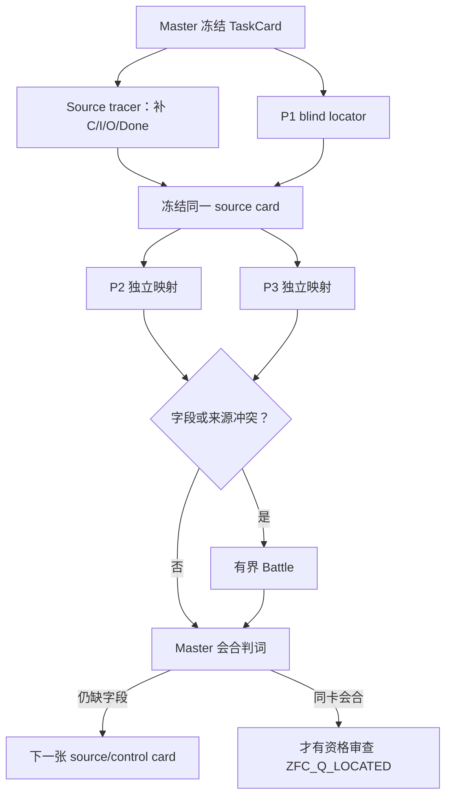

## User

三把刀具，我认为不一定非要放在同一个子代理中处理，完全可以形成刀具使用的DAG，甚至是动态DAG，也就是通过App Server启动不同的道具使用的子代理，当它们之间出现不一致的时候，还可以多次调用它们之间的互相Battle，最终让子代理们Battle出更好的结果，这也算是某种意义上的数据挖掘，甚至我认为，你作为Master，也可以参与Battle。另外，在调度子代理的过程中，不一定不可以联网或者阅读项目已经有的dev或者main，甚至是其他分支上的文件。有些DAG阶段可以，有些DAG阶段不可以，这个都需要你作为整个动态DAG的调度者——Master Agent，每次智能地判断、控制、调度。所以你自己如何调度动态DAG，应该成为你作为Master Agent在当前的的项目内的，当前任务上的，一个SKill，或者说SOP。我说Skill的时候，不是要求你必须做成标准的Codex在项目内的Skill，而是一种比喻。当然真的被你做成了项目内的Skill，也不是不可以，但是要考虑对其进行在dev分支的README.md和AGENTS.md中的记录，否则以后的AI，怕它不知道这件事的存在和影响，以及，更为重要的是，它是什么任务中的Skill，是用来做什么的，如何使用。


## Codex

这个判断是对的：三把刀不是必须由一个代理顺序执行的流水线。更合适的结构是**按证据条件展开的动态 DAG**：P1、P2、P3 可以先独立做各自的 source-grounded 判断；只有它们在同一张冻结卡上发生分歧，才派生出交叉质询、反控制或主研究者裁决节点。

我会把它做成当前“ZFC 共同锻造”的调度 SOP，而不是把它误写成一条永远要求离线、永远禁止读项目、或永远让代理互相争论的固定流程。每个节点会显式声明允许读取什么、是否可联网、是否必须盲测、输出什么 MatchTrace、何时触发 Battle，以及 Master 怎样裁决和写回。

## Codex

这项工作会改变模型、提示、上下文、工具权限、并发和证据语义。我正在按项目的本地会话治理，以及 `repo-subagent-governance`、`repo-ai-system-governance`、`repo-acp-multi-client-control` 的合同建立闭包；它们要求把动态 DAG 的节点权限、来源可见性、Battle 触发、停止条件和运行收据写成可审计的系统行为，而不是只画一张流程图。

## Codex

我已把这轮定位为 **GOVERNANCE_ALIGNMENT / T1→T2 边界上的任务**：它不改变任何 HoTT 或 ZFC 数学结论，但会改变未来研究代理的角色、可见上下文、工具权限、证据与验收方式。

我对用户意图的复述是：要保住的发现动作，是让 P1、P2、P3 真正从各自的惯性中产生和检验线索，而不是被单一提示预先协调成一个答案；最危险的偏差，是把多代理共识误当作数学真理，或让 Battle 变成没有新来源证据的无限争辩。新的路由必须让差异触发精确的交叉质询，并由来源、控制和 Master 的同一任务检查裁决。

## Codex

SOP、项目 Skill、根 `AGENTS.md`、任务路由和 README 入口已经开始接通。它把旧的全局禁令改成了一个严格的**任务限定例外**：只服务 P1/P2/P3 的共同锻造，worker 固定 Terra / Max、只读、无递归，Master 才能写回当前真值。

我接下来会用当前“`∈` 到底能不能算 consumer”这个已有分歧，跑第一张真实的 Battle DAG：两名角色化节点各自提出最强、来源受限的论证，第三名独立 arbiter 只看冻结 source 与两份公开 claim。这样验证的不是数学结论，而是 DAG 的依赖、隔离、Battle 和 Master 裁决链。

## Codex

第一张 Battle DAG 已经按设计展开：两个节点都只看同一张中性 source card，其中一方尽力把 `∈` 作为最小 consumer，另一方只检查它有没有输入／输出／Done 合同。它们确实产生了可定位的分歧，所以第三个 arbiter 节点已在相同 source 和冻结 L2b 定义下裁决。

这不是让模型互相“说服”对方；争点被压缩成一个可回源的问题：这张卡是否真的给出一个 consumer contract。

## Codex

第一张 Battle 已经结束，arbiter 没有用“多数同意”裁决，而是直接找到了冲突所在：支持 relation-as-consumer 的节点只能靠额外约定把 atomic assertion 升格为 consumer；冻结 source card 没有这条约定。因此结果是 `RESOLVED_BY_SOURCE / SOURCE_CONSUMER_GAP`。

按动态 DAG 的下一条边，我会启动两个允许联网的 source-tracer 节点：一个找版本固定的形式化／证明库消费者，一个找明确使用 Power Set 的数学构造消费者。它们只负责补 `C / I/O / Done` 的来源卡，不被允许直接宣称 ZFC 已有 Q。

## Codex

两个 source-tracer 节点正在走允许联网的 `PRIMARY_WEB_SOURCE` 分支：一条追 Isabelle/ZF 中的幂集规则与消去／使用合同，另一条追一个公开、版本固定的幂集消费者构造。它们的任务不是“找到矛盾”，而是把中性卡缺失的 `C / I/O / Done` 补成可回源材料，或者诚实返回没有合格来源。

## Codex

来源节点的访问策略正在起作用：它们没有回头读本仓库的既有答案，而是在公开的正式库／原典中确认“幂集”究竟怎样被后续规则消费。当前它们都在收紧版本定位和规则 locator；如果只能找到 `Set α` 一类外层表示、不能给出 ZF/ZFC 语义上的 source contract，也必须把这个不匹配写成控制，而不能把它充当 ZFC 的证据。

## Codex

两条 source-tracer 都已经越过“裸 `∈`”这一步，正在把候选压成可引用的正规合同。一条聚焦 ZF/ZFC-style formal library 的幂集及函数集合规则；另一条暂时发现 HoTT/Set 层的 Cantor 型构造可能是一个**表示层控制**。我会把它们分别标清理论变体，绝不把后者借名称混成 ZFC。

## Codex

现在 P1 的 `C` 缺口已经有了第一张版本固定的正式来源卡：Mathlib 的 ZFSet 模型把 `powerset (prod x y)` 直接交给命名的 `funs` 构造，并给出 `mem_funs` 合同。这只说明**存在一个真实 consumer**，不说明张力已经出现。

同一张卡的 P2 与 P3 节点正在独立检查：它是否真有 formula-level reentry，是否真有 pending/admission 生命周期。这样的拆分正是动态 DAG 的作用：P1 通过一项，P2/P3 不会被它带着一起“通过”。

## Codex

来源阶段完成了一个很重要的分层结果：

- 在版本固定的 Mathlib `ZFSet` 模型里，`powerset (prod x y)` 确实被 `funs x y` 这个命名构造消费，并有 `mem_funs` 的证明／使用合同，因此 L2b 的“真实 consumer”不再只是抽象要求。
- 同一张卡上，P2 找不到 formula representation 与 reentry，P3 找不到 pending/admission/completion 状态机。它们分别停在 `NOT_APPLICABLE` 与 `CONSTRUCTION_SEMANTICS_NOT_SUPPLIED`。
- 所以 DAG 没有把“找到了 consumer”误报成“找到了 ZFC 的 Q”；反而把下一张来源卡的条件压得更准确了。

## Codex

动态 DAG 的第一轮已经形成了可审计的结果链，并且工作树的结构校验、README 快照校验、JSON 校验与 diff whitespace 校验都已通过。我现在会按本项目的 `dev-notes-archive` 规范，把这轮用户原话和下面的完整交付草稿归档；归档只保存可见输入与最终答复。

## Codex

## 动态 DAG 已成为当前模式 P 的调度合同

我采纳了你的设计，并把它落实为当前 P1/P2/P3 共同锻造的项目内 Skill 与 SOP。它不是一个固定流水线，也没有把所有 worker 放进同一上下文。Master 先冻结一张 `TaskCard`，再按证据缺口动态产生节点；每个节点拿到独立的 `NodeCard`，其中固定：

- 当前理论变体与 `u / F / C / Q / I/O / Done`；
- 唯一目标与明确非目标；
- 精确模型、effort、sandbox、approval、超时和停止条件；
- 可见材料：盲态卡、固定本地 source、公开一手网页、项目 `dev/main/其它分支` 证据，或 sealed Battle pack；
- `Claims / Evidence / Conflicts / Unknowns / Mutations / Verification / Recommendation`，以及 P1/P2/P3 的公开 `MatchTrace`。



Battle 只在 `C`、source、task、guard、control 或 Master 自己提出的 claim 发生可定位冲突时启动。每一 claim 至多一次 challenge、一次 reply，再交独立 arbiter；没有新 source、控制或规格变化时，终态是 `BATTLE_INCONCLUSIVE`。Master 可以提出 claim 和参与质询，但自己的 claim 也必须接受独立 challenge。裁决优先级固定为：一手 source／真实 consumer → 保存运行或形式证据 → 同一任务控制 → MatchTrace → 多节点一致性。

完整合同位于 [模式 P 动态 DAG 调度](</Volumes/D/HoTT_AI_HANDOFF_20260911/dev-docs/模式P动态DAG调度.md:12>)，其 [TaskCard 与 NodeCard](</Volumes/D/HoTT_AI_HANDOFF_20260911/dev-docs/模式P动态DAG调度/001 - 任务卡、角色与节点合同.md:9>)、[访问等级与动态展开](</Volumes/D/HoTT_AI_HANDOFF_20260911/dev-docs/模式P动态DAG调度/002 - 动态展开、访问等级与冻结接力.md:9>)、[Battle 与 Master 裁决](</Volumes/D/HoTT_AI_HANDOFF_20260911/dev-docs/模式P动态DAG调度/003 - Battle、裁决与收据.md:9>) 分开维护。项目 Skill 是 [hott-pattern-p-dynamic-dag-orchestration](</Volumes/D/HoTT_AI_HANDOFF_20260911/.codex/skills/hott-pattern-p-dynamic-dag-orchestration/SKILL.md:1>)。

## 权限与信息隔离

你说得对，联网、读取 `dev`、`main`、其它分支或不读任何项目材料，都应该是节点级选择。SOP 定义了六个 access profile：

| Profile | 用途 |
|---|---|
| `BLIND_CARD` | P1 首轮定位；只看冻结理论卡，隔离项目答案、分支和网络。 |
| `PINNED_LOCAL_SOURCE` | 只读指定的本地原典、commit 或分支文件。 |
| `PRIMARY_WEB_SOURCE` | 只读 NodeCard 指定的公开一手来源，记录 URL、时间与支持范围。 |
| `PROJECT_EVIDENCE_REVIEW` | 只读列明的 `dev/main/其它分支`、审计或控制材料。 |
| `BATTLE_PACK` | 只看冻结 source、互相矛盾的公开 claim 和 controls。 |
| `MASTER_FULL` | 仅 Master 使用，用于选择下一节点和写回 current owner。 |

当前任务限定的 worker 请求固定为 `gpt-5.6-terra / max`，只读、无递归、无 Git 或 current-owner 写权；默认一轮最多三名并行。旧的 blanket Sub Agent 禁令保留给本项目其它工作，P-DAG 是用户 2026-10-02 明确授权的限定例外，已经写入 [根 AGENTS](</Volumes/D/HoTT_AI_HANDOFF_20260911/AGENTS.md:156>)、[任务路由](</Volumes/D/HoTT_AI_HANDOFF_20260911/.codex/cognition/TASK_ROUTING.md:13>)、[项目 README 入口](</Volumes/D/HoTT_AI_HANDOFF_20260911/README/001 - 当前入口与关键文件.md:112>) 和 [Feature F-032](</Volumes/D/HoTT_AI_HANDOFF_20260911/feature-list.md:38>)。

## 第一张真实 Battle DAG

我没有用一个人为的一致答案演示 Battle，而是取了当前已有的真实分歧：**裸 `∈` 能不能算 P1 的 consumer `C`？**

1. **B-A advocate** 竭力论证：`a∈P(P(a))` 的对象和关系都来自 source，因此可作为最小 consumer。
2. **B-B challenger** 指出：relation 有语法意义，不等于 source 已给一个消费它的 judgment task、输入、输出、Done 或后继交接。
3. **B-C arbiter** 只读取同一 source card、冻结的 L2b 定义与两份 sealed claim，给出 `RESOLVED_BY_SOURCE / SOURCE_CONSUMER_GAP`。

关键不是“挑战者赢了”，而是 advocate 自己也明确承认：要把 atomic membership assertion 升格为 consumer，必须另加一条 source card 没有的 convention。Master 因此保留 L2b，而没有按票数决定。完整的节点、prompt/result hash、source card 和裁决都在 [P-DAG-BATTLE-001 审计](</Volumes/D/HoTT_AI_HANDOFF_20260911/audit/20261002-P-DAG-BATTLE-001-Terra-Max.md:1>)。

## 第一张允许联网的 source DAG

Battle 之后，动态调度器没有重复讨论裸 membership，而是派出两个 `PRIMARY_WEB_SOURCE` 节点，再把其中一张来源卡冻结给 P2/P3：

- **S-A，形式化 ZFC-model source：** Mathlib4 `v4.16.0` 的 `ZFSet` 文件明确说明它在 Lean underlying type theory 中建模 ZFC (+ Choice)，并定义 `powerset`、`mem_powerset`、`funs` 与 `mem_funs`。在这张卡里，`powerset (prod x y)` 被命名构造 `funs x y` 实际消费，且 `mem_funs` 给出证明／使用合同。这个结果只通过了**该 Lean ZFC model／库变体**上的 L2b source-card 门；它不等同于标准 ZFC 已经出现 Q。[Mathlib release v4.16.0](https://github.com/leanprover-community/mathlib4/releases/tag/v4.16.0) 与 [固定 commit 的 ZFSet 源码](https://raw.githubusercontent.com/leanprover-community/mathlib4/a6276f4c6097675b1cf5ebd49b1146b735f38c02/Mathlib/SetTheory/ZFC/Basic.lean) 支持这张来源卡的版本和声明。

- **S-B，跨理论正控制：** 节点定位了 HoTT Book `first-edition-611-ga1a258c` §10.3 Lemma 10.3.7 中 `P(B):=(B→Prop)` 与 `g:P(B)→B` 的良基递归构造。它只说明“幂集对象可以有明确的 C/I/O/Done”，不进入 ZFC 证据或 Q。版本化 PDF 在 [HoTT Book](https://homotopytypetheory.org/wp-content/uploads/2013/03/hott-online-611-ga1a258c.pdf)。

同一张 Mathlib ZFSet card 随后被 P2、P3 独立消费：

| 刀 | 判词 | 原因 |
|---|---|---|
| P1 | `QUALIFYING_FORMAL_CONSUMER_WITH_SCOPE` | 有直接 `powerset(prod x y) → funs x y` 和 `mem_funs` contract。 |
| P2 | `NOT_APPLICABLE` | `mem_funs` 只是语义 membership bridge；卡中没有 formula representation、Bind artifact 或 Reenter。 |
| P3 | `CONSTRUCTION_SEMANTICS_NOT_SUPPLIED` | `def`/`theorem` 给静态 term dependency 与 membership criterion，没有 pending/admission/completion 的同对象 transition。 |

这正是三把刀分开的收益：P1 的真实 consumer source 通过，并没有带着 P2、P3 一起“通过”。Master 的当前判词保持为：

```text
QUALIFYING_FORMAL_CONSUMER_WITH_SCOPE
P2_NOT_APPLICABLE
P3_CONSTRUCTION_SEMANTICS_NOT_SUPPLIED
NO_COMMON_Q / NOT_ZFC_Q_LOCATED
```

完整节点收据在 [P-DAG-SOURCE-001](</Volumes/D/HoTT_AI_HANDOFF_20260911/audit/20261002-P-DAG-SOURCE-001-Terra-Max.md:1>)，并写回 [ZFC共同锻造当前 owner](</Volumes/D/HoTT_AI_HANDOFF_20260911/dev-docs/模式P三把刀/009 - ZFC共同锻造与成功判据.md:135>)。

## App Server 的实际边界

我检查了本机 `codex-cli 0.157.0` 的 App Server schema：`thread/start` / `turn/start` 具备 model、effort、sandbox 和 approval 相关字段。共享 `agent_session_broker.py` 也提供 Codex App Server facade。不过当前 adapter 的 `new_session` 没有把 schema 的 `sandbox` 字段转发到 `thread/start`。

因此我没有把“prompt 里写只读”伪装成环境权限，也没有启动未资格化的 App Server 研究 worker。当前状态是：

```text
APP_SERVER_PERMISSION_FORWARDING_NOT_QUALIFIED
```

已完成的 Battle/source nodes 使用了 CLI banner 明示的 `read-only / never / Terra / Max` lane。若以后要启用真正的 App Server 动态 worker，先要资格化 sandbox/approval 的转发与回显、observer ACL、private wire、cancel→terminal/force-stop 生命周期。这项 Host 层来源检查在 [App Server 资格审计](</Volumes/D/HoTT_AI_HANDOFF_20260911/audit/20261002-P-DAG-AppServer-资格检查.md:1>) 中。

## 当前可继续的 DAG 边

下一步已经不再是泛泛地问“ZFC 哪里有问题”。Master 将按下面的条件选择下一节点：

1. 找一张版本固定的**标准 ZFC 或明确 ZFC-side** actual consumer card，明确它是公理、模型、库接口或数学使用；
2. 只有 source 明示 formula representation / Bind / Reenter，才启动新的 P2 tracer；
3. 只有 source 明示 tracked object、state predicates、transitions 和 completion，才启动新的 P3 tracer；
4. 只有新的字段／source／任务冲突出现，才再开 Battle；
5. App Server lane 在权限资格化前保持停用。

这使“锻刀”和“定位 ZFC Q”继续保持同一过程：每次节点结果都会修正刀具的字段条件，也会缩小下一张 ZFC source card 的位置。它们尚未会合，所以没有把任何结果写成 ZFC 的数学问题或悖论。

## 落盘与核验

- 新增的项目 Skill、动态 DAG SOP、AGENTS scoped authorization、TASK_ROUTING、README、Feature、rulings、MEMORY 和本轮 T2 审计集都已经写入；本轮审计集在 [S-GOV-20261002-P-DAG-ORCHESTRATION](</Volumes/D/HoTT_AI_HANDOFF_20260911/.codex/research/hott/sessions/S-GOV-20261002-P-DAG-ORCHESTRATION/SESSION.md:1>)。
- `python3 -B scripts/audit/verify_governance_shards.py` 通过：`2005` 个索引，13 条既有软行数提示均非阻断。
- `python3 -B scripts/readme/verify_readme_snapshot.py`、`SKILL_ROLES.json` 与本轮 `RUNS.json` 的 JSON 解析、以及受触及路径的 diff/whitespace 检查均通过。
- 没有 commit、tag、push、发布、App Server worker 启动、共享 broker 修改或外部系统写入。

### Files changed in this reply

- `/Volumes/D/HoTT_AI_HANDOFF_20260911/.codex/skills/hott-pattern-p-dynamic-dag-orchestration/SKILL.md` — 新增
- `/Volumes/D/HoTT_AI_HANDOFF_20260911/dev-docs/模式P动态DAG调度.md` — 新增
- `/Volumes/D/HoTT_AI_HANDOFF_20260911/dev-docs/模式P动态DAG调度/001 - 任务卡、角色与节点合同.md` — 新增
- `/Volumes/D/HoTT_AI_HANDOFF_20260911/dev-docs/模式P动态DAG调度/002 - 动态展开、访问等级与冻结接力.md` — 新增
- `/Volumes/D/HoTT_AI_HANDOFF_20260911/dev-docs/模式P动态DAG调度/003 - Battle、裁决与收据.md` — 新增
- `/Volumes/D/HoTT_AI_HANDOFF_20260911/dev-docs/模式P动态DAG调度/004 - 运行引擎、验证与治理影响.md` — 新增
- `/Volumes/D/HoTT_AI_HANDOFF_20260911/AGENTS.md` — 修改
- `/Volumes/D/HoTT_AI_HANDOFF_20260911/.codex/AGENTS.md` — 修改
- `/Volumes/D/HoTT_AI_HANDOFF_20260911/.codex/cognition/TASK_ROUTING.md` — 修改
- `/Volumes/D/HoTT_AI_HANDOFF_20260911/.codex/skills/SKILL_ROLES.json` — 修改
- `/Volumes/D/HoTT_AI_HANDOFF_20260911/README/001 - 当前入口与关键文件.md` — 修改
- `/Volumes/D/HoTT_AI_HANDOFF_20260911/dev-docs/README.md` — 修改
- `/Volumes/D/HoTT_AI_HANDOFF_20260911/MEMORY/001 - 当前执行队列.md` — 修改
- `/Volumes/D/HoTT_AI_HANDOFF_20260911/feature-list.md` — 修改
- `/Volumes/D/HoTT_AI_HANDOFF_20260911/rulings.md` — 修改
- `/Volumes/D/HoTT_AI_HANDOFF_20260911/dev-docs/模式P三把刀.md` — 修改
- `/Volumes/D/HoTT_AI_HANDOFF_20260911/dev-docs/模式P三把刀/009 - ZFC共同锻造与成功判据.md` — 修改
- `/tmp/hott-p-dag-battle-001/advocate/PROMPT.md` — 新增
- `/tmp/hott-p-dag-battle-001/challenger/PROMPT.md` — 新增
- `/tmp/hott-p-dag-battle-001/arbiter/PROMPT.md` — 新增
- `/Volumes/D/HoTT_AI_HANDOFF_20260911/audit/20261002-P-DAG-BATTLE-001-Terra-Max.md` — 新增
- `/Volumes/D/HoTT_AI_HANDOFF_20260911/audit/README.md` — 修改
- `/Volumes/D/HoTT_AI_HANDOFF_20260911/dev-docs/模式P动态DAG调度/004 - 运行引擎、验证与治理影响.md` — 修改
- `/Volumes/D/HoTT_AI_HANDOFF_20260911/dev-docs/模式P三把刀/004 - 打造过程与横向比较.md` — 修改
- `/Volumes/D/HoTT_AI_HANDOFF_20260911/audit/20261002-P-DAG-AppServer-资格检查.md` — 新增
- `/Volumes/D/HoTT_AI_HANDOFF_20260911/README.md` — 修改
- `/Volumes/D/HoTT_AI_HANDOFF_20260911/README/004 - 路线地图.md` — 修改
- `/Volumes/D/HoTT_AI_HANDOFF_20260911/README/005 - 当前最强前缘：两个幽灵.md` — 修改
- `/Volumes/D/HoTT_AI_HANDOFF_20260911/README/006 - 后续候选前缘.md` — 修改
- `/tmp/hott-p-dag-source-001/formal-consumer/PROMPT.md` — 新增
- `/tmp/hott-p-dag-source-001/math-consumer/PROMPT.md` — 新增
- `/tmp/hott-p-dag-source-001/p2-map/PROMPT.md` — 新增
- `/tmp/hott-p-dag-source-001/p3-map/PROMPT.md` — 新增
- `/Volumes/D/HoTT_AI_HANDOFF_20260911/audit/20261002-P-DAG-SOURCE-001-Terra-Max.md` — 新增
- `/Volumes/D/HoTT_AI_HANDOFF_20260911/.codex/research/hott/sessions/S-GOV-20261002-P-DAG-ORCHESTRATION/CORE_COGNITION_AUDIT.md` — 新增
- `/Volumes/D/HoTT_AI_HANDOFF_20260911/.codex/research/hott/sessions/S-GOV-20261002-P-DAG-ORCHESTRATION/RUNS.json` — 新增
- `/Volumes/D/HoTT_AI_HANDOFF_20260911/.codex/research/hott/sessions/S-GOV-20261002-P-DAG-ORCHESTRATION/SESSION.md` — 新增
- `/Volumes/D/HoTT_AI_HANDOFF_20260911/.codex/research/hott/sessions/S-GOV-20261002-P-DAG-ORCHESTRATION/CORE_COGNITION_AUDIT/001 - 核心认知逐项回评（一）.md` — 新增
- `/Volumes/D/HoTT_AI_HANDOFF_20260911/.codex/research/hott/sessions/S-GOV-20261002-P-DAG-ORCHESTRATION/CORE_COGNITION_AUDIT/002 - 核心认知逐项回评（二）.md` — 新增
- `/Volumes/D/HoTT_AI_HANDOFF_20260911/.codex/research/hott/sessions/S-GOV-20261002-P-DAG-ORCHESTRATION/CORE_COGNITION_AUDIT/003 - 扩展认知逐片回评.md` — 新增
- `/Volumes/D/HoTT_AI_HANDOFF_20260911/.codex/research/hott/sessions/S-GOV-20261002-P-DAG-ORCHESTRATION/CORE_COGNITION_AUDIT/004 - 语义对齐、动态DAG与下一节点.md` — 新增
- `/Volumes/D/HoTT_AI_HANDOFF_20260911/.codex/research/hott/sessions/S-GOV-20261002-P-DAG-ORCHESTRATION/SESSION.md` — 修改
- `/Volumes/D/HoTT_AI_HANDOFF_20260911/.codex/research/hott/sessions/S-GOV-20261002-P-DAG-ORCHESTRATION/CORE_COGNITION_AUDIT.md` — 修改
- `/Volumes/D/HoTT_AI_HANDOFF_20260911/dev-notes/.dev-notes-skill-stage/stage-ba89295a19424c61b50c736c151a5e89/answer.md` — 修改
- `/Volumes/D/HoTT_AI_HANDOFF_20260911/dev-notes/.dev-notes-skill-stage/stage-ba89295a19424c61b50c736c151a5e89/prompt.md` — 修改
