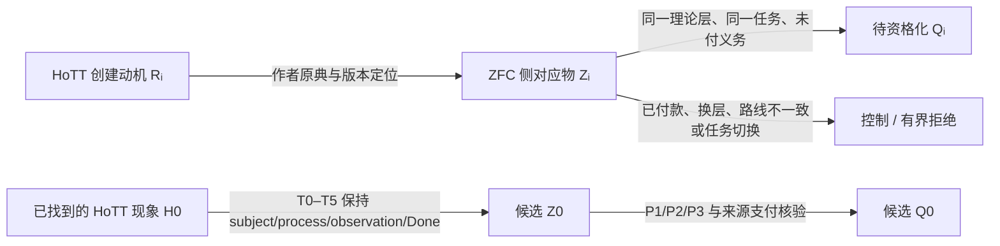

## User

其实真正的问题是，你审计过了我们走过的全部锻刀历程，而另外一个worktree的AI去站在这个角度：
```
HoTT的发明者或许是看到了ZFC并不完美的地方，比如Z0，Z1、Z2、Z3……，但是HoTT本身已经被我们找到了它的问题，不妨称之为H0。所以这就启发我们，那些HoTT论文中表述的，它的创建者认为在有了ZFC的情况下，有必要创建它的原因R1、R2、R3……，假设对应了Z1、Z2、Z3……，这些不都是我们找ZFC的Q1（Z1），Q2（Z2），Q3（Z3）……的线索吗？而且某种意义上我们甚至还可以找到Q0（H0（Z0）），意思就是Q0是ZFC的Q，其实对应了H0在ZFC中的对应物Z0。
```

审视了相关学术文献，那么这种审视的结果，是不是应该拿来重新审视我们的锻刀的全过程呢？


## Codex

是，**应该回流审视**，而且这不是把另一条文献线附在锻刀审计后面作为背景材料。它改变了“候选从哪里生成”的证据入口：从原来主要由 Power Set 及其邻域出发，扩展为 `HoTT 创建动机 Rᵢ → ZFC 中的对应 Zᵢ → 待资格化 Qᵢ`。  

我会先按你的原始模式 P／H0–Z0 思路和候选 worktree 的一手档案重新建立这个交叉闭包，再判断它应当如何影响已经完成的 130 单位审计：哪些卡需要重开、哪些仍是有效控制、哪些地方需要新增“路线级回流审计”，而不是把文献里出现的 ZFC 不足直接写成 Q。

## Codex

文献结果对锻刀历程的作用已经可以定性：它们应成为一次**证据增量回流审计**的输入，而不是被当作附录，也不能因来源来自 HoTT 创建动机就跳过 P 的同一任务门。现有的 130 单位审计保留为历史当时态；接下来需要重审的是其候选空间与来源前沿，而不是重写旧运行。  

尤其是候选档案的 `HMZ-009 → HMZ-010 → HMZ-012` 已经把 Power Set 的路线从泛泛的“幂集”推进到可检查的 quotient-subset bridge、route mismatch/payment、以及 finite Done 与 totality Done 的同一性缺口；而 `HMZ-013` 则把你说的 `H0 → Z0` 先给出一个来源化的**反类比控制**。我会在最终回答中把这套回流审计的结构和它对 R01--R13 的精确影响说明清楚。

## Codex

# 是：应当回流重审，但重审的是候选生成与来源前沿

你的这个问题正好指出了我们刚完成的 130 单位原子审计还缺的下一层：它严格审计了**已经发生的锻刀**怎样服务或没有服务于 Q，却还没有把 HoTT 创建动机文献产生的 `Rᵢ → Zᵢ → Qᵢ` 路线作为新的外部证据增量，回流测试旧的候选空间。

所以答案是：**应该，而且这应成为一轮正式的“文献证据回流审计”。**

它不应把原有 130 张卡推翻或重写。每张卡的 `AS_RUN` 历史事实仍然有效。需要重新审视的是：在新的、来源受控的 `Rᵢ → Zᵢ` 证据出现以后，哪些旧的 source-gap、payment、route-mismatch、formation-origin 或 H0 transport 判断需要被收紧、保留、重新开启或确认已经有了更强的反控制。

## 这条逻辑的正确形状



这里有三个不能跳过的门：

1. **`Rᵢ` 不自动推出 `Zᵢ`。** HoTT 作者说“ZFC 在某处不够好”，可能谈的是语言、模型、范畴论、证明助手工程、选择、宇宙层级或实际交付。每个动机都要回到一个版本固定的 ZFC 对象、formation、consumer 和 Done。

2. **`Zᵢ` 不自动推出 `Qᵢ`。** `Zᵢ` 可以最终成为 payment control、route mismatch、模型语义边界、proof-theory Done 或 actual-consumer control。只有同一任务中仍有未付的正义务、P2/P3 片段或 formation-use 张力时，它才进入 Q。

3. **`H0` 不自动给出 `Z0` 或 `Q0`。** `Z0` 必须通过严格的 H0 transport：ZFC 侧对象要保留 H0 的 subject、过程、观察量和 Done。候选文献里的 HMZ-013 目前给出的正是一个反类比控制：宇宙模型、smallness、inaccessible scope 与对象身份都改变了，因此 `H0 → Z0` 目前仍是 `NOT FORMED`，不能写成 Q0。

## 它怎样改变已经完成的锻刀审计

这不是要求机械重跑全部 130 张 AtomicAuditCard。正确的单位是：**用文献结果对 R01--R13 做路线级影响审计，再只重开受影响的源卡或父级结论。**

| 文献路线 | 对旧锻刀的回流影响 | 当前临时判词 |
|---|---|---|
| `R-STRUCT` | 同构、family/maps、Choice、ordinary functor/anafunctor 的文献证据主要补强“显式 payment / output-contract change”控制。 | 收紧旧的表示与消费者候选；尚无未付同一 Done。 |
| `R-CONSTRUCT` 与 `R-MACHINE` | existence→named interface、proof assistant delivery、CIC/ZF model 和 realization 线可检验“形成后是否被使用”。 | 很适合重审 P5 与 formation-use；当前档案多为 explicit payment 或 layer control。 |
| `R-HIGHER` | Set/ZF 语义构造、HIT/QW 及模型条件能校正“模型存在”等不等于 direct formation Done。 | 为 R09/R10 的 model/proof-layer边界提供更强控制。 |
| `R-SET-CONTROL` | HMZ-009 给出 HoTT Book 中“等价类作为 `𝒫(A)` 子集”的精确 bridge；HMZ-010 找到实际 Isabelle/ZF quotient consumer，却走 `RepFun` route 且显式支付；HMZ-012 把有限 Done 与无限 totality Done 的同一性变成明确缺口。 | 这是最直接影响 Power Set 线的文献增量：应重新审视 R04、R07、R10、R11，但目前仍是 `PAIRING_SOURCE_REQUIRED / ROUTE_MISMATCH / SAME_TASK_NOT_ESTABLISHED`，还不是 Q。 |
| `H0 → Z0` | HMZ-013 检验 HoTT universe model 与 ZFC/Grothendieck-universe consumer。 | 当前是 anti-analogy control；它阻止我们把相似的“宇宙”词汇误写成 Z0。 |

这意味着原有 A3 的结论应被理解为：

```text
ATOMIC_AUDIT_COMPLETE_WITH_SCOPE
  + LITERATURE_BACKFLOW_NOT_YET_INTEGRATED

Power Set Q state = Q-0 UNFORMED
H0 → Z0           = NOT FORMED
Q0                = NOT GENERATED
```

原审计没有失效。它给出了最重要的基线：当新的文献路线进入时，我们能准确判断它究竟改变的是来源层、候选路线、同一任务、payment，还是只有术语相似。

## 我建议的下一轮结构

应建立一轮**路线级回流审计**，而不是另一份泛泛的文献总结。它可以按以下五步运行：

1. **冻结文献证据包。** 候选 worktree 当前仍是 `CANDIDATE_NOT_CURRENT`、交接单过期且有未提交 W-003 视觉审读；先冻结 candidate ref、未提交证据的处置和当前 `dev` target，不能把漂移中的档案直接写入 current truth。

2. **建立 `Rᵢ / Zᵢ / Qᵢ / H0→Z0` 交叉表。** 每行固定作者原典、ZFC 对应对象、现有 P-FORGE 卡、`T/u/F/C/I/O/Done` 映射、payment、P2/P3、同一任务反控制和影响判词。

3. **给每条路线一种严格处置。** 只允许：`NEW_SOURCE_INGRESS`、`PAYMENT_CONTROL`、`ROUTE_MISMATCH`、`TRANSPORT_ANTI_ANALOGY`、`TASK_SWITCH`、`CANDIDATE_Q`。只有最后一种才触发真正的 Q qualification。

4. **选择性重开受影响父级。** 目前最可能受影响的是 R04、R07、R10、R11 和 R13；R01--R03 的历史运行事实不需要重写。任何重开都必须指向哪条新来源改变了哪项旧判词。

5. **做一份回流综合。** 说明文献路线到底让 P 更精确、让某条 Power Set route 获得真实 consumer、还是再次证明支付／换题；不能把“审阅了更多文献”计作 Q 的进展。

## 当前最有价值的判断

候选 worktree 的文献工作已经给出一个非常有力的结果：它把你的直觉从“HoTT 动机也许指向 ZFC 的漏洞”压缩为一组可失败的精确传输问题。尤其是 Power Set quotient 路线现在不再停在词面联想：

```text
HoTT Book quotient → 𝒫(A)-subset bridge        = 已有
Isabelle/ZF actual quotient consumer             = 已有
二者 formation route 相同                        = 尚未成立，当前是 RepFun route mismatch
finite/reality Done 与 ZFC formation Done 相同   = 尚未成立
formation-use / admission 张力                   = 尚未出现
```

这正是对锻刀全过程最有价值的回流：它不会用动机文学替代数学或来源核验，却能把未来的 P1/P2/P3 精确引向一条比“再搜幂集”更窄、更可证伪的路线。

我本轮没有把候选 branch 的内容合并进 `dev`，也没有改变已完成的 A3 current truth。下一步应先把候选文献档案冻结并重新生成交接单；之后再启动这轮路线级文献回流审计。

### Files changed in this reply

- `/Volumes/D/HoTT_AI_HANDOFF_20260911/dev-notes/.dev-notes-skill-stage/stage-01b3cd8342824aa899fc93e6ef2bc802/answer.md` — 修改
- `/Volumes/D/HoTT_AI_HANDOFF_20260911/dev-notes/.dev-notes-skill-stage/stage-01b3cd8342824aa899fc93e6ef2bc802/prompt.md` — 修改
