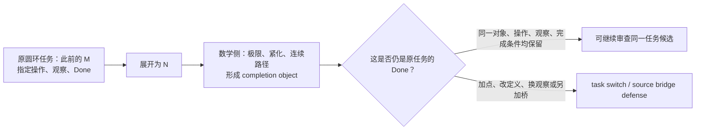

## User

开始


## Codex

我现在启动这条新线，名称暂定为 **ZFC-CIRCLE-Q0：极限对象存在与此前圆环复原之间的完成性断裂**。第一步不是证明它，而是把原圆环任务、ZFC 中具体的实数/极限版本、标准“芝诺已解决”回答，以及离散复原与新造圆两类控制冻结在同一张研究卡上。这样我们能检查的将是“极限是否完成原任务”，而不是泛泛地批评连续性。

## Codex

我现在把“圆环悖论—极限—ZFC”的想法作为一个**待检验的基础理论候选问题**来启动：先冻结“原圆环是否真的被复原”这个同一任务，再把实数、极限、商空间等标准数学回答拆开比较。目标不是预设 ZFC 存在形式矛盾，而是检查“极限对象存在”何时被不当地提升为“先前过程已经完成”。

## Codex

我已确认当前仓库中其实已有一条尚未启动的“芝诺／圆环 → 实数、数轴、极限与微积分连续框架”路线；它把问题明确写成“极限是否恢复原过程的完成，还是用定义宣布已到达”。这意味着这不是从零发明一个新靶，而是把你刚刚指出的 `Q0`，从路线图中的开放句子推进成可被标准数学回答、正负对照和来源逐项检验的候选。

## Codex

这一步属于本项目的研究型工作。我会按 `hott-local-session-governance`、`hott-paradox-research` 与 `hott-paradox-search-sop` 的研究证据边界执行：先把候选问题固定为可反驳的陈述，再找标准回答和同一任务控制；不会把“圆环悖论存在”直接写成“ZFC 已被证明矛盾”。

## Codex

圆环线已有很强的既有边界：仓库以前已经分别形式化或审计过“去点圆的同胚／补点／闭延拓”等较弱数学任务。它们不能回答你现在问的那个任务，因为它们证明的是**可以构造一个圆、或存在某种等价**，而不是“沿此前反向过程把那个先前的 \(M\) 复原了”。我会把这些已有正结果当作反控制，避免把它们误报成对 Q0 的回答。

## Codex

现在的材料把入口收紧成两层，而不是一句“ZFC 有矛盾”：  
1. **数学层**：Dedekind cut、Cauchy 等价、极限、紧化确实构造了一个对象；  
2. **完成层**：把这个对象当成“此前 \(M\) 已由反向过程复原”的判词，是否仍保留同一对象、允许操作、观察和 Done。  

下一步我会把这两层拆成一张冻结的 `ZFC-CIRCLE-Q0` 候选卡，并把已有的同胚、单点紧化和离散闭合分别作为控制。只有标准来源真的把第 1 层升级为第 2 层，才会形成值得继续锻打的 Q。

## Codex

我把这一轮定为 `RESEARCH_PROFILE_GOVERNED`，但范围很小：它不是重做全部 ZFC，也不是把圆环旧材料重新证明一遍。父决策只有一个——**“圆环是否能成为审视 ZFC 支撑的连续统／极限框架的真实 Q0 入口？”**  

当前只保留三条活跃判别线：

1. 标准连续统回答究竟承诺什么：实数构造、极限、紧化各自交付什么对象；
2. 原圆环的同一任务究竟要求什么：静态同胚、连续变形、端部闭合、来源／实际复原必须分开；
3. 哪些来源真的把第 1 条当作第 2 条的完成，哪些来源明确拒绝这一步。

已有的连续变形与闭参数延拓记录是强反控制：它迫使我们放弃“连续数学里根本无法从 N 到 M”的粗说法。真正要找的是**数学对象的构造何时被额外解释成原过程已经完成**。

## Codex

我现在得到一个会改变后续锻打的反控制：仓库已有的受限形式化记录中，确实存在一条连续曲线变形，且在 \(t=1\) 有明确末态；还有闭参数版本，端点在 \(t<1\) 保持分离、在 \(t=1\) 同像。  

所以“无论如何只能无限逼近，绝不相遇”不能再作为我们打 ZFC 的前提。下一轮我要让 Terra/Max 只读审查一张冻结来源卡：它必须判断这些标准来源究竟把数学 completion 说成了哪一种完成，还是已经明确把物理／过程桥留在数学之外。这个节点会检验 Q0，而不是替 Q0 预先宣布胜利。

## Codex

冻结卡和输入预检已经通过。我现在启动一个隔离的 Terra / Max `source-match` 节点：它只能看到四条固定来源事实和这张卡，不能读取项目、联网、写文件或调用工具。它的唯一任务是把“数学 completion”与“原过程 Done”是否被同一来源混同，按 P1／P2／P3-C 公开地分层说明。

## Codex

节点已自然结束：它确认了 Terra / Max、`max` 推理、只读权限、零工具、零文件改动、零审批请求，且没有按墙钟中断。接下来我会按轨迹审计合同读取它的公开终态和私有 wire，只核它实际看到了哪些冻结材料、做了什么输出；不会把它的隐藏推理当作证据。

## Codex

新的文献定位到了一个真正的分歧，而不只是我们自己的比喻：匹兹堡的 John Norton 明确把“完成”改写为“做完所有动作、但不要求不存在的最后一个动作”；Bathfield 与 Sierpińska 则分别指出，极限公式或 Weierstrass 定义可能只是把“是否到达／是否完成”的问题排出数学语言。  

这正是圆环线应当检验的地方。我会把这两种来源分成两个隔离节点，再让一个有界裁决节点只比较它们对 **Done 是否被改写** 的文本证据。

## Codex

两条并行来源节点都已结束，且结果并不只是“赞同”或“反对”：Norton 明确删除“最后一个动作”的 Done 条件；批评来源明确说极限定义会避开“是否到达”的问题。它们在数学对象上没有冲突，在**什么算完成**上有冲突。  

这已经满足动态 DAG 启动 Battle 的条件。我现在会让一个独立 Terra/Max 裁决节点只审这组来源事实，判断它们究竟是在讨论同一任务，还是各自定义了不同的 Done。

## Codex

Battle 已经把真正的分歧钉住了：Norton 的标准回应不是暗中算错极限，而是**明说改变完成条件**；Bathfield 和 Sierpińska 的批评也不是推翻极限数学，而是指出它没有替原来的“到达／终止”问题作决定。  

因此我们目前抓到的是一个严肃的“完成契约被替换”的问题，而不是 ZFC 的形式矛盾。更精确的下一步将是检查：原圆环所要求的 Done 是否已经被一个有明确 \(t=1\) 末态的连续模型满足，还是还包含来源、物理或操作条件。

## Codex

这轮的结论已经收敛到一个很具体、可反驳的位置：**极限理论不是偷偷给出了一个“最后一步”；它要么把完成定义改成“不需要最后一步”，要么把“是否到达”留在数学语言之外。**  

这让你的直觉有了学术上可对照的对象：真正要审的不是级数计算是否正确，而是这种完成定义的替换能否算作原圆环／运动任务的同一完成。所有节点、控制、失败的 preflight 和轨迹证据都已写入候选包；我现在做最后的范围检查并把这一个可审计工作单元精确提交。

## Codex

这一轮已经完成并提交为 `bf74e683`。我没有把别的工作者留下的 README、STATE、Claude 索引或未跟踪文件带进提交；提交只包含圆环 Q0 的来源、候选卡、P-DAG 节点／Battle 收据、路线图、Feature、ruling、当前记忆和完整的 T2 认知审计。

## Codex

## 已启动：圆环成为 ZFC 连续统线的第一张候选卡

我同意，**圆环是目前最有资格切入的地方**。不过这一轮把“ZFC 的问题”精确成了一个可以反驳、也不会误报为形式矛盾的问题：

> **当 ZFC 支撑的实数、极限、紧化或连续路径构造出一个完成对象时，什么同一任务内的桥允许它被说成“此前的圆环复原过程已经完成”？**

这不是 bare ZFC 的不一致性主张。真正被审视的是：

```text
ZFC 支撑的连续统／实数构造
        +
极限、紧化、连续路径的数学完成
        +
“这已经完成原运动／原复原”的解释桥
```

我将它命名为 **ZFC-CIRCLE-Q0**，并固定为 **Q-1 种子**：它已经具备明确理论位置、对象、反控制和可证伪问题，尚未成为 Q-2、Q-4 或“ZFC 已定位的问题”。完整卡在 [ZFC-CIRCLE-Q0 候选卡](/Volumes/D/HoTT_AI_HANDOFF_20260911/audit/20261003-ZFC-CIRCLE-Q0-连续统完成与圆环复原候选卡.md)。



## 这一轮真正发现了什么

### 1. 实数与连续统确实是 ZFC 的合理入口

集合论不是这里只是背景名词。SEP 将 Dedekind cut 列为集合论用于数学基础的典型例子，并说明 ZFC 在实践中居于主导地位；Dedekind／Cauchy 路线把实数作为 cuts 或等价类构造出来。也就是说，**实数和完备连续统本来就是 ZFC 所支撑的数学基础设施的一部分**。[SEP：Alternative Axiomatic Set Theories](https://plato.stanford.edu/entries/settheory-alternative/)，[SEP：Dedekind’s Contributions to the Foundations of Mathematics](https://plato.stanford.edu/entries/dedekind-foundations/)

Tao 对一点紧化的说明尤其适合圆环：实线可视为去掉一点的圆，加入该点得到一点紧化；同一空间还能有多种紧化。这清楚显示“完成”常常是**添加或构造一个对象**，它本身不等于“先前那段过程已经复原”。[Tao：Compactness and Compactification](https://www.math.ucla.edu/~tao/preprints/compactness.pdf)

### 2. 你指出的不是孤立直觉，学界里确有同一争点

SEP 把“现代数学解决芝诺”称为 received view，但同时明确：单有数学框架不足以回答实际空间、时间与运动，框架是否适合物理对象需要另行判断。[SEP：Zeno’s Paradoxes](https://plato.stanford.edu/archives/sum2024/entries/paradox-zeno/)

更尖锐的是，John Norton 的标准回应明确把完成条件由“做完所有动作，**包括最后一个动作**”改为“做完所有动作，**不要求最后一个动作**”，并用连续时间中的 \(1/2,3/4,7/8,\ldots\) 赋时说明这种读法。[Norton：Zeno’s Paradoxes of Motion](https://sites.pitt.edu/~jdnorton/teaching/paradox/chapters/Zeno/Zeno.html)

Bathfield 则批评“几何级数收敛”本身没有给一个顺序 supertask 的终止操作；Sierpińska 也将 Weierstrass 的 ε–N 定义与“序列是否达到极限”分开，指出形式化可能把后一问题移出数学语言。[Bathfield 2018](https://philsci-archive.pitt.edu/16355/)，[Sierpińska 1990](https://flm-journal.org/Articles/43489F40454C8B2E06F334CC13CCA8.pdf)

因此，现在已被钉住的不是“极限算错了”，而是下面这组三种 Done 可能根本不是同一个任务：

| 完成标准 | 说的是什么 | 当前来源如何对待 |
|---|---|---|
| `Done_formal` | 数列收敛、级数有和、极限对象存在 | 标准分析的精确数学结论。 |
| `Done_revised` | 所有列出的动作都发生，不要求一个不存在的最后动作 | Norton 的显式回应。 |
| `Done_strict` / `Done_origin` | 原过程有一个精确复原／终止，且保持原 \(M\)、允许操作、观察和必要的来源或现实条件 | 圆环原案真正要求澄清的契约。 |

这就是“圆环复活芝诺幽灵”在本轮变得可审计的形式：**标准回答不是证明原 Done 自动达成，而是可能明确采用另一种 Done。**

## 一个必须接受的强反控制

我们不能再说“连续数学中，\(N\) 无论如何都不可能在有限时刻成为 \(M\)”。仓库已有 C-269/C-272 的范围内记录：存在一个在闭时间区间上定义的连续曲线嵌入变形，初态像为 `lineOpen`，末态像精确为 `circleOpen`；端点距离在 \(t<1\) 为正、\(t=1\) 为零。该旧记录本轮没有重跑，所以我把它只作为来源报告的控制，但它足以否定任何更宽的“不可能到达”叙述。[C-269/C-272 证据矩阵定位](/Volumes/D/HoTT_AI_HANDOFF_20260911/HoTT/CLAIM_EVIDENCE_MATRIX.md:1124)

这不是削弱圆环方向，反而使它更锋利：

- **不能攻击**“所有连续模型都不能出现末态”；
- **可以检验**“某个数学末态、极限或紧化为什么能算作原过程的末态”；
- 若要说它仍不算，必须明确究竟缺的是来源保持、物理操作、材料条件、离散终步、指定缺失点，还是别的 Done 字段，不能在正构造出现后临时补条件。

## Terra / Max 动态 DAG 的结果

我按项目限定授权启动了四个隔离节点和一个修复重跑。它们全部是 gpt-5.6-terra / max、只读、禁网、零工具、零文件改动、零审批请求；private App Server wire 只作轨迹审计，不公开隐藏 reasoning。

| 节点 | 作用 | 有界结果 |
|---|---|---|
| H076 | SEP、Dedekind、Tao 与既有曲线控制 | 数学 completion 存在，但首批来源没有给原 Done 的 C-lane consumer。 |
| H077 | Norton | 找到真实 completion contract；它**明确**把 `Done_strict` 改成 `Done_revised`。 |
| H078 | Bathfield + Sierpińska | 找到 formal limit / reaching 分层的批评来源；不是 ZFC 矛盾。 |
| H079 | Battle 首次 preflight | marker 不精确，采样前失败；保留为输入合同失败。 |
| H080 | 修复后的 Battle | 裁决为“来源任务契约分叉”：来源争的是完成契约／解释桥，不是数学事实。 |

完整可复核记录在 [H076 来源匹配](/Volumes/D/HoTT_AI_HANDOFF_20260911/audit/20261003-P-DAG-ZFC-CIRCLE-076-Terra-Max.md) 与 [H077–H080 来源 Battle](/Volumes/D/HoTT_AI_HANDOFF_20260911/audit/20261003-P-DAG-ZFC-CIRCLE-077-080-Terra-Max.md)。

## 现在的状态

```text
FND-CONTINUUM-004              = 用户选定的候选资格化入口
ZFC-CIRCLE-Q0                  = Q-1_SEED
P1                             = F-lane + 一个“明确换Done”的C-lane控制
P2                             = NOT_APPLICABLE（没有被强造为罗素式再入）
P3-C                           = 数学构造与原过程之间的 bridge 仍待逐项核验
Q-2 / Q-3 / Q-4               = 未达到
Power Set station              = STATION_EXIT_REVIEW_PENDING，未自动换站
ZFC inconsistency / UR / P4    = 均未主张
```

这意味着：我们已经找到了一个**真正的理论—过程张力位置**，并找到它在学术来源中的正反双方；但它尚不是“ZFC 已被打出一个内部洞”。它目前更准确地属于 **ZFC 支撑的连续统如何被解释为现实／过程完成** 的候选问题。

## 已落盘与验证

- 用户的本轮原话已保存为 [一手来源](/Volumes/D/HoTT_AI_HANDOFF_20260911/sources/prompts/Codex-ZFC圆环与极限完成桥-用户原文-20261003.md)，并写入 ruling、F-045、路线图与当前记忆。
- 候选、来源、NodeCard、prompt、Battle、轨迹边界和下一步都在 [审计入口](/Volumes/D/HoTT_AI_HANDOFF_20260911/audit/README.md) 可发现。
- 本轮 T2 认知审计逐条覆盖了 62 条核心认知，见 [Session 审计](/Volumes/D/HoTT_AI_HANDOFF_20260911/.codex/research/hott/sessions/S-RES-20261003-ZFC-CIRCLE-Q0/CORE_COGNITION_AUDIT.md)。
- 已通过分片结构校验、Pattern-P 来源校验、RUNS.json JSON 校验、62/62 KC 覆盖检查和本工作单元的 scoped git diff --check。
- 精确路径已提交到 `dev`：`bf74e683`（`research: qualify ZFC circle completion candidate`）；没有 push。
- 工作树中原有的 `.claude/`、`STATE.json`、README 投影、其它 `dev-notes` 等未提交变化保持原样，未被本提交带入。

后续最小行动已经很明确：只找一个**版本固定、同时写明原 \(M\)、允许操作、观察和 Done 的来源**。它若把 formal completion 无条件称为同一任务的完成，Q0 才能进入下一轮；它若像 Norton 一样明确改 Done，或像 SEP 一样保留桥接条件，就应成为新的范围内防御，而不是被硬说成 ZFC 的问题。

### Files changed in this reply

- `/Volumes/D/HoTT_AI_HANDOFF_20260911/MEMORY/001 - 当前执行队列.md` — 修改
- `/Volumes/D/HoTT_AI_HANDOFF_20260911/audit/20261003-ZFC-CIRCLE-Q0-连续统完成与圆环复原候选卡.md` — 新增
- `/Volumes/D/HoTT_AI_HANDOFF_20260911/dev-docs/README.md` — 修改
- `/Volumes/D/HoTT_AI_HANDOFF_20260911/dev-docs/菲尔兹奖后续理论级目标路线图/004 - 理论级候选地图.md` — 修改
- `/Volumes/D/HoTT_AI_HANDOFF_20260911/feature-list.md` — 修改
- `/Volumes/D/HoTT_AI_HANDOFF_20260911/rulings.md` — 修改
- `/Volumes/D/HoTT_AI_HANDOFF_20260911/sources/prompts/Codex-ZFC圆环与极限完成桥-用户原文-20261003.md` — 新增
- `/Volumes/D/HoTT_AI_HANDOFF_20260911/audit/20261003-ZFC-CIRCLE-Q0-连续统完成与圆环复原候选卡.md` — 修改
- `/Volumes/D/HoTT_AI_HANDOFF_20260911/audit/20261003-P-DAG-ZFC-CIRCLE-076-NODECARD.md` — 新增
- `/Volumes/D/HoTT_AI_HANDOFF_20260911/audit/20261003-P-DAG-ZFC-CIRCLE-076-PROMPT.md` — 新增
- `/Volumes/D/HoTT_AI_HANDOFF_20260911/audit/20261003-P-DAG-ZFC-CIRCLE-076-Terra-Max.md` — 新增
- `/Volumes/D/HoTT_AI_HANDOFF_20260911/dev-docs/模式P三把刀/004 - 打造过程与横向比较.md` — 修改
- `/Volumes/D/HoTT_AI_HANDOFF_20260911/audit/README.md` — 修改
- `/Volumes/D/HoTT_AI_HANDOFF_20260911/audit/20261003-P-DAG-ZFC-CIRCLE-077-NODECARD.md` — 新增
- `/Volumes/D/HoTT_AI_HANDOFF_20260911/audit/20261003-P-DAG-ZFC-CIRCLE-077-PROMPT.md` — 新增
- `/Volumes/D/HoTT_AI_HANDOFF_20260911/audit/20261003-P-DAG-ZFC-CIRCLE-078-NODECARD.md` — 新增
- `/Volumes/D/HoTT_AI_HANDOFF_20260911/audit/20261003-P-DAG-ZFC-CIRCLE-078-PROMPT.md` — 新增
- `/Volumes/D/HoTT_AI_HANDOFF_20260911/audit/20261003-P-DAG-ZFC-CIRCLE-079-NODECARD.md` — 新增
- `/Volumes/D/HoTT_AI_HANDOFF_20260911/audit/20261003-P-DAG-ZFC-CIRCLE-079-PROMPT.md` — 新增
- `/Volumes/D/HoTT_AI_HANDOFF_20260911/audit/20261003-P-DAG-ZFC-CIRCLE-079-NODECARD.md` — 修改
- `/Volumes/D/HoTT_AI_HANDOFF_20260911/audit/20261003-P-DAG-ZFC-CIRCLE-080-NODECARD.md` — 新增
- `/Volumes/D/HoTT_AI_HANDOFF_20260911/audit/20261003-P-DAG-ZFC-CIRCLE-080-PROMPT.md` — 新增
- `/Volumes/D/HoTT_AI_HANDOFF_20260911/audit/20261003-P-DAG-ZFC-CIRCLE-077-080-Terra-Max.md` — 新增
- `/Volumes/D/HoTT_AI_HANDOFF_20260911/dev-docs/模式P三把刀/009 - ZFC共同锻造与成功判据.md` — 修改
- `/Volumes/D/HoTT_AI_HANDOFF_20260911/audit/20261003-P-DAG-ZFC-CIRCLE-077-080-Terra-Max.md` — 修改
- `/Volumes/D/HoTT_AI_HANDOFF_20260911/.codex/research/hott/sessions/S-RES-20261003-ZFC-CIRCLE-Q0/CORE_COGNITION_AUDIT.md` — 新增
- `/Volumes/D/HoTT_AI_HANDOFF_20260911/.codex/research/hott/sessions/S-RES-20261003-ZFC-CIRCLE-Q0/RUNS.json` — 新增
- `/Volumes/D/HoTT_AI_HANDOFF_20260911/.codex/research/hott/sessions/S-RES-20261003-ZFC-CIRCLE-Q0/SESSION.md` — 新增
- `/Volumes/D/HoTT_AI_HANDOFF_20260911/.codex/research/hott/sessions/S-RES-20261003-ZFC-CIRCLE-Q0/CORE_COGNITION_AUDIT/001 - 核心认知逐项回评.md` — 新增
- `/Volumes/D/HoTT_AI_HANDOFF_20260911/.codex/research/hott/sessions/S-RES-20261003-ZFC-CIRCLE-Q0/CORE_COGNITION_AUDIT/002 - 扩展认知逐片回评.md` — 新增
- `/Volumes/D/HoTT_AI_HANDOFF_20260911/.codex/research/hott/sessions/S-RES-20261003-ZFC-CIRCLE-Q0/CORE_COGNITION_AUDIT/003 - 已走过的路与语义对齐.md` — 新增
- `/Volumes/D/HoTT_AI_HANDOFF_20260911/.codex/research/hott/sessions/S-RES-20261003-ZFC-CIRCLE-Q0/CORE_COGNITION_AUDIT/004 - 即将作出的选择与反证条件.md` — 新增
- `/Volumes/D/HoTT_AI_HANDOFF_20260911/.codex/research/hott/sessions/S-RES-20261003-ZFC-CIRCLE-Q0/SESSION.md` — 修改
- `/Volumes/D/HoTT_AI_HANDOFF_20260911/dev-notes/.dev-notes-skill-stage/stage-cd755c7e145742a59677f47727933411/prompt.md` — 修改
- `/Volumes/D/HoTT_AI_HANDOFF_20260911/dev-notes/.dev-notes-skill-stage/stage-cd755c7e145742a59677f47727933411/answer.md` — 修改
