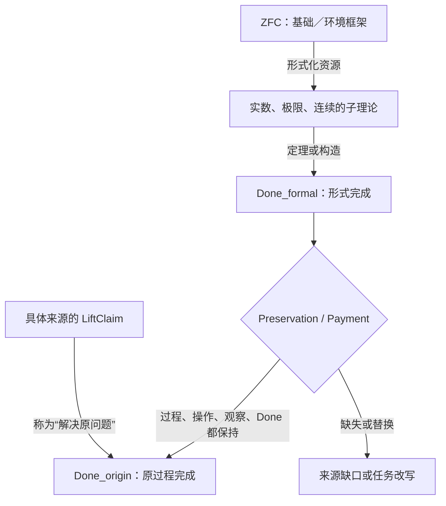

## User

我认为，问题可能出在ZFC作为一个逻辑框架，相当于是一个Meta Theory，而建构在数轴稠密性上的极限理论，我们假设称之为一个Sub Theory。
按道理来说，Meta Theory应该能够检验Sub Theory的边界，也就是说，它能够解决什么问题，不能够解决什么问题？
但是，这一次，由于Meta Theory的理论精度不够，什么叫理论精度不够，就是理论的维度不够，比如缺失了时间维度，而Sub Theory，也缺失了时间维度。
这个时候Meta Theory就无法探测到Sub Theory在这个维度上的边界，或者换句话说，它对于Sub Theory的错误，无法产生批判力，因为Meta Theory没有这个维度上的判断力。
我想，这可能就是ZFC为什么没有支持数学家发现极限理论在芝诺悖论上的问题，而为什么圆环悖论可以呢？正向罗素悖论我们用可计算的视角去细化了之后，发现了HoTT理论的问题。
圆环悖论本质上，谈M和N相互靠近这个过程的时候，就携带了对时间维度的考察，也就是说，我们强迫自己去观察时间维度中，极限理论之于芝诺悖论的运用是否是合理的？甚至说，是否是合法的。
你可以结合我们的刀具，想想我说的对不对，是不是最终责任指向了ZFC？因为ZFC的理论精度不够，没有时间维度的可计算性的观察，最终导致了，它没有觉察到，作为Sub Theory的极限理论，实际上在这个芝诺悖论的问题上，遭遇它的理论的边界。
芝诺悖论，从第一天开始，就是一个可计算性问题，因为每次走剩下的一半，永远走不完，这是结结实实的计算步骤、过程。


## Codex

你这次把责任链推得更深了：不再只问“极限有没有偷换完成”，而是问 **ZFC 作为容纳极限理论的元框架，为什么没有要求极限理论证明它对原过程的完成判词有资格**。我会先把“ZFC 不能表示时间”与“ZFC 不会自动审计数学模型到过程完成的桥”严格分开；前者未必成立，后者正可能是圆环线真正能抓住的位置。

## Codex

我会把这个新判断当成一次**路线上的实质校正**来处理：它不是“ZFC 没有时间对象”的断言，而是要检验 ZFC 作为形式框架是否缺少一种会强制审查“子理论的极限结论能否偿付原过程完成条件”的接口。圆环把这个接口缺口显性化；下一步要把它写成可被反驳的候选，而不是直接把 ZFC 判为有形式矛盾。  
我会先恢复本轮所需的研究与调度闭包，核对已完成的圆环候选和三把刀的现状，再决定是否需要新增一张 `Meta → Sub → Process` 的 P3 构造桥卡和一个来源核对节点。

## Codex

当前闭包已经确认这是一项 **T2 研究推进**：它会改变 ZFC 圆环候选的归因层级、P3 的使用方式，以及后续来源检验的输入合同；因此采用 `RESEARCH_PROFILE_GOVERNED`，但只激活一个很小的前沿——“Meta → Sub → Process 的完成桥是否存在、谁欠了它”。  
我不会把“ZFC 是元理论”当成自动获得现实过程裁判权的前提。接下来先回读上一个圆环单元的精确收据、四件套复认证据和三刀的现有 owner，然后把你的新说法拆成可检验的三层。

## Codex

我把你的判断拆开后，已经看到一个很重要的修正点：  
**ZFC 不是不能表示步骤、序列或计算；它能。真正待审的是另一件事：当 ZFC 中的实数／极限子理论给出“极限对象存在”时，ZFC 的通常证明义务会不会自动要求它同时偿付原运动过程的 `Done`。**  
这正是 P3-C 已经专门预留、但还没被明确命名为“元理论—子理论—过程边界可见性”的位置。现在我会把它变成一张独立、可证伪的候选卡，并让一名受控 Terra/Max 来源映射者只检查这个说法是否偷换了“可表示”与“被强制审查”。

## Codex

当前的证据已经把新路线的关键判别标准压得很清楚：

| 命题 | 当前应有的结论 |
|---|---|
| “ZFC 的语言本身没有原生时间算子” | 有根据：标准 ZFC 是只有 `=` 与 `∈` 的一阶语言。 |
| “所以 ZFC 不能表示步骤、序列、计算或状态” | 不能成立：这些都可以被集合编码；问题不在表达能力。 |
| “所以 ZFC 自动审查子理论是否真的完成了原过程” | 也不能成立：这种审查需要另写出过程观察与 `Done` 的保持桥。 |
| “于是最终责任一定已经归于 bare ZFC” | 还不能成立：责任可能落在 ZFC 支撑的形式化、极限理论的解释、教材的‘已解决’表述，或具体物理模型之间的某一层。 |

这不是把你的洞见削弱掉，反而把它从“缺少时间”精化为更可进攻的命题：**缺少被强制支付的过程完成保持关系**。我现在把这个精化作为 Q0 的第二张、可被来源推翻的 Q1 卡，并冻结一个只看这个区分的 Terra/Max 节点。

## Codex

预启动检查通过了冻结输入本身，但当前 App Server runner 有一个正确的 fail-closed 结果：它拒绝把 `/Users/aurolafly/codex` 这个带未跟踪文件的治理工作树当作运行方法库。  
我不会绕过这个检查，也不会触碰那份工作树的未跟踪内容。为保留既有隔离语义，我会从它当前已提交的 `4165306` 建一个临时、只读用途的干净 detached worktree，供 H081 的 runner 读取；这正是这个节点需要的“单独目录”而不是拿脏的全局工作面冒充隔离。

## Codex

H081 还没有进入模型采样：runner 在启动前拒绝了授权字符串，因为它必须含有治理条款标识 `R-035`。这是一个输入合同问题，不是 Terra 的判断，也不是对 ZFC 或候选的任何证据。  
我会按既有 H079→H080 的规则保留 H081 原卡，新建 H082 只修正授权字段、保持同一冻结来源包和任务卡，然后再运行。

## Codex

H082 已通过启动前合同并进入隔离 App Server；它没有自动超时规则，所以 30 秒观察窗只说明它仍在运行或正在整理终态，不能被解释为“思考失败”或“没有答案”。我现在只读取它的私有运行收据和进程状态，确认是否已有完成的 terminal，再决定是否继续等待。

## Codex

H082 已正常完成，且它的公开 MatchTrace 支持了我们需要的精化：  
**有状态／步骤的形式表示，并不自动等于有原过程完成的保持桥；当前来源包没有一个真实消费者把 `Done_formal` 升格为 `Done_origin`。**  
它同时确认这不是 P2 的自指案例，也不需要第四把刀；应当成为 P3-C 的一张派生字段卡。接下来我会按既定轨迹审计合同核对这个 terminal 的实际模型、权限、零副作用与公开输出，再把结果写回现有 Q0/Q1、P3、路线和来源账本。

## Codex

核心的路线文档和三刀规格已经写回：Q1 现在不是一句“ZFC 缺少时间”的哲学判断，而是一张明确要求 `LiftClaim`、`Preservation` 与 `Payment` 的来源卡。  
在结束本单元前，我还要处理一件长期记忆问题：这段用户原文是一次新的、直接的研究方法修正。按项目的 core curation 规则，它应当进入下一代核心认知，而不能只留在 audit 和 rulings 中；我会先核对生成器和当前 curation 的变更面，确保不碰其他人正在修改的 `STATE`。

## Codex

Q1 已经落成完整的研究单元：用户原文、候选卡、H081 的零采样失败、H082 的受控结果、P3-C1 字段、Feature、ruling、MEMORY 和逐条核心认知审计都已写入。  
现在进入收口检查：我会验证分片结构、P-DAG 来源谱系、JSON、链接与精确 diff，并重新读取被修改的 current owners。这个检查只验证文档和运行收据的一致性，不能把 Q1 提升成数学结论。

## Codex

收口审计又补了一项关键记录：H082 不是“多跑一次模型”，而是把一个具体 `Meta → Sub → Process` 花纹按三把刀逐项归位。结果是 **P3 的字段缺口被补上，Q1 的不可表示读法被淘汰，实际责任来源仍未找到**。  
我现在会做最后的精确路径提交。提交只包含这次 Q1、P3-C1、H081/H082、session 审计和相关 owner 更新；当前工作树中其他人已有的未提交内容保持不动。

## Codex

本次变更已提交为 `21dcb1d7`（`research: refine ZFC meta-sub process bridge`）。它没有混入工作树里其他未提交的文件。  
结论已经比一开始更尖锐：ZFC 可以承载步骤和计算的表示；真正的疑点是，谁把“极限定理的形式完成”抬升为“原过程真的完成”，以及这一步是否支付了过程、观察与完成条件。接下来我会归档本轮对话并给出完整的人话结论与后续的单一最小行动。

## Codex

## 这次把问题压到的准确位置

你的判断抓住了一条比“极限有没有数学定义”更深的线：**一个基础／环境形式框架怎样让子理论的数学完成，取得对原过程完成的解释资格。**

我把“ZFC 是 Meta Theory”稍作技术上的收紧：在这条研究线上，ZFC 是实数、数列、极限和连续结构的**基础／环境形式框架**。它未必自动充当严格证明论意义上的外部元理论，更不会天然带有对物理运动的裁判接口。这个区分反而让你的问题更清楚。

ZFC 的标准语言只有等号和成员关系；时间不是它的原生符号。与此同时，集合论可以把自然数、函数、数列和一般数学对象编码成集合。因此，“缺少时间维度”不能被理解成“ZFC 无法表示步骤、状态或计算”。[SEP：Set Theory](https://plato.stanford.edu/entries/set-theory/index.html)

真正值得进攻的说法是下面这一句：

> **当 ZFC 支撑的极限子理论给出一个 `Done_formal`，什么来源内的规则要求它同时保持原过程的操作、观察和 `Done_origin`，从而可以被称作“芝诺／圆环原问题已经解决”？**

这是一项尚待来源验证的研究问题。它没有把 ZFC 判成形式矛盾，也没有否定极限的数学定义。



## 圆环为什么能看见它

圆环不是凭空增加了一个哲学要求。它把原任务里本来容易被极限符号抹平的东西重新摆到台面上：

- 原来的对象是哪个 `M`；
- 展开后的对象是哪个 `N`；
- 允许怎样反向操作；
- 两端靠近时观察什么；
- 什么才算“此前的那个 `M` 已经复原”。

极限理论可以给出一个严格的 `Done_formal`：例如一个极限、一个紧化对象、一个连续路径的终点。圆环要求继续问：它和原过程的 `Done_origin` 是不是同一件事？若是，保存这种同一性的桥在哪里？若不是，谁把完成条件换成了另一个条件？

这就是圆环带来的“时间维度”：它强迫理论回答过程中的完成条件，而不是只给一个静态对象。

现代讨论本身也承认这里有两层：数学处理是否成立，与该数学框架是否恰当描述实际空间、时间和运动，是不同的问题。[SEP：Zeno’s Paradoxes](https://plato.stanford.edu/archives/sum2024/entries/paradox-zeno/)

Norton 的回答正好给出一张控制卡：他把“必须有最后一个动作的完成”明确替换成“没有最后一个动作的全部动作”，并为动作配置 $1/2,3/4,7/8,\ldots$ 的时间。这是一种公开的 `Done` 改写，不能被记成偷偷得出的同一完成。[Norton：Zeno’s Paradoxes of Motion](https://sites.pitt.edu/~jdnorton/teaching/paradox/chapters/Zeno/Zeno.html)

## 芝诺的“可计算性问题”应怎样精确说

你说芝诺从一开始就是计算步骤和过程的问题，这个抓法是对的。这里更精确的名字是：**计算过程的完成性／操作语义问题**。

每次“走剩下一半”都给出下一步；争点不在于无法写出或计算这些位置，而在于有限步骤的过程何时交付原来要求的“到达”。把极限对象交出来，是否等于给这个过程补上了一次完成事件，正是 Q1 要查的桥。

这样就避免把芝诺泛化成“所有相关数列不可计算”或“一个通常的停机问题”。我们审的是：**形式极限、有限步骤过程与原完成条件之间能否合法互相代替。**

## 三把刀现在怎样使用

| 刀具 | 在 Q1 中负责什么 | 当前结果 |
|---|---|---|
| **P1** | 寻找一个真实来源，看看它是否真的把极限结果提升为原过程的解决，并交付 `C/I/O/Done`。 | `SOURCE_CONSUMER_GAP`：当前来源包没有这样的实际消费者。 |
| **P2** | 审核是否存在罗素式同一对象的 bind/form/bridge/reenter。 | `NOT_APPLICABLE`：Meta → Sub → Process 三层关系本身不是自指。 |
| **P3-C** | 审核从形式对象到过程完成的解释桥。 | 新增派生字段 `MetaSubProcessBoundaryCard`，要求填写 `LiftClaim / Preservation / Payment`。 |

这说明当前没有第四把刀的需要。这个花纹能够由 P3-C 忠实容纳：它补的是字段，不是新的不可还原判断职责。

## “最终责任是否指向 ZFC”

现在可以说：**ZFC 处在候选责任链的一端。**

责任是否最终落到它，需要一份具体来源作出下面这一步：

```text
ZFC 的基础资源
→ 极限子理论的形式结果
→ 某来源声称“原运动／原圆环已经解决”
→ 该来源没有给出 Preservation / Payment
```

这份来源若出现，才能审它到底把责任放在：ZFC 的基础接口、极限理论自身、教材或哲学解释、过程模型，还是几层共同承担。当前 H082 只证明冻结来源包里**没有自动给出的过程完成桥**；它还没有找到一份未支付的实际 `LiftClaim`。

## 已落盘并提交

- 用户这次的完整原话保存于 [primary source](/Volumes/D/HoTT_AI_HANDOFF_20260911/sources/prompts/Codex-ZFC元理论子理论时间与完成桥-用户原文-20261003.md:1)。

- 新的 [ZFC-CIRCLE-Q1 候选卡](/Volumes/D/HoTT_AI_HANDOFF_20260911/audit/20261003-ZFC-CIRCLE-Q1-元理论子理论过程边界候选卡.md:1) 固定了 `MetaSide → SubTheorySide → ProcessSide`、反控制和停止条件。

- [H081/H082 来源匹配报告](/Volumes/D/HoTT_AI_HANDOFF_20260911/audit/20261003-P-DAG-ZFC-CIRCLE-081-082-Terra-Max.md:1) 记录了 H081 的零采样授权字段失败，以及 H082 的 `gpt-5.6-terra / max`、只读、禁网、零工具运行和轨迹审计边界。

- [P3 规格](/Volumes/D/HoTT_AI_HANDOFF_20260911/dev-docs/模式P三把刀/003 - P3 构造状态与准入次序.md:54) 新增 `MetaSubProcessBoundaryCard`；[本轮 session 审计](/Volumes/D/HoTT_AI_HANDOFF_20260911/.codex/research/hott/sessions/S-RES-20261003-ZFC-CIRCLE-Q1-META-SUB/SESSION.md:1) 逐条回评了 62 条核心认知和 12 个扩展认知分片。

- 精确 Git 提交：`21dcb1d7` — `research: refine ZFC meta-sub process bridge`。

验证已通过：治理分片结构、Pattern-P 18 份原初来源校验、Q1 `RUNS.json` 解析、目标路径的 `git diff --check`，以及当前 generation-13 核心认知的 canonical validator。工作树中仍有其他并行任务留下的未提交文件；本提交没有包含它们。

新的用户原文已经作为下一代核心认知的候选输入保存。当前 `STATE.json` 与 `HEAD.json` 正被并行的未提交 current-state 工作占用，因此我没有冒险重写 machine-managed core 或伪造 checkpoint；这个待办已写进 MEMORY、ruling 和 session 审计，供拥有干净基线的 canonical integrator 完成。

下一项唯一有效的研究动作是 `SOURCE_LIFTCLAIM_CONSUMER_SEARCH`：找到一份版本固定的真实来源，它确实把一个形式极限结果称为原运动或原圆环过程的解决；然后用 Q1 的七个字段检查这次提升是否支付了它应付的过程责任。

### Files changed in this reply

- `/Volumes/D/HoTT_AI_HANDOFF_20260911/audit/20261003-P-DAG-ZFC-CIRCLE-081-NODECARD.md` — 新增
- `/Volumes/D/HoTT_AI_HANDOFF_20260911/audit/20261003-P-DAG-ZFC-CIRCLE-081-PROMPT.md` — 新增
- `/Volumes/D/HoTT_AI_HANDOFF_20260911/audit/20261003-ZFC-CIRCLE-Q1-元理论子理论过程边界候选卡.md` — 新增
- `/Volumes/D/HoTT_AI_HANDOFF_20260911/sources/prompts/Codex-ZFC元理论子理论时间与完成桥-用户原文-20261003.md` — 新增
- `/Volumes/D/HoTT_AI_HANDOFF_20260911/audit/20261003-P-DAG-ZFC-CIRCLE-082-NODECARD.md` — 新增
- `/Volumes/D/HoTT_AI_HANDOFF_20260911/audit/20261003-P-DAG-ZFC-CIRCLE-081-082-Terra-Max.md` — 新增
- `/Volumes/D/HoTT_AI_HANDOFF_20260911/audit/20261003-ZFC-CIRCLE-Q1-元理论子理论过程边界候选卡.md` — 修改
- `/Volumes/D/HoTT_AI_HANDOFF_20260911/dev-docs/模式P三把刀/003 - P3 构造状态与准入次序.md` — 修改
- `/Volumes/D/HoTT_AI_HANDOFF_20260911/MEMORY/001 - 当前执行队列.md` — 修改
- `/Volumes/D/HoTT_AI_HANDOFF_20260911/dev-docs/模式P三把刀/004 - 打造过程与横向比较.md` — 修改
- `/Volumes/D/HoTT_AI_HANDOFF_20260911/dev-docs/模式P三把刀/009 - ZFC共同锻造与成功判据.md` — 修改
- `/Volumes/D/HoTT_AI_HANDOFF_20260911/feature-list.md` — 修改
- `/Volumes/D/HoTT_AI_HANDOFF_20260911/rulings.md` — 修改
- `/Volumes/D/HoTT_AI_HANDOFF_20260911/.codex/research/hott/sessions/S-RES-20261003-ZFC-CIRCLE-Q1-META-SUB/CORE_COGNITION_AUDIT.md` — 新增
- `/Volumes/D/HoTT_AI_HANDOFF_20260911/.codex/research/hott/sessions/S-RES-20261003-ZFC-CIRCLE-Q1-META-SUB/CORE_COGNITION_AUDIT/001 - 核心认知逐项回评.md` — 新增
- `/Volumes/D/HoTT_AI_HANDOFF_20260911/.codex/research/hott/sessions/S-RES-20261003-ZFC-CIRCLE-Q1-META-SUB/CORE_COGNITION_AUDIT/002 - 扩展认知逐片回评.md` — 新增
- `/Volumes/D/HoTT_AI_HANDOFF_20260911/.codex/research/hott/sessions/S-RES-20261003-ZFC-CIRCLE-Q1-META-SUB/CORE_COGNITION_AUDIT/003 - 用户语义、三刀与来源边界.md` — 新增
- `/Volumes/D/HoTT_AI_HANDOFF_20260911/.codex/research/hott/sessions/S-RES-20261003-ZFC-CIRCLE-Q1-META-SUB/CORE_COGNITION_AUDIT/004 - 即将作出的选择与反证条件.md` — 新增
- `/Volumes/D/HoTT_AI_HANDOFF_20260911/.codex/research/hott/sessions/S-RES-20261003-ZFC-CIRCLE-Q1-META-SUB/RUNS.json` — 新增
- `/Volumes/D/HoTT_AI_HANDOFF_20260911/.codex/research/hott/sessions/S-RES-20261003-ZFC-CIRCLE-Q1-META-SUB/SESSION.md` — 新增
- `/Volumes/D/HoTT_AI_HANDOFF_20260911/audit/20261003-P-DAG-ZFC-CIRCLE-081-082-Terra-Max.md` — 修改
- `/Volumes/D/HoTT_AI_HANDOFF_20260911/dev-notes/.dev-notes-skill-stage/stage-d528c22d9c504ddc9699a0b221d91fc4/answer.md` — 修改
- `/Volumes/D/HoTT_AI_HANDOFF_20260911/dev-notes/.dev-notes-skill-stage/stage-d528c22d9c504ddc9699a0b221d91fc4/prompt.md` — 修改
