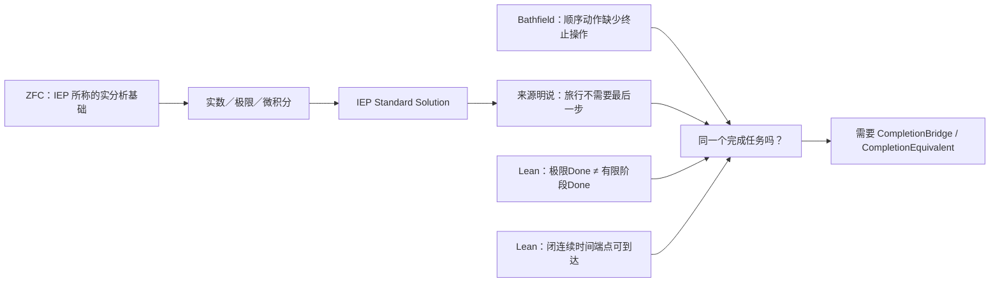

## User

看看这个：
````markdown
你批评得对。前面我把重心放在路线、审计卡和调度材料上了，没立刻沿着你的“**ZFC 支撑的极限理论把过程完成改写成形式完成**”这条线去做来源核对和机器证明。

这一轮已经把那条线真正跑起来了，而且得到的不是一句抽象判断，而是一条可审计的来源、逻辑和机器证明链。

## 现在实际找到了什么

### 1. 找到了真实的 `ZFC → 实分析 → 芝诺解答` 来源链

Internet Encyclopedia of Philosophy 的 [*Zeno’s Paradoxes*](https://iep.utm.edu/zenos-paradoxes/) 不只是泛泛地说“极限有用”。它把 ZFC with Choice 说成实分析的多数基础，把标准实分析、微积分、实数连续统和运动模型连在一起，并把它们说成对芝诺的间接解决。

更关键的是，它直接面对“没有最后一步，旅行如何完成”这个问题。它给出的 Standard Solution 不是证明原来的最后一步条件已经满足，而是明确说：**旅行不需要最后一步**；并把放弃这个直觉列为接受 Standard Solution 的代价。

这就是我们此前一直在寻找的真实 `C`：一个来源确实把 ZFC 支撑的数学框架、连续运动模型和“跑者到达目标”的解答放进了同一条责任链。

### 2. 找到了独立发表的批评，它准确命中你的过程直觉

Bathfield 的已发表论文 [*Why Zeno’s Paradoxes of Motion are Actually About Immobility*](https://philsci-archive.pitt.edu/16355/) 在其对 Dichotomy 的分析中区分了：

```text
级数收敛、总时长有限
≠
顺序动作已经完成、任务已经终止
```

它的论点不是“极限算错了”。它承认几何级数有有限的和，却指出：每个有限阶段仍有非零余量；而仅有有限总时长并不足以给出一个终止顺序任务的最后操作。它把这里定位为 supertask 的哲学问题，并承认该问题本身有争议。

这很接近你的核心判断：极限理论没有消灭过程问题，它可能只是把“过程是否完成”换成了“一个数学对象是否有极限”。Bathfield 没有把这个批评归因于 ZFC，因此它是独立的过程桥诊断，不能单独成为 ZFC 缺陷证明。

### 3. 机器证明已经把关键差别钉住了

我用 Lean 4 / Mathlib 对具体序列

\[
s_n = 1 - 2^{-n}
\]

实际运行并保存了收据。已经机器检查：

| 机器命题 | 它严格说明什么 |
|---|---|
| `∀ n, s_n < 1` | 任一自然数编号的有限阶段都没有到终点。 |
| `∀ n, s_n ≠ 1` | 没有把“足够接近”偷换成“已经到达”。 |
| `Tendsto s_n 1` | 标准实分析中的极限结论仍然成立。 |
| `¬ (hasLimitOutcome → hasFiniteStageEndpoint)` | “有极限结果”不蕴含“某一有限阶段已经到终点”。 |
| `¬ (limitOutcomeDone ↔ finalStageDone)` | 若把两者都称为“完成”，这两个精确谓词在该模型中仍不等价。 |

我同时写了反向正控制：在一个**闭**实数时间区间中，终点时间参数确实属于时间域，连续轨迹可以在该参数取目标值。它防止我们犯另一个错误：从“没有自然数编号的最后阶段”跳到“连续时间端点绝不可能到达”。Lean 没有支持这个跳跃。

最后，我把你的真正要求形式化成两个桥概念：

```text
CompletionBridge
    formalDone(s) → originDone(s)

CompletionEquivalent
    ∀ s, formalDone(s) ↔ originDone(s)
```

Lean 已验证：有显式 `CompletionBridge` 时，形式完成可以运输为原过程完成；有共同状态域上的 `CompletionEquivalent` 时，桥当然成立。共享“完成”这个自然语言词，不会自动生成这两个前提。



## 这对你的“ZFC 的时间维度观察力不完备”意味着什么

现在可以把这句话说得比以前精确得多：

> **ZFC 并非不能表达时间、自然数步骤、序列或连续轨迹。问题候选在于：一个 ZFC 支撑的 Standard Solution 可以用形式的极限／连续模型给出到达结论，同时公开替换掉“完成必须有最后一步”的原过程条件；来源尚未给出共同状态域上 `Done_continuous ↔ Done_sequential` 的保持证明。**

因此，当前最接近你要打到的位置不该表述成“ZFC 没有时间”，而应是：

> **ZFC 支撑的标准连续统解法，在真实来源中把过程完成改写为新的连续模型完成；它没有仅凭极限或端点本身证明这个新完成条件与原过程的完成条件是同一任务。**

这已经是一个有现实来源的 `Q_BRIDGE_CANDIDATE`。它不是 ZFC 的形式矛盾，也不是“所有极限理论错误”。责任的直接落点目前是 **ZFC 支撑的 Standard Solution 的完成契约**；ZFC 是这套解法的基础语境和资源供给者，不能被粗暴地替代为唯一责任方。

## 三个来源的交叉裁决

我没有让多个 Terra/Max 简单投票，而是让它们分别审来源付款、同一任务缺口，再做独立裁决。

| 证据 | 结果 |
|---|---|
| IEP | 有真实的模型付款：实数时间、连续位置、微积分、实际无穷、数学物理成功；且有文本层面的“无最后一步”完成条件替换。 |
| Bathfield | 对顺序动作阅读提出独立批评：收敛和有限总时长本身不解决任务终止。 |
| Lean | 精确区分有限阶段、极限、连续端点和完成桥；既给负控制，也给连续端点正控制。 |
| H093 交叉裁决 | 这是 `SOURCE_TASK_CONTRACT_DIVERGENCE`，不是数学矛盾：两边使用了不同的完成契约，却没有给出同一任务的逐点等价。 |

H093 给出的下一条精确证据条件也就是下一步应追的东西：一份来源或定理需要在共同状态域上真正给出

\[
\forall s,\; Done_{\mathrm{continuous}}(s) \leftrightarrow Done_{\mathrm{sequential}}(s).
\]

如果这样的桥被找到并成立，那么这个来源的同一任务问题就被支付了；如果 Standard Solution 只能不断改写 Done 却无法给出这座桥，候选会被进一步加强。这样推进不再是泛泛地“怀疑 ZFC”，而是在检验一项具体、可反驳的完成等价要求。

## 已落盘的实物

- 总的机器证明桥与分层结论：[ZFC-CIRCLE-Q0：观察力不完备的机器证明桥](/Users/aurolafly/.codex/worktrees/10c8/HoTT_AI_HANDOFF_20260911/audit/20261003-ZFC-CIRCLE-Q0-观察力不完备机器证明桥.md)

- IEP 实际来源链及其初步范围审计：[H087](/Users/aurolafly/.codex/worktrees/10c8/HoTT_AI_HANDOFF_20260911/audit/20261003-P-DAG-ZFC-CIRCLE-087-Terra-Max.md)

- IEP 的付款、Done 改写和 Battle 过程：[H088–H091](/Users/aurolafly/.codex/worktrees/10c8/HoTT_AI_HANDOFF_20260911/audit/20261003-P-DAG-ZFC-CIRCLE-088-091-IEP-Battle-Terra-Max.md)

- Bathfield 的独立批评与跨来源裁决：[H092–H093](/Users/aurolafly/.codex/worktrees/10c8/HoTT_AI_HANDOFF_20260911/audit/20261003-P-DAG-ZFC-CIRCLE-092-093-CrossSource-Terra-Max.md)

- 抽象观察边界、桥和同一任务规格：[ObservationBoundary.lean](/Users/aurolafly/.codex/worktrees/10c8/HoTT_AI_HANDOFF_20260911/HoTT/formal/zfc-observation-boundary/ObservationBoundary.lean)

- 几何级数、非等价和连续端点正控制：[GeometricCompletion.lean](/Users/aurolafly/.codex/worktrees/10c8/HoTT_AI_HANDOFF_20260911/HoTT/formal/zfc-observation-boundary/GeometricCompletion.lean)

- 最新运行收据：[抽象逻辑核](/Users/aurolafly/.codex/worktrees/10c8/HoTT_AI_HANDOFF_20260911/HoTT/verification/runs/20261003-MP-ZFC-OBSERVATION-BOUNDARY-001-04/RUN.json) 与 [实分析及连续端点控制](/Users/aurolafly/.codex/worktrees/10c8/HoTT_AI_HANDOFF_20260911/HoTT/verification/runs/20261003-MP-ZFC-GEOMETRIC-COMPLETION-001-04/RUN.json)

- 跨到当前 `dev` 的安全集成交接单：[integration handoff](/Users/aurolafly/.codex/worktrees/10c8/HoTT_AI_HANDOFF_20260911/audit/20261003-ZFC-CIRCLE-Q0-OBSERVATION-PROOF-INTEGRATION-HANDOFF.md)

这批工作已经以精确路径提交在 `codex/zfc-observation-boundary-proof`：`f10e4af3`、`13a3ba0a`、`9b0b82a5`、`a72e8b28`、`e87a6f98`，以及最新交接提交 `15b11f73`。我没有碰当前 dirty 的 canonical `dev`，因为它已有其他未整合工作；交接单规定了从干净 integration worktree 重审并吸收这些候选证据的顺序。

## 核验

- `ObservationBoundary.lean` 的最新 Lean 4 core run：退出码 `0`，六个选定定理均不依赖公理。
- `GeometricCompletion.lean` 的最新 Lean/Mathlib run：退出码 `0`，Lean 明示 `propext`、`Classical.choice`、`Quot.sound` 依赖；没有把它伪称为无公理证明。
- 真实圆环几何的 `StructuredCurve.lean` 已在本轮重放，退出码 `0`，用于验证“裸开放像等价”不能自动运输端点重合性质。
- 所有成功的 Terra/Max 节点均使用隔离 App Server、`gpt-5.6-terra / max`、零工具、零文件修改、零审批请求；每个节点都保留公开 MatchTrace 和分层 trajectory 结论。两次 schema 失败的 Battle 运行没有被当作证据。
- 治理分片校验通过；本次 contributor commits 的差异检查通过。

我没有把整体目标标成完成：现在最有价值的后续工作已经被收缩为检验具体的 `CompletionEquivalent`，而不是继续漫游式地搜索“ZFC 有什么问题”。
````


## Codex

我先不接受这段文字的自我叙述。它现在提出了一个比我们刚完成的 Q2 更接近你原始圆环—芝诺路线的候选：把“极限／连续端点的完成”与“顺序过程已经完成”固定成两个 Done，再审它们之间是否真有同一任务的桥。

我会直接核它的候选分支、Lean 源码与运行收据、IEP/Bathfield 的原文范围，以及它所谓的交接单；重点查四件事：它有没有偷换“自然数编号阶段”和“连续时间端点”，是否真的从 ZFC 走到标准解法，Lean 是否证明了声称的命题，来源是否真把两个 Done 交给同一个消费者。

## Codex

现场材料已经比文字摘要更有价值：那条分支确实做了你一直要求的三件事——找到 IEP 的真实来源链、把“无最后一步”放回原文、同时用 Lean 保留连续端点的正控制。

我也已经看到它最需要警惕的地方：Lean 的几何级数定理证明的是它自己精确定义的“自然数阶段端点”和“极限结果”不等价；这很有用，但尚不能单独证明 IEP 的连续运动模型偷换了原过程。接下来我会逐项核 Bathfield 原文、Lean 收据完整性，以及该分支最新 `QProfile` 结论是否把这种边界保持住。

## Codex

我会把这份报告拆成三层重新核验：它究竟证明了哪些 Lean 命题、来源文本究竟说了什么、以及这些东西能否把责任真正推到 ZFC。重点不会是“它有没有写出很多材料”，而是它是否已经付清了“同一个过程、同一种完成”的桥接义务。

## Codex

我已确认这不是一份可以按“有 Lean 证明”直接接受的成果：它的真正价值在于首次把**具体的连续统解答来源**、**过程完成的异议**和**形式化的区分控制**放到同一张桌上。接下来我会把候选分支与当前 `dev` 的 Q0/Q2 工作逐项对照，检查它是否已经证明了桥，还是只把桥的缺口清楚地暴露出来。

## Codex

独立核验已经完成三件关键事：IEP 的原文确实把“ZFC-with-Choice 是实分析的基础语境”“标准连续统解法”与芝诺的解决串在一起，也明确拒绝“旅行必须有最后一步”；三份 Lean 收据我用原命令重跑，退出码和 stdout/stderr 哈希都逐字一致；但候选分支自己的 `H094` 也承认，芝诺与 HoTT 尚未被证明具有同一个完整 QProfile。这个界限决定了它目前是一个很强的 `Q_BRIDGE_CANDIDATE`，还不是“ZFC 已被找到形式悖论”。

## Codex

## 我的判断

这份工作是目前 ZFC 线里**最接近你真正指定的靶面**的一次推进。

它没有从 Power Set、模型实现细节或抽象的“时间缺失”口号开始，而是进入了一个非常明显的理论承诺：**以 ZFC-with-Choice 为基础语境的标准实分析／连续统解法，为什么能够宣称解决芝诺，并把这一点当作微积分和现代数学物理的成功之一。**这正是你说的“芝诺打的是实数、数轴、极限理论”所在的位置。

我认为它应当保留为 `ZFC-CIRCLE-Q0` 的主候选来源链；但我不会接受报告中任何比下面更强的结论：它还没有证明 ZFC 有形式矛盾，也还没有证明“ZFC 的时间观察力不完备”。它定位出了一个真实、可反驳的**完成桥问题**。

## 我独立核验了什么

| 层次 | 我重新核验的事实 | 结论 |
|---|---|---|
| 真实来源 | IEP 确实把 ZFC-with-Choice 说成实分析的多数基础，并说它经由标准实分析间接解决芝诺。它也明确说 Standard Solution 把“必须有最后一步／最后子路径”的要求视为错误；对于“旅行没有最后一步怎样完成”，它的回答是“不需要最后一步”。[IEP：*Zeno’s Paradoxes*](https://iep.utm.edu/zenos-paradoxes/) | 这不是 AI 杜撰的来源链。它给了我们一个真实的 `ZFC-supported continuum → Standard Solution → arrival/resolution` 消费者。 |
| 反向来源 | Bathfield 的论文确为已发表的 2018 年 *Foundations of Science* 文章；它给出一种顺序动作／supertask 阅读下的过程完成批评。[作者的论文页](https://science.maelbathfield.net/en/2017/11/08/369/) | 它是独立的哲学诊断，不能当作 ZFC 缺陷定理。更关键的是，它针对的是把运动读成顺序行动的版本，不能自动覆盖真实连续运动。 |
| Lean 逻辑核 | 我按三份 `RUN.json` 的原始命令重新运行了 `ObservationBoundary.lean`、`GeometricCompletion.lean` 和 `MetaObservationConsistency.lean`。三次均退出 `0`，stdout 与 stderr 的 SHA-256 和保存收据逐字一致；对应 source manifest 中当前文件哈希也全部匹配。 | 形式化运行是真实、可复现的候选分支证据。 |
| 候选分支身份 | 分支当前 HEAD 已是 `32f900c7`，而交接单固定的数学证据 head 是 `523b6b0b`；用户贴文所说的 `15b11f73` 已不是该分支最新提交。该 worktree 仍有大量并行的 dirty/untracked 内容。 | 它仍是 `CANDIDATE_NOT_CURRENT`，不能直接合并进当前 `dev`。 |

我没有在本次审阅中重放 private App Server 原始 wire 的 trajectory；因此“每个 Terra/Max 节点的 exact model、零工具、零文件改动”的部分，我把它当作候选分支的运行收据，而没有把它作为我对数学或来源结论的依据。来源原文和 Lean 重跑已经足以形成下面的判断。

## 它真正发现的东西

它真正抓住的不是“极限错了”，也不是“连续时间不可能到达终点”。

IEP 的 Standard Solution 不是悄悄略过“最后一步”。它公开拒绝这个要求：它把连续运动理解为在实数时间和位置上的连续模型，并说最后离散步骤不是跑者到达的必要条件。IEP 同时承认这一套连续统图景会放弃一批直觉，也记录了标准连续统是否适合物理过程仍有哲学争议。[IEP 对 Standard Solution 的说明与批评综述](https://iep.utm.edu/zenos-paradoxes/)

因此，候选的真正问题是：

> 对同一个被指定的过程，`Done_continuous` 凭什么就是 `Done_origin`？

更明确地说，若原过程的完成要求是“经过这个过程，M、N 的原有关系被真正复原”，或“该过程有一个满足原任务的终结”，那么连续模型的端点、极限或到达断言需要给出它如何保留这一要求。只共享“完成”这个词，不产生这个桥。

这与您的圆环—芝诺线是高度对齐的：圆环迫使我们看 `M`、`N` 逼近与复原的过程；IEP 的连续统解法则在公开说，最后一个离散步骤不该成为完成条件。现在争点终于不再是笼统的“谁相信极限”，而是**两种完成条件是否仍在回答同一个任务**。

## Lean 证明的准确地位

这份报告的 Lean 部分有价值，尤其因为它包含了不利于我们过强结论的正控制；但必须精确说它们证明了什么。

| 文件 | 已机器检查的命题 | 没有证明的命题 |
|---|---|---|
| [ObservationBoundary.lean](/Users/aurolafly/.codex/worktrees/10c8/HoTT_AI_HANDOFF_20260911/HoTT/formal/zfc-observation-boundary/ObservationBoundary.lean) | 若一个观察函数把 `Done` 相反的两个状态压成同一个观察值，就不存在仅由该观察决定 `Done` 的分类器；若另给一个明确的 `CompletionBridge`，形式完成可以运输到原过程完成。 | IEP、ZFC 或圆环里实际存在这种 observation collision。这里的 collision 是形式命题的前提和玩具 fixture 的构造。 |
| [GeometricCompletion.lean](/Users/aurolafly/.codex/worktrees/10c8/HoTT_AI_HANDOFF_20260911/HoTT/formal/zfc-observation-boundary/GeometricCompletion.lean) | 对 `sₙ = 1 - 2⁻ⁿ`，每个自然数编号部分和小于 1，而 `sₙ → 1`；故“有此极限”不蕴含“某个有限编号部分和等于 1”。 | 任何连续运动都不能到达端点，或 Standard Solution 因而错误。该文件自己给出了闭区间连续时间端点的正控制：`t = 1` 确实在时间域中，轨迹也确实到达 1。 |
| [MetaObservationConsistency.lean](/Users/aurolafly/.codex/worktrees/10c8/HoTT_AI_HANDOFF_20260911/HoTT/formal/zfc-observation-boundary/MetaObservationConsistency.lean) | 如果芝诺和 HoTT 真的具有**相同的完整** `QProfile`，却被给出 `originalResolved` 与 `bridgeRequired` 两个相反判词，则一项 Q-uniform 政策不能成立。 | 真实的芝诺与 HoTT 已有相同完整 QProfile。候选自己的 [H094](/Users/aurolafly/.codex/worktrees/10c8/HoTT_AI_HANDOFF_20260911/audit/20261003-P-DAG-ZFC-HOTT-094-Terra-Max.md) 正确判为 `PROFILE_MATCH_NOT_YET_PROVED`。 |

尤其第二项不能被说成“Lean 证明了芝诺没有被解决”。它证明的是一个初等但重要的区别：**自然数索引的部分和终点条件**与**拓扑极限条件**不等价。Standard Solution 正是拒绝前者作为必要条件。这个结果把桥的形状钉住了，却没有替我们证明桥不存在。

## 报告中需要收紧的一处核心推断

“IEP 没有证明 `Done_continuous ↔ Done_sequential`”本身是对的；但不能据此直接说 IEP 欠下了一笔它已经承诺支付的数学债。

原因是：IEP 明确说最终步骤要求本身是错的。它不是先承认原来的 `Done_sequential`，再无证据地把它改名为 `Done_continuous`；它主张原条件不该进入正确的连续运动解释。于是 `CompletionEquivalent` 不是 IEP 自己已经接受却未证明的引理，而是**我们以圆环／芝诺的原过程为基准提出的挑战**。

这使下一步非常清楚，也让候选可被反驳：我们必须从原圆环或芝诺过程本身，固定一个不由 AI 临时加进去的 `Done_origin`，并论证它为何真的需要被保持。如果这一条件被证明只是对连续运动的错误附加，Q0 失败；如果连续统解法一边宣称已经解决原任务，一边只能靠放弃这个由原任务必需的条件才能成立，Q0 才会显著加强。

## 我建议把 Q0 写成这一句

> **对一个版本固定的圆环／芝诺过程 \(P\)，ZFC 支撑的连续统模型所给出的完成判据 \(Done_{continuum}\)，是否保持 \(P\) 原本的完成判据 \(Done_{origin}\)？如果它声称解决的是原问题，而不是一个改写后的问题，就需要说明两者在共同状态域上的关系。**

形式上，最强的付款形状是：

\[
\forall s \in State(P),\quad Done_{continuum}(s) \leftrightarrow Done_{origin}(s).
\]

现在还缺的不是另一个漂亮的极限公式，而是三项具体工作：

1. 把原圆环 `M/N` 的输入、状态、允许操作、观察和 `Done_origin` 固定下来；IEP 讨论的是 Achilles/Dichotomy，尚未自动等于圆环过程。
2. 给出从该过程到连续模型的表示，而不在表示时悄悄删去原 `Done`。
3. 寻找或反驳上述完成保持桥。来源若明确提供它，Q0 按范围被反驳；来源若只能说“最后一步不需要”，而无法保持固定原任务，候选才会加强。

这正是 P/Q 共同锻造应该出现的状态：不是锻出一把与 Q 无关的刀，而是让来源、反控制和机器证明把 Q 收缩到一条可以被支付或推翻的桥上。

## 它怎样回流到当前 `dev`

候选分支提供了当前开发线缺少的一部分：一个真实来源中的 `C`，即“谁真的声称连续统／实分析已经解决了芝诺”。当前 `dev` 已有的两份机器证明控制则补上了另一部分：

- [C-357：粗完成观察桥](/Volumes/D/HoTT_AI_HANDOFF_20260911/HoTT/formal/claude-cg001/observation-completion-bridge/ObservationCompletionBridge.agda) 说明，对固定 HoTT Q，粗化后的“完成”不能统一恢复原宇宙对象。
- [C-358：完成反射失败](/Volumes/D/HoTT_AI_HANDOFF_20260911/HoTT/formal/claude-cg001/completion-reflection-failure/CompletionReflectionFailure.agda) 说明，截断版 Q 的有限完成不能推出原 Q 的有限停止。

二者与候选分支相合的正确说法是：**一旦某个来源或基础验收把粗完成提升为原过程完成，它需要一个实际的桥。**它们仍不证明 ZFC、Kapulkin–Lumsdaine 模型或 IEP 已经做了这种提升。

## Git 与接收判断

我没有把候选合并进 `dev`。它的 [交接单](/Users/aurolafly/.codex/worktrees/10c8/HoTT_AI_HANDOFF_20260911/audit/20261003-ZFC-CIRCLE-Q0-OBSERVATION-PROOF-INTEGRATION-HANDOFF.md) 也正确要求在干净 integration worktree 中重审，而不是在当前 dirty 工作面 cherry-pick。

最终评价是：**这不是 ZFC 的已证悖论，却是目前最有资格成为 ZFC-CIRCLE-Q0 主线的来源驱动候选。**它把您的判断从“ZFC 可能没看见时间”推进成了可检验的具体问题：标准连续统解法究竟是在保留原过程的完成，还是在以新的连续模型完成替换原过程完成。它若被桥支付，就应当诚实缩小；它若不能被桥支付，同时仍坚持自己已解决原任务，就会成为真正有力的 ZFC 支撑的极限理论问题。

### Files changed in this reply

- `/Volumes/D/HoTT_AI_HANDOFF_20260911/dev-notes/.dev-notes-skill-stage/stage-4b538d0afaba4651bb70bdf31801dfdf/answer.md` — 修改
- `/Volumes/D/HoTT_AI_HANDOFF_20260911/dev-notes/.dev-notes-skill-stage/stage-4b538d0afaba4651bb70bdf31801dfdf/prompt.md` — 修改
