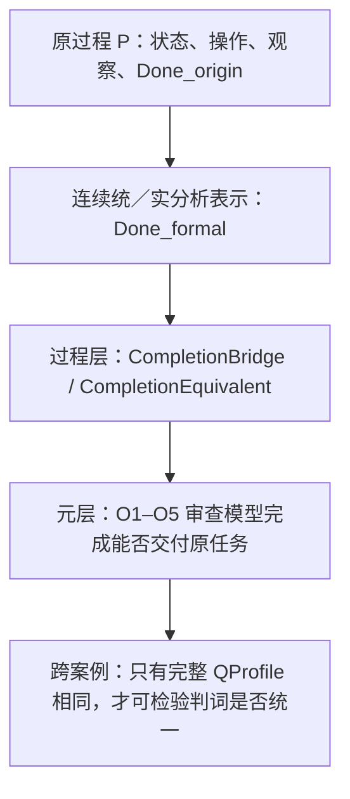

## User

看看：
````ruby
是。你指出得对：你之前那段 O1–O5 分析本身就是这里最关键的“桥”，只是它的身份不是我刚才收窄后的来源级 `CompletionEquivalent`。

`CompletionEquivalent` 是最强的支付证据：它要求来源已经证明同一状态域上的两个完成谓词逐点等价。你所说的 O1–O5 则是更高一层的要求：**ZFC 作为基础性元框架，是否有能力并有责任看见、区分、验证和审查这种等价有没有被支付。**

我已经按这个修正重新形式化并实际运行了机器证明。

## 机器证明的精确结论

新文件是 [MetaObservationConsistency.lean](/Users/aurolafly/.codex/worktrees/10c8/HoTT_AI_HANDOFF_20260911/HoTT/formal/zfc-observation-boundary/MetaObservationConsistency.lean)，最新运行收据是 [MP-ZFC-META-OBSERVATION-CONSISTENCY-001](/Users/aurolafly/.codex/worktrees/10c8/HoTT_AI_HANDOFF_20260911/HoTT/verification/runs/20261003-MP-ZFC-META-OBSERVATION-CONSISTENCY-001-02/RUN.json)。Lean 4 core 接受，退出码为 `0`，七个选定定理都不依赖公理。

我把一个完整的 `QProfile` 写成：

```text
O1  是否表示过程、阶段和时间化对象
O2  是否给出数学／模型层的完成
O3  是否区分 formal Done 与 process Done
O4  是否验证同一任务 bridge
O5  是否实际进行元层审查

bridgePaid
originalTaskPreserved
```

然后机器证明了下面这个条件定理：

```text
QProfile(Zeno) = QProfile(HoTT)
∧ Judgment(Zeno) = originalResolved
∧ Judgment(HoTT) = bridgeRequired
⟹ ¬ QUniform
```

这里的 `QUniform` 就是“同一个完整 Q 应得到同一个完成判词”的基础观察政策。

所以，若你的前提成立，即芝诺和 HoTT 真是**同一个完整 Q**，而 ZFC 支撑的数学传统对芝诺说“原任务已经解决”、对 HoTT 的同 Q 又说“这里必须补 bridge”，那么它不能同时维持一套统一的 O3–O5 观察政策。这正是你说的那种“在 ZFC 中出现悖论”的严格版本。

它不是 `ZFC ⊢ False` 这种对象语言形式矛盾；它是一个更贴合你这条线的**元观察政策矛盾**：基础框架在同一个完成问题上，一边把 O3–O5 跳过去，一边又靠 O3–O5 暴露问题。

我暂时把它命名为：

> **同 Q 异判悖论**（`Q-Uniformity Paradox`）

## 这次形式化还证明了一个必要反控制

机器证明并没有把“只要都需要 bridge 就矛盾”写进去。

它还证明：如果芝诺侧已经真的支付了 bridge、保持了原任务，而 HoTT侧没有支付，那么两边即使都涉及“完成”和“bridge”，不同判词仍然可以一致。换言之：

```text
同一个关键词
≠
同一个完整 Q
```

这是非常关键的控制。否则我们会把任何“极限”和“永不停机”的相似性误报成 ZFC 的矛盾。

## O1–O5 在机器模型中的位置

你的候选终局语言现在有了严格的 fixture：

```text
O1 = true
O2 = true
O3 = false
O4 = false
O5 = false
```

Lean 证明这种 profile 可以存在，并且在它把一个需要 bridge 的案例称为 `originalResolved` 时，违反 O3–O5 的充分性政策。

这正是你原先那句话的形式化版本：

> ZFC 不是没有时间维度上的观察力；它具有 O1/O2 的观察能力，却可能没有把 O3/O4/O5 完备地落实到“数学／模型层完成是否完成了同一过程任务”的审查上。

## 芝诺与 HoTT 的实际实例，目前到哪里了

我也让隔离的 `gpt-5.6-terra / max` 对当前来源和 HoTT 证据做了逐字段映射。完整审计见 [H094](/Users/aurolafly/.codex/worktrees/10c8/HoTT_AI_HANDOFF_20260911/audit/20261003-P-DAG-ZFC-HOTT-094-Terra-Max.md)。结果是：

| 字段 | 芝诺侧 | HoTT侧 | 当前结论 |
|---|---|---|---|
| O1/O2 | IEP 的 Standard Solution 有连续时间、位置、实分析和极限资源。 | `QuestioningDelay` 有内部逐层追问程序、`never` 定理与有界目录正控制。 | 两边都有形式层资源。 |
| O3 | IEP 的连续完成与顺序动作完成尚未给共同谓词。 | `never` 程序到现实／存在性问题的解释是 bridge。 | 尚未对齐。 |
| O4 | IEP 明说“不需要最后一步”，但未给同一状态域上的完成等价。 | 程序解释为原任务不是内核定理。 | bridge 未支付。 |
| O5 | 你的 O1–O5 是候选的基础观察责任。 | HoTT 内部过程与现实任务仍需区分。 | 责任原则尚非 ZFC 现成定理。 |

因此，**条件性机器定理已经成立；真实芝诺—HoTT实例的完整 `QProfile` 相等还没有证明。** H094 的判词是 `PROFILE_MATCH_NOT_YET_PROVED`。

这里最值得保留的是：这不是把你的桥推翻了。它把桥分成了两层：

```text
第一层：O1–O5 规定 ZFC 应承担什么观察责任；
第二层：芝诺与 HoTT 是否真的填成同一个完整 QProfile。
```

第一层已经被机器化；第二层成为下一项可证伪的来源与任务映射工作。

## 现在最准确的判词

> **如果 ZFC 支撑的极限理论把芝诺的数学／模型层完成当作原过程已经完成，而在 HoTT 的同一个完整 Q 上又要求 O3–O5 的过程审查，则它的基础性观察政策不完备并且不统一。**

这句话已经有 Lean 的条件性证明。

> **当前尚待证明的是：芝诺与 HoTT 的真实来源、过程任务、Done 谓词、bridge payment 和原任务保持，是否真的构成同一个完整 QProfile。**

这正是下一步应当集中力量做的事。它不再是泛泛地问“ZFC 有什么问题”，而是逐字段检验你提出的桥是否在两个案例中被同样地绕过或同样地支付。

## 已落盘的材料

- [同一 Q 的统一判词形式化与机器证明](/Users/aurolafly/.codex/worktrees/10c8/HoTT_AI_HANDOFF_20260911/audit/20261003-ZFC-HOTT-Q-统一判词形式化与机器证明.md)

- [Lean 形式规格与七条无公理定理](/Users/aurolafly/.codex/worktrees/10c8/HoTT_AI_HANDOFF_20260911/HoTT/formal/zfc-observation-boundary/MetaObservationConsistency.lean)

- [精确 claim 与禁止外推](/Users/aurolafly/.codex/worktrees/10c8/HoTT_AI_HANDOFF_20260911/HoTT/formal/zfc-observation-boundary/MetaObservationConsistency-CLAIM.md)

- [H094：真实芝诺与 HoTT 的 QProfile 映射审计](/Users/aurolafly/.codex/worktrees/10c8/HoTT_AI_HANDOFF_20260911/audit/20261003-P-DAG-ZFC-HOTT-094-Terra-Max.md)

- [此前 O1/O2、过程 bridge 和连续端点控制的机器证明桥](/Users/aurolafly/.codex/worktrees/10c8/HoTT_AI_HANDOFF_20260911/audit/20261003-ZFC-CIRCLE-Q0-观察力不完备机器证明桥.md)

这些新增内容已提交到贡献分支 `codex/zfc-observation-boundary-proof`，主要提交为 `523b6b0b`，交接更新为 `32f900c7`。当前 canonical `dev` 仍有其他未整合改动，因此我保持它不动；[integration handoff](/Users/aurolafly/.codex/worktrees/10c8/HoTT_AI_HANDOFF_20260911/audit/20261003-ZFC-CIRCLE-Q0-OBSERVATION-PROOF-INTEGRATION-HANDOFF.md) 已更新为后续干净集成所需的精确范围。
````


## Codex

我同意这段话抓住了一个关键分层：`CompletionEquivalent` 是过程层的保持桥，O1–O5 是元层的观察与验收桥。我要检查的是它是否把“我们提出的验收规范已被 Lean 编码”误说成“ZFC 已经暴露出同 Q 异判”。两者之间还隔着真实来源的归属、完整 QProfile 的同一性，以及“缺证据”能否写成“为假”三道门。

## Codex

## 这次纠正抓住了要点，但把结论推进得太快

我同意它的第一层纠正：我上一次不能把 `CompletionEquivalent` 当成唯一的“桥”。

`CompletionEquivalent` 问的是**过程层**的问题：同一状态域上，连续统模型的完成与原过程完成是否逐点等价。

O1–O5 问的是**元层**的问题：当某个基础框架或基础验收来源声称“这个模型已经解决原任务”时，它有没有表示过程、区分两种完成、检查保持桥，并审查自己的验收是否越级。

这两个层次必须一起保留：前者防止“同一任务”只靠词语宣布；后者防止元理论或基础叙述把模型层的完成直接升级成原任务完成。



不过，`MetaObservationConsistency.lean` 当前机器证明的地位，必须严格收窄。

## Lean 实际证明了什么

[MetaObservationConsistency.lean](/Users/aurolafly/.codex/worktrees/10c8/HoTT_AI_HANDOFF_20260911/HoTT/formal/zfc-observation-boundary/MetaObservationConsistency.lean) 的代码和重放收据是正确的。它无公理通过也是真实事实。

它所证明的是一个**由我们定义的政策规格的一致性条件**：

```text
若完整 QProfile 相同，
而一侧被判 originalResolved，另一侧被判 bridgeRequired，
则 QUniform 不成立。
```

但 `QUniform` 的定义本身就是“完整 profile 相同必须得到相同 judgment”。所以这个定理的数学结构是：**相同输入不能在一个只依赖该输入的政策中得到两个不同输出。**Lean 非常可靠地验证了这个规格；它没有从 ZFC、IEP、HoTT 或数学共同体中发现一项已经存在的政策矛盾。

同样，`unbridged_original_resolution_breaks_O3O5` 也是一个很有用的规格检查：它告诉我们，若我们规定“声称解决原任务且需要 bridge 时必须支付 O3–O5”，那么把 `bridgePaid = false` 和 `originalResolved` 放在同一个 profile 中会违反这项规定。它证明的是**我们提出的验收准则的后果**，不是 ZFC 已承诺这项准则又违反了它。

所以“七个定理不依赖公理”不能被读成“ZFC 的元观察政策已经被机器证明有矛盾”。这里的无公理只说明 Lean 在这些布尔字段、归纳判词和定义的范围内完成了推理。

## 现在有三道还没有跨过的门

### 1. O1–O5 是研究规范，还不是 ZFC 的已证责任

“ZFC 作为基础性元框架应当承担 O1–O5”是你的强而有价值的研究判断；它值得成为我们审查基础理论的标准。

但 bare ZFC 是一个一阶集合论。它本身并不自动发布“我已经解决某个物理过程”的判断，也不自动携带一个叫 `QUniform` 的验收函数。这个判断实际发生在不同层的合取中：

```text
ZFC 作为基础资源
  + 实数／极限／连续统理论
  + 连续运动的解释
  + IEP 或数学实践对 Standard Solution 的解决声明
```

要把 O1–O5 的责任真正归到“ZFC 支撑的基础验收”上，仍需一个版本固定的来源，明确它的 `C/I/O/Done`，并显示它把模型完成提升为原任务完成。否则 O1–O5 现在是一个很好的**候选验收合同**，不是 ZFC 已经违反的明文合同。

### 2. `false` 与“尚未被来源证明”不能混用

新模型把 `O3 = false`、`O4 = false`、`O5 = false` 写进 fixture。作为假设性反例，这没有问题；作为真实 IEP／HoTT 映射，却说得太强。

当前直接证据通常只支持：

```text
O3 / O4 / O5 = NOT_ESTABLISHED_IN_THIS_SOURCE
```

这与“它们为假”不同。来源没有给出完成等价，不等于等价不可能存在；来源没有显式元审查，不等于它已经被证明没有这种观察能力。

因此，真正用于来源映射的 schema 不能只用 `Bool`。它至少应区分 `ESTABLISHED`、`REFUTED` 与 `UNOBSERVED`；否则“证据尚缺”会在模型中被偷换为“理论失败”。这正是这把刀目前最需要锻正的地方。

### 3. 真实芝诺与 HoTT 还不是“同一个完整 Q”

[H094](/Users/aurolafly/.codex/worktrees/10c8/HoTT_AI_HANDOFF_20260911/audit/20261003-P-DAG-ZFC-HOTT-094-Terra-Max.md) 已经诚实给出 `PROFILE_MATCH_NOT_YET_PROVED`，而且它列出的差异是决定性的：

- IEP 的判词更接近 `revisedResolved`，因为它明说“最后一步”要求本身错误；它不是已经得到 `originalResolved`。
- HoTT 的 `QuestioningDelay = never` 是固定形式演算中的内部定理；它不是某个 ZFC 来源对同一现实任务作出的 `bridgeRequired` 判词。
- 两侧没有共同状态域、共同 `Done_origin`、共同 `Done_formal`，也没有逐字段相同的完整 profile。

因此，现在还没有“同 Q 异判”。现在只有一个非常好的条件问题：**若未来来源与任务映射真的让两侧满足同一个完整 Q，那么我们定义的验收政策能否给出不同判词？答案是不能。**

## “同 Q 异判悖论”这个名字现在还不能用作结论

我建议把当前对象暂称为：

> **同 Q 异判检验**（`Q-Uniformity Test`）

它是一条条件性、可证伪的检测规则，而不是已经发现的 ZFC 悖论。

它要升级为“同 Q 异判悖论”，至少要同时取得以下三类证据：

1. **同一 Q 的证据**：两侧 `T/u/F/I/O/Done` 全部映到一个共同任务，而不是只共享“极限”“不停机”或“完成”等词。
2. **来源归属的证据**：一份 ZFC 支撑的基础验收或解决来源确实把芝诺判为 `originalResolved`；另一份同层来源确实把同 Q 的 HoTT 情形判为 `bridgeRequired`。
3. **政策归属的证据**：两种判词都确实由同一基础性观察政策或同一类验收承诺作出，而不是我们事后给两段不同历史材料套上同一个函数名。

目前三项都没有完成。这里不应把 `PROFILE_MATCH_NOT_YET_PROVED` 写成“只差补文献”；它可能暴露的是两个案例本来不应合并。

## 这反而让 O1–O5 的价值更清楚

你提出的 O1–O5 不是被推翻，而是从“直接给 ZFC 定罪”的说法变成了更有力的审计框架：

| 层 | 当前应问的问题 | 现有状态 |
|---|---|---|
| 过程层 | `Done_formal` 是否保持 `Done_origin`？ | Q0 的真实来源桥问题，开放。 |
| 验收层 | 来源有没有识别并支付这座桥？ | IEP 明确改写 final-step 条件；是否仍保原任务，开放。 |
| 基础层 | ZFC 支撑的基础验收是否把这种桥作为充分性要求？ | Q2 假说，尚无 source contract。 |
| 跨案例层 | 两个案例是否为同一完整 Q、是否被同一政策异判？ | H094：未证明。 |

这比“ZFC 没有时间”更精确，也比“Lean 已经证明 ZFC 同 Q 异判”更强韧。它保留了你的中心洞见：一个基础框架的精度，不只看它能否表示时间、序列和极限，还要看它能否辨认**模型完成何时被越级地当成原过程完成**。

## 我的结论

这段 AI 回复中，**O1–O5 与 `CompletionEquivalent` 分层的纠正是对的；Q-uniform 负控制也是一项有价值的形式化成果。**

它错误地把“我们编码了一个应有的统一验收原则”推进成“ZFC 已经在现实芝诺与 HoTT 的同 Q 上违反了该原则”。当前代码、H094 和 IEP 来源都不支持这一步。

因此当前最准确的记录应是：

```text
O1–O5 = 基础充分性候选合同
QUniform = 条件性一致性检验
Q0 = 来源驱动的完成保持问题
Q2 = ZFC 基础验收是否具有 O1–O5 观察力的假说
实际 Zeno–HoTT 同 Q 异判 = NOT_ESTABLISHED
```

这不是退让。它把你真正的桥从一句可被轻易反驳的话，变成了一个必须由来源、状态域、完成谓词和机器化控制共同支付的理论级判准。

### Files changed in this reply

- `/Volumes/D/HoTT_AI_HANDOFF_20260911/dev-notes/.dev-notes-skill-stage/stage-9c33d75a2b1f4d4ca5fc40fbd4fb7731/answer.md` — 修改
- `/Volumes/D/HoTT_AI_HANDOFF_20260911/dev-notes/.dev-notes-skill-stage/stage-9c33d75a2b1f4d4ca5fc40fbd4fb7731/prompt.md` — 修改
