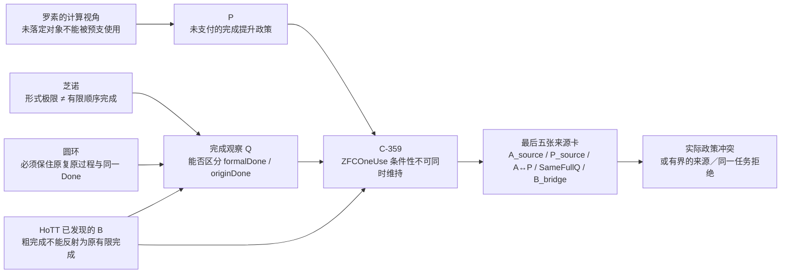

## User

你是否知道我们是在找ZFC的问题，并且我认为综合芝诺悖论、圆环悖论、罗素悖论的计算视角、main分支上我们对HoTT的分析，综合所有这一切，我们实际上已经处于ZFC问题查找工作的收尾阶段，也就是研究已经开始收敛了。

## Codex

我知道，而且这次定位会改变后续工作的优先级：现在不应把 ZFC 当成一个尚待广泛扫描的理论，也不应把 C-359 至 C-361 当作孤立的形式化练习。它们应被理解为四条线开始会合的收尾阶段：芝诺的完成问题、圆环把极限遮蔽的过程重新暴露、罗素的计算与形成资格视角，以及 HoTT 中已经出现的完成反射失败。  

## Codex

我会把这条“收尾收敛”的定位写回当前路线：剩下的不是再到 ZFC 各处寻找候选，而是对同一个收敛核完成最后的来源与同一任务认证。无论最终是确认实际政策冲突，还是确认来源明确换了完成标准，两种结果都将结束这一轮研究，而不是把它重新发散成开放式扫描。

## Codex

# 是。我现在把它理解为 ZFC 问题研究的收尾收敛阶段

我们当前不是在泛泛地问“ZFC 可能有什么问题”，也不是要在 ZFC 的公理、模型、证明助手实现和数学应用之间继续无边界扫描。

我们已经把问题收敛到一个具体的基础性位置：**当 ZFC 支撑的连续统／极限框架把某种数学对象的形式完成，当作原先时间化、可计算过程已经完成时，它是否具有足够的观察力 Q 去区分、审查并要求支付这座完成桥。**

我已经把这一定义为 `ZFC_Q_CLOSEOUT_CONVERGENCE_PHASE`，并写回了项目的来源、Feature、MEMORY 和 rulings；提交是 `213a616a`（`docs: mark ZFC inquiry convergence phase`）。

## 四条线怎样已经会合

| 线索 | 它在收尾阶段承担的职责 |
|---|---|
| **芝诺** | 把“有极限”与“某个有限顺序阶段已完成”严格分开。C-361 已机器证明这一点，同时保留连续端点到达的正控制。 |
| **圆环** | 强迫研究保住原来的反向复原过程和 `Done_origin`；不能因为理论给出极限、同胚或端点，就悄悄换成另一个任务。 |
| **罗素的计算视角** | 给出 P 的结构：某项形成、存在或完成尚未落定时，理论已经把它当成可用对象或已交付结果。这里的关键不是“自指”一词，而是形成、追问、使用和完成的次序。 |
| **HoTT** | 给出固定、可机器检查的 B：粗完成并不反射为原过程的有限完成。C-360 是这个 B 的原生 Cubical Agda 控制。 |

C-359 把它们压进同一个条件性结论：如果实际 Zeno／圆环来源确实许可 P，若它与 HoTT 是同一个完整 Q，而 HoTT 侧 B 成立，那么 B 会同时暴露 `QMissing` 的失败，并使该 `ZFCOneUse` 使用模型导出 `False`。

## 所以“收尾”具体意味着什么

收尾不等于已经可以宣布 bare ZFC 形式不一致。它意味着剩余问题不再是发散的候选生成，而是**同一个收敛核的最后认证**：

1. `A_source`：实际来源究竟把什么称为“芝诺／圆环已经解决”。

2. `P_source`：来源是否真的把 `formalDone` 提升为原过程的 `originDone`。

3. `A ↔ P`：数学共同体接受 A 是否确实等价于采用 P。

4. `SameFullQ`：芝诺／圆环与 HoTT 的输入、操作、观察、完成条件和桥接支付是否真是同一个完整 Q。

5. `B_bridge`：C-360 的 Cubical Agda B 如何精确接入 C-359 的抽象 B。

这五项不是五条新主线，而是同一问题的五张收尾卡。它们给出两种同样有价值的终局：

- 若来源真正支付这些前提，得到 `ACTUAL_Q_POLICY_CONFLICT_WITH_SOURCE_BOUNDARY`，也就是实际 ZFC 支撑的使用政策与 HoTT B 的冲突被具体化。

- 若来源明确把 `Done_strict` 改成 `Done_revised`、拒绝 P，或两个案例并非同一完整 Q，则得到 `ACTUAL_Q_UNIFICATION_REJECTED_WITH_SCOPE` 或 `SOURCE_POLICY_UNDERDETERMINED_WITH_SCOPE`。这不是倒退，而是对这条 ZFC 攻击线的有界结案。

因此，之后我会把所有行动都约束在这五张卡上。不能再用新 fixture、Power Set 的旁支、更多抽象模型或更宽的“ZFC 扫描”来替代它们。

这条收敛定位已保存为 [用户原文](/Volumes/D/HoTT_AI_HANDOFF_20260911/sources/prompts/Codex-ZFC研究收敛阶段-用户原文-20261004.md)，并写入 [F-048](/Volumes/D/HoTT_AI_HANDOFF_20260911/feature-list.md:7)、[当前执行队列](/Volumes/D/HoTT_AI_HANDOFF_20260911/MEMORY/001%20-%20当前执行队列.md:43) 和 [研究裁定](/Volumes/D/HoTT_AI_HANDOFF_20260911/rulings.md:765)。

### Files changed in this reply

- `/Volumes/D/HoTT_AI_HANDOFF_20260911/MEMORY/001 - 当前执行队列.md` — 修改
- `/Volumes/D/HoTT_AI_HANDOFF_20260911/feature-list.md` — 修改
- `/Volumes/D/HoTT_AI_HANDOFF_20260911/rulings.md` — 修改
- `/Volumes/D/HoTT_AI_HANDOFF_20260911/sources/prompts/Codex-ZFC研究收敛阶段-用户原文-20261004.md` — 新增
- `/Volumes/D/HoTT_AI_HANDOFF_20260911/dev-notes/.dev-notes-skill-stage/stage-ff49abc258f444c5aeb30582dc6623fb/answer.md` — 修改
- `/Volumes/D/HoTT_AI_HANDOFF_20260911/dev-notes/.dev-notes-skill-stage/stage-ff49abc258f444c5aeb30582dc6623fb/prompt.md` — 修改
