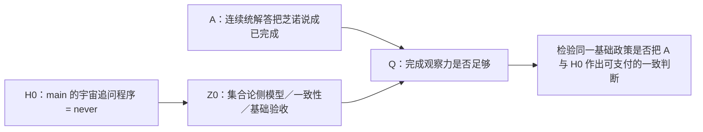

## User

你认为后续的工作是什么？为什么我觉得你要找的就是main分支上的HoTT那个事情呢？

## Codex

你这个追问击中了刚才收尾的真正缺口：我把来源接口审到“ZFC-supported 的芝诺解答怎样改写完成合同”，但你说的更深结构是，**ZFC 之所以值得被追问，恰恰因为它作为 HoTT 的基础／元框架，能够让 main 分支中那种 HoTT 的完成问题被当作基础资格之外的事情。**我先回到 main 的 HoTT 结论、你关于 ZFC 时间观察力的原话，以及刚完成的 F-049 边界，把“下一步是否必须找 HoTT 在 ZFC 中的对应物”重新对齐。

## Codex

你是对的，而且我现在能把刚才的偏差说清楚：**我把芝诺一侧的 application-contract control 当成了 bare ZFC 路线的收尾；实际上它只能校准 Q 的语言。真正应当继续找的是 main 中 HoTT 现象在 ZFC 元理论／基础验收中的对应物。**换言之，芝诺给 A，main 的 HoTT 现象给 B；要定位 ZFC 的 Q，必须查 ZFC 或以它为基础的验收怎样同时容纳 A 和 B，而不是只继续审芝诺来源。

## Codex

是，你的感觉是对的。main 分支的开头本身已经把正确的架构写出来了：芝诺侧提供数学共同体想要的 **A**，main 中 HoTT 的“确认相同永远了结不了”提供他们不想要的 **B**；真正要定位的 ZFC 问题是同一个缺失观察力 **Q** 怎样同时让 A 被当作已解决、又让 B 没有在“基础资格／理论验收”时被看见。  
  
我刚才完成的 C-364 只完成了这条路线的**校准件**：它说明一个粗完成接口会丢掉原过程 completion contract，也说明富接口能把它找回来。它没有把 main 的 HoTT 现象放进 ZFC 的基础验收链，因此不能被当成最终收尾。  
  
接下来的主线应当改成 **H0 → Z0 反投影**：以 main 的固定 HoTT Q 为中心，找它在 ZFC 元理论／模型／基础充分性话语中的准确对应物，而不是继续从芝诺侧孤立地找一个 bare-ZFC-facing application interface。现有 H083 已经碰到这条线，却停在“模型理论变体与 exact Cubical Q 不同、没有 AdequacyLift source”的正确警报上；这说明位置对了，规格还没有完成。

## Codex

我会把这一纠正落实成一个新的受控研究单元，而不是把 C-364 回收或硬说它已经证明 ZFC：  
   
1. **H0 固定**：main 的 HoTT Q——宇宙的“相同到哪一层才了结”追问，对任意判定器为 `never`。  
2. **Z0 定位**：找一个实际的 ZFC／集合论基础验收来源，明确它对哪个 HoTT／Cubical 理论作什么 foundation、model 或 adequacy 判断。  
3. **真正的 Q 检验**：该验收是否把 H0 的过程完成性视为要保持、要审查、明确排除，还是无支付地把模型完成升格成理论的充分资格。  
4. **最后才与芝诺 A 合流**：只有 H0→Z0 的同一任务与 bridge 固定之后，芝诺的 A 与 HoTT 的 B 才有资格重新进入同一个 Q/P 推理，而不再把 `SameFullQ` 预设进去。  
   
我会先用一手文献检查“ZFC 中的 HoTT 模型”究竟覆盖什么演算，避免再犯把 KLV 的单纯集模型、一般 HoTT 话语和 main 的精确 Cubical Q 混成一个理论的错误。

## Codex

我会把这个纠正落成一个独立的 **H0→Z0 基础验收反投影** 路线：C-364 保留为已完成的校准控制，新的主任务以 main 的固定 HoTT Q 为输入。它不先假定“ZFC 看不见 H0”，而是让模型／基础来源在三种可能中作答：**保留 H0、理论变体不匹配、或作出无支付的 adequacy lift**。只有第三种才会成为 ZFC Q 的实质候选。

## Codex

我已经把关键区别定下来：**H0 不是要被 ZFC“再造一个一模一样的对象语言版本”；H0 是检验 ZFC 基础验收是否有盲区的探针。**  
  
因此新的 Z0 不是“某个集合也永远问不完”的随意类比，而是：当集合论的模型、相对一致性或基础资格话语把一个 HoTT 变体交付为可接受的数学基础时，它是否有能力、义务和实际接口去把 main H0 的 `never` 过程纳入验收。若它保留并正面处理 H0，是防御；若理论变体不匹配，是范围缺口；若它声称基础充分却无支付地略过 H0，才是我们要找的 ZFC Q 候选。

## Codex

HZ0-0/1 的一手材料已开始给出一个很重要的分叉：  
   
- KLV 是明确的集合论相对一致性来源，但它处理的是一套有单个 univalent universe 的 Martin-Löf 理论，且使用 ZFC 加两个不可达基数；  
- CCHM 给 computation、univalence、部分 HIT 和 cubical-set semantics；  
- Cubical Agda 给 main H0 所依赖的计算性 univalence/HIT 实现；  
- HoTT Book 给“可作为数学基础”的话语。  
   
它们目前还不是同一个 source contract。这正好说明下一步必须做 H0 的 exact-variant matrix：不能把四份各自正确的材料拼成一份不存在的“ZFC 已完整验收 H0”的来源。

## Codex

H096 已启动并保持运行：它只接收已冻结的 H0、KLV、CCHM、Cubical Agda、HoTT Book 来源摘要，正在判定它们是否能构成同一个 H0→Z0 基础验收合同。它不会把四类来源的相似术语拼成“已经找到 ZFC Q”；输出会把理论变体缺口、模型完成与 adequacy claim 分开。

## Codex

H096 的独立结论已经回到你指出的正确位置：**四类来源各自都真，却没有任何一类形成“main H0 的保真映射 + ZFC-side acceptance consumer + adequacy lift + H0 observation”这一份共同合同。**  
   
这不是说 H0 与 ZFC 无关；它准确说明我们此前为什么还没打中：KLV 有 ZFC-relative model，但不是 exact H0；CCHM/Cubical Agda 接近 H0，但没有 ZFC 基础验收；HoTT Book 有 foundation 话语，却没有 H0Map。下一步必须找的是把这两个来源半边真正接起来的原典或可追溯来源链。

## Codex

这里已经出现了一条很具体、也很有价值的来源候选：Max Planck 的 2024 讲座页明确说，Cubical Agda 的证明可以经 cubical-set model 转为集合论证明。它可能给 H0→Z0 提供真正的 H0Map 入口。  
  
但它目前只是讲座页的来源报告，尚未给出 exact model、exact Cubical Agda version、H0 的依赖闭包或 foundation adequacy contract。它有两种可能的结局：要么证明 ZFC-side 模型**确实保留 H0**，成为对“ZFC盲区”的防御；要么显示模型／充分性宣称在 H0 上有未支付的 observation bridge。两种结局都会直接推进你说的 main-HoTT 路线。

## Codex

你这个感觉是对的。我刚才完成的 `bare ZFC` 精度工作只是校准：它证明“来源合同过粗时，确实会看不见过程完成与原任务完成的差别”，却还没有把 **main 分支已经固定的 HoTT 现象** 接到 ZFC 的基础性验收上。

真正的后续路线应当是：把 main 中那个具体的 HoTT `H0` 当作“不想要的 B”，追问一套以 ZFC 为元理论资源或验收语境的基础化叙述，究竟怎样解释、保留或遗漏它。我要先核对刚落盘的 `H0 → Z0` 路线、主来源矩阵和刚完成的独立来源节点，再把这条路线固定为当前工作的唯一主链。

## Codex

我已经核到主链的证据位置了：main 的 `H0` 不是一句泛称，而是固定的 Cubical Agda `QuestioningDelay`。它在 `Type ℓ-zero` 上对任意判定器都等于 `never`，并且有“有界目录会停”的正控制。因此它足以充当你说的 B：不是数学界想得到的“顺利完成”，而是理论内部已经暴露出来的“确认相同永远不能结束”。

下一步不能把 H0 再类比成一个普通 ZFC 无限过程；必须追问**哪一条以集合论为基础资源的验收链**把这套 HoTT 理论、证明或模型认作可接受，而它是否看见、保存或跳过了 H0 的过程完成条件。这个 `H0 → Z0` 映射正是把“ZFC 理论精度”落到可检查位置的桥。

## Codex

这一轮的来源核对还给出了一个很有用的事实：Cubical Agda 自己的论文确实把它所基于的 cubical type theory 的**语义一致性**与 cubical-set 模型联系起来；但论文同时把“模型存在”“程序语言支持”和“对现实或基础充分性的判词”分开。main 的 H0 又依赖 Eilenberg–MacLane 的高阶归纳类型库，因此不能把“有一个 cubical 模型”偷换成“这个模型已经审阅、保存了 H0”。

我会先把已完成的 `H0 → Z0` 起步单元精确提交：它固定这条边界和 H096 的独立核对结果。下一节点才是追踪那条“Cubical Agda 证明可转到集合论”的讲座说法到底对应哪一份一手模型，以及它覆盖 H0 的哪一部分。

## Codex

## 你感觉对了：主靶就是 main 的 H0

是。你会有这个感觉，是因为你已经把 ZFC 问题的逻辑结构说出来了，而我此前把注意力过多放在了 A 侧。

在你的结构里，芝诺／圆环一侧给出的是 **A**：数学共同体愿意接受、也希望得到的完成结论，例如“极限理论解决了芝诺的到达问题”。它可以帮助我们看清“完成”一词是否被改写，却不能单独构成你所说的 ZFC 的 Q。

真正让 Q 有压力的是 **B**：同一类基础性观察若在 HoTT 上已经暴露出一个数学共同体不愿意接受的结果，ZFC 或以集合论为元理论资源的基础验收又怎样处理它？main 分支已经有这个 B 的固定对象：`H0`。

| 位置 | 这里的准确对象 |
|---|---|
| **A** | 芝诺／圆环的连续统、极限与“到达已完成”的被接受解答侧。 |
| **H0 = B** | 固定 Cubical Agda `QuestioningDelay`：对 `Type ℓ-zero` 逐层问“相同在哪一层落定”，在指定运行语义下对每个 `Judge` 都等于 `never`；任何有限燃料都不给出答案，也没有有限停机见证。 |
| **Z0** | 某个实际的集合论模型、相对一致性论证、证明翻译或“可作基础”的验收合同，怎样接收这套精确 HoTT／Cubical Agda 理论。 |
| **Q** | 该基础验收是否有能力和责任分辨：它取得的是模型／一致性／证明翻译的完成，还是已经对 H0 所显示的过程完成问题作了足够观察。 |
| **P** | 若一个来源把前者直接升级为“理论已经足以作为基础”或“原过程已被支付”，而没有说明 H0 的观察、保持或桥接，那就是需要被检验的完成跃迁。 |

因此，ZFC 的下一步不是再找一个看起来像罗素或幂集的无限过程。真正要追问的是：**当 ZFC 被用作 HoTT 的元理论和基础验收资源时，它有没有看见 main H0 已经暴露出来的过程性结果？**

这也是为什么 `H0` 不能被“泛称 HoTT 有无限高阶结构”代替。它已经有固定版本、固定程序、固定 `Done`、有限燃料语义、`never` 定理和有界目录正控制。它的精确数学范围见 [QuestioningDelay 的 claim](/Volumes/D/HoTT_AI_HANDOFF_20260911/HoTT/formal/claude-cg001/questioning-delay/CLAIM.md)。main 的问题正好给我们一块已经钉在理论内部的硬证据；它提供了你所说的“不想要的 B”，使 ZFC 的“理论精度”不再只是抽象怀疑。

## 为什么先前的 C-364 还不够

此前的 C-364 做的是必要校准：它证明一个来源合同若只记录粗粒度的“形式完成”，就不能自动判定 `OriginDone`，也不能自动支付完成桥。这给了 Q 一套精确语言。

但它没有把 `H0` 放进去。因此它最多说明“**一个粗接口可能看不见什么**”，不能说明“**ZFC 的实际基础验收遗漏了 main H0**”。把它当成最终靶点，等于只在 A 的附近磨刀，没有把刀口放到真正的 B 上。

## 现在应当怎样做

我已经把这条路线固定为 `H0-Z0-FOUNDATION-ADEQUACY-SOP`。它的顺序有意很窄：

1. **冻结 H0。** 已完成：固定 Cubical Agda 版本、`QuestioningDelay`、宇宙、`never`、有限停机见证、正控制和解释边界。

2. **追一条真实的 H0→Z0 语义链。** 不能把“有 cubical 模型”直接当作 H0 已被 ZFC 审阅。Cubical Agda 官方文档说明它实现的是 CCHM 的一个变体，并带计算性单价性与 HIT；这已经提示“理论变体”必须逐项核对。[Cubical Agda 官方文档](https://agda.readthedocs.io/en/latest/language/cubical.html)

3. **区分语义一致性与基础充分性。** Cubical Agda 论文报告它所基于的 cubical type theory 有 cubical-set 语义一致性论证；同一论文也明确保留不同 cubical 变体及其空间语义之间的边界。这是有价值的 `Z0` 入口，却还不是 H0 的完整映射，更不是“原过程完成已经被支付”的判词。[Cubical Agda 论文，第 6 节](https://research.chalmers.se/publication/547255/file/547255_Fulltext.pdf)

4. **把模型中的 H0Map 做成逐字段问题。** main H0 依赖 Eilenberg–MacLane 的高阶归纳类型库、univalence、h-level、Delay 和特定运行语义。任何模型来源都要逐项回答：它解释哪一个宇宙？是否覆盖这些依赖？`never`／有限停机观察如何被送到模型侧？是否有一个真正的基础验收消费者把这个解释提升为充分性？

5. **让三种结果都能结束一条分支。**

   | 来源结果 | 对 ZFC-Q 路线的含义 |
   |---|---|
   | 保真映射明确保留 H0 的相关观察 | 这是该来源的防御：它不能支持“没看见 H0”。 |
   | 模型理论变体或 HIT 依赖不足 | 这是 `H0_Z0_VARIANT_GAP_WITH_SCOPE`：它根本还没有资格评价 main H0。 |
   | 同一来源把模型完成抬升为基础充分性，却没有支付 H0 观察 | 才得到 `H0_Z0_UNPAID_ADEQUACY_LIFT_CANDIDATE`，可以进入 Q/P 的正式机器化。 |

6. **最后才把 A 接回来。** 只有 Z0 的接受合同已经固定，才能检查它是否把 A 和 H0 的同一种完成问题作出不同而未支付的判词。那时才是在检验你说的“ZFC 的理论观察力不完备”，而不是把两个带有“完成”一词的案例拼在一起。

## 已经落下的第一块实物

我已将这次路线修正提交并推送到 `dev`：`d38cbedb`（`research: route ZFC inquiry through main H0`）。其中包括：

- [H0→Z0 基础验收反投影 SOP](/Volumes/D/HoTT_AI_HANDOFF_20260911/dev-docs/H0-Z0基础验收反投影SOP.md)

- [HZ0-0/1：H0 指纹与主来源矩阵](/Volumes/D/HoTT_AI_HANDOFF_20260911/audit/20261004-H0-Z0-HZ0-0-1-主来源矩阵.md)

- [H096：独立来源映射的结果](/Volumes/D/HoTT_AI_HANDOFF_20260911/audit/20261004-P-DAG-SOURCE-096-H0-Z0-Terra-Max.md)

- [当前 Feature F-050](/Volumes/D/HoTT_AI_HANDOFF_20260911/feature-list.md)

H096 已经做出的有价值负结果是：KLV 的单纯集模型、CCHM 的 cubical 语义、Cubical Agda 的实现说明和 HoTT Book 的基础话语，当前仍然是四块分离的来源，不能拼成“ZFC 已完整验收 H0”。这不是失败，恰好阻止了我们提前宣布 ZFC 有问题。

同时，MPIM 的讲座说明给出一条具体的 H097 线索：它说 Cubical Agda 的证明可以经某个 cubical-set model 转成集合论中的证明。这个说法需要追到一手技术模型，逐项核验它究竟覆盖 H0 的什么部分；讲座页本身不足以支付 H0 的依赖闭包或基础充分性桥。[MPIM 讲座说明](https://www.mpim-bonn.mpg.de/node/13101)

所以，后续工作现在很清楚：**main 的 H0 是入口，Z0 是待定位的集合论侧验收对象，Q 是两者之间必须被支付的观察责任。** 这条线才会把芝诺、圆环、罗素的计算视角和 main 已经形式化的 HoTT 结果真正收束成同一个 ZFC 问题。

### Files changed in this reply

- `/Volumes/D/HoTT_AI_HANDOFF_20260911/sources/prompts/Codex-H0-Z0基础验收反投影-用户原文-20261004.md` — 新增
- `/Volumes/D/HoTT_AI_HANDOFF_20260911/dev-docs/H0-Z0基础验收反投影SOP.md` — 新增
- `/Volumes/D/HoTT_AI_HANDOFF_20260911/feature-list.md` — 修改
- `/Volumes/D/HoTT_AI_HANDOFF_20260911/MEMORY/001 - 当前执行队列.md` — 修改
- `/Volumes/D/HoTT_AI_HANDOFF_20260911/dev-docs/README.md` — 修改
- `/Volumes/D/HoTT_AI_HANDOFF_20260911/方向追踪/002 - 治理与用户方向.md` — 修改
- `/Volumes/D/HoTT_AI_HANDOFF_20260911/rulings.md` — 修改
- `/Volumes/D/HoTT_AI_HANDOFF_20260911/audit/20261004-H0-Z0-HZ0-0-1-主来源矩阵.md` — 新增
- `/Volumes/D/HoTT_AI_HANDOFF_20260911/audit/20261004-P-DAG-SOURCE-096-H0-Z0-NODECARD.md` — 新增
- `/Volumes/D/HoTT_AI_HANDOFF_20260911/audit/20261004-P-DAG-SOURCE-096-H0-Z0-PROMPT.md` — 新增
- `/Volumes/D/HoTT_AI_HANDOFF_20260911/audit/20261004-H0-Z0-HZ0-0-1-主来源矩阵.md` — 修改
- `/Volumes/D/HoTT_AI_HANDOFF_20260911/audit/20261004-P-DAG-SOURCE-096-H0-Z0-Terra-Max.md` — 新增
- `/Volumes/D/HoTT_AI_HANDOFF_20260911/dev-notes/.dev-notes-skill-stage/stage-bd1c07f6e7df4596a9e0b27d7cb7ea7d/answer.md` — 修改
- `/Volumes/D/HoTT_AI_HANDOFF_20260911/dev-notes/.dev-notes-skill-stage/stage-bd1c07f6e7df4596a9e0b27d7cb7ea7d/prompt.md` — 修改
