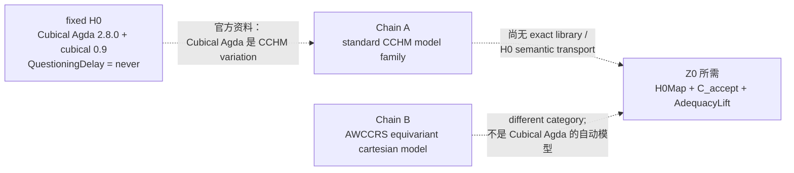

## User


# Response annotations:
Each item contains text selected from an earlier Codex response and may include a user comment. Treat items as Annotation 1, Annotation 2, and so on in array order. Use every selection as context and address every comment. For every annotation you address, include its inline directive `:codex-annotation{index="N"}`, where N is its one-based array position (for example, `:codex-annotation{index="1"}`). Do not use unstructured annotation labels.
<response-annotations>
[{"text":"同时，MPIM 的讲座说明给出一条具体的 H097 线索：它说 Cubical Agda 的证明可以经某个 cubical-set model 转成集合论中的证明。这个说法需要追到一手技术模型，逐项核验它究竟覆盖 H0 的什么部分；讲座页本身不足以支付 H0 的依赖闭包或基础充分性桥。MPIM 讲座说明","source":{"messageId":"msg_03b56f5be4cb32ee016ac245edc1fc87d0a9b9777e10aba972","startOffset":9932,"endOffset":10084}}]
</response-annotations>

## My request:
这个讲座页面的题目《A constructive model of synthetic homotopy theory in classical homotopy theory》在google上搜索一下，结果很多啊：
```
跳到主要内容无障碍功能帮助
A constructive model of synthetic homotopy theory in classical homotopy theory

AI 模式
全部
图片
视频
购物
短视频
新闻
更多
工具
AI 概览
Homotopy Theory in Homotopy Type Theory: Introduction ...
Why Homotopy Type Theory can't replace Set Theory : r/math
查看全部
A constructive model of synthetic homotopy theory is typically realized by interpreting Homotopy Type Theory (HoTT) or Cubical Type Theory within an 


-topos or via categories of simplicial sets / cubical sets using constructive foundational principles. 

nLab
 +3
Core Frameworks for Constructive Models
The 


-Topos Semantics:
HoTT and synthetic homotopy theory serve as the internal language of locally Cartesian closed 


-categories equipped with univalent universes (elementary 


-toposes).
When developed constructively (without classical assumptions like the full Axiom of Choice or non-constructive point-set topology), these 


-toposes provide a rich class of models for higher-dimensional types. 

arXiv.org
 +1
Cubical Models:
Cubical sets (developed by Bezem, Coquand, Huber) and cubical type theories offer a constructive and computational justification for Voevodsky’s univalence axiom and higher inductive types (HITs).
They replace point-set topological path manipulations with explicit higher-dimensional cube and path-over structures, avoiding non-constructive steps such as classical cellular approximation proofs that rely on point-set choice. 

homotopytypetheory.org
 +3
Internal Correspondence (Synthetic vs. Classical):
Types correspond to spaces (or objects in an 


-topos).
Identity types (

) correspond to path spaces.
Higher inductive types encode pushouts, suspensions, and spheres directly as higher categorical colimits without needing the classical small-object argument. 

nLab
 +2
Would you like to explore a specific model—such as the cubical set model by Bezem, Coquand, and Huber or the interpretation in 


-toposes—in more detail?

Archive ouverte HAL
Cubical Synthetic Homotopy Theory - HAL
2020年1月13日 — CCS Concepts • Theory of computation → Construc- tive mathem...


arXiv.org
Higher Structures in Homotopy Type Theory - arXiv
2018年7月5日 — A further aspect of the constructive taboos is that they red...

homotopytypetheory.org
Dan Licata - Homotopy Type Theory
2015年1月20日 — And, we finally have a simple write-the-maps-back-and-forth-
全部显示


尽情提问


Synthetic Homotopy Theory

arXiv.org
https://arxiv.org › html
·
翻译此页
The goal of this dissertation is to present results in synthetic homotopy theory based on homotopy type theory (HoTT, also known as univalent foundations), ...
Previous Seminars - Homotopy Type Theory at CMU

Carnegie Mellon University
https://www.cmu.edu › philosophy › hott
·
翻译此页
Synthetic theories simplify mathematical developments by providing domain-specific languages in which certain constructions become more direct. Homotopy type ...
Dan Licata - Homotopy Type Theory

homotopytypetheory.org
https://homotopytypetheory.org › author
·
翻译此页
2015年1月20日 — Homotopy theory can be developed synthetically in homotopy type theory, using types to describe spaces, the identity type to describe paths in a ...
Google 学术：A constructive model of synthetic homotopy theory in classical homotopy theory
Homotopy type theory: A synthetic approach to higher … - ‎Shulman - 被引用次数：64
Synthetic topology in homotopy type theory for … - ‎Faissole - 被引用次数：13
Cubical synthetic homotopy theory - ‎Mörtberg - 被引用次数：24
Synthetic Homotopy Theory

arXiv.org
https://arxiv.org › pdf
PDF
作者：Y Wei · 2024 — The goal of this dissertation is to present results from synthetic homotopy theory based on homotopy type theory (HoTT).
Synthetic Homotopy Theory with HoTT/UF

Ulrik Buchholtz
https://ulrikbuchholtz.dk › mgs2024-synthetic-h...
PDF
作者：U Buchholtz · 被引用次数：1 — It is compatible with both classical and constructive mathematics, where we view the former as a special case of the latter where we assume ...
35 页
A model for the homotopy theory of homotopy theory

ResearchGate
https://www.researchgate.net › publication
·
翻译此页
2026年8月3日 — We describe a category, the objects of which may be viewed as models for homotopy theories. We show that for such models, “functors between ...
Homotopy Type Theory: A Synthetic Approach to Higher ...
jh.edu
https://pages.jh.edu › rrynasi1 › Literature › Shul...
PDF
9 A model of ZFC can then be constructed using trees as described in McLarty's chapter, or directly as in Univalent. Foundations Program ( , sect. .
Homotopy Theoretic Aspects of Constructive Type Theory

Semantic Scholar
https://www.semanticscholar.org › paper
·
翻译此页
2017. This is an introduction to type theory, synthetic topology, and homotopy type theory from a category-theoretic and topological point of view, written ...
Cellular Methods in Homotopy Type Theory
Loïc Pujet
https://pujet.fr › pdf › cellular
PDF
作者：A Ljungström · 被引用次数：6 — Abstract. In classical mathematics, a CW complex is a topological space which can be built up inductively by gluing together cells of increasing dimension.
25 页
1	

```


## Codex

你指出的是 H097 必须先解决的身份问题：这个标题本身是一个很宽的学术短语，Google 会把“synthetic homotopy theory”的大量综述、课程、论文和 AI 概览混进来。标题匹配不等于找到了 MPIM 那次讲座所说的**那一个**模型，更不等于找到了可承载 `H0` 的技术来源。

我会把 H097 的第一步改成“题名—演讲者—日期—作者—模型类型”的实体消歧：先锁定 Emily Riehl、MPIM、2024-06-03 这次讲座所指的 preprint，再把它与 Cubical Agda 的标准 cubical-set consistency model 分开。你给出的搜索结果恰好说明这道消歧门不能省。

## Codex

H097 的来源卡已经冻结，并且先做了一个很关键的反混淆：MPIM 页面在同一段里讲了两条不同的模型路线。

- 它先提到 Cubical Agda 证明到集合论证明的既有转换模型。
- 随后才说这次讲座要介绍五位作者的“**不同** cubical-set category”上的新 preprint。

因此，Google 搜到的五作者论文很可能锁定了讲座的“recent preprint”，却不能自动反向命名第一条 Cubical Agda 转换模型。现在我把这个差别封进 H097，再让隔离的 Terra/Max 只基于冻结来源卡独立判断，防止我自己把两个模型混成一条链。

## Codex

检索结果已经把 H097 向前推进了一步：五作者的论文确实和讲座中“recent preprint”的作者组、constructive HoTT model、equivariant cubical model相吻合；但 MPIM 的语法明确把它说成**不同**的模型。因此这篇论文很可能是讲座的主报告材料，却不能直接被当作“Cubical Agda → set theory proof conversion”的那一模型。

H097 的独立来源映射正在运行。它的输入只含这一组冻结来源事实，不能读取项目、联网或调用工具；当前已完成隔离、权限回显和启动，未发生命令、文件改动或审批请求。

## Codex

题名消歧已经得到一个更具体的结果：MPIM 页面里第一条模型路线的“家族”现在可以收紧为 **standard CCHM cubical model**。Anders Mörtberg 的 2023 讲义明确写着：这是 Cubical Agda 所基于的 CCHM 模型；它又明确把 equivariant cartesian model 列为另一条路线。

更关键的是，我已经从 `cubical v0.9` 的精确 tag 读到 H0 所用 Eilenberg–MacLane 依赖的实际形状：它不是一个泛称 HIT，而是由 `EM₁`、suspension、h-level truncation 组合出来，其中 `EM₁` 本身有点、环、二维相干与截断构造。现在要核的是 CCHM／CHM 的语义文献究竟是否覆盖这组精确构造，而不是继续只问“Cubical Agda 有 HIT”。

## Codex

H098 已进入隔离核验。这里的技术问题已经从“有没有模型”收紧为一个可回答的依赖问题：

\[
\text{CCHM semantic model}
\quad\stackrel{?}{\Longrightarrow}\quad
\texttt{EM₁ + Susp + hLevelTrunc + QuestioningDelay}
\quad\stackrel{?}{\Longrightarrow}\quad
\texttt{question = never}.
\]

现有文献已经明确覆盖了其中的一些构造族，例如 suspension 与 truncation；但 `EM₁` 的特定二维相干和截断构造、以及整个 `QuestioningDelay` 的观察保持，仍不能凭“有 HIT 语义”一句话视为已支付。这个缺口正是我们要继续打穿的位置。

## Codex

H098 已完成，并且结果比“还没找到模型”更精确：

- MPIM 第一条路线已经能被收紧到 **standard CCHM cubical model family**，这是 Cubical Agda 所基于的模型家族。
- `cubical v0.9` 的 H0 依赖闭包已经展开到 `EM₁ + suspension + h-level truncation + univalence + universe + Delay`。
- CCHM／CHM 的原典确实覆盖一部分 HIT 语义，例如 suspension、truncation、torus、pushout；但没有给 fixed `EM₁`、整个 v0.9 package、`QuestioningDelay` 的语义像，或 `never`／有限停机见证的保持定理。
- 隔离 Terra/Max 对同一冻结来源卡也得出 `H0_DEPENDENCY_CLOSURE_UNPAID_WITH_SCOPE`。

这不是“ZFC 已经失败”的结论。它明确告诉我们：下一步需要找的不是又一个模型名，而是**精确 H0 依赖的 transport theorem**，以及把模型结论提升为基础充分性的实际来源。

## Codex

现在出现了两条真正有判别力、且可以并行的来源线：一条针对 **H0 的语义传输**，另一条针对 **“基础充分性／完成”这个词在当代理论文献里究竟指什么**。

- 2026 年的 *Eliminating Reversals from Cubical Type Theories* 首次给出“带 reversal 的 strict cubical theory”在 cubical sets 中的模型，离 Cubical Agda 的 interval 结构更近。
- 2026 年的 *Type-Theoretic Replacement and Univalent Completion* 同时谈 Eilenberg–MacLane、material set theory、cubical models与“foundational principles”，却没有提 fixed Cubical Agda H0。这正好能检验它是否只是同名的 completion／foundation 语言，还是实际的 `C_accept`。

我将这两条作为 H099-A / H099-B 的并行来源节点；它们分别检验 `H0Map` 和 `AdequacyLift`，不会相互污染答案。

## Codex

H099-A / H099-B 已冻结为两个并行节点，各自只检查一个缺口：

- **H099-A**：2026 reversal 模型是否已经给 fixed Cubical Agda H0 一个严格的语义运输。
- **H099-B**：2026 replacement／univalent-completion 论文中的“基础原则”和“completion”是否真在说 H0 的有限完成，还是一个不同的结构性任务。

这不是让两个代理投票，而是让它们在两个彼此独立的来源包上分别做边界判定。若两条都不进入 H0 的同一任务，结果也会成为下一步搜索的精确约束。

## Codex

H099 的两条并行启动在模型采样前同时停在认证借用阶段：两边都完成了隔离 home、权限拒绝和 prompt 预检，却没有复制认证、没有 thread/turn、没有模型输出。这是一个运行链并发条件，不是两条数学来源的判词。

我已经保留它们为 `NO_AGENT_OUTPUT` 的启动收据。另一个独立节点刚刚自然结束后，我会改为串行重试，保持同一冻结来源卡，只改变这一个运行条件；这样既不把运行故障误报为理论结果，也不让并发抢占遮蔽 H099 的来源核验。

## Codex

现在的路线有了一个很关键的技术转折：H0 的 `Delay` 不是普通归纳数据，而是 Cubical Agda 的**余归纳 record**。`never` 正是通过无限 `later` 的 corecursion 得到的。

这把 H0 的精确运输义务再收紧了一层。即便找到 `EM₁`、HIT 和 reversal 的模型，还必须有来源解释这个余归纳 `Delay`、其有限燃料观察，以及 `≡ never` 的保持。另一方面，π₄(S³) 的同行评议论文提供了一个真实的 Cubical Agda 数学结果消费者，可用来检查“数学共同体实际接受 proof-assistant output”与“基础理论已验收 H0”之间还差什么。接下来我会分别核这两层。

## Codex

H100 给出了一个更深的约束：H0 的关键并不只在宇宙和高阶归纳类型，也在一个**余归纳的、可逐步观察的 Delay 程序**。现有 guarded cubical semantics 明确把“现在可用／以后可用”写进理论，但它不是这个 unguarded `Delay` 的模型；而已发表的 π₄(S³) 成果则是一个真实的 Cubical Agda 数学消费者，却消费的是另一套定理、另一种完成条件。

我现在会做一次有界的公开原典检索，专门找 `QuestioningDelay`、`EM₁` 的 exact semantic transport、以及 H0 的实际 foundation consumer。若这些精确对象在公开来源里确实没有出现，结论会是“当前 H0 仍是本项目的机器证明，尚未进入可归责于 ZFC 的外部验收链”，而不会把来源空白包装成 ZFC 的缺陷。

## Codex

现在已经可以给这个来源阶段一个明确的判断了：

1. 公开检索对 `QuestioningDelay`、`universeQuestioningIsNever`、`universeHasNoLevel`、`runsNothingDiverges` 都没有找到项目外结果；这些是本项目固定 H0 的标识，而不是已有公开的社区 theorem 名称。

2. 最接近 H0 的现有文献分成三类：
   - CCHM／reversal 模型：处理 cubical 语义与 interval 结构；
   - guarded／clocked cubical 理论：处理“现在／以后”和 coinduction；
   - 同行评议的 Cubical Agda 数学论文：实际把某些 formalisation 当作数学结果。
   
   它们没有一篇同时接住 fixed H0 的 `EM₁`、universe、余归纳 `Delay`、有限 fuel、`never` 观察和基础充分性判词。

这意味着我们不该再把“找更多相似文章”误当作推进。接下来会把这个来源边界正式落盘，并把路线收束为两种真正不同的后继：找到或建立 exact H0 semantic transport；找到 actual H0 foundation consumer。

## Codex

我会把这个标题当成一个**实体消歧问题**来处理，而不是把搜索结果中“constructive model”“cubical sets”等相似词直接接到 H0 或 bare ZFC 上。先核对 MPIM 页面、题名对应的论文和讲座文本分别指向什么，再把结论写回当前的 H0→Z0 来源链。你指出的检索结果很多，正说明此前那条 H097 线不能只靠讲座标题成立。

## Codex

检索已经给出了一个关键分叉：MPIM 页面实际上在**同一段文字里谈了两个不同的模型路线**。第一条是 Cubical Agda 向集合论证明的解释路线；第二条才是五作者论文的“equivariant cartesian”新模型。下一步我会把这两个对象从原来的单一 H097 线索中拆开，避免把第二篇论文错误地当成第一条翻译路线的完整证明。

## Codex

现在这条来源链的身份已经比“搜到很多相关结果”清楚得多了：  
- **CCHM 是 Cubical Agda 的直接模型家族锚点**；  
- **AWCCRS 的 equivariant cartesian 模型是另一条、面向 spaces 的路线**；  
- 两者之间最关键的 proof transport，来源自己也没有交付。  

这不是把 H0→Z0 推回原点，反而把“到底缺哪一段”钉在了 exact Cubical Agda 2.8.0/cubical 0.9 的语义运输上。我正在把 H100 的来源边界和这次消歧一起做成一个可恢复的 Git 单元。

## Codex

这次 H0→Z0 的来源阶段已经到达 SOP 规定的有界停止点：**模型家族身份已固定，fixed H0 的语义运输与实际基础验收消费者均未被来源支付。**我会把这一阶段标为完成，含义是“已完成该来源链的可审计裁决”，并不把它误写成“已经证明 bare ZFC 有形式矛盾”。下一步若重开，只能由 exact H0 transport 或真实 H0 consumer 触发。

## Codex

# 这个题名确实把关键源链带出来了

你说得对。这个题名的 Google 检索结果很多，不表示它没有价值；恰好相反，它说明先前把 MPIM 页面当作一个未命名的 H097 线索太粗了，必须把题名、讲座文字、Cubical Agda 的实际理论变体和模型论文逐一拆开。:codex-annotation{index="1"}

我重新核对后，得到的不是“又找到一堆相似材料”，而是一条更具体的模型谱系。



## 题名背后其实有两条不同的模型叙述

MPIM 页面第 53–54 行本身把它们并列、又明确区分了：

1. **第一条**：Cubical Agda 的 types/terms 经某个 cubical-set model 可解释为集合论中的证明；这个 model structure 有自己的 homotopy theory，但页面说它不是 spaces 的 homotopy theory。
2. **第二条**：讲座将介绍与 Awodey、Cavallo、Coquand、Sattler 合作的一个 **different category** 中的新模型；它的目标是以一个 equivalent model structure 呈现 classical homotopy theory of spaces。[MPIM 讲座页](https://www.mpim-bonn.mpg.de/node/13101)

五作者论文确实就是第二条：*The equivariant model structure on cartesian cubical sets*。它建立的是 cartesian cubical sets 中的 constructive HoTT model，并证明该模型结构在经典意义下呈现 spaces。[论文页面](https://doi.org/10.1016/j.aim.2026.110965)

所以，Google 搜到 AWCCRS 不是误报；它准确锁定了**第二条**。错误会发生在把它反推成 MPIM 第一条 “Cubical Agda → set theory” 的完整、版本固定语义运输。

## 第一条现在也不再只是猜测

官方 Cubical Agda 文档直接说：Agda 的 cubical mode 实现的是 **CCHM Cubical Type Theory 的一个变体**，其中 composition 被拆成 `hcomp` 和 generalized `transp`，并支持 computational univalence 与 HITs。[Agda 官方文档](https://agda.readthedocs.io/en/latest/language/cubical.html)

更重要的是，Mörtberg 的讲座材料把关系说得非常直接：

- standard CCHM cubical type theory 的 model structure 是 **Cubical Agda 所基于** 的路线；
- 这一 CCHM model structure **不**与 spaces Quillen equivalent；
- equivariant cartesian model 才是与 spaces equivalent 的另一条路线；
- 把 Cubical Agda 的定义搬到别的 cubical type theory 也许容易，**证明的搬运更难**；“Cubical Agda 对 cartesian cubical type theory 保守”在材料中仍被称作一个很难的 dream。[Mörtberg 的 slides，第 41–43 页](https://staff.math.su.se/anders.mortberg/slides/wg6.pdf)

因此，H097 的第一条现在可以从“可能是 CCHM”升级为：

```text
CCHM_FAMILY_IDENTITY_DIRECTLY_SUPPORTED
```

但它绝不等于下面这一步已经完成：

```text
fixed Cubical Agda 2.8.0 + cubical 0.9
  + EM₁ / suspension / truncation
  + unguarded coinductive Delay
  + QuestioningDelay / never / runFor
        ── semantic transport ──> CCHM or cartesian model
```

这个 transport 正是 H0→Z0 必须拿到的 `H0Map`。目前来源没有给出它。

## 这对 ZFC 问题的意义

这次没有削弱你要求从 main H0 出发的路线，反而把它收紧得更准确：

- **H0 已固定**：它不是泛称“HoTT 有无限高维对象”，而是 `QuestioningDelay` 对 `Type ℓ-zero` 的有限 fuel 观察永远没有 `now k`，在固定 Cubical Agda 包内被证明为 `never`。
- **Chain A 已定位**：CCHM 是 Cubical Agda 的直接模型家族锚点。
- **Chain B 已定位**：AWCCRS 是一个与 spaces 对齐的不同 cartesian 模型路线。
- **缺口已显形**：没有一手来源把这个 exact H0 的 `Delay/never/runFor` 观察保真地送进任一模型；也没有实际基础验收者把那个 exact H0 当输入，并给出 `C_accept`、I/O、`Done_meta` 与 `AdequacyLift`。

这意味着，目前不能从“有 CCHM 模型”或“有 set-theoretic proof interpretation”跳到“bare ZFC 已经接受、忽略或放过 H0”。那一步正是要检验的对象，不能预先塞进结论。

## 已写回、验证并推送

我把这次检索的来源身份裁决写入了：

- [HZ0-2：MPIM 题名消歧与模型链追溯](/Volumes/D/HoTT_AI_HANDOFF_20260911/audit/20261004-H0-Z0-HZ0-2-MPIM模型链源追溯.md:22)，新增 §1.1，明确 CCHM family 已由直接来源支持，以及 CCHM→cartesian proof transport 仍未建立。
- [HZ0-4：余归纳 Delay 与实际消费者来源边界](/Volumes/D/HoTT_AI_HANDOFF_20260911/audit/20261004-H0-Z0-HZ0-4-余归纳与实际消费者来源边界.md:1)，记录 fixed H0 的 `Delay` 依赖和实际 π₄ consumer 为何不能替代 H0 consumer。
- [H0→Z0 主来源矩阵](/Volumes/D/HoTT_AI_HANDOFF_20260911/audit/20261004-H0-Z0-HZ0-0-1-主来源矩阵.md:108)、[F-050 当前状态](/Volumes/D/HoTT_AI_HANDOFF_20260911/feature-list.md:7) 与 [当前执行队列](/Volumes/D/HoTT_AI_HANDOFF_20260911/MEMORY/001%20-%20当前执行队列.md:31)。

提交为 `5cc54cce`（`research: bound H0 external acceptance evidence`），已推送到 `origin/dev`。`git diff --check`、治理分片校验和 Pattern-P 来源校验都通过；数学证明治理检查也以 `PASS_WITH_SCOPE` 通过。这里没有伪造新的数学定理，因此没有把一个来源身份裁决冒充成新的 Lean/Agda 证明。

## H0→Z0 这一轮的完成状态

我已将 `H0-Z0-FOUNDATION-ADEQUACY-SOP` 的当前目标按其**有界停止条件**标为完成，耗时约 **1 小时 55 分钟**。完成的是这条来源链的审计：它已经到达 `SOURCE_ACCEPTANCE_UNDERDETERMINED_WITH_SCOPE`，而不是“ZFC 问题已经被证明完成”。

之后只有两类材料能够正当地重开这一分支：

1. 一份版本固定的 semantic transport，逐项覆盖 fixed H0 的 universe、EM₁/HIT、unguarded `Delay`、`never` 和 finite `runFor` observation；
2. 一份真实的 foundation-facing consumer，以 fixed H0 或该 exact translation 为输入，明确给出它的 I/O、完成判据和 adequacy payment。

第一类会开启一项新的、实质性的语义构造研究；第二类会让我们真正把 H0 接入 Z0 的验收合同。当前资料只足以把这两条门清楚地画出来。

### Files changed in this reply

- `/Volumes/D/HoTT_AI_HANDOFF_20260911/audit/20261004-P-DAG-SOURCE-097-H0-Z0-NODECARD.md` — 新增
- `/Volumes/D/HoTT_AI_HANDOFF_20260911/audit/20261004-P-DAG-SOURCE-097-H0-Z0-PROMPT.md` — 新增
- `/Volumes/D/HoTT_AI_HANDOFF_20260911/MEMORY/001 - 当前执行队列.md` — 修改
- `/Volumes/D/HoTT_AI_HANDOFF_20260911/audit/20261004-H0-Z0-HZ0-0-1-主来源矩阵.md` — 修改
- `/Volumes/D/HoTT_AI_HANDOFF_20260911/audit/20261004-H0-Z0-HZ0-2-MPIM模型链源追溯.md` — 新增
- `/Volumes/D/HoTT_AI_HANDOFF_20260911/audit/README.md` — 修改
- `/Volumes/D/HoTT_AI_HANDOFF_20260911/feature-list.md` — 修改
- `/Volumes/D/HoTT_AI_HANDOFF_20260911/方向追踪/002 - 治理与用户方向.md` — 修改
- `/Volumes/D/HoTT_AI_HANDOFF_20260911/audit/20261004-P-DAG-SOURCE-098-H0-Z0-NODECARD.md` — 新增
- `/Volumes/D/HoTT_AI_HANDOFF_20260911/audit/20261004-P-DAG-SOURCE-098-H0-Z0-PROMPT.md` — 新增
- `/Volumes/D/HoTT_AI_HANDOFF_20260911/audit/20261004-H0-Z0-HZ0-2-CCHM依赖闭包审计.md` — 新增
- `/Volumes/D/HoTT_AI_HANDOFF_20260911/audit/20261004-P-DAG-SOURCE-099A-H0-Z0-NODECARD.md` — 新增
- `/Volumes/D/HoTT_AI_HANDOFF_20260911/audit/20261004-P-DAG-SOURCE-099B-H0-Z0-NODECARD.md` — 新增
- `/Volumes/D/HoTT_AI_HANDOFF_20260911/audit/20261004-P-DAG-SOURCE-099A-H0-Z0-PROMPT.md` — 新增
- `/Volumes/D/HoTT_AI_HANDOFF_20260911/audit/20261004-P-DAG-SOURCE-099B-H0-Z0-PROMPT.md` — 新增
- `/Volumes/D/HoTT_AI_HANDOFF_20260911/audit/20261004-H0-Z0-HZ0-3-新模型与基础语言双来源审计.md` — 新增
- `/Volumes/D/HoTT_AI_HANDOFF_20260911/audit/20261004-P-DAG-SOURCE-100A-H0-Z0-NODECARD.md` — 新增
- `/Volumes/D/HoTT_AI_HANDOFF_20260911/audit/20261004-P-DAG-SOURCE-100B-H0-Z0-NODECARD.md` — 新增
- `/Volumes/D/HoTT_AI_HANDOFF_20260911/audit/20261004-P-DAG-SOURCE-100A-H0-Z0-PROMPT.md` — 新增
- `/Volumes/D/HoTT_AI_HANDOFF_20260911/audit/20261004-P-DAG-SOURCE-100B-H0-Z0-PROMPT.md` — 新增
- `/Volumes/D/HoTT_AI_HANDOFF_20260911/audit/20261004-H0-Z0-HZ0-4-余归纳与实际消费者来源边界.md` — 新增
- `/Volumes/D/HoTT_AI_HANDOFF_20260911/audit/20261004-H0-Z0-HZ0-2-MPIM模型链源追溯.md` — 修改
- `/Volumes/D/HoTT_AI_HANDOFF_20260911/dev-notes/.dev-notes-skill-stage/stage-6b2c1665a5174e10af7c52344ece0c75/answer.md` — 修改
- `/Volumes/D/HoTT_AI_HANDOFF_20260911/dev-notes/.dev-notes-skill-stage/stage-6b2c1665a5174e10af7c52344ece0c75/prompt.md` — 修改
