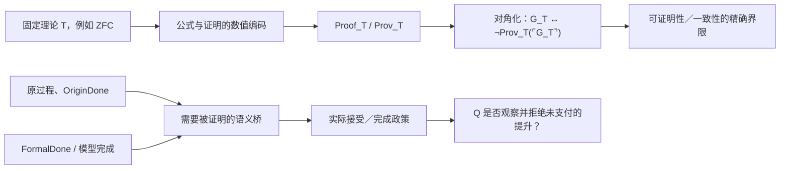

## User

想这样一个问题，如果ZFC有我们说的那种问题，那么在Agda和Lean中，甚至是所谓的“形式化”（ZFC化），能证明我们要证明的超越了ZFC本身可以证明的东西吗？不过，值得一想的是，哥德尔如何证明了哥德尔不完备性？


## Codex

我把这个问题按三个层次拆开回答：**ZFC 本身的证明能力**、**Lean/Agda 所在的元理论**、以及它们能否替我们支付“原过程与形式完成是同一任务”的解释桥。哥德尔的做法正好说明了怎样在一个明确的元层里证明系统自身的界限，也说明了为什么形式化本身不会自动得到一个超越所有前提的立场。当前总证明 Goal 仍保持暂停；这一轮只做概念与证据的澄清。

## Codex

可以，但要把“超越”说得非常精确。

**Lean、Agda 或所谓把问题 ZFC 化，能够在一个明确的元理论中证明“ZFC 不能证明某个形式化命题”或“某个 ZFC 接口无法判定某种性质”。它们不能仅因为换了证明器，就自动站到 ZFC 之外，并判定 ZFC 对现实过程的观察不完备。**

这正是哥德尔给我们的关键方法，也正是我们现在必须避免混淆的边界。

## 先分开三件事

| 层次 | 它在说什么 | 能够证明什么 | 不能自动得到什么 |
|---|---|---|---|
| `T = ZFC` | 一套对象理论：集合、成员关系、公理、证明规则 | ZFC 内的集合论定理 | 它自己的完整可靠性、所有元层语义判断 |
| Lean / Agda 的固定变体 `M` | 一套不同的类型论内核，加上指定 universe、公理、库与编译器选项 | 关于 ZFC 语法、模型、证明编码的元定理 | 对 ZFC 或现实的无条件最终裁决 |
| “ZFC 化” | 把对象、程序、轨迹、证明或过程编码为集合 / 数 / 公式 | 表示、可定义性、形式推导 | 编码是否保住原过程、原完成条件和现实任务 |

所以，若 `M` 中证明 `ZFC ⊬ φ`，这确实可以是一个比 ZFC 内部更强的**相对元结论**。但它仍然依赖 `M` 的内核、所有公理、其一致性以及“`φ` 忠实表达了我们本来要问的东西”这座桥。

我们刚做的 C-366 正好是这个区别的正控制：它确认一个冻结的 Zermelo 模型接口可以表示 ordinal-indexed sequence、阶段值和函数图；它没有因此证明该接口会把 `FormalDone` 与 `OriginDone` 区分开，更没有证明它会支付二者之间的 completion bridge。[C-366 的精确范围](/Volumes/D/HoTT_AI_HANDOFF_20260911/HoTT/formal/zfc-h0-final-closure/H0ProcessRepresentation-CLAIM.md:1)

## 哥德尔到底怎样做

哥德尔没有先假定一个神秘的“超数学真理机器”。他的动作非常具体：把一个形式系统 `T` 的**符号、公式、推导和证明**编码为自然数，然后让算术能够谈论“某个数是不是 `T` 的一个证明”。这就是 Gödel numbering / arithmetization of syntax。

设：

```text
Proof_T(p, q)  := p 是 T 中公式编号 q 的一个有限正确证明
Prov_T(q)      := ∃ p, Proof_T(p, q)
```

这里的 `Prov_T(q)` 不是哲学意义上的“真”，而是一个非常机械的断言：是否存在一份有限、可核验的 `T`-证明。

随后，利用对角化或固定点引理，构造一个句子 `G_T`，使 `T` 可以证明：

```text
G_T ↔ ¬ Prov_T(⌜G_T⌝)
```

也就是：`G_T` 在算术内部说“我没有 `T` 的证明”。若 `T` 足够表达初等算术，并满足相应的有效公理化与一致性条件，元理论就能证明 `T` 不能把这个句子按通常方式完整地解决。第二不完备性定理再把同一套编码、可导性条件和自指机制用于 `Con(T)`：在适当的条件下，`T` 不能在自身内部证明它自己的形式一致性。[Gödel 1931 年原文](https://www.w-k-essler.de/pdfs/goedel.pdf)

关键点在于：哥德尔攻击的不是“数学的一切真理”，而是一个非常明显、非常核心的理论承诺：

> 一个可有效给定、能表达算术的系统，能否把自己全部有限证明活动的正确性和可证明性，完全封闭在自身之内？

这与我们说的“找对了地方”很接近。哥德尔没有遍历数学全部细节；他抓住了 `Prov_T` 这个理论自身必须面对的对象，然后让它对自己的编码发生回返。

## 它和罗素的计算视角怎样接上

罗素线中的“最后一跃”是：一个对象还没有被合法形成或可用，却已经被带入对它自身的操作。

哥德尔线中的“最后一跃”则是：

```text
有限证明过程
    ↓ 编码
Proof_T / Prov_T
    ↓ 对角化
关于该系统自身可证明性的句子 G_T
```

它不是简单的文字自指。它有完整的计算骨架：公式编码、替换函数、证明验证器、有限证明搜索、可表示性，以及将句子编号代回自身的对角过程。

若枚举所有候选证明，寻找 `G_T` 的证明，那么这个搜索过程的停机与否本身就是可定义的计算对象；但“某次搜索没有在观察窗内找到证明”不等于哥德尔结论。哥德尔证明的是一个关于**所有有限证明编码**的元定理。



左边是哥德尔已经给出的句法路线；右边是我们关心的过程和完成路线。二者可以连接，但连接处不能省略。

## 对我们的 ZFC 问题意味着什么

当前 C-359 已经有一个很有价值、但仍是条件性的核：在显式 `ZFCOneUse` 模型中，若 `SameFullQ`、A 侧的 P 许可、以及 HoTT 侧的 B 都被给定，则可推出矛盾。[ZFC1IllusionPolicy.lean](/Volumes/D/HoTT_AI_HANDOFF_20260911/HoTT/formal/zfc-actual-q-policy/ZFC1IllusionPolicy.lean:1)

这还不是哥德尔型证明，因为它目前没有完成下面四步：

1. **固定 `T`。** 具体是 bare ZFC、ZFC 加哪些元理论资源，还是某个真实的基础验收系统？

2. **把 Q 写成句法对象。** 例如定义一个可表示的 `Accept_T(e)`：系统是否把过程编码 `e` 当作已经完成；同时定义 `OriginDone_T(e)`、`FormalDone_T(e)` 与 `Bridge_T(e)`。

3. **证明表示与自指条件。** 必须证明 `Proof_T`、`Accept_T`、替换和相应的可导性条件真的在所选理论里可表示；不能只给自然语言的“数学幻觉 P”。

4. **支付现实同一性桥。** 还要证明这个 `OriginDone_T(e)` 真的是圆环／芝诺／HoTT H0 中原来那个过程完成条件，而没有把任务改成另一个可编码的替身。

只有第 1–3 步完成，才会得到一个真正的 Gödel式问题，例如：

```text
T 是否能证明某一类“完成提升”政策的充分性？
T 是否能证明它对这类提升总是观察充分？
是否存在一个对角化的过程编码 e，使该政策关于 e 的判词无法由 T 完整给出？
```

第 4 步决定它是否仍然是你要打的 ZFC 问题，而不是一个漂亮但换题了的不可判定性定理。

## 因而答案是：可以，但不是自动的

Lean 或 Agda 最有价值的角色，不是替我们宣布“ZFC 有问题”，而是强迫我们把这句话分解成可检验的命题：

- 哪个证明器内核和哪些公理在说话；
- 哪个 ZFC 语法或实际验收接口被编码；
- `FormalDone` 与 `OriginDone` 的形式定义分别是什么；
- `P` 是一个来源实际采用的提升政策，还是我们临时写出的 fixture；
- `Q` 是可表示的内部观察谓词，还是仍属于外部的理论精度判断；
- 哪一步用了对角化，哪一步只是外部语义解释。

如果这些都固定下来，Agda/Lean 完全可能证明一个 **ZFC 无法在自身内部证明的相对限制**，或者证明某一明确的 reflection / completion policy 会与它自己的编码发生冲突。这会是对 ZFC 的真正哥德尔式攻击。

如果这些没有固定，证明器只能给出两类较弱但仍有价值的结果：一个条件性后果，或一个固定接口的信息丢失反例。它们能帮助我们找到 Q，却不能替 Q 的现实解释盖章。

我认为这给当前项目指出了一条比“继续搜索 ZFC 有什么问题”更锋利的路线：**把 Q 锻造成一个可表示的“完成观察／接受”谓词，再问它能否像 `Prov_T` 一样被理论拿来审视自身。** 如果答案能进入对角化，哥德尔会成为模式 P 的严格句法版本；如果它不能进入对角化，那个不能进入的原因本身也会准确告诉我们，Q 仍卡在过程—现实桥的哪一层。

### Files changed in this reply

- `/Volumes/D/HoTT_AI_HANDOFF_20260911/dev-notes/.dev-notes-skill-stage/stage-b6ec18ed72204786b4b8ca9e640a8f75/answer.md` — 修改
- `/Volumes/D/HoTT_AI_HANDOFF_20260911/dev-notes/.dev-notes-skill-stage/stage-b6ec18ed72204786b4b8ca9e640a8f75/prompt.md` — 修改
