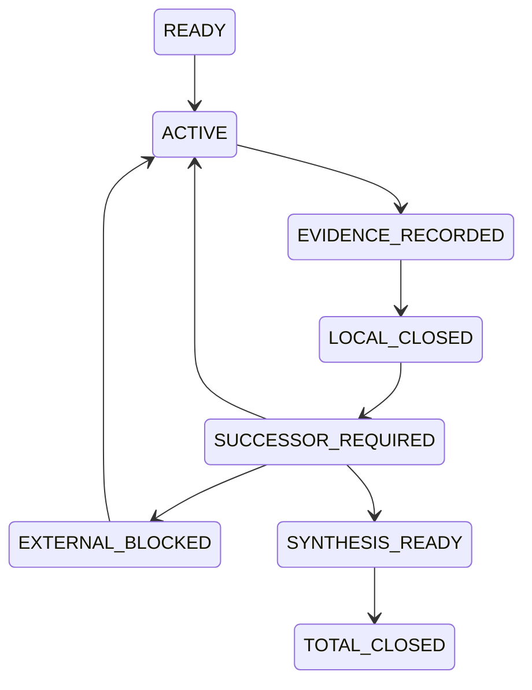

## User

那么你如何给自己设置好/goal，才能确保你自己不要再在中途停下，并且：**给方案一个名字，方便以后你在／goal中引用这个方案名，同时维护好这个方案你在执行的过程中的对应的认知闭包，从而保证你工作在多个Session的过程中，跨越压缩边界之后，可以保持前后认知的一致性，可以持续加载和写回方案执行过程中，对应的认知闭包。**


## Codex

我会把这件事做成一个**覆盖现有 R3/R4、T-DIAG 与 ZFC–H0 M0–M5 的连续闭环方案**，而不是再写一张只会在首个来源缺口处停掉的卡。它会有唯一名称、阶段状态机、每阶段的最小成功/失败输出、强制 successor 规则、跨 Session 认知闭包和 `/goal` 启动词。

## Codex

这会改变项目的持续研究方案、当前队列和跨 Session 恢复方式，因此我会使用 **`repo-cognition-governance`** 与 **`repo-requirements-decisions`**：前者负责把唯一当前方案和认知闭包写回正确 owner，后者负责把“不得因局部来源/工具链缺口停止总路线”固定为可验收的需求。

## Codex

我会把新总方案命名为 **`GODEL-ZFC-CONVERGENCE-SOP`**，中文名为“哥德尔式 ZFC 理论精度收敛闭环 SOP”。它不替代已有的 `T-PRECISION-DIAGONAL-SOP`、`R3–R4` 任务和 `ZFC-H0-FINAL-PROOF-CLOSURE-SOP`；这三者分别成为它的理论规格、证明论路线和 ZFC 实例路线。新方案只拥有它们之间的**连续推进、总完成和跨 Session 认知闭包**。

## Codex

因为这个总方案需要精确规定阶段、转换、失败和恢复，我还会使用 **`repo-detailed-design`**，把“分支关闭后必须产生 successor、只有全部路线结算才可停”的规则写成可执行的状态合同，而不是一句提醒。

## Codex

方案的关键不是“永远不许停”，那会把研究变成无边界地重复；而是要把停止权限制在**总路线层**。任何单个来源、模型、compiler、证明包或 M-id 的失败，只能关闭该分支，并且必须留下一个可执行 successor 或精确的外部阻塞条件。只有所有已声明路线都被结算后，才允许总收尾。

## Codex

方案、闭包和路由已经落到各自唯一职责位置：方案不再承担运行实物，闭包不复制证明，`rulings` 固定用户的“局部闭合不等于总完成”要求，路由则保证未来 `/goal` 能发现完整入口。接下来我会检查分片完整性、链接、启动词长度和精确 diff，再只提交这些文件。

## Codex

分片校验已经通过，启动词为 663 个 Unicode 字符，低于 4,000 的启动词限制；方案与闭包也已作为 9 个精确路径提交为 `0406460a`。当前 worktree 的其它未提交证明和审计材料没有被混入这次提交。

## Codex

我还确认了一个需要处理的 Git 事实：当前 worktree 是 detached HEAD，而且它与已有的远程 `dev-09` 不是快进关系。因此我不会为了“保存”而覆盖或强推 `dev-09`。我会先为这份新方案建立一个独立的本地 `codex/` 引用，保留精确 commit；是否把它合并或推到某个远程分支，应按目标分支的基线和集成语义另行处理。

## Codex

我正在按新方案自己的检查表做第一次自审：它不能只规定未来怎样做，也要记录现在是否已经具备可恢复入口、是否有 active host goal、哪些 current owner 因 dirty 状态被刻意没有覆盖。这个自审会写回闭包，并与方案提交分开保留在 Git 历史中。

## Codex

方案的第一轮自审已经完成：它已具备发现入口、状态机、跨 Session 恢复、局部关闭后的 successor 和总完成条件；当前 host 没有 active Goal，因此计划不会因文件存在而自动开跑。接下来我会归档这轮设置，并把可直接调用的 `/goal` 文本交给你。

## Codex

本轮会再次使用 **`dev-notes-archive`**，将你关于 `/goal`、持续闭环和认知闭包的完整提问，以及这份最终方案说明精确归档；归档提交只会包含该条新对话记录。

## Codex

已经设置好。

新的总方案名称是：**`GODEL-ZFC-CONVERGENCE-SOP`**，中文名为“**哥德尔式 ZFC 理论精度收敛闭环 SOP**”。它的职责不是重写已有的数学路线，而是把它们编排成一条不能因局部缺口而被误关掉的总路线。

方案正文在 [哥德尔式 ZFC 理论精度收敛闭环 SOP](</Users/aurolafly/.codex/worktrees/a38d/HoTT_AI_HANDOFF_20260911/dev-docs/哥德尔式ZFC理论精度收敛闭环SOP.md>)，跨 Session 的唯一恢复入口在 [GODEL-ZFC-CONVERGENCE-001](</Users/aurolafly/.codex/worktrees/a38d/HoTT_AI_HANDOFF_20260911/认知闭包/GODEL-ZFC-CONVERGENCE-001.md>)。项目的 [任务路由](</Users/aurolafly/.codex/worktrees/a38d/HoTT_AI_HANDOFF_20260911/.codex/cognition/TASK_ROUTING.md>) 和 [开发方案索引](</Users/aurolafly/.codex/worktrees/a38d/HoTT_AI_HANDOFF_20260911/dev-docs/README.md>) 都已经可以发现这个名字。

## 它怎样防止“中途停下”

过去的问题是把一个局部 verdict，例如“这个 source 没有 completion consumer”“这个 compiler 不是 forcing-ticks variant”“这个模型和 fixed H0 不同”，误读成总路线结束。新方案把这件事改成一个明确状态机：



这里最重要的一条是：**`LOCAL_CLOSED` 必定进入 `SUCCESSOR_REQUIRED`。**

因此，一个分支关闭时，必须留下下列其中之一：

- 改变 source、理论变体、真实 consumer、任务桥、可表示性机制或 proof kernel 的下一条路线；

- 一个外部可验证、且当前会话不能凭空解除的阻塞条件；

- 或者全部路线已经结算、可以进入总合成。

“这一轮暂时想不到下一步”“这篇论文不够”“本机编译器没装好”“跑超时了”，都不再是总停止理由。

总 `/goal` 只允许在四种情形下结束：

1. **实际正闭环**：R3、R4、T-DIAG、M1–M5 和最终 ZFC 归因都获得了版本固定的 payment；

2. **全部声明路线有界结算**：每条路线都有范围、反控制、`reopen_if` 和无遗漏的 successor 审计；

3. **正式目标不可确定**：经过来源和用户合同审计，bare-ZFC-facing completion interface 或唯一 `OriginDone` 仍无法固定为可形式化目标；

4. **你明确暂停或取消。**

这不会靠一份文档神奇地保证未来模型永不偏航；它会使提前结束变成一项可见、可审计、且不符合方案合同的行为。未来的我若要说“完成”，必须逐项证明自己满足了上述总条件。

## 它怎样组织哥德尔路线

新方案不制造第二套数学真值，而是把现有资产分成七条互相可检查的路线：

| Route | 它解决什么 | 首个或下一最小单位 |
|---|---|---|
| `G0 / R3` | 重放一个真实、有效的 Gödel 编码／证明谓词／对角化／独立句证明包 | `R3-SOURCE-REPLAY-001` |
| `G1 / R4` | 审计 R3 是否保真地落到 exact HoTT calculus，而不是宿主 Coq/Lean/Agda | `R4-HOTT-CALCULUS-BRIDGE-001` |
| `D / T-DIAG` | 固定真实 `Accept`、`diag`、`Bridge` 与同一任务控制 | `AcceptanceInterfaceCard-001` |
| `H / M1` | 把 fixed Cubical Agda H0 运输到 exact semantic/model target | 下一张 H0Map target card |
| `A / M2–M3` | 审计实际 P 与 ZFC-facing Q interface | `CompletionAcceptanceCard-001` |
| `S / M4–M5` | 支付 `SameFullQ` 和 bare ZFC 的 attribution/adequacy | `SameFullQCard-001` |
| `I` | 对全部路线做总合成 | route reconciliation |

这使哥德尔路线不会被 H0 semantic target 的一个 compiler gap 吞掉；反过来，R3 的一般不完备性也不会被误冒充为 bare ZFC 的时间观察力结论。

## 认知闭包怎样持续维护

闭包保存的是当前工作记忆，而不是重复保存论文、源码或运行收据。它固定：

- 当前 active、parked、blocked 路线；

- 每条路线已支付和未支付的 bridge；

- 上一 `RouteUnitRecord` 的 exact source、证明、范围、失败与 successor；

- 当前 Git/dirty ownership，避免把别的 writer 的 worktree 当作已闭合证据；

- 下一次恢复时必须重读哪些 owner、哪些四件套和哪些底层 proof/source/run。

每个自然单位都必须写一条 `RouteUnitRecord`：parent gap、固定 target、自身构造和 falsifier、实际读到的 source/code、machine target、controls、scope verdict、下一 successor、`reopen_if` 与精确 commit。它把“继续”从一句意愿变成可恢复的下一动作。

## 今后使用的 `/goal` 内容

```text
按照SOP=GODEL-ZFC-CONVERGENCE-SOP，恢复认知闭包
GODEL-ZFC-CONVERGENCE-001，并继续执行哥德尔式 ZFC 理论精度收敛闭环。

先核对当前 worktree、Git 状态、用户授权和上一 RouteUnitRecord；完整加载本 SOP、闭包、
R3–R4、T-PRECISION、ZFC-H0 M0–M5 以及当前 route 的直接证据。实际研究前按项目协议
全文加载四件套并完成 source-first 对齐。

每个自然单位必须冻结 target、理论/来源版本、对象/元层、OriginDone/FormalDone、自己的候选构造、
反证条件和正负控制；随后才调查一手论文、开源实现与 proof assistant，并将差分、机器证明或
有界来源结论写入 RouteUnitRecord。局部 source/model/compiler/bridge 缺口只能关闭该 target，
必须生成改变判别面的 successor，或登记可验证的外部阻塞后转向独立 READY 路线。

不得把一般 Gödel 不完备性、宿主 proof assistant、条件 fixture、timeout、来源沉默或项目自定义接口
升级为 bare ZFC 的理论精度结论；不得把一个局部关闭写成总完成。只有本 SOP 第003片 C1–C4
的总完成条件满足，才可结束 /goal。每单位更新闭包与对应 owner，并用精确 Git commit 保留方案和证据谱系。
```

这段启动词为 663 个 Unicode 字符，低于项目的 4,000 字符限制。

## 当前状态与核验

- 该 SOP 当前是 **`GOAL_PREPARED_NOT_AUTOSTARTED`**。我没有仅因写好了文件就让它在后台自动开跑；当前 host 的 active Goal 也是空的。你下一次用上面的 `/goal` 文本，才会把它切换到实际研究执行。

- 结构校验 `python3 -B scripts/audit/verify_governance_shards.py` 已通过。它验证索引、四个分片及链接结构，不能替代未来的数学证明。

- 方案主提交是 `0406460a`，准备自审提交是 `f95dd884`。两者由本地 ref `codex/godel-zfc-convergence-plan` 保留。

- 当前 worktree 中已有的 F1-E、`MEMORY/001`、`feature-list.md`、审计和 proof-tool 文件仍有其它未提交改动；本轮没有把它们混入方案提交，也没有覆盖它们。

- 这份方案尚未推送或并入远程分支。当前 detached worktree 与已有 `dev-09` 不具备快进关系，因此强行更新 `dev-09` 会破坏该分支的独立快照语义；应在未来以明确 base/target 的集成动作处理。

### Files changed in this reply

- `/Users/aurolafly/.codex/worktrees/a38d/HoTT_AI_HANDOFF_20260911/dev-docs/哥德尔式ZFC理论精度收敛闭环SOP.md` — 新增
- `/Users/aurolafly/.codex/worktrees/a38d/HoTT_AI_HANDOFF_20260911/dev-docs/哥德尔式ZFC理论精度收敛闭环SOP/001 - 总目标、边界与路线所有权.md` — 新增
- `/Users/aurolafly/.codex/worktrees/a38d/HoTT_AI_HANDOFF_20260911/dev-docs/哥德尔式ZFC理论精度收敛闭环SOP/002 - 路线图、最小单元与证据产物.md` — 新增
- `/Users/aurolafly/.codex/worktrees/a38d/HoTT_AI_HANDOFF_20260911/dev-docs/哥德尔式ZFC理论精度收敛闭环SOP/003 - 连续执行、局部停止与总完成状态机.md` — 新增
- `/Users/aurolafly/.codex/worktrees/a38d/HoTT_AI_HANDOFF_20260911/dev-docs/哥德尔式ZFC理论精度收敛闭环SOP/004 - 认知闭包、恢复、写回与Goal启动词.md` — 新增
- `/Users/aurolafly/.codex/worktrees/a38d/HoTT_AI_HANDOFF_20260911/认知闭包/GODEL-ZFC-CONVERGENCE-001.md` — 新增
- `/Users/aurolafly/.codex/worktrees/a38d/HoTT_AI_HANDOFF_20260911/.codex/cognition/TASK_ROUTING.md` — 修改
- `/Users/aurolafly/.codex/worktrees/a38d/HoTT_AI_HANDOFF_20260911/dev-docs/README.md` — 修改
- `/Users/aurolafly/.codex/worktrees/a38d/HoTT_AI_HANDOFF_20260911/rulings.md` — 修改
- `/Users/aurolafly/.codex/worktrees/a38d/HoTT_AI_HANDOFF_20260911/dev-docs/哥德尔式ZFC理论精度收敛闭环SOP/004 - 认知闭包、恢复、写回与Goal启动词.md` — 修改

### Files changed in this reply

- `/Users/aurolafly/.codex/worktrees/a38d/HoTT_AI_HANDOFF_20260911/dev-docs/哥德尔式ZFC理论精度收敛闭环SOP.md` — 修改
- `/Users/aurolafly/.codex/worktrees/a38d/HoTT_AI_HANDOFF_20260911/dev-docs/哥德尔式ZFC理论精度收敛闭环SOP/002 - 路线图、最小单元与证据产物.md` — 修改
- `/Users/aurolafly/.codex/worktrees/a38d/HoTT_AI_HANDOFF_20260911/dev-docs/哥德尔式ZFC理论精度收敛闭环SOP/003 - 连续执行、局部停止与总完成状态机.md` — 修改

### Files changed in this reply

- `/Users/aurolafly/.codex/worktrees/a38d/HoTT_AI_HANDOFF_20260911/认知闭包/GODEL-ZFC-CONVERGENCE-001.md` — 修改
- `/Users/aurolafly/.codex/worktrees/a38d/HoTT_AI_HANDOFF_20260911/dev-notes/.dev-notes-skill-stage/stage-8c0edfb5cd7a44fcac46e34ecb1cc2b5/answer.md` — 修改
- `/Users/aurolafly/.codex/worktrees/a38d/HoTT_AI_HANDOFF_20260911/dev-notes/.dev-notes-skill-stage/stage-8c0edfb5cd7a44fcac46e34ecb1cc2b5/prompt.md` — 修改
