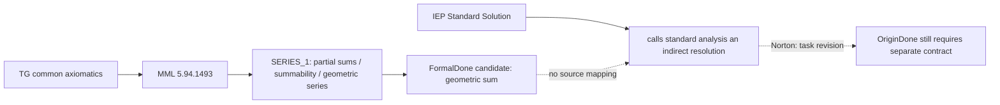

# C1A：Mizar/TG 到几何级数子理论的来源核验

> **身份：** `C1_SOURCE_ADMISSION_RESULT / ZFC_FOUNDED_EXTENSION_TO_SUBTHEORY / NOT_BARE_ZFC_CORE_CONTRACT`。
>
> **TaskCard：** [C1A](ZFC-META-SUBTHEORY-ADEQUACY-001-C1A-TASKCARD.md)。
>
> **判词：** `TG_AS_ZFC_FOUNDED_EXTENSION_SOURCE_SUPPORTED / TG_TO_GEOMETRIC_SERIES_SOURCE_CHAIN_ESTABLISHED_WITH_SCOPE / MIZAR_TO_IEP_PROMOTION_NOT_PAID / C1A_LOCAL_LEAF_CLOSED`。

## 1. 直接来源与冻结身份

| 来源 | 版本／身份 | 直接支持的事实 | 本地冻结 |
|---|---|---|---|
| [Mizar 首页](https://mizar.uwb.edu.pl/) | 读取 2026-10-05；页面称当前 Mizar 为 8.1.15、MML 为 5.94.1493（2025-05-30）。 | 本卡的 MML version label。 | 页面未提供 Git commit。 |
| [MML 基础页](https://mizar.uwb.edu.pl/library/) | 官方页面。 | MML 的基础是 built-in notions 与 TG 公理；其它文本经 Mizar 验证为那些公理的后果。 | 这是外部系统的验证说明，非本机 replay。 |
| [Mizar 2015 survey](https://mizar.uwb.edu.pl/people/romat/mizar-cicm2015.pdf) | 作者群的项目综述，第 13–14 页。 | TG 是 ZF 的非保守扩张；Tarski 公理给出 Grothendieck universe / inaccessible-cardinal 强度，因而本体论强于通常 ZFC。 | 它不能单独支付一个 TG→`ZFC with Choice` 的精确解释、保守性或相对一致性映射。 |
| [Mizar project CCL paper](https://wiki.mizar.org/project/CCL020525-gbpr.pdf) | Mizar project 的 CCL 说明；直接网页读取记录为 2026-10-05。 | 它把 MML 的 TG 描述为：ZF 中以 Tarski 公理取代 infinity，并说明 Choice 在该体系中作为 theorem 得到。 | 这支付 `TG ⊢` ZFC-style foundation relation 的来源级资格；它不使 TG 与 bare ZFC 同一。 |
| [MML role survey](https://link.springer.com/article/10.1007/s10817-017-9440-6) | JAR 2018，§3。 | `TARSKI_0` 是 ZF axioms、`TARSKI_A` 是 Tarski axiom；实数从原先 AXIOMS 中的定义性假定转为普通 Mizar 文章中逐步构造与证明。 | 这是 current MML structure 的独立学术说明。 |
| `https://mizar.uwb.edu.pl/version/current/mml/tarski_0.miz` | 2025-05-30 `Last-Modified`；SHA-256 `6adae7297e59304282567735e662d50a85e27b4e0cf2538b1403a0c60a1dfe2e`。 | extensibility、pair、union、regularity、Fraenkel replacement scheme 等基础条目。 | 不把列出的片段误报为完整 ZFC 公理表。 |
| `https://mizar.uwb.edu.pl/version/current/mml/tarski_a.miz` | 2025-05-30；SHA-256 `c564adf269d7c490070f518bcbebcaaade1ed7bb025bf6ffb810ed2db64476e0`。 | Tarski A：每个集合在满足闭包条件的系统中。 | 它展示 TG 的额外强度。 |
| `https://mizar.uwb.edu.pl/version/current/mml/series_1.miz` | 2025-05-30；61,041 bytes；SHA-256 `b130e347aaebb5ee85fbd5a71698c33ed147ab894d61cf9263bc3e8f2e8d6ef2`。 | `Partial_Sums`、summable 的定义、`Sum`，以及几何级数 theorem。 | 未在本机安装／重放 Mizar。 |

## 2. 已支付的 `M → S` 片段

`SERIES_1.miz` 定义：

```text
Partial_Sums(s).0 = s.0
Partial_Sums(s).(n + 1) = Partial_Sums(s).n + s.(n + 1)
s is summable  ↔  Partial_Sums(s) is convergent
Sum(s) = lim Partial_Sums(s)
```

同一版本的 source-local `Th22` 给出当 `a ≠ 1` 时 `Partial_Sums(a GeoSeq).n` 的封闭公式；`Th24` 给出：

```text
|a| < 1  →  a GeoSeq is summable ∧ Sum(a GeoSeq) = 1 / (1 - a).
```

因此，在 TG 共同基础的 MML 中，几何级数的部分和、收敛和和式有一个版本固定的 formal source identity。取 `a = 1/2`，再用同文 `Th10` 的常数缩放定理，可以构造通常 dichotomy 所用的 `1/2 + 1/4 + … = 1` 数学模型。这一最后的专门化是本项目的数学说明；当前卡尚未把它写成新的 Mizar theorem 或本机 machine proof。



## 3. 已支付的 foundation relation 与未支付的两条箭头

CCL paper 的系统说明补足了本卡原先必须保持开放的一点：它把 TG 描述为以更强 Tarski 公理替代 ZF 的 infinity，并报告 Choice 在其内成为 theorem。结合 2018 MML survey 对 `TARSKI_0` / `TARSKI_A` 和实数构造链的分工，这足以把本卡的 `M` 精确写成：

```text
M = version-fixed Mizar TG context,
    a source-supported extension strong enough to recover the ZFC-style
    foundation needed here, but not identical to bare ZFC.
```

这支付 `M → S` 的 foundation leg，且正是 SOP 所允许的“明确 ZFC-founded foundation context”。它没有支付 `M = bare ZFC`，也没有让 Mizar 的 MML consumer 成为 IEP 的历史或实际 consumer。

| 所需箭头 | 当前证据 | C1A 结论 |
|---|---|---|
| `TG/MML → ZFC-founded M` | CCL paper 的 TG/Choice 说明；JAR 2018 的 `TARSKI_0` / `TARSKI_A` 和实数构造说明。 | `SOURCE_SUPPORTED`；可作为 extension M，但不作为 bare ZFC itself。 |
| `SERIES_1 Th24 → IEP Standard Solution` | IEP 的 application source 没有引用 Mizar，Mizar source 也不讨论芝诺。 | `UNPAID`；它是 formalization analogue，不是 actual P consumer。 |
| `FormalDone → OriginDone` | Norton 来源明示 strict/revised Done 的改写；Mizar theorem 只陈述实分析对象。 | `UNPAID`；不可能由 Mizar theorem 自动支付 Bridge。 |

后两条空缺仍阻止本卡进入 C2–C6。特别是，TG 的强度不应被误读成“因此它比 bare ZFC 更能审查现实完成”，也不应被误读成“因此它代表数学共同体的 standard solution policy”。

## 4. 反控制

1. **Foundation control。** Mizar 的官方材料确实把 MML 条目连到一组集合论公理；这排除了“只是一个没有基础说明的实数库”的假阳性。
2. **Task control。** 既有 [A2 IEP/Norton 卡](20261004-ZFC-ACTUAL-Q-A2-标准解法来源完成合同.md) 明示 IEP/Norton 的 resolution policy 与 strict/revised task switch；它排除“任何证明几何级数的系统已支付运动完成”的假阳性。
3. **Replay control。** 本机 `command -v mizar` 无输出；本轮只记录外部可读 MML source 和官方 verification claim，不把它写为本机 Mizar checker 或内核重放。

## 5. 对总路线的影响

这是一条真正的、由 ZFC-founded extension 支撑的 `foundation → formal-analysis theorem` 关系，但尚没有进入核心合同。它关闭的是狭窄问题“可否仅凭 Mizar/TG source 把 ZFC-founded S 到 IEP 的全部 promotion／bridge 链条补上”：答案为否，范围如上。

它不支持下列任一结论：

- bare ZFC 有或没有理论精度不足；
- ZFC 或 TG 已把芝诺原任务解决；
- `FormalDone → OriginDone` 是或不是可证命题；
- 本项目已拥有 C6 machine-proof verdict。

下一叶必须寻找 **直接** 版本固定的 ZFC/ZFC-with-Choice `M → S` 基础关系，或寻找 foundation adequacy source；不能停在 Mizar，也不能退回 set.mm／ACL2／generic Gödel。
