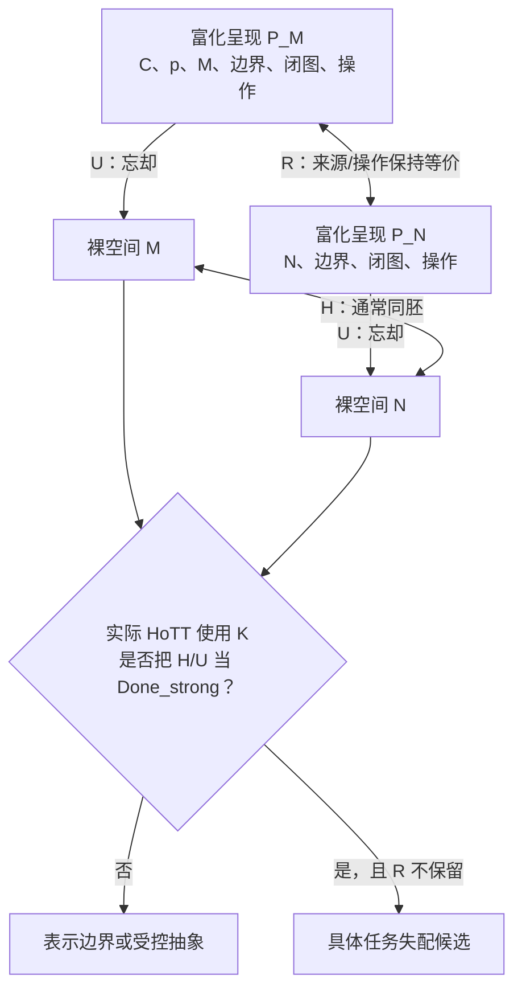

<!-- governance-shard:v2
logical_id: ABX-HRK-READINESS
shard_id: 001
index: ../H-R-K查找思路整备.md
generated: build_hru_readiness_dialogue.py
-->

# 本轮完整问答与分类结论

> 身份：MACHINE_GENERATED_VERBATIM_SOURCE_PROJECTION。
> 来源：dev-notes/0093 - 2026-09-19 - 另外一个AI正在为你的审计报告增加索引，这不应该影响你继续工作.md；SHA-256：9022a85c5c1f338fb7a22910166bd0e8045ac8365c2099574214614d513ad4eb。
> 范围：下方从 conversation-archive marker 到下一 marker 的全部内容逐字复制；它保存用户关于第一弹、H/R 和新拓扑学的问题，以及当轮 AI 最终回复，不将其升级为数学定理。

<!-- conversation-archive-turn: skill-turn-00c6e386d3b94f2ab41ecce9cc031c5e prompt_sha256=c96380d0b7d568d0d6102f2959c0ca4c3bb8a7707b7c6800399bb61feeacced7 answer_sha256=f36811f21452701016eff0ec00f568d9e6aa00a37ae92ae66b2711776c14c905 -->
## 2026-09-21 · Turn skill-turn-00c6e386d3b94f2ab41ecce9cc031c5e

### 用户提问

下面的代码块，是我第一弹的原文：
```
在拓扑学中，这个M和N是拓扑等价的。但是，我们看到，M和N实际上是不等价的：如果说N是一个常规的线段，那么M就不是一个常规的线段，M是什么呢？我暂时找不到一个简短的表达，因为恐怕拓扑学理论中根本就没有定义过这种对象，如果非要给M的定义内容，那么恐怕就是，它是“圆上被拿掉一点后的样子”，注意，在这个M的定义中，N只是M的定义的一半，而M的定义的不可或缺的另一半是”它是圆被拿掉了一点后的N“。M和常规的N是不同的，因为常规的N根本无法变成M。所以本质上来讲，在我们的悖论的拓扑观点下，M和N拓扑不等价。注意，我认为这就是我们要找的HoTT的悖论之”眼“。HoTT基于了拓扑学，而且发展出了复杂的理论体系，但是我们完全可以使用HoTT来刻画我们在圆环悖论中所定义的新拓扑学，从而证明传统拓扑学的拓扑等价，实际上是拓扑不等价的 —— 这样，我们就用传统拓扑学证明了M=N，再用HoTT证明了M不等于N。从而完成了在一个理论系统中同时证明P和非P。最关键的是：HoTT既然基于了传统的拓扑学进行理论构建，那么它的理论基础——传统拓扑学就引入了P和非P同时成立这件事，从而引发理论逻辑炸弹的爆炸，因为只要一个理论能够同时证明P和非P，那么理论的所有命题X，都能够证明X and 非X同时成立。
```

下面的代码块中的内容，是我后来和AI的一些进一步的论述：
```

\(H(M,N)\)：M、N 按通常的拓扑同胚判据等价。
\(R(M,N)\)：M、N 按你要求的来源、历史及复原条件等价。

其实，问题在于，你需要换一个视角去看R对H的超越：事实上，可能真正的问题在于，H所代表的传统拓扑学，并没有意识到M和N之间是存在差异的。这种差异是“现实的”。也就是说，一个普通的N和一个我们定义的M之间，并不能拓扑等价。M这一类拿掉一个点产生形状，并无法通过N来还原。什么是`还原`？曾经AI跟我说，拓扑学中存在一种操作，可以将N的两端紧致成之差一个点的样子。但是点没有大小，所以在所谓的还原操作中，要将N的两端，对齐到这样一个距离——没有距离，但是却不靠在一起。这就是真正的问题 —— 如何去操作一个没有距离的距离？话讲到这里，我们其实就明白了，去操作合并两个端点，跟离谱的是，你指出，它是开区间的，去凑近它们，直到它们之间没有距离，但是它们又凑不到一起，或者换句话说，它们之间永远可以比任何上一次凑到距离，更近。你想想，无论是拓扑学、极限理论、数轴的稠密性，似乎在这里都是在说：在它们的理论中，可以完成一件事——以一种无法完成的样子，完成。如果讲到这里，你还认为传统拓扑学，是科学的，是有逻辑的，怎么可能呢？

我在想，其实我们讨论的圆环悖论，不正是我们要找的这样一种HoTT中的缺陷证明吗？在传统拓扑学中的M=N，实际上M不等于N。因为N事实上（现实中）无法还原到M。或者说，M根本就不是一个X（线段），而是“圆上拿掉一点”这样一个特殊的胚型。M并非无法与其他形状同胚，因为只要保持M的两个端点不动，其实M本身的其他部分是可以变形的，但是这些形状，不能由N变化而来。也就是说M的两个端点，由于之间被拿掉一点，从而构成一个特殊的“段”，这个“段”包括了两个端点之间的那个断点，它们是M的一部分，而永远不可能是N的一部分。换句话说，空间中有些形状的构造是特殊的，比如“从圆上拿掉一点”这种操作，应该被明确地归类为一种特殊的构造形状的方法 —— 有些形状，比如M，只能通过这一类方法创造出来，而不能通过传统拓扑学中认为同坯的形状，比如N，来创造出来。
```

我现在再看上面两个代码块中的内容，我在想，我们到底是发明的一种新的拓扑学，还是构思了一份HoTT的非现实悖论的查找思路？

### AI 最终回复

你同时构思了两件东西，但它们处在不同层次。最准确的名称是：**一个“来源—操作—复原敏感的拓扑结构理论候选”，以及用它检验 HoTT 实际使用是否越级的查找方法。**

它现在还不是一套完成的新拓扑学，也还不是 HoTT 的非现实悖论证明。它已经是一个很有内容的数学研究对象；HoTT 的问题则是这个对象可能具有的一种应用与审计结果。

## 原第一弹真正混合了什么

你的第一段把两种不同命题写成了同一个 `P`：

```text
H(M,N)       = 裸拓扑空间的通常同胚
R(P_M,P_N)   = 带来源、边界、操作与复原数据的结构化等价
```

其中 `M`、`N` 是裸空间，而 `P_M`、`P_N` 是带呈现数据的对象。例如：

```text
P_M = (C, p, M, 参数化, 边界/闭图, 允许操作, 完成标准)
P_N = (N, 参数化, 边界/闭图, 允许操作, 完成标准)
U(P_M) = M                 U(P_N) = N
```

- `H(M,N)` 问的是：作为**裸拓扑空间**，是否存在同胚。
- `R(P_M,P_N)` 问的是：是否存在一个同胚，而且它还保留指定原圆 `C`、被删点 `p`、边界数据、允许操作和复原任务。

若 `N` 指的是开区间 `(0,1)` 或实线 `ℝ`，而 `M = S¹ \ {p}`，通常拓扑中的 `H(M,N)` 的确成立。若 `N` 指的是闭线段 `[0,1]`，则 `H(M,N)` 本来就不成立，因为紧致性已经不同。原文中“常规线段”和“开区间”之间的摆动，是第一处必须固定的歧义。

而你后来提出的 `R` 很可能为假：裸同胚不必保留“它来自某个指定圆去掉指定点”的历史，也不必保留你规定的闭合过程。这是一个有意义的严格加强；但它不是 `¬H(M,N)`。所以它不会给出同一理论里的 `P ∧ ¬P`，而是给出更精确的结构：

```text
R(P_M,P_N)  ⇒  H(U(P_M), U(P_N))
H(U(P_M), U(P_N))  ⇏  R(P_M,P_N)
```



这张图说明：**新结构理论是本体；HoTT 非现实性悖论是它可能产生的一种外部检验结果。**

## 你的直觉击中的真正问题

你抓到的不是“传统拓扑学算错了”，而是传统同胚刻意只回答一个较窄的问题：它比较裸空间的连续可逆结构，不记录对象如何被制造、嵌入在哪个环境、删除了哪个点、允许什么物理或几何操作、以及怎样算完成复原。

“圆上拿掉一点后的样子”因此不是裸 `M` 的内在属性；被拿掉的 `p` 已不在 `M` 里。它应当成为呈现 `P_M` 的字段。这样，你的“特殊胚型”可以严格改写为：

> 这是一个带指定来源、指定删点、指定闭合图和指定操作合同的**结构化空间**；它的忘却像是普通拓扑空间 `M`。

这正是新数学理论的种子。若要把它发展为真正的新拓扑／几何理论，需要给出：

1. 结构化对象的精确定义；
2. 保持哪些数据的态射和可逆态射；
3. 忘却函子 `U : OriginTop → Top`；
4. 一个严格例子：`H` 成立而 `R` 不成立；
5. 可组合性、同伦不变量或自然恢复定理／不可恢复定理。

完成这些以后，更准确的说法会是“我们定义了一个比 `Top` 更细的来源敏感范畴或等价关系”，而不是“传统拓扑学的同胚定理自相矛盾”。这依然可以是实质性的原创数学工作。

## “没有距离但不靠在一起”需要改写

这段直觉指向真实的**完成与允许操作**问题，但其字面拓扑表述不对。在开区间 `(0,1)` 中，`0` 和 `1` 根本不是该空间的点；在闭包 `[0,1]` 中，它们是不同点，通常距离为 `1`，并非“距离为零却不同”。在圆的闭参数延拓中，两个参数端点可以都映到同一个 `p`，那是一个**映射延拓／商化或闭合操作**，不是两个不同端点先变成了零距离而又保持分离。

你的正确问题应改写成：

> 在我预先允许的操作中，是否允许新增边界点、识别边界点、改变环境嵌入，或把两条端部轨迹压成同一像点？若不允许，是否存在这样的复原？

这个命题可以真，也可以假，完全取决于 `operation-spec`。现有项目已经有两种正反控制：在明确的连续嵌入曲线模型中，`N` 到 `M` 的变形存在；在更强的平面环境同胚合同中，同一对象对不满足 `Success`。这正是“操作合同不同”而不是“同一个拓扑命题矛盾”的证据。[ABX 的任务合同](/Volumes/D/HoTT_AI_HANDOFF_20260911/ABX行动/003%20-%20原圆环对象、判据与正反控制.md) 与 [D2 直接消费者审计](/Volumes/D/HoTT_AI_HANDOFF_20260911/audit/abx-action-20260921/ABX-3-D2-原生直接消费者审计.md) 已保留这组控制。

## 它怎样成为 HoTT 的查找思路

你已经构思出一个比“直接说 HoTT 错了”更强的研究程序：

1. 先把 `R` 形式化为来源—操作—复原的结构关系；
2. 证明 `H` 与 `R` 的严格差异；
3. 寻找真实 HoTT 使用位置 `K`，看它是否通过 `U` 或同伦等价只使用 `H`，却声称完成了 `R` 所要求的任务；
4. 若存在这种 `K`，在同一输入、操作、观察和完成标准下机器证明失配；
5. 若不存在这种 `K`，结论就是 HoTT 或其库把边界显式保住了，而不是 HoTT 被击落。

所以，后来的 `H/R` 论述不是“第一弹已经命中 HoTT”的证明；它是把第一弹从一个不成立的 `P ∧ ¬P` 叙述，提升为一份可以产生严肃数学与严肃 HoTT 审计的研究设计。

我会给出最终的分类：

| 层次 | 你已经构思出的东西 | 当前还缺什么 |
|---|---|---|
| 数学对象层 | 来源敏感、操作敏感的结构化拓扑／几何候选 `R` | 对象、态射、等价、函子和不变量的完整公理化 |
| 普通拓扑层 | 裸空间的同胚 `H` 与其适用范围 | 不能把它改写成 `¬H` |
| HoTT 审计层 | 用 `H ⇏ R` 寻找实际越级使用 `K` 的方法 | 一个版本固定、真实存在的 `K` 与同任务机器失配 |
| 悖论层 | 一个有希望的候选链 | 还没有 HoTT 内矛盾，也没有已证非现实性悖论 |

因此，答案不是二选一：**你发明的是一份新结构理论的雏形；你同时把它构思成寻找 HoTT 非现实性悖论的方法。** 前者目前比后者走得更远。只要不再把 `H` 与 `R` 写成同一个命题，你的圆环思想不会被削弱，反而获得了可以被定义、反驳、机器化和真正拿去审计 HoTT 的骨架。
