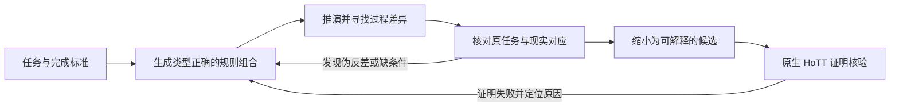

# 机器辅助统观与 HoTT 候选搜索方法

用户提问：

> 我现在其实在想，关于“统观”，是否存在系统化的、自动化的、机器寻找方法呢？

有。**而且，已经存在一类与“机器统观”相当接近的研究方法，叫作“理论探索”（theory exploration）：给机器一组定义和操作，让它主动生成猜想、寻找反例、发现辅助引理，再尝试证明。**

这比“我们先想出一个命题，然后让证明助手检查”更接近你现在想要的东西。但就我们的目标而言，还需要把理论探索与**程序合成、模型检查，以及对现实对应的审查**结合起来。现有工具提供了这些能力的部件；我查到的资料并没有建立一个可以直接输入整部 HoTT 和《核心认知》，就自动交付所需悖论的现成系统。

**首先，机器确实可以参与“出题”，不只是验题。**

几个已有方法能够说明这件事：

| 方法 | 机器能够主动做什么 | 对我们有什么用 |
|---|---|---|
| **理论探索：QuickSpec、Hipster** | 从给定的数据类型和函数出发，生成候选等式、条件关系或辅助引理，再测试或证明 | 主动寻找规则之间尚未被我们注意到的联系 |
| **反例引导的程序合成：CEGIS** | 在规定的候选程序空间里寻找满足规格的构造；失败时利用反例约束下一轮搜索 | 让失败改变后续候选，减少同类失败反复出现 |
| **模型寻找与模型检查：如 Alloy** | 在明确范围内寻找满足条件的结构，或违反某项断言的具体过程 | 自动生成小型、可展示的反例候选 |
| **反例引导的抽象精化：CEGAR** | 检查抽象模型中的反例能否对应到具体模型，并定位对应失败的位置 | 帮助追踪“抽象之后允许的过程，为什么在原过程里不能实现” |

这里要区分工具的证据强度：QuickSpec 官方说明，它输出的是经过测试、看起来成立的规律；Hipster 则把理论探索接到 Isabelle/HOL 中，包括自动寻找证明所缺的引理。[QuickSpec 官方项目](https://github.com/nick8325/quickspec)、[Hipster 原论文](https://arxiv.org/abs/1405.3426)

CEGIS 的关键是积累反例，使新候选必须通过此前失败的输入；Alloy 的结果则受指定模型范围约束，范围内没找到反例不能直接推广到范围外。[Solar-Lezama 的 CEGIS 说明](https://people.csail.mit.edu/asolar/SynthesisCourse2020/Lecture10.htm)、[Alloy 官方语言与分析规范](https://alloytools.org/spec.html)

**其次，对于我们的研究，最有价值的自动化对象应当是“理论化的过程”。**

我建议让机器搜索这样一条完整链：

这里每一项都可以有一定程度的机器化，但需要明确输入。

比如，我们不只问“截断会丢掉什么”，而是让机器组合若干合法操作，比较：

- 先组合过程，再抽象；先抽象，再组合——两条路线在既定任务下是否保持同样的行为？
- 单次使用时可以满足的条件，反复使用或放进反馈过程中是否仍能满足？
- 每个有限阶段能够交付某项结果，与整个过程已经完成之间，究竟需要哪一步连接？
- 为了把一个现实动作表达成理论操作，是否增加了统一选择、相干性、精确完成或内部担保的要求？

**这些都是搜索问题，不是预先断言它们必然产生悖论。** 机器的任务，是替我们寻找具体的对象、参数、操作顺序和关键步骤，使某个问题获得可检查的内容。

但搜索必须保留 HoTT 的真实类型、宇宙和消去条件。不能让生成器随意拼接一个非法转换，再把类型检查器拒绝它当作发现。

**其中，CEGAR 给了我们一个特别贴近你思想的启发。**

它会遇到一种情形：抽象模型存在一条反例轨迹，但这条轨迹无法对应到具体模型的执行。原方法会定位最早无法对应的位置，再精化抽象，排除这条虚假轨迹。[Clarke 等人的原论文](https://www.cs.cmu.edu/~emc/papers/Papers%20In%20Refereed%20Journals/Counterexample-guided%20abstraction%20refinement.pdf)

对你的研究，我的推断是：**这个“无法对应的位置”本身就值得被保留和解释。** 我们可以追问，是哪一次识别、遗忘、条件替换或组合，允许了原过程没有的行为；又需要付出什么代价才能恢复对应。

这给“抽象带来的非现实性”提供了一种系统搜索的技术入口。但还不能据此把普通抽象模型的虚假轨迹称作 HoTT 的 BUG。必须继续说明：这项抽象怎样由所研究的 HoTT 构造或明确的理论解释引入，所比较的究竟是不是原来的任务。

也就是说，机器可以帮助找到那个过程，研究者仍须把它与 HoTT 的关系讲成立。

**第三，“时间”和“时序”应当从搜索语言开始就分开保留。**

如果机器的全部输入只有状态、前后关系和截止时刻，那么它找到的主要会是时序与可用性问题。之后再要求它发现你所说的时间结构问题，就已经太晚了——搜索语言一开始没有给它这个空间。

因此，候选语言至少应允许两个不同的考察面：

- **时序面**：依赖顺序、输入可用性、构造与核验先后、在线过程、反馈。
- **时间与运动结构面**：连续或非连续的模型、稠密性、细分规则、尺度、极限与完成标准。

后一类不能靠有限状态穷举全部承担；有些候选需要符号推演和证明搜索。具体采用哪一种时间或运动模型，应当被列为待审查的建模前提，不能被偷偷当成已确认的物理事实。

同样，A 方向与 B 方向也应分别规定要寻找的现象。否则生成器可能不断找到“信息丢失”，却从来没有搜索“未完成被当成完成”的那一步。

**第四，自动化最需要防范的，是把我们的偏见写成搜索规则。**

这是我对这条路线最看重的限制。

如果规定“只有同阶段、同层不可用才值得搜”，机器就会忠实地遗漏其它方向。如果规定“只要能增加结构，原候选就全部作废”，机器就会混淆恢复信息与改变任务。如果规定“必须先有现实软件误用”，自主构造的空间就被拿掉了。

当前 C11 已修订为 v2，文本明确把判别格降为检查坐标，并承认时间结构、B 方向及逐行任务生成仍需展开。这比原版更适合作为搜索提示，但还不能直接翻译成自动筛除规则。[C11 v2](/Volumes/D/HoTT_AI_HANDOFF_20260911/理解章节/C11-HoTT理论经济账本与悖论位置判别-20260913.md:9)

我建议采用这样的分工：

**形式工具负责合法性、反例和证明；搜索器负责系统枚举与组合；LLM 和研究者负责提出、修订任务及解释对应关系。**

LLM 也可以生成新的候选语言和搜索策略，但这些修改必须可检查。不能让它既随意更换问题，又自己宣布新问题回答了原问题。

**最后，第一步可以很小，却必须让机器真正承担一次发现。**

我建议的最小试验是：

1. 从现有 Theory Schema 取一个边界明确的片段，固定规则、类型与可用操作。
2. 提供几种独立说明其意义的任务模板，以及少量已知正例、反例作校准。
3. 让机器按表达式大小或操作组合深度生成候选，同时寻找支持实例和反例。
4. 对发现的差异缩减对象与步骤，给出关键失败位置；“最小”只相对于本次搜索范围声明。
5. 把值得继续的候选送入匹配语义的原生 HoTT 系统核验，并审查其是否仍对应原任务。

第一次验收不应是“产生一千个候选”，也不应是“马上找到 HoTT BUG”。应当看：**它能否自动复现一个已知现象，同时发现一个未预先写入答案的关系或构造，并留下我们能够复核的理由。** 复现部分只算校准；新的关系也要进一步判断价值和已有研究是否覆盖。

还要始终保留“已反驳”“指定范围内未找到”“超时／未知”“已有证明”之间的区别。有限模型搜索、普通逻辑求解器的结果，不能未经保真说明就替代原生 HoTT 结论。

所以，我认为你现在提出的是一条值得发展的方向：**把“统观”从一次性的阅读与灵感，推进为不断生成、比较、反驳和修订的机器辅助理论探索。** 它能够系统扩大我们实际考察的范围；能否达到你要求的那个具体非现实性实例，仍要由实际搜索与证明回答。

---

## 范围与来源身份

文档性质：METHOD_SURVEY / ADAPTATION_PROPOSAL。日期：2026-09-13。本文是已有方法的来源转述和针对本项目的建议，不是新数学定理、不是已经实现的搜索系统，不修改当前 HoTT 研究队列。

本轮在上一轮完整四件套仍在会话上下文的基础上，重新加载 repo-cognitive-closure，检查当前 Git、STATE 的身份，并全文读当前 C11 v2 与 MEMORY 当前队列。没有声称本轮重新消费全部 research profile；也没有按较新的队列启动 ERCF-3 或对并行作者的新数学结论作出验证判断。

核查时 repo HEAD 为 7f7a2efcbf2d0e2d08eb8650b9750ffb14e97d2f，STATE revision 110；并行作者继续推进，后续读到 HEAD 8de12a56c017。当前核心仍为 generation-4 / 36 KC，SHA-256 为 7548bd1716915319932a3e5b7ba4df8fc13c8f4812df6e3f7a933f70b354877b。C11 v2 读取时 SHA-256 为 2afe57520cf12373e23e5ca759d14888ad027fc2be6f1c94c96cc3fe83f4611a。方案不依赖并行作者全部最新结果的真实性。

检索路由：先做一次本地语义搜索，工具返回 Transport closed；随后读取已知的精确路径。未重建索引、未扫描无关目录。公开研究使用内置 web，只采用作者论文、作者课程、项目官方资料。

来源阅读深度：

- QuickSpec：官方 README 中的能力、输入、条件等式及“测试后看起来成立”的边界。
- Hipster：作者论文 arXiv:1405.3426v1 的摘要与元数据，支持探索模式／证明辅助模式这一能力转述；未声称完整读过全部算法与实验。
- HipSpec：作者机构页面与论文摘要作交叉核对；最终建议不依赖其全部实验结论。
- CEGIS：Solar-Lezama 课程第 10 讲，读取规格、生成与检查循环、反例作用和非终止式失败示例说明。
- Alloy：官方 spec、check 说明及有限 scope 边界；不把外部模型的有效反例自动升级为 HoTT 反例。
- CEGAR：作者论文相关引言与 spurious trace／精化段落，未全读 43 页；本文对 HoTT 现实相对研究的用途是明确标识的推断。
- Nitpick 直接文档 URL 读取失败；虽搜索到历史官方资料，最终建议无需依赖未读完整的新版本手册，因此未把它列为本轮建议中的已资格化组件。

本文只提出最小试验，不自动安装 QuickSpec、Isabelle、Alloy，不创建后台任务，不调用其他 AI，不修改 shared HoTT/formal、C11 或 STATE。项目内只使用 canonical helper 追加本会话 dev-notes；此文独立留在 repo 外，无 Git commit/tag/push。

## 避免把搜索边界当成理论边界

候选语言、类型层级、项大小、模型基数、展开深度、求解器支持域和运行预算，是每一次搜索的实际边界。探索记录应当能够说明某条规则为什么没有进入候选、哪个问题被判非法、哪个问题只是尚未找到构造。范围有界是实现选择，不是 HoTT 只能讨论这些对象。

搜索中可以对“先抽象再组合”“先组合再抽象”等路线提出可比较的规格，但不能预设所有操作交换，也不能把两条合法路线有差别直接叫作错误。先明确本任务究竟要求保留什么，才能解释差异。

反例引导更新也应有范围：一个具体失败只能排除确实被它反驳的候选；概括为整个机制被排除，需要额外依据。启发式降低优先级、类型系统拒绝和已有定理排除，是三种不同的动作。

新关系的价值分为：搜索器此前未见、项目此前未记录、文献尚未找到对应、全领域原创性。这些层次不互相代替。机器自动复现已知现象，可以证明搜索链部分工作；不能把这个校准当研究突破。

本文没有给出保证整个 HoTT 搜索终止或找到目标悖论的定理，也没有用一般不完备性口号否定有界机器探索的价值。

## 逐 KC 对照

下表记录本轮方法考察如何响应原文，未触及的数学构造保留开放。没有生成共享 repo 的 applied checkpoint，也不以此表认证模型理解。

| KC | 关系 | 本轮落点与限制 |
|---|---|---|
| KC-000001 | ALIGNED | 分清找什么、怎么找、依据何在；来源方法与适配建议分开。 |
| KC-000002 | DEEPENED | Theory Schema 作为候选语言与规则来源，不重复建设百科地图。 |
| KC-000003 | ALIGNED | 时间结构的模型前提独立进入搜索；未认证物理离散性。 |
| KC-000004 | ALIGNED | 搜索前提、合法过程与差异的连接，未新增芝诺证明。 |
| KC-000005 | ALIGNED | 允许先产生候选，不要求最终归因先完成。 |
| KC-000006 | ALIGNED | 多种时间机制保持开放，不固定在时序或稠密性一项。 |
| KC-000007 | DEEPENED | LLM 可以提出任务与搜索语言，机器主动出题和反馈。 |
| KC-000008 | ALIGNED | 历史模式可作为任务模板来源，不作为新实例已成立的依据。 |
| KC-000009 | ALIGNED | 候选必须回查 HoTT 具体规则及其组合。 |
| KC-000010 | ALIGNED | 以具体理论化的现实相对现象为目标，不改成内部矛盾专搜。 |
| KC-000011 | DEEPENED | 把时序、可用性和理论操作的顺序列入生成语言。 |
| KC-000012 | ALIGNED | ASK 落实为任务、输入与合法性检查，不设万能决策器。 |
| KC-000013 | DEEPENED | 理论经济与抽象轨迹对应失配形成可检查搜索入口。 |
| KC-000014 | ALIGNED | 保留 B 方向，生成“未完成被提升为已取得”的候选。 |
| KC-000015 | ALIGNED | 强式哲学作为启发，不要求机器预设普遍规律为真。 |
| KC-000016 | ALIGNED | 类型拒绝非法转换不算发现悖论。 |
| KC-000017 | ALIGNED | 搜索语言和筛选规则可修订，避免自动复制已有偏见。 |
| KC-000018 | ALIGNED | 追踪抽象收益及现实条件变化；未证明强式 Z 律。 |
| KC-000019 | ALIGNED | 条件组合与运动模型要显式，未从合取规则推出额外定理。 |
| KC-000020 | ALIGNED | 物理前提保留为模型待审项，不作为搜索启动的无界前置。 |
| KC-000021 | ALIGNED | 区分资料查证、模型实验和原生机器证明；本轮没有新实验。 |
| KC-000022 | ALIGNED | A/B 分别规定目标现象，避免只有信息丢失一类输出。 |
| KC-000023 | DEEPENED | 以可定位的规则应用与失败位置回应“在哪里”的要求。 |
| KC-000024 | DEEPENED | 分开时序、时间结构、量词与完成顺序的候选语言。 |
| KC-000025 | ALIGNED | 自指不能靠命名；候选生成要有实际接口和过程。 |
| KC-000026 | NOT_TOUCHED | 未构造 HoTT 自身自指实例；不从未发现推豁免。 |
| KC-000027 | ALIGNED | 一般搜索方法可帮助寻找 HoTT 实例，专属性另验。 |
| KC-000028 | ALIGNED | 反馈与内部担保作为可探索任务；未给出无限自馈定理。 |
| KC-000029 | DEEPENED | 经济账本提供假设线索，实际操作链承担验证责任。 |
| KC-000030 | DEEPENED | 自动化经济结构探索的最小路径已提出，未实现。 |
| KC-000031 | ALIGNED | 表达任务可探索，但有限语法搜不到不能写成全理论不覆盖。 |
| KC-000032 | ALIGNED | 主动加入理想结构进入搜索空间，不只做遗忘后的恢复。 |
| KC-000033 | ALIGNED | 删除时序条件是一个任务模板方向，不扩大成通用解释。 |
| KC-000034 | ALIGNED | 删除、加入、识别与替换分别追踪。 |
| KC-000035 | ALIGNED | 任务翻译忠实性独立检查，机器不能随意换问题后自证成功。 |
| KC-000036 | NOT_TOUCHED | 不完备性和自我担保未新形式化；讨论有界搜索而非全域保证。 |

四件套归属：core_change=NO；direction_change=PROPOSED_ONLY；panorama_change=NO_NEW_MATHEMATICAL_RESULT；essay_change=NO；update_decision=EXTERNAL_METHOD_NOTE_ONLY。本轮是方法可行性考察，不改变并行作者的研究计划。

