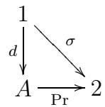

Reprints in Theory and Applications of Categories, No. 15, 2006, pp. 1–13.

# DIAGONAL ARGUMENTS AND CARTESIAN CLOSED CATEGORIES

## Author Commentary

In May 1967 I had suggested in my Chicago lectures certain applications of category theory to smooth geometry and dynamics, reviving a direct approach to function spaces and therefore to functionals. Making that suggestion more explicit led later to elementary topos theory as well as to the line of research now known as synthetic diferential geometry. The fuller development of those subjects turned out to involve a truth value object that classifies subobjects, but in the present paper (presented in the 1968 Battelle conference in Seattle) I refer only to weak properties of such an object; it is the other axiom, cartesian closure, that plays the central role.

Daniel Kan had recognized that the function space construction for simplicial sets and other categories is a right adjoint, thus unique. Because this uniqueness property of adjoints implies their main calculational rules, I took the further axiomatic step of defining functor categories as a right adjoint to the finite product construction in my 1963 thesis. In 1965, Eilenberg and Kelly introduced the term closed to mean that there is a hom functor valued in the category itself. Such a hom functor is characterized in a relative way as right adjoint to a given tensor product functor; we concentrate here on the absolute case where the tensor is cartesian.

Although the cartesian-closed view of function spaces and functionals was intuitively obvious in all but name to Volterra and Hurewicz (and implicitly to Bernoulli), it has counterexamples within the rigid framework advocated by Dieudonn´e and others. According to that framework the only acceptable fundamental structure for expressing the cohesiveness of space is a contravariant algebra of open sets or possibly of functions. Even though such algebras are of course extremely important invariants, their nature is better seen as a consequence of the covariant geometry of figures. Specific cases of this determining role of figures were obvious in the work of Kan and in the popularizations of Hurewicz’s k-spaces by Kelley, Brown, Spanier, and Steenrod, but in the present paper I made this role a matter of principle: the Yoneda embedding was shown to preserve cartesian closure, and naturality of functionals was shown to be equivalent to Bernoulli’s principle. Further, I posed the problem of comparing this principle to practice in the specific cases of smooth and recursive mathematics.

Later detailed work on those particular cases justified the classical intuition embodied in my general definition. In their books Froelicher and Kriegl (1988), and Kriegl and Michor (1997), extensively develop smooth analysis; their higher-order use of the adequacy of figures is based in part on a lower-order result of Boman 1967 (implicit in Hadamard) concerning the adequacy of paths. They cite the result of Lawvere-Schanuel-Zame showing that the natural functionals in this case are indeed the distributions of compact support, as practice would suggest. Nilpotent infinitesimals fall far short of even one-dimensionality, but if taken to be non-commutative, are already adequate for holomorphic functions, as was strikingly shown by Steve Schanuel (1982). The recursive example was studied by Phil Mulry (1982) who constructed a topos that does include as full sub-categories both the Banach-Mazur and the Ersov versions of higher recursive functionals.

I hope that in the future this adequacy of one-dimensional figures will be explained because it occurs in many diferent examples. Many kinds of cohesion (algebraic geometry, smooth geometry, continuous geometry) are well-expressed as a subtopos of the classifying topos of a finitary single-sorted algebraic theory. But often that algebraic theory is determined by its monoid M of unary operations via naturality only: for example, the binary operations, instead of being independently specified, are just the maps of right M-sets from M2 to M. If a common explanation can be found (for this adequacy of onedimensional considerations in the determination of n-dimensional and infinite-dimensional functionals, in so many disparate cases) it would further establish that the Eilenberg-Mac Lane notion of naturality is far more powerful than the mere tautology it is sometimes considered to be.

The original aim of this article was to demystify the incompleteness theorem of G¨odel and the truth-definition theory of Tarski by showing that both are consequences of some very simple algebra in the cartesian-closed setting. It was always hard for many to comprehend how Cantor’s mathematical theorem could be re-christened as a“paradox” by Russell and how G¨odel’s theorem could be so often declared to be the most significant result of the 20th century. There was always the suspicion among scientists that such extra-mathematical publicity movements concealed an agenda for re-establishing belief as a substitute for science. Now, one hundred years after G¨odel’s birth, the organized attempts to harness his great mathematical work to such an agenda have become explicit.

I thank the editors of TAC, and especially Christoph Schubert whose dedication and expertise made this reprint possible.

F. William Lawvere

Bufalo, N.Y.

19 February 2006

## Introduction

The similarity between the famous arguments of Cantor, Russell, G¨odel and Tarski is well-known, and suggests that these arguments should all be special cases of a single theorem about a suitable kind of abstract structure. We ofer here a fixed-point theorem in cartesian closed categories which seems to play this role. Cartesian closed categories seem also to serve as a common abstraction of type theory and propositional logic, but the author’s discussion at the Seattle conference of the development of that observation will be in part described elsewhere [“Adjointness in Foundations”, to appear in Dialectica, and “Equality in Hyperdoctrines and the Comprehension Schema as an Adjoint Functor”, to appear in the Proceedings of the AMS Symposium on Applications of Category theory].

## 1. Exponentiation, surjectivity, and a fixed-point theorem

By a cartesian closed category is meant a category C equipped with the following three kinds of right-adjoints: a right adjoint 1 to the unique

$$
\mathrm{C} \longrightarrow 1,
$$

a right adjoint × to the diagonal functor

$$
\mathbf {C} \longrightarrow \mathbf {C} \times \mathbf {C},
$$

and for each object A in C, a right-adjoint $( \mathbf { \nabla } ) ^ { A }$ to the functor

$$
\mathrm{C} \xrightarrow {A \times ()} \mathrm{C}.
$$

The adjunction transformations for these adjoint situations, also assumed given, will be denoted by $\delta , \pi$ in the case of products and by $\lambda _ { A } , \epsilon _ { A }$ in case of exponentiation by A. Thus for each X one has

$$
X \xrightarrow {X \lambda_ {A}} (A \times X) ^ {A}
$$

and for each Y one has

$$
A \times Y ^ {A} \xrightarrow {Y \epsilon_ {A}} Y.
$$

Given $f : A \times X \longrightarrow Y$ , the composite morphism

$$
X \xrightarrow {X \lambda_ {A}} (A \times X) ^ {A} \xrightarrow {f ^ {A}} Y ^ {A}
$$

will be called the “λ-transform” of the morphism f. A morphism $h : X \longrightarrow Y ^ { A }$ is the λ-transform of f if the diagram

$$
\begin{array}{c} A \times X \\ \Big \downarrow_ {A \times h} \Big \downarrow_ {f} \\ A \times Y ^ {A} \xrightarrow [ Y \epsilon_ {A} ]{} Y \end{array}
$$

is commutative, showing in particular that $f$ can be uniquely recovered from its λ- transform. Taking the case $X = 1$ , one has that every $f : A \longrightarrow Y$ gives rise to a unique $\displaystyle { } ^ { \Gamma } f ^ { \daleth } : 1 \longrightarrow Y ^ { A }$ and that every $1 \longrightarrow Y ^ { A }$ is of that form for a unique $f .$ . Since for every $a : 1 \longrightarrow A$ one has (dropping the indices $A , Y$ on  when they are clear)

$$
\langle a, \ulcorner f \urcorner \rangle \epsilon = a. f,
$$

one calls  the “evaluation” natural transformation; note however that we do not assume in general that $f$ is determined by the knowledge of all its “values” $a . f .$

Although we do not make use of it in this paper, the usefulness of cartesian closed categories as algebraic versions of type theory can be further illustrated by assuming that the coproduct

$$
2 = 1 + 1
$$

also exists in C. It then follows (using the closed structure), that for every object A

$$
A \times 2 = A + A
$$

and so in particular that 2 is a Boolean-algebra-object in C, i.e. that among the morphisms

$$
2 \times 2 \times \dots \times 2 \longrightarrow 2
$$

in C there are well determined morphisms corresponding to all the finitary (two-valued) truth tables, and that these satisfy all the commutative diagrams expressing the axioms of Boolean algebra. Equivalently, for each X the set

$$
P _ {\mathbf {C}} (X) = \mathbf {C} (X, 2)
$$

of “C-attributes of type $X ^ { \dag }$ becomes canonically an actual Boolean algebra, and varying X along any morphism of C induces contravariantly a Boolean homomorphism of attribute algebras. The morphisms 1  2 form $P _ { \mathbf { C } } ( 1 )$ the Boolean algebra of “truth-values”; among these are the two coproduct injections which play the roles of “true” and “false”. For any “constant of type $X ^ { \mathfrak { s } } \ : x : 1 \longrightarrow X$ and any attribute $\varphi$ of type $X , x . \varphi$ is then a truth-value. Now noting that

$$
X \times 2 ^ {X} \xrightarrow {(2) \epsilon_ {X}} 2
$$

is $\mathrm { a }$ “binary operation” we could write it between its arguments, so that we have

$$
x \in \ulcorner \varphi \urcorner = x. \varphi ,
$$

an equality of truth-values; thus if we think of $ { \boldsymbol { \varphi } } ^ { \top } : 1 \longrightarrow 2 ^ { X }$ as the constant naming the subset of X corresponding to the attribute $\varphi ,$ one sees that the above equation expresses the usual “comprehension” axiom.

Returning to our immediate concern, we define a morphism $g : X \longrightarrow Z$ to be pointsurjective if for every $z : 1 \longrightarrow Z$ there exists $x : 1 \longrightarrow X$ with $x . g = z$ . This does not imply that g is necessarily “onto the whole of $Z ^ { \dag }$ , since there may be few morphisms with domain 1; for example if (as in the next section) X and $Z$ are set-valued functors, then a natural transformation $g$ is point-surjective if every element of the inverse limit of $Z$ comes from an element of the inverse limit of $X$ . In case $Z$ is of the form $Y ^ { A } { } _ { ; }$ , an even weaker notion of surjectivity can be considered, which in fact sufices for our fixed point theorem. Namely

$$
X \xrightarrow {g} Y ^ {A}
$$

will be called weakly point-surjective if for every $f : A \longrightarrow Y$ there is x such that for every $a : 1 \longrightarrow A$

$$
\langle a, x g \rangle \epsilon = a. f
$$

Finally we say that an object Y has the fixed point property if for every endomorphism $t : Y \longrightarrow Y$ there is $y : 1 \longrightarrow Y$ with $y . t = y$

1.1. Theorem. In any cartesian closed category, if there exists an object A and a weakly point-surjective morphism

$$
A \xrightarrow {g} Y ^ {A}
$$

then $Y$ has the fixed point property.

Proof. Let $\overline { { g } }$ be the morphism whose λ-transform is $g .$ . Then for any $f : A { \longrightarrow } Y$ there is $x : 1 \longrightarrow A$ such that for all $a : 1 \longrightarrow A$

$$
\langle a, x \rangle \overline {{g}} = a. f.
$$

Now consider any endomorphism t of $Y$ and let $f$ be the composition

$$
A \xrightarrow {A \delta} A \times A \xrightarrow {\overline {{g}}} Y \xrightarrow {t} Y;
$$

thus there is x such that for all a

$$
\langle a, x \rangle \overline {{g}} = \langle a, a \rangle \overline {{g}} t
$$

since $a ( A \delta ) = \langle a , a \rangle$ . But then $y = \langle x , x \rangle { \overline { { g } } }$ is clearly a fixed point for t.

The famed “diagonal argument” is of course just the contrapositive of our theorem. Cantor’s theorem follows with $Y = 2$

1.2. Corollary. If there exists $t : Y \longrightarrow Y$ such that yt $\neq y$ for all $y : 1 \longrightarrow Y$ then for no A does there exist a point-surjective morphism

$$
A \longrightarrow Y ^ {A}
$$

(or even a weakly point-surjective morphism).

## 2. Russell’s Paradox is a case of Cantor’s theorem; natural functionals in recursive function theory and smooth manifold theory

Russell’s Paradox does not presuppose that set theory be formulated as a higher type theory; that is, for A the set-theoretical universe, we do not need $2 ^ { A }$ for the argument. In fact we need only apply the proof of our theorem, with $\overline { { { g } } } : A \times A \longrightarrow 2$ as the settheoretical membership relation, dispensing with g entirely. That is, more generally, our theorem could have been stated and proved in any category with only finite products (no exponentiation) by simply phrasing the notion of (weak) point-surjectivity as a property of a morphism

$$
A \times X \longrightarrow Y;
$$

however discovering the latter form (or at least calling it surjectivity!) seems to require thinking of such a morphism as a family of morphisms $A \longrightarrow Y$ indexed by the elements of X, suggesting that a closed category is the “natural” setting for the theorem.

In fact the more general form of the theorem just alluded to (for categories with products) follows from the cartesian closed version which we have proved, by virtue of the following remark. Notice that it would sufice to assume C small (just take the full closure under finite products of the two objects A, Y ).

2.1. Remark. Any small category C can be fully and faithfully embedded in a cartesian closed category in a manner which preserves any products or exponentials that may exist in C.

Proof. We consider the usual embedding

$$
\mathrm{C} \longrightarrow \mathcal {S} ^ {\mathrm{C} ^ {\mathrm{op}}}
$$

which identifies an object Y with the contravariant set-valued functor

$$
X \longmapsto \mathbf {C} (X, Y).
$$

By “Yoneda’s Lemma” one has for any functor Y and any object A that the value at A of Y

$$
A Y \cong \mathcal {S} ^ {\mathrm{C} ^ {\mathrm{op}}} (A, Y)
$$

where the right hand side denotes the set of all natural transformations from (the functor corresponding to) A into $Y .$ , so that in particular the embedding is full and faithful. It is then also clear that the embedding preserves products (in particular if 1 exists in C it corresponds to the functor that is constantly the one-element set, which is the 1 of $S ^ { \mathbf { C } ^ { \mathrm { { o p } } } } )$ ). For any two functors A, Y the functor

$$
C \longmapsto \mathcal {S} ^ {\mathbf {C} ^ {\mathrm{op}}} (A \times C, Y)
$$

plays the role of $Y ^ { A }$ . In particular if $B ^ { A }$ exists in C for a pair of objects A, B in C then

$$
(C) B ^ {A} \cong \mathbf {C} (C, B ^ {A}) \cong \mathbf {C} (A \times C, B) \cong \mathcal {S} ^ {\mathbf {C} ^ {\mathrm{op}}} (A \times C, B)
$$

showing that the embedding preserves exponentiation.

2.2. Theorem. Let A, Y be any objects in any category with finite products (including the empty product 1); then the following two statements cannot both be true

a) there exists ${ \overline { { g } } } : A \times A \longrightarrow Y$ such that for all $f : A { \longrightarrow } Y$ there exists $x : 1 \longrightarrow A$ such that for all $a : 1 \longrightarrow A$

$$
\langle a, x \rangle \overline {{g}} = a. f
$$

b) there exists $t : Y \longrightarrow Y$ such that for all $y : 1 \longrightarrow Y$

$$
y. t \neq y.
$$

Proof. Apply above remark and the proof in the previous section.

Of course the “transcendental” proof just given is somewhat ridiculous, since the incompatibility of a) and b) can be proved directly just as simply as it was proved in the previous section under the more restrictive hypothesis on C. However we wish to take the opportunity to make some further remarks about the above canonical embedding of an arbitrary (small) category into a cartesian closed category $\overline { { \mathbf { C } } }$ (let the latter denote the smallest full cartesian closed subcategory of $S ^ { \mathbf { C } ^ { \mathrm { { o p } } } }$ which contains C). One of the standard ways of embedding a structure into a higher-order structure is to consider “definable” functionals, operators, etc.; however this is dificult to oversee from a simple-minded point of view since it usually requires enumerating all possible definitions. On the other hand in many situations (e.g. functorial semantics of algebraic theories or functorial semantics of elementary theories if the elementary theories are complete) one has come to expect that natural transformations are identical with definable ones or at least a reasonable substitute for definable ones. The latter alternative seems to be a least partly true in the present case. Thus for example we are led to the following definition. If A, $B , C , D$ are objects in a category C with finite products, a natural operator

$$
B ^ {A} \xrightarrow {\Phi} D ^ {C}
$$

shall be simply a natural transformation between the exponential functors of the (functors corresponding to the) given objects in $S ^ { \mathbf { C } ^ { \mathrm { { o p } } } }$ (hence in $\overline { { \mathbf { C } } } )$ . In particular if $C = 1$ we would call a natural operator a natural functional. Note that 1 will not be a generator for all of $S ^ { \mathbf { C } ^ { \mathrm { { o p } } } }$ unless $\mathbf { C } = 1 \mathrm { { : } }$ ; however it might conceivably be so for ${ \overline { { \mathbf { C } } } } ,$ and we have a partial result in that direction. In fact, in the case that 1 is a generator for C itself, we can describe in more familiar terms what a natural operator is.

Recall that “1 is a generator for $\mathbf { C } ^ { \mathfrak { s } }$ simply means that a morphism $f : X \longrightarrow Y$ in C is determined by its “values” $x . f : 1 \longrightarrow Y$ for $x : 1 \longrightarrow X$ . In that case it is sensible to call the elements of the set $\mathbf { C } ( 1 , X )$ of points of X also the elements of X. Then a function

$$
\mathbf {C} (1, X) \longrightarrow \mathbf {C} (1, Y)
$$

is induced by at most one C-morphism $X \longrightarrow Y$ , and in case it is, we say by abuse of language that the function is a morphism of C.

2.3. Proposition. Suppose that C is a category with finite products in which 1 is a generator, and A, B, C, D are objects of C. Then

1) a natural operator

$$
B ^ {A} \xrightarrow {\Phi} D ^ {C}
$$

is entirely determined by a single function

$$
\mathbf {C} (A, B) \xrightarrow {1 \Phi} \mathbf {C} (C, D)
$$

and

2) such a function determines a natural operator if for every object X of C and for every C-morphism $f : A \times X \longrightarrow B$ , the function

$$
\mathbf {C} (1, C \times X) \xrightarrow {(f) (X \Phi)} \mathbf {C} (1, D)
$$

is a C-morphism, where (f)(XΦ) is defined by

$$
\langle c, x \rangle ((f) (X \Phi)) = (c) ((f _ {x}) (1 \Phi))
$$

for any $c : 1 \longrightarrow C , x : 1 \longrightarrow X$ , f denoting the composition

$$
A \cong A \times 1 \xrightarrow {A \times x} A \times X \xrightarrow {f} B.
$$

Proof. We are abusing notations to the extent of identifying a morphism with its λ- transform via the bijections of the form

$$
\mathbf {C} (A \times X, B) \cong \overline {{\mathbf {C}}} (A \times X, B) \cong \overline {{\mathbf {C}}} (X, B ^ {A}).
$$

Actually the given operator $\Phi$ is a family of functions

$$
\mathbf {C} (X, B ^ {A}) \xrightarrow {X \Phi} \mathbf {C} (X, D ^ {C})
$$

one for each object of C; the “naturalness” condition that this family must satisfy is, via the abuse, that for every morphism $x : X ^ { \prime } { \longrightarrow } X$ of C, the diagram

$$
\begin{array}{c} \mathbf {C} (A \times X, B) \xrightarrow {X \Phi} \mathbf {C} (C \times X, D) \\ \Big \downarrow_ {x} \qquad \qquad \qquad \qquad \Big \downarrow_ {x} \\ \mathbf {C} (A \times X ^ {\prime}, B) \xrightarrow [ X ^ {\prime} \Phi ]{} \mathbf {C} (C \times X ^ {\prime}, D) \end{array}
$$

should commute. Now let $X ^ { \prime } = 1$ . Since 1 is a generator for C, the value of the function XΦ at a given $f : A \times X \longrightarrow B$ is determined by the knowledge, for each element x of

X and each element $c$ of $C ,$ the result reached in the lower right hand corner by going first across, then down, in the commutative diagram

$$
\begin{array}{c} \mathbf {C} (A \times X, B) \xrightarrow {X \Phi} \mathbf {C} (C \times X, D) \xrightarrow {c} \mathbf {C} (X, D) \\ x \Biggl \downarrow \qquad \qquad \qquad \qquad \Biggl \downarrow x \\ \mathbf {C} (A, B) \xrightarrow [ 1 \Phi ]{} \mathbf {C} (C, D) \xrightarrow [ c ]{} \mathbf {C} (1, D). \end{array}
$$

But since the same results are obtained by going down, then across, all the functions XΦ are determined by one function 1Φ, proving the first assertion. The second assertion is then clear, since the definition of $( f ) ( X \Phi )$ given in the statement of the proposition is just such as to assure naturality of XΦ provided its values exist. 7

To make the situation perfectly clear, notice that morphisms whose codomain is an exponential object can be discussed even though the exponential object does not exist, just by considering instead morphisms whose domain is a product. There is however then the problem of determining the morphisms whose domain is an exponential, and considering them to be the natural operators is in many contexts the smoothest and most “natural” thing to do. Experts on recursive functions or $C ^ { \infty }$ functions between finite-dimensional manifolds may wish to consider the result of taking C to be these particular categories in the above considerations. They may also wish to consider whether the fixed-point theorem of section one has any applications in those cases.

## 3. Presentation-free formulations of satisfaction, truth, and provability according to G¨odel and Tarski; representability vs. definability

In order to apply the theorem of the previous section to obtain Tarski’s theorem concerning the impossibility of defining truth for a theory within the theory itself, we first note briefly how a theory gives rise to a category C with finite products. Consider two objects A, 2 and let the C-morphisms be equivalence classes of (tuples of) formulas or terms of the theory, where two formulas (or terms) are considered equivalent if their logical equivalence (or equality) is provable in the theory. Thus the morphisms $1 \longrightarrow A$ are (classes of) constant terms, the morphisms $A \times A \longrightarrow A$ are (classes of) terms with two free variables, while morphisms $A ^ { n } \longrightarrow 2$ are (classes of) formulas with n free variables so that in particular morphisms $1 \longrightarrow 2$ are (classes of) sentences of the theory. In particular there is a morphism true : 1  2 corresponding to the class of sentences provable in the theory and similarly a morphism false : $: 1 \longrightarrow 2$ corresponding to the class of sentences whose negation is provable in the theory. Morphisms $2 ^ { n } \longrightarrow 2$ would include all propositional operations, but we will make no use of that except for the following case:

If the theory is consistent there is a morphism not $\colon 2 \longrightarrow 2$ such that ϕ not $\neq \varphi$ for all morphisms $\varphi : 1 \longrightarrow 2$

In particular we will not need to use the fact that $2 = 1 + 1$ , although that determines the nature of those hom-sets not explicitly spelled out above. Defining composition to correspond to substitution (for example a constant $a : 1 \longrightarrow A$ composed with a unary formula $\varphi : A \longrightarrow 2$ composed with not gives the sentence $a \varphi$ not : $; 1 \longrightarrow 2$ , etc.) we get a category C with finite products which might be called the Lindenbaum category of the theory. Models of the theory can then be viewed as certain functors $\mathbf { C } \longrightarrow S$ . We make no use here of the operation in C induced by quantification in the theory, but the categorical description of this operation will be clear to readers of the two papers cited in the introduction. In our construction above of C we have tacitly assumed that the theory was a first order single-sorted one, in which case all objects of C are isomorphic to those of the form $A ^ { n } \times 2 ^ { m }$ , but with trivial modification we could have started with a higher-order or several-sorted theory with no change of any significance to the arguments below. To make one point somewhat more explicit note that the projection morphisms $A ^ { n } \longrightarrow A$ arise from the variables of the theory.

We then say that satisfaction is definable in the theory if there is a binary formula sat : $A \times A \longrightarrow 2$ in C such that for every unary formula $\varphi : A \longrightarrow 2$ there is a constant $c : 1 { \longrightarrow } A$ such that for every constant a the following diagram commutes in C

$$
\begin{array}{c} 1 \xrightarrow {a} A \\ \langle a, c \rangle \Biggl \downarrow \\ A \times A \xrightarrow [ \text {sat} ]{} 2 \end{array}
$$

Here we imagine taking for $c \mathrm { ~ a ~ }$ G¨odel number for (one of the representatives of) $\varphi .$ The condition would traditionally be expressed by requiring that the sentence

$$
a \text {   sat   } c \iff a \varphi
$$

be provable in the theory, but if C arises from our construction of the Lindenbaum category this amounts to the same thing.

Combining the above notion with our remark about the meaning of consistency and the theorem of the previous section we have immediately the

3.1. Corollary. If satisfaction is definable in the theory then the theory is not consistent.

In order to show that Truth cannot be defined we first need to say what Truth would mean; that seems to require some further assumptions on the theory, which are however often realizable. Namely we suppose that there is a binary term

$$
A \times A \xrightarrow {\mathrm{subst}} A
$$

in C and a (“metamathematical”) binary relation

$$
\Gamma \subseteq \mathbf {C} (1, A) \times \mathbf {C} (1, 2)
$$

between constants and sentences for which the following holds.

1) For all $\varphi : A \longrightarrow 2$ there is $c : 1 \longrightarrow A$ such that for all $a : 1 \longrightarrow A$

(a subst c)Γ(aϕ)

For example we could imagine that dΓσ means that d is the G¨odel number of some one of the sentences that represent σ, and that subst is a binary operation which, when applied to a constant a and to a constant c that happens to be the G¨odel number of a unary formula ϕ, yields the G¨odel number of the sentence obtained by substituting a into $\varphi .$

Given a binary relation $\Gamma \subseteq \mathbf { C } ( 1 , A ) \times \mathbf { C } ( 1 , 2 )$ we say that Truth (of sentences) is definable in the theory (relative to Γ) provided there is a unary formula Truth : $A \longrightarrow 2$ such that

2) For all $\sigma : 1 \longrightarrow 2$ and d : 1  A, if dΓσ then dTruth = σ.

Again the traditional formulation would require that the sentence

$$
\lceil \sigma \rceil \text {Truth} \Longleftrightarrow \sigma , \quad \text {for} \lceil \sigma \rceil \Gamma \sigma
$$

be provable, but in the Lindenbaum category this just amounts to the equation $\Gamma \sigma \mathrm { ^ { 7 } T r u t h = }$ σ.

3.2. Theorem. If the theory is consistent and substitution is definable relative to a given binary relation Γ between constants and sentences, then Truth is not definable relative to the same binary relation.

Proof. If both 1) and 2) hold then the diagram

$$
\begin{array}{c} 1 \xrightarrow {a} A \\ \langle a, c \rangle \Biggl \downarrow \quad \Biggl \backslash d \\ A \times A \xrightarrow [ \text {subst} ]{} A \xrightarrow {} 2 \\ \text {Truth} \end{array}
$$

shows that

$$
\begin{array}{c} A \times A \xrightarrow {\text { subst }} A \\ \searrow \quad \downarrow \text {   Truth   } \\ 2 \end{array}
$$

is a definition of satisfaction, contradicting the previous result.

We will also prove an “incompleteness theorem”, using the notion of a Provability predicate. Given a binary relation Γ between constants and sentences, we say that Provability is representable in the theory if there is a unary formula $\operatorname* { P r } : A \longrightarrow 2$ such that

3) Whenever dΓσ then $d { \mathrm { P r } } = { \mathrm { t r u e ~ i f f ~ } } \sigma = { \mathrm { t r u e } }$

3.3. Theorem. Suppose that for a given binary relation Γ between constants and sentences of C, substitution is definable and Provability is representable. Then the theory is not complete if it is consistent.

Proof. Suppose on the contrary that $\mathbf { C } ( 1 , 2 ) = \{ \mathrm { f a l s e } , \mathrm { t r u e } \}$ . Our notion of consistency implies that false $\neq$ true. Condition 3) states that for dΓσ

a) σ = true implies $d { \mathrm { P r } } = { \mathrm { t r u e } }$

b) $\sigma \ne$ true implies dPr $\neq$ true

By completeness b) implies

b’) σ = false implies dPr = false

But a) and b’) together with completeness mean that whenever dΓσ,

is commutative, i.e. that $\mathrm { P r }$ satisfies condition 2) for a Truth-definition, which by our previous theorem yields a contradiction. 厂

Note: Our proposition in section 2. can be interpreted as a fragment of a general theory developed by Eilenberg and Kelly from an idea of Spanier.

## Appendix

Shortly after this article was published I realized that the relation Γ used in section 3. is actually superfluous for the purpose at hand. A mere existential condition sufices because the trace of a specific G¨odel numbering is not required. The essential content of the contrast between provability (attainable) and a truth definition (unattainable) can as well be expressed simply by requiring less of a given map of the satisfaction type: for every unary formula $\phi$ there should exist a number c that B-represents it in the sense that for every number a the satisfaction map gives the result of substituting a into $\phi$

$$
a \mathrm{sat} c = a \phi
$$

but only in case both sides of the equation are in the specified subset $B \subseteq \mathbf { C } ( 1 , 2 )$ . The usual meaning of representability and provability is thus expressed if B contains at least the two elements true and false; by contrast, completeness is represented if $B = \mathbf { C } ( 1 , 2 )$ in other words, if all nullary formulas are in B. However, if the present point of view is to be extended to include also G¨odel’s second incompleteness theorem, a specific relation between formulas and their numbers may be required.

Mathematics Department, State University of New York

244 Mathematics Building, Bufalo, N.Y. 14260-2900 USA

Email: wlawvere@buffalo.edu

This article may be accessed from http://www.tac.mta.ca/tac/reprints or by anonymous ftp at ftp://ftp.tac.mta.ca/pub/tac/html/tac/reprints/articles/15/tr15.{dvi,ps}

REPRINTS IN THEORY AND APPLICATIONS OF CATEGORIES will disseminate articles from the body of important literature in Category Theory and closely related subjects which have never been published in journal form, or which have been published in journals whose narrow circulation makes access very dificult. Publication in ‘Reprints in Theory and Applications of Categories’ will permit free and full dissemination of such documents over the Internet. Articles appearing have been critically reviewed by the Editorial Board of Theory and Applications of Categories. Only articles of lasting significance are considered for publication. Distribution is via the Internet tools WWW/ftp.

Subscription information. Individual subscribers receive (by e-mail) abstracts of articles as they are published. To subscribe, send e-mail to tac@mta.ca including a full name and postal address. For institutional subscription, send enquiries to the Managing Editor.

Selection of reprints. After obtaining written permission from any copyright holder, any three TAC Editors may propose a work for TAC Reprints to the Managing Editor. The proposal will be reported to all Editors. The Managing Editor may either accept the proposal or require that the Editors vote on it. Before such a vote, the author, title and original publication data will be circulated to Editors. If a 2/3 majority of those TAC Editors responding within one month agrees, the work will be accepted for TAC Reprints. After a work is accepted, the author or proposer must provide to TAC either a usable TeX source or a PDF document acceptable to the Managing Editor that reproduces a typeset version. Up to five pages of corrections, commentary and forward pointers may be appended by the author. When submitting commentary, authors should read and follow the Format for submission of Theory and Applications of Categories at http://www.tac.mta.ca/tac/.

Managing editor. Robert Rosebrugh, Mount Allison University: rrosebrugh@mta.ca

TEXnical editor. Michael Barr, McGill University: mbarr@barrs.org

Transmitting editors. Richard Blute, Universit´e d’ Ottawa: rblute@mathstat.uottawa.ca Lawrence Breen, Universit´e de Paris 13: breen@math.univ-paris13.fr Ronald Brown, University of North Wales: r.brown@bangor.ac.uk Aurelio Carboni, Universit\`a dell Insubria: aurelio.carboni@uninsubria.it Valeria de Paiva, Xerox Palo Alto Research Center: paiva@parc.xerox.com Ezra Getzler, Northwestern University: getzler(at)math(dot)northwestern(dot)edu Martin Hyland, University of Cambridge: M.Hyland@dpmms.cam.ac.uk P. T. Johnstone, University of Cambridge: ptj@dpmms.cam.ac.uk G. Max Kelly, University of Sydney: maxk@maths.usyd.edu.au Anders Kock, University of Aarhus: kock@imf.au.dk Stephen Lack, University of Western Sydney: s.lack@uws.edu.au F. William Lawvere, State University of New York at Bufalo: wlawvere@acsu.buffalo.edu Jean-Louis Loday, Universit´e de Strasbourg: loday@math.u-strasbg.fr Ieke Moerdijk, University of Utrecht: moerdijk@math.uu.nl Susan Niefield, Union College: niefiels@union.edu Robert Par´e, Dalhousie University: pare@mathstat.dal.ca Jiri Rosicky, Masaryk University: rosicky@math.muni.cz Brooke Shipley, University of Illinois at Chicago: bshipley@math.uic.edu James Stashef, University of North Carolina: jds@math.unc.edu Ross Street, Macquarie University: street@math.mq.edu.au Walter Tholen, York University: tholen@mathstat.yorku.ca Myles Tierney, Rutgers University: tierney@math.rutgers.edu Robert F. C. Walters, University of Insubria: robert.walters@uninsubria.it R. J. Wood, Dalhousie University: rjwood@mathstat.dal.ca