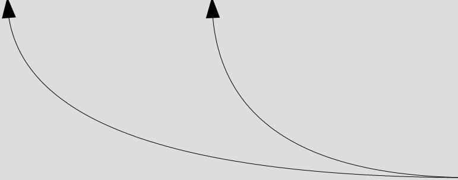
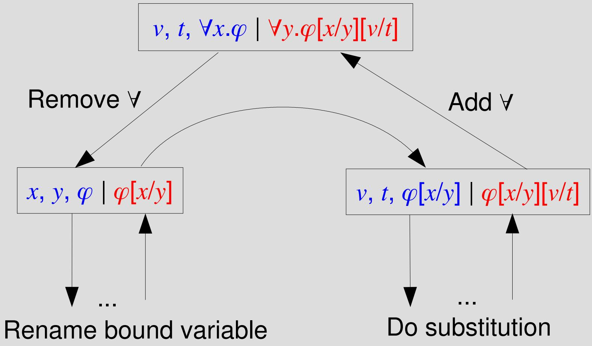

# Essential Incompleteness of Arithmetic Verified by Coq

Russell O’Connor Radboud University Nijmegen University of California at Berkeley

TPHOLS 2005

August 23, 2005

## Essential Incompleteness of Arithmetic Verified by Coq

1.Statement of incompleteness theorem

2.Coding by natural numbers

3.Primitive recursive functions

4.Corollaries of incompleteness theorem

5.Discussion of formalization

6.Future Work: Second incompleteness theorem

## Gödel-Rosser Incompleteness Theorem

For any decidable axiom system T extending NN such that T can express its own axioms, there exists a sentence G such that if either $T \vdash G$ or $T \vdash \lnot G$ then T is inconsistent.

## Gödel-Rosser

## Incompleteness Theorem

For any decidable axiom system T extending NN such that T can express its own axioms, there exists a sentence G such that if either $T \vdash G$ or $T \vdash \lnot G$ then T is inconsistent.

Inductive data types for:

●Terms

●First order formulas

●Proofs

## Gödel-Rosser Incompleteness Theorem

For any decidable axiom system T extending NN such that T can express its own axioms, there exists a sentence G such that if either T ⊢ G or T ⊢ ¬G then T is inconsistent.

Recursive functions for:

●Free variables

●Substitution

## Gödel-Rosser Incompleteness Theorem

For any decidable axiom system T extending NN such that T can express its own axioms, there exists a sentence G such that if either $T \vdash G$ or $T \vdash \lnot G$ then T is inconsistent.

A formula with no free variables

## Gödel-Rosser Incompleteness Theorem

For any decidable axiom system T extending NN such that T can express its own axioms, there exists a sentence G such that if either $T \vdash { \widehat { G } }$ or T ⊢ ¬G then T is inconsistent.

Formula ⇒ Prop(think Formula ⇒ type)

## Gödel-Rosser

## Incompleteness Theorem

For any decidable axiom system T extending NN such that T can express its own axioms, there exists a sentence G such that if either T ⊢ G or $T \vdash \lnot G$ then T is inconsistent.

A finite axiomatization of:

$$
0, S, +, \times , <
$$

without induction

## Gödel-Rosser

## Incompleteness Theorem

For any decidable axiom system T extending NN such that T can express its own axioms, there exists a sentence G such that if either $T \vdash G$ or $T \vdash \lnot G$ then T is inconsistent.

For every formula φ, $T \vdash \varphi$

## Gödel-Rosser

## Incompleteness Theorem

For any decidable axiom system T extending NN such that T can express its own axioms, there exists a sentence G such that if either $T \vdash G$ or $T \vdash \lnot G$ then T is inconsistent.

●For every formula $\varphi , \varphi \in T$ or φ∉T

●Classically this is trivially true

●This is not the recursive requirement.

## Gödel-Rosser Incompleteness Theorem

For any decidable axiom system T extending NN such that T can express its own axioms, there exists a sentence $\dot { \boldsymbol { G } }$ such that if either $T \vdash G$ or $T \vdash \lnot G$ then T is inconsistent.

This replaces the requirement that T is recursive This is weaker that T being recursive

## T Can Express Its Own Axioms

There exists a formula with one free variable $\varphi ( x )$ such that

● If $\psi \in T$ then $T \vdash \varphi ( \bar { \^ { \dag } \psi ^ { \dag } } )$

● If $\psi \notin T$ then $T \vdash \lnot \varphi ( \bar { \Psi } ^ { \top } )$

## T Can Express Its Own Axioms

There exists a formula with one free variable $\varphi ( x )$ such that

● If $\psi \in T$ then $T \vdash \varphi ( { \bar { \^ { } } } \psi ^ { \top } )$

● If $\psi \notin T$ then $T \vdash \lnot \varphi ( \bar { \Psi } ^ { \top } )$

$5 y -$ is ψ coded by a number written as a closed term.

## Coding

● Extensive use of Cantor Pairing Function

$$
c P a i r (a, b) = a + \sum_ {i = 1} ^ {a + b} i
$$

Formulas are coded by giving each symbol a number and pairing it with its recursively coded arguments.

● No prime number decomposition theorem is needed.

## Primitive Recursive Functions

Inductive data type for primitive recursive expressions

Evaluation function for primitive recursive expressions

Every primitive recursive function is representable in NN

– Requires Chinese remainder theorem and Gödel’s beta function

## Primitive Recursive Functions

● Inductive expressi

An n-ary function, f, is representable by φ in T if $T \vdash \varphi ( x _ { 0 } , \lceil a _ { 1 } \rceil , . . . , \lceil a _ { n } \rceil ) \Leftrightarrow x _ { 0 } = \lceil f ( a _ { 1 } , . . . , a _ { n } ) \rceil$

Evaluatio expressions

Every primitive recursive function is representable in NN

– Requires Chinese remainder theorem and Gödel’s beta function

## Substitution Is Primitive Recursive

● Recursion on depth does not work.

Course-of-values recursion does not work. – Recursive call’s input may have a larger code than the original input.

● Instead consider the trace of the computation – A primitive recursive function can check if a trace is correct

– Do a bounded search for the correct trace

## Substitution Is Primitive Recursive

Remove ∀

## Corollaries

● Gödel Sentence with ω-consistency

If PA is consistent then PA is essentially incomplete.

## Corollaries

● Gödel Sentence with ω-consistency

If PA is consistent then PA is essentially incomplete.

Proved that PA is consistent

## Corollaries

● Gödel Sentence with ω-consistency

● PA is essentially incomplete.

## Corollaries

● Gödel Sentence with ω-consistency

● PA is incomplete.

## Machine Verified Proofs

● 1986 – Shankar – Boyer-Moore

– Incompleteness for any finite extension of Z2 (hereditarily finite set theory)

● 2003 – O’Connor – Coq

– Incompleteness for any “nice” extension of NN

● 2004 – Harrison – HOL-Light

Incompleteness for any $\sum _ { 1 }$ -complete system with $\sum _ { 1 }$ -definable axioms

## The Good

● No changes in Coq were made.

Dependent types ensures that all formulas are well-formed.

● A determined novice Coq user can prove difficult theorems.

## The Bad

● Dependent types are hard to work with.

Program Extraction will not produce the Gödel sentence.

– Neither possible nor practical

● Used a lot of cut and paste

– This is a problem in other programming languages as well.

## The Future

● Gödel’s second incompleteness theorem

– Formalize the Hilbert-Bernays-Löb derivability conditions:

1.If $\mathsf { P A } \vdash \varphi$ then $\mathsf { P A } \vdash \mathsf { P r } _ { \mathsf { P A } } ( \mathsf { \Pi } ^ { \top } \varphi ^ { \top } )$

$$
2. P A \vdash \operatorname * {P r} _ {P A} (^ {\lceil} \varphi^ {\top}) \Rightarrow \operatorname * {P r} _ {P A} (^ {\lceil} \operatorname * {P r} _ {P A} (^ {\lceil} \varphi^ {\top}) ^ {\top})
$$

$$
3. P A \vdash \operatorname * {P r} _ {P A} (^ {\lceil} \varphi \Rightarrow \psi^ {\top}) \Rightarrow \operatorname * {P r} _ {P A} (^ {\lceil} \varphi^ {\top}) \Rightarrow \operatorname * {P r} _ {P A} (^ {\lceil} \psi^ {\top})
$$

## The Future

● Gödel’s second incompleteness theorem

– Formalize the Hilbert-Bernays-Löb derivability conditions:

1.If PA ⊢ φ then $\mathsf { P A } \vdash \mathsf { P r } _ { \mathsf { P A } } ( \mathsf { \Pi } ^ { \top } \varphi ^ { \top } )$

$$
\begin{array}{l} \blacktriangleright 2. P A \vdash P r _ {P A} (^ {\lceil} \varphi^ {\lceil}) \Rightarrow P r _ {P A} (^ {\lceil} P r _ {P A} (^ {\lceil} \varphi^ {\lceil}) ^ {\lceil}) \\ 3. P A \vdash P r _ {P A} (^ {\lceil} \varphi \Rightarrow \psi^ {\lceil}) \Rightarrow P r _ {P A} (^ {\lceil} \varphi^ {\lceil}) \Rightarrow P r _ {P A} (^ {\lceil} \psi^ {\lceil}) \end{array}
$$

The $2 ^ { n \alpha }$ condition is the hardest to prove

## Statistics

● Took me approximately 16 months – Shankar took about 18 months

● Proof Size

– 46 files

– 7 036 lines of specifications

– 37 906 lines of proof

– 1 267 747 total characters.

## ● Information Content

– 146 008 bytes (gzip -9)