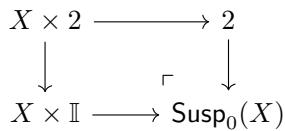
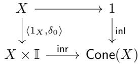
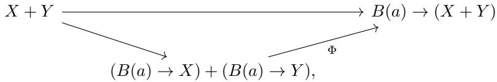

# On Church’s Thesis in Cubical Assemblies

Andrew W Swan and Taichi Uemura

May 9, 2019

## Abstract

We show that Church’s thesis, the axiom stating that all functions on the naturals are computable, does not hold in the cubical assemblies model of cubical type theory.

We show that nevertheless Church’s thesis is consistent with univalent type theory by constructing a reflective subuniverse of cubical assemblies where it holds.

## 1 Introduction

One of the main branches of constructive mathematics is that of recursive or “Russian” constructivism, where to justify the existence of mathematical objects, one must show how to compute them. A rather extreme interpretation of this philosophy is the axiom of Church’s thesis, which states that all functions from N to N are computable. Despite (or perhaps because) of its highly non-classical nature it has been well studied by logicians and turns out to be consistent with a wide variety of formal theories for constructive mathematics. This is usually proved using realizability models based on computable functions, starting with Kleene’s model of Heyting arithmetic[Kle45], but with many later variants and generalisations. See for example [TvD88, Chapter 4, Section 4] for a standard reference.

When interpreting Church’s thesis in type theory an additional complication is introduced. Logical statements are usually interpreted in type theory using the propositions-as-types interpretation. Applying this to Church’s thesis would give us the type below.

$$
\prod_ {f: \mathbb {N} \to \mathbb {N}} \sum_ {e: \mathbb {N}} \prod_ {x: \mathbb {N}} \sum_ {z: \mathbb {N}} T (e, x, z) \wedge U (z) = f (x)
$$

However it is straightforward to use function extensionality to show that this type is empty.1 It is therefore impossible in any case to show that the above “untruncated” version of Church’s thesis is consistent with univalence, since univalence implies function extensionality [Uni13, Theorem 4.9.4].

To have any hope of showing Church’s thesis is consistent with univalence we need a diferent formulation. We will use the interpretation of logical statements advocated in [Uni13, Section 3.7], and commonly used in homotopy type theory and elsewhere. In this approach one uses the higher inductive type of propositional truncation at disjunction and existential quantifiers, which ensures that the resulting type is always an hproposition (i.e. that any two of its elements are equal). This yields the following version of Church’s thesis, which is the one we will study here.

$$
\prod_ {f: \mathbb {N} \to \mathbb {N}} \left\| \sum_ {e: \mathbb {N}} \prod_ {x: \mathbb {N}} \sum_ {z: \mathbb {N}} T (e, x, z) \times U (z) = f (x) \right\|
$$

It is well known that Church’s thesis holds in the internal logic of Hyland’s efective topos (see for instance [vO08, Section 3.1] for a standard reference). Similar arguments show that in fact it already holds in its simpler subcategory of assemblies, and even in cubical assemblies, when they are viewed as regular locally cartesian closed categories and thereby, following Awodey and Bauer in [AB04] or Maietti in [Mai05] as models of extensional type theory with propositional truncation. However, the interpretation of cubical type theory in cubical assemblies due to the second author [Uem18] is very diferent to the interpretation of extensional type theory. We draw attention in particular to the fact that for extensional type theory hpropositions are implemented as maps where in the internal logic each fibre has at most one element.2 On the other hand in the interpretation of cubical type theory, each fibre can have multiple elements as long as any two elements are joined by a path, telling us to always treat them as “propositionally equal.” For propositional truncation we don’t strictly identify elements by quotienting, but instead add new paths. Our first result is that Church’s thesis is in fact false in the interpretation of cubical type theory in cubical assemblies, even though it holds in the internal logic.

To show Church’s thesis is consistent with univalence we will combine cubical assemblies with the work of Rijke, Shulman and Spitters on modalities and Σ-closed reflective subuniverses in [RSS17]. We will construct a reflective subuniverse where Church’s thesis is forced to hold, and then use properties of cubical assemblies to show that this reflective subuniverse is non trivial. Our model can also be viewed as a kind of stack model akin to those used by Coquand for various independence and consistency results, including the independence of countable choice from homotopy type theory [Coq18], although our formulation will be quite diferent to Coquand’s.

## Acknowledgements

The first author is grateful for some helpful discussions on higher inductive types with Simon Huber, Anders M¨ortberg and Christian Sattler at the Hausdorf Research Institute for Mathematics during the trimester program Types, Sets and Constructions. The second author is supported by the research programme “The Computational Content of Homotopy Type Theory” with project number 613.001.602, which is financed by the Netherlands Organisation for Scientific Research (NWO). We are grateful to Benno van den Berg for helpful comments and corrections.

## 2 Models of Type Theories

In this paper we use models of diferent kinds of type theory: extensional dependent type theory; intensional dependent type theory (with the univalence axiom). All of them are based on the notion of a category with families [Dyb96].

Definition 2.1. Let C be a category. A cwf-structure over C is a pair $( T , E )$ of presheaves $T : { \mathcal { C } } ^ { \mathrm { o p } } $ Set and ${ \bar { E } } : ( \int _ { \mathcal { C } } T ) ^ { \mathrm { o p } } $ Set such that, for any object $\Gamma \in { \mathcal { C } }$ and element $X \in T ( \Gamma )$ , the presheaf

$$
(\mathcal {C} / \Gamma) ^ {\mathrm{op}} \ni (f: \Delta \rightarrow \Gamma) \mapsto E (\Delta , X \cdot f) \in \mathbf {S e t}
$$

is representable. The representing object for this presheaf is denoted by $\chi ( X )$ $\{ X \} \to \Gamma \ \mathrm { o r } \ \chi ( X ) : \Gamma . X \to \Gamma$ . A category with families, cwf in short, is a triple $\dot { \mathcal { E } } = ( \mathbb { C } ^ { \mathcal { E } } , \mathbb { T } ^ { \mathcal { E } } , \mathbb { E } ^ { \mathcal { E } } )$ such that $\mathbb { C } ^ { \mathcal { E } }$ is a category with a terminal object and $( \mathbb { T } ^ { \mathcal { E } } , \mathbb { E } ^ { \mathcal { E } } )$ is a cwf-structure over $\mathbb { C } ^ { \mathcal { E } }$

In general a model E of a type theory consists of a category with families $( \mathbb { C } ^ { \varepsilon } , \mathbb { T } ^ { \breve { \varepsilon } } , \mathbb { E } ^ { \varepsilon } )$ and algebraic operations on the presheaves $\mathbb { T } ^ { \mathcal { E } }$ and $\mathbb { E } ^ { \mathcal { E } }$ . An object Γ of $\mathbb { C } ^ { \mathcal { E } }$ is called a context. An element $X$ of $\bar { \mathbb { T } } ^ { \mathcal { E } } ( \Gamma )$ is called a type and written $\Gamma \vdash _ { \mathcal { E } } X$ . An element a of $\mathbb { E } ^ { \mathcal { E } } ( \Gamma , X )$ is called an element of type X and written $\Gamma \vdash _ { \mathcal { E } } a : X$ . The subscript of $\vdash _ { \varepsilon }$ is omitted when the model $\mathcal { E }$ is clear from the context. An algebraic operation on those presheaves is expressed by the schema

$$
\frac {\Gamma \vdash \mathcal {J} _ {1} \qquad \ldots \qquad \Gamma \vdash \mathcal {J} _ {n}}{\Gamma \vdash A (\mathcal {J} _ {1} , \ldots , \mathcal {J} _ {n})}
$$

where $\Gamma \vdash \mathcal { I } _ { j }$ and $\Gamma \vdash A ( { \mathcal { I } } _ { 1 } , \ldots , { \mathcal { I } } _ { n } )$ are either of the form Γ. $X _ { 1 } . \ldots . . X _ { m } \vdash Y$ or of the form $\Gamma . X _ { 1 } . . . . X _ { m } \vdash b : Y$ with $( \Gamma \vdash X _ { 1 } ) , \ldots , ( \Gamma . X _ { 1 } . . . . . X _ { m - 1 } \vdash X _ { m } )$ . In this schema we always assume that the operation $A ( { \mathcal { I } } _ { 1 } , \ldots , { \mathcal { I } } _ { n } )$ is stable under reindexing: if $f : \Delta  \Gamma$ is a morphism in $\mathbb { C } ^ { \mathcal { E } }$ , then we have $A ( { \mathcal { I } } _ { 1 } , \dots , { \mathcal { T } } _ { n } ) \cdot f =$ $A ( { \mathcal { I } } _ { 1 } \cdot f , \dots , { \mathcal { I } } _ { n } \cdot f )$

Example 2.2. Let $\mathcal { E }$ be a cwf. We say $\mathcal { E }$ supports dependent product types if it has operations

$$
\frac {\Gamma \vdash X \qquad \Gamma . X \vdash Y}{\Gamma \vdash \Pi (X , Y)} \qquad \qquad \frac {\Gamma \vdash X \qquad \Gamma . X \vdash Y \qquad \Gamma . X \vdash b : Y}{\Gamma \vdash \lambda (X , Y , b) : \Pi (X , Y)}
$$

such that the map $\mathbb { E } ( \Gamma . X , Y ) \ni b \mapsto \lambda ( X , Y , b ) \in \mathbb { E } ( \Gamma , \Pi ( X , Y ) )$ is bijective.

It is a kind of routine to describe other type constructors such as dependent sum types, extensional and intensional identity types, inductive types, higher inductive types and universes.

For a model E of a type theory, we denote by $[ - ] ^ { \varepsilon }$ the interpretation of the type theory in the model E.

Definition 2.3. By a model of univalent type theory we mean a cwf that supports dependent product types, dependent sum type, intensional identity types, unit type, finite coproducts, natural numbers, propositional truncation and a countable chain

$$
\mathcal {U} _ {0}: \mathcal {U} _ {1}: \mathcal {U} _ {2}: \ldots
$$

of univalent universes.

## 2.1 Internal Languages

Formally we will work with models of type theories, but we will construct types and terms of those models in a syntactic way using their internal languages. Let $\mathcal { E } = ( \mathbb { C } ^ { \mathcal { E } } , \mathbb { T } ^ { \mathcal { E } } , \mathbb { E } ^ { \mathcal { E } } , \dots )$ be a model of a type theory. For a context $\Gamma \in \mathbb { C } ^ { \mathcal { E } }$ and a type $\Gamma \vdash X$ , we introduce a variable x and write $( \Gamma , x : X )$ for the context $\Gamma . X$ For another type $\Gamma \vdash Y$ , the weakening $\Gamma , x : X \vdash Y$ is interpreted as the reindexing $\Gamma . X \vdash Y \cdot \chi ( X )$ For an element $\Gamma \vdash a : X$ and a type $\Gamma , x : X \vdash Y ( x )$ , the substitution ${ \Gamma } \vdash Y ( a )$ is interpreted as the reindexing $\Gamma \vdash Y \cdot { \bar { a } } .$ , where ${ \bar { a } } : \Gamma \to \Gamma . X$ is the section of $\Gamma . X  \Gamma$ corresponding to the element $\Gamma \vdash a : X$ . All type and term constructors of the type theory are soundly interpreted in E in a natural way. Note that types and terms built in the internal language are stable under reindexing.

## 2.2 W-types with Reductions

We will later use W-types with reductions to construct higher inductive types. So that we can use them internally in type theory we give below a new, split formulation. This is based on the non-dependent special case of the version in [Swa18].

Let $\dot { \boldsymbol { \mathcal { E } } } = ( \mathbb { C } ^ { \mathcal { E } } , \mathbb { T } ^ { \mathcal { E } } , \mathbb { E } ^ { \mathcal { E } } , \dots )$ be a model of a type theory with dependent product types, dependent sum types and extensional identity types. Suppose that E has types $1 \vdash \mathbb { F }$ and $\varphi : \mathbb { F } \vdash [ \varphi ]$ such that $\varphi : \mathbb { F } , x : [ \varphi ] , y : [ \varphi ] \vdash x = y$ . We call an element of F a cofibrant proposition. We often omit $[ - ]$ and regard an element $\varphi : \mathbb { F }$ itself as a type. A cofibrant polynomial with reductions over a context $\Gamma \in \mathbb { C } ^ { \mathcal { E } }$ consists of the following data:

• a type $\Gamma \vdash Y$ of constructors;

• a type $\Gamma , y : Y \vdash X ( y )$ of arities;

• a cofibrant proposition $\Gamma , y \ : \ Y \vdash \ R ( y ) \ : \ \mathbb { F }$ together with an element $\Gamma , y : Y , r : R ( y ) \vdash k ( y , r ) : X ( y )$ which we refer to as the reductions.

An algebra for a cofibrant polynomial with reductions $( Y , X , R , k )$ over $\Gamma \in \mathbb { C } ^ { \mathcal { E } }$ is a type $\Gamma \vdash W$ together with an element $\Gamma , y : Y , \alpha : X ( y )  W \vdash s ( y , \alpha ) : W$ such that $\Gamma , y : Y , \alpha : X ( y )  W , r : R ( y ) \vdash s ( y , \alpha ) = \alpha ( k ( y , r ) )$ . Algebras for $( Y , X , R , k )$ form a category in the obvious way and we say $\mathcal { E }$ supports cofibrant W-types with reductions if every cofibrant polynomial with reductions has an initial algebra preserved by reindexing.

## 3 Orton-Pitts Construction

Assumption 3.1. Let E be a model of dependent type theory that supports dependent product types, dependent sum types, extensional identity types, unit type, finite colimits, natural numbers, propositional truncation and a countable chain of universes. We further assume that every context $\Gamma \in \mathbb { C } ^ { \mathcal { E } }$ is isomorphic to 1.X for some type X over the terminal object 1. Suppose the following:

• E has a type $1 \vdash \mathbb { I }$ equipped with two constants 0 and 1 and two binary operators ⊓ and ⊔;

• $\mathcal { E }$ has types $1 \vdash \mathbb { F }$ and $\varphi : \mathbb { F } \vdash [ \varphi ]$ such that $\varphi : \mathbb { F } , x : [ \varphi ] , y : [ \varphi ] \vdash x = y$ An element of $\mathbb { F }$ is called a cofibrant proposition. We often omit $[ - ]$ and regard an element $\varphi : \mathbb { F }$ itself as a type;

• I and F satisfy $\mathtt { a x } _ { 1 } \mathtt { - a x } _ { 9 }$ given by Orton and Pitts $[ \mathrm { O P 1 8 } ] ;$

• F satisfies propositional extensionality: $\begin{array} { r } { \prod _ { \varphi , \psi : \mathbb { F } } ( \varphi \Leftrightarrow \psi ) \Rightarrow ( \varphi = \psi ) ; } \end{array}$ ;

• the exponential functor $( - ) ^ { \mathbb { I } } : \mathbb { C } ^ { \mathcal { E } } \to \mathbb { C } ^ { \mathcal { E } }$ has a right adjoint;

$\mathcal { E }$ supports cofibrant W-types with reductions.

Note that the axioms in [OP18] are written in the internal language of an elementary topos, but they are easily translated into dependent type theory with I and F as above. We require propositional extensionality which trivially holds when F is a subobject of the subobject classifier of an elementary topos.

Under these assumptions, we will build a model $\widetilde { \mathcal E }$ of univalent type theory as follows:

• the base category $\mathbb { C } ^ { \tilde { \mathcal { E } } }$ is that of $\mathcal { E } ;$

• the types $\Gamma \vdash _ { \tilde { \varepsilon } } X$ are the types Γ ⊢E X equipped with a “fibration struc-$\mathrm { t u r e } ^ { \mathfrak { p } } ;$ ;

• the elements $\Gamma \vdash _ { \tilde { \varepsilon } } a : X$ are the elements $\Gamma \vdash _ { \mathcal { E } } a : X$ of the underlying type $X$ in $\mathcal { E } ;$ ;

By the construction given in [OP18], this model $\widetilde { \mathcal E }$ supports dependent product types, dependent sum types, identity types, unit $\mathrm { t y p e }$ , finite coproducts and natural numbers. For a countable chain of univalent universes, use the right adjoint to $( - ) ^ { \mathbb { I } }$ as in $\mathrm { [ L O P S 1 8 ] }$ ]. It remains to show that $\widetilde { \mathcal E }$ supports propositional truncation, which will be proved in Section 3.1 using cofibrant W-types with reductions. We call a model of univalent type theory of the form $\widetilde { \varepsilon }$ an Orton-Pitts model.

## 3.1 Higher Inductive Types in Orton-Pitts Models

We are still working with a model E of type theory that satisfies Assumption 3.1. We will show how to construct higher inductive types in ${ \widetilde { \varepsilon } } .$ . Our techniques are fairly general, although we will focus on the HITs that we will need for the main theorem. The techniques developed by Coquand Huber and M¨ortberg in [CHM18] are already very close to working in arbitrary Orton-Pitts models. The only exception is that the underlying objects for the HITs are given by certain initial algebras, which are constructed directly for cubical sets. This definition doesn’t quite work for cubical assemblies for two reasons. Firstly we are using a diferent cube category, and secondly we are working internally in assemblies. Rather than proving the same results again for cubical assemblies we will use a more general approach based on W-types with reductions that covers both cases. The first author already showed in [Swa18, Section 4] that (non-split) W-types with locally decidable reductions can be constructed in any category of presheaf assemblies and we’ll see later how to ensure that we get in fact split W-types with reductions in presheaf assemblies.

Finally, we will also make some minor adjustments related to the fact that we do not assume the interval object has reversals.

When we construct higher inductive types, we will use formulations based on Path types, following Coquand, Huber and M¨ortberg. Technically these formulations can only be stated in cubical type theory, and not in intensional type theory in general. However, it is straightforward to derive versions based on Id types using the equivalence of Path and Id types, which are then valid in ${ \widetilde { \mathcal { E } } } .$ We note that although computation rules hold definitionally for both point and path constructors for the Path type versions, after translating to Id types, the definitional equality only holds for point constructors. However, neither definitional equality will be needed for our end result.

Definition 3.2. Given a type $\Gamma \vdash _ { \mathcal { E } } A$ , we define the local fibrant replacement $o f A , \mathsf { L F R } ( A )$ to be the $W { \mathrm { - t y p e } }$ with reductions defined as follows.

• When $a : A$ , we add an element inc(a) to $\mathsf { L F R } ( A )$

• When $\varphi : \mathbb { F } , \epsilon \in \{ 0 , 1 \}$ and $u : \textstyle \sum _ { i : \mathbb { I } } ( ( i = \epsilon ) \vee \varphi ) \ \to \ \mathsf { L F R } ( A )$ , we add an element hcomp $( \varphi , \epsilon , u )$ to ${ \mathsf { L F R } } ( A )$

• If $p : \varphi$ and ǫ and u are as above then $\mathsf { h c o m p } ( \varphi , \epsilon , u )$ reduces to $u ( 1 - \epsilon , p )$

Formally, we define the constructors $Y$ to be the coproduct $A + \left( \mathbb { F } \times 2 \right)$ . We take the arity $X ( \mathsf { i n l } ( a ) )$ to be the empty type for $a : A$ and $X ( \varphi , \epsilon )$ to be $\textstyle \sum _ { i : \mathbb { I } } \varphi \vee ( i = \epsilon )$ for $( \varphi , \epsilon ) : \mathbb { F } \times 2$ . We take the reductions $R ( \mathfrak { i n } | ( a ) )$ to be ⊥ for $a : A$ and $R ( \varphi , \epsilon )$ to be $\varphi$ together with the map $\begin{array} { r } { p : \varphi \vdash ( 1 - \epsilon , p ) : \sum _ { i : \mathbb { I } } \varphi \lor ( i = \epsilon ) } \end{array}$

Theorem 3.3. The model $\widetilde { \varepsilon }$ supports suspensions.

Proof. Suppose we are given a type $\Gamma \vdash _ { \widetilde { \mathcal { E } } } X$ . We first construct the na¨ıve suspension, $\mathsf { S u s p } _ { 0 } ( X )$ as the pushout below.

We next take the local fibrant replacement, to get $\mathsf { L F R } ( \mathsf { S u s p } _ { 0 } ( X ) )$ . This is then an initial $\mathsf { S u s p } ( X )$ algebra, as defined by Coquand, Huber and M¨ortberg in [CHM18, Section 2.2] and so we can then proceed with the same proof as they do there. 口

Theorem 3.4. The model $\widetilde { \varepsilon }$ supports propositional truncation.

Proof. Suppose we are given a type $\Gamma \vdash _ { \widetilde { \mathcal { E } } } A .$ . We first define the underlying object of $\| A \|$ to be the $W { \mathrm { - t y p e } }$ with reductions defined as follows.

• When $a : A .$ , we add an element inc(a) to $\| A \|$

• When $\varphi : \mathbb { F } , \epsilon \in \{ 0 , 1 \}$ and $\begin{array} { r } { u : \sum _ { i : \mathbb { I } } ( ( i = \epsilon ) \vee \varphi ) \  \ \| A \| } \end{array}$ , we add an element hcomp $( \varphi , \epsilon , u )$ to $\| A \|$

${ \mathrm { I f ~ } } p : \varphi$ and ǫ and u are as above then hcom $\rho ( \varphi , \epsilon , u )$ reduces to $u ( 1 - \epsilon , p )$

• If $x , y : \| A \|$ and i : I, then $\| A \|$ contains an element of the form ${ \mathsf { s q } } ( x , y , i )$

• If $x , y , i$ are as above and $i = 0$ , then ${ \mathsf { s q } } ( x , y , i )$ reduces to x.

• If $x , y , i$ are as above and $i = 1$ , then ${ \mathsf { s q } } ( x , y , i )$ reduces to y.

Formally, we define this by taking the coproduct of two polynomials with reductions. The first is the one we used before for LFR. The second has constructors $Y : = \mathbb { I }$ , with the arity defined by $X ( i ) : = ~ 2$ , and reductions $R ( i ) : = ( i = 0 ) \vee ( i = 1 )$ ) together with the map $p : ( i = 0 ) \lor ( i = 1 ) \vdash k ( p ) : 2$ defined by $k ( p ) = 0 { \mathrm { ~ i f ~ } } p : i = 0$ and $k ( p ) = 1 { \mathrm { ~ i f ~ } } p : i = 1$

The remainder of the proof is the same as the syntactic description of propositional truncation by Coquand, Huber and M¨ortberg in [CHM18, Section 3.3.4]. □

We now construct a new higher inductive type, which is a simplified version of the higher inductive type $\mathcal { I } _ { F }$ defined by Rijke, Shulman and Spitters in [RSS17, Section 2.2]. Given families of types $\Gamma \vdash _ { \widetilde { \varepsilon } } A$ and $\Gamma , a : A \vdash _ { \widetilde { \varepsilon } } B ( a )$ we will construct a higher inductive type ${ \mathcal { K } } _ { B } ^ { \Gamma }$ defined as follows.

• When $a : A$ and $f : B ( a )  K _ { B }$ , we add an element $\operatorname { e x t } ( a , f )$ to $\displaystyle { \mathcal { K } } _ { B }$

• When $a : A , f : B ( a ) \to { \mathcal { K } } _ { B }$ and $b : B ( a )$ we add an element $\mathsf { i s e x t } ( a , f , b )$ to $\mathsf { P a t h } ( \mathsf { e x t } ( a , f ) , f ( b ) )$ .

We require that $\displaystyle { \mathcal { K } } _ { B }$ satisfies the following elimination rule. Suppose we are given a family of types $\Gamma , x : K _ { B } \vdash _ { \widetilde { \varepsilon } } P ( x )$ together with the terms below.

$$
\begin{array}{l} R: \prod_ {a: A} \prod_ {f: B (a) \to \mathcal {K} _ {B}} \left(\prod_ {b: B (a)} P (f (b))\right) \to P (\operatorname{ext} (f, c)) \\ S: \prod_ {a: A} \prod_ {f: B (a) \to \mathcal {K} _ {B}} \prod_ {f ^ {\prime}: \prod_ {b: B (a)} P (f (b))} \prod_ {b: B (a)} \prod_ {i: \mathbb {I}} P (\operatorname{isext} (a, f, b) (i)) \end{array}
$$

Suppose further that S satisfies the equalities

$$
\begin{array}{l} S (a, f, f ^ {\prime}, b, 0) = R (f ^ {\prime}) \\ S (a, f, f ^ {\prime}, b, 1) = f ^ {\prime} (b) \end{array}
$$

Then we have a choice of term $\Gamma , x : \mathcal { K } _ { B } \vdash s ( x ) : P ( x )$ satisfying the following computation rules for $a : A , f : B ( a ) \to { \mathcal { K } } _ { B }$ and $b : B ( a )$

$$
\begin{array}{c} s (\mathsf {e x t} (a, f)) = R (a, f, s \circ f) \\ s (\mathsf {i s e x t} (a, f, b) (i)) = S (a, f, s \circ f, b, i) \end{array}
$$

Moreover the choice of term is strictly preserved by reindexing.

We use the techniques developed by Coquand, Huber and M¨ortberg together with W-types with reductions for constructing the actual objects. In order to give ${ \mathcal { K } } _ { B } ^ { \Gamma }$ the structure of a fibration we need to define a composition operator. We will do this by freely adding an hcomp operator, and then combining it with a transport operator, which we will explicitly define.

Definition 3.5. Let $\Gamma \vdash _ { \mathcal { E } } X$ be a type. We define the na¨ıve cone, $\mathsf { C o n e } ( X )$ to be the following pushout3.

We can now define ${ \mathcal { K } } _ { B } ^ { \Gamma }$ to be the following W-type with reductions.

• When $a : A , c : { \mathsf { C o n e } } ( B ( a ) )$ and $f : B ( a )  K _ { B }$ , we add an element pastecone $( a , c , f )$ to $\displaystyle { \mathcal { K } } _ { B }$

• If $a , c , f$ are as above and c is of the form $\mathfrak { i n r } ( b , 1 )$ for $b : B ( a )$ , then pastecone $( a , c , f )$ reduces to $f ( b )$

• When $\varphi : \mathbb { F }$ and $u : \sum _ { i : \mathbb { I } } ( ( i = 0 ) \vee \varphi ) \quad  \quad K _ { B }$ , we add an element hcomp $\scriptstyle \gamma ( \varphi , u )$ to $\displaystyle { \mathcal { K } } _ { B }$

• If $p : \varphi$ and u is as above then hcomp $( \varphi , u )$ reduces to $u ( 1 , p )$

To check that this really is a $W { \mathrm { - t y p e } }$ with reductions, we need to define the polynomial with reductions. We take it to be the coproduct of the following two polynomials with reductions.

We define the first component of the coproduct as follows. We take the constructors $Y$ to be $\begin{array} { r } { \sum _ { a : A } \mathsf { C o n e } ( B ( a ) ) } \end{array}$ and the arities $X ( a , c )$ to be $B ( a )$ . We take the reductions $R ( a , \mathrm { i n } | ( * ) )$ to be ⊥ and $R ( a , \mathsf { i n r } ( b , i ) )$ to be $( i = 1 )$ together with the map $R ( a , \mathsf { i n r } ( b , i ) ) \vdash b : B ( a )$ . Note that $\begin{array} { r } { R : ( \sum _ { a : A } \mathsf { C o n e } ( B ( a ) ) ) \to \mathbb { F } } \end{array}$ is well-defined because we have $( 0 = 1 ) = \perp$ by propositional extensionality.

The second component in the coproduct is the polynomial with reductions that we used for local fibrant replacement.

Lemma 3.6. We construct a transport operator for ${ \mathcal { K } } _ { B } ^ { \Gamma }$ , in the sense defined in [CHM18, Definition 2.3].

Proof. Suppose we are given $\varphi : \mathbb { F }$ and a path $\gamma$ in Γ which is constant on $\varphi .$ We need to define a transport operator, which is a map $t : \mathcal { K } _ { B ( \gamma ( 0 ) ) } \to \mathcal { K } _ { B ( \gamma ( 1 ) ) }$ such that t is the identity when $\varphi$ is true. Formally this map can be defined by giving an appropriate algebra structure on ${ \mathcal { K } } _ { B ( \gamma ( 1 ) ) }$ and then using the initiality of ${ \ K } _ { B ( \gamma ( 0 ) ) }$ . However, for clarity we will present the proof as an argument by higher recursion on the definition of ${ \ K } _ { B ( \gamma ( 0 ) ) }$

We need to show how to define $t ( { \mathsf { p a s t e c o n e } } ( a , c , f ) )$ and $t ( \mathsf { h c o m p } ( \psi , u ) )$ , and then check that the definition respects the reduction equations. For the latter we define the transport operator so that it preserves the hcomp structure, which determines it uniquely, following [CHM18]. For the former, we recall that ${ \mathsf { C o n e } } ( B ( a ) )$ was defined as a pushout, and so we can split into a further two cases. Either $c$ is of the form $\mathrm { i n l } ( * )$ , or it is of the form inr(b, i) where $b : B ( a )$ and $i : \mathbb { I }$ . Now in addition to the reduction equation, we have to also satisfy $t ( \mathsf { i n l } ( \ast ) ) = t ( \mathsf { i n r } ( b , 0 ) )$ in order to eliminate out of the pushout.

Write $t _ { A }$ for the transport $A ( \gamma ( 0 ) )  A ( \gamma ( 1 ) )$ and $t _ { B }$ for the transport $\prod _ { a : A ( \Gamma ( 0 ) ) } B ( a ) \ \to \ B ( t _ { A } ( a ) )$ ensuring that $t _ { A } ( a ) ~ = ~ a$ and $t _ { B } ( b ) = b$ when $\varphi = { \mathsf { T } }$ , for all $a : \ A ( \gamma ( 0 ) )$ and $b : B ( a )$ Write $t _ { B } ^ { - 1 }$ for the homotopy inverse $\prod _ { a : A ( \Gamma ( 0 ) ) } B ( t _ { A } ( a ) ) \to B ( a )$ , again ensuring that $t _ { B } ^ { - 1 } ( b ) = b$ when $\varphi = \top$ Since we are only guaranteed the existence of a homotopy inverse, not a strict inverse, we don’t necessarily have $t _ { B } ^ { - 1 } \circ t _ { B } = 1 _ { B ( a ) }$ . We can however construct paths $\begin{array} { r } { p : \prod _ { a : A ( \Gamma ( 0 ) ) } \prod _ { b : B ( a ) } \mathbb { I } \to B ( a ) } \end{array}$ satisfying for all $a : A ( \Gamma ( 0 ) )$ and $b : B ( a )$ that $p ( a , b , 0 ) = t _ { B } ^ { - 1 } ( t _ { B } ( b ) )$ and $p ( a , b , 1 ) = b$ . Furthermore, we may assume that for any $a , b$ and $i , \mathrm { i f } \varphi = \top$ then $p ( a , b , i ) = b$

We define $t ( { \mathsf { p a s t e c o n e } } ( a , \mathsf { i n l } ( * ) , f ) )$ ) to be of the form pastecone $( t _ { A } ( a ) , \mathsf { i n l } ( * ) , f ^ { \prime } )$ where we still need to define a function $f ^ { \prime } : B ( t _ { A } ( a ) )  K _ { B ( \gamma ( 1 ) ) }$ . Note that we may assume by recursion that for each $b : B ( a ) , t ( f ( b ) )$ has already been defined and belongs to ${ \ K } _ { B ( \gamma ( 1 ) ) }$ . Hence we can simply define $f ^ { \prime }$ to be $t \circ f \circ t _ { B } ^ { - 1 }$

The obvious first attempt at defining $t ( \mathsf { p a s t e c o n e } ( a , \mathsf { i n r } ( b , i ) , f ) )$ , would be pastecone $( t _ { A } ( a ) , \mathsf { i n r } ( t _ { B } ( b ) , i ) , t \circ f \circ t _ { B } ^ { - 1 } )$ . Note however that this does not satisfy the reduction equations. This is because when $i = 1$ , pastecone $( a , \mathsf { i n r } ( b , i ) , f )$ reduces to $f ( b )$ and pastecone $( t _ { A } ( a ) , \mathsf { i n r } ( t _ { B } ( b ) , i ) , t \circ f \circ t _ { B } ^ { - 1 } )$ reduces to $t ( f ( t _ { B } ^ { - 1 } ( t _ { B } ( b ) ) ) )$ which is not necessarily strictly equal to $t ( f ( b ) )$ . We fix this using the hcomp

constructor, following the construction of homotopy pushouts in [CHM18, Section 2.3]. We define $\psi : \mathbb { F }$ to be $\varphi \vee ( i \ : = \ : 0 ) \vee ( i \ : = \ : 1 )$ . We then define $\begin{array} { r } { u : \sum _ { j : \mathbb { I } } \ ( \psi \vee ( j = 0 ) )  K _ { B ( \gamma ( a ) ) } } \end{array}$ as follows.

$$
u (j, *) := \left\{ \begin{array}{l l} \text { pastecone } (t _ {A} (a), \text { inr } (t _ {B} (b), i), t \circ f \circ t _ {B} ^ {- 1}) & j = 0 \\ \text { pastecone } (a, \text { inr } (b, i), t \circ f) & \varphi = \top \\ \text { pastecone } (t _ {A} (a), \text { inl } (*), t \circ f \circ t _ {B} ^ {- 1}) & i = 0 \\ t (f (p (a, b, j))) & i = 1 \end{array} \right.
$$

We then define $t ( \mathsf { p a s t e c o n e } ( a , \mathsf { i n r } ( b , i ) , f ) )$ to be $\mathsf { h c o m p } ( \psi , 0 , u )$ . The reduction equation for hcomp then ensures that we do satisfy the reduction equation for pastecone and also retain the necessary equations for the pushout and furthermore ensures that the resulting map $t : \mathcal { K } _ { B ( \gamma ( 0 ) ) } \ :  \ : \mathcal { K } _ { B ( \gamma ( 1 ) ) }$ is a transport operator. □

Theorem 3.7. We construct a fibration structure for each $\displaystyle { \mathcal { K } } _ { B }$ , which is strictly preserved $b y$ reindexing.

Proof. By lemma 3.6 and [CHM18, Lemma 2.5].

Lemma 3.8. We construct terms ext and isext for $\displaystyle { \mathcal { K } } _ { B }$ that satisfy the appropriate equations.

Proof.

$$
\begin{array}{c} \operatorname{ext} (a, f) := \operatorname{pastecone} (a, \operatorname{inl} (*), f) \\ \operatorname{isext} (a, f, b) (i) := \operatorname{pastecone} (a, \operatorname{inr} (b, i), f) \end{array}
$$

## Lemma 3.9. $\displaystyle { \kappa _ { B } }$ satisfies the necessary induction principle.

Proof. Suppose we are given a family of types $\Gamma , x : K _ { B } \vdash _ { \widetilde { \varepsilon } } P ( x )$ together with the terms below.

$$
\begin{array}{l} R: \prod_ {a: A} \prod_ {f: B (a) \to \mathcal {K} _ {B}} \left(\prod_ {b: B (a)} P (f (b))\right) \to P (\operatorname{ext} (f, c)) \\ S: \prod_ {a: A} \prod_ {f: B (a) \to \mathcal {K} _ {B}} \prod_ {f ^ {\prime}: \prod_ {b: B (a)} P (f (b))} \prod_ {b: B (a)} \prod_ {i: \mathbb {I}} P (\operatorname{isext} (a, f, b) (i)) \end{array}
$$

We need to define a term $\Gamma , x : \mathcal { K } _ { B } \vdash s ( x ) : P ( x )$ satisfying the appropriate equalities. We define s by higher recursion on the construction of $\displaystyle { \mathcal { K } } _ { B }$ . We first deal with the case $s ( \mathsf { p a s t e c o n e } ( a , c , f ) )$ . Recalling that ${ \mathsf { C o n e } } ( B ( a ) )$ is defined as a pushout, we can split into the two cases $c = \mathrm { i n l } ( * )$ and $c = \mathsf { i n r } ( b , i )$ for some $b : B ( a )$ and $i : \mathbb { I } .$

We define

$$
\begin{array}{c} s (\text { pastecone } (a, \text { inl } (*), f)) := R (a, f, s \circ f) \\ s (\text { pastecone } (a, \text { inr } (b, i), f)) := S (a, f, s \circ f, b, i) \end{array}
$$

It is straightforward to check that this does preserve the reduction and pushout equations and so does give a well defined map. One can show it is a section again by higher recursion and the computation rules are satisfied by definition.

Finally, to define $s ( \mathsf { h c o m p } ( \varphi , u ) )$ we use the fibration structure on $\Gamma , x \ i$ $\mathcal { K } _ { B } \vdash _ { \mathcal { E } } P ( x )$ 口

## 3.2 Internal Cubical Models

Let S be a model of dependent type theory with dependent product types, dependent sum types, extensional identity types, unit type, finite colimits, Wtypes and a countable chain of universes. We also assume that every context of S is isomorphic to 1.X for some type $1 \vdash s X$ . In particular, the category $\mathbb { C } ^ { s }$ is finitely complete so that internal categories in $\mathbb { C } ^ { s }$ make sense. Let  denote the internal category in $\mathbb { C } ^ { s }$ in which the objects are the natural numbers and the morphisms from n to m are the order-preserving functions ${ \bf 2 } ^ { n }  { \bf 2 } ^ { m }$ . Note that S has a natural number object since it has W-types. We will refer to internal presheaves over  as internal cubical objects.

Theorem 3.10. Under those assumptions, the category of internal cubical objects in S is part of a model of type theory that satisfies Assumption 3.1.

Example 3.11. Let A be a partial combinatory algebra. It is well-known that the category Asm(A) of assemblies on A is part of a model of type theory with dependent product types, dependent sum types, extensional identity types, unit type, finite colimits. It is also known that Asm(A) has W-types (an explicit construction is found in [vdB06, Section 2.2]). Assuming a countable chain of Grothendieck universes in the set theory, Asm(A) has a countable chain of universes. Thus the category CAsm(A) of internal cubical objects in Asm(A) is part of a model of type theory that satisfies Assumption 3.1.

It is shown in [OP18] that, when S = Set, the category of presheaves over  satisfies all the axioms of Orton and Pitts if we take F to be the presheaf of locally decidable propositions. The proof works for an arbitrary S and one can show that the category of internal cubical objects in S is part of a model of type theory satisfying Assumption 3.1 except the existence of cofibrant W-types with reductions (see also [Uem18]). To construct cofibrant W-types with reductions, we recall the following from [Swa18].

Theorem 3.12. Let E be a locally cartesian closed category with finite colimits and disjoint coproducts and W-types, and let C be an internal category in E. Then the category P(C) of internal presheaves over C has all locally decidable W-types with reductions.

We furthermore observe that one can show that this construction is stable under pullback up to isomorphism using a technique similar to the one used by Gambino and Hyland for ordinary W-types. The reason is that pointed polynomial endofunctors are stable under pullback because they are constructed from Σ types, Π types and pushouts, all of which are preserved by pullback, and in locally cartesian closed categories the initial algebras of such pointed endofunctors are also stable under pullback. However, to ensure that the construction is strictly preserved requires a little more work.

We show how to use the non split version above to construct split W-types with reductions. The essential idea is to carry out the construction given above “pointwise,” expanding out the method suggested by Coquand, Huber and M¨ortberg in [CHM18, Section 2.2]. Since we define cubical sets here as a category of presheaves in the usual, contravariant sense, we work with contravariant presheaves here, although the original proof in $\left[ \mathrm { S w a l 8 } \right]$ is phrased in terms of covariant presheaves. We also make minor adjustments to fit with the “split” version appearing in section 2.2.

Suppose that we are given a context $\Gamma \in \mathcal { P } ( \mathbf { C } )$ together with a type $Y \in$ $\mathcal { P } ( \int _ { \mathbf { C } } \Gamma )$ , a type $X \in { \mathcal { P } } ( \int _ { C } \{ Y \} )$ , a locally decidable monomorphism $R  Y$ and a map $k : \prod _ { y : R } X ( y )$ over $\scriptstyle \int _ { \mathbf { C } } \Gamma$

We need to show how to define a strict version of the W-type with reductions $W ( Y , X , R )$ . We will refer to the new strict version as $W ^ { \prime } ( Y , X , R )$ . This should be an element of $\mathcal { P } ( \int _ { \mathbf { C } } \Gamma )$ , so in particular we need to define a family of types $W ^ { \prime } ( Y , X , R ) ( c , \gamma )$ indexed by objects c of C and elements $\gamma : \Gamma ( c )$

We fix such a c and $\gamma .$ . We first note that we have a a locally decidable polynomial with reductions $Y _ { \gamma } , X _ { \gamma } , R _ { \gamma }$ in the internal presheaf category $\begin{array} { r } { \mathcal { P } ( \int _ { \mathbf { C } } \mathbf { C } ( - , c ) ) } \end{array}$ given by reindexing along the map $\mathbf { C } ( - , c )  \Gamma$ given by Yoneda. We then carry out the “non strict” construction to get a presheaf $W ( Y _ { \gamma } , X _ { \gamma } , R _ { \gamma } )$ on $\textstyle \int _ { \mathbf { C } } \mathbf { C } ( - , c )$ and finally we define $W ^ { \prime } ( Y , X , R ) ( c , \gamma )$ to be $W ( Y _ { \gamma } , X _ { \gamma } , R _ { \gamma } ) ( c , \overset { . } { 1 } _ { c } )$

For completeness, we unfold the definitions to obtain the following explicit description of $W ^ { \prime } ( Y , X , R ) ( c , \gamma )$ . We first define the dependent W-type $N _ { 0 }$ of normal forms indexed by the objects $( d , f )$ of $\textstyle \int _ { \mathbf { C } } \mathbf { C } ( - , c )$

If $( d , f )$ is an object of $\textstyle \int _ { \mathbf { C } } \mathbf { C } ( - , c )$ we add an element to $N _ { 0 } ( d , f )$ of the form $\operatorname { s u p } ( y , \alpha )$ whenever y is an element of $Y ( d , \Gamma ( f ) ( \gamma ) )$ that does not belong to the subobject $R ( d , \Gamma ( f ) ( \gamma ) )$ and α is an element of the following type.

$$
\prod_ {g: e \to d} N _ {0} (e, f \circ g) ^ {X (f \circ g, \Gamma (f \circ g) (\gamma), Y (g) (y))}
$$

The next step is to define maps $N _ { 0 } ( d , f )  N _ { 0 } ( e , f \circ g )$ whenever $g \colon e  d$ and $f \colon d \  \ c$ in C. Say that we are given an element of $N _ { 0 } ( d , f )$ of the form $\operatorname { s u p } ( y , \alpha )$ . We recall that $N _ { 0 } ( g ) ( \operatorname* { s u p } ( y , \alpha ) )$ is defined by splitting into cases depending on whether or not y belongs to the subobject $R ( d , \Gamma ( f ) ( \gamma ) )$ . If it does, we define $N _ { 0 } ( g ) ( \operatorname* { s u p } ( y , \alpha ) )$ to be $\alpha ( g , k ( y ) ) ,$ ). Otherwise, we define $N _ { 0 } ( g ) ( \operatorname* { s u p } ( y , \alpha ) )$ to be sup $( Y ( g ) ( y ) , \alpha ^ { \prime } )$ where $\alpha ^ { \prime } ( h , x )$ is defined to be $\alpha ( g \circ h , x )$

We then define $N ( d , f )$ for each $f : d  c$ to be the subobject of $N _ { 0 } ( d , f )$ consisting of hereditarily natural elements and verify that this does indeed define a presheaf on $\textstyle \int _ { \mathbf { C } } \mathbf { C } ( - , c )$ . But this is identical to [Swa18, Section 4] so we omit the details.

If we then define $W ^ { \prime } ( Y , X , R ) ( c , \gamma )$ to be $N ( c , 1 _ { c } )$ , then this is strictly stable under reindexing by definition.

One can construct by recursion an isomorphism between $N ( d , f )$ and $W ( Y , X , R ) ( d , \Gamma ( f ) ( \gamma ) )$ for each $f : d  c .$ In particular this gives us an isomorphism between $N ( c , 1 _ { c } )$ and $W ( Y , X , R ) ( c , \gamma )$ , and so we have a canonical isomorphism between $W ^ { \prime } ( Y , X , R ) ( c , \gamma )$ and $W ( Y , X , R ) ( c , \gamma )$ . It follows that we can assign an initial algebra structure to $W ^ { \prime } ( Y , X , R ) ( c , \gamma )$ by transferring the algebra structure on $W ( Y , X , R ) ( c , \gamma )$ via the isomorphism.

## 3.3 Discrete Types

We introduce a class of types in an Orton-Pitts model for future use. Let $\mathcal { E }$ be a model of type theory satisfying Assumption 3.1.

Definition 3.13. A type $1 \vdash X$ is said to be discrete if the map λx. $. \lambda i . x : X \to$ $X ^ { \mathbb { I } }$ is an isomorphism.

The proofs of the following propositions are found in [Uem18].

Proposition 3.14. Every discrete type $1 \vdash X$ carries a fibration structure.

Proposition 3.15. If a type $1 \vdash X$ has decidable equality, then it is discrete.

Corollary 3.16. The natural number object in $\mathcal { E }$ is discrete.

## 4 Church’s Thesis

We consider a dependent type theory with dependent product types, dependent sum types, identity types, unit type, disjoint finite coproducts, propositional truncation and natural numbers. In such a dependent type theory, one can define Kleene’s computation predicate $T ( e , x , z )$ and result extraction function $U ( z )$ as primitive recursive functions $T : \mathbb { N } \times \mathbb { N } \times \mathbb { N } \to { \bf 2 }$ and $U : \mathbb { N } \to \mathbb { N }$ . The statement $T ( e , x , z )$ means that z codes a computation on Turing machine e with input x and $U ( z )$ is the output of the computation. Church’s Thesis is the following axiom.

$$
\forall_ {f: \mathbb {N} \rightarrow \mathbb {N}} \exists_ {e: \mathbb {N}} \forall_ {x: \mathbb {N}} \exists_ {z: \mathbb {N}} T (e, x, z) \wedge U (z) = f (x)
$$

Since the type $\begin{array} { r } { \sum _ { z : \mathbb { N } } T ( e , x , z ) \times U ( z ) = f ( x ) } \end{array}$ is a proposition, Church’s Thesis is equivalent to the type

$$
\prod_ {f: \mathbb {N} \to \mathbb {N}} \left\| \sum_ {e: \mathbb {N}} \prod_ {x: \mathbb {N}} \sum_ {z: \mathbb {N}} T (e, x, z) \times U (z) = f (x) \right\|.
$$

## 4.1 Failure of Church’s Thesis in Internal Cubical Models

Let $s$ be a model of type theory as in Section 3.2. We have seen that the category $\mathcal { P } ( \sqsubseteq )$ of internal cubical objects in S is part of a model of type theory satisfying Assumption 3.1. In this section we show the following theorem.

Theorem 4.1. The negation of Church’s Thesis holds in the model of univalent type theory $\bar { \mathcal { P } } ( \bar { \sqcup } )$

To prove Theorem 4.1, we recall from [Uem18] the notion of a codiscrete presheaf. The constant presheaf functor $\Delta : { \mathcal { S } }  { \mathcal { P } } ( \bigsqcup )$ extends to a morphism of cwf’s and preserves (at least up to isomorphism) several type constructors. Here we only need the following.

Proposition 4.2. The morphism $\Delta : { \mathcal { S } }  { \mathcal { P } } ( \sqcup )$ of cwf’s preserves dependent product types, dependent sum types, extensional identity types and natural number objects.

A constant presheaf $\Delta X$ is regarded as a type in $\widetilde { \mathcal { P } ( \sqcup ) }$ by the following proposition and Proposition 3.14.

Proposition 4.3. Constant presheaves are discrete.

For types $1 \vdash _ { S } X$ and $x : X \vdash s Y ( x )$ , one can define a type $x : \Delta X \vdash _ { \mathcal { P } ( \neg ) }$ $\nabla _ { X } Y ( x )$ called the codiscrete presheaf which has the following properties.

Proposition 4.4. $\nabla _ { X }$ is the right adjoint to the evaluation functor $( - ) _ { 0 }$ at $0 \in \boxed { 1 } .$ : for any type $x : \Delta X \vdash _ { \mathcal { P } ( \sqcup ) } Z ( x )$ , we have a natural bijection between the set of elements $x : \Delta X , z : Z ( x ) \vdash _ { \mathcal { P } ( \Pi ) } b : \nabla _ { X } Y ( x )$ and the set $o f$ elements $x : X , z : Z _ { 0 } ( x ) \vdash s \ b : Y ( x )$ . Note that $( \Delta { X } ) _ { 0 } = X$ and thus $Z _ { 0 }$ is a type in $s$ over $X$

Proposition 4.5. For a type $x : X \vdash s Y ( x )$ , the type $x : \Delta X \vdash _ { \mathcal { P } ( \sqcup ) } \nabla _ { X } Y ( x )$ has a composition structure and is a proposition in $\bar { \mathcal { P } } ( \bar { \sqcup } )$

Proof of Theorem 4.1. We define types $\begin{array} { r } { f : \mathbb { N }  \mathbb { N } \vdash C ^ { \prime } ( f ) : \equiv \sum _ { e : \mathbb { N } } \prod _ { x : \mathbb { N } } \sum _ { z : \mathbb { N } } T ( e , x , z ) \times } \end{array}$ $U ( x ) = f ( x )$ and $f : \mathbb { N } \to \mathbb { N } \vdash C ( f ) : \equiv \| C ^ { \prime } ( f ) \|$ . Let N denote the natural number object in ${ \mathcal { S } } .$ . Then Church’s Thesis is interpreted in $\bar { \mathcal { P } } ( \bar { \sqcup } )$ as $\begin{array} { r } { \prod _ { f : \Delta ( N \to N ) } \bigl \mathbb { I C } \bigr \| \overline { { \mathcal { P } ( \widecheck { \big \cup } } ) } ( f ) } \end{array}$ by Proposition 4.2. We will construct two functions in ${ \mathcal { P } } ( \varXi )$

$$
\bullet \prod_ {f: \Delta (N \to N)} [   [ C ]   ] ^ {\widetilde {\mathcal {P} (\square)}} (f) \to \nabla_ {N \to N} [   [ C ^ {\prime} ]   ] ^ {\mathcal {S}} (f);
$$

$$
\bullet \left(\prod_ {f: \Delta (N \to N)} \nabla_ {N \to N} [   [ C ^ {\prime} ]   ] ^ {\mathcal {S}} (f)\right) \to \mathbf {0}.
$$

Then we readily get a function $\begin{array} { r } { \left( \prod _ { f : \Delta ( N \to N ) } [ C ] ^ { \widetilde { \mathcal { P } ( \overline { { \Omega } } ) } } ( f ) \right) \to \mathbf { 0 } } \end{array}$

For the former one it sufices to give a function $\begin{array} { r } { [ C ^ { \prime } ] ^ { \widehat { \mathcal { P } ( \square ) } } ( f )  \nabla _ { N  N } \mathbb { [ } C ^ { \prime } ] ^ { s } ( f ) } \end{array}$ for all $f : \Delta ( N \to N )$ by the recursion principle of the propositional truncation because the codomain is a proposition by Proposition 4.5. By the adjunction $( - ) _ { 0 }  \nabla _ { N  N }$ it sufices to give a function $\mathbb { [ } C ^ { \prime } \ ] _ { 0 } ^ { \widetilde { \mathcal { P } ( \sqcup ) } }  \mathbb { [ } C ^ { \prime } \mathbb { ] } ^ { s }$ but we have an isomorphism $[ C ^ { \prime } ] { \overset { \sim } { \mathcal { P } } } ( { \overset {  } { \bigtriangledown } } ) \cong ( \Delta [ C ^ { \prime } ] ] ^ { S } ) _ { 0 } = [ C ^ { \prime } ] ^ { S }$ by Proposition 4.2.

For the latter function, observe that $\begin{array} { r } { \prod _ { f : \Delta ( N \to N ) } \nabla _ { N \to N } \mathbb { [ } C ^ { \prime } \mathbb { ] } ^ { S } ( f ) \cong \nabla _ { 1 } \left( \prod _ { f : N \to N } \mathbb { [ } C ^ { \prime } \mathbb { ] } ^ { S } ( f ) \right) } \end{array}$ and that $\nabla _ { 1 } \mathbf { 0 } \cong \mathbf { 0 }$ . Then we apply $\nabla _ { 1 }$ to the function $\begin{array} { r } { \left( \prod _ { f : N \to N } \mathbb { I } C ^ { \prime } \mathbb { I } ^ { S } ( f ) \right) \to \mathbf { 0 } } \end{array}$ in $s$ obtained from the inconsistency of Church’s Thesis with the axiom of choice and function extensionality. 口

## 5 Null Types

Let $\mathcal { E }$ be a model of univalent type theory. Based on Rijke, Shulman and Spitters’ null types [RSS17] we define a notion of null structure as follows.

Let $a : A \vdash B ( a )$ be a proposition in E. For a type Γ ⊢ X in $\mathcal { E } ,$ we define a proposition $\boldsymbol { \Gamma } \vdash \mathsf { i s N u l l } _ { B } ( \boldsymbol { X } )$ as

$$
\Gamma \vdash \prod_ {a: A} \text { is } \mathsf {E q u i v} (\lambda (x: X). \lambda (b: B (a)). x)
$$

and call a term of isNull (X) a B-null structure on X. A B-null type is a type $\Gamma \vdash X$ equipped with a B-null structure n on $X$ . That is, a B-null type has a witness that the canonical map $X  X ^ { B ( a ) }$ is an equivalence for each a.

Definition 5.1. We define a cwf $\mathcal { E } _ { B }$ as follows:

• the contexts are those of $\mathcal { E } ;$

• the types are the B-null types in $\mathcal { E } ;$

• the elements of $\Gamma \vdash _ { \varepsilon _ { B } } X$ are those of the underlying type X in $\mathcal { E } .$

We have the obvious forgetful morphism $\mathcal { E } _ { B }  \mathcal { E }$ of cwf’s.

For a proposition $a : A \vdash B ( a )$ , a nullification operator assigns

• each type $\Gamma \vdash X$ a B-null type $\Gamma \vdash \mathcal { L } _ { B } X$ and an element $\Gamma \vdash \eta _ { X } : X $ $\mathcal { L } _ { B } X ;$ and

• each pair of type Γ ⊢ X and B-null type $\Gamma \vdash Y$ an element $\Gamma \vdash e :$ $\mathsf { i s E q u i v } ( \lambda ( f : \mathcal { L } _ { B } X \to Y ) . f \circ \eta _ { X }$

We also require that a nullification operator is preserved by reindexing.

We review some properties of null types. See [RSS17] for further details.

Proposition 5.2. Let $\Gamma \vdash X$ and $\Gamma , x : X \vdash Y ( x )$ be types in $\mathcal { E } .$

• There exists a term of type $\begin{array} { r } { \Gamma \vdash ( \prod _ { x : X } \mathsf { i s N u l l } _ { B } ( Y ( x ) ) )  \mathsf { i s N u l l } _ { B } ( \prod _ { x : X } Y ( x ) ) } \end{array}$ • There exists a term of type $\begin{array} { r } { \Gamma \vdash \mathsf { i s N u l l } _ { B } ( X )  ( \prod _ { x : X } \mathsf { i s N u l l } _ { B } ( Y ( x ) ) )  } \end{array}$ i $\begin{array} { r } { { 5 } \mathsf { N u } | | _ { B } ( \sum _ { x : X } Y ( x ) ) } \end{array}$

• There exists a term of type $\begin{array} { r } { \Gamma \vdash \mathsf { i s N u l l } _ { B } ( X )  \prod _ { x _ { 0 } , x _ { 1 } : X } \mathsf { i s N u l l } _ { B } ( \mathsf { I d } _ { X } ( x _ { 0 } , x _ { 1 } ) ) } \end{array}$

Consequently, $\mathcal { E } _ { B }$ supports dependent product, dependent sum and intensional identity types preserved by the morphism $\mathcal { E } _ { B }  \mathcal { E }$

For a universe U we define a subuniverse $U _ { B }$ of $U$ as

$$
U _ {B} \equiv \{X: U \mid \mathsf {i s N u l l} _ {B} (X) \}.
$$

Proposition 5.3. The universe $U _ { B }$ has a B-null structure.

Proof. Our condition that each $B ( a )$ is a proposition corresponds to $\mathrm { R i j k e } .$ , Shulman and Spitters’ notion of topological modality. They prove in [RSS17, Corollary 3.11 and Theorem 3.12] that for any such modality the universe of modal types is itself modal. □

Proposition 5.4. If a nullification operator $\mathcal { L } _ { B }$ exists, then it preserves propositions.

Proof. This is true for any modality by [RSS17, Lemma 1.28].

Corollary 5.5. Suppose that $\mathcal { E }$ has a nullification operator $\mathcal { L } _ { B }$ . Then $a : A \vdash$ $\mathcal { L } _ { B } B ( \boldsymbol { a } )$ is contractible.

Proof. Since $\mathcal { L } _ { B } B ( \boldsymbol { a } )$ is a proposition, it sufices to find an element of $\begin{array} { r l } { \prod _ { a : A } \mathcal { L } _ { B } B ( a ) } & { { } } \end{array}$ Assume that a : A is given. Since $\mathcal { L } _ { B } B ( \boldsymbol { a } )$ is B-null, it is enough to give a function $B ( a )  \mathcal { L } _ { B } B ( a )$ , so take the constructor $\eta _ { B ( a ) } : B ( a )  { \mathcal { L } } _ { B } B ( a )$ 口

Corollary 5.6. Suppose that E has a nullification operator $\mathcal { L } _ { B }$ . Then $X \mapsto$ $\mathcal { L } _ { B } \parallel X \parallel$ gives propositional truncation in the model $\mathcal { E } _ { B }$

Proof. By Proposition $5 . 4 , \mathcal { L } _ { B } \left\| X \right\|$ is a proposition. For any B-null proposition $Z ,$ we have equivalences

$$
\begin{array}{c} (\mathcal {L} _ {B}   \| X \| \to Z) \simeq (\| X \| \to Z) \\ \simeq (X \to Z). \end{array}
$$

## 5.1 Null Types in Orton-Pitts Models

Let $\widetilde { \varepsilon }$ be an Orton-Pitts model.

Definition 5.7. A type $a : A \vdash B ( a )$ in E or $\widetilde { \varepsilon }$ is said to be well-supported if the propositional truncation $a : A \vdash _ { \mathcal { E } } \| B ( a ) \|$ taken in the model E of extensional dependent type theory is inhabited.

Proposition 5.8. Let $1 \vdash _ { \mathcal { E } } X$ be a type and a : $\because A \vdash _ { \widetilde { \mathcal { E } } } B ( a )$ a proposition. $I f X$ is discrete and B is well-supported, then X has a B-null structure.

Proof. We show that, for any $a : A .$ , the function $k _ { a } : \equiv \lambda x . \lambda b . x : X  ( B ( a ) $ $X )$ is an isomorphism in the internal language of E. Since B is well-supported, $k _ { a }$ is injective. To prove surjectivity we assume that $f : B ( a ) \to X$ is given. By the well-supportedness of B there exists some element $b : B ( a )$ . We show that $f = k _ { a } ( f ( b ) )$ . Assume $b ^ { \prime } : B ( a )$ is given. Since B is a proposition in $\widetilde { E }$ we have a path $p : \mathbb { I } \to B ( a )$ such that $p 0 = b ^ { \prime }$ and $p 1 = b$ . By the discreteness of X the path $f \circ p : \mathbb { I } \to X$ is constant, which implies that $f ( b ^ { \prime } ) = f ( b )$ . Hence we have $f = k _ { a } ( f ( b ) )$ by function extensionality. 口

We easily deduce the following corollaries.

Corollary 5.9. If B is well-supported, then 0 has a B-null structure.

Corollary 5.10. If B is well-supported, then N has a B-null structure.

Proposition 5.11. Let $a : A \vdash _ { \widetilde { \varepsilon } } B ( a )$ be a proposition and $\Gamma \vdash _ { \tilde { \varepsilon } } X$ and $\Gamma \vdash _ { \widetilde { \varepsilon } } Y$ types. Then there exists a term of type

$$
\Gamma \vdash \operatorname{isNull} _ {B} (X) \rightarrow \operatorname{isNull} _ {B} (Y) \rightarrow \operatorname{isNull} _ {B} (X + Y).
$$

Proof. We proceed in the internal language of E. Suppose that X and Y has a B-null structure. Assume that $a : A$ is given. Since the function $( X + Y ) $ $( B ( a )  ( X + Y ) )$ ) factors as

it sufices to show that the function $\Phi : ( ( B ( a )  X ) + ( B ( a )  Y ) ) $ $( B ( a )  ( X + Y ) )$ is an isomorphism. The injectivity of Φ follows from the well-supportedness of B. To prove the surjectivity we assume that $f : B ( a ) $ $( X + Y )$ is given. We show that $( \forall _ { b : B ( a ) } f b \in X ) \lor ( \forall _ { b : B ( a ) } f b \in Y )$ . Since B is well-supported, there exists some element $b _ { 0 } : B ( a )$ . We know that $f b _ { 0 } \in$ $X \vee f b _ { 0 } \in Y$ . Suppose that $f b _ { 0 } \in X$ . Assume $b : B ( a )$ is given. Since $B$ is a proposition in $\widetilde { \varepsilon } ,$ we have a path $p : \mathbb { I }  B ( a )$ such that $p 0 \ : = \ : b _ { 0 }$ and $p 1 = b$ . Since the exponential functor $( - ) ^ { \mathbb { I } }$ preserves colimits because it has a right adjoint, we have $( \forall _ { i : \mathbb { I } } f ( p i ) \in X ) \vee ( \forall _ { i : \mathbb { I } } f ( p i ) \in Y )$ . Now $f ( p 0 ) \in X$ and thus we have $\forall _ { i : \mathbb { I } } f ( p i ) \in X$ . In particular, $f b \in X$ . In a similar manner, we have $\forall _ { b : B ( a ) } f b \in Y$ assuming $f b _ { 0 } \in Y$ . Hence we get $( \forall _ { b : B ( a ) } f b \in X ) \vee ( \forall _ { b : B ( a ) } f b \in$ Y ). □

By Corollary 3.16, Propositions 5.2, 5.8 and 5.11, for any type X defined in dependent type theory only using dependent product types, dependent sum types, identity types, unit type, disjoint finite coproducts and natural numbers, the interpretation $[ \boldsymbol { X } ] ^ { \tilde { \varepsilon } }$ has a B-null structure for any well-supported proposition $B$ in $\widetilde { \varepsilon }$ . In particular, if $[ \boldsymbol { X } ] ^ { \tilde { \varepsilon } }$ is inhabited, then so is $[ \boldsymbol { X } ] ^ { \tilde { \varepsilon } _ { B } }$ for any well-supported proposition B in $\overrightharpoon { \mathcal { E } } .$

Example 5.12. Markov’s Principle is the following axiom.

$$
\forall_ {\alpha : \mathbb {N} \rightarrow \mathbf {2}} \neg \neg (\exists_ {n: \mathbb {N}} \alpha (n)) \rightarrow \exists_ {n: \mathbb {N}} \alpha (n)
$$

It is equivalent to the type

$$
\prod_ {\alpha : \mathbb {N} \to \mathbf {2}} \prod_ {p: (\prod_ {n: \mathbb {N}} \alpha (n) \to \mathbf {0}) \to \mathbf {0}} \left\| \sum_ {n: \mathbb {N}} \alpha (n) \right\|.
$$

For a decidable predicate $\alpha : \mathbb { N }  { \mathbf { 2 } } .$ , the proposition $\| \Sigma _ { n : \mathbb { N } } \alpha ( n ) \|$ is equivalent to the type $\begin{array} { r } { \sum _ { n : \mathbb { N } } \alpha ( n ) \times \prod _ { k : \mathbb { N } } \alpha ( k ) \to n \leq k } \end{array}$ which is defined without propositional truncation. Hence, if the model $\mathcal { E }$ of extensional dependent type theory satisfies Markov’s Principle, then so does the model $\widetilde { \mathcal { E } } _ { B }$ of univalent type theory for any well-supported proposition B in $\widetilde { \mathcal { E } } .$

We now show how to define nullification operators in Orton-Pitts models. Following Rijke, Shulman and Spitters in [RSS17, Section 2.2] we will first define an operator $\mathcal { I } _ { B }$ , although we will only consider the case of nullification, since that is all we need here.

Lemma 5.13. For types $a : A \vdash _ { \widetilde { \mathcal { E } } } B ( a )$ and $\Gamma \vdash _ { \widetilde { \varepsilon } } \ X$ , we have the higher inductive ${ \mathcal { I } } _ { B } ( X )$ defined as follows.

• When $x : X$ , then ${ \mathcal { I } } _ { B } ( X )$ contains an element $\alpha _ { X } ^ { B } ( x )$

• When $a : A$ and $f : B ( a ) \ \to \ K _ { B }$ , then ${ \mathcal { I } } _ { B } ( X )$ contains an element e $\times \mathrm { t } ( a , f )$

• When $a : A , f : B ( a ) \to K _ { B }$ and $b : B ( a )$ then $\mathsf { l d } ( \mathsf { e x t } ( a , f ) , f ( b ) )$ ) contains an element isext $( a , f , b )$

Proof. ${ \mathcal { I } } _ { B } ( X )$ difers from $\displaystyle { \mathcal { K } } _ { B }$ by having an extra point constructor $\alpha _ { X } ^ { B } : X \to$ ${ \mathcal { I } } _ { B } ( X )$

We define $A ^ { \prime }$ to be the type $A + X$ and define the family of types $a : A ^ { \prime } \vdash$ $B ^ { \prime } ( a )$ as follows.

$$
\begin{array}{l} B ^ {\prime} (\text { inl } (a)) := \equiv B (a) \\ B ^ {\prime} (\text { inr } (x)) := \equiv 0 \end{array}
$$

We can then take ${ \mathcal { I } } _ { B } ( X )$ to be $\displaystyle { \cal { K } } _ { B ^ { \prime } }$ , as defined in section 3.1. We take $\alpha _ { X } ^ { B } ( x )$ to be $\mathsf { e x t } ( \mathsf { i n r } ( x ) , \perp \kappa _ { B } )$ where $\perp _ { K _ { B } }$ is the unique map from 0 to $\displaystyle { \mathcal { K } } _ { B }$ □

Theorem 5.14. $\widetilde { \varepsilon }$ has a nullification operator $\mathcal { L } _ { B }$ for every type $a : A \vdash _ { \widetilde { \varepsilon } } B ( a )$

Proof. This follows from [RSS17, Theorem 2.16], observing that for the case of nullification the pushout appearing there is just a suspension, which we have already shown how to implement in theorem 3.3, and we showed in lemma 5.13 how to implement their $\mathcal { I }$ operator. 口

## 6 Church’s Thesis in Null Types

Consider a dependent type theory with dependent product types, dependent sum types, identity types, unit type, disjoint finite coproducts, propositional truncation and natural numbers. Let a : $A \vdash B ( a )$ be a type in this type theory where A and B are definable only using dependent product types, dependent sum types, identity type of 2, unit type, finite coproducts and natural numbers. We define $a : A \vdash C ( a ) : = \| B ( a ) \|$ . For an Orton-Pitts model $\widetilde { \varepsilon } .$ the underlying types of the interpretations $[ [ A ] ] ^ { \tilde { \varepsilon } }$ and $[ [ B ] ] ^ { \tilde { \varepsilon } }$ are $[ [ A ] ] ^ { \varepsilon }$ and $[ [ B ] ] ^ { \varepsilon }$ respectively.

Theorem 6.1. Let $\widetilde { \varepsilon }$ be an Orton-Pitts model. Suppose that $[ [ B ] ] ^ { \tilde { \varepsilon } }$ is wellsupported. Then the proposition C holds in the model of univalent type theory $\widetilde { \mathcal { E } } _ { [ C ] } \widetilde { \varepsilon }$

Proof. Let $D = \mathbb { Z } \tilde { \boldsymbol { \varepsilon } }$ . By assumption $[ [ B ] ] ^ { \tilde { \varepsilon } }$ is well-supported and so is its truncation D. By Corollary 3.16 and Propositions 5.2, 5.8 and 5.11, $[ [ A ] ] ^ { \widetilde { \varepsilon } }$ and $[ [ B ] ] ^ { \tilde { \varepsilon } }$ have D-null structures. Hence we have $[ [ C ] ^ { \widetilde { \varepsilon } _ { D } } = \mathcal { L } _ { D } [ C ] ^ { \widetilde { \varepsilon } }$ by Corollary 5.6, and this type is inhabited by Corollary 5.5. □

Corollary 6.2. Let S be a model of type theory as in Section 3.2. If the proposition C holds in $s$ , then $C$ also holds in the model of univalent type theory $\widetilde { \mathcal { E } } _ { [ C ] } \widetilde { \varepsilon }$ where $\mathcal { E } = \mathcal { P } ( \bigsqcup )$

Proof. Since $C \ = \ \| B \|$ holds in $s ,$ , the type $[ [ B ] ] ^ { s }$ is well-supported. Then $[ [ B ] ] ^ { \mathcal { \widetilde { E } } } = [ [ B ] ] ^ { \varepsilon }$ is also well-supported because the constant presheaf functor ${ \mathcal { S } }  { \mathcal { E } }$ preserves all structures of the type theory. Then use Theorem 6.1. □

Example 6.3. Recall that Church’s Thesis is equivalent to the type

$$
\prod_ {f: \mathbb {N} \to \mathbb {N}} \left\| \sum_ {e: \mathbb {N}} \prod_ {x: \mathbb {N}} \sum_ {z: \mathbb {N}} T (e, x, z) \times U (z) = f (x) \right\|.
$$

Also note that the equality of natural numbers is decidable, and thus there exists a function $\mathbf { \mu } = _ { \mathbb { N } } \colon \mathbb { N } \to \mathbb { N } \to \mathbf { 2 }$ such that the type $U ( z ) = f ( x )$ is equivalent to $( U ( z ) = _ { \mathbb { N } } f ( x ) ) = 1$ . Therefore Church’s Thesis is equivalent to a type of the form

$$
\prod_ {a: A} \| B (a) \|
$$

with a type $a : A \vdash B ( a )$ definable only using dependent product types, dependent sum types, identity of 2, unit type, finite coproducts and natural numbers. Since Church’s Thesis holds in the category $\mathbf { A s m } ( \boldsymbol { K } _ { 1 } )$ of assemblies on Kleene’s first model $\kappa _ { 1 }$ , by Corollary 6.2 the model of univalent type theory $\widetilde { \mathcal { E } } _ { [ C ] } \widetilde { \varepsilon }$ satisfies Church’s Thesis where $\mathcal { E } = \mathbf { C } \mathbf { A } \mathbf { s } \mathbf { m } ( \mathcal { K } _ { 1 } )$

We can now prove our second main result, which informally says that univalent type theory is consistent with the main principles of Recursive Constructive Mathematics.

Theorem 6.4. Martin-L¨of type theory remains consistent when all of the $f o l -$ lowing extra structure and axioms are added.

1. Propositional truncation.

2. The axiom of univalence.

3. Church’s Thesis.

4. Markov’s Principle.

Proof. We prove consistency by constructing a model where all of the above holds and where there is no element of type ⊥. Consider the Orton-Pitts model $\widetilde { \mathcal E }$ with $\mathcal { E } = \mathbf { C } \mathbf { A } \mathbf { s } \mathbf { m } ( \mathcal { K } _ { 1 } )$ . We have seen that $\widetilde { \mathcal E }$ satisfies Church’s Thesis in Example 6.3. It remains to show that $\widetilde { \varepsilon }$ satisfies Markov’s Principle and $\perp$ is empty in this model.

Using well supportness again, and example 5.12 we see that to show Markov’s principle holds, it sufices to show it holds in cubical assemblies (as a model of extensional type theory). Again, we observe that the type corresponding to Markov’s principle is preserved by the constant presheaves functor, and so it sufices to show that Markov’s principle holds in assemblies, which is again a standard argument.

Using well supportness once more, and corollary 5.9 we see that ⊥ is the same in null types as in cubical assemblies. It follows that it has no global sections, i.e. there is no element of type ⊥ in the model. 口

We can use Theorem 6.1 for other principles.

Example 6.5. Brouwer’s Continuity Principle is the following axiom.

$$
\forall_ {F: (\mathbb {N} \to \mathbb {N}) \to \mathbb {N}} \forall_ {\alpha : \mathbb {N} \to \mathbb {N}} \exists_ {n: \mathbb {N}} \forall_ {\beta : \mathbb {N} \to \mathbb {N}} (\forall_ {m: \mathbb {N}} m <   n \to \alpha (m) = \beta (m)) \to F (\alpha) = F (\beta)
$$

The standard ordering < on $\mathbb { N }$ is decidable, and thus Brouwer’s Continuity Principle is an instance of Theorem 6.1.

We obtain a new proof of the following result originally proved by Coquand using cubical stacks $[ \mathrm { { C o q 1 8 } } ] ^ { 4 }$ . See also [CMR17] for an earlier stack model based on groupoids.

Theorem 6.6. Martin-L¨of type theory remains consistent when all of the $f o l -$ lowing extra structure and axioms are added.

1. Propositional truncation.

2. The axiom of univalence.

3. Brouwer’s Continuity Principle.

Proof. This is the same as for theorem 6.4. See $\mathrm { e . g . }$ [vO08, Proposition 3.1.6] for a proof that Brouwer’s principle holds in the the efective topos (the same proof applies for assemblies). □

## 7 Conclusion and Further Work

We have constructed a model of type theory that satisfies the main axiom of homotopy type theory (univalence) and the main axioms of recursive constructive mathematics (Church’s thesis and Markov’s principle). However, in both fields there are additional axioms that are natural to consider, but which we have left for future work.

With regards to homotopy type theory, we expect that the remaining higher inductive types appearing in [Uni13] can be implemented following the technique suggested in [RSS17, Remark 3.23] together with the technique of [CHM18] for constructing the necessary higher inductive types in cubical assemblies.

The situation with the remaining axioms of recursive constructive mathematics is more dificult. The axiom of countable choice is often included, but it is unclear whether countable choice holds in our model, or how to adjust the model to ensure countable choice does hold. The other main axiom of recursive constructive mathematics is extended Church’s thesis, which states that certain partial functions from N to N are computable. The main issue here is that it is unclear what is the most natural way to formulate partial functions in homotopy type theory. Much progress on this has been made by Escard´o and Knapp in [EK17]. However, as they show, a weak form of countable choice is needed for their definition to work as expected. We expect that for any reasonable formulation of extended Church’s thesis Theorem 6.1 can be used to construct a model where it holds.

Another open problem is to find a good definition of (∞, 1)-efective topos, which should be to the efective topos what (∞, 1)-toposes are to Grothendieck toposes. In particular the efective topos should be recovered as the localisa tion of the hsets in the (∞, 1)-efective topos, and commonly seen theorems and definitions in the efective topos should be special cases of corresponding higher versions. One possible definition is cubical assemblies. We can now see another possibility in the form of reflective subuniverses of cubical assemblies. However, our definition is dependent on particular a choice of axioms that satisfy the necessary conditions to apply Theorem 6.1, so we leave open the problem of finding a “natural” definition that satisfies axioms such as Church’s thesis without needing to ensure they hold in the definition.

## References

[AB04] Steve Awodey and Andrej Bauer. Propositions as [types]. Journal of Logic and Computation, 14(4):447–471, 2004. doi:10.1093/logcom/14.4.447.

[CHM18] Thierry Coquand, Simon Huber, and Anders M¨ortberg. On higher inductive types in cubical type theory. In Proceedings of the 33rd Annual ACM/IEEE Symposium on Logic in Computer Science, LICS ’18, pages 255–264, New York, NY, USA, 2018. ACM. doi:10.1145/3209108.3209197.

[CMR17] T. Coquand, B. Mannaa, and F. Ruch. Stack semantics of type theory. In 2017 32nd Annual ACM/IEEE Symposium on Logic in Computer Science (LICS), pages 1–11, June 2017. doi:10.1109/LICS.2017.8005130.

[Coq18] Thierry Coquand. Cubical stacks. Unpublished note available at http://www.cse.chalmers.se/ coquand/stack.pdf, 2018.

[Dyb96] Peter Dybjer. Internal Type Theory. In Stefano Berardi and Mario Coppo, editors, Types for Proofs and Programs: International Workshop, TYPES ’95 Torino, Italy, June 5–8, 1995 Selected Papers, pages 120–134. Springer Berlin Heidelberg, Berlin, Heidelberg, 1996. doi:10.1007/3-540-61780-9\_66.

[EK17] Mart´ın H. Escard´o and Cory M. Knapp. Partial Elements and Recursion via Dominances in Univalent Type Theory. In Valentin Goranko and Mads Dam, editors, 26th EACSL Annual Conference on Computer Science Logic (CSL 2017), volume 82 of Leibniz International Proceedings in Informatics (LIPIcs), pages 21:1–21:16, Dagstuhl, Germany, 2017. Schloss Dagstuhl–Leibniz-Zentrum fuer Informatik. URL: http://drops.dagstuhl.de/opus/volltexte/2017/7682, doi:10.4230/LIPIcs.CSL.2017.21.

[IMMS18] Hajime Ishihara, Maria Emilia Maietti, Samuele Maschio, and Thomas Streicher. Consistency of the intensional level of the minimalist foundation with Church’s thesis and axiom of choice. Archive for Mathematical Logic, 57(7):873–888, Nov 2018. doi:10.1007/s00153-018-0612-9.

[Kle45] S. C. Kleene. On the interpretation of intuitionistic number theory. J. Symbolic Logic, 10(4):109–124, 12 1945. URL: https://projecteuclid.org:443/euclid.jsl/1183391476.

[LOPS18] Daniel R. Licata, Ian Orton, Andrew M. Pitts, and Bas Spitters. Internal Universes in Models of Homotopy Type Theory. In H´el\`ene Kirchner, editor, 3rd International Conference on Formal Structures for Computation and Deduction (FSCD 2018), volume 108 of Leibniz International Proceedings in Informatics (LIPIcs), pages 22:1–22:17, Dagstuhl, Germany, 2018. Schloss Dagstuhl–Leibniz-Zentrum fuer Informatik. doi:10.4230/LIPIcs.FSCD.2018.22.

[Mai05] Maria Emilia Maietti. Modular correspondence between dependent type theories and categories including pretopoi and topoi. Mathematical Structures in Computer Science, 15:1089–1149, 12 2005. doi:10.1017/S0960129505004962.

[OP18] Ian Orton and Andrew M. Pitts. Axioms for Modelling Cubical Type Theory in a Topos. Logical Methods in Computer Science, 14, Dec 2018. doi:10.23638/LMCS-14(4:23)2018.

[RSS17] Egbert Rijke, Michael Shulman, and Bas Spitters. Modalities in homotopy type theory, June 2017. arXiv:1706.07526.

[Swa18] Andrew W Swan. W types with reductions and the small object argument, 2018. arXiv:1802.07588.

[TvD88] Anne Troelstra and Dirk van Dalen. Constructivism in Mathematics, Volume I, volume 121 of Studies in logic and the foundations of mathematics. Elsevier, 1988.

[Uem18] Taichi Uemura. Cubical assemblies and the independence of the propositional resizing axiom, 2018. arXiv:1803.06649.

[Uni13] Univalent Foundations Program. Homotopy Type Theory: Univalent Foundations of Mathematics. http://homotopytypetheory.org/book, Institute for Advanced Study, 2013.

[vdB06] Benno van den Berg. Predicative topos theory and models for constructive set theory. PhD thesis, University of Utrecht, 2006.

[vO08] Jaap van Oosten. Realizability: An Introduction to its Categorical Side, volume 152 of Studies in logic and the foundations of mathematics. Elsevier, 2008.