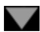

<table><tr><td>document abstracts</td><td>the mechanics of inflation</td><td>a.m.turing: computing machinery &amp; intelligence</td><td>the Turing test and intelligence</td><td>Metalogic A: The Confusions of Gödel</td><td>site orientation</td><td>multiple uses for this glittering enti</td></tr></table>

news and comment

{230}

document abstra cts brięfings abstra čfs

A. M. Turing information resources

[ NOV. 12 1936.]

[Received 28 May, 1936.—Read 12 November, 1936.]

# ON COMPUTABLE NUMBERS, WITH AN APPLICATION TO THE ENTSCHEIDUNGSPROBLEM

By A. M. TURING

There are many complex characters in this paper; if you find them difficult to distinguish, you are advised to increase the viewing size. (In IExplorer, go to View menu, Text Size; in Netscape, go to View menu, Increase Font.)

## INDEX

1. Computing machines.

2. Definitions. Automatic machines. Computing machines. Circle and circle-free numbers. Computable sequences and numbers.

3. Examples of computing machines.

4. Abbreviated tables Further examples.

5. Enumeration of computable sequences.

6. The universal computing machine.

7. Detailed description of the universal machine.

8. Application of the diagonal process.

9. The extent of the computable numbers. 10. Examples of large classes of numbers which are computable. 11. Application to the Entscheidungsproblem. APPENDIX

Ads by Google

CSS Standards Web Design Art & Logic Inc. - Software and Web application development since 1991. www.artlogic.com/web

ON COMPUTABLE NUMBERS, WITH AN APPLICATION TO THE ENTSCHEIDUNGSPROBLEM. A CORRECTION By A. M. Turing Publisher’s copyright notice—the London Mathematical Society Endnotes

CSS Style Sheet Users Get 800 MB storage, 40 GB transfer, PHP, Perl, MySQL \$7.95/mo. (aff.) www.lunarpages.com

advertising disclaimer

The “computable” numbers may be described briefly as the real numbers whose expressions as a decimal are calculable by finite means. Although the subject of this paper is ostensibly the computable numbers, it is almost equally easy to define and investigate computable functions of an integral variable or a real or computable variable, computable predicates, and so forth. The fundamental problems involved are, however, the same in each case, and I have chosen the computable numbers for explicit treatment as involving the least cumbrous technique. I hope shortly to give an account of the relations of the computable numbers, functions, and so forth to one another. This will include a development of the theory of functions of a real variable expressed in terms of computable numbers. According to my definition, a number is computable if its decimal can be written down by a machine.

In §§ 9, 10 I give some arguments with the intention of showing that the computable numbers include all numbers which could naturally be regarded as computable. In particular, I show that certain large classes of numbers are computable. They include, for instance, the real parts of all algebraic numbers, the real parts of the zeros of the Bessel functions, the numbers X, e, etc. The computable numbers do not, however, include all definable numbers, and an example is given of a definable number which is not computable.

Although the class of computable numbers is so great, and in many ways similar to the class of real numbers, it is nevertheless enumerable. In §8 I examine certain arguments which would seem to prove the contrary. By the correct application of one of these arguments, conclusions are reached which are superficially similar to those of Gödel [1] . These results {231} have valuable applications. In particular, it is shown (§11) that the Hilbertian Entscheidungsproblem can have no solution.

In a recent paper Alonzo Church[2] has introduced an idea of “effective calculability”, which is equivalent to my “computability”, but is very differently defined. Church also reaches similar conclusions about the Entscheidungsproblem.[3] The proof of equivalence between “computability” and “effective calculability” is outlined in an appendix to the present paper. to

## 1. Computing machines.

We have said that the computable numbers are those whose decimals are calculable by finite means. This requires rather more explicit definition. No real attempt will be made to justify the definitions given until we reach §9. For the present I shall only say that the justification lies in the fact that the human memory is necessarily limited.

We may compare a man in the process of computing a real number to a machine which is only capable of a finite number of conditions q1, q2, ..., qR which will be called “mconfigurations”. The machine is supplied with a “tape”, (the analogue of paper) running through it, and divided into sections (called “squares”) each capable of bearing a “symbol”. At any moment there is just one square, say the r-th, bearing the symbol S(r) which is “in the machine”. We may call this square the “scanned square”. The symbol on the scanned square may be called the “scanned symbol”. The “scanned symbol” is the only one of which the machine is, so to speak, “directly aware”. However, by altering its m-configuration the machine can effectively remember some of the symbols which it has “seen” (scanned) previously. The possible behaviour of the machine at any moment is determined by the m-configuration qn and the scanned symbol S(r). This pair ${ \mathfrak { q } } _ { n } , { \mathfrak { S } } ( r )$ will be called the “configuration”: thus the configuration determines the possible behaviour of the machine. In some of the configurations in which the scanned square is blank (i.e. bears no symbol) the machine writes down a new symbol on the scanned square: in other configurations it erases the scanned symbol. The machine may also change the square which is being scanned, but only by shifting it one place to right or 1eft. In addition to any of these operations the m-configuration may be changed. Some of the symbols written down {232} will form the sequence of figures which is the decimal of the real number which is being computed. The others are just rough notes to “assist the memory”. It will only be these rough notes which will be liable to erasure.

It is my contention that these operations include all those which are used in the computation of a number. The defence of this contention will be easier when the theory of the machines is familiar to the reader. In the next section I therefore proceed with the development of the theory and assume that it is understood what is meant by “machine”, “tape”, “scanned”, etc. to to

## 2. Definitions.

## Automatic machines.

If at each stage the motion of a machine (in the sense of §1) is completely determined by the configuration, we shall call the machine an “automatic machine” (or a-machine). For some purposes we might use machines (choice machines or c-machines) whose motion is only partially determined by the configuration (hence the use of the word “possible” in §1). When such a machine reaches one of these ambiguous configurations, it cannot go on until some arbitrary choice has been made by an external operator. This would be the case if we were using machines to deal with axiomatic systems. In this paper I deal only with automatic machines, and will therefore often omit the prefix a-.

## Computing machines.

If an a-machine prints two kinds of symbols, of which the first kind (called figures) consists entirely of 0 and 1 (the others being called symbols of the second kind), then the machine will be called a computing machine. If the machine is supplied with a blank tape and set in motion, starting from the correct initial m-configuration, the subsequence of the symbols printed by it which are of the first kind will be called the sequence computed by the machine. The real number whose expression as a binary decimal is obtained by prefacing this sequence by a decimal point is called the number computed by the machine.

At any stage of the motion of the machine, the number of the scanned square, the complete sequence of all symbols on the tape, and the m-configuration will be said to describe the complete configuration at that stage. The changes of the machine and tape between successive complete configurations will be called the moves of the machine.

{233}

Circular and circle-free machines.

If a computing machine never writes down more than a finite number of symbols of the first kind it will be called circular. Otherwise it is said to be circle-free.

A machine will be circular if it reaches a configuration from which there is no possible move, or if it goes on moving, and possibly printing symbols of the second kind, but cannot print any more symbols of the first kind. The significance of the term “circular” will be explained in §8.

## Computable sequences and numbers.

A sequence is said to be computable if it can be computed by a circle-free machine. A number is computable if it differs by an integer from the number computed by a circlefree machine.

We shall avoid confusion by speaking more often of computable sequences than of computable numbers.

## 3. Examples of computing machines.

I. A machine can be constructed to compute the sequence 010101.... The machine is to have the four m-configurations “ b”, “c”, “z”, “e” and is capable of printing “0”, and “1”. The behaviour of the machine is described in the following table in which “R” means “the machine moves so that it scans the square immediately on the right of the one it was scanning previously”. Similarly for “L”. “E” means the scanned symbol is “erased” and “P” stands for “prints”. This table (and all succeeding tables of the same kind) is to be understood to mean that for a configuration described in the first two columns the operations in the third column are carried out successively, and the machine then goes over into the m-configuration described in the last column. When the second column is left blank, it is understood that the behaviour of the third and fourth columns applies for any symbol and for no symbol. The machine starts in the m-configuration b with a blank tape.

<table><tr><td colspan="2">Configuration</td><td colspan="2">Behaviour</td></tr><tr><td>b</td><td>None</td><td>P0, R</td><td>c</td></tr><tr><td>c</td><td>None</td><td>R</td><td>e</td></tr><tr><td>e</td><td>None</td><td>P1, R</td><td>f</td></tr><tr><td>f</td><td>None</td><td>R</td><td>b</td></tr></table>

{234}If (contrary to the description in §1) we allow the letters L, R to appear more than once in the operations column we can simplify the table considerably.

<table><tr><td>m-config.</td><td>symbol</td><td>operations</td><td>final m-config.</td></tr><tr><td rowspan="3">b</td><td>None</td><td>P0</td><td>b</td></tr><tr><td>0</td><td>R, R, P1</td><td>b</td></tr><tr><td>1</td><td>R, R, P0</td><td>b</td></tr></table>

II. As a slightly more difficult example we can construct a machine to compute the sequence 001011011101111011111.... The machine is to be capable of five mconfigurations, viz. “o”, “q”, “p”, “f”, “b” and of printing “e”, “x”, “0”, “1”. The first three symbols on the tape will be “ e e 0”; the other figures follow on alternate squares. On the intermediate squares we never print anything but “x”. These letters serve to “keep the place” for us and are erased when we have finished with them. We also arrange that in the sequence of figures on alternate squares there shall be no blanks.

<table><tr><td colspan="2">Configuration</td><td colspan="2">Behaviour</td></tr><tr><td>m-config.</td><td>symbol</td><td>operations</td><td>final m-config.</td></tr><tr><td>b</td><td></td><td>Pə, R, Pə, R, P0,R, R, P0,L, L</td><td>o</td></tr><tr><td>o</td><td>{10</td><td>R, Px, L, L, L</td><td>oq</td></tr><tr><td>q</td><td>Any (0 or 1)</td><td>R, R</td><td>q</td></tr></table>

On computable numbers, with an application to the Entscheidungsproblem - A. M. ... Pagina 6 di 38

<table><tr><td></td><td>None</td><td>P1, L</td><td>p</td></tr><tr><td rowspan="3">p</td><td>x</td><td>E, R</td><td>q</td></tr><tr><td>ə</td><td>R</td><td>f</td></tr><tr><td>None</td><td>L, L</td><td>p</td></tr><tr><td rowspan="2">f</td><td>Any</td><td>R, R</td><td>f</td></tr><tr><td>None</td><td>P0, L, L</td><td>o</td></tr></table>

To illustrate the working of this machine a table is given below of the first few complete configurations. These complete configurations are described by writing down the sequence of symbols which are on the tape, {235} with the m-configuration written below the scanned symbol. The successive complete configurations are separated by colons.

$$
\begin{array}{c c c c c c c c c c c c c} \text {: e e 0} & 0: \text {e e 0} & 0: \text {e e 0} & 0: \text {e e 0} & 0 & \text {: e e 0} & 0 & 1: \\ \mathfrak {b} & \mathfrak {p} & \mathfrak {q} & & \mathfrak {q} & & \mathfrak {q} & & \mathfrak {p} \\ \text {e e 0} & 0 & 1: \text {e e 0} & 0 & 1: \text {e e 0} & 0 & 1: \text {e e 0} & 0 & 1: \\ \mathfrak {p} & & \mathfrak {p} & & \mathfrak {f} & & & \mathfrak {f} \\ \text {e e 0} & 0 & 1: \text {e e 0} & 0 & 1 & : \text {e e 0} & 0 & 1 & 0: \\ & & \mathfrak {f} & & \mathfrak {f} & & \mathfrak {o} \\ \text {e e 0} & 0 & 1 x 0: \dots . \\ \mathfrak {o} \end{array}
$$

This table could also be written in the form

$$
\begin{array}{l} \text {b}: \text {e} \text {e} \text {o} 0 \quad 0: \text {e} \text {e} \text {q} 0 \quad 0: \\ \dots , \end{array}\tag{C}
$$

in which a space has been made on the left of the scanned symbol and the mconfiguration written in this space. This form is less easy to follow, but we shall make use of it later for theoretical purposes.

The convention of writing the figures only on alternate squares is very useful: I shall always make use of it. I shall call the one sequence of alternate squares F-squares and the other sequence E-squares. The symbols on E-squares will be liable to erasure. The symbols on F-squares form a continuous sequence. There are no blanks until the end is reached. There is no need to have more than one E-square between each pair of Fsquares: an apparent need of more E-squares can be satisfied by having a sufficiently rich variety of symbols capable of being printed on E-squares. If a symbol J- is on an Fsquare S and a symbol I is on the E-square next on the right of S, then S and J will be said to be marked with I. The process of printing this I will be called marking J (or S) with I. to to

## 4. Abbreviated tables

There are certain types of process used by nearly all machines, and these, in some machines, are used in many connections. These processes include copying down sequences of symbols, comparing sequences, erasing all symbols of a given form, etc. Where such processes are concerned we can abbreviate the tables for the mconfigurations considerably by the use of “skeleton tables”. In skeleton tables there appear capital German letters [4] and small Greek letters. These are of the nature of “variables”. By replacing each capital German letter throughout by an m-configuration {236} and each small Greek letter by a symbol, we obtain the table for an mconfiguration.

The skeleton tables are to be regarded as nothing but abbreviations: they are not essential. So long as the reader understands how to obtain the complete tables from the skeleton tables, there is no need to give any exact definitions in this connection.

Let us consider an example:

<table><tr><td colspan="3">m-configuration Symbol Behaviour</td><td>Final m-config.</td><td></td></tr><tr><td> $\mathfrak{f}(\mathbb{C},\mathfrak{B},\alpha)$ </td><td colspan="2"> $\begin{array}{cc} \vartheta & L \\ \text{not } \vartheta & L \end{array}$ </td><td> $\mathfrak{f}_{1}(\mathbb{C},\mathfrak{B},\alpha)$ </td><td>From the m-configuration  $\mathfrak{f}$ ( $\mathbb{C},\mathfrak{B},\alpha$ ) the machine</td></tr><tr><td> $\mathfrak{f}_{1}(\mathbb{C},\mathfrak{B},\alpha)$ </td><td colspan="2"> $\begin{array}{cc} \alpha & R \\ \text{not } \alpha & R \\ \text{None} & \end{array}$ </td><td> $\mathbb{C}$ </td><td rowspan="2">finds the symbol of form  $\alpha$  which is farthest to the left (the “first  $\alpha$ ”) and the m-configuration then becomes  $\mathbb{C}$ . If there is no  $\alpha$  then the m-configuration becomes  $\mathfrak{B}$ .</td></tr><tr><td> $\mathfrak{f}_{2}(\mathbb{C},\mathfrak{B},\alpha)$ </td><td colspan="2"> $\begin{array}{cc} \alpha & R \\ \text{not } \alpha & R \\ \text{None} & \end{array}$ </td><td> $\mathbb{C}$ </td></tr></table>

If we were to replace C throughout by q (say), B by r, and I by x, we should have a complete table for the m-configuration f(qYr, x). f is called an “m-configuration function” or “m-function”.

The only expressions which are admissible for substitution in an m-function are the mconfigurations and symbols of the machine. Those have to be enumerated more or less explicitly: they may include expressions such as p (e, x); indeed they must if there are any m-functions used at all. If we did not insist on this explicit enumeration but simply stated that the machine had certain m-configurations (enumerated) and all mconfigurations obtainable by substitution of m-configurations in certain m-functions, we should usually get an infinity of m-configurations; e.g., we might say that the machine was to have the m-configuration q and all m-configurations obtainable by substituting an m-configuration for C in p(C). Then it would have qY ${ \mathfrak { p } } ( { \mathfrak { q } } ) , { \mathfrak { p } } ( { \mathfrak { p } } ( { \mathfrak { q } } ) ) , { \mathfrak { p } } \left( { \mathfrak { p } } ( { \mathfrak { p } } ( { \mathfrak { q } } ) ) \right)$ ... as m-configurations.

Our interpretation rule then is this. We are given the names of the m-configurations of the machine, mostly expressed in terms of m-functions. We are also given skeleton tables. All we want is the complete table for the m-configurations of the machine. This is obtained by repeated substitution in the skeleton tables.

## {237} Further examples.

(In the explanations the symbol $\stackrel { 6 6 } { \longrightarrow } \stackrel { 9 9 }$ is used to signify “the machine goes into the mconfiguration ...”)

$$
\begin{array}{c c c c} \mathfrak {e} (\mathbb {C}, \mathfrak {B}, \alpha) & & \mathfrak {f} (e _ {1} (\mathbb {C}, \mathfrak {B}, \alpha) & \text {From} e (\mathbb {C}, \mathfrak {B}, \alpha) \\ & & \mathfrak {B}, \alpha) & \text {the first} \alpha \text {is} \\ & & & \text {erased and} \to \mathbb {C}. \\ e _ {1} (\mathbb {C}, \mathfrak {B}, \alpha) & E & \mathbb {C} & \text {If there is} \\ & & & \text {no} \alpha \to \mathfrak {B}. \end{array}
$$

$$
\begin{array}{c c} \mathfrak {e} (\mathfrak {V}, \alpha) & \mathfrak {e} (\mathfrak {e} (\mathfrak {V}, \alpha), \mathfrak {V}, \alpha) \quad \text {From} \mathfrak {e} (\mathfrak {V}, \alpha) \text {all} \\ & \text {letters} \alpha \text {are} \\ & \text {erased and} \to \mathfrak {V} \end{array}
$$

The last example seems somewhat more difficult to interpret than most. Let us suppose that in the list of m-configurations of some machine there appears ${ \mathfrak { e } } ( { \mathfrak { b } } , x ) ( = { \mathfrak { q } } , \operatorname { s a y } )$ . The table is

or

$$
\begin{array}{c c} \mathfrak {e} (\mathfrak {b}, x) & \mathfrak {e} (\mathfrak {e} (\mathfrak {b}, x), \mathfrak {b}, x) \\ \mathfrak {q} & \mathfrak {e} (\mathfrak {q}, \mathfrak {b}, x). \end{array}
$$

Or, in greater detail:

$$
\begin{array}{c c c} \mathfrak {q} & & \mathfrak {e} (\mathfrak {q}, \mathfrak {b}, x) \\ \mathfrak {e} (\mathfrak {q}, \mathfrak {b}, x) & & \mathfrak {f} (\mathfrak {e} _ {1} (\mathfrak {q}, \mathfrak {b}, x), \mathfrak {b}, x) \\ \mathfrak {e} _ {1} (\mathfrak {q}, \mathfrak {b}, x) & E & \mathfrak {q}. \end{array}
$$

In this we could replace $\mathfrak { e } _ { 1 } \left( \mathfrak { q } , \mathfrak { V } , x \right)$ by $\ P$ and then give the table for f(with the right substitutions) and eventually reach a table in which no m-functions appeared.

<table><tr><td colspan="2"> $\mathfrak{p}e(\mathbf{C},\beta)$ </td><td> $\mathfrak{f}(\mathfrak{p}e_1(\mathbf{C},\beta)\mathbf{C},\vartheta)$ </td><td rowspan="2">From  $\mathfrak{p}e(\mathbf{C},\beta)$  the machine prints  $\beta$  at the end of the sequence of symbols and  $\rightarrow \mathbf{C}$ .</td></tr><tr><td> $\mathfrak{p}e_1(\mathbf{C},\beta)$ </td><td> $\left\{\begin{array}{cc}Any & R,R \\ None & P\beta\end{array}\right.$ </td><td> $\mathfrak{p}e_1(\mathbf{C},\beta)$ </td></tr><tr><td> $\mathfrak{l}(\mathbf{C})$ </td><td> $L$ </td><td> $\mathbf{C}$ </td><td rowspan="2">From  $\mathfrak{f}'(\mathbf{C},\mathfrak{B},\alpha)$  it does the same as for  $\mathfrak{f}(\mathbf{C},\mathfrak{B},\alpha)$  but moves to the left before  $\mathbf{C}$ .</td></tr><tr><td> $\mathfrak{r}(\mathbf{C})$ </td><td> $R$ </td><td> $\mathbf{C}$ </td></tr></table>

On computable numbers, with an application to the Entscheidungsproblem - A. M. ... Pagina 9 di 38

<table><tr><td> $\mathfrak{f}'(\mathbf{C},\mathfrak{B},\alpha)$ </td><td></td><td> $\mathfrak{f}(\mathfrak{l}(\mathbf{C}),\mathfrak{B},\alpha)$ </td><td></td></tr><tr><td> $\mathfrak{f}''(\mathbf{C},\mathfrak{B},\alpha)$ </td><td></td><td> $\mathfrak{f}(\mathfrak{r}(\mathbf{C}),\mathfrak{B},\alpha)$ </td><td></td></tr><tr><td> $\mathfrak{c}(\mathbf{C},\mathfrak{B},\alpha)$ </td><td></td><td> $\mathfrak{f}(\mathfrak{c}_{1}(\mathbf{C}),\mathfrak{B},\alpha)$ </td><td rowspan="2"> $\mathfrak{c}(\mathbf{C},\mathfrak{B},\alpha)$ . The machine writes at the end the first symbol marked  $\alpha$  and  $\rightarrow \mathbf{C}$ .</td></tr><tr><td> $\mathfrak{c}_{1}(\mathbf{C})$ </td><td> $\beta$ </td><td> $\mathfrak{p}\mathfrak{e}(\mathbf{C},\beta)$ </td></tr></table>

{238} The last line stands for the totality of lines obtainable from it by replacing J by any symbol which may occur on the tape of the machine concerned.

<table><tr><td> $\mathfrak{c}\mathfrak{e}(\mathbb{C},\mathfrak{B},\alpha)$ </td><td rowspan="2"> $\mathfrak{c}(\mathfrak{e}(\mathbb{C},\mathfrak{B},\alpha), \mathfrak{B},\alpha)$ </td><td rowspan="3"> $\mathfrak{c}\mathfrak{e}(\mathfrak{B},\alpha).$  The machine copies down in order at the end all symbols marked  $\alpha$  and erases the letters  $\alpha; \rightarrow \mathfrak{B}.$ </td></tr><tr><td> $\mathfrak{c}\mathfrak{e}(\mathfrak{B},\alpha)$ </td></tr><tr><td></td><td> $\mathfrak{c}\mathfrak{e}(\mathfrak{c}\mathfrak{e}(\mathfrak{B},\alpha), \mathfrak{B},\alpha)$ </td></tr><tr><td> $\mathfrak{r}\mathfrak{e}(\mathbb{C},\mathfrak{B},\alpha,\beta)$ </td><td> $\mathfrak{f}(\mathfrak{r}\mathfrak{e}_{1}$ </td><td rowspan="4"> $\mathfrak{r}\mathfrak{e}(\mathbb{C},\mathfrak{B},\alpha,\beta).$  The machine replaces the first  $\alpha$  by  $\beta$  and  $\rightarrow \mathbb{C} \rightarrow \mathfrak{B}$  if there is no  $\alpha.$ </td></tr><tr><td> $\mathfrak{r}\mathfrak{e}_{1}(\mathbb{C},\mathfrak{B},\alpha,\beta)$ </td><td> $(\mathbb{C},\mathfrak{B},\alpha,\beta)$ </td></tr><tr><td></td><td> $\mathfrak{B},\alpha)$ </td></tr><tr><td></td><td> $\mathbb{C}$ </td></tr><tr><td> $\mathfrak{r}\mathfrak{e}(\mathfrak{B},\alpha,\beta)$ </td><td> $\mathfrak{r}\mathfrak{e}(\mathfrak{r}\mathfrak{e}(\mathfrak{B},\alpha,\beta)$   $\mathfrak{B},\alpha,\beta)$ </td><td> $\mathfrak{r}\mathfrak{e}(\mathfrak{B},\alpha,\beta).$  The machine replaces all letters  $\alpha$  by  $\beta; \rightarrow \mathfrak{B}.$ </td></tr><tr><td> $\mathfrak{c}\mathfrak{r}(\mathbb{C},\mathfrak{B},\alpha)$ </td><td> $\mathfrak{c}(\mathfrak{r}\mathfrak{e}(\mathbb{C},\mathfrak{B},\alpha,a)$ </td><td> $\mathfrak{c}\mathfrak{r}(\mathfrak{B},\alpha)$  differs from  $\mathfrak{c}\mathfrak{e}$ </td></tr><tr><td> $\mathfrak{c}\mathfrak{r}(\mathfrak{B},\alpha)$ </td><td> $\mathfrak{B},\alpha)$ </td><td> $(\mathfrak{B},\alpha)$  only in that the letters  $\alpha$  are not erased.</td></tr><tr><td></td><td> $\mathfrak{c}\mathfrak{r}(\mathfrak{c}\mathfrak{r}(\mathfrak{B},\alpha), \mathfrak{r}\mathfrak{e}(\mathfrak{B},a,\alpha),\alpha)$ </td><td>The  $m$ -configuration  $\mathfrak{c}\mathfrak{r}$  ( $\mathfrak{B},\alpha$ ) is taken up when no letters “ $a$ ” are on the tape.</td></tr><tr><td> $\mathfrak{c}\mathfrak{p}(\mathbb{C},\mathfrak{A},\mathfrak{E},\alpha,\beta)$ </td><td colspan="2"> $\mathfrak{f}'(\mathfrak{c}\mathfrak{p}_{1},\mathbb{C}_{1},\mathfrak{A},\beta),\mathfrak{f}(\mathfrak{A},\mathfrak{E},\beta),\alpha)$ </td></tr><tr><td> $\mathfrak{c}\mathfrak{p}_{1}(\mathbb{C},\mathfrak{A},\beta)$ </td><td> $\gamma$ </td><td> $\mathfrak{f}'(\mathfrak{c}\mathfrak{p}_{2}(\mathbb{C},\mathfrak{A},\beta),\mathfrak{A},\beta)$ </td></tr><tr><td> $\mathfrak{c}\mathfrak{p}_{2} \left\{\begin{array}{l}\mathfrak{c}\mathfrak{p}_{2} \\(\mathbb{C},\mathfrak{A},\gamma)\end{array}\right\}$ </td><td> $\gamma$ not  $\gamma$ </td><td> $\mathbb{C}$   $\mathfrak{A}.$ </td></tr></table>

The first symbol marked I and the first marked $\beta$ are compared. If there is neither I nor $\beta \to { \bf { \mathscr { E } } }$ . If there are both and the symbols are alike, \C. Otherwise $ \mathfrak { U }$

$$
\mathfrak {c p e} (\mathbb {C}, \mathfrak {A}, \mathfrak {E}, \alpha , \beta) \mathfrak {c p} \left(e (\mathfrak {e} (\mathbb {C}, \mathbb {C}, \beta) \mathbb {C}, \alpha), \mathfrak {A}, \mathfrak {E}, \alpha , \beta\right)
$$

C ${ \mathfrak { p e } } ( \mathbb { C } , \mathfrak { A } , \mathbb { e } , \alpha , \beta )$ differs from ${ \mathfrak { c p } } ( { \mathfrak { C } } , { \mathfrak { A } } , { \mathfrak { C } } , \alpha , \beta )$ in that in the case when there is

similarity the first I and $\beta$ are erased.

$$
\mathfrak {c p e} (\mathfrak {A}, \mathfrak {E}, \alpha , \beta) \quad \mathfrak {c p e} (\mathfrak {c p e} (\mathfrak {A}, \mathfrak {E}, \alpha , \beta), \mathfrak {A}, \mathfrak {E}, \alpha , \beta).
$$

${ \mathfrak { c p e } } ( { \mathfrak { A } } , { \mathfrak { C } } , \alpha , \beta )$ . The sequence of symbols marked I is compared with the sequence marked $\beta . \ \to { \bf \ C }$ if they are similar. Otherwise U. Some of the symbols Iand $\beta$ are erased.

<table><tr><td rowspan="2">q(C)</td><td rowspan="2">{ Any RNone R</td><td>q(C)</td><td rowspan="2">q(C,α). The machine finds the last symbol of form α. →C.</td></tr><tr><td>q1(C)</td></tr><tr><td rowspan="2">q1(C)</td><td rowspan="2">{ Any RNone</td><td>q(C)</td><td></td></tr><tr><td>C</td><td></td></tr><tr><td>q(C,α)</td><td></td><td>q(q1(C,α))</td><td></td></tr><tr><td rowspan="2">q1(C,α)</td><td rowspan="2">{ αnot α L</td><td>C</td><td></td></tr><tr><td>q1(C,α)</td><td></td></tr><tr><td>pe2(C,α,β)</td><td></td><td>pe(pe(C,β),α)</td><td>pe2(pe(C,α,β). The machine prints α β at the end.</td></tr><tr><td>ce2(B,α,β)</td><td></td><td>ce(ce(B,β),α)</td><td rowspan="2">ce3(B,α,β,γ). The machine copies down at the end first the symbols marked α, then those marked β, and finally those marked γ; it erases the symbols α,β,γ.</td></tr><tr><td>ce3(B,α,β,γ)</td><td></td><td>ce(ce2(B,β,γ),α)</td></tr><tr><td>e(C)</td><td>{ ∃ Not ∃ R L</td><td>e1(C)e(C)</td><td>From e(C) the marks are erased from all marked symbols. →C.</td></tr><tr><td rowspan="2">e1(C)</td><td rowspan="2">{ Any E, None R</td><td>e1(C)</td><td></td></tr><tr><td>C</td><td></td></tr></table>

## 5. Enumeration of computable sequences.

A computable sequence $\gamma$ is determined by a description of a machine which computes $\gamma .$ Thus the sequence 001011011101111... is determined by the table on p.234, and, in fact, any computable sequence is capable of being described in terms of such a

table.

It will be useful to put these tables into a kind of standard form. In the first place let us suppose that the table is given in the same form as the first table, for example, I on p.233. That is to say, that the entry in the operations column is always of one of the forms $E : E , R : E , L : P a : P a , R : P a , L : R : L$ : or no entry at all. The table can always be put into this form by introducing more m-configurations. Now let us give numbers to the m-configurations, calling them q1 , ..., qR, as in § 1. The initial m-configuration is always to be called q1. We also give numbers to the symbols $S _ { 1 } , . . . , S _ { m }$ {240}and, in particular, $\mathrm { b l a n k } = S _ { 0 } , 0 = S _ { 1 } , 1 = S _ { 2 }$ . The lines of the table are now of form

<table><tr><td>m-config.</td><td>symbol</td><td>operations</td><td>final m-config.</td><td></td></tr><tr><td>qi</td><td> $S_j$ </td><td> $PS_k, L$ </td><td>qm</td><td> $(N_1)$ </td></tr><tr><td>qi</td><td> $S_j$ </td><td> $PS_k, R$ </td><td>qm</td><td> $(N_2)$ </td></tr><tr><td>qi</td><td> $S_j$ </td><td> $PS_k$ </td><td>qm</td><td> $(N_3)$ </td></tr><tr><td colspan="5">Lines such as</td></tr><tr><td>qi</td><td> $S_j$ </td><td>E, R</td><td>qm</td><td></td></tr><tr><td colspan="5">Are to be written as</td></tr><tr><td>qi</td><td> $S_j$ </td><td> $PS_0, R$ </td><td>qm</td><td></td></tr><tr><td colspan="5">And lines such as</td></tr><tr><td colspan="5">To be written as</td></tr><tr><td>qi</td><td> $S_j$ </td><td> $PS_j, R$ </td><td>qm</td><td></td></tr></table>

In this way we reduce each line of the table to a line of one of the forms $( N _ { 1 } ) , ( N _ { 2 } ) , ( N _ { 3 } )$

From each line of form $( N _ { 1 } )$ let us form an expression qi $S j \ S k \ L q _ { m }$ ; from each line of form $\left( N _ { 2 } \right)$ we form an expression qi $S i \ S k \ R q _ { m }$ ; and from each line of form $( N _ { 3 } )$ we form an expression qi $S _ { j }$ Sk $N q _ { m }$ . Let us write down all expressions so formed from the table for the machine and separate them by semi-colons. In this way we obtain a complete description of the machine. In this description we shall replace $q _ { i }$ by the letter $" D ^ { \prime }$ followed by the letter “A” repeated i times, and $S _ { j }$ by $" D ^ { \dag }$ followed by $^ { 6 6 } C ^ { 9 }$ repeated j times. This new description of the machine may be called the standard description (S.D). It is made up entirely from the letters $^ { \mathrm { \scriptsize ~ \textit ~ { \circ ~ } } } A ^ { \mathrm { \scriptsize ~ \textit ~ { \circ ~ } } } , ^ { \mathrm { \scriptsize ~ \textit ~ { \circ ~ } } } C ^ { \mathrm { \scriptsize ~ \textit ~ { \circ ~ } } } , ^ { \mathrm { \scriptsize ~ \textit ~ { \circ ~ } } } D ^ { \mathrm { \scriptsize ~ \prime \prime } } , ^ { \mathrm { \scriptsize ~ \textit ~ { \circ ~ } } } , ^ { \mathrm { \scriptsize ~ \textit ~ { \circ ~ } } } R ^ { \mathrm { \scriptsize ~ \prime \prime } } , ^ { \mathrm { \scriptsize ~ \textit ~ { \circ ~ } } } N ^ { \mathrm { \scriptsize ~ \prime \prime } }$ , and from $\stackrel { 6 6 } { \mathop { : } } \stackrel { 9 9 }$

If finally we replace “A” by “1”, “C” by “2”, “D” by “3”, “L” by $^ { 6 6 } 4 ^ { 9 9 } , ^ { 6 6 } R ^ { 9 9 }$ by “5”, “N” by $" 6 "$ , and “;” by “7” we shall have a description of the machine in the form of an arabic numeral. The integer represented by this numeral may be called a description number (D.N) of the machine. The D.N determine the S.D and the structure of the {241} machine uniquely. The machine whose D.N is n may be described as M(n).

To each computable sequence there corresponds at least one description number, while to no description number does there correspond more than one computable sequence. The computable sequences and numbers arc therefore enumerable.

Let us find a description number for the machine I of §3. When we rename the m-

<table><tr><td colspan="4">Other tables could be obtained by adding irrelevant lines such as</td></tr><tr><td></td><td> $q_{1}$ </td><td> $S_{1}$ </td><td> $PS_{1}, R$ </td></tr></table>

configurations its table becomes:

<table><tr><td> $q_1$ </td><td> $S_0$ </td><td> $PS_1, R$ </td><td> $q_2$ </td></tr><tr><td> $q_2$ </td><td> $S_0$ </td><td> $PS_0, R$ </td><td> $q_3$ </td></tr><tr><td> $q_3$ </td><td> $S_0$ </td><td> $PS_2, R$ </td><td> $q_4$ </td></tr><tr><td> $q_4$ </td><td> $S_0$ </td><td> $PS_0, R$ </td><td> $q_1$ </td></tr></table>

Our first standard form would be

$$
\begin{array}{l} q _ {1} S _ {0} S _ {1} R q _ {2}; q _ {2} S _ {0} S _ {0} R q _ {3}; q _ {3} S _ {0} S _ {0} R q _ {4}; \\ q _ {4} S _ {0} S _ {2} R q _ {1};. \end{array}
$$

The standard description is

$$
\begin{array}{c} \text {DADDCRDAA; DAADDRDAAA;} \\ \text {DAAADDCCRDAAAA; DAAAADDRDA;} \end{array}
$$

A description number is

$$
3 1 3 3 2 5 3 1 1 7 3 1 1 3 3 5 3 1 1 1 7 3 1 1 1 3 3 2 2 5 3 1 1 1 1 7 3 1 1 1 1 3 3 5 3 1 7
$$

and so is

$$
3 1 3 3 2 5 3 1 1 7 3 1 1 3 3 5 3 1 1 1 7 3 1 1 1 3 3 2 2 5 3 1 L 1 1 7 3 1 1 1 1 3 3 5 3 1 7 3 1 3 2 3 2 5 3 1 1 7
$$

A number which is a description number of a circle-free machine will be called a satisfactory number. In §8 it is shown that there can be no general process for determining whether a given number is satisfactory or not.

## 6. The universal computing machine.

It is possible to invent a single machine which can be used to compute any computable sequence. If this machine $\boldsymbol { \mathcal { U } }$ is supplied with a tape on the beginning of which is written the S.D of some computing machine M, {242} then I will compute the same sequence as M. In this section I explain in outline the behavior of the machine. The next section is devoted to giving the complete table for I.

Let us first suppose that we have a machine $\mathcal { M } ^ { \prime }$ which will write down on the F-squares the successive complete configurations of M. These might be expressed in the same form as on p.235, using the second description, (C), with all symbols on one line. Or, better, we could transform this description (as in §5) by replacing each m-configuration by $" D ^ { \prime }$ followed by $^ { 6 6 } A ^ { 9 9 }$ repeated the appropriate number of times, and by replacing each symbol by $" D ^ { \dag }$ followed by $^ { 6 6 } C ^ { 9 }$ repeated the appropriate number of times. The numbers of letters $^ { 6 6 } A ^ { 9 9 }$ and $^ { 6 6 } C ^ { 9 }$ are to agree with the numbers chosen in §5, so that, in particular, $" 0 "$ is replaced by $^ { 6 6 } D C ^ { \mathrm { * } }$ , “1” by “DCC”, and the blanks by $" D ^ { \dag }$ . These substitutions are to be made after the complete configurations have been put together, as in (C). Difficulties arise if we do the substitution first. In each complete configuration the blanks would all have to be replaced by “D” , so that the complete configuration would not be expressed as a finite sequence of symbols.

If in the description of the machine II of §3 we replace “o ” by “DAA”, “e” by “DCCC ”, “q”by “DAAA”, then the sequence (C) becomes:

## DA : DCCCDCCCDAADCDDC : DCCCDCCCDAAADCDDC : ... (C1)

(This is the sequence of symbols on F-squares.)

It is not difficult to see that if M can be constructed, then so can M'. The manner of operation of M' could be made to depend on having the rules of operation (i.e., the S.D) of it written somewhere within itself (i.e. within M'); each step could be carried out by referring to these rules. We have only to regard the rates as being capable of being taken out and exchanged or others and we have something very akin to the universal machine.

One thing is lacking: at present the machine M' prints no figures. We may correct this by printing between each successive pair of complete configurations the figures which appear in the new configuration but not in the old. Then $\left( \mathbf { C } _ { 1 } \right)$ becomes

$$
D D A: 0: 0: D C C C D C C C D A A D C D D C: D C C C \dots . (C _ {2})
$$

It is not altogether obvious that the E-squares leave enough room for the necessary “rough work”, but this is, in fact, the case.

The sequences of letters between the colons in expressions such as $\left( \mathbf { C } _ { 1 } \right)$ may be used as standard descriptions of the complete configurations. When the letters are replaced by figures, as in §5, we shall have a numerical {243} description of the complete configuration, which may be called its description number. to

## 7. Detailed description of the universal machine.

A table is given below of the behaviour of this universal machine. The m-configurations of which the machine is capable are all those occurring in the first and last columns of the table, together with all those which occur when we write out the unabbreviated tables of those which appear in the table in the form of m-functions. E.g., e(anf) appears in the table and is an m-function. Its unabbreviated table is (see p. 239)

<table><tr><td rowspan="2">e(anf)</td><td rowspan="2">{</td><td>ə</td><td>R</td><td>e1(anf)</td></tr><tr><td>not ə</td><td>L</td><td>e(anf)</td></tr><tr><td rowspan="2">e(anf)</td><td rowspan="2">{</td><td>Any</td><td>R, E, R</td><td>e1(anf)</td></tr><tr><td>None</td><td></td><td>e(anf)</td></tr></table>

Consequently $\mathfrak { e } _ { 1 } ( \mathfrak { a n f } )$ is an m-configuration of $\boldsymbol { \mathcal { U } }$

When I is ready to start work the tape running through it bears on it the symbol e on an F-square and again e on the next E-square; after this, on F-squares only, comes the S.D of the machine followed by a double colon “: :” (a single symbol, on an F-square). The S.D consists of a number of instructions, separated by semi-colons.

Each instruction consists of five consecutive parts

i ) “D” followed by a sequence of letters $^ { 6 6 } A ^ { 9 9 }$ . This describes the relevant mconfiguration.

ii ) “D” followed by a sequence of letters $^ { 6 6 } C ^ { 9 }$ . This describes the scanned symbol.

iii ) $" D ^ { \ast }$ followed by another sequence of letters $^ { 6 6 } C ^ { 9 }$ . This describes the symbol into which the scanned symbol is to be changed.

iv ) $L ^ { 9 } , { } ^ { \ 6 6 } R ^ { 9 } , { } ^ { \ 6 6 } N ^ { 9 }$ , describing whether the machine is to move to left, right, or not at all.

$\mathrm { ~ v ~ } ) \ ^ { 6 6 } D ^ { \ast }$ followed by a sequence of letters $^ { 6 6 } A ^ { 9 9 }$ . This describes the final m-configuration.

The machine $\boldsymbol { \mathcal { U } }$ is to be capable of printing $^ { * * } { \cal A } ^ { * * } , \ ^ { * * } { \cal C } ^ { * * } , \ ^ { * * } { \cal D } ^ { * * } , \ ^ { * * } { \cal O } ^ { * * } , \ ^ { * * } { \cal 1 } ^ { * * } , \ ^ { * * } { \cal u } ^ { * * } , \ ^ { * * } \nu ^ { * * } , \ ^ { * * } \nu ^ { * * } , \ ^ { * * } \chi ^ { * * } ,$ $^ { 6 6 } y ^ { 9 } , ^ { 6 6 } z ^ { 9 9 }$

The S.D is formed from $^ { \ast \ast } ; ^ { \ast } , ^ { \ast } A ^ { \prime \ast } , ^ { \ast } C ^ { \prime \ast } , ^ { \ast } D ^ { \prime \ast } , ^ { \ast } L ^ { \prime \ast } , ^ { \ast } R ^ { \prime \ast } , ^ { \ast } N ^ { \prime \ast } .$

{244} Subsidiary skeleton table.

$$
\left\{ \begin{array}{c c} \text {Not} A \quad R, R & \mathfrak {c o n} (\mathfrak {C}, \alpha) \\ A \quad L, P   \alpha , R & \mathfrak {c o n} _ {1} (\mathfrak {C}, \alpha) \end{array} \right.
$$

con $( \mathbb { C } , \alpha )$ . Starting from an $F _ { - }$ square, S say, the sequence C of symbols describing a configuration closest on the right of S is marked out with letters $\alpha . \to \mathbb { C }$

$$
\begin{array}{c} \mathfrak {c o n} _ {1} \\ (\mathfrak {C}, \alpha) \end{array} \left\{ \begin{array}{r c l} A & R, P   \alpha , R & \mathfrak {c o n} _ {1} (\mathfrak {C}, \alpha) \\ D & R, P   \alpha , R & \mathfrak {c o n} _ {2} (\mathfrak {C}, \alpha) \end{array} \right.
$$

$$
\begin{array}{c} \mathfrak {c o n} _ {1} \\ (\mathfrak {C}, \alpha) \end{array} \left\{ \begin{array}{c c c} C & R, P   \alpha , R & \mathfrak {c o n} _ {2} (\mathfrak {C}, \alpha) \\ \text { Not }   C & R, R & \mathfrak {C} \end{array} \right.
$$

con $\textstyle ( \mathbb { C } , \ )$ . In the final configuration the machine is scanning the square which is four squares to the right of the last square of C. C is left unmarked.

The table for U.

<table><tr><td> $\mathfrak{b}$ </td><td></td><td> $\mathfrak{f}(\mathfrak{b}_1, \mathfrak{b}_1, ::)$ </td><td> $\mathfrak{b}$ . The machine prints :DA on the F-</td></tr><tr><td> $\mathfrak{b}_1$ </td><td>R,R,P :,R,R,PD,R,R,PA</td><td>anf</td><td>squares after :: →anf.</td></tr><tr><td>anf</td><td></td><td> $\mathfrak{g}(\mathfrak{anf}_1, :)$ </td><td>anf. The machine marks the</td></tr><tr><td>anf1</td><td></td><td>con(fom,y)</td><td>configuration in the last complete configuration with y. →fom.</td></tr></table>

$$
\begin{array}{c c c c c} \mathfrak {f o m} \left\{ \begin{array}{c c c c c} ; & R, P z, L & \mathfrak {c o n} (\mathfrak {f m p}, x) & \mathfrak {f o m}. \text {The machine finds the last} \\ z & L, L & \mathfrak {f o m} & \text {semi - colon not marked with z. It} \\ \text {not z} & L & \mathfrak {f o m} & \text {marks this semi - colon with z and the} \\ \text {nor;} & & & \text {configuration following it with x.} \\ \mathfrak {f m p} & \mathfrak {c p e} (e (\mathfrak {f o m}, x, y), \mathfrak {s i m}, x, \\ & y) & & \mathfrak {f m p}. \text {The machine compares the} \\ & & & \text {sequences marked x and y. It erases} \\ & & & \text {all letters x and y.} \to \mathfrak {s i m} \text {if they are} \\ & & & \text {alike. Otherwise} \to \mathfrak {f o m}. \end{array} \right. \end{array}
$$

anf. Taking the long view, the last instruction relevant to the last configuration is found. It can be recognised afterwards as the instruction following the last semi-colon marked z. \sim.

<table><tr><td>sim</td><td></td><td></td><td>f'(sim1, sim1,z)</td><td rowspan="2">sim. The machine marks out the instructions. That part of the instructions which refers to operations to be carried out is marked with u, and the final m-configuration with y. The letters z are erased.</td></tr><tr><td>sim1</td><td></td><td></td><td>con(sim2, )</td></tr><tr><td>sim2</td><td>{</td><td>ANot A</td><td>R, Pu, R,R, R</td><td>sim3sim2</td></tr><tr><td>sim3</td><td>{</td><td>Not A</td><td>L, PyL, Py, R,R, R</td><td>e(mf, z)sim3</td></tr><tr><td>mf</td><td></td><td></td><td>g(mf, :)</td><td>mf. The last complete configuration is marked out into four sections. The configuration is left unmarked. The symbol directly preceding it is marked with x. The remainder of the complete configuration is divided into two parts, of which the first is marked with v and the last with w. A colon is printed after the whole. →sh.</td></tr><tr><td rowspan="2">mf1</td><td rowspan="2">{</td><td>Not A</td><td>R, R</td><td>mf1</td></tr><tr><td>A</td><td>L, L, L, L</td><td>mf2</td></tr><tr><td rowspan="3">mf2</td><td rowspan="3">{</td><td>C</td><td>R, Px, L,L, L</td><td>mf2</td></tr><tr><td>:</td><td></td><td>mf4</td></tr><tr><td>D</td><td>R, Px, L,L, L</td><td>mf3</td></tr><tr><td rowspan="2">mf3</td><td rowspan="2">{</td><td>not :</td><td>R, Pv, L,L, L</td><td>mf3</td></tr><tr><td>:</td><td></td><td>mf4</td></tr><tr><td>mf4</td><td></td><td></td><td>con(l(1(mf5)),)</td><td></td></tr><tr><td rowspan="2">mf5</td><td rowspan="2">{</td><td>Any</td><td>R, Pw, R</td><td>mf5</td></tr><tr><td>None</td><td>P: $\mathfrak{f}(\mathfrak{sh}_1, \mathfrak{inst}, u)$ </td><td>sh $\mathfrak{sh}$ . The instructions (marked  $u$ ) are examined. If it is found that they involve “Print 0” or “Print 1”, then 0: or 1: is printed at the end.</td></tr><tr><td> $\mathfrak{sh}$ </td><td></td><td></td><td></td><td rowspan="6"></td></tr><tr><td> $\mathfrak{sh}_1$ </td><td></td><td> $L, L, L$ </td><td> $\mathfrak{sh}_2$ </td></tr><tr><td> $\mathfrak{sh}_2$ </td><td colspan="2"> $\left\{ \begin{array}{cc} D & R, R, R, R \\ \text{not } D \end{array} \right.$ </td><td> $\mathfrak{sh}_2$ in $\mathfrak{st}$ </td></tr><tr><td> $\mathfrak{sh}_3$ </td><td colspan="2"> $\left\{ \begin{array}{cc} C & R, R \\ \text{not } C \end{array} \right.$ </td><td> $\mathfrak{sh}_4$ in $\mathfrak{st}$ </td></tr><tr><td> $\mathfrak{sh}_4$ </td><td colspan="2"> $\left\{ \begin{array}{cc} C & R, R \\ \text{not } C \end{array} \right.$ </td><td> $\mathfrak{sh}_5$  $\mathfrak{pe}_2 (\mathfrak{inst}, 0, :)$ </td></tr><tr><td> $\mathfrak{sh}_5$ </td><td colspan="2"> $\left\{ \begin{array}{cc} C & \text{inst} \\ \text{not } C \end{array} \right.$ </td><td> $\mathfrak{pe}_2 (\mathfrak{inst}, 1, :)$ </td></tr><tr><td rowspan="6">{246}</td><td>inst</td><td></td><td> $\mathfrak{g}(\mathfrak{l}(\mathfrak{inst}_1), u)$ </td><td rowspan="6">inst. The next complete configuration is written down, carrying out the marked instructions. The letters  $u, v, w, x, y$  are erased. →an $\mathfrak{f}$ .</td></tr><tr><td> $\mathfrak{inst}_1 \alpha$ </td><td> $R, E$ </td><td> $\mathfrak{inst}_1(\alpha)$ </td></tr><tr><td> $\mathfrak{inst}_1(L)$ </td><td></td><td> $\mathfrak{ce}_5(\mathfrak{ob}, v, y, x, u, w)$ </td></tr><tr><td> $\mathfrak{inst}_1(R)$ </td><td></td><td> $\mathfrak{ce}_5(\mathfrak{ob}, v, y, x, u, w)$ </td></tr><tr><td> $\mathfrak{inst}_1(N)$ </td><td></td><td> $\mathfrak{ce}_5(\mathfrak{ob}, v, y, x, u, w)$ </td></tr><tr><td> $\mathfrak{ob}$ </td><td></td><td> $\mathfrak{e}(\mathfrak{an}\mathfrak{f})$ </td></tr></table>

## 8. Application of the diagonal process.

It may be thought that arguments which prove that the real numbers are not enumerable [5] would also prove that the computable numbers and sequences cannot be enumerable . It might, for instance, be thought that the limit of a sequence of computable numbers must be computable. This is clearly only true if the sequence of computable numbers is defined by some rule.

Or we might apply the diagonal process. “If the computable sequences are enumerable, let $\alpha _ { n }$ be the n-th computable sequence, and let $\phi _ { n } ( { \bar { m } } )$ be the m-th figure in $\alpha _ { n }$ . Let $\beta$ be the sequence with $1 - \phi _ { n } ( n )$ as its n-th figure. Since $\beta$ is computable, there exists a number K such that $1 - \phi _ { n } ( n ) = \phi _ { K } ( n )$ all n. Putting $n = K ,$ , we have $1 = 2 \phi _ { K } ( K )$ , i.e. 1 is even. This is impossible. The computable sequences are therefore not enumerable”.

The fallacy in this argument lies in the assumption that $\beta$ is computable. It would be true if we could enumerate the computable sequences by finite means, but the problem of enumerating computable sequences is equivalent to the problem of finding out whether a given number is the D.N of a circle-free machine, and we have no general process for doing this in a finite number of steps. In fact, by applying the diagonal process argument correctly, we can show that there cannot be any such general process.

The simplest and most direct proof of this is by showing that, if this general process exists, then there is a machine which computes $\beta .$ This proof, although perfectly sound, has the disadvantage that it may leave the reader with a feeling that “there must be something wrong”. The proof which I shall give has not this disadvantage, and gives a certain insight into the significance of the idea “circle-free”. It depends not on constructing $\beta$ , but on constructing $\beta ^ { \prime }$ , whose n-th figure is $\phi _ { n } ( n )$

{247} Let us suppose that there is such a process; that is to say, that we can invent a machine $\mathcal { D }$ which, when supplied with the S.D of any computing machine M will test this S.D and if M is circular will mark the S.D with the symbol $\ " u \boldsymbol { \cdot } \boldsymbol { \cdot }$ and if it is circle-free will mark it with $^ { 6 6 } S ^ { 7 9 }$ . By combining the machines $\mathcal { D }$ and $\boldsymbol { \mathcal { U } }$ we could construct a machine $\mathcal { M }$ to compute the sequence $\beta ^ { \prime }$ . The machine $\mathcal { D }$ may require a tape. We may suppose that it uses the E-squares beyond all symbols on F- squares, and that when it has reached its verdict all the rough work done by D is erased.

The machine H has its motion divided into sections. In the first N –1 sections, among other things, the integers $1 , 2 , . . . , N - 1$ have been written down and tested by the machine ${ \mathcal { D } } .$ A certain number, say $R ( N - 1 )$ , of them have been found to be the D.N’s of circle-free machines. In the N-th section the machine $\mathcal { D }$ tests the number N. If N is satisfactory, $i . e . ,$ , if it is the D.N of a circle-free machine, then $R ( N ) = 1 + R ( N - 1 )$ and the first. $R ( N )$ figures of the sequence of which a D.N is N are calculated. The $R ( N ) \mathrm { - t h }$ figure of this sequence is written down as one of the figures of the sequence $\beta ^ { \prime }$ computed by $\mathcal { H }$ . If N is not satisfactory, then $R ( N ) = R ( N - 1 )$ and the machine goes on to the (N + 1)-th section of its motion.

From the construction of Hwe can see that H is circle-free. Each section of the motion of H comes to an end after a finite number of steps. For, by our assumption about ${ \mathcal { D } } .$ the decision as to whether N is satisfactory is reached in a finite number of steps. If N is not satisfactory, then the N-th section is finished. If N is satisfactory, this means that the machine ${ \mathcal { M } } ( N )$ whose D.N is N is circle-free, and therefore its R(N)-th figure can be calculated in a finite number of steps. When this figure has been calculated and written down as the R(N)-th figure of $\beta ^ { \prime }$ , the N-th section is finished. Hence $\mathcal { H }$ is circle-free.

Now let K be the D.N of $\mathcal { H }$ . What does $\mathcal { H }$ do in the K-th section of its motion? It must test whether K is satisfactory, giving a verdict $^ { 6 6 } S ^ { 7 9 }$ or $\ " u \boldsymbol { \cdot } \boldsymbol { \cdot }$ . Since K is the D.N of Hand since $\mathcal { H }$ is circle-free, the verdict cannot be $\ " u \boldsymbol { \mathbf { \mathit { \Sigma } } }$ . On the other hand the verdict cannot be $^ { 6 6 } S ^ { 7 9 }$ . For if it were, then in the K-th section of its motion H would be bound to compute the first $R ( K - 1 ) + 1 = R ( K )$ figures of the sequence computed by the machine with K as its D.N and to write down the $R ( K )$ -th as a figure of the sequence computed by $\mathcal { H }$ . The computation of the first $R ( K ) - 1$ figures would be carried out all right, but the

instructions for calculating the R(K)-th would amount to “calculate the first R(K) figures computed by H and write down the $R ( K ) { \cdot } \mathrm { t h } ^ { \prime }$ . This R(K)-th figure wonld never be found. I.e., H is circular, contrary both to what we have found in the last paragraph and to the verdict $^ { 6 6 } S ^ { 7 }$ . Thus both verdicts are impossible and we conclude that there can be no machine D.

{248} We can show further that there can be no machine R which, when applied with the S.D of an arbitrary machine M, will determine whether M ever prints a given symbol (0 say).

We will first show that, if there is a machine R, then there is a general process for determining whether a given machine M prints 0 infinitely often. Let $\mathcal { M } _ { 1 }$ be a machine which prints the same sequence as $\mathcal { M }$ , except that in the position where the first 0 printed by M stands, $\mathcal { M } _ { 1 }$ prints $\overline { { 0 } } . \mathcal { M } _ { 2 }$ is to have the first two symbols 0 replaced by $\bar { 0 }$ , and so on. Thus, if M were to print

$$
A B A 0 1 A A B 0 0 1 0 A B \dots ,
$$

then $\mathcal { M } _ { 1 }$ would print

$$
A B A \overline {{0}} 1 A A B 0 0 1 0 A B \dots
$$

and $\mathcal { M } _ { 2 }$ would print

$$
A B A \overline {{0}} 1 A A B \overline {{0}} 0 1 0 A B \dots .
$$

Now let $\mathcal { F }$ be a machine which, when supplied with the S.D of M, will write down successively the S.D of $\mathcal { M }$ , of $\mathcal { M } _ { 1 } , \thinspace \mathrm { o f } \thinspace \mathcal { M } _ { 2 } , \ldots$ (there is such a machine). We combine F with $\mathcal { E }$ and obtain a new machine, $\mathcal { G }$ . In the motion of $\mathcal { G }$ first $\mathcal { F }$ is used to write down the S.D of $\mathcal { M }$ , and then $\mathcal { E }$ tests it, :0: is written if it is found that M never prints 0; then $\mathcal { F }$ writes the S.D of $\mathcal { M } _ { 1 }$ and this is tested, :0: being printed if and only if $\mathcal { M } _ { 1 }$ never prints 0; and so on. Now let us test $\mathcal { G }$ with $\mathcal { E } .$ If it is found that $\mathcal { G }$ never prints 0, then M prints 0 infinitely often; $\operatorname { i f } \mathcal { C }$ prints 0 sometimes, then M does not print 0 infinitely often.

Similarly there is a general process for determining whether M prints 1 infinitely often. By a combination of these processes we have a process for determining whether M prints an infinity of figures, i.e. we have a process for determining whether M is circle-free. There can therefore be no machine $\mathcal { E } .$

The expression “there is a general process for determining …” has been need throughout this section as equivalent to “there is a machine which will determine …” This usage can be justified if and only if we can justify our definition of “computable”. For each of these “general process” problems can be expressed as a problem concerning a general process for determining whether a given integer n has a property G(n) [e.g. G(n) might mean $^ { * * } n$ is satisfactory” or “ n is the Gödel representation of a provable formula”], and this is

equivalent to computing a number whose n-th figure is 1 if G (n) is true and 0 if it is false. {249}

## 9. The extent of the computable numbers.

No attempt has yet been made to show that the “computable” numbers include all numbers which would naturally be regarded as computable. All arguments which can be given are bound to be, fundamentally, appeals to intuition, and for this reason rather unsatisfactory mathematically. The real question at issue is “What are the possible processes which can be carried out in computing a number?”

The arguments which I shall use are of three kinds.

a. A direct appeal to intuition.

2. A proof of the equivalence of two definitions (in case the new definition has a greater intuitive appeal).

3. Giving examples of large classes of numbers which are computable.

Once it is granted that computable numbers are all “computable” several other propositions of the same character follow. In particular, it follows that, if there is a general process for determining whether a formula of the Hilbert function calculus is provable, then the determination can be carried out by a machine.

I. [Type (a)]. This argument is only an elaboration of the ideas of §1.

Computing is normally done by writing certain symbols on paper. We may suppose this paper is divided into squares like a child's arithmetic book. In elementary arithmetic the two-dimensional character of the paper is sometimes used. But such a use is always avoidable, and I think that it will be agreed that the two-dimensional character of paper is no essential of computation. I assume then that the computation is carried out on onedimensional paper, i.e. on a tape divided into squares. I shall also suppose that the number of symbols which may be printed is finite. If we were to allow an infinity of symbols, then there would be symbols differing to an arbitrarily small extent.[6] The effect of this restriction of the number of symbols is not very serious. It is always possible to use sequences of symbols in the place of single symbols. Thus an Arabic numeral such as {250} 17 or 999999999999999 is normally treated as a single symbol. Similarly in any European language words are treated as single symbols (Chinese, however, attempts to have an enumerable infinity of symbols). The differences from our point of view between the single and compound symbols is that the compound symbols, if they are too lengthy, cannot be observed at one glance. This is in accordance with experience. We cannot tell at a glance whether 9999999999999999 and 999999999999999 are the same.

The behaviour of the computer at any moment is determined by the symbols which he is observing. and his “state of mind” at that moment. We may suppose that there is a bound B to the number of symbols or squares which the computer can observe at one moment. If he wishes to observe more, he must use successive observations. We will also suppose that the number of states of mind which need be taken into account is finite. The reasons for this are of the same character as those which restrict the number of symbols. If we admitted an infinity of states of mind, some of them will be “arbitrarily close” and will be confused. Again, the restriction is not one which seriously affects computation, since the use of more complicated states of mind can be avoided by writing more symbols on the tape.

Let us imagine the operations performed by the computer to be split up into “simple operations” which are so elementary that it is not easy to imagine them further divided. Every such operation consists of some change of the physical system consisting of the computer and his tape. We know the state of the system if we know the sequence of symbols on the tape, which of these are observed by the computer (possibly with a special order), and the state of mind of the computer. We may suppose that in a simple operation not more than one symbol is altered. Any other changes can be set up into simple changes of this kind. The situation in regard to the squares whose symbols may be altered in this way is the same as in regard to the observed squares. We may, therefore, without loss of generality, assume that the squares whose symbols are changed are always “observed” squares.

Besides these changes of symbols, the simple operations must include changes of distribution of observed squares. The new observed squares must be immediately recognisable by the computer. I think it is reasonable to suppose that they can only be squares whose distance from the closest of the immediately previously observed squares does not exceed a certain fixed amount. Let us say that each of the new observed squares is within L squares of an immediately previously observed square. In connection with “immediate recognisability”, it may be thought that there are other kinds of square which are immediately recognisable. In particular, squares marked by special symbols might be taken as imme- {251}diately recognisable. Now if these squares are marked only by single symbols there can be only a finite number of them, and we should not upset our theory by adjoining these marked squares to the observed squares. If, on the other hand, they are marked by a sequence of symbols, we cannot regard the process of recognition as a simple process. This is a fundamental point and should be illustrated. In most mathematical papers the equations and theorems are numbered. Normally the numbers do not go beyond (say) 1000. It is, therefore, possible to recognise a theorem at a glance by its number. But if the paper was very long, we might reach Theorem 157767733443477; then, farther on in the paper, we might find “... hence (applying Theorem 157767733443477) we have...”. In order to make sure which was the relevant theorem we should have to compare the two numbers figure by figure, possibly ticking the figures off in pencil to make sure of their not being counted twice. If in spite of this it is still thought that there are other “immediately recognisable” squares, it does not upset my contention so long as these squares can be found by some process of which my type of machine is capable. This idea is developed in III below.

The simple operations must therefore include:

(a) Changes of the symbol on one of the observed squares.

(b) Changes of one of the squares observed to another square within L squares of one of the previously observed squares.

It may be that some of these changes necessarily involve a change of state of mind. The most general single operation must therefore be taken to be one of the following:

A. A possible change (a) of symbol together with a possible change of state of mind.

B. A possible change (b) of observed squares, together with a possible change of state of mind.

The operation actually performed is determined, as has been suggested on p.250, by the state of mind of the computer and the observed symbols. In particular, they determine the state of mind of the computer after the operation is carried out.

We may now construct a machine to do the work of this computer. To each state of mind of the computer corresponds an “m-configuration” of the machine. The machine scans B squares corresponding to the B squares observed by the computer. In any move the machine can change a symbol on a scanned square or can change anyone of the scanned squares to another square distant not more than L squares from one of the other scanned {252} squares. The move which is done, and the succeeding configuration, are determined by the scanned symbol and the m-configuration. The machines just described do not differ very essentially from computing machines as defined in §2, and corresponding to any machine of this type a computing machine can be constructed to compute the same sequence, that is to say the sequence computed by the computer.

## II. [Type (b)].

If the notation of the Hilbert functional calculus [7] is modified so as to be systematic, and so as to involve only a finite number of symbols, it becomes possible to construct an automatic [8] machine $\mathcal { K }$ which will find all the provable formulae of the calculus.[9]

Now let I be a sequence, and let us denote by $G _ { a } ( x )$ the proposition “The x-th figure of I is $1 ^ { \circ }$ , so that $[ 1 0 ] - G a ( x )$ means “The x-th figure of I is $0 ^ { \circ }$ . Suppose further that we can find a set of properties which define the sequence I and which can be expressed in terms of $G _ { a } ( x )$ and of the propositional functions N(x) meaning “x is a non-negative integer” and $F ( x , y )$ meaning $^ { 6 6 } y = x + 1 ^ { , 9 }$ . When we join all these formulae together conjunctively we shall have a formula, U say, which defines I. The terms of U must include the necessary parts of the Peano axioms, viz.,

$$
\begin{array}{l} (\exists u)   N (u)   \&   (x)   \big (N (x) \to (\exists y)   F (x, y)   \big)   \&   (F (x, y) \\ \to N (y)  ), \end{array}
$$

which we will abbreviate to $P .$

When we say “U defines $\alpha ^ { \ast }$ , we mean that –U is not a provable formula, and also that, for each n, one of the following formulae $\left( A _ { n } \right)$ or $\left( B _ { n } \right)$ is provable.

$$
\mathfrak {A} \& F ^ {(n)} \to G \square (u ^ {(n)}),\tag{\((A_{n})[11]\}
$$

$$
\mathfrak {A} \& F ^ {(n)} \to (- G \square (u ^ {(n)})),\tag{Bn}
$$

where $F ^ { ( n ) }$ stands for $F ( u , u ^ { \prime } ) \& F ( u ^ { \prime } , u ^ { \prime \prime } ) \& \ldots F ( u ^ { ( n - 1 ) } , u ^ { ( n ) } )$

{253} I say that Iis then a computable sequence: a machine K: to compute I can be obtained by a fairly simple modification of K.

We divide the motion of K: into sections. The n-th section is devoted to finding the n-th figure of I. After the (n – l)-th section is finished a double colon : : is printed after all the symbols, and the succeeding work is done wholly on the squares to the right of this double colon. The first step is to write the letter $^ { 6 6 } A ^ { 9 9 }$ followed by the formula $\left( \mathrm { A } _ { n } \right)$ and then $^ { 6 6 }$ followed by $\left( \operatorname { B } _ { n } \right)$ . The machine K: then starts to do the work of $\mathcal { K }$ , but whenever a provable formula is found, this formula is compared with $\left( \mathrm { A } _ { n } \right)$ and with $( \mathrm { B } _ { n } )$ . If it is the same formula as $\left( \mathrm { A } _ { n } \right)$ , then the figure “1” is printed, and the n-th section is finished. If it is $( \mathrm { B } _ { n } )$ , then $" 0 "$ is printed and the section is finished. If it is different from both, then the work of $\mathcal { K }$ is continued from the point at which it had been abandoned. Sooner or later one of the formulae $( \mathrm { A } _ { n } ) \mathrm { o r } \left( \mathrm { B } _ { n } \right)$ is reached; this follows from our hypotheses about $\alpha$ and $\mathfrak { A }$ , and the known nature of $\mathcal { K }$ . Hence the n-th section will eventually be finished; $\mathcal { K } _ { a }$ is circle-free; I is computable.

It can also be shown that the numbers I definable in this way by the use of axioms include all the computable numbers. This is done by describing computing machines in terms of the function calculus.

It must be remembered that we have attached rather a special meaning to the phrase “U defines $\alpha ^ { \ast }$ . The computable numbers do not include all (in the ordinary sense) definable numbers. Let $\delta$ be a sequence whose n-th figure is 1 or 0 according as n is or is not satisfactory. It is an immediate consequence of the theorem of $^ { \ S 8 }$ that $\delta$ is not computable. It is (so far as we know at present) possible that any assigned number of figures of $\delta$ can be calculated, but not by a uniform process. When sufficiently many figures of $\delta$ have been calculated, an essentially new method is necessary in order to obtain more figures.

## III. This may be regarded as a modification of I or as a corollary of II.

We suppose, as in I, that the computation is carried out on a tape; but we avoid introducing the “state of mind” by considering a more physical and definite counterpart of it. It is always possible for the computer to break off from his work, to go away and forget all about it, and later to come back and go on with it. If he does this he must leave a note of instructions (written in some standard form) explaining how the work is to be continued. This note is the counterpart of the “state of mind”. We will suppose that the computer works by such a desultory manner that he never does more than one step at a sitting. The note of instructions must enable him to carry out one step and write the next note. Thus the state of progress of the computation at any stage is completely determined by the note of {254} instructions and the symbols on the tape. That is, the state of the system may be described by a single expression (sequence of symbols), consisting of the symbols on the tape followed by $\bar { \Delta }$ (which we suppose not to appear elsewhere) and then by the note of instructions. This expression may be called the “state formula”. We know that the state formula at any given stage is determined by the state formula before the last step was made, and we assume that the relation of these two formulae is expressible in the functional calculus. In other words we assume that there is an axiom U which expresses the rules governing the behaviour of the computer, in terms of the relation of the state formula at any stage to the state formula at the proceeding stage. If this is so, we can construct a machine to write down the successive state formulae, and to hence to compute the required number. Index

## 10. Examples of large classes of numbers which are computable.

It will be useful to begin with definitions of a computable function of an integral variable and of a computable variable, etc. There are many equivalent ways of defining a computable function of an integral variable. The simplest is, possibly, as follows. If $\gamma$ is a computable sequence in which 0 appears infinitely [12] often, and n is an integer, then let us defines $\xi ( \gamma , n )$ to be the number of figures 1 between the n-th and the (n+1)-th

figure 0 in $\gamma .$ . Then $\phi ( n )$ is computable if , for all n and some O, $\phi ( n ) = \xi ( \gamma , n )$ . An equivalent definition is this. Let $H ( x , y )$ mean $\phi ( x ) = y$ . Then if we can find a contradiction-free axiom ${ \mathfrak { A } } _ { \phi }$ such that $\mathfrak { U } _ { \phi } \to P$ , and if for each integer n there exists and integer N, such that

$$
\mathfrak {A} _ {\phi} \&F ^ {(N)} \rightarrow H (u ^ {(n)}, u ^ {(\phi^ {(n)})}
$$

and such that, if $m \neq \phi ( n )$ , then, for some $N ^ { \prime } .$ 2

$$
\mathfrak {A} _ {\phi} \& F ^ {(N ^ {\prime})} \to (- H (u ^ {(n), m})),
$$

then $\phi$ may be said to be a computable function.

We cannot define general computable functions of a real variable, since there is no general method of describing a real number, but we can define a computable function of a computable variable. If n is satisfactory, let $\gamma _ { n }$ be the number computed by ${ \mathcal { M } } ( n )$ , and let

$$
\alpha_ {n} = \tan \bigl (\pi (\gamma_ {n} - ^ {1 / 2}) \bigr),
$$

{255} unless $\gamma _ { n } = 0 \mathrm { o r } \gamma _ { n } = 1$ , in either of which cases $\alpha _ { n } = 0$ . Then, as n runs through the satisfactory numbers, $\alpha _ { n }$ runs through the computable numbers.[13] Now let $\phi ( n )$ be a computable function which can be shown to be such that for any satisfactory argument its value is satisfactory.[14] Then the function $f ,$ defined by $f ( \alpha _ { n } ) = \alpha \phi ( n )$ , is a computable function and all computable functions of a computable variable are expressible in this form.

Similar definitions may be given of computable functions of several variables, computable-valued functions of an integral variable, etc.

I shall enunciate a number of theorems about computability, but I shall prove only (ii) and a theorem similar to (iii).

i ) A computable function of a computable function of an integral or computable variable is computable.

ii ) Any function of an integral variable defined recursively in terms of computable functions is computable. I.e. if $\phi ( m , n )$ is computable, and r is some integer, then $\eta ( n )$ is computable, where

$$
\begin{array}{l} \eta (0) = r, \\ \eta (n) = \phi (n, \eta (n - 1)). \end{array}
$$

iii ) If $\phi ( m , n )$ is a computable function of two integral variables, then $\phi ( n , n )$ is a computable function of $n .$ .

iv ) If $\phi ( n )$ is a computable function whose value is always 0 or 1, then the sequence whose n-th figure is $\phi ( n )$ is computable. Dedekind’s theorem does not hold in the ordinary form if we replace “real” throughout by ‘computable’. But it holds in the following form:

v ) If $G ( \alpha )$ is a propositional function of the computable numbers and

$$
a) (\exists \alpha) (\exists \beta) \left\{G (\alpha) \& (- G (\beta)) \right\},
$$

$$
\text { b) } G (\alpha) \&(- G (\beta)) \rightarrow (\alpha <   \beta),
$$

and there is a general process for determining the truth value of $G ( \alpha )$ , then {256} there is a computable number $\xi$ such that

$$
\begin{array}{c} G (\alpha) \to \alpha \leqslant \xi , \\ - G (\alpha) \to \alpha \geqslant \xi . \end{array}
$$

In other words, the theorem holds for any section of the computables such that there is a general process for determining to which class a given number belongs.

Owing to this restriction of Dedekind’s theorem, we cannot say that a computable bounded increasing sequence of computable numbers has a computable limit. This may possibly be understood by considering a sequence such as

$$
- 1, - ^ {1} / _ {2}, - ^ {1} / _ {4}, - ^ {1} / _ {8}, - ^ {1} / _ {1 6}, ^ {1} / _ {2}, \dots .
$$

On the other hand, (v) enables us to prove

vi ) If Iand $\beta$ are computable and $\alpha { < } \beta$ and $\phi ( \alpha ) { < } 0 { < } \phi ( \beta )$ , where $\phi ( \alpha )$ is a computable increasing continuous function, then there is a unique computable number $\gamma _ { : }$ satisfying $\alpha { < } \gamma { < } \beta$ and $\phi ( \gamma ) = 0$

Computable convergence.

We shall say that a sequence $\beta _ { n }$ of computable numbers converges computably if there is a computable integral valued function $N ( \varepsilon )$ of the computable variable Q, such that we can show that, if $\varepsilon > 0$ and $n { > } N ( \varepsilon )$ and $m { > } N ( \varepsilon )$ , then $| \beta _ { n } - \beta _ { m } | { < } \varepsilon$

We can then show that

vii ) A power series whose coefficients form a computable sequence of computable numbers is computably convergent at all computable points in the interior of its interval of convergence.

viii ) The limit of a computably convergent sequence is computable.

And with the obvious definition of “uniformly computably convergent”:

ix ) The limit of a uniformly computably convergent computable sequence of computable functions is a computable function. Hence

x ) The sum of a power series whose coefficients form a computable sequence is a computable function in the interior of its interval of convergence.

From (viii) and $\pi { = } 4 ( 1 - \textstyle \frac { 1 } { 7 3 } + \textstyle \frac { 1 } { 7 5 } - \ldots )$ we deduce that X is computable. From $\begin{array} { r } { e { = } 1 + 1 + \frac { 1 } { 2 ! } } \end{array}$

$+ \frac { 1 } { 3 ! } \ldots$ we deduce that e is computable.

{257} From (vi) we deduce that all real algebraic numbers are computable.

From (vi) and (x) we deduce that the real zeros of the Bessel functions are computable.

Proof of (ii).

Let $H ( x , y )$ mean $\overline { { { \bf \varphi } } } ( { \bf \varphi } _ { \eta } ( x ) = { \bf \vec { y } } ^ { , }$ , and let $K ( x , y , z )$ mean $^ { \ast \ast } \phi ( x , y ) = z ^ { , , } . \mathfrak { U } \phi$ is the axiom for $\phi ( x , y )$ . We take ${ \mathfrak { A } } _ { \eta }$ to be

$$
\begin{array}{l} \mathfrak {A} _ {\phi} \& P \& (F (x, y) \to G (x, y)) \& (G (x, y) \& G (y, z) \to G (x, z)) \\ \qquad \qquad \qquad \qquad \qquad \qquad \qquad \qquad \qquad \qquad \qquad \qquad \qquad \qquad \qquad \\ \qquad \qquad \qquad \qquad \qquad \qquad \qquad \qquad \qquad \qquad \qquad \qquad \qquad \qquad \qquad \\ \qquad \qquad \qquad \qquad \qquad \qquad \qquad \qquad \qquad \qquad \qquad \qquad \qquad \\ \qquad \qquad \qquad \qquad \qquad \qquad \qquad \qquad \qquad \qquad \qquad \qquad \\ \qquad \qquad \qquad \qquad \qquad \qquad \qquad \qquad \qquad \qquad \qquad \\ \qquad \qquad \qquad \qquad \qquad \qquad \qquad \qquad \qquad \\ \qquad \qquad \qquad \qquad \qquad \qquad \qquad \qquad \\ \qquad \qquad \qquad \qquad \qquad \qquad \qquad \\ \qquad \qquad \qquad \qquad \qquad \qquad \\ \qquad \qquad \qquad \qquad \qquad \\ \qquad \qquad \qquad \qquad \\ \qquad \qquad \qquad \\ \qquad \qquad \qquad \\ \qquad \qquad \\ \qquad \qquad \\ \qquad \qquad \\ \end{array}
$$

I shall not give the proof of consistency of $\mathfrak { A } _ { \eta . }$ Such a proof may be constructed by the methods used in Hilbert and Bernays, Grundlagen der Mathematik (Berlin, 1934), p.209 et seq. The consistency is also clear from the meaning.

Suppose that for some $n , N ,$ we have shown

$$
\mathfrak {A} _ {\phi} \&F ^ {(N)} \rightarrow H (u ^ {(n - 1)}, u ^ {(\eta (n - 1))},
$$

then, for some $M ,$

$$
\mathfrak {A} _ {\eta} \&F ^ {(M)} \rightarrow K (u ^ {(n)}, u ^ {(\eta (n - 1))}, u ^ {(\eta (n))}
$$

$$
\begin{array}{l} \mathfrak {A} _ {\eta} \& F ^ {(M)} \to F (u ^ {(n - 1)}, u ^ {(n)} \& H (u ^ {(n - 1)}, u ^ {(\eta^ {(n - 1)})} \\ \underline {{\quad}} \& K u ^ {(n)}, u ^ {(\eta^ {(n - 1)})}, u ^ {(\eta^ {(n)})}) \end{array}
$$

and

$$
\begin{array}{l} \mathfrak {A} _ {\eta}   \&   F ^ {(M)} \to [ F (u ^ {(n - 1)}, u ^ {(n)}   \&   H (u ^ {(n - 1)}, u ^ {(\eta (n - 1)}) \\ \underline {{\quad}}    \&   K u ^ {(n)}, u ^ {(\eta (n - 1))}, u ^ {(\eta (n))}) \to H (u ^ {(n)}, u ^ {(\eta (n))}) ]. \end{array}
$$

Hence $\mathfrak { A } _ { \eta } \& F ^ { ( M ) } \longrightarrow H ( u ^ { ( n ) } , u ^ { ( \eta ( n ) ) } )$

Also $\mathfrak { U } _ { \eta } \& F ^ { ( r ) } \longrightarrow H ( u , u ^ { ( \eta ( 0 ) ) }$

Hence for each n some formula of the form

$$
\mathfrak {A} _ {\eta} \&F ^ {(M)} \rightarrow H (u ^ {(n)}, u ^ {(\eta (n))})
$$

is provable. Also, if $M ^ { \prime } \geqslant M$ and $M ^ { \prime } \geqslant m$ and m $\neq \eta ( u )$ , then

$$
\mathfrak {A} _ {\eta} \&F ^ {(M ^ {\prime})} \rightarrow G (u ^ {(\eta (n))}), u ^ {(m)}) v G (u ^ {(m)}, u ^ {(\eta (n))})
$$

{258} and

$$
\begin{array}{l} \mathfrak {A} _ {\eta} \& F ^ {(M ^ {\prime})} \to \big [ \big \{G (u ^ {(\eta^ {(n)})}, u ^ {(m)}) v G (u ^ {(m)}, u ^ {(\eta^ {(n))})} \& H (u ^ {(n)}, u ^ {(\eta^ {(n))})} \big \} \to (- H (u ^ {(n)}, u ^ {(m)})) \big ]. \end{array}
$$

$$
\text { Hence } \quad \mathfrak {A} _ {\eta} \& F ^ {(M ^ {\prime})} \to (- H (u ^ {(n)}, u ^ {(m)}))
$$

The conditions of our second definition of a computable function are therefore satisfied. Consequently T is a computable function.

Proof of a modified form of (iii).

Suppose that we are given a machine ${ \mathcal { N } } .$ which, starting with a tape bearing on it ee followed by a sequence of any number of letters $^ { 6 6 } F ^ { \prime }$ on $F _ { - }$ squares and in the mconfiguration $b ,$ will compute a sequence $\gamma _ { n }$ depending on the number n of letters $^ { 6 6 } F ^ { \prime }$ If $\phi _ { n } ( m )$ is the m-th figure of $\gamma _ { n }$ , then the sequence $\beta$ whose n-th figure is $\phi _ { n } ( n )$ is computable.

We suppose that the table for N has been written out in such a way that in each line only one operation appears in the operations column. We also suppose that C, B, % and ^ do not occur in the table, and we replace e throughout by C, 0 by % and 1 by ^. Further substitutions are then made. Any line of form

<table><tr><td> $\mathfrak{A}$ </td><td> $\alpha$ </td><td> $P\overline{0}$ </td><td> $\mathfrak{B}$ </td></tr><tr><td colspan="4">we replace by</td></tr><tr><td> $\mathfrak{A}$ </td><td> $\alpha$ </td><td> $P\overline{0}$ </td><td> $\texttt{re}(\mathfrak{B},\mathfrak{u},h,k)$ </td></tr></table>

and any line of the form

<table><tr><td> $\mathfrak{A}$ </td><td> $\alpha$ </td><td> $P\overline{1}$ </td><td> $\mathfrak{B}$ </td></tr><tr><td>by  $\mathfrak{A}$ </td><td> $\alpha$ </td><td> $P\overline{1}$ </td><td> $\texttt{re}(\mathfrak{B},\mathfrak{u},h,k)$ </td></tr></table>

and we add to the table the following lines:

$$
\begin{array}{l l} \mathfrak {u} & \mathfrak {p e} (\mathfrak {u} _ {1}, 0) \\ \mathfrak {u} _ {1} & R, P k, R, P \Theta , R, P \Theta \\ \mathfrak {u} _ {2} & \mathfrak {r e} (\mathfrak {u} _ {3}, \mathfrak {u} _ {3}, k, h) \\ \mathfrak {u} _ {2} & \mathfrak {p e} (\mathfrak {u} _ {2}, F) \end{array}
$$

and similar lines with v for u and 1 for 0 together with the following line

## c R, PC, R, Ph b.

We then have the table for the machine ${ \mathcal { N } } ^ { \prime }$ which computes J. The initial mconfguration is c, and the initial scanned symbol is the second e. {259}

## 11. Application to the Entscheidungsproblem.

The results of §8 have some important applications. In particular, they can be used to show that the Hilbert Entscheidungsproblem can have no solution. For the present I shall confine myself to proving this particular theorem. For the formulation of this problem I must refer the reader to Hilbert and Ackermann’s Grundzüge der Theoretischen Logik (Berlin, 1931), chapter 3.

I propose, therefore, to show that there can be no general process for determining whether a given formula U of the functional calculus Z is provable, i.e. that there can be no machine which, supplied with any one U of these formulae, will eventually say whether U is provable.

It should perhaps be remarked what I shall prove is quite different from the well-known results of Gödel [15]. Gödel has shown that (in the formalism of Principia Mathematica) there are propositions U such that neither U nor –U is provable. As a consequence of this, it is shown that no proof of consistency of Principia Mathematica (or of Z) can be given within that formalism. On the other hand, I shall show that there is no general method which tells whether a given formula U is provable in Z, or, what comes to the same, whether the system consisting of Z with –U adjoined as an extra axiom is consistent.

If the negation of what Gödel has shown had been proved, i.e. if, for each U, either U or –U is provable, then we should have an immediate solution of the Entscheidungsproblem. For we can invent a machine K which will prove consecutively all provable formulae. Sooner or later K will reach either U or –U. If it reaches U, then we know that U is provable. If it reaches –U, then, since Z is consistent (Hilbert and Ackermann, p.65), we know that U is not provable.

Owing to the absence of integers in Z the proofs appear somewhat lengthy. The underlying ideas are quite straightforward.

Corresponding to each computing machine M we construct a formula Un(M) and we show that, if there is a general method for determining whether Un (M) is provable, then there is a general method for determining whether M ever prints 0.

The interpretations of the propositional functions involved are as follows:

$R _ { { \cal { S } } _ { l } } ( x , y )$ is to be interpreted as “in the complete configuration x (of M) the symbol on the square y is $S ^ { \ast }$

{260} $I \left( x , y \right)$ is to be interpreted as “in the complete configuration x the square y is scanned”.

$K _ { q _ { m } } ( x )$ is to be interpreted as “in the complete configuration x the m-configuration is qm.

$F ( x , y )$ is to be interpreted as $^ { 6 6 } y$ is the immediate successor of $x '$

Ins $\{ q i S j ~ S k ~ L _ { q _ { l } } \}$ is to be an abbreviation for

$$
\begin{array}{l}(x, y, x ^ {\prime}, y ^ {\prime}) \left\{ \right.\big (R _ {S _ {j}} (x, y) \&I (x, y) \&K _ {q _ {i}} (x) \&F (x, x ^ {\prime}) \&F (y ^ {\prime}, y) \big) \left. \right.\\\rightarrow \Big (I (x ^ {\prime}, y ^ {\prime}) \&R _ {S _ {k}} (x ^ {\prime}, y) \&K _ {q _ {l}} (x ^ {\prime})\\\&(z) \left[ F (y ^ {\prime}, z) \vee (R _ {S _ {j}} (x ^ {\prime}, z) \to R _ {S _ {k}} (x ^ {\prime}, z)) \right] \Big) \Big \}.\end{array}
$$

Ins $\{ q _ { i } , S _ { j } , S _ { k } , R _ { q _ { l } } \}$ and Inst $\{ q i , S j , S k , N _ { q \imath } \}$

are to be abbreviations for other similarly constructed expressions.

Let us put the description of M into the first standard form of $\ S 6 .$ This description consists of a number of expressions such as $^ { * \epsilon } q _ { i } , S _ { j } , S _ { k } , L _ { q _ { l } } , ^ { * }$ (or with R or N substituted for L). Let us form all the corresponding expressions such as Inst $\{ q i , S j , S k , L _ { q _ { l } } \}$ }and take their logical sum. This we call Des (M).

The formula Un (M) is to be

$$
\begin{array}{l} (\exists u) \left[ N (u) \& (x) (N (x) \to \exists x ^ {\prime}) F (x, x ^ {\prime})\right) \\ \quad \& (y, z) (F (y, z) \to N (y) \& N (z)) \& (y) R _ {S _ {0}} (u, y) \\ \quad \& I (u, u) \& K _ {q _ {1}} (u) \& \operatorname{Des} (\mathcal {M}) ] \\ \quad \to (\exists s) (\exists t) [ N (s) \& N (t) \& R _ {S _ {1}} (s, t) ]. \end{array}
$$

[N(u) & ... Des (M)] may be abbreviated to A(M).

When we substitute the meanings suggested on p.259 – 60 we find that Un (M) has the interpretation “in some complete configuration of MY S1(i.e. 0) appears on the tape”. Corresponding to this I prove that

a ) If $\mathrm { S } _ { 1 }$ appears on the tape in some complete configuration of M, then Un (M) is provable.

b ) If Un (M) is provable, then $\mathrm { S } _ { 1 }$ appears on the tape in some complete configuration of M.

When this has been done, the remainder of the theorem is trivial.

{261} LEMMA1. If S1 appears on the tape in some complete configuration of M , then Un (M) is provable.

We have to show how to prove Un (M). Let us suppose that in the n-th complete configuration the sequence of symbols on the tape is $\mathrm { S } _ { r ( n , 0 ) } , \mathrm { S } _ { r ( n , 1 ) } , . . . . , \mathrm { S } _ { r ( n , n ) }$ followed by nothing but blanks, and that the scanned symbol is the $i ( n ) { \mathrm { - } } \mathrm { t h }$ , and that the m-configuration is ${ \mathrm { q } } k ( n )$ . Then we may form the proposition

$$
\begin{array}{l} R _ {S _ {r (n, 0)}} (u ^ {(n)}, u) \& R _ {S _ {r (n, 1)}} (u ^ {(n)}, u ^ {\prime}) \& \ldots R _ {S _ {r (n, n)}} (u ^ {(n)}, u ^ {(n)}) \\ \& I (u ^ {(n)}, u ^ {(i (n)}) \& K _ {q _ {k (n)}}, (u ^ {(n)}) \\ \& (y) F ((y, u ^ {\prime}) \vee F (u, y) \vee F (u ^ {\prime}, y) \vee \ldots \vee F (u ^ {(n - 1)}, y) \vee R _ {S _ {0}} (u ^ {(n)}, y)) \end{array}
$$

which we may abbreviate to $C C _ { n }$

As before, $F ( u , u ^ { \prime } ) \& F ( u , u ^ { \prime \prime } ) \& \ldots \& F ( u ^ { ( r - 1 ) } , u ^ { ( r ) } )$ , is abbreviated to $\mathrm { F } ^ { ( r ) }$

I shall show that all formulae of the form $A ( \mathcal { M } ) \ \& \ F ^ { ( n ) } { \longrightarrow } \ C C _ { n }$ (abbreviated to $C F _ { n } )$ are provable. The meaning of $C F _ { n }$ is “The n-th complete configuration of M is so and $\mathrm { s o } ^ { \prime \prime }$ where “so and ${ \mathrm { s o } } ^ { \prime \prime }$ stands for the actual n-th complete configuration of M. That $C F _ { n }$ should be provable is therefore to be expected.

$C F _ { 0 }$ is certainly provable, for in the complete configuration the symbols are all blanks, the m-configuration is $q _ { 1 }$ , and the scanned square is u, i.e. CC0 is

$$
(y) R _ {S _ {0}} (u, y) \& I (u, u) \& K _ {q _ {1}} (u).
$$

$A ( \mathcal { M } ) \longrightarrow C C _ { 0 }$ is then trivial.

We next show that $C F _ { n } \to C F _ { n + 1 }$ is provable for each n. There are three cases to consider, according as in the move from the n-th to the (n + l)-th configuration the machine moves to left or to right or remains stationary. We suppose that the first case applies, i.e. the machine moves to the left. A similar argument applies in the other cases. If $r ( n , i ( n ) ) { = } a , r ( n { + } 1 , i ( n { + } 1 ) ) { = } c , k ( i ( n ) ) { = } b$ , and $k ( i ( n + 1 ) ) = d ,$ , then Des(M) must include Inst $\{ q a \ S b \ S d \ L q _ { c } \}$ as one of its terms, i.e.

$$
\operatorname{Des} (\mathcal {M}) \to \operatorname{Inst} \left\{q _ {a} S _ {b} S _ {d} L q _ {c} \right\}.
$$

Hence

$$
A (\mathcal {M}) \&F ^ {(n + 1)} \rightarrow \operatorname{Inst} \left\{q _ {a} S b S d L q _ {c} \right\} \&F ^ {(n + 1)}.
$$

But

$$
\operatorname{Inst} \left\{q _ {a} S b S d L q _ {c} \right\} \&F ^ {(n + 1)} \rightarrow \left(C C _ {n} \rightarrow C C _ {n + 1}\right)
$$

is provable, and so therefore is

$$
A (\mathcal {M}) \&F ^ {(n + 1)} \rightarrow (C C _ {n} \rightarrow C C _ {n + 1})
$$

$$
\{2 6 2 \} \text {   and   } A (\mathcal {M}) \& F ^ {(n)} \to C C _ {n}) \to (A (\mathcal {M}) \& F ^ {(n + 1)} \to C C _ {n + 1})
$$

$$
\mathrm{i.e.} C F _ {n} \rightarrow C F _ {n + 1}.
$$

$C F _ { n }$ is provable for each n. Now it is the assumption of this lemma that $S _ { 1 }$ appears somewhere, in some complete configuration, in the sequence of symbols printed by M; that is, for some integers N, K, CCN has $R _ { S _ { 1 } } ( u ^ { ( N ) } , \mathfrak { u } ^ { ( K ) } )$ as one of its terms, and therefore $C C _ { N } { \longrightarrow } R _ { S _ { 1 } } ( u ^ { ( N ) } , u ^ { ( K ) } )$ is provable. We have then

$$
C C _ {N} \rightarrow R _ {S _ {1}} (u ^ {(N)}, u ^ {(K)})
$$

$$
\text { and } \quad A (\mathcal {M}) \& F ^ {(n)} \to C C ^ {N}
$$

We also have $\begin{array} { r } { \left( \exists u \right) A ( \mathcal { M } ) \longrightarrow \left( \exists u \right) \left( \exists u ^ { \prime } \right) \ \dotsc \ \left( \exists u ^ { ( N ^ { \prime } ) } \right) \ A ( \mathcal { M } ) \ \& \ F ^ { ( N ) } , } \end{array}$

where N' = max (N, K). And so

$$
(\exists u) A (\mathcal {M}) \rightarrow (\exists u) (\exists u ^ {\prime}) \dots (\exists u ^ {(N ^ {\prime})}) R _ {S _ {1}} (u ^ {(N)}, u ^ {(K)}),
$$

$$
(\exists u) A (\mathcal {M}) \rightarrow (\exists u) (\exists u ^ {(N)}) (\exists u ^ {(K)}) (\exists u ^ {(N)}, u ^ {(K)}),
$$

$$
(\exists u) A (\mathcal {M}) \rightarrow (\exists s) (\exists t) R _ {S _ {1}} (s, t),
$$

i.e. Un(M) is provable.

This completes the proof of Lemma 1.

LEMMA 2. If Un(M) is provable, then $S _ { 1 }$ appears on the tape in so-complete configuration of M.

If we substitute any propositional functions for function variables in a provable formula, we obtain a true proposition. In particular, if we substitute the meanings tabulated on pp. 259 – 260 in Un(M), we obtain a true proposition with the meaning “S1 appears somewhere on the tape in some complete configuration of $\mathcal { M } ^ { \dag }$

We are now in a position to show that the Entseheidungsproblem cannot be solved. Let us suppose the contrary. Then there is a general (mechanical) process for determining whether Un(M) is provable. By Lemmas l and 2, this implies that there is a process for determining whether M ever prints 0, and this is impossible, by §8. Hence the Entscheidungsproblem cannot be solved.

In view of the large number of particular cases of solutions of the Entscheidungsproblem for formulae with restricted systems of quantors, it {263} is interesting to express Un(M) in a form in which all quantors are at the beginning. Un(M) is, in fact, expressible in the form

$$
(u) (\exists x) (w) (\exists u _ {1}) \dots (\exists u _ {n}) \mathfrak {B},\tag{I}
$$

where $\mathfrak { B }$ contains no quantors, and $n = 6$ . By unimportant modifications we can obtain a formula, with all essential properties of $\operatorname { U n } ( \mathcal { M } )$ , which is of form (I) with $n = 5$

## Added 28 August, 1936. APPENDIX.

## Computability and effective calculability

The theorem that all effectively calculable (V-definable) sequences are computable and its converse are proved below in outline. It is assumed that the terms “well-formed formula” (W.F.F.) and “conversion” as used by Church and Kleene are understood. In the second of these proofs the existence of several formulae is assumed without proof; these formulae may be constructed straightforwardly with the help of, $e . g .$ , the results of Kleene in $^ { 6 6 } \mathrm { A }$ theory of positive integers in formal logic”, American Journal of Math., 57 (1935), 153-173, 219-244.

The W.F.F. representing an integer n will be denoted by $N _ { n }$ . We shall say that a sequence $\gamma$ whose n-th figure is $\phi _ { \gamma } ( n )$ is V-definable or effectively calculable if $1 + \phi _ { \gamma } ( u )$ is a V-definable function of n, i.e. if there is a W.F.F. $M _ { \gamma }$ such that, for all integers n,

$$
\left\{M _ {\gamma} \right\} (N _ {n}) \operatorname{conv} N _ {\phi_ {\gamma} (n) + 1},
$$

i.e. $\{ M _ { \gamma } \} ( N _ { n } )$ is convertible into Vxy. $\mathfrak { c } \left( \boldsymbol { x } \left( \boldsymbol { y } \right) \right)$ or into $\lambda x y . x ( y )$ according as the n-th figure of V is 1 or 0.

To show that every V-definable sequence $\gamma$ is computable, we have to show how to construct a machine to compute $\gamma .$ For use with machines it is convenient to make a trivial modification in the calculus of conversion. This alteration consists in using x, $x ^ { \prime } , \ x ^ { \prime \prime } , \ldots$ . as variables instead of $a , \ b , \ c , \ \dots$ . We now construct a machine $\mathcal { L }$ which, when supplied with the formula $M _ { \gamma } ,$ writes down the sequence $\gamma .$ The construction of $\mathcal { L }$ is somewhat similar to that of the machine $\mathcal { K }$ which proves all provable formulae of the functional calculus. We first construct a choice machine $\mathcal { L } _ { 1 }$ which, if supplied with a W.F.F., M say, and suitably manipulated, obtains any formula into which M is convertible. $\mathcal { L } _ { 1 }$ can then be modified so as to yield an automatic machine $\mathcal { L } _ { 2 }$ which obtains successively all the formulae {264} into which M is convertible (cf- foot-note p.252). The machine $\mathcal { L }$ includes $\mathcal { L } _ { 2 }$ as a part. The motion of the machine $\mathcal { L }$ when supplied with the formula $\mathbf { M } _ { \gamma }$ is divided into sections of which the n-th is devoted to finding the n-th figure of $\gamma .$ . The first stage in this n-th section is the formation of $\{ M _ { \gamma } \}$ $( N _ { n } )$ . This formula is then supplied to the machine $\mathcal { L } _ { 2 }$ , which converts it successively into various other formulae. Each formula into which it is convertible eventually appears, and each, as it is found, is compared with

$$
\lambda x \left[ \lambda^ {\prime} x \left[ \{x \} \left(\{x \} (x ^ {\prime})\right) \right] \right], \text { i.e. } N _ {2},
$$

and with $\lambda x \left[ \lambda x ^ { \prime } [ \{ x \} ( x ^ { \prime } ) ] \right] , { \mathrm { i . e . } } N _ { 1 }$

If it is identical with the first of these, then the machine prints the figure 1 and the n-th section is finished. If it is identical with the second, then 0 is printed and the section is finished. If it is different from both, then the work of' $\mathcal { L } _ { 2 }$ is resumed. By hypothesis, $\{ M _ { \gamma } \} ( N _ { n } )$ is convertible into one of the formulae $N _ { 2 }$ or $N _ { 1 }$ ; consequently the $n { \mathrm { - } } \mathrm { t h }$ section will eventually be finished, i.e. the n-th figure of $\gamma$ will eventually be written down.

To prove that every computable sequence O is V-definable, we must show how to and a formula $M _ { \gamma }$ such that, for all integers n,

$$
\left\{M _ {\gamma} \right\} (N _ {n}) \operatorname{conv} N _ {1 + \phi_ {\gamma} (n)}.
$$

Let $\mathcal { M }$ be a machine which computes $\gamma$ and let us take some description of the complete configurations of M by means of numbers, e.g. we may take the D.N of the complete configuration as described in §6. Let $\xi ( n )$ be the D.N of the n-th complete configuration of M. The table for the machine M gives us a relation between $\xi ( n + 1 )$ and $\xi ( n )$ of the form

$$
\xi (n + 1) = p _ {\gamma} (\xi (n)),
$$

where $p _ { \gamma }$ is a function of very restricted, although not usually very simple, form: it is determined by the table for M. $p _ { \gamma }$ is V-definable (I omit the proof of this), i.e. there is a W.F.F. $A _ { \gamma }$ such that, for all integers $n ,$

$$
\left\{A _ {\gamma} \right\} \left(N _ {\xi (n)}\right) \text { conv } N _ {\xi (n + 1)}.
$$

Let $U _ { \gamma }$ stand for

$$
\lambda u \left[ \left\{\{u \} (A _ {\gamma}) \right\} (N _ {r}) \right]
$$

where $r = \xi ( 0 )$ ; then, for all integers n,

$$
\left\{U _ {\gamma} \right\} (N _ {n}) \operatorname{conv} N \xi (n).
$$

{265} It may be proved that there is a formula V such that

$$
\{\{V \} (N _ {\xi (n + 1)}) \} \quad \begin{array}{l l} \text {conv} \\ N _ {1} & \text {if, in going from the n -th to the (n + 1) -th complete} \\ \text {conv} & \text {configuration, the figure 0 is printed.} \end{array}
$$

On computable numbers, with an application to the Entscheidungsproblem - A. M... Pagina 33 di 38

(Nw!n")

$$
\left\{ \begin{array}{l l} N _ {2} & \text { if   the   figure   1   is   printed. } \\ \text { conv } & \text { otherwise. } \\ N _ {3} & \end{array} \right.
$$

Let W: stand for

$$
\lambda u \Big [ \Big \{\{V \} \big (\{A _ {\gamma} \} \big (\{U _ {\gamma} \} (u) \big) \Big) \Big \} \big (\{U _ {\gamma} \} (u) \big) \Big ]
$$

so that, for each integer n,

$$
\left\{\left\{\{V \} (N _ {\xi (n + 1)}) \right\} (\xi (n)) \operatorname{conv} \left\{W _ {\gamma} \right\} (N _ {n}), \right.
$$

and let Q be a formula such that

$$
\left\{\{Q \} (W _ {\gamma}) \right\} (N _ {s}) \operatorname{conv} N _ {\boldsymbol {r} (z)}
$$

where $r ( s )$ is the s-th integer $q$ for which $( W _ { \gamma } ) \left( N _ { n } \right)$ is convertible into either $N _ { 1 }$ or $N _ { 2 }$ Then, if $M _ { \gamma }$ stands for

$$
\lambda w \Big [ \{W _ {\gamma} \} \big (\{\{Q \} (W _ {\gamma}) \} (w) \big) \Big ]
$$

it will have the required property.[16]

The Graduate College, Princeton University, New Jersey, U.S.A.

{544} {Proc. London Math. Soc, Ser. 2, Vol. 43,. No. 2198}

# ON COMPUTABLE NUMBERS, WITH AN APPLICATION TO THE ENTSCHEIDUNGSPROBLEM. A CORRECTION

By A. M. Turing

In a paper entitled On computable numbers, with an application to the Entseheidungsproblem [17] the author gave a proof of the insolubility of the Entseheidungsproblem of the “engere Funktionenkalküls”.[18] This proof contained some formal errors which will be corrected here: there are also some other statements in the same paper which should be modified, although they are not actually false as they stand.

The expression for Inst{qi Sj Sk ${ { L } q _ { l } } \mathrm { ~ } \}$ on p.260 of the paper quoted should read

$$
\begin{array}{l}(x, y, x ^ {\prime}, y ^ {\prime}) \left\{ \right.(R _ {S _ {j}} (x, y) \&I (x, y) \&K _ {q _ {i}} (x) \&F (x, x ^ {\prime}) \&F (y ^ {\prime}, y)) \left. \right.\\\rightarrow \binom{I (x ^ {\prime}, y ^ {\prime}) \&R _ {S _ {k}} (x ^ {\prime}, y) \&K _ {q _ {l}} (x ^ {\prime}) \&F (y ^ {\prime}, z) \text {v} [ (R _ {S _ {0}}}{(x, z) \to (R _ {S _ {0}} (x ^ {\prime}, z))}\\\quad \&(R _ {S _ {1}} (x, z) \to (R _ {S _ {1}} (x ^ {\prime}, z)) \&... \&(R _ {S _ {M}}\\\quad (x ^ {\prime}, z)) ] \Big) \Big \},\end{array}
$$

$S _ { 0 } , S _ { 1 } , . . . , S _ { M }$ being the symbols which M can print. The statement on p261, line 33, viz.

$$
\text {   "Inst } \{q _ {a} S b S d L q _ {c} \} \&F ^ {(n + 1)} \rightarrow (C C _ {n} \rightarrow C C _ {n + 1})
$$

is provable” is false (even with the new expression for Inst $\{ q _ { a } \ S b \ S d \ L q _ { c } \} )$ : we are unable for example to deduce $F ^ { ( n + 1 ) } \longrightarrow \left( - F ( u , u ^ { \prime \prime } ) \right)$ and therefore can never use the term

$$
F (y ^ {\prime}, z) \text {v} \left[ \left(R _ {S _ {0}} (x, z) \rightarrow R _ {S _ {0}} (x ^ {\prime}, z)\right) \&\dots \&\left(R _ {S _ {M}} (x, z) \rightarrow R _ {S _ {M}} (x ^ {\prime}, z)\right) \right]
$$

{545} in Inst $\{ q _ { a } ~ S b ~ S d ~ L q _ { c } \}$ . To correct this we introduce a new functional variable $G$ $[ G ( x , y )$ to have the interpretation “x precedes y”.]. Then, if Q is an abbreviation for

$$
\begin{array}{l}(x) (\exists w) (y, z) \left\{ \right.F (x, w) \&(F (x, y) \rightarrow G (x, y)) \&(F (x, z) \&G (z, y) \left. \right.\\\rightarrow G (x, y))\\\&\left[ \right. G (z, x) \vee (G (x, y) \&F (y, z)) \&(F (x, y) \vee F (z, y)) \rightarrow (- F (x, z)) \left. \right] \Bigg \}\end{array}
$$

the corrected formula Un(M) is to be

$$
(\exists u) A (\mathcal {M}) \rightarrow (\exists s) (\exists t) R _ {S _ {1}} (s, t),
$$

where A(M) is an abbreviation for

$$
Q \& (y) R _ {S _ {0}} (u, y) \& I (u, u) \& K _ {q _ {1}} (u) \& \operatorname{Des} (\mathcal {M}).
$$

The statement on p261 (line 33) must then read

$$
\operatorname{Inst} \left\{q _ {a} S b S d L q _ {c} \right\} \&Q \&F ^ {(n + 1)} \rightarrow \left(C C _ {n} \rightarrow C C _ {n + 1}\right)
$$

and line 29 should read

$$
r (n, i (n)) = b, \quad r (n + 1, i (n)) = d, \quad k (n) = a, \quad k (n + 1) = c.
$$

For the words “logical sum” on p. 260, line 15, read “conjunction”. With these modifications the proof is correct. Un (M) may be put in the form (I) (p.263) with $n = 4$

Some difficulty arises from the particular manner in which “computable number” was defined (p.233). If the computable numbers are to satisfy intuitive requirements we should have:

If we can give a rule which associates with each positive integer n two rationals $a _ { n }$ , $b _ { n }$ satisfying $a _ { n } \leqslant a _ { n + 1 } < b _ { n + 1 } \leqslant b _ { n } , b _ { n } - a _ { n } < 2 ^ { - n }$ , then there is a computable number I for which $a _ { n } \rho \alpha \leqslant b _ { n }$ each n.

(A)

A proof of this may be given, valid by ordinary mathematical standards, but involving an application of the principle of excluded middle. On the other hand the following is false:

There is a rule whereby, given the rule of formation of the sequence $a _ { n }$ , bn in $( \mathrm { A } )$ we can obtain a D.N. for a machine to compute $\alpha$

(B)

That (B) is false, at least if we adopt the convention that the decimals of numbers of the form $m / 2 ^ { n }$ shall always terminate with zeros, can be seen in this way. Let $\mathcal { N }$ be some machine, and define ${ \mathrm { c } } _ { n }$ as follows: $c _ { n } = { } ^ { 1 } / 2 { - } 2 ^ { - { m - 3 } }$ if M has not printed a figure 0 by the time the n-th complete configuration is reached $c _ { n } = { } ^ { 1 } / _ { 2 } - 2 ^ { - m - 3 }$ if 0 had first been printed as the m-th {546} complete configuration $( m { \leqslant } n )$ . Put $a _ { n } = c _ { n } - 2 ^ { - n - 2 } , b _ { n } = c _ { n } +$ $2 ^ { - n - 2 }$ . Then the inequalities of (A) are satisfied, and the first figure of $\alpha$ is 0 if $\mathcal { N }$ ever prints 0 and is 1 otherwise. If (B) were true we should have a means of finding the first figure of $\alpha$ given the D.N. of ${ \mathcal { N } } \colon$ i.e we should be able to determine whether $\mathcal { N }$ ever prints 0, contrary to the results of §8 of the paper quoted. Thus although (A) shows that there must be machines which compute the Euler constant (for example) we cannot at present describe any such machine, for we do not yet know whether the Euler constant is of the form $m / 2 ^ { n }$

This disagreeable situation can be avoided by modifying the manner in which computable numbers are associated with computable sequences, the totality of computable numbers being left unaltered. It may be done in many ways [19] of which this is an example. Suppose that the first figure of a computable sequence O is i and that this is followed by 1 repeated n times, then by 0 and finally by the sequence whose r-th figure is $c _ { r }$ ; then the sequence $\gamma$ is to correspond to the real number

$$
(2 i - 1)   n + \sum_ {r = 1} ^ {\infty} (2 c _ {r} - 1) (^ {2 / 3}) ^ {r}.
$$

If the machine which computes O is regarded as computing also this real number then (B) holds. The uniqueness of representation of real numbers by sequences of figures is now lost, but this is of little theoretical importance, since the D.N.’s are not unique in any case.

The Graduate College, Princeton, N.J., U.S.A.

Published on the abelard site by permission of the London Mathematical Society. Originally published by the London Mathematical Society in Proceedings of the London Mathematical Society, Series 2, Vol.42 (1936 - 37) pages 230 to 265, with corrections from Proceedings of the London Mathematical Society, Series 2, Vol.43 (1937) pages 544 to 546.

## Endnotes

1. Gödel, “Uber formal unentscheidbare Satze der Principia Mathernatica und verwant der Systeme, I”, Monatshefte Math. Phys., 38 (1931). 173-198.

2. Alonzo Church. “An unsolvable problem of elementary number theory”, American J of Math., 58(1936), 345 – 363.

3. Alonzo Church. “A note on the Entscheidungsprob1em”, J. of Symbolic logic, 1 (1930), 40 – 41.

4. In this reproduction, we at abelard.org are using a redrawn blackletter font in place of the High German blackletter fonts used in Turing’s paper. The typeface used in the original paper makes it extremely difficult to systematically and fluently distiguish between letters, especially capital C, capital E and capital S. English and German blackletter typefaces have, fundamentally, an extremely similar character set. No doubt, however, they varied widely in detail between different printing presses. Our conclusion is that this minor modification to the original typesetting improves the readability of the paper, and thus conveys Turing’s intent more effectively, without detracting from the artistry of his intended layout.

5. Cf. Hobson, Theory of functions of a real variable (2nd ed., 1921), 87, 88.

6. If we regard a symbol as literally printed on a square we may suppose that the square is $0 \leqslant \dot { x } \leqslant 1 , 0 \leqslant y \leqslant \bar { 1 }$ . The symbol is defined as a set of points in this square, viz. the set occupied by printer’s ink. If these sets are restricted to be measurable, we can define the “distance” between two symbols as the cost of transforming one symbol into the other if the cost of moving unit area of printer’s ink unit distance is unity, and there is an infinite supply of ink at x = 2, y = 0. With this topology, the symbols form a conditionally compact space.

7. The expression “the functional calculus” is used throughout to mean the restricted Hilbert functional calculus.

8. It is most natural to construct first a choice machine (§2) to do this. But it then easy to construct the required automatic machine. We can suppose that the choices are always choices between two possibilities 0 and 1. Each proof will then be determined by a sequence of choices $i _ { 1 } , i _ { 2 } , . . . , i _ { n } ( i _ { 1 } = 0 \mathrm { o r } 1 , i _ { 2 } = 0 \mathrm { o r } 1 , . . . , i _ { n } =$

0 or 1), and hence the number $2 n + i _ { 1 } ~ 2 ^ { n + 1 } + i _ { 2 } ~ 2 ^ { n - 2 } + . . . + i _ { n }$ , completely

determines the proof. The automatic machine carries out successively proof 1, proof 2, proof 3, ….

9. The author has found a description of such a machine.

10. The negation sign is written before an expression and not over it.

11. A sequence of r primes is denoted by $( r )$ .

12. If computes M, then the problem whether O prints 0 infinitely often is of the same character as the problem whether M is circle-free.

13. A function $\alpha _ { n }$ may be defined in many other ways so as to run through the computable numbers.

14. Although it is not possible to find a general process for determining whether a given number is satisfactory, it is often possible to show that certain classes of numbers are satisfactory.

15. Loc. cit.

16. In a complete proof of the V-definability of computable sequences it would be best to modify this method by replacing the numerical description of the complete configurations by a description which can be handled more easily with our apparatus. let us choose certain integers to represent the symbols and the mconfigurations of the machine. Suppose that in a certain complete configuration the numbers representing the successive symbols on the tape are $\mathrm { S } 1 \mathrm { S } 2 \quad \dots \mathrm { S } n$ , that the m-th symbol is scanned, and that the m-configuration has the number $\mathrm { t } ;$ then we may represent this complete configuration by the formula

$$
\left. N _ {S _ {1}}, N _ {S _ {2}}, \dots , N _ {S _ {m - 1}} ], \left[ N _ {\boldsymbol {t}}, N _ {S _ {m}} \right], \left[ N _ {S _ {m + 1}}, \dots , N _ {S _ {n}} \right] \right]
$$

where [a,b] stands for $\lambda u \big [ \{ \{ u \} ( a ) \} ( b ) \big ]$

$[ a , b , c ]$ stands for $\lambda u \big [ \big \{ \{ u \} ( a ) \} ( b ) \big \} ( c ) \big ]$

etc.

17. Proc. London Math. Soc (2) 42 (1936 – 7), 230 – 265.

18. The author is indebted to P. Bernays for pointing out these errors.

19. The use of overlapping intervals for the definition of real numbers is due originally to Brouwer.

The Turing test and intelligence gives a detailed logical analysis of the relationship between intelligence and Turing’s proposed test of intelligence (as outlined in Computing machinery and intelligence).

On computable numbers, with an application to the Entscheidungsproblem - A. M... Pagina 38 di 38

<table><tr><td>document abstracts</td><td>the mechanics of inflation</td><td>a.m.turing: computing machinery &amp; intelligence</td><td>the Turing test and intelligence</td><td>Metalogic A: The Confusions of Gödel</td><td>site orientation</td><td>multiple use for this glittering en</td></tr></table>