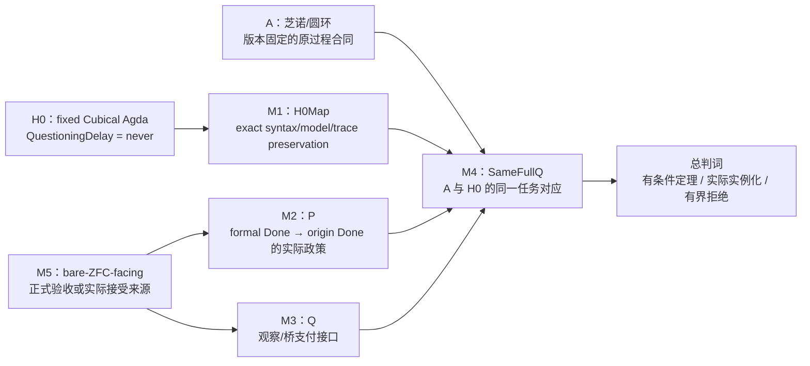

# ZFC-H0-FINAL-PROOF-CLOSURE-SOP：ZFC 的 Q/P/A/B 总形式化与机器证明闭环

> **身份：** `TASK_SCOPED_TOTAL_FORMALIZATION_AND_MACHINE_PROOF / F050 / RESEARCH_PROFILE_GOVERNED`。
>
> **稳定引用名：** `ZFC-H0-FINAL-PROOF-CLOSURE-SOP`。
>
> **启动原因：** 2026-10-04，研究发起人指出：不能把 H0→Z0 来源链的局部停止误写为“全部形式化和机器证明已经完成”。本 SOP 把总问题重新拆成可以完成、可以反驳、也可以如实保留未支付的证明义务。

## 1. 总目标与不允许的替代

研究发起人要求最大程度形式化并机器证明的结构是：bare ZFC 的理论观察力 `Q` 若不完备，会让数学共同体的实际使用引入数学幻觉 `P`；`P` 在芝诺/圆环侧给出想要的 `A`，又在 main 中固定的 HoTT `H0` 上产生不想要的 `B`；回溯 `B` 可发现 `P` 以及 `Q` 的缺失。

这不是下列较小结果中的任一个：

- 一个有限 `CompletionWorld` fixture 的 information-loss theorem；
- `SameFullQ`、`P`、`A`、`B` 已被假定后的条件性 `False`；
- 一份 Cubical Agda source/model 的一致性或空间语义；
- 一个实际来源没有提及 `H0`；
- 一个 HoTT-side coarse-completion 反例。

这些都是必要控制，但总交付必须回答它们如何被连接，或逐项给出为什么在精确范围内不能连接的有界结论。

## 2. 总证明义务图



### 2.1 已完成、尚未支付与不能偷换的内容

| ID | 义务 | 当前事实 | 还需要什么才算支付 |
|---|---|---|---|
| `M0-H0` | fixed `H0` 的内部数学核 | C-77–C-83，尤其 C-78，已由 Cubical Agda 机器检查；C-357/C-358 给粗完成和完成反射控制。 | 无需重做；以后只可引用固定版本与精确范围。 |
| `M0-A` | A 侧的数学/来源控制 | C-361/C-362 证明固定数列与固定 Norton/IEP completion-contract control 的逻辑后果。 | 一个版本固定的原芝诺/圆环 `State/Operation/Observation/OriginDone` 规格，且不能把 revised Done 偷换成它。 |
| `M0-B` | B 侧的 P 反例 | C-360/C-363 原生证明 fixed H0 的 coarse completion 不能给 original finite halt。 | 与 M1/M4 的跨理论对应。 |
| `M0-C` | 条件性政策 consequence | C-359 已证明：显式 `ZFCOneUse + SameFullQ + P + B` 导出 `False`。 | 不得再把这些字段当作已被 bare ZFC 或历史来源证明。 |
| `M1` | `H0Map` | 当前只定位了 CCHM family；没有 exact Cubical Agda 2.8.0 + cubical 0.9 library semantic transport。 | 逐字段 model map：universe、EM1/HIT、h-level、unguarded Delay、`never`、`runFor`、有限 halt witness；并证明需要的 preserve/reflect 命题。 |
| `M2` | 实际 `P` | 当前仅有 source-labelled revised-completion control 和 HoTT-side specific P counterexample。 | 一个来源或正式 policy 说明它在 A 侧实际允许 `FormalDone → OriginDone`，以及适用范围。 |
| `M3` | bare-ZFC-facing `Q` | C-364 只对一个 source-contract interface 证明观测不足；C-366 在冻结的外部 Zermelo-model interface 中以 sequence graph 正控制排除“集合论不能表示过程”的读法。bare ZFC 的 semantic completion interface 仍未定义。 | 固定 bare ZFC 的语言/模型/acceptance interface，并以可计算的 criterion 表达“观察、拒绝或支付 bridge”。 |
| `M4` | `SameFullQ` | 现有 A5 只拒绝了一个冻结来源分母中的强实例化。 | A 与 H0 在同一对象、输入、允许操作、观察量和 Done 条件上的逐字段对应，或精确证明同一任务不成立。 |
| `M5` | 对 bare ZFC 的归因 | 当前没有 ZFC 对象语言矛盾主张，也没有实际 `C_accept`。 | `T_meta`、额外公理、模型/验收器、I/O/Done、AdequacyLift 与来源/形式化证据。 |

## 3. 机器证明的三种等级

### 3.1 可以直接由内核完成的数学核

新命题必须有精确 claim、源码、运行收据和 claim-matrix 行。第一批只允许以下形式：

1. **H0 operational transport fragment：** 在一个明示的 target semantics 中定义 fixed `Delay/force/later/never/runFor` 的解释；证明它保留 `∀ fuel, runFor fuel never = nothing`，并明示它是否只覆盖 Delay fragment，还是覆盖 `QuestioningDelay` 的所有依赖。
2. **Policy adequacy theorem：** 给定 M1 的 preserve/reflect 条件、M2 的实际 policy 和 M4 的 task correspondence，证明最终 `QObservation` 或矛盾的精确逻辑后果。
3. **A-side process theorem：** 在冻结的过程规格中证明 `FormalDone`、`OriginDone`、bridge 或 bridge-failure；连续时间正控制必须与严格离散阶段模型并列，不能被删去。

这些定理的输入若是来源结论，必须在类型/结构中显式标为前提；proof assistant 不会替来源证明历史或共同体事实。

### 3.2 需要版本固定来源支付的桥

`H0Map`、实际 `C_accept`、`AdequacyLift` 与 A-side policy 必须来自可定位的模型/文献/正式系统，或者由本项目新建并清楚标为**本项目提出的模型**。后者可以支持“该模型的定理”，不能自动支持“bare ZFC 实际如此”。

### 3.3 不能靠机器证明自动决定的归因层

“bare ZFC 的理论精度不够”若不先定义 `QObservation` 的语义接口，就不是一个可输入证明器的单一命题。对一个具体定义，证明器可以检查其定理；它不能仅凭 ZFC 公理文本判断数学共同体的完成观或现实任务是否被忠实保留。

因此最终交付必须择一标注：

- `MACHINE_PROVED_CONSEQUENCE_WITH_SOURCE_CERTIFIED_PREMISES`；
- `MACHINE_PROVED_CONSEQUENCE_WITH_PROJECT_DEFINED_POLICY`；
- `ACTUAL_BARE_ZFC_INTERFACE_INSTANTIATED`；
- `ACTUAL_BARE_ZFC_INTERFACE_NOT_YET_DEFINED_WITH_SCOPE`。

前三者不能互相替代；第四者不是“ZFC 没问题”。

## 4. 执行顺序

### F0：总契约冻结与旧结论重分类

- 把 M0–M5 写入唯一 current owner、Feature、MEMORY 和本 SOP；
- 对 C-359–C-364 逐一标记它们支付的是哪一项，而不是把已有通用 fixture 再次包装成最终结果；
- 将 `SOURCE_ACCEPTANCE_UNDERDETERMINED_WITH_SCOPE` 改为 **H0→Z0 来源子图停止**，绝不作为总任务完成。

**F0 完成判据：** 后续每个 proof/source action 都能指向一个未支付 M-id；没有“再次写同一条件定理”充当进展。

### F1：fixed H0 的精确语义运输

1. 冻结 target calculus/model 与版本，而不是写“CCHM/HoTT”泛称；
2. 构造 feature coverage matrix：CCHM syntax、universe、EM1、suspension、truncation、coinductive record、guardedness、`Delay`、`runFor`；
3. 先做 `Delay` fragment 的 preserve/reflect theorem；它若无法延伸到 H0，必须明确标 `H0_OPERATIONAL_FRAGMENT_ONLY`；
4. 只有所有 H0 dependencies 被同一 map 覆盖时，才登记 `H0MAP_CANDIDATE`；
5. 每一缺口必须区分 source lack、model limitation、implementation/library gap 与未完成的新构造。

**F1 停止：** 一份 exact `H0Map` 被机器检查，或对一个固定 target 出现可复核的 `VARIANT_GAP_WITH_SCOPE`。后者只关闭该 target，不能关闭 M1。

### 每个难题的“先想、再查、再构造”闭环

每当 M1–M5 遇到新的数学、语义或证明器难题，先执行以下顺序，避免只靠模型记忆、也避免用文献标题替代独立判断：

1. **自己的问题分解：** 先写出当前未知的精确对象、想证明/反驳的命题、最小候选构造、可能失败点和反控制；这一步必须在读取新来源结论之前完成。
2. **学术与开源对照：** 再查一手论文、作者/项目文档、GitHub 的实现/issue/测试，以及相关开源 proof assistant/library 如何表达或限制同一构造。每份材料记录版本、确切支持范围、不能支持什么。
3. **差分裁决：** 比较本项目构造与外部做法：它们是同一 calculus、可翻译 fragment、不同的 guarded/un-guarded 理论，还是仅题材相似。相似名词不能支付 map。
4. **机器化：** 只有目标与差分清楚后，写入最小原生 theorem/negative control；运行、source manifest、claim row 和证据边界一起保存。
5. **认知闭包写回：** 把“自己的初始判断、外部来源/代码调查、获得或失去的路线、下一精确义务”写入本 SOP 的相关阶段、当前 F1–F4 audit、Feature/MEMORY/方向 owner。不能只留在对话或隐藏推理中。

这一循环不是“搜索到资料才可以思考”的门槛，也不允许以本项目的局部模型冒充学术界已给出的理论语义。

### F2：A 侧的真实过程合同

冻结一个来源版本和原过程版本，给出状态、动作、允许时间、观察和 `OriginDone`。连续 endpoint 与自然数步骤不是互斥前提，必须作为不同 model/contract 案例并列；任何从 source-derived `FormalDone` 到 `OriginDone` 的映射都要有定理或来源 payment。

### F3：`Q` 与 `P` 的 bare-ZFC-facing 接口

选择一个精确载体：已形式化的 ZF/ZFC object theory、明确额外公理下的 metatheory，或者来源所声明的 foundational acceptance interface。为它定义：

```text
Represent / FormalDone / OriginDone / Observe / Reject / BridgePaid / AdequacyLift
```

然后用正控制证明该接口能够在**某些**输入上保留 process contract，用反控制检验它是否会把 A/H0 的 relevant distinction 折叠。不得把“没有 time primitive”误作“不能编码时间”。

当前 C-366 已完成一个有界的前置正控制：固定 Foundation Lean 的 Zermelo model interface
可以表示 ordinal-indexed sequence graph 与唯一阶段值。它因此关闭的是“语言／集合表示完全缺失”的
路线，不是 M3 本身。下一份 M3 产物必须是版本固定的 `C_accept` 或 acceptance interface；若来源只
给出语言、模型、相对一致性或过程编码而没有 completion consumer，应以
`SOURCE_INTERFACE_UNDERDETERMINED_WITH_SCOPE` 结束该精确来源 target。

### F4：同一任务与最终合成

在 M1–M5 有实际支付的前提下，建立跨理论 `SameFullQ`；把 A、B、P、Q 放入同一个有来源的 policy object，调用或重构 C-359 的 consequence，并运行两种反控制：

1. `DifferentQ`：A/H0 映射少一个字段时，不允许传输 P；
2. `BridgePaid`：若实际 policy 支付 bridge，不允许导出矛盾。

## 5. 总完成条件与局部停止规则

总任务不得因一个模型论文、一个来源分母、一个 worker、一个 timeout 或一个 source gap 自动完成。只有以下任一情形才允许结束：

1. **实际正闭环：** M1–M5 全部有版本固定的证明或来源支付，最终 consequence 被相称 kernel 检查；
2. **实际有界拒绝：** M1–M5 的每一条候选 route 都有确定 target、search denominator、反控制与可重开条件，且结论只称为该分母内的 `ACTUAL_INSTANCE_REJECTED_WITH_SCOPE`；
3. **定义阻塞：** bare ZFC 的所指接口无法由用户/来源固定，记录 `FORMAL_TARGET_UNDERDETERMINED`，并保留已完成的条件性数学核，不把它标为问题已解决。

F1 的 source gap、F2 的来源缺口、F3 的 interface 未定义，都只是**分支停止**。它们会产生下一项构造或来源任务，而不是总任务完成。

## 6. 每个工作单元的自审

每次开始前后回答：

1. 这次支付 M0–M5 中哪一个未支付义务？
2. 这个结果是对象层定理、模型定理、来源事实、项目定义，还是归因判断？
3. 是否把一条条件前提偷偷变成事实？
4. 是否新增了 H0 的 exact map、A 的 exact contract、P/Q 的 actual policy 或 SameFullQ？若没有，为什么此动作仍然是必要的控制？
5. 若此动作失败，关闭的是哪个 target，下一条可验证路线是什么？

## 7. 直接调用

```text
按照 SOP=ZFC-H0-FINAL-PROOF-CLOSURE-SOP，继续推进，直至总证明闭环完成或达到该 SOP 的总完成条件。
```

该调用授权在现有项目范围内进行版本固定的来源核验、形式规格、原生证明器构造、运行收据、current-owner 写回和精确 Git 提交；它不授权把项目定义的 policy 冒充 bare ZFC、伪称来源或数学共同体已接受某结论、重写历史、tag/push之外的发布，或跳过机器证明门禁。
