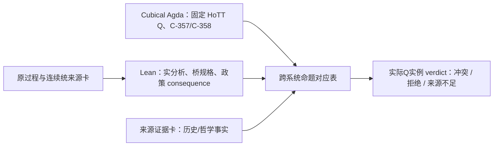

<!-- governance-shard:v2
logical_id: ZFC_Q_ACTUAL_INSTANCE_FORMALIZATION_SOP
shard_id: 002
index: ../ZFC实际同Q实例化与机器证明SOP.md
-->

# 来源绑定与跨证明器机器化

## 1. 候选 worktree 的准入与当前证据边界

`codex/zfc-observation-boundary-proof` 是 `CANDIDATE_NOT_CURRENT`。首次执行必须按 `P-FORGE-LITERATURE-BACKFLOW-AUDIT-SOP` 的 B0 delta 重新冻结：candidate ref/head、共同 base、当前 dev target、精确 selected/excluded commits、source/run manifests、dirty disposition和交接单。

没有 B0 delta 与 canonical integrator 的直接复核，不得把候选 Lean 代码、H087–H094 或其 App Server receipt 写成 current dev 的数学／来源结论。干净 integration worktree 只在用户已授权集成、且 current target OID 固定后创建；本 SOP 的普通执行不自动创建它。

## 2. 四份必须分别完成的来源卡

### A. 原圆环／芝诺过程卡

冻结一个版本固定的原过程，而不是把 Achilles、Dichotomy、圆环、`s_n` 和任意连续轨迹混用。卡必须给出：

```text
P / State / I / Op / F / O / OriginDone
M、N、原先已获得的状态、反向逼近与复原要求
哪些条件由用户原案给出，哪些是本轮解释，哪些尚需用户裁定
至少一个不要求最后离散步骤的连续端点正控制
```

这张卡的输出不是“现实物理已经证明离散”，而是当前实际任务的完成合同。若没有足以固定 `OriginDone` 的原案材料，必须停在 `USER_DONE_ADJUDICATION_REQUIRED`。

### B. ZFC 支撑连续统解法来源卡

固定一份来源级 `C/I/O/Done`：其理论层、ZFC/Choice/集合论基础措辞、实数／极限模型、过程表示、解决声明、`originalResolved` 或 `revisedResolved`、实际 bridge／显式 Done 改写，以及来源自身的保留条件。

IEP、Bathfield、Norton、SEP 或其它资料不能只凭名气进入卡。每个引用须给 URL／版本／时间／段落定位，明示它证明什么、不证明什么。特别检查：

```text
数学 completion 是否只被定义为 limit/endpoint；
来源是否明说修改 Done；
来源是否声称解决原任务，还是只提出更强/更适用的重构；
来源是否给同一 State 上的 preservation / payment；
反控制是否已经提供 closed-time endpoint 或显式 bridge。
```

### C. 固定 HoTT Q 卡

锁定 exact calculus、Agda/Cubical 版本、`QuestioningDelay` 源码、输入 `Type ℓ-zero`、judge 参数、`never/¬Halts` 命题、已有 C-357/C-358 控制和现实解释层。卡必须分开：

```text
kernel theorem        : 形式演算内实际证明了什么；
process specification : 程序的 State/I/Op/O/Done；
UR interpretation     : 用户的“本来简单”判词和它的来源；
foundation comparison : 哪一个模型/验收来源实际消费这项 Q。
```

若模型来源只覆盖另一套 Martin-Löf/univalence 规则、或根本没有过程完成接口，记录 `EXACT_Q_THEORY_VARIANT_NOT_BRIDGED`；不能把近似模型视作同一 Q。

### D. 基础验收政策卡

这是本 SOP 最容易被虚构的一张卡。它必须从实际来源得到：

```text
Policy owner / theory layer / admissible inputs / output judgments
何时声称 originalResolved、revisedResolved 或 bridgeRequired
AdequacyLift / VisibilityPolicy / Payment 的来源文字或形式规则
为何该政策同时适用于 Zeno 侧和 HoTT 侧
```

若来源只是证明相对一致、给出一个模型、描述可表示性或报告一个 proof assistant check，却没有消费固定 Q 的 completion contract，则 verdict 是 `SOURCE_POLICY_UNDERDETERMINED`。不得用研究者自己定义的 `QUniform` 替代政策 owner。

## 3. 跨证明器架构



1. **Cubical Agda**拥有 HoTT 规则、`QuestioningDelay`、原 universe Q 与截断控制的数学命题。它不能被普通 Lean `Eq`、Python 枚举或收据文本替代。
2. **Lean/Mathlib**拥有固定实分析序列、连续端点正控制、bridge 规格和政策 consequence。它不证明 Cubical Agda 内部定理或历史来源内容。
3. **跨系统命题对应表**逐项写出 Agda theorem、Lean proposition、语义翻译、保持方向、未证明项和反控制。它不是跨 kernel 的自动证明；任何需要将 Agda theorem 作为 Lean 假设的步骤都必须显式标为 `EXTERNAL_FORMAL_RESULT_ASSUMED_WITH_RECEIPT`，不得称为单一 kernel proof。
4. **来源证据卡**认证来源“说了什么”，由版本固定原文和人工审计承担。Lean 只能对编码后的 proposition 推理，不能证明 IEP 或数学共同体的历史文字为真。

## 4. 允许的最终机器定理形状

最终 proof package 必须把每条前提显式写在 theorem statement 中。允许的形状例如：

```text
actual_Q_policy_conflict :
  SameActualQ zeno hott →
  SourceJudgment zeno originalResolved →
  SourceJudgment hott bridgeRequired →
  SourceOwnedQUniform policy →
  ¬ QUniform policy
```

如果 `SameActualQ`、`SourceJudgment` 或 `SourceOwnedQUniform` 只能来自外部来源卡，机器证明的交付用语必须是：

```text
MACHINE_PROVED_CONSEQUENCE_WITH_SOURCE_CERTIFIED_PREMISES
```

不能称为“内核证明了历史来源／数学共同体／ZFC 已经异判”。要达到无前提的对象语言定理，必须另行形式化相应理论、语义和来源断言；这不是通过隐藏假设可以取得的成果。

## 5. 必要控制

| 控制 | 必须防止的误报 |
|---|---|
| 闭连续时间端点 | 从自然数编号的无末阶段错误外推为连续模型不可能到达。 |
| 显式 `CompletionBridge` | 用共享“完成”字样代替保持证明。 |
| `revisedResolved ≠ originalResolved` | 将来源的 Done 改写误报为原任务解决。 |
| payment 不同的 coarse profile | 将“都谈 bridge”误报为同 Q 异判。 |
| `SOURCE_UNOBSERVED` 独立于 `SOURCE_REFUTED` | 把未找到来源的字段编码成 false。 |
| exact-theory-variant control | 把 KLV 或相邻 cubical 模型当成本项目 exact HoTT Q 的模型。 |
| actual-policy-owner control | 用研究者定义的 `QUniform` 伪装成 ZFC 或数学共同体的政策。 |

任一控制通过都可能使候选缩小或拒绝；这属于本 SOP 的成功产出，而不是失败。
