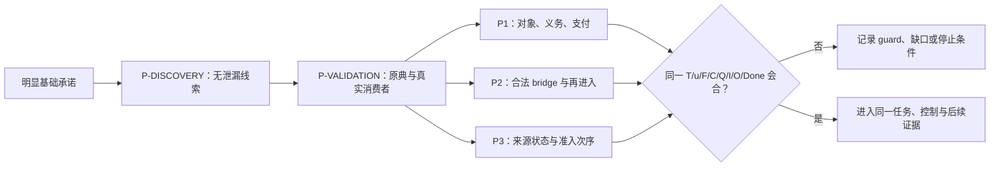

<!-- governance-shard:v2
logical_id: PATTERN_P_TOOL_SYSTEM_PHILOSOPHY
shard_id: 001
index: ../刀具系统理念.md
-->

# 原初张力、三刀与锻造路线

> **身份：** `CONCEPTUAL_MAP / REUSABLE_METHOD_GUIDANCE / NOT_A_THEORY_VERDICT`。
>
> **读者的问题：** 我为什么正在用 P1、P2、P3，而不是把任何自指、任何耗时程序或任何不直观的结论叫作“罗素式问题”？这份地图给出回答，并把每个回答指回可复算的原始来源与当前合同。

## 1. 四层权威：不要把来源、理念、规格和结果混在一起

| 层 | 它回答什么 | 当前 owner |
|---|---|---|
| 用户原文 | 研究发起人究竟提出了什么张力、目标与方法要求？ | [S07：论域元素与存在性追问](<../../sources/prompts/Claude-罗素原则P1至P3-用户原文-20260926.md>)、[S08：算符先行于存在性落定](<../../sources/prompts/GLM-算符先行于存在性落定-用户原文-20260926.md>)、[2026-10-02 后续理论靶原文](<../../sources/prompts/Codex-后续理论靶与罗素模式P-用户原文-20261002.md>)、[一遍匹配原文](<../../sources/prompts/Codex-模式P与一遍匹配-用户原文-20261002.md>)。 |
| 本文 | 为什么这些原文后来分化为三把不同的刀，以及下一位研究者应怎样重新进入工作。 | 本分片。 |
| 当前方法规格 | P1/P2/P3 的字段、guard、控制、MatchTrace、TaskCard 和 NodeCard 到底是什么。 | [三把刀总索引](<../模式P三把刀.md>)、[动态 DAG SOP](<../模式P动态DAG调度.md>)。 |
| 对齐与运行证据 | 原初要求是否被实际实现、何处发生偏差、当前实验只支持到什么范围。 | [全历史逐段审计](<../../audit/20261002-P-DAG-刀具系统全历史逐段对照审计.md>)，尤其是其 [来源与 Git 谱系片](<../../audit/20261002-P-DAG-刀具系统全历史逐段对照审计/006 - 可重算来源清单、Git谱系与新刀具出生审计.md>)。 |

原文是用户意图的权威；本文不能改写它。当前刀具文件是可修订的技术规格；它们不能倒推用户原来只说了某个字段。一次 worker 输出、一个 commit 或一个机器证明各自只支持它们明确记载的事实。

## 2. 这套刀具首先要找的是什么

研究对象不是“任意惊人的数学现象”，也不是从菲尔兹奖论文、应用领域或一段 AI 幻觉中挑一个题目。起点是支撑大块数学、甚至承担基础职能的理论；它应有一个像实数连续统、朴素集合论的无限制理解，或 HoTT 的显眼基础接口那样无法绕开的核心承诺。菲尔兹奖和其它论文可以提供原典、消费者或对照，但不是靶点资格的门槛。

这给出两条必须同时保住的工作意识：

1. **从明显位置起步。** 不用遍历理论及其所有衍生细节。先问：理论已经原生承诺了什么一等对象、形成接口或使用接口？
2. **位置不是结论。** 选中一个位置只是一条可检验线索。它仍要经同一任务、真实消费者、来源、反控制和必要的形式或运行证据核验，才能谈理论级问题。

模型已有的数学知识在这里有受限作用：它可以在无答案泄漏的 `P-DISCOVERY` 中提出一个 `MODEL_RECALL_SITE_CANDIDATE`。这是一种条件性的模式匹配启发式，既不读取模型权重，也不承诺一遍必定成功，更不免除原典验证。它的价值在于把“先看哪里”从无边界搜索变成一个可被反证和校准的首轮猜测。

## 3. 罗素“最后一跃”的计算张力

原初张力不能缩写为“有自指”“有无限集合”或“程序没有停机”。更忠实的最小骨架如下，其中每一条都还需要在具体理论和同一任务中被来源填实：

```text
u 的形成／合法身份仍待落定
    ↓
理论的形成规则或算符已经把 u 当作可讨论、可操作或可判断的对象
    ↓
同一工作流又必须追问 u 是否已取得进入论域／接受算符的资格
    ↓
如果这个追问通过同一对象重新进入，并且不能由该任务的完成条件正常清偿，
就出现需要严查的“最后一跃”压力。
```

用人话说：**理论正在使用一个尚未获得可被这样使用的资格的对象。** 罗素的研究价值不只在最终写出矛盾式，而在于它让“形成、使用、身份确认、再进入、完成”这几步彼此纠缠。S07 提出论域元素的存在性不能被理论完全外置；S08 指出，在对象 `S` 的存在性尚是问题时，算符已经把 `S` 放进成员关系的讨论。

这仍不是关于任何后继理论的数学定理。一个候选只有在下列情况同时可由来源和同一任务说明时，才构成罗素式压力候选：

- `u` 确是理论不应任意外置的一等对象；
- 形成、判断或算符的边都落在同一层，而不是把元语言、证明器或外部程序拼进来；
- 追问是消费者的正完成义务，或形成自身尚未支付的完成义务，而不只是一个可正常回答 `false` 的谓词；
- 同一对象的再进入、上升或依赖循环有精确 bridge；
- 理论没有已给的 witness、构造子、定理前提、层级 guard 或 completion certificate 直接付清这项义务。

`RK-0` 是把上述共同骨架写成可校准字段的共享砧座：`Domain → Bind/Form → Promote → Bridge → Reenter → Update → Done`。它服务 P1/P2/P3 的共同校准，不是第四把刀；完整边界由 [罗素最后一跃共享内核](<../模式P三把刀/011 - 罗素最后一跃共享内核.md>) 拥有。

## 4. 为什么必须有三把不同惯性的刀

同一张力需要三种不同的问法。让其中一把承担全部工作，会把“选中位置”“语言上像反馈”“构造顺序不舒服”误当成同一事实。

| 刀 | 原初问题 | 它自然怎样继续被打磨 | 它必须拒绝什么 |
|---|---|---|---|
| **P1：理论位置与使用次序** | 理论内哪个显眼的对象／形成接口真正进入了一个同层任务？该任务提出的 `Q` 是未支付义务吗？ | 改进对象层资格、consumer 合同、同一任务、义务模式、支付扫描、相邻位置与 discovery/validation 的分段。 | 把 `Ord/V`、外部模型、裸关系符号、局部编码、来源已付款的构造，或研究者新造的 checker 当成理论的 `Q`。 |
| **P2：计算—逻辑翻译** | formation 如何经过合法 binder、bridge 与 reentry 回到同一对象／判断？极性、类型或层级在哪一步阻断？ | 改进可类型化 IR、最小 rewrite、方向、polarity、guard、oracle 与消融。 | 任意固定点、否定号、编码或单向语义桥都被叫作同对象反馈。 |
| **P3：构造状态与准入次序** | 对象处于 `Draft/NeedBuild/NeedEval/Admitted/OperatorUse` 的哪个状态？操作是否在资格尚未取得前使用它？ | 改进来源定义的状态、前置条件、transition、same-object dependency、完成判据，以及静态理论与外部构造解释之间的 `ConstructionBridgeCard`。 | 从静态存在公理、普通递归、外部程序耗时或哲学直觉补造运行时状态环；把有限实现偷换为任意理论对象。 |

P2 把张力翻译成语言上的可检查结构；P3 直接盯住“尚未落定却已被使用”的次序。因此 P3 不是 P2 的装饰，P2 也不能用 P3 的直觉补齐缺失的 bridge。P1 先找到可能的基础位置，但 P1 选中位置同样不能替 P2/P3 宣布会合。

每把刀的当前字段、正负控制和停止条件都由 [P1](<../模式P三把刀/001 - P1 理论位置与使用次序定位.md>)、[P2](<../模式P三把刀/002 - P2 计算—逻辑翻译.md>)、[P3](<../模式P三把刀/003 - P3 构造状态与准入次序.md>) 拥有；三刀相互影响的可追溯过程由 [打造过程与横向比较](<../模式P三把刀/004 - 打造过程与横向比较.md>) 拥有。

## 5. 案例是锻造材料，不是三把刀的同义词

用户提出芝诺、圆环、朴素集合论、HoTT 与 ZFC，是为了让工具面对不同类型的承诺和过程，而不是要求每个案例都被三把刀正向命中。

| 案例／领域 | 对锻造的主要贡献 | 必须防止的偷换 |
|---|---|---|
| **芝诺与实数／极限** | 提醒选靶应是基础理论；考察“把过程压成极限完成”是否改变了原来的完成任务。 | 把运动、时间连续性和一次程序的耗时混为一谈。 |
| **圆环悖论** | 使芝诺的幽灵回到具体的逼近、复原与“此前已得到 `M`”问题，防止精化模型篡改原任务。 | 把圆环只缩成标签、来源字段或一般信息丢失。 |
| **朴素集合论／罗素** | 为 formation、promotion、same-object reentry 与负性提供脱敏正控制；它检验 P 能否看见“最后一跃”的逻辑骨架。 | 把该正控制直接投射为 ZFC 的矛盾或 P3 的已验证状态循环。 |
| **HoTT** | 是重放与 holdout：检查 P 能否在不偷看既有答案时重抓理论自身的可审视位置，并分开 P1、P2、P3。 | 用旧项目答案、库实现现象或一次盲测取代同一现实任务与来源核验。 |
| **ZFC／Power Set** | 是共同锻造的实际首焦点：Power Set 因明显基础承诺被选中，随后检验三刀能否在同一卡会合。 | 把“所有子集一次交出”、普通 membership、proof-system Done 或一个外部算法的循环直接叫作 `Q`。 |

因此，案例能给一把刀正控制、给另一把刀负控制或根本不适用。保留这种不对称正是防止“每个案例都证实同一种故事”的方法。完整案例矩阵在 [005](<../模式P三把刀/005 - 案例校准矩阵.md>)；夹具和验收分别在 [006](<../模式P三把刀/006 - 第一轮锻坯与校准夹具.md>) 至 [008](<../模式P三把刀/008 - 全部打造验收.md>)。

## 6. 发现、验证与共同锻造是一条链，不是一次回答



`P-DISCOVERY` 的工作是让模型在受控输入下说明“为什么这个明显位置值得继续查”；它可以返回无候选。`P-VALIDATION` 才能引用版本固定的来源，填入 `C/I/O/Done`，检查形成是否已付清 `Q`，并给出 `MatchTrace`。公开 `MatchTrace` 是可复核的 source→字段→选择→最小推演→相邻淘汰→反事实说明，不是索取或转录隐藏思维。

“三刀锻成”在本项目中不是三份文件都写好了，而是它们在同一冻结的 `T/u/F/C/Q/I/O/Done` 上会合，给出一个还要继续审查的共同问题。当前事实是：Power Set 保持 `ZFC_SITE_SELECTED`，而非 `ZFC_Q_LOCATED`；裸 Power Set 卡、Gemini proof-search 叙事和忒修斯历史身份卡都没有填出共同 `Q`。这是一组有界控制结论，不是“ZFC 没有问题”。当前差距和可重开条件由 [ZFC 共同锻造合同](<../模式P三把刀/009 - ZFC共同锻造与成功判据.md>) 与对应审计拥有。

## 7. 动态 DAG：让不同证据进入正确的位置

三把刀的不同惯性意味着它们不必由同一个 worker、同一份可见材料或固定顺序处理。动态 DAG 的价值不在于增加代理数量，而在于使下列差别显式可控：

- 哪个节点必须保持 blind，哪个节点必须读固定原典，哪个节点可读项目证据或网络；
- P1 的父卡如何冻结，避免 P2/P3 重新选择对象后伪装成验证；
- 什么样的来源、字段、任务或 guard 冲突才值得启动有限 Battle；
- Master 的判断如何被一手来源、保存运行和同一任务控制反过来质询；
- 长时间推理如何以观察记录而不是自动墙钟中断处理。

NodeCard 决定实际模型、权限、可见输入、终态与收据；TaskCard 决定共同的 `T/u/F/C/Q/I/O/Done`。一次 Battle 的一致性不是裁决，更不能产生数学结论。具体权限、隔离、观察、trajectory 和停止合同由 [动态 DAG SOP](<../模式P动态DAG调度.md>) 与项目 Skill 拥有。

## 8. 新刀具的出生：先问旧刀能否忠实容纳

三把刀的惯性会塑造它们看得见的花纹宇宙，但这不预设 P1/P2/P3 已经穷尽一切模式。遇到新花纹时，先用 `Tool-BirthCard` 对 P1/P2/P3 分别尝试映射：对象、过程、观察和 `Done` 是否都保持原意？若强行映射会不会扭曲其中之一？

| 判词 | 下一步 |
|---|---|
| `OLD_TOOL_FIELD_GAP` | 旧刀可以表达，只是字段、prompt、来源卡或验收漏了；修旧刀并做同卡回归。 |
| `DERIVED_TOOL_CANDIDATE` | 责任发生在多把刀的交界，但基本判断仍可还原；先写派生合同和正负控制，不自动编号。 |
| `UNCONTAINED_PATTERN_CANDIDATE` | 最小理论判断职责无法忠实映射到三刀，且正负控制、来源／worker 计划和 Git 谱系都齐备；才可提出新编号。 |
| `NOT_ENOUGH_EVIDENCE` | 新花纹没有得到同一任务的来源和控制支撑；保留可重开条件，不制造 P4。 |

这使“新刀”成为一个新增且不可还原的判断职责，而非一个新比喻或一次不满意的输出。忒修斯之船／历史身份对 Power Set 的探索目前停在 `NOT_ENOUGH_EVIDENCE`：snapshot-loss 合成正控制被 history-preserving 负控制解除，实际来源与 NFA 消费者也没有给出以历史身份为完成条件的同层任务。完整规则和证据边界在 [新刀具出生与花纹宇宙合同](<../模式P三把刀/012 - 新刀具出生与花纹宇宙合同.md>)。

## 9. 下一位研究者怎样继续，而不重演已知偏航

| 你要做的事 | 最小读取链 | 首个问题 |
|---|---|---|
| 新开或恢复 P-DAG 节点 | 本文 → 动态 DAG SOP → 当前 TaskCard → 相关单刀 | 这个节点是在为 P1、P2、P3、来源、控制还是 Battle 补哪一个明确缺口？ |
| 修改一把刀 | 本文 → 对应单刀 → 004 横向过程 → 005 自审 SOP → 同卡控制 | 这是原初理念被挑战，还是旧规格／prompt／来源／runner 漏掉了原来已经要求的条件？ |
| 提出新刀 | 本文 → 012 Tool-BirthCard → 正负控制 → 全历史审计 006 | 旧刀的哪一项判断职责必然扭曲这个花纹？这个花纹能给同一理论卡增加什么不可还原的判别？ |
| 宣称“P 已实现／原初讨论已对齐” | 本文 → 全历史审计全部分片 → 原始来源 → 当前 Git/运行收据 | 这句主张覆盖哪一段来源分母？它是否把后来的修复倒灌给较早阶段？ |

每个自然锻造单元仍要写 delta `SelfAuditCard`：原初要求、实际动作与证据、对齐判词、偏差类型、修复或停止、可推翻条件，以及花纹宇宙／Tool-BirthCard 判断。创建或退休工具、改变成功定义、改变 actor/隔离/证据架构、HoTT—ZFC 转移，或用户要求时，才重做 full origin audit。详细节奏由 [P-DAG 自审 SOP 005](<../模式P动态DAG调度/005 - 原初理念对照、自审与偏差处置.md>) 拥有。

## 10. 来源分母和维护规则

本地图不复制全部对话。其可复算来源分母是 13 份原初用户 source 与 5 份直接会话档案；完整 SHA-256、行数、字节数、逐 source unit 的进入／排除理由和 Git 谱系都在 full audit 006。持续追加的 U archive 以冻结 prefix 而非不断增长的全文件作为本轮分母；cutoff 后的新内容必须先重新资格化，不能自动倒灌进 U1–U19。未来若其中任一冻结 slice 的 hash 改变，须先按下列命令确认分母并重做受影响的审计，而不是凭旧摘要续写：

```text
python3 -B scripts/audit/verify_pattern_p_tool_history_sources.py --root . --json
```

本文只在两种情况下更新：用户直接修正这套工具的原初理念／使用方式，或新的可审计来源要求修正这里的概念地图。新运行结果、一个候选理论位置或某次 NodeCard 的状态，应首先写回各自的刀具、审计和证据 owner；不能把本图变成第二份当前状态账本。
