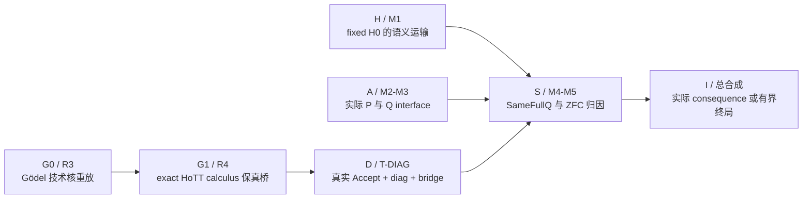

<!-- governance-shard:v2
logical_id: GODEL_ZFC_CONVERGENCE_SOP
shard_id: 002
index: ../哥德尔式ZFC理论精度收敛闭环SOP.md
-->

# 路线图、最小单元与证据产物

## 1. 路线图



图表示逻辑依赖，不强迫所有路线串行。H 路线可以为 fixed H0 提供语义材料，G0/G1/D 可以独立建立哥德尔式资格核；总合成 I 只能在必要 bridge 实际支付后发生。

## 2. 路线登记表

| Route | 要回答的精确问题 | 最小可验单位 | 合法局部结果 | 失败后必生 successor |
|---|---|---|---|---|
| `G0-R3` | 一个有效、版本固定的对象理论能否完整重放 Gödel式 coding、proof predicate、substitution、diagonal 与独立句？ | `R3-SOURCE-REPLAY-001`：选择一份已有形式化，固定 source/toolchain，重放 theorem 与 assumptions | `R3_REPLAYED_WITH_SCOPE`，或 `R3_SOURCE_VARIANT_BLOCKED_WITH_SCOPE` | 切换到第二个已登记 source/theory；不能把重放阻塞称为 Gödel机制不存在 |
| `G1-R4` | R3 的每项义务是否能保真落在一个明确 HoTT calculus，而非只在宿主 proof assistant 中存在？ | `R4-HOTT-CALCULUS-BRIDGE-001`：建立 H-SYNTAX 至 H-EFFECTIVITY 矩阵并逐项回源 | `HOTT_GODEL_BRIDGE_PARTIAL`、`GENERIC_GODEL_BOUNDARY_WITH_HOTT_INSTANCE` 或精确缺口 | 更换 exact calculus、补对象层表示，或把一般机制留在 G0 并转向 H 路线；不能把 host code 当对象层 proof |
| `D-TDIAG` | 一个真实的理论／来源 acceptance interface 是否支付 `Code`、`Accept`、`diag`、`Bridge` 与同一任务？ | 一个 `AcceptanceInterfaceCard` 加 `DifferentTask`、`BridgePaid` 控制及相称 kernel theorem | `DIAGONAL_BOUNDARY_MACHINE_PROVED_WITH_SCOPE` 或某一前提未支付 | 切换 source consumer 或明确标 `ACCEPT_INTERFACE_NOT_SOURCE_PAID`；禁止手造 consumer 继续称“实际接口” |
| `H-M1` | fixed Cubical Agda H0 的 `Delay/runFor/never` 与必要 universe/HIT/coinduction 结构，能否进入 exact ZFC-related semantics/model？ | 一个 target 的 feature coverage、最小 transport theorem 或 exact variant-gap receipt | `H0MAP_FRAGMENT_MACHINE_PROVED`、`H0MAP_CANDIDATE` 或 target-specific gap | 转向另一 exact target，或补一个可检查 fragment；不因一个 compiler/variant gap 停止 M1 |
| `A-M2/M3` | 真实来源是否把形式 completion 提升为原过程 completion？哪个 ZFC-facing interface 实际观察／拒绝／支付此 bridge？ | `CompletionAcceptanceCard`：`Represent/FormalDone/OriginDone/Observe/Reject/BridgePaid/AdequacyLift` 加来源卡 | source-paid policy、source-bound rejection 或 interface underdetermination | 选择不同正式 interface/actual source；不能由语言能表示过程或不存在 time primitive 直接下结论 |
| `S-M4/M5` | A、H0、P、Q 是否真是同一任务，且 bare ZFC 的归因是否被实际来源／形式接口支付？ | `SameFullQCard` + exact correspondence + C-359 类 consequence 的前提实例化 | `ACTUAL_POLICY_CONSEQUENCE`、`SAME_FULL_Q_REJECTED_WITH_SCOPE` 或 attribution underdetermined | 按缺失字段换 task/source/model；不能用旧 fixture 抵消未付 bridge |
| `I-SYNTHESIS` | 已完成路线如何共同决定最终判词？ | 全路线 reconciliation + proof/source matrix + independent control scan | 三种总终局之一 | 若任一路线未结算，返回其 unique successor，禁止写 `TOTAL_CLOSED` |

## 3. 每个最小单位必须交付什么

每一单位不是“读了一些文献”或“跑了一次命令”，而是一个 `RouteUnitRecord`。它保存在对应 audit/claim/run owner，并在 [GODEL-ZFC-CONVERGENCE-001](../../认知闭包/GODEL-ZFC-CONVERGENCE-001.md) 留下简洁索引。必填字段：

```text
unit_id                 稳定身份
route / M-or-R-id       它支付或审计哪一条路线
parent_gap              上一单位留下的精确未知
fixed_target            theory / calculus / source / version / interface
own_construction        先于新来源阅读的对象、命题、反证设想
source_and_open_code    一手来源、源码、版本、实际支持范围
same_task_contract      输入、操作、观察、Done 与编码关系
machine_target          精确 theorem，或为何本单位没有机器 theorem
controls                DifferentTask / BridgePaid / positive / negative controls
verdict_scope           结果只覆盖什么
successor               下一条唯一的、改变判别面的路线
reopen_if               哪个新证据会使此 verdict 失效
```

若单位只得到“当前 compiler 无法运行”或“该 source 没有此字段”，也必须填 `fixed_target`、实际错误／检索分母、没有支持什么、以及 successor。否则它不能关闭任何路线。

## 4. 当前调度原则

### 4.1 首个 Gödel单位

当本 SOP 被显式启动时，若没有一个已进入 `ACTIVE` 状态且有未完成 `RouteUnitRecord` 的单位，则先执行 `G0-R3-SOURCE-REPLAY-001`。它直接检验哥德尔机制本身，避免把 M1 的某个语义 compiler gap误读为哥德尔路线无路可走。

建议的优先顺序是：

1. 已冻结的 Coq synthetic incompleteness replay；
2. Kirst–Peters 的 Robinson Q formalization；
3. `agda-godel-tree`；
4. Lean Foundation differential holdout。

选择依赖当前可重放 toolchain 与 source closure，不依据理论名气。若首选无法资格化，记录其精确原因后立刻进入下一项，而不做无界环境修复。

### 4.2 与 H0–Z0 当前工作面的关系

如果恢复时已存在版本固定、由本任务 writer 持有、尚未完成的 M1 `RouteUnitRecord`，应先完成或安全交接该单位；若它属于另一 writer 的 dirty worktree，只读登记其 identity 和状态，不覆盖、不混入本任务 commit，然后启动独立的 G0 单位。工作树 dirty 不能被提升为 version-closed evidence，也不能成为无限等待理由。

### 4.3 非饥饿规则

G0/G1/D 与 H/A/S 都是父结果的必要视角。一条路线连续产生 scoped local closures 而没有改变总图时，下一自然单位必须从另一个 READY 路线选择，除非 dependency graph 明确表明其无输入。这样“修 H0 map”不会无限取代哥德尔核，“重放 Gödel”也不会无限取代 ZFC 实际接口。
